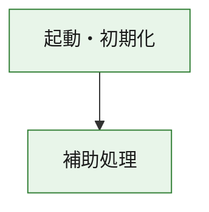
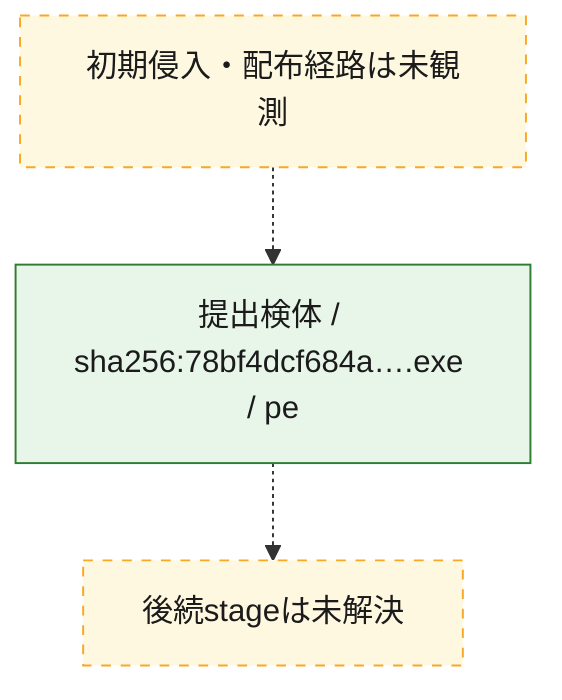
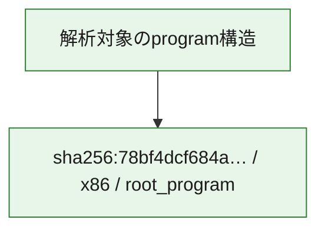

# 全体ロジック：78bf4dcf684abe1c8b61917d1b9848dc7245e0273c93c00b3914c1bed8daf938

代表関数の静的証跡から、起動・初期化の処理群を確認しました。

## 読み方

- phaseの掲載順は解析上の整理順です。observed_call_edgesがない段階間の実行順を断定しません。
- 図の実線は静的に観測した関係、点線と黄色のノードは未観測・未解決の関係を示します。
- 図は静的な要約であり、動的実行を再現するものではありません。
- 詳細な関数解説とfingerprintは[STATIC-LOGIC.md](STATIC-LOGIC.md)を参照してください。

## 静的可視化

### 実行フロー

### 感染チェーン

### モジュール関係

## 処理段階

### 1. 起動・初期化

entry pointから初期化と後続処理への移行を確認します。
確度: `confirmed_static_function_evidence`

- `78bf4dcf684abe1c8b61917d1b9848dc7245e0273c93c00b3914c1bed8daf938:ghidra:180001010` — 初期化と主要処理への分岐を行う入口関数です。 状態: `succeeded`、選定理由: `entry_point`, `meaningful_symbol_name`, `reviewed_call_centrality:22`, `role:entrypoint`, `small_program_complete_context`

### 2. 補助処理

主要処理を支える一般内部関数またはlibrary処理を確認します。
確度: `confirmed_static_function_evidence`

- `78bf4dcf684abe1c8b61917d1b9848dc7245e0273c93c00b3914c1bed8daf938:ghidra:180001240` — 検体内部の一般処理を実装する関数です。 状態: `succeeded`、選定理由: `context_representative`, `reviewed_call_centrality:2`, `small_program_complete_context`
- `78bf4dcf684abe1c8b61917d1b9848dc7245e0273c93c00b3914c1bed8daf938:ghidra:180001350` — 検体内部の一般処理を実装する関数です。 状態: `succeeded`、選定理由: `context_representative`, `reviewed_call_centrality:25`, `small_program_complete_context`
- `78bf4dcf684abe1c8b61917d1b9848dc7245e0273c93c00b3914c1bed8daf938:ghidra:180003780` — 検体内部の一般処理を実装する関数です。 状態: `succeeded`、選定理由: `context_representative`, `reviewed_call_centrality:2`, `small_program_complete_context`
- `78bf4dcf684abe1c8b61917d1b9848dc7245e0273c93c00b3914c1bed8daf938:ghidra:1800038e0` — 検体内部の一般処理を実装する関数です。 状態: `succeeded`、選定理由: `context_representative`, `reviewed_call_centrality:2`, `small_program_complete_context`

## 観測したcall関係

- `78bf4dcf684abe1c8b61917d1b9848dc7245e0273c93c00b3914c1bed8daf938:ghidra:180001010` → `78bf4dcf684abe1c8b61917d1b9848dc7245e0273c93c00b3914c1bed8daf938:ghidra:180001240` （`startup` → `support`）
- `78bf4dcf684abe1c8b61917d1b9848dc7245e0273c93c00b3914c1bed8daf938:ghidra:180001010` → `78bf4dcf684abe1c8b61917d1b9848dc7245e0273c93c00b3914c1bed8daf938:ghidra:180001350` （`startup` → `support`）
- `78bf4dcf684abe1c8b61917d1b9848dc7245e0273c93c00b3914c1bed8daf938:ghidra:180001350` → `78bf4dcf684abe1c8b61917d1b9848dc7245e0273c93c00b3914c1bed8daf938:ghidra:180001240` （`support` → `support`）
- `78bf4dcf684abe1c8b61917d1b9848dc7245e0273c93c00b3914c1bed8daf938:ghidra:180001350` → `78bf4dcf684abe1c8b61917d1b9848dc7245e0273c93c00b3914c1bed8daf938:ghidra:180003780` （`support` → `support`）
- `78bf4dcf684abe1c8b61917d1b9848dc7245e0273c93c00b3914c1bed8daf938:ghidra:180001350` → `78bf4dcf684abe1c8b61917d1b9848dc7245e0273c93c00b3914c1bed8daf938:ghidra:1800038e0` （`support` → `support`）
- `78bf4dcf684abe1c8b61917d1b9848dc7245e0273c93c00b3914c1bed8daf938:ghidra:180003780` → `78bf4dcf684abe1c8b61917d1b9848dc7245e0273c93c00b3914c1bed8daf938:ghidra:1800038e0` （`support` → `support`）
- `ghidra-function:68aac20e4f5a90a656d49a6f` → `ghidra-external:0569cac4f48a9d3684cd6158` （`unclassified` → `unclassified`）
- `ghidra-function:68aac20e4f5a90a656d49a6f` → `ghidra-external:0cfcb83a6bbaad5b92c9f4ea` （`unclassified` → `unclassified`）
- `ghidra-function:68aac20e4f5a90a656d49a6f` → `ghidra-external:142e7be958e75a8b979733b6` （`unclassified` → `unclassified`）
- `ghidra-function:68aac20e4f5a90a656d49a6f` → `ghidra-external:1f02c791c4e90444acf9eb9c` （`unclassified` → `unclassified`）
- `ghidra-function:68aac20e4f5a90a656d49a6f` → `ghidra-external:238c0f8b8091a4932a47a169` （`unclassified` → `unclassified`）
- `ghidra-function:68aac20e4f5a90a656d49a6f` → `ghidra-external:348e712697a5bff7d3fa5353` （`unclassified` → `unclassified`）
- `ghidra-function:68aac20e4f5a90a656d49a6f` → `ghidra-external:37788aeb8ba2ea28d8345824` （`unclassified` → `unclassified`）
- `ghidra-function:68aac20e4f5a90a656d49a6f` → `ghidra-external:509065226f6a465896903f6b` （`unclassified` → `unclassified`）
- `ghidra-function:68aac20e4f5a90a656d49a6f` → `ghidra-external:52328b38ff93636465f1acca` （`unclassified` → `unclassified`）
- `ghidra-function:68aac20e4f5a90a656d49a6f` → `ghidra-external:56a754db8325c3c9eb4e500a` （`unclassified` → `unclassified`）
- `ghidra-function:68aac20e4f5a90a656d49a6f` → `ghidra-external:5c591ff93754db75ce8b2655` （`unclassified` → `unclassified`）
- `ghidra-function:68aac20e4f5a90a656d49a6f` → `ghidra-external:6f7ba2e13912570f9579b022` （`unclassified` → `unclassified`）
- `ghidra-function:68aac20e4f5a90a656d49a6f` → `ghidra-external:719524e65a39d8dc3da36bf5` （`unclassified` → `unclassified`）
- `ghidra-function:68aac20e4f5a90a656d49a6f` → `ghidra-external:75a888e005fc68890ffa0a56` （`unclassified` → `unclassified`）
- `ghidra-function:68aac20e4f5a90a656d49a6f` → `ghidra-external:8dd0c7e5747eefddce5e8943` （`unclassified` → `unclassified`）
- `ghidra-function:68aac20e4f5a90a656d49a6f` → `ghidra-external:90f60179244d4909dca72b61` （`unclassified` → `unclassified`）
- `ghidra-function:68aac20e4f5a90a656d49a6f` → `ghidra-external:ac11812ffa9605785b67eb51` （`unclassified` → `unclassified`）
- `ghidra-function:68aac20e4f5a90a656d49a6f` → `ghidra-external:c01b70963bc2ee80eb17d0a7` （`unclassified` → `unclassified`）
- `ghidra-function:68aac20e4f5a90a656d49a6f` → `ghidra-external:c465fc4563bc9d6719c592c9` （`unclassified` → `unclassified`）
- `ghidra-function:68aac20e4f5a90a656d49a6f` → `ghidra-external:f6b1b88a410fbcffa0baed43` （`unclassified` → `unclassified`）
- `ghidra-function:68aac20e4f5a90a656d49a6f` → `ghidra-external:fc7c6a8894e29d2818cc021b` （`unclassified` → `unclassified`）
- `ghidra-function:68aac20e4f5a90a656d49a6f` → `ghidra-function:08e225cb9eb5171454c8abc2` （`unclassified` → `unclassified`）
- `ghidra-function:68aac20e4f5a90a656d49a6f` → `ghidra-function:573ac5f8fa510df842e017cd` （`unclassified` → `unclassified`）
- `ghidra-function:68aac20e4f5a90a656d49a6f` → `ghidra-function:d2a9e8f2857111970a8c75dd` （`unclassified` → `unclassified`）
- `ghidra-function:c1eff8593b9ab3acd94a25d5` → `ghidra-function:08e225cb9eb5171454c8abc2` （`unclassified` → `unclassified`）
- `ghidra-function:c1eff8593b9ab3acd94a25d5` → `ghidra-function:2c990274e9f3f31b8c7d2013` （`unclassified` → `unclassified`）
- `ghidra-function:c1eff8593b9ab3acd94a25d5` → `ghidra-function:57c21ac884bb7e871e322ab0` （`unclassified` → `unclassified`）
- `ghidra-function:c1eff8593b9ab3acd94a25d5` → `ghidra-function:60bdb349853877a8ec0fb4e7` （`unclassified` → `unclassified`）
- `ghidra-function:c1eff8593b9ab3acd94a25d5` → `ghidra-function:6524dac2f5f7aeae83fb7606` （`unclassified` → `unclassified`）
- `ghidra-function:c1eff8593b9ab3acd94a25d5` → `ghidra-function:68aac20e4f5a90a656d49a6f` （`unclassified` → `unclassified`）
- `ghidra-function:c1eff8593b9ab3acd94a25d5` → `ghidra-function:b922fc19791bf51c01944152` （`unclassified` → `unclassified`）
- `ghidra-function:c1eff8593b9ab3acd94a25d5` → `ghidra-function:c4216d6c3e273c71617d9cd9` （`unclassified` → `unclassified`）
- `ghidra-function:c1eff8593b9ab3acd94a25d5` → `ghidra-function:e7495340898c6e85fb4ca5bb` （`unclassified` → `unclassified`）
- `ghidra-function:c1eff8593b9ab3acd94a25d5` → `ghidra-function:ecd0388cce66fed64544a835` （`unclassified` → `unclassified`）
- `ghidra-function:c1eff8593b9ab3acd94a25d5` → `ghidra-function:f4ee04d9c9ae44664783d90e` （`unclassified` → `unclassified`）
- `ghidra-function:c1eff8593b9ab3acd94a25d5` → `ghidra-function:f93b63589cd66ae6a1207673` （`unclassified` → `unclassified`）
- `ghidra-function:d2a9e8f2857111970a8c75dd` → `ghidra-function:573ac5f8fa510df842e017cd` （`unclassified` → `unclassified`）

## 解析範囲と制約

- 選定外関数は全体inventoryへ残しますが、関数本体の個別解説対象にはしていません。
- indirect call、難読化、packer、VM、壊れたcontrol flowによりcall関係が欠落する場合があります。
- 文書は静的解析に基づき、検体実行や外部通信による動的確認は行っていません。
