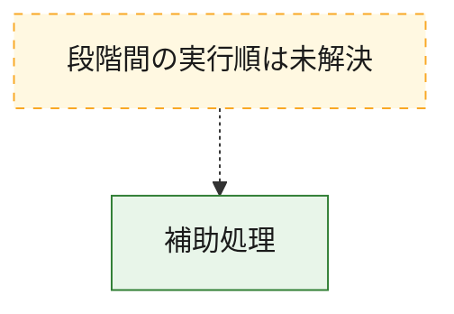
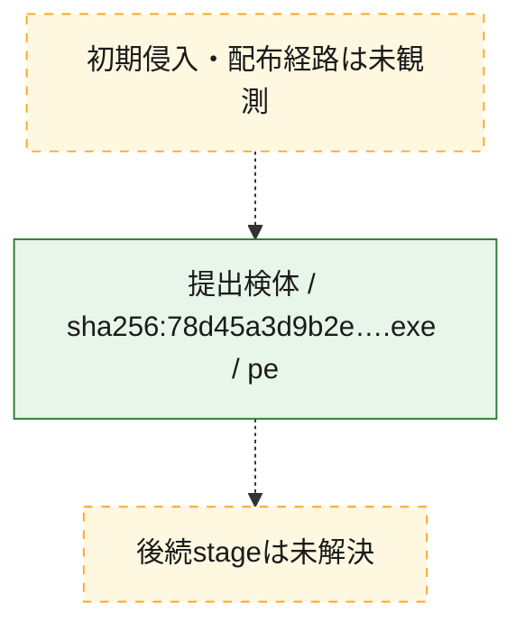
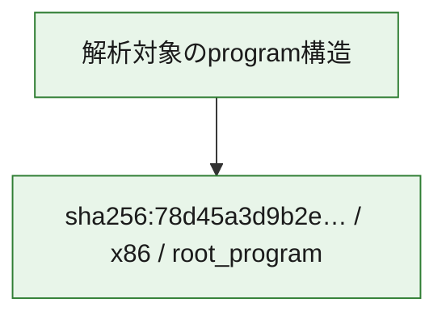

# 全体ロジック：78d45a3d9b2e82f6a181d42f6bf9262d2685bafb84a848201a4377c815c2f50c

代表関数から主要なmalware処理段階を自動分類できませんでした。

## 読み方

- phaseの掲載順は解析上の整理順です。observed_call_edgesがない段階間の実行順を断定しません。
- 図の実線は静的に観測した関係、点線と黄色のノードは未観測・未解決の関係を示します。
- 図は静的な要約であり、動的実行を再現するものではありません。
- 詳細な関数解説とfingerprintは[STATIC-LOGIC.md](STATIC-LOGIC.md)を参照してください。

## 静的可視化

### 実行フロー

### 感染チェーン

### モジュール関係

## 処理段階

### 1. 補助処理

主要処理を支える一般内部関数またはlibrary処理を確認します。
確度: `confirmed_static_function_evidence_with_limits`

- `78d45a3d9b2e82f6a181d42f6bf9262d2685bafb84a848201a4377c815c2f50c:ghidra:140001594` — 検体内部の一般処理を実装する関数です。 状態: `limited_bad_instruction_or_flow`、選定理由: `context_representative`, `reviewed_call_centrality:1`
- `78d45a3d9b2e82f6a181d42f6bf9262d2685bafb84a848201a4377c815c2f50c:ghidra:1400015b0` — 検体内部の一般処理を実装する関数です。 状態: `limited_bad_instruction_or_flow`、選定理由: `context_representative`, `reviewed_call_centrality:1`
- `78d45a3d9b2e82f6a181d42f6bf9262d2685bafb84a848201a4377c815c2f50c:ghidra:1400016c8` — 検体内部の一般処理を実装する関数です。 状態: `limited_bad_instruction_or_flow`、選定理由: `context_representative`, `reviewed_call_centrality:1`
- `78d45a3d9b2e82f6a181d42f6bf9262d2685bafb84a848201a4377c815c2f50c:ghidra:1400017ac` — 検体内部の一般処理を実装する関数です。 状態: `limited_bad_instruction_or_flow`、選定理由: `context_representative`, `reviewed_call_centrality:1`
- `78d45a3d9b2e82f6a181d42f6bf9262d2685bafb84a848201a4377c815c2f50c:ghidra:140001a70` — 検体内部の一般処理を実装する関数です。 状態: `limited_bad_instruction_or_flow`、選定理由: `context_representative`, `reviewed_call_centrality:1`
- `78d45a3d9b2e82f6a181d42f6bf9262d2685bafb84a848201a4377c815c2f50c:ghidra:140001ca0` — 検体内部の一般処理を実装する関数です。 状態: `limited_bad_instruction_or_flow`、選定理由: `context_representative`, `reviewed_call_centrality:1`
- `78d45a3d9b2e82f6a181d42f6bf9262d2685bafb84a848201a4377c815c2f50c:ghidra:140001df4` — 検体内部の一般処理を実装する関数です。 状態: `limited_bad_instruction_or_flow`、選定理由: `context_representative`, `reviewed_call_centrality:1`
- `78d45a3d9b2e82f6a181d42f6bf9262d2685bafb84a848201a4377c815c2f50c:ghidra:14000235c` — 検体内部の一般処理を実装する関数です。 状態: `limited_bad_instruction_or_flow`、選定理由: `context_representative`, `reviewed_call_centrality:1`
- `78d45a3d9b2e82f6a181d42f6bf9262d2685bafb84a848201a4377c815c2f50c:ghidra:1400023f4` — 検体内部の一般処理を実装する関数です。 状態: `limited_bad_instruction_or_flow`、選定理由: `context_representative`, `reviewed_call_centrality:1`
- `78d45a3d9b2e82f6a181d42f6bf9262d2685bafb84a848201a4377c815c2f50c:ghidra:140002488` — 検体内部の一般処理を実装する関数です。 状態: `limited_bad_instruction_or_flow`、選定理由: `context_representative`, `reviewed_call_centrality:1`
- `78d45a3d9b2e82f6a181d42f6bf9262d2685bafb84a848201a4377c815c2f50c:ghidra:14000253c` — 検体内部の一般処理を実装する関数です。 状態: `limited_bad_instruction_or_flow`、選定理由: `context_representative`, `reviewed_call_centrality:1`
- `78d45a3d9b2e82f6a181d42f6bf9262d2685bafb84a848201a4377c815c2f50c:ghidra:14000296c` — 検体内部の一般処理を実装する関数です。 状態: `limited_bad_instruction_or_flow`、選定理由: `context_representative`, `reviewed_call_centrality:1`
- `78d45a3d9b2e82f6a181d42f6bf9262d2685bafb84a848201a4377c815c2f50c:ghidra:140002b28` — 検体内部の一般処理を実装する関数です。 状態: `limited_bad_instruction_or_flow`、選定理由: `context_representative`, `reviewed_call_centrality:1`
- `78d45a3d9b2e82f6a181d42f6bf9262d2685bafb84a848201a4377c815c2f50c:ghidra:140002c10` — 検体内部の一般処理を実装する関数です。 状態: `limited_bad_instruction_or_flow`、選定理由: `context_representative`, `reviewed_call_centrality:1`
- `78d45a3d9b2e82f6a181d42f6bf9262d2685bafb84a848201a4377c815c2f50c:ghidra:140002c98` — 検体内部の一般処理を実装する関数です。 状態: `limited_bad_instruction_or_flow`、選定理由: `context_representative`, `reviewed_call_centrality:1`
- `78d45a3d9b2e82f6a181d42f6bf9262d2685bafb84a848201a4377c815c2f50c:ghidra:140002f08` — 検体内部の一般処理を実装する関数です。 状態: `limited_bad_instruction_or_flow`、選定理由: `context_representative`, `reviewed_call_centrality:1`
- `78d45a3d9b2e82f6a181d42f6bf9262d2685bafb84a848201a4377c815c2f50c:ghidra:1400031b8` — 検体内部の一般処理を実装する関数です。 状態: `limited_bad_instruction_or_flow`、選定理由: `context_representative`, `reviewed_call_centrality:1`
- `78d45a3d9b2e82f6a181d42f6bf9262d2685bafb84a848201a4377c815c2f50c:ghidra:140003678` — 検体内部の一般処理を実装する関数です。 状態: `limited_bad_instruction_or_flow`、選定理由: `context_representative`, `reviewed_call_centrality:1`
- `78d45a3d9b2e82f6a181d42f6bf9262d2685bafb84a848201a4377c815c2f50c:ghidra:1400037d0` — 検体内部の一般処理を実装する関数です。 状態: `limited_bad_instruction_or_flow`、選定理由: `context_representative`, `reviewed_call_centrality:1`
- `78d45a3d9b2e82f6a181d42f6bf9262d2685bafb84a848201a4377c815c2f50c:ghidra:140003804` — 検体内部の一般処理を実装する関数です。 状態: `limited_bad_instruction_or_flow`、選定理由: `context_representative`, `reviewed_call_centrality:1`
- `78d45a3d9b2e82f6a181d42f6bf9262d2685bafb84a848201a4377c815c2f50c:ghidra:140003838` — 検体内部の一般処理を実装する関数です。 状態: `limited_bad_instruction_or_flow`、選定理由: `context_representative`, `reviewed_call_centrality:1`
- `78d45a3d9b2e82f6a181d42f6bf9262d2685bafb84a848201a4377c815c2f50c:ghidra:1400039f8` — 検体内部の一般処理を実装する関数です。 状態: `limited_bad_instruction_or_flow`、選定理由: `context_representative`, `reviewed_call_centrality:1`
- `78d45a3d9b2e82f6a181d42f6bf9262d2685bafb84a848201a4377c815c2f50c:ghidra:140004500` — 検体内部の一般処理を実装する関数です。 状態: `limited_bad_instruction_or_flow`、選定理由: `context_representative`, `reviewed_call_centrality:1`
- `78d45a3d9b2e82f6a181d42f6bf9262d2685bafb84a848201a4377c815c2f50c:ghidra:1400046f4` — 検体内部の一般処理を実装する関数です。 状態: `limited_bad_instruction_or_flow`、選定理由: `context_representative`, `reviewed_call_centrality:1`
- `78d45a3d9b2e82f6a181d42f6bf9262d2685bafb84a848201a4377c815c2f50c:ghidra:140004914` — 検体内部の一般処理を実装する関数です。 状態: `limited_bad_instruction_or_flow`、選定理由: `context_representative`, `reviewed_call_centrality:1`
- `78d45a3d9b2e82f6a181d42f6bf9262d2685bafb84a848201a4377c815c2f50c:ghidra:1400054dc` — 検体内部の一般処理を実装する関数です。 状態: `limited_bad_instruction_or_flow`、選定理由: `context_representative`, `reviewed_call_centrality:1`
- `78d45a3d9b2e82f6a181d42f6bf9262d2685bafb84a848201a4377c815c2f50c:ghidra:14000577c` — 検体内部の一般処理を実装する関数です。 状態: `limited_bad_instruction_or_flow`、選定理由: `context_representative`, `reviewed_call_centrality:1`
- `78d45a3d9b2e82f6a181d42f6bf9262d2685bafb84a848201a4377c815c2f50c:ghidra:14000590c` — 検体内部の一般処理を実装する関数です。 状態: `limited_bad_instruction_or_flow`、選定理由: `context_representative`, `reviewed_call_centrality:1`
- `78d45a3d9b2e82f6a181d42f6bf9262d2685bafb84a848201a4377c815c2f50c:ghidra:140005b30` — 検体内部の一般処理を実装する関数です。 状態: `limited_bad_instruction_or_flow`、選定理由: `context_representative`, `reviewed_call_centrality:1`
- `78d45a3d9b2e82f6a181d42f6bf9262d2685bafb84a848201a4377c815c2f50c:ghidra:140005d74` — 検体内部の一般処理を実装する関数です。 状態: `limited_bad_instruction_or_flow`、選定理由: `context_representative`, `reviewed_call_centrality:1`
- `78d45a3d9b2e82f6a181d42f6bf9262d2685bafb84a848201a4377c815c2f50c:ghidra:140005ebc` — 検体内部の一般処理を実装する関数です。 状態: `limited_bad_instruction_or_flow`、選定理由: `context_representative`, `reviewed_call_centrality:1`
- `78d45a3d9b2e82f6a181d42f6bf9262d2685bafb84a848201a4377c815c2f50c:ghidra:1400060c8` — 検体内部の一般処理を実装する関数です。 状態: `limited_bad_instruction_or_flow`、選定理由: `context_representative`, `reviewed_call_centrality:1`

## 観測したcall関係

- `ghidra-function:028e364a93e9595021e48641` → `ghidra-external:b5cc1144efa49638ef9ca2b5` （`unclassified` → `unclassified`）
- `ghidra-function:04973ed77ff6211e118094c5` → `ghidra-external:b5cc1144efa49638ef9ca2b5` （`unclassified` → `unclassified`）
- `ghidra-function:132880d5369452cb24acc619` → `ghidra-external:b5cc1144efa49638ef9ca2b5` （`unclassified` → `unclassified`）
- `ghidra-function:17ec10e19a39d780c50d9591` → `ghidra-external:b5cc1144efa49638ef9ca2b5` （`unclassified` → `unclassified`）
- `ghidra-function:1c01fc2e6f99f7b2f4719e07` → `ghidra-external:b5cc1144efa49638ef9ca2b5` （`unclassified` → `unclassified`）
- `ghidra-function:218b1bcf33a9969c54ff3866` → `ghidra-external:b5cc1144efa49638ef9ca2b5` （`unclassified` → `unclassified`）
- `ghidra-function:270c0eb23e6f1bdcca56c972` → `ghidra-external:b5cc1144efa49638ef9ca2b5` （`unclassified` → `unclassified`）
- `ghidra-function:283ec135a02724e222845019` → `ghidra-external:b5cc1144efa49638ef9ca2b5` （`unclassified` → `unclassified`）
- `ghidra-function:41293553ca5cba30f76f197f` → `ghidra-external:b5cc1144efa49638ef9ca2b5` （`unclassified` → `unclassified`）
- `ghidra-function:433713a917b083d679c457a9` → `ghidra-external:b5cc1144efa49638ef9ca2b5` （`unclassified` → `unclassified`）
- `ghidra-function:52be66ad55a31571a540fa9c` → `ghidra-external:b5cc1144efa49638ef9ca2b5` （`unclassified` → `unclassified`）
- `ghidra-function:5c76f44bbd5c479cce3fde37` → `ghidra-external:b5cc1144efa49638ef9ca2b5` （`unclassified` → `unclassified`）
- `ghidra-function:5e8830f7075ed370eaec8607` → `ghidra-external:b5cc1144efa49638ef9ca2b5` （`unclassified` → `unclassified`）
- `ghidra-function:7107493c35581d77d25215a3` → `ghidra-external:b5cc1144efa49638ef9ca2b5` （`unclassified` → `unclassified`）
- `ghidra-function:73223a7ab0c5bd7d1f4a01d2` → `ghidra-external:b5cc1144efa49638ef9ca2b5` （`unclassified` → `unclassified`）
- `ghidra-function:7c4f8ca70e20d4ca63f596e7` → `ghidra-external:b5cc1144efa49638ef9ca2b5` （`unclassified` → `unclassified`）
- `ghidra-function:8115cdc6cf3620ae4f0c402b` → `ghidra-external:b5cc1144efa49638ef9ca2b5` （`unclassified` → `unclassified`）
- `ghidra-function:85544fc7fbc1d967a9196616` → `ghidra-external:b5cc1144efa49638ef9ca2b5` （`unclassified` → `unclassified`）
- `ghidra-function:953af176455e62e8e8e3a058` → `ghidra-external:b5cc1144efa49638ef9ca2b5` （`unclassified` → `unclassified`）
- `ghidra-function:9e0b35cb48f32e2b5e2e4b96` → `ghidra-external:b5cc1144efa49638ef9ca2b5` （`unclassified` → `unclassified`）
- `ghidra-function:a1cc923f07cf03e26028b5db` → `ghidra-external:b5cc1144efa49638ef9ca2b5` （`unclassified` → `unclassified`）
- `ghidra-function:b3745ea934802a3a644e0421` → `ghidra-external:b5cc1144efa49638ef9ca2b5` （`unclassified` → `unclassified`）
- `ghidra-function:b3ee795fd962b30e9664e9f3` → `ghidra-external:b5cc1144efa49638ef9ca2b5` （`unclassified` → `unclassified`）
- `ghidra-function:b48e77e567ad561fa12a015c` → `ghidra-external:b5cc1144efa49638ef9ca2b5` （`unclassified` → `unclassified`）
- `ghidra-function:d1088979a0869797004b7c5c` → `ghidra-external:b5cc1144efa49638ef9ca2b5` （`unclassified` → `unclassified`）
- `ghidra-function:d26781de22c933ffbdb78b5d` → `ghidra-external:b5cc1144efa49638ef9ca2b5` （`unclassified` → `unclassified`）
- `ghidra-function:d2bce66da76398bc694488f3` → `ghidra-external:b5cc1144efa49638ef9ca2b5` （`unclassified` → `unclassified`）
- `ghidra-function:e1cb6398038787b38a2e2a68` → `ghidra-external:b5cc1144efa49638ef9ca2b5` （`unclassified` → `unclassified`）
- `ghidra-function:f3a38a06fe3b54e8c4101a6f` → `ghidra-external:b5cc1144efa49638ef9ca2b5` （`unclassified` → `unclassified`）
- `ghidra-function:f89b486c16e52f21133bb1e9` → `ghidra-external:b5cc1144efa49638ef9ca2b5` （`unclassified` → `unclassified`）
- `ghidra-function:fd0789d21535e9565284f743` → `ghidra-external:b5cc1144efa49638ef9ca2b5` （`unclassified` → `unclassified`）
- `ghidra-function:ffcacdec2e69f908150fa7aa` → `ghidra-external:b5cc1144efa49638ef9ca2b5` （`unclassified` → `unclassified`）

## 解析範囲と制約

- 選定外関数は全体inventoryへ残しますが、関数本体の個別解説対象にはしていません。
- indirect call、難読化、packer、VM、壊れたcontrol flowによりcall関係が欠落する場合があります。
- 文書は静的解析に基づき、検体実行や外部通信による動的確認は行っていません。
