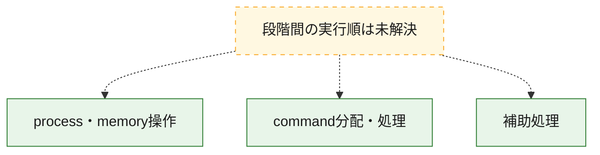
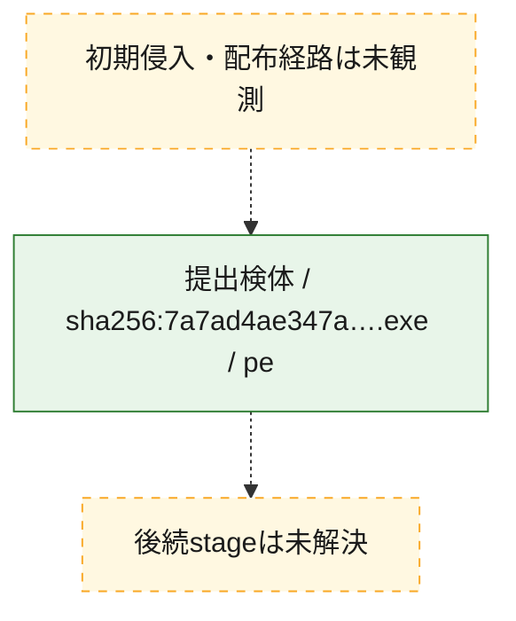
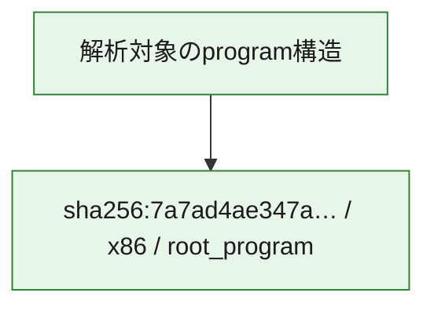

# 全体ロジック：7a7ad4ae347a3f99f3773a113d9f70ecfa967100c96e8275bd1df833caee68d1

代表関数の静的証跡から、process・memory操作、command分配・処理の処理群を確認しました。

## 読み方

- phaseの掲載順は解析上の整理順です。observed_call_edgesがない段階間の実行順を断定しません。
- 図の実線は静的に観測した関係、点線と黄色のノードは未観測・未解決の関係を示します。
- 図は静的な要約であり、動的実行を再現するものではありません。
- 詳細な関数解説とfingerprintは[STATIC-LOGIC.md](STATIC-LOGIC.md)を参照してください。

## 静的可視化

### 実行フロー

### 感染チェーン

### モジュール関係

## 処理段階

### 1. process・memory操作

process、thread、module、memory操作と実行移行を確認します。
確度: `confirmed_static_function_evidence_with_limits`

- `7a7ad4ae347a3f99f3773a113d9f70ecfa967100c96e8275bd1df833caee68d1:ghidra:140001810` — process、thread、module、またはmemory操作に関係する関数です。 状態: `succeeded`、選定理由: `context_representative`, `reviewed_call_centrality:7`, `role:process_or_memory_operation`
- `7a7ad4ae347a3f99f3773a113d9f70ecfa967100c96e8275bd1df833caee68d1:ghidra:140001920` — process、thread、module、またはmemory操作に関係する関数です。 状態: `succeeded`、選定理由: `context_representative`, `reviewed_call_centrality:61`, `role:process_or_memory_operation`
- `7a7ad4ae347a3f99f3773a113d9f70ecfa967100c96e8275bd1df833caee68d1:ghidra:140003920` — process、thread、module、またはmemory操作に関係する関数です。 状態: `succeeded`、選定理由: `context_representative`, `reviewed_call_centrality:4`, `role:process_or_memory_operation`
- `7a7ad4ae347a3f99f3773a113d9f70ecfa967100c96e8275bd1df833caee68d1:ghidra:140003980` — process、thread、module、またはmemory操作に関係する関数です。 状態: `succeeded`、選定理由: `context_representative`, `reviewed_call_centrality:8`, `role:process_or_memory_operation`
- `7a7ad4ae347a3f99f3773a113d9f70ecfa967100c96e8275bd1df833caee68d1:ghidra:140003c60` — process、thread、module、またはmemory操作に関係する関数です。 状態: `limited_bad_instruction_or_flow`、選定理由: `context_representative`, `reviewed_call_centrality:4`, `role:process_or_memory_operation`
- `7a7ad4ae347a3f99f3773a113d9f70ecfa967100c96e8275bd1df833caee68d1:ghidra:140003ce0` — process、thread、module、またはmemory操作に関係する関数です。 状態: `limited_bad_instruction_or_flow`、選定理由: `context_representative`, `reviewed_call_centrality:9`, `role:process_or_memory_operation`
- `7a7ad4ae347a3f99f3773a113d9f70ecfa967100c96e8275bd1df833caee68d1:ghidra:140003d90` — process、thread、module、またはmemory操作に関係する関数です。 状態: `limited_bad_instruction_or_flow`、選定理由: `context_representative`, `reviewed_call_centrality:10`, `role:process_or_memory_operation`
- `7a7ad4ae347a3f99f3773a113d9f70ecfa967100c96e8275bd1df833caee68d1:ghidra:140003e90` — process、thread、module、またはmemory操作に関係する関数です。 状態: `limited_bad_instruction_or_flow`、選定理由: `context_representative`, `reviewed_call_centrality:18`, `role:process_or_memory_operation`
- `7a7ad4ae347a3f99f3773a113d9f70ecfa967100c96e8275bd1df833caee68d1:ghidra:140004130` — process、thread、module、またはmemory操作に関係する関数です。 状態: `limited_bad_instruction_or_flow`、選定理由: `context_representative`, `reviewed_call_centrality:10`, `role:process_or_memory_operation`
- `7a7ad4ae347a3f99f3773a113d9f70ecfa967100c96e8275bd1df833caee68d1:ghidra:1400043d0` — process、thread、module、またはmemory操作に関係する関数です。 状態: `limited_bad_instruction_or_flow`、選定理由: `context_representative`, `reviewed_call_centrality:13`, `role:process_or_memory_operation`
- `7a7ad4ae347a3f99f3773a113d9f70ecfa967100c96e8275bd1df833caee68d1:ghidra:1400045f0` — process、thread、module、またはmemory操作に関係する関数です。 状態: `limited_bad_instruction_or_flow`、選定理由: `context_representative`, `reviewed_call_centrality:4`, `role:process_or_memory_operation`
- `7a7ad4ae347a3f99f3773a113d9f70ecfa967100c96e8275bd1df833caee68d1:ghidra:140004710` — process、thread、module、またはmemory操作に関係する関数です。 状態: `limited_bad_instruction_or_flow`、選定理由: `context_representative`, `reviewed_call_centrality:4`, `role:process_or_memory_operation`
- `7a7ad4ae347a3f99f3773a113d9f70ecfa967100c96e8275bd1df833caee68d1:ghidra:140004780` — process、thread、module、またはmemory操作に関係する関数です。 状態: `limited_bad_instruction_or_flow`、選定理由: `context_representative`, `reviewed_call_centrality:4`, `role:process_or_memory_operation`
- `7a7ad4ae347a3f99f3773a113d9f70ecfa967100c96e8275bd1df833caee68d1:ghidra:140004860` — process、thread、module、またはmemory操作に関係する関数です。 状態: `limited_bad_instruction_or_flow`、選定理由: `context_representative`, `reviewed_call_centrality:7`, `role:process_or_memory_operation`
- `7a7ad4ae347a3f99f3773a113d9f70ecfa967100c96e8275bd1df833caee68d1:ghidra:140004960` — process、thread、module、またはmemory操作に関係する関数です。 状態: `limited_bad_instruction_or_flow`、選定理由: `context_representative`, `reviewed_call_centrality:29`, `role:process_or_memory_operation`
- `7a7ad4ae347a3f99f3773a113d9f70ecfa967100c96e8275bd1df833caee68d1:ghidra:140005970` — process、thread、module、またはmemory操作に関係する関数です。 状態: `succeeded`、選定理由: `context_representative`, `reviewed_call_centrality:44`, `role:process_or_memory_operation`
- `7a7ad4ae347a3f99f3773a113d9f70ecfa967100c96e8275bd1df833caee68d1:ghidra:140007e30` — process、thread、module、またはmemory操作に関係する関数です。 状態: `succeeded`、選定理由: `context_representative`, `reviewed_call_centrality:5`, `role:process_or_memory_operation`
- `7a7ad4ae347a3f99f3773a113d9f70ecfa967100c96e8275bd1df833caee68d1:ghidra:140007e90` — process、thread、module、またはmemory操作に関係する関数です。 状態: `succeeded`、選定理由: `context_representative`, `reviewed_call_centrality:4`, `role:process_or_memory_operation`

### 2. command分配・処理

受信commandやtaskの解釈、分配、個別handlerへの移行を確認します。
確度: `confirmed_static_function_evidence`

- `7a7ad4ae347a3f99f3773a113d9f70ecfa967100c96e8275bd1df833caee68d1:ghidra:140006f70` — commandの解釈、分配、または個別処理を担当する関数です。 状態: `succeeded`、選定理由: `context_representative`, `reviewed_call_centrality:70`, `role:command_dispatch_or_handler`

### 3. 補助処理

主要処理を支える一般内部関数またはlibrary処理を確認します。
確度: `confirmed_static_function_evidence_with_limits`

- `7a7ad4ae347a3f99f3773a113d9f70ecfa967100c96e8275bd1df833caee68d1:ghidra:140001000` — 検体内部の一般処理を実装する関数です。 状態: `succeeded`、選定理由: `context_representative`, `reviewed_call_centrality:3`
- `7a7ad4ae347a3f99f3773a113d9f70ecfa967100c96e8275bd1df833caee68d1:ghidra:1400011c0` — 検体内部の一般処理を実装する関数です。 状態: `succeeded`、選定理由: `context_representative`, `reviewed_call_centrality:4`
- `7a7ad4ae347a3f99f3773a113d9f70ecfa967100c96e8275bd1df833caee68d1:ghidra:1400014c0` — 検体内部の一般処理を実装する関数です。 状態: `succeeded`、選定理由: `context_representative`, `reviewed_call_centrality:13`
- `7a7ad4ae347a3f99f3773a113d9f70ecfa967100c96e8275bd1df833caee68d1:ghidra:140001900` — 検体内部の一般処理を実装する関数です。 状態: `succeeded`、選定理由: `context_representative`
- `7a7ad4ae347a3f99f3773a113d9f70ecfa967100c96e8275bd1df833caee68d1:ghidra:140001910` — 検体内部の一般処理を実装する関数です。 状態: `succeeded`、選定理由: `context_representative`, `reviewed_call_centrality:2`
- `7a7ad4ae347a3f99f3773a113d9f70ecfa967100c96e8275bd1df833caee68d1:ghidra:140003ae0` — 検体内部の一般処理を実装する関数です。 状態: `succeeded`、選定理由: `context_representative`, `reviewed_call_centrality:1`
- `7a7ad4ae347a3f99f3773a113d9f70ecfa967100c96e8275bd1df833caee68d1:ghidra:140003b20` — 検体内部の一般処理を実装する関数です。 状態: `succeeded`、選定理由: `context_representative`, `reviewed_call_centrality:10`
- `7a7ad4ae347a3f99f3773a113d9f70ecfa967100c96e8275bd1df833caee68d1:ghidra:140004680` — 検体内部の一般処理を実装する関数です。 状態: `limited_bad_instruction_or_flow`、選定理由: `context_representative`
- `7a7ad4ae347a3f99f3773a113d9f70ecfa967100c96e8275bd1df833caee68d1:ghidra:1400048a0` — 検体内部の一般処理を実装する関数です。 状態: `succeeded`、選定理由: `context_representative`, `reviewed_call_centrality:5`
- `7a7ad4ae347a3f99f3773a113d9f70ecfa967100c96e8275bd1df833caee68d1:ghidra:140006ef0` — 検体内部の一般処理を実装する関数です。 状態: `limited_bad_instruction_or_flow`、選定理由: `context_representative`
- `7a7ad4ae347a3f99f3773a113d9f70ecfa967100c96e8275bd1df833caee68d1:ghidra:140007ee0` — 検体内部の一般処理を実装する関数です。 状態: `succeeded`、選定理由: `context_representative`, `reviewed_call_centrality:1`
- `7a7ad4ae347a3f99f3773a113d9f70ecfa967100c96e8275bd1df833caee68d1:ghidra:140007f20` — 検体内部の一般処理を実装する関数です。 状態: `succeeded`、選定理由: `context_representative`, `reviewed_call_centrality:1`
- `7a7ad4ae347a3f99f3773a113d9f70ecfa967100c96e8275bd1df833caee68d1:ghidra:140007f60` — 検体内部の一般処理を実装する関数です。 状態: `succeeded`、選定理由: `context_representative`, `reviewed_call_centrality:1`

## 観測したcall関係

- 代表関数間で直接解決できた呼出関係はありません。

## 解析範囲と制約

- 選定外関数は全体inventoryへ残しますが、関数本体の個別解説対象にはしていません。
- indirect call、難読化、packer、VM、壊れたcontrol flowによりcall関係が欠落する場合があります。
- 文書は静的解析に基づき、検体実行や外部通信による動的確認は行っていません。
