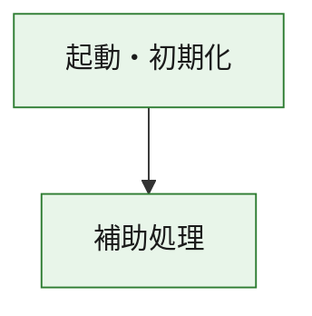
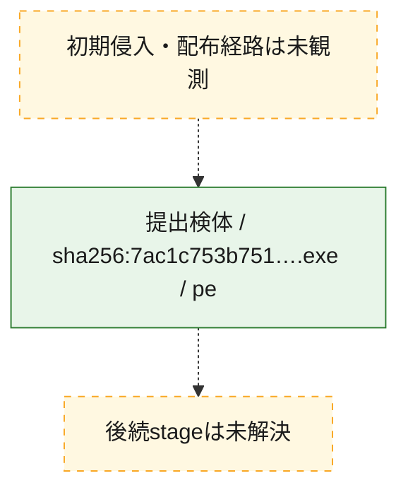
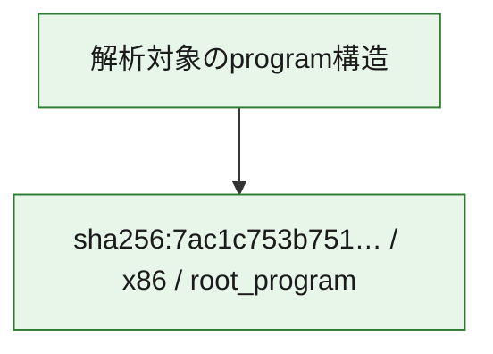

# 全体ロジック：7ac1c753b75182d5d6300904e7ea31e313df4b20c1709ce4cb19168880778e77

代表関数の静的証跡から、起動・初期化の処理群を確認しました。

## 読み方

- phaseの掲載順は解析上の整理順です。observed_call_edgesがない段階間の実行順を断定しません。
- 図の実線は静的に観測した関係、点線と黄色のノードは未観測・未解決の関係を示します。
- 図は静的な要約であり、動的実行を再現するものではありません。
- 詳細な関数解説とfingerprintは[STATIC-LOGIC.md](STATIC-LOGIC.md)を参照してください。

## 静的可視化

### 実行フロー

### 感染チェーン

### モジュール関係

## 処理段階

### 1. 起動・初期化

entry pointから初期化と後続処理への移行を確認します。
確度: `confirmed_static_function_evidence`

- `7ac1c753b75182d5d6300904e7ea31e313df4b20c1709ce4cb19168880778e77:ghidra:180001010` — 初期化と主要処理への分岐を行う入口関数です。 状態: `succeeded`、選定理由: `entry_point`, `meaningful_symbol_name`, `reviewed_call_centrality:22`, `role:entrypoint`, `small_program_complete_context`

### 2. 補助処理

主要処理を支える一般内部関数またはlibrary処理を確認します。
確度: `confirmed_static_function_evidence`

- `7ac1c753b75182d5d6300904e7ea31e313df4b20c1709ce4cb19168880778e77:ghidra:180001240` — 検体内部の一般処理を実装する関数です。 状態: `succeeded`、選定理由: `context_representative`, `reviewed_call_centrality:2`, `small_program_complete_context`
- `7ac1c753b75182d5d6300904e7ea31e313df4b20c1709ce4cb19168880778e77:ghidra:180001350` — 検体内部の一般処理を実装する関数です。 状態: `succeeded`、選定理由: `context_representative`, `reviewed_call_centrality:25`, `small_program_complete_context`
- `7ac1c753b75182d5d6300904e7ea31e313df4b20c1709ce4cb19168880778e77:ghidra:180003780` — 検体内部の一般処理を実装する関数です。 状態: `succeeded`、選定理由: `context_representative`, `reviewed_call_centrality:2`, `small_program_complete_context`
- `7ac1c753b75182d5d6300904e7ea31e313df4b20c1709ce4cb19168880778e77:ghidra:1800038e0` — 検体内部の一般処理を実装する関数です。 状態: `succeeded`、選定理由: `context_representative`, `reviewed_call_centrality:2`, `small_program_complete_context`

## 観測したcall関係

- `7ac1c753b75182d5d6300904e7ea31e313df4b20c1709ce4cb19168880778e77:ghidra:180001010` → `7ac1c753b75182d5d6300904e7ea31e313df4b20c1709ce4cb19168880778e77:ghidra:180001240` （`startup` → `support`）
- `7ac1c753b75182d5d6300904e7ea31e313df4b20c1709ce4cb19168880778e77:ghidra:180001010` → `7ac1c753b75182d5d6300904e7ea31e313df4b20c1709ce4cb19168880778e77:ghidra:180001350` （`startup` → `support`）
- `7ac1c753b75182d5d6300904e7ea31e313df4b20c1709ce4cb19168880778e77:ghidra:180001350` → `7ac1c753b75182d5d6300904e7ea31e313df4b20c1709ce4cb19168880778e77:ghidra:180001240` （`support` → `support`）
- `7ac1c753b75182d5d6300904e7ea31e313df4b20c1709ce4cb19168880778e77:ghidra:180001350` → `7ac1c753b75182d5d6300904e7ea31e313df4b20c1709ce4cb19168880778e77:ghidra:180003780` （`support` → `support`）
- `7ac1c753b75182d5d6300904e7ea31e313df4b20c1709ce4cb19168880778e77:ghidra:180001350` → `7ac1c753b75182d5d6300904e7ea31e313df4b20c1709ce4cb19168880778e77:ghidra:1800038e0` （`support` → `support`）
- `7ac1c753b75182d5d6300904e7ea31e313df4b20c1709ce4cb19168880778e77:ghidra:180003780` → `7ac1c753b75182d5d6300904e7ea31e313df4b20c1709ce4cb19168880778e77:ghidra:1800038e0` （`support` → `support`）
- `ghidra-function:4e627aca53ea7981ee1d33ef` → `ghidra-function:d65eda49af57a6b73a15bfa1` （`unclassified` → `unclassified`）
- `ghidra-function:e50dff8b8df7795cba9d95d9` → `ghidra-function:07f867dbff2387e1a8a5620f` （`unclassified` → `unclassified`）
- `ghidra-function:e50dff8b8df7795cba9d95d9` → `ghidra-function:18ac4b5b3f481574f67043cb` （`unclassified` → `unclassified`）
- `ghidra-function:e50dff8b8df7795cba9d95d9` → `ghidra-function:265075007a3dbaf36c5b8016` （`unclassified` → `unclassified`）
- `ghidra-function:e50dff8b8df7795cba9d95d9` → `ghidra-function:5542dc6ba1989f4ada18c99c` （`unclassified` → `unclassified`）
- `ghidra-function:e50dff8b8df7795cba9d95d9` → `ghidra-function:5dff17090e3544bfd5566199` （`unclassified` → `unclassified`）
- `ghidra-function:e50dff8b8df7795cba9d95d9` → `ghidra-function:8b11023da41a9f5d5b098688` （`unclassified` → `unclassified`）
- `ghidra-function:e50dff8b8df7795cba9d95d9` → `ghidra-function:995b0c8e5aaa6175dc70bea1` （`unclassified` → `unclassified`）
- `ghidra-function:e50dff8b8df7795cba9d95d9` → `ghidra-function:b4511b31158c29b9b245ff21` （`unclassified` → `unclassified`）
- `ghidra-function:e50dff8b8df7795cba9d95d9` → `ghidra-function:bfd81d02b4a01aa2cc547fa1` （`unclassified` → `unclassified`）
- `ghidra-function:e50dff8b8df7795cba9d95d9` → `ghidra-function:dc19df9e56666cc68cbfff50` （`unclassified` → `unclassified`）
- `ghidra-function:e50dff8b8df7795cba9d95d9` → `ghidra-function:f4e66ab4bac99e9406ae8b1d` （`unclassified` → `unclassified`）
- `ghidra-function:e50dff8b8df7795cba9d95d9` → `ghidra-function:fe9ef1422d953e8bfa268ab0` （`unclassified` → `unclassified`）
- `ghidra-function:fe9ef1422d953e8bfa268ab0` → `ghidra-external:013d03a1d5b806b06c053f59` （`unclassified` → `unclassified`）
- `ghidra-function:fe9ef1422d953e8bfa268ab0` → `ghidra-external:04d4e1c6e414d7cc7f819adb` （`unclassified` → `unclassified`）
- `ghidra-function:fe9ef1422d953e8bfa268ab0` → `ghidra-external:0aab59a58be1540222412024` （`unclassified` → `unclassified`）
- `ghidra-function:fe9ef1422d953e8bfa268ab0` → `ghidra-external:104b947f9b32c4fc1e902915` （`unclassified` → `unclassified`）
- `ghidra-function:fe9ef1422d953e8bfa268ab0` → `ghidra-external:260d639e303a140ded68f05a` （`unclassified` → `unclassified`）
- `ghidra-function:fe9ef1422d953e8bfa268ab0` → `ghidra-external:348971fc7f8958ee9760c835` （`unclassified` → `unclassified`）
- `ghidra-function:fe9ef1422d953e8bfa268ab0` → `ghidra-external:380419c4696e11330b9c91bb` （`unclassified` → `unclassified`）
- `ghidra-function:fe9ef1422d953e8bfa268ab0` → `ghidra-external:3f6546f1bd2e94fa96d2ff77` （`unclassified` → `unclassified`）
- `ghidra-function:fe9ef1422d953e8bfa268ab0` → `ghidra-external:4bc320e27fae91faa8da530e` （`unclassified` → `unclassified`）
- `ghidra-function:fe9ef1422d953e8bfa268ab0` → `ghidra-external:50f5adbbc4a59ec64c8edf53` （`unclassified` → `unclassified`）
- `ghidra-function:fe9ef1422d953e8bfa268ab0` → `ghidra-external:5275757ce2a1499400f2f7d8` （`unclassified` → `unclassified`）
- `ghidra-function:fe9ef1422d953e8bfa268ab0` → `ghidra-external:59371aa41f2ff3547a761dd6` （`unclassified` → `unclassified`）
- `ghidra-function:fe9ef1422d953e8bfa268ab0` → `ghidra-external:5e9ce70f17f8a9398496cd83` （`unclassified` → `unclassified`）
- `ghidra-function:fe9ef1422d953e8bfa268ab0` → `ghidra-external:62eee127e7a04c98c0dc5678` （`unclassified` → `unclassified`）
- `ghidra-function:fe9ef1422d953e8bfa268ab0` → `ghidra-external:764a733a9cf126f4691cc93e` （`unclassified` → `unclassified`）
- `ghidra-function:fe9ef1422d953e8bfa268ab0` → `ghidra-external:7685fdef3e67ab6606928746` （`unclassified` → `unclassified`）
- `ghidra-function:fe9ef1422d953e8bfa268ab0` → `ghidra-external:9234b0815912c6cd2a0b4ca8` （`unclassified` → `unclassified`）
- `ghidra-function:fe9ef1422d953e8bfa268ab0` → `ghidra-external:98101d1b6473d86f6e66aa78` （`unclassified` → `unclassified`）
- `ghidra-function:fe9ef1422d953e8bfa268ab0` → `ghidra-external:a033a8ef3a61c20ce3ba0956` （`unclassified` → `unclassified`）
- `ghidra-function:fe9ef1422d953e8bfa268ab0` → `ghidra-external:d8620c8b3c2b2490a0878030` （`unclassified` → `unclassified`）
- `ghidra-function:fe9ef1422d953e8bfa268ab0` → `ghidra-external:e4f31ecf9efa33a9e6c341ca` （`unclassified` → `unclassified`）
- `ghidra-function:fe9ef1422d953e8bfa268ab0` → `ghidra-function:265075007a3dbaf36c5b8016` （`unclassified` → `unclassified`）
- `ghidra-function:fe9ef1422d953e8bfa268ab0` → `ghidra-function:4e627aca53ea7981ee1d33ef` （`unclassified` → `unclassified`）
- `ghidra-function:fe9ef1422d953e8bfa268ab0` → `ghidra-function:d65eda49af57a6b73a15bfa1` （`unclassified` → `unclassified`）

## 解析範囲と制約

- 選定外関数は全体inventoryへ残しますが、関数本体の個別解説対象にはしていません。
- indirect call、難読化、packer、VM、壊れたcontrol flowによりcall関係が欠落する場合があります。
- 文書は静的解析に基づき、検体実行や外部通信による動的確認は行っていません。
