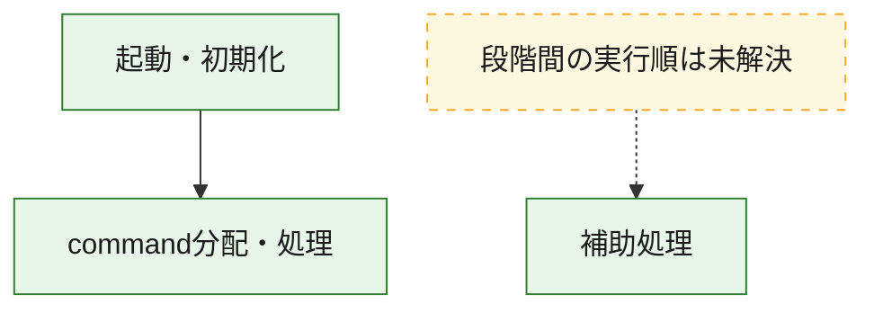
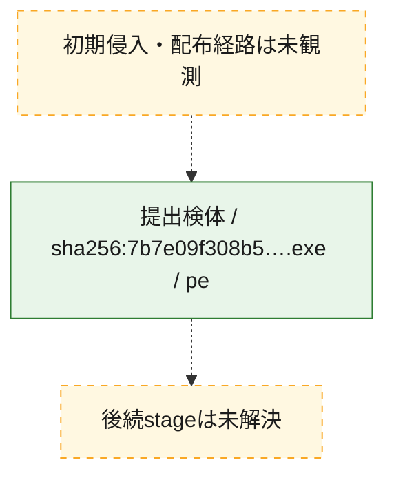
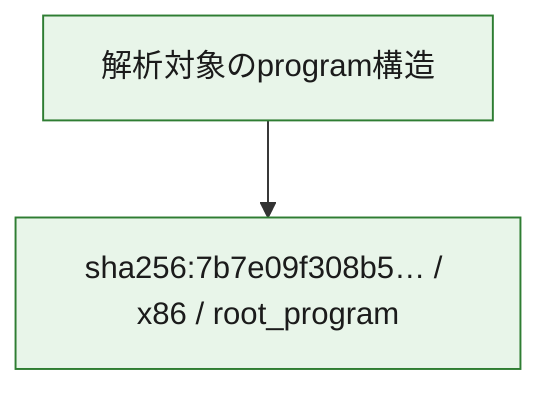

# 全体ロジック：7b7e09f308b5b5bdd5feb425b370748767a975134de95d8130107af3909b1572

代表関数の静的証跡から、起動・初期化、command分配・処理の処理群を確認しました。

## 読み方

- phaseの掲載順は解析上の整理順です。observed_call_edgesがない段階間の実行順を断定しません。
- 図の実線は静的に観測した関係、点線と黄色のノードは未観測・未解決の関係を示します。
- 図は静的な要約であり、動的実行を再現するものではありません。
- 詳細な関数解説とfingerprintは[STATIC-LOGIC.md](STATIC-LOGIC.md)を参照してください。

## 静的可視化

### 実行フロー

### 感染チェーン

### モジュール関係

## 処理段階

### 1. 起動・初期化

entry pointから初期化と後続処理への移行を確認します。
確度: `confirmed_static_function_evidence`

- `7b7e09f308b5b5bdd5feb425b370748767a975134de95d8130107af3909b1572:ghidra:14018bedc` — 初期化と主要処理への分岐を行う入口関数です。 状態: `succeeded`、選定理由: `entry_point`, `meaningful_symbol_name`, `reviewed_call_centrality:22`, `role:entrypoint`

### 2. command分配・処理

受信commandやtaskの解釈、分配、個別handlerへの移行を確認します。
確度: `confirmed_static_function_evidence_with_limits`

- `7b7e09f308b5b5bdd5feb425b370748767a975134de95d8130107af3909b1572:ghidra:1401a1b40` — commandの解釈、分配、または個別処理を担当する関数です。 状態: `limited_bad_instruction_or_flow`、選定理由: `meaningful_symbol_name`, `reviewed_call_centrality:1`, `role:command_dispatch_or_handler`

### 3. 補助処理

主要処理を支える一般内部関数またはlibrary処理を確認します。
確度: `confirmed_static_function_evidence_with_limits`

- `7b7e09f308b5b5bdd5feb425b370748767a975134de95d8130107af3909b1572:ghidra:140001000` — 検体内部の一般処理を実装する関数です。 状態: `succeeded`、選定理由: `context_representative`, `reviewed_call_centrality:2`
- `7b7e09f308b5b5bdd5feb425b370748767a975134de95d8130107af3909b1572:ghidra:140001290` — 検体内部の一般処理を実装する関数です。 状態: `succeeded`、選定理由: `context_representative`, `reviewed_call_centrality:17`
- `7b7e09f308b5b5bdd5feb425b370748767a975134de95d8130107af3909b1572:ghidra:140001420` — 検体内部の一般処理を実装する関数です。 状態: `succeeded`、選定理由: `context_representative`, `reviewed_call_centrality:15`
- `7b7e09f308b5b5bdd5feb425b370748767a975134de95d8130107af3909b1572:ghidra:140001d10` — 検体内部の一般処理を実装する関数です。 状態: `succeeded`、選定理由: `context_representative`, `reviewed_call_centrality:2`
- `7b7e09f308b5b5bdd5feb425b370748767a975134de95d8130107af3909b1572:ghidra:140001e10` — 検体内部の一般処理を実装する関数です。 状態: `succeeded`、選定理由: `context_representative`, `reviewed_call_centrality:9`
- `7b7e09f308b5b5bdd5feb425b370748767a975134de95d8130107af3909b1572:ghidra:140001f40` — 検体内部の一般処理を実装する関数です。 状態: `succeeded`、選定理由: `context_representative`, `reviewed_call_centrality:5`
- `7b7e09f308b5b5bdd5feb425b370748767a975134de95d8130107af3909b1572:ghidra:140002080` — 検体内部の一般処理を実装する関数です。 状態: `succeeded`、選定理由: `context_representative`, `reviewed_call_centrality:9`
- `7b7e09f308b5b5bdd5feb425b370748767a975134de95d8130107af3909b1572:ghidra:1400023d0` — 検体内部の一般処理を実装する関数です。 状態: `succeeded`、選定理由: `context_representative`, `reviewed_call_centrality:10`
- `7b7e09f308b5b5bdd5feb425b370748767a975134de95d8130107af3909b1572:ghidra:140002680` — 検体内部の一般処理を実装する関数です。 状態: `succeeded`、選定理由: `context_representative`, `reviewed_call_centrality:13`
- `7b7e09f308b5b5bdd5feb425b370748767a975134de95d8130107af3909b1572:ghidra:140002890` — 検体内部の一般処理を実装する関数です。 状態: `succeeded`、選定理由: `context_representative`, `reviewed_call_centrality:7`
- `7b7e09f308b5b5bdd5feb425b370748767a975134de95d8130107af3909b1572:ghidra:140002ac0` — 検体内部の一般処理を実装する関数です。 状態: `succeeded`、選定理由: `context_representative`, `reviewed_call_centrality:7`
- `7b7e09f308b5b5bdd5feb425b370748767a975134de95d8130107af3909b1572:ghidra:140002d50` — 検体内部の一般処理を実装する関数です。 状態: `succeeded`、選定理由: `context_representative`, `reviewed_call_centrality:13`
- `7b7e09f308b5b5bdd5feb425b370748767a975134de95d8130107af3909b1572:ghidra:140003070` — 検体内部の一般処理を実装する関数です。 状態: `succeeded`、選定理由: `context_representative`, `reviewed_call_centrality:12`
- `7b7e09f308b5b5bdd5feb425b370748767a975134de95d8130107af3909b1572:ghidra:140003380` — 検体内部の一般処理を実装する関数です。 状態: `succeeded`、選定理由: `context_representative`, `reviewed_call_centrality:5`
- `7b7e09f308b5b5bdd5feb425b370748767a975134de95d8130107af3909b1572:ghidra:1400034f0` — 検体内部の一般処理を実装する関数です。 状態: `succeeded`、選定理由: `context_representative`, `reviewed_call_centrality:3`
- `7b7e09f308b5b5bdd5feb425b370748767a975134de95d8130107af3909b1572:ghidra:140003620` — 検体内部の一般処理を実装する関数です。 状態: `succeeded`、選定理由: `context_representative`, `reviewed_call_centrality:7`
- `7b7e09f308b5b5bdd5feb425b370748767a975134de95d8130107af3909b1572:ghidra:140003720` — 検体内部の一般処理を実装する関数です。 状態: `succeeded`、選定理由: `context_representative`, `reviewed_call_centrality:6`
- `7b7e09f308b5b5bdd5feb425b370748767a975134de95d8130107af3909b1572:ghidra:140003810` — 検体内部の一般処理を実装する関数です。 状態: `succeeded`、選定理由: `context_representative`, `reviewed_call_centrality:6`
- `7b7e09f308b5b5bdd5feb425b370748767a975134de95d8130107af3909b1572:ghidra:140003920` — 検体内部の一般処理を実装する関数です。 状態: `succeeded`、選定理由: `context_representative`, `reviewed_call_centrality:8`
- `7b7e09f308b5b5bdd5feb425b370748767a975134de95d8130107af3909b1572:ghidra:140003aa0` — 検体内部の一般処理を実装する関数です。 状態: `succeeded`、選定理由: `context_representative`, `reviewed_call_centrality:40`
- `7b7e09f308b5b5bdd5feb425b370748767a975134de95d8130107af3909b1572:ghidra:140004aa0` — 検体内部の一般処理を実装する関数です。 状態: `failed`、選定理由: `context_representative`, `reviewed_call_centrality:1`
- `7b7e09f308b5b5bdd5feb425b370748767a975134de95d8130107af3909b1572:ghidra:140005140` — 検体内部の一般処理を実装する関数です。 状態: `succeeded`、選定理由: `context_representative`, `reviewed_call_centrality:7`
- `7b7e09f308b5b5bdd5feb425b370748767a975134de95d8130107af3909b1572:ghidra:140005550` — 検体内部の一般処理を実装する関数です。 状態: `succeeded`、選定理由: `context_representative`, `reviewed_call_centrality:15`
- `7b7e09f308b5b5bdd5feb425b370748767a975134de95d8130107af3909b1572:ghidra:140005840` — 検体内部の一般処理を実装する関数です。 状態: `limited_bad_instruction_or_flow`、選定理由: `context_representative`, `reviewed_call_centrality:8`
- `7b7e09f308b5b5bdd5feb425b370748767a975134de95d8130107af3909b1572:ghidra:1400058a0` — 検体内部の一般処理を実装する関数です。 状態: `limited_bad_instruction_or_flow`、選定理由: `context_representative`, `reviewed_call_centrality:13`
- `7b7e09f308b5b5bdd5feb425b370748767a975134de95d8130107af3909b1572:ghidra:140005cb0` — 検体内部の一般処理を実装する関数です。 状態: `succeeded`、選定理由: `context_representative`, `reviewed_call_centrality:14`
- `7b7e09f308b5b5bdd5feb425b370748767a975134de95d8130107af3909b1572:ghidra:140005f80` — 検体内部の一般処理を実装する関数です。 状態: `failed`、選定理由: `context_representative`
- `7b7e09f308b5b5bdd5feb425b370748767a975134de95d8130107af3909b1572:ghidra:14000c890` — 検体内部の一般処理を実装する関数です。 状態: `succeeded`、選定理由: `context_representative`, `reviewed_call_centrality:52`
- `7b7e09f308b5b5bdd5feb425b370748767a975134de95d8130107af3909b1572:ghidra:1400d4f70` — compiler生成処理または汎用library処理とみられる関数です。 状態: `limited_bad_instruction_or_flow`、選定理由: `entry_point`, `meaningful_symbol_name`, `reviewed_call_centrality:8`
- `7b7e09f308b5b5bdd5feb425b370748767a975134de95d8130107af3909b1572:ghidra:14018c350` — 検体内部の一般処理を実装する関数です。 状態: `succeeded`、選定理由: `meaningful_symbol_name`

## 観測したcall関係

- `7b7e09f308b5b5bdd5feb425b370748767a975134de95d8130107af3909b1572:ghidra:140001420` → `7b7e09f308b5b5bdd5feb425b370748767a975134de95d8130107af3909b1572:ghidra:140001290` （`support` → `support`）
- `7b7e09f308b5b5bdd5feb425b370748767a975134de95d8130107af3909b1572:ghidra:140001420` → `7b7e09f308b5b5bdd5feb425b370748767a975134de95d8130107af3909b1572:ghidra:140002ac0` （`support` → `support`）
- `7b7e09f308b5b5bdd5feb425b370748767a975134de95d8130107af3909b1572:ghidra:140001420` → `7b7e09f308b5b5bdd5feb425b370748767a975134de95d8130107af3909b1572:ghidra:140003620` （`support` → `support`）
- `7b7e09f308b5b5bdd5feb425b370748767a975134de95d8130107af3909b1572:ghidra:140001d10` → `7b7e09f308b5b5bdd5feb425b370748767a975134de95d8130107af3909b1572:ghidra:140004aa0` （`support` → `support`）
- `7b7e09f308b5b5bdd5feb425b370748767a975134de95d8130107af3909b1572:ghidra:140001e10` → `7b7e09f308b5b5bdd5feb425b370748767a975134de95d8130107af3909b1572:ghidra:140003aa0` （`support` → `support`）
- `7b7e09f308b5b5bdd5feb425b370748767a975134de95d8130107af3909b1572:ghidra:140001f40` → `7b7e09f308b5b5bdd5feb425b370748767a975134de95d8130107af3909b1572:ghidra:140001290` （`support` → `support`）
- `7b7e09f308b5b5bdd5feb425b370748767a975134de95d8130107af3909b1572:ghidra:140001f40` → `7b7e09f308b5b5bdd5feb425b370748767a975134de95d8130107af3909b1572:ghidra:1400023d0` （`support` → `support`）
- `7b7e09f308b5b5bdd5feb425b370748767a975134de95d8130107af3909b1572:ghidra:140001f40` → `7b7e09f308b5b5bdd5feb425b370748767a975134de95d8130107af3909b1572:ghidra:140002d50` （`support` → `support`）
- `7b7e09f308b5b5bdd5feb425b370748767a975134de95d8130107af3909b1572:ghidra:140002080` → `7b7e09f308b5b5bdd5feb425b370748767a975134de95d8130107af3909b1572:ghidra:140003070` （`support` → `support`）
- `7b7e09f308b5b5bdd5feb425b370748767a975134de95d8130107af3909b1572:ghidra:1400023d0` → `7b7e09f308b5b5bdd5feb425b370748767a975134de95d8130107af3909b1572:ghidra:140001290` （`support` → `support`）
- `7b7e09f308b5b5bdd5feb425b370748767a975134de95d8130107af3909b1572:ghidra:1400023d0` → `7b7e09f308b5b5bdd5feb425b370748767a975134de95d8130107af3909b1572:ghidra:140002d50` （`support` → `support`）
- `7b7e09f308b5b5bdd5feb425b370748767a975134de95d8130107af3909b1572:ghidra:140002680` → `7b7e09f308b5b5bdd5feb425b370748767a975134de95d8130107af3909b1572:ghidra:140003070` （`support` → `support`）
- `7b7e09f308b5b5bdd5feb425b370748767a975134de95d8130107af3909b1572:ghidra:140002890` → `7b7e09f308b5b5bdd5feb425b370748767a975134de95d8130107af3909b1572:ghidra:140001290` （`support` → `support`）
- `7b7e09f308b5b5bdd5feb425b370748767a975134de95d8130107af3909b1572:ghidra:140002890` → `7b7e09f308b5b5bdd5feb425b370748767a975134de95d8130107af3909b1572:ghidra:1400023d0` （`support` → `support`）
- `7b7e09f308b5b5bdd5feb425b370748767a975134de95d8130107af3909b1572:ghidra:140002890` → `7b7e09f308b5b5bdd5feb425b370748767a975134de95d8130107af3909b1572:ghidra:140002d50` （`support` → `support`）
- `7b7e09f308b5b5bdd5feb425b370748767a975134de95d8130107af3909b1572:ghidra:140002ac0` → `7b7e09f308b5b5bdd5feb425b370748767a975134de95d8130107af3909b1572:ghidra:140001290` （`support` → `support`）
- `7b7e09f308b5b5bdd5feb425b370748767a975134de95d8130107af3909b1572:ghidra:140002d50` → `7b7e09f308b5b5bdd5feb425b370748767a975134de95d8130107af3909b1572:ghidra:140001290` （`support` → `support`）
- `7b7e09f308b5b5bdd5feb425b370748767a975134de95d8130107af3909b1572:ghidra:140003380` → `7b7e09f308b5b5bdd5feb425b370748767a975134de95d8130107af3909b1572:ghidra:140001290` （`support` → `support`）
- `7b7e09f308b5b5bdd5feb425b370748767a975134de95d8130107af3909b1572:ghidra:1400034f0` → `7b7e09f308b5b5bdd5feb425b370748767a975134de95d8130107af3909b1572:ghidra:140001290` （`support` → `support`）
- `7b7e09f308b5b5bdd5feb425b370748767a975134de95d8130107af3909b1572:ghidra:140003620` → `7b7e09f308b5b5bdd5feb425b370748767a975134de95d8130107af3909b1572:ghidra:140001290` （`support` → `support`）
- `7b7e09f308b5b5bdd5feb425b370748767a975134de95d8130107af3909b1572:ghidra:140003720` → `7b7e09f308b5b5bdd5feb425b370748767a975134de95d8130107af3909b1572:ghidra:140001290` （`support` → `support`）
- `7b7e09f308b5b5bdd5feb425b370748767a975134de95d8130107af3909b1572:ghidra:140003810` → `7b7e09f308b5b5bdd5feb425b370748767a975134de95d8130107af3909b1572:ghidra:140001290` （`support` → `support`）
- `7b7e09f308b5b5bdd5feb425b370748767a975134de95d8130107af3909b1572:ghidra:140003920` → `7b7e09f308b5b5bdd5feb425b370748767a975134de95d8130107af3909b1572:ghidra:140001290` （`support` → `support`）
- `7b7e09f308b5b5bdd5feb425b370748767a975134de95d8130107af3909b1572:ghidra:140003920` → `7b7e09f308b5b5bdd5feb425b370748767a975134de95d8130107af3909b1572:ghidra:1400034f0` （`support` → `support`）
- `7b7e09f308b5b5bdd5feb425b370748767a975134de95d8130107af3909b1572:ghidra:140003aa0` → `7b7e09f308b5b5bdd5feb425b370748767a975134de95d8130107af3909b1572:ghidra:140002680` （`support` → `support`）
- `7b7e09f308b5b5bdd5feb425b370748767a975134de95d8130107af3909b1572:ghidra:14000c890` → `7b7e09f308b5b5bdd5feb425b370748767a975134de95d8130107af3909b1572:ghidra:140001290` （`support` → `support`）
- `7b7e09f308b5b5bdd5feb425b370748767a975134de95d8130107af3909b1572:ghidra:14000c890` → `7b7e09f308b5b5bdd5feb425b370748767a975134de95d8130107af3909b1572:ghidra:140001420` （`support` → `support`）
- `7b7e09f308b5b5bdd5feb425b370748767a975134de95d8130107af3909b1572:ghidra:14000c890` → `7b7e09f308b5b5bdd5feb425b370748767a975134de95d8130107af3909b1572:ghidra:140003620` （`support` → `support`）
- `7b7e09f308b5b5bdd5feb425b370748767a975134de95d8130107af3909b1572:ghidra:14000c890` → `7b7e09f308b5b5bdd5feb425b370748767a975134de95d8130107af3909b1572:ghidra:140003720` （`support` → `support`）
- `7b7e09f308b5b5bdd5feb425b370748767a975134de95d8130107af3909b1572:ghidra:14000c890` → `7b7e09f308b5b5bdd5feb425b370748767a975134de95d8130107af3909b1572:ghidra:140003810` （`support` → `support`）
- `7b7e09f308b5b5bdd5feb425b370748767a975134de95d8130107af3909b1572:ghidra:14000c890` → `7b7e09f308b5b5bdd5feb425b370748767a975134de95d8130107af3909b1572:ghidra:140003920` （`support` → `support`）
- `7b7e09f308b5b5bdd5feb425b370748767a975134de95d8130107af3909b1572:ghidra:14018bedc` → `7b7e09f308b5b5bdd5feb425b370748767a975134de95d8130107af3909b1572:ghidra:1401a1b40` （`startup` → `dispatch`）
- `ghidra-function:0739e1864232a23db810c3f4` → `ghidra-external:ec2114f4e7a0c265b9d30c63` （`unclassified` → `unclassified`）
- `ghidra-function:0739e1864232a23db810c3f4` → `ghidra-function:7d1be9beed7c4b8e2c7b34eb` （`unclassified` → `unclassified`）
- `ghidra-function:0739e1864232a23db810c3f4` → `ghidra-function:c1b555c30de175606280710f` （`unclassified` → `unclassified`）
- `ghidra-function:0739e1864232a23db810c3f4` → `ghidra-function:cc153ac1bd2311b70c461979` （`unclassified` → `unclassified`）
- `ghidra-function:0739e1864232a23db810c3f4` → `ghidra-function:dd55eec6979562bfcc078c9a` （`unclassified` → `unclassified`）
- `ghidra-function:0739e1864232a23db810c3f4` → `ghidra-function:f42e634b02a5545136de9061` （`unclassified` → `unclassified`）
- `ghidra-function:0739e1864232a23db810c3f4` → `ghidra-function:fb97e8769dfb6136d6150b0e` （`unclassified` → `unclassified`）
- `ghidra-function:0856efb108844d44c5d34dc9` → `ghidra-function:7d1be9beed7c4b8e2c7b34eb` （`unclassified` → `unclassified`）
- `ghidra-function:0856efb108844d44c5d34dc9` → `ghidra-function:f42e634b02a5545136de9061` （`unclassified` → `unclassified`）
- `ghidra-function:16ec539ee2a3ed7b74bd71b6` → `ghidra-external:0e06f5021fc4cd20cd7b9ee7` （`unclassified` → `unclassified`）
- `ghidra-function:16ec539ee2a3ed7b74bd71b6` → `ghidra-external:10229a57ad1cedabea360670` （`unclassified` → `unclassified`）
- `ghidra-function:16ec539ee2a3ed7b74bd71b6` → `ghidra-external:31054f39d58bc65b78cc6877` （`unclassified` → `unclassified`）
- `ghidra-function:16ec539ee2a3ed7b74bd71b6` → `ghidra-external:7c2d95a0f8114753ff145ebb` （`unclassified` → `unclassified`）
- `ghidra-function:16ec539ee2a3ed7b74bd71b6` → `ghidra-external:81c66a70710bd5c17ba8a2f8` （`unclassified` → `unclassified`）
- `ghidra-function:16ec539ee2a3ed7b74bd71b6` → `ghidra-external:91c3c6635ac6ba1e784ab71c` （`unclassified` → `unclassified`）
- `ghidra-function:16ec539ee2a3ed7b74bd71b6` → `ghidra-external:935d392c1ac999cc71e13f8e` （`unclassified` → `unclassified`）
- `ghidra-function:16ec539ee2a3ed7b74bd71b6` → `ghidra-external:d06e850387b55f00239773ae` （`unclassified` → `unclassified`）
- `ghidra-function:16ec539ee2a3ed7b74bd71b6` → `ghidra-external:d4f50281fc8e08717809da53` （`unclassified` → `unclassified`）
- `ghidra-function:16ec539ee2a3ed7b74bd71b6` → `ghidra-external:dadc844866b2d43f4be2d061` （`unclassified` → `unclassified`）
- `ghidra-function:16ec539ee2a3ed7b74bd71b6` → `ghidra-external:ec2114f4e7a0c265b9d30c63` （`unclassified` → `unclassified`）
- `ghidra-function:16ec539ee2a3ed7b74bd71b6` → `ghidra-external:f080c3bd4dda20d5282511be` （`unclassified` → `unclassified`）
- `ghidra-function:16ec539ee2a3ed7b74bd71b6` → `ghidra-external:f0c2aa223d80eb9ef6400f3c` （`unclassified` → `unclassified`）
- `ghidra-function:16ec539ee2a3ed7b74bd71b6` → `ghidra-function:00313cee84f5a9dcf621da74` （`unclassified` → `unclassified`）
- `ghidra-function:16ec539ee2a3ed7b74bd71b6` → `ghidra-function:0814608a51f5821f4b1634e7` （`unclassified` → `unclassified`）
- `ghidra-function:16ec539ee2a3ed7b74bd71b6` → `ghidra-function:0ce18866fc4a1a69ff22540c` （`unclassified` → `unclassified`）
- `ghidra-function:16ec539ee2a3ed7b74bd71b6` → `ghidra-function:12b1649ecdecc78cc92a12e3` （`unclassified` → `unclassified`）
- `ghidra-function:16ec539ee2a3ed7b74bd71b6` → `ghidra-function:1867eb54b3b49a82cb68e035` （`unclassified` → `unclassified`）
- `ghidra-function:16ec539ee2a3ed7b74bd71b6` → `ghidra-function:1bc9a6d130b84cccca1a523c` （`unclassified` → `unclassified`）
- `ghidra-function:16ec539ee2a3ed7b74bd71b6` → `ghidra-function:1d5dab5bd32d90e4b2fdd8cd` （`unclassified` → `unclassified`）
- `ghidra-function:16ec539ee2a3ed7b74bd71b6` → `ghidra-function:21345aaac67bb60c6d178c11` （`unclassified` → `unclassified`）
- `ghidra-function:16ec539ee2a3ed7b74bd71b6` → `ghidra-function:22d81aca68d3fc144d9960cd` （`unclassified` → `unclassified`）
- `ghidra-function:16ec539ee2a3ed7b74bd71b6` → `ghidra-function:26ad675294c4427accdf4e61` （`unclassified` → `unclassified`）
- `ghidra-function:16ec539ee2a3ed7b74bd71b6` → `ghidra-function:562098385b7cc918ecf0e73e` （`unclassified` → `unclassified`）
- `ghidra-function:16ec539ee2a3ed7b74bd71b6` → `ghidra-function:56389e02644a01be42bab9a2` （`unclassified` → `unclassified`）
- `ghidra-function:16ec539ee2a3ed7b74bd71b6` → `ghidra-function:576e9072a21e924be56cad70` （`unclassified` → `unclassified`）
- `ghidra-function:16ec539ee2a3ed7b74bd71b6` → `ghidra-function:5df6a3d692edf2695f151116` （`unclassified` → `unclassified`）
- `ghidra-function:16ec539ee2a3ed7b74bd71b6` → `ghidra-function:7855f85b1c1dffd814e5a740` （`unclassified` → `unclassified`）
- `ghidra-function:16ec539ee2a3ed7b74bd71b6` → `ghidra-function:7d1be9beed7c4b8e2c7b34eb` （`unclassified` → `unclassified`）
- `ghidra-function:16ec539ee2a3ed7b74bd71b6` → `ghidra-function:897e9ef4877102b109436f2a` （`unclassified` → `unclassified`）
- `ghidra-function:16ec539ee2a3ed7b74bd71b6` → `ghidra-function:8b11f269c18374e876dca591` （`unclassified` → `unclassified`）
- `ghidra-function:16ec539ee2a3ed7b74bd71b6` → `ghidra-function:963264f94caffca412bae619` （`unclassified` → `unclassified`）
- `ghidra-function:16ec539ee2a3ed7b74bd71b6` → `ghidra-function:9d08f5388d87465bfd4caf9c` （`unclassified` → `unclassified`）
- `ghidra-function:16ec539ee2a3ed7b74bd71b6` → `ghidra-function:a3abb8239794248dc934af0c` （`unclassified` → `unclassified`）
- `ghidra-function:16ec539ee2a3ed7b74bd71b6` → `ghidra-function:a57d0189fe05ca80dd8ba9b5` （`unclassified` → `unclassified`）
- `ghidra-function:16ec539ee2a3ed7b74bd71b6` → `ghidra-function:b2c74b787d48707c03b898a6` （`unclassified` → `unclassified`）
- `ghidra-function:16ec539ee2a3ed7b74bd71b6` → `ghidra-function:bd001aff6f31bc0fb07b7c89` （`unclassified` → `unclassified`）
- `ghidra-function:16ec539ee2a3ed7b74bd71b6` → `ghidra-function:c1b555c30de175606280710f` （`unclassified` → `unclassified`）
- `ghidra-function:16ec539ee2a3ed7b74bd71b6` → `ghidra-function:d45df15732b643233c51c0f8` （`unclassified` → `unclassified`）
- `ghidra-function:16ec539ee2a3ed7b74bd71b6` → `ghidra-function:d7dfea3193b1bfc2f009c486` （`unclassified` → `unclassified`）
- `ghidra-function:16ec539ee2a3ed7b74bd71b6` → `ghidra-function:df8ec54f92a78dc3036c637f` （`unclassified` → `unclassified`）
- `ghidra-function:16ec539ee2a3ed7b74bd71b6` → `ghidra-function:e3d373be30ac4358e79bf906` （`unclassified` → `unclassified`）
- `ghidra-function:16ec539ee2a3ed7b74bd71b6` → `ghidra-function:e4095943abe6f434960f648a` （`unclassified` → `unclassified`）
- `ghidra-function:16ec539ee2a3ed7b74bd71b6` → `ghidra-function:e94573c1849b8da452d2708e` （`unclassified` → `unclassified`）
- `ghidra-function:16ec539ee2a3ed7b74bd71b6` → `ghidra-function:eb48b02be0683e252b8f14a9` （`unclassified` → `unclassified`）
- `ghidra-function:16ec539ee2a3ed7b74bd71b6` → `ghidra-function:ee02109b10d32bf4664d181c` （`unclassified` → `unclassified`）
- `ghidra-function:16ec539ee2a3ed7b74bd71b6` → `ghidra-function:ee4661d734884a958124921c` （`unclassified` → `unclassified`）
- `ghidra-function:16ec539ee2a3ed7b74bd71b6` → `ghidra-function:f42e634b02a5545136de9061` （`unclassified` → `unclassified`）
- `ghidra-function:16ec539ee2a3ed7b74bd71b6` → `ghidra-function:f61216f38800782498afefca` （`unclassified` → `unclassified`）
- `ghidra-function:16ec539ee2a3ed7b74bd71b6` → `ghidra-function:fe9719ec4a2a1da1404c23b7` （`unclassified` → `unclassified`）
- `ghidra-function:3500118465788bc1070165e9` → `ghidra-function:0b1070be352a15f59a0ae635` （`unclassified` → `unclassified`）
- `ghidra-function:3500118465788bc1070165e9` → `ghidra-function:e67a3ee4a50d56c2a23dbeb6` （`unclassified` → `unclassified`）
- `ghidra-function:3ccc0124d4ecb90855383778` → `ghidra-external:b10acb51bc2f2d7dd051e8ca` （`unclassified` → `unclassified`）
- `ghidra-function:3ccc0124d4ecb90855383778` → `ghidra-external:b6cf130a7699a61af780c797` （`unclassified` → `unclassified`）
- `ghidra-function:3ccc0124d4ecb90855383778` → `ghidra-function:2dc3064e7a325a0934e1749d` （`unclassified` → `unclassified`）
- `ghidra-function:3ccc0124d4ecb90855383778` → `ghidra-function:7d1be9beed7c4b8e2c7b34eb` （`unclassified` → `unclassified`）
- `ghidra-function:3ccc0124d4ecb90855383778` → `ghidra-function:9d08f5388d87465bfd4caf9c` （`unclassified` → `unclassified`）
- `ghidra-function:3ccc0124d4ecb90855383778` → `ghidra-function:c1b555c30de175606280710f` （`unclassified` → `unclassified`）
- `ghidra-function:414cc2e25a21941f11d4d4d7` → `ghidra-external:b10acb51bc2f2d7dd051e8ca` （`unclassified` → `unclassified`）
- `ghidra-function:414cc2e25a21941f11d4d4d7` → `ghidra-function:2dc3064e7a325a0934e1749d` （`unclassified` → `unclassified`）
- `ghidra-function:414cc2e25a21941f11d4d4d7` → `ghidra-function:7d1be9beed7c4b8e2c7b34eb` （`unclassified` → `unclassified`）
- `ghidra-function:414cc2e25a21941f11d4d4d7` → `ghidra-function:9d08f5388d87465bfd4caf9c` （`unclassified` → `unclassified`）
- `ghidra-function:414cc2e25a21941f11d4d4d7` → `ghidra-function:c1b555c30de175606280710f` （`unclassified` → `unclassified`）
- `ghidra-function:42a45a3037c56df5fb1d7750` → `ghidra-external:10229a57ad1cedabea360670` （`unclassified` → `unclassified`）
- `ghidra-function:42a45a3037c56df5fb1d7750` → `ghidra-external:d06e850387b55f00239773ae` （`unclassified` → `unclassified`）
- `ghidra-function:42a45a3037c56df5fb1d7750` → `ghidra-external:f080c3bd4dda20d5282511be` （`unclassified` → `unclassified`）
- `ghidra-function:42a45a3037c56df5fb1d7750` → `ghidra-function:1044284a10d219b866582e09` （`unclassified` → `unclassified`）
- `ghidra-function:42a45a3037c56df5fb1d7750` → `ghidra-function:1bc9a6d130b84cccca1a523c` （`unclassified` → `unclassified`）
- `ghidra-function:42a45a3037c56df5fb1d7750` → `ghidra-function:d7dfea3193b1bfc2f009c486` （`unclassified` → `unclassified`）
- `ghidra-function:50c9721a903384729a65d952` → `ghidra-external:0c37272215c1377575715a18` （`unclassified` → `unclassified`）
- `ghidra-function:50c9721a903384729a65d952` → `ghidra-external:2a5c5e0ebc634866d2b1c160` （`unclassified` → `unclassified`）
- `ghidra-function:50c9721a903384729a65d952` → `ghidra-external:38e17b3d344d924846d7d6ca` （`unclassified` → `unclassified`）
- `ghidra-function:50c9721a903384729a65d952` → `ghidra-external:4c1b7d4a82d9b60039a018ba` （`unclassified` → `unclassified`）
- `ghidra-function:50c9721a903384729a65d952` → `ghidra-external:81c66a70710bd5c17ba8a2f8` （`unclassified` → `unclassified`）
- `ghidra-function:50c9721a903384729a65d952` → `ghidra-external:ad86580a6a794438aeaa55db` （`unclassified` → `unclassified`）
- `ghidra-function:50c9721a903384729a65d952` → `ghidra-external:cabb678289e1a13016ca973d` （`unclassified` → `unclassified`）
- `ghidra-function:50c9721a903384729a65d952` → `ghidra-external:d908c1e0ba2608bee098700e` （`unclassified` → `unclassified`）
- `ghidra-function:50c9721a903384729a65d952` → `ghidra-external:fe93a903f79b39ab02edfd57` （`unclassified` → `unclassified`）
- `ghidra-function:50c9721a903384729a65d952` → `ghidra-function:133b1cb893626fda656b4e57` （`unclassified` → `unclassified`）
- `ghidra-function:50c9721a903384729a65d952` → `ghidra-function:2bb48773176e3c110605e6e8` （`unclassified` → `unclassified`）
- `ghidra-function:50c9721a903384729a65d952` → `ghidra-function:2cbccb037a5efd14a75f1129` （`unclassified` → `unclassified`）
- `ghidra-function:50c9721a903384729a65d952` → `ghidra-function:5d2063643d0245773e631ffc` （`unclassified` → `unclassified`）
- `ghidra-function:50c9721a903384729a65d952` → `ghidra-function:7e3af8ebfda487a0de978c37` （`unclassified` → `unclassified`）
- `ghidra-function:50c9721a903384729a65d952` → `ghidra-function:809114b58a5c800ffd715d5e` （`unclassified` → `unclassified`）
- `ghidra-function:50c9721a903384729a65d952` → `ghidra-function:b9b4aa51ae5dbcda82fbb9c0` （`unclassified` → `unclassified`）
- `ghidra-function:50c9721a903384729a65d952` → `ghidra-function:c94293aeb7ea52ed0c65ac55` （`unclassified` → `unclassified`）
- `ghidra-function:50c9721a903384729a65d952` → `ghidra-function:d0aec8432f9e60d503262c21` （`unclassified` → `unclassified`）
- `ghidra-function:50c9721a903384729a65d952` → `ghidra-function:dabe96a01894d122affe5420` （`unclassified` → `unclassified`）
- `ghidra-function:50c9721a903384729a65d952` → `ghidra-function:e6298ea4c60aef8f0198b520` （`unclassified` → `unclassified`）
- `ghidra-function:50c9721a903384729a65d952` → `ghidra-function:f7ac77ade39defe6ac868c13` （`unclassified` → `unclassified`）
- `ghidra-function:50c9721a903384729a65d952` → `ghidra-function:fd8eb4c32df131aaae4935bf` （`unclassified` → `unclassified`）
- `ghidra-function:576e9072a21e924be56cad70` → `ghidra-external:b10acb51bc2f2d7dd051e8ca` （`unclassified` → `unclassified`）
- `ghidra-function:576e9072a21e924be56cad70` → `ghidra-function:2dc3064e7a325a0934e1749d` （`unclassified` → `unclassified`）
- `ghidra-function:576e9072a21e924be56cad70` → `ghidra-function:7d1be9beed7c4b8e2c7b34eb` （`unclassified` → `unclassified`）
- `ghidra-function:576e9072a21e924be56cad70` → `ghidra-function:9d08f5388d87465bfd4caf9c` （`unclassified` → `unclassified`）
- `ghidra-function:576e9072a21e924be56cad70` → `ghidra-function:c1b555c30de175606280710f` （`unclassified` → `unclassified`）
- `ghidra-function:58097ad39f71dc71abeb31f5` → `ghidra-external:6f99d9a09890025483b040dd` （`unclassified` → `unclassified`）
- `ghidra-function:58097ad39f71dc71abeb31f5` → `ghidra-external:81c0772cd5ead8c84c2342fc` （`unclassified` → `unclassified`）
- `ghidra-function:58097ad39f71dc71abeb31f5` → `ghidra-external:e2e14c6ab996f8ba154ba2f4` （`unclassified` → `unclassified`）
- `ghidra-function:58097ad39f71dc71abeb31f5` → `ghidra-external:ec2114f4e7a0c265b9d30c63` （`unclassified` → `unclassified`）
- `ghidra-function:58097ad39f71dc71abeb31f5` → `ghidra-function:4715d659916b6f16632d6517` （`unclassified` → `unclassified`）
- `ghidra-function:58097ad39f71dc71abeb31f5` → `ghidra-function:7e8ae716562dc2ecbff92905` （`unclassified` → `unclassified`）
- `ghidra-function:58097ad39f71dc71abeb31f5` → `ghidra-function:96f7b43a659ac891a55b6af6` （`unclassified` → `unclassified`）
- `ghidra-function:58097ad39f71dc71abeb31f5` → `ghidra-function:c1b555c30de175606280710f` （`unclassified` → `unclassified`）
- `ghidra-function:58097ad39f71dc71abeb31f5` → `ghidra-function:d727a225abab1a8bbbd1d74c` （`unclassified` → `unclassified`）
- `ghidra-function:5de031973234ae17923b9741` → `ghidra-external:12ea26bd8566069050802da7` （`unclassified` → `unclassified`）
- `ghidra-function:5de031973234ae17923b9741` → `ghidra-external:81c66a70710bd5c17ba8a2f8` （`unclassified` → `unclassified`）
- `ghidra-function:5de031973234ae17923b9741` → `ghidra-external:b10acb51bc2f2d7dd051e8ca` （`unclassified` → `unclassified`）
- `ghidra-function:5de031973234ae17923b9741` → `ghidra-external:b39edaa1e21b9352f1df421f` （`unclassified` → `unclassified`）
- `ghidra-function:5de031973234ae17923b9741` → `ghidra-function:1bc9a6d130b84cccca1a523c` （`unclassified` → `unclassified`）
- `ghidra-function:5de031973234ae17923b9741` → `ghidra-function:3e6066fe5996dc97ab3f5979` （`unclassified` → `unclassified`）
- `ghidra-function:5de031973234ae17923b9741` → `ghidra-function:83ab8906c9c95bc1e88bd1dc` （`unclassified` → `unclassified`）
- `ghidra-function:5de031973234ae17923b9741` → `ghidra-function:9d08f5388d87465bfd4caf9c` （`unclassified` → `unclassified`）
- `ghidra-function:5de031973234ae17923b9741` → `ghidra-function:a3abb8239794248dc934af0c` （`unclassified` → `unclassified`）
- `ghidra-function:5de031973234ae17923b9741` → `ghidra-function:d7dfea3193b1bfc2f009c486` （`unclassified` → `unclassified`）
- `ghidra-function:5de031973234ae17923b9741` → `ghidra-function:e67a3ee4a50d56c2a23dbeb6` （`unclassified` → `unclassified`）
- `ghidra-function:65ac888b1c63196c8a714ab2` → `ghidra-external:01e02a6f31800cd6c4d22520` （`unclassified` → `unclassified`）
- `ghidra-function:65ac888b1c63196c8a714ab2` → `ghidra-external:38b8b6bfc0db65b0fd071b3f` （`unclassified` → `unclassified`）
- `ghidra-function:65ac888b1c63196c8a714ab2` → `ghidra-external:68e0d63c7169a96b9265090a` （`unclassified` → `unclassified`）
- `ghidra-function:65ac888b1c63196c8a714ab2` → `ghidra-external:7c2d95a0f8114753ff145ebb` （`unclassified` → `unclassified`）
- `ghidra-function:65ac888b1c63196c8a714ab2` → `ghidra-external:81c0772cd5ead8c84c2342fc` （`unclassified` → `unclassified`）
- `ghidra-function:65ac888b1c63196c8a714ab2` → `ghidra-external:81c66a70710bd5c17ba8a2f8` （`unclassified` → `unclassified`）
- `ghidra-function:65ac888b1c63196c8a714ab2` → `ghidra-external:8399726d6dc4055156f58988` （`unclassified` → `unclassified`）
- `ghidra-function:65ac888b1c63196c8a714ab2` → `ghidra-external:8e26d6213f121af54e6d5d6c` （`unclassified` → `unclassified`）
- `ghidra-function:65ac888b1c63196c8a714ab2` → `ghidra-external:91c3c6635ac6ba1e784ab71c` （`unclassified` → `unclassified`）
- `ghidra-function:65ac888b1c63196c8a714ab2` → `ghidra-external:a7e4b1176b9e2c1fd0bb3b57` （`unclassified` → `unclassified`）
- `ghidra-function:65ac888b1c63196c8a714ab2` → `ghidra-external:b10acb51bc2f2d7dd051e8ca` （`unclassified` → `unclassified`）
- `ghidra-function:65ac888b1c63196c8a714ab2` → `ghidra-external:b9aedae2f66d22911157c835` （`unclassified` → `unclassified`）
- `ghidra-function:65ac888b1c63196c8a714ab2` → `ghidra-external:be119dd45f5a431fd6e0b89e` （`unclassified` → `unclassified`）
- `ghidra-function:65ac888b1c63196c8a714ab2` → `ghidra-external:e20331c74859f06ebf029784` （`unclassified` → `unclassified`）
- `ghidra-function:65ac888b1c63196c8a714ab2` → `ghidra-external:ec2114f4e7a0c265b9d30c63` （`unclassified` → `unclassified`）
- `ghidra-function:65ac888b1c63196c8a714ab2` → `ghidra-external:f0c2aa223d80eb9ef6400f3c` （`unclassified` → `unclassified`）
- `ghidra-function:65ac888b1c63196c8a714ab2` → `ghidra-function:0c4ac353e5b8e60eb6e2ab2c` （`unclassified` → `unclassified`）
- `ghidra-function:65ac888b1c63196c8a714ab2` → `ghidra-function:164d44f6398d7764b1ee54e8` （`unclassified` → `unclassified`）
- `ghidra-function:65ac888b1c63196c8a714ab2` → `ghidra-function:1bc9a6d130b84cccca1a523c` （`unclassified` → `unclassified`）
- `ghidra-function:65ac888b1c63196c8a714ab2` → `ghidra-function:1d5dab5bd32d90e4b2fdd8cd` （`unclassified` → `unclassified`）
- `ghidra-function:65ac888b1c63196c8a714ab2` → `ghidra-function:22d81aca68d3fc144d9960cd` （`unclassified` → `unclassified`）
- `ghidra-function:65ac888b1c63196c8a714ab2` → `ghidra-function:26ad675294c4427accdf4e61` （`unclassified` → `unclassified`）
- `ghidra-function:65ac888b1c63196c8a714ab2` → `ghidra-function:337344349a7605fb3f29db28` （`unclassified` → `unclassified`）
- `ghidra-function:65ac888b1c63196c8a714ab2` → `ghidra-function:45d0d0e11163c81c8040c521` （`unclassified` → `unclassified`）
- `ghidra-function:65ac888b1c63196c8a714ab2` → `ghidra-function:5e77fd9cfd1c2a0978e82d94` （`unclassified` → `unclassified`）
- `ghidra-function:65ac888b1c63196c8a714ab2` → `ghidra-function:7e8ae716562dc2ecbff92905` （`unclassified` → `unclassified`）
- `ghidra-function:65ac888b1c63196c8a714ab2` → `ghidra-function:81ed0f14d379ba9e942bf562` （`unclassified` → `unclassified`）
- `ghidra-function:65ac888b1c63196c8a714ab2` → `ghidra-function:9083ab6c1bd44bb46b823b94` （`unclassified` → `unclassified`）
- `ghidra-function:65ac888b1c63196c8a714ab2` → `ghidra-function:9d08f5388d87465bfd4caf9c` （`unclassified` → `unclassified`）
- `ghidra-function:65ac888b1c63196c8a714ab2` → `ghidra-function:a3abb8239794248dc934af0c` （`unclassified` → `unclassified`）
- `ghidra-function:65ac888b1c63196c8a714ab2` → `ghidra-function:a9039c8faf43aa0693268908` （`unclassified` → `unclassified`）
- `ghidra-function:65ac888b1c63196c8a714ab2` → `ghidra-function:bc4e989efe9887a8809e273c` （`unclassified` → `unclassified`）
- `ghidra-function:65ac888b1c63196c8a714ab2` → `ghidra-function:c1b555c30de175606280710f` （`unclassified` → `unclassified`）
- `ghidra-function:65ac888b1c63196c8a714ab2` → `ghidra-function:c33349a676b21206c77ee96d` （`unclassified` → `unclassified`）
- `ghidra-function:65ac888b1c63196c8a714ab2` → `ghidra-function:d727a225abab1a8bbbd1d74c` （`unclassified` → `unclassified`）
- `ghidra-function:65ac888b1c63196c8a714ab2` → `ghidra-function:d7dfea3193b1bfc2f009c486` （`unclassified` → `unclassified`）
- `ghidra-function:65ac888b1c63196c8a714ab2` → `ghidra-function:f16bd36bc946c9c9399e552a` （`unclassified` → `unclassified`）
- `ghidra-function:6a7f13631f9533330cc0331b` → `ghidra-external:ec2114f4e7a0c265b9d30c63` （`unclassified` → `unclassified`）
- `ghidra-function:6a7f13631f9533330cc0331b` → `ghidra-function:7d1be9beed7c4b8e2c7b34eb` （`unclassified` → `unclassified`）
- `ghidra-function:6a7f13631f9533330cc0331b` → `ghidra-function:cc153ac1bd2311b70c461979` （`unclassified` → `unclassified`）
- `ghidra-function:6a7f13631f9533330cc0331b` → `ghidra-function:dd55eec6979562bfcc078c9a` （`unclassified` → `unclassified`）
- `ghidra-function:6a7f13631f9533330cc0331b` → `ghidra-function:f42e634b02a5545136de9061` （`unclassified` → `unclassified`）
- `ghidra-function:7d1be9beed7c4b8e2c7b34eb` → `ghidra-function:1bc9a6d130b84cccca1a523c` （`unclassified` → `unclassified`）
- 残り113件は`static-logic.json`に記録しています。

## 解析範囲と制約

- 選定外関数は全体inventoryへ残しますが、関数本体の個別解説対象にはしていません。
- indirect call、難読化、packer、VM、壊れたcontrol flowによりcall関係が欠落する場合があります。
- 文書は静的解析に基づき、検体実行や外部通信による動的確認は行っていません。
