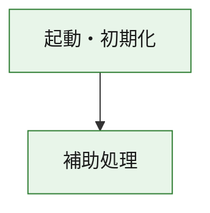
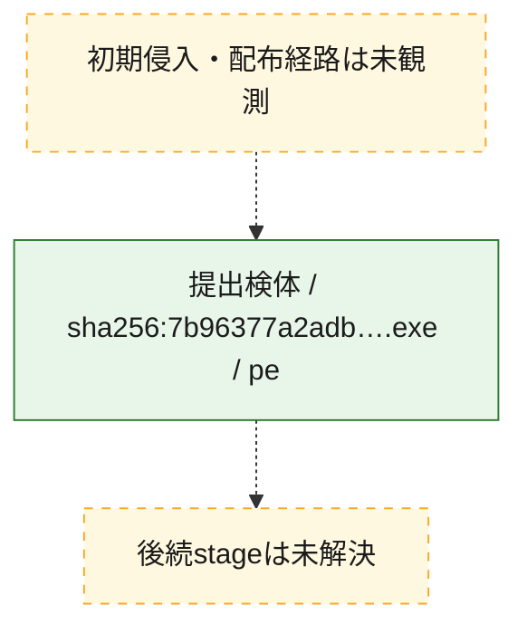
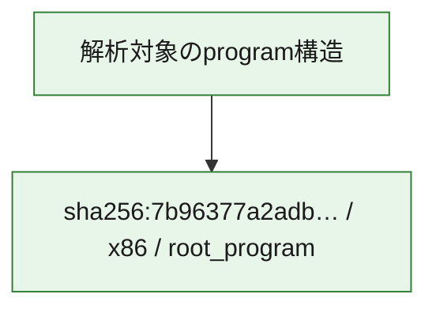

# 全体ロジック：7b96377a2adbbb83222a30d23d5bc4c11ab603aa236d339a7405ea1227941972

代表関数の静的証跡から、起動・初期化の処理群を確認しました。

## 読み方

- phaseの掲載順は解析上の整理順です。observed_call_edgesがない段階間の実行順を断定しません。
- 図の実線は静的に観測した関係、点線と黄色のノードは未観測・未解決の関係を示します。
- 図は静的な要約であり、動的実行を再現するものではありません。
- 詳細な関数解説とfingerprintは[STATIC-LOGIC.md](STATIC-LOGIC.md)を参照してください。

## 静的可視化

### 実行フロー

### 感染チェーン

### モジュール関係

## 処理段階

### 1. 起動・初期化

entry pointから初期化と後続処理への移行を確認します。
確度: `confirmed_static_function_evidence`

- `7b96377a2adbbb83222a30d23d5bc4c11ab603aa236d339a7405ea1227941972:ghidra:180001010` — 初期化と主要処理への分岐を行う入口関数です。 状態: `succeeded`、選定理由: `entry_point`, `meaningful_symbol_name`, `reviewed_call_centrality:22`, `role:entrypoint`, `small_program_complete_context`

### 2. 補助処理

主要処理を支える一般内部関数またはlibrary処理を確認します。
確度: `confirmed_static_function_evidence`

- `7b96377a2adbbb83222a30d23d5bc4c11ab603aa236d339a7405ea1227941972:ghidra:180001240` — 検体内部の一般処理を実装する関数です。 状態: `succeeded`、選定理由: `context_representative`, `reviewed_call_centrality:2`, `small_program_complete_context`
- `7b96377a2adbbb83222a30d23d5bc4c11ab603aa236d339a7405ea1227941972:ghidra:180001350` — 検体内部の一般処理を実装する関数です。 状態: `succeeded`、選定理由: `context_representative`, `reviewed_call_centrality:25`, `small_program_complete_context`
- `7b96377a2adbbb83222a30d23d5bc4c11ab603aa236d339a7405ea1227941972:ghidra:180003780` — 検体内部の一般処理を実装する関数です。 状態: `succeeded`、選定理由: `context_representative`, `reviewed_call_centrality:2`, `small_program_complete_context`
- `7b96377a2adbbb83222a30d23d5bc4c11ab603aa236d339a7405ea1227941972:ghidra:1800038e0` — 検体内部の一般処理を実装する関数です。 状態: `succeeded`、選定理由: `context_representative`, `reviewed_call_centrality:2`, `small_program_complete_context`

## 観測したcall関係

- `7b96377a2adbbb83222a30d23d5bc4c11ab603aa236d339a7405ea1227941972:ghidra:180001010` → `7b96377a2adbbb83222a30d23d5bc4c11ab603aa236d339a7405ea1227941972:ghidra:180001240` （`startup` → `support`）
- `7b96377a2adbbb83222a30d23d5bc4c11ab603aa236d339a7405ea1227941972:ghidra:180001010` → `7b96377a2adbbb83222a30d23d5bc4c11ab603aa236d339a7405ea1227941972:ghidra:180001350` （`startup` → `support`）
- `7b96377a2adbbb83222a30d23d5bc4c11ab603aa236d339a7405ea1227941972:ghidra:180001350` → `7b96377a2adbbb83222a30d23d5bc4c11ab603aa236d339a7405ea1227941972:ghidra:180001240` （`support` → `support`）
- `7b96377a2adbbb83222a30d23d5bc4c11ab603aa236d339a7405ea1227941972:ghidra:180001350` → `7b96377a2adbbb83222a30d23d5bc4c11ab603aa236d339a7405ea1227941972:ghidra:180003780` （`support` → `support`）
- `7b96377a2adbbb83222a30d23d5bc4c11ab603aa236d339a7405ea1227941972:ghidra:180001350` → `7b96377a2adbbb83222a30d23d5bc4c11ab603aa236d339a7405ea1227941972:ghidra:1800038e0` （`support` → `support`）
- `7b96377a2adbbb83222a30d23d5bc4c11ab603aa236d339a7405ea1227941972:ghidra:180003780` → `7b96377a2adbbb83222a30d23d5bc4c11ab603aa236d339a7405ea1227941972:ghidra:1800038e0` （`support` → `support`）
- `ghidra-function:2223ee54104a9e9387230d44` → `ghidra-function:a02aa3919e4693707bd95d81` （`unclassified` → `unclassified`）
- `ghidra-function:2d7d8d984979cb0649b8514c` → `ghidra-function:18e40bcaacccda6266b56056` （`unclassified` → `unclassified`）
- `ghidra-function:2d7d8d984979cb0649b8514c` → `ghidra-function:415836c16b61cce8a77411ce` （`unclassified` → `unclassified`）
- `ghidra-function:2d7d8d984979cb0649b8514c` → `ghidra-function:436891de46658e8f11ccac66` （`unclassified` → `unclassified`）
- `ghidra-function:2d7d8d984979cb0649b8514c` → `ghidra-function:5326de5bd6bfc444400b67cd` （`unclassified` → `unclassified`）
- `ghidra-function:2d7d8d984979cb0649b8514c` → `ghidra-function:59a396bca49fc6be77e1903d` （`unclassified` → `unclassified`）
- `ghidra-function:2d7d8d984979cb0649b8514c` → `ghidra-function:64cb8cf5ca350b1b9402e2d6` （`unclassified` → `unclassified`）
- `ghidra-function:2d7d8d984979cb0649b8514c` → `ghidra-function:70716452c9ad7f32cde3eec0` （`unclassified` → `unclassified`）
- `ghidra-function:2d7d8d984979cb0649b8514c` → `ghidra-function:a1ce938a1c950fb78cf60b16` （`unclassified` → `unclassified`）
- `ghidra-function:2d7d8d984979cb0649b8514c` → `ghidra-function:ad4df671562a6443ba9c601e` （`unclassified` → `unclassified`）
- `ghidra-function:2d7d8d984979cb0649b8514c` → `ghidra-function:b106f9051316aabaab275a8e` （`unclassified` → `unclassified`）
- `ghidra-function:2d7d8d984979cb0649b8514c` → `ghidra-function:c2f4a0971763621f0c7fa80c` （`unclassified` → `unclassified`）
- `ghidra-function:2d7d8d984979cb0649b8514c` → `ghidra-function:e43f8d89cbe07ac3f7e80e41` （`unclassified` → `unclassified`）
- `ghidra-function:59a396bca49fc6be77e1903d` → `ghidra-external:20aaef5803d6817b3f467864` （`unclassified` → `unclassified`）
- `ghidra-function:59a396bca49fc6be77e1903d` → `ghidra-external:20f1ecaef043d1f375c12955` （`unclassified` → `unclassified`）
- `ghidra-function:59a396bca49fc6be77e1903d` → `ghidra-external:276343fb8aab9117dfa9d209` （`unclassified` → `unclassified`）
- `ghidra-function:59a396bca49fc6be77e1903d` → `ghidra-external:2908b60386f240e506e14cd0` （`unclassified` → `unclassified`）
- `ghidra-function:59a396bca49fc6be77e1903d` → `ghidra-external:300c05eb04413116ac09568d` （`unclassified` → `unclassified`）
- `ghidra-function:59a396bca49fc6be77e1903d` → `ghidra-external:35dfb83a7c8a188c54feab30` （`unclassified` → `unclassified`）
- `ghidra-function:59a396bca49fc6be77e1903d` → `ghidra-external:42ee403fb5a90168004e8439` （`unclassified` → `unclassified`）
- `ghidra-function:59a396bca49fc6be77e1903d` → `ghidra-external:4add86c85ef3584642d94b02` （`unclassified` → `unclassified`）
- `ghidra-function:59a396bca49fc6be77e1903d` → `ghidra-external:4ce0f436e7a2607df5114cf5` （`unclassified` → `unclassified`）
- `ghidra-function:59a396bca49fc6be77e1903d` → `ghidra-external:4fdb7a688f5830fa8d2cdf3a` （`unclassified` → `unclassified`）
- `ghidra-function:59a396bca49fc6be77e1903d` → `ghidra-external:6141093c12f9f6d950c9034d` （`unclassified` → `unclassified`）
- `ghidra-function:59a396bca49fc6be77e1903d` → `ghidra-external:64b115c01cdfb98eb8ebef03` （`unclassified` → `unclassified`）
- `ghidra-function:59a396bca49fc6be77e1903d` → `ghidra-external:663ffd8122983cec06a62f84` （`unclassified` → `unclassified`）
- `ghidra-function:59a396bca49fc6be77e1903d` → `ghidra-external:872779ad1b1aeb783ff9c1b9` （`unclassified` → `unclassified`）
- `ghidra-function:59a396bca49fc6be77e1903d` → `ghidra-external:8f1d4126f1e9817283942ada` （`unclassified` → `unclassified`）
- `ghidra-function:59a396bca49fc6be77e1903d` → `ghidra-external:921c8e4e5c121057b99aace8` （`unclassified` → `unclassified`）
- `ghidra-function:59a396bca49fc6be77e1903d` → `ghidra-external:a1cbfcdd5ae57c2783f406b1` （`unclassified` → `unclassified`）
- `ghidra-function:59a396bca49fc6be77e1903d` → `ghidra-external:e5000d150776065ac53abf37` （`unclassified` → `unclassified`）
- `ghidra-function:59a396bca49fc6be77e1903d` → `ghidra-external:e9b3a71180ecec45dc8cf29c` （`unclassified` → `unclassified`）
- `ghidra-function:59a396bca49fc6be77e1903d` → `ghidra-external:f52bfde53fd0fdc97393c7c0` （`unclassified` → `unclassified`）
- `ghidra-function:59a396bca49fc6be77e1903d` → `ghidra-external:fe62473005b66c6627197a99` （`unclassified` → `unclassified`）
- `ghidra-function:59a396bca49fc6be77e1903d` → `ghidra-function:2223ee54104a9e9387230d44` （`unclassified` → `unclassified`）
- `ghidra-function:59a396bca49fc6be77e1903d` → `ghidra-function:415836c16b61cce8a77411ce` （`unclassified` → `unclassified`）
- `ghidra-function:59a396bca49fc6be77e1903d` → `ghidra-function:a02aa3919e4693707bd95d81` （`unclassified` → `unclassified`）

## 解析範囲と制約

- 選定外関数は全体inventoryへ残しますが、関数本体の個別解説対象にはしていません。
- indirect call、難読化、packer、VM、壊れたcontrol flowによりcall関係が欠落する場合があります。
- 文書は静的解析に基づき、検体実行や外部通信による動的確認は行っていません。
