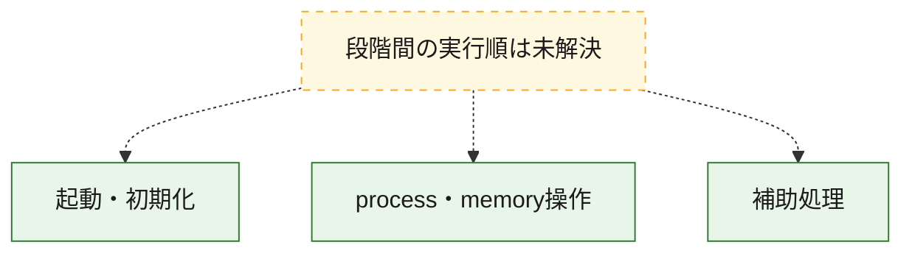
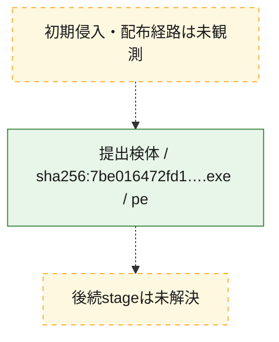
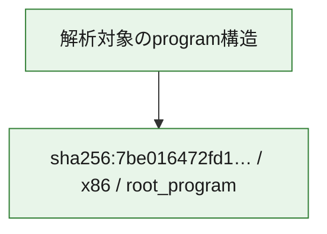

# 全体ロジック：7be016472fd1c64cd6d6ec831f3fb0452afb38d45f4d3f1b9925963f6e4d38ff

代表関数の静的証跡から、起動・初期化、process・memory操作の処理群を確認しました。

## 読み方

- phaseの掲載順は解析上の整理順です。observed_call_edgesがない段階間の実行順を断定しません。
- 図の実線は静的に観測した関係、点線と黄色のノードは未観測・未解決の関係を示します。
- 図は静的な要約であり、動的実行を再現するものではありません。
- 詳細な関数解説とfingerprintは[STATIC-LOGIC.md](STATIC-LOGIC.md)を参照してください。

## 静的可視化

### 実行フロー

### 感染チェーン

### モジュール関係

## 処理段階

### 1. 起動・初期化

entry pointから初期化と後続処理への移行を確認します。
確度: `confirmed_static_function_evidence`

- `7be016472fd1c64cd6d6ec831f3fb0452afb38d45f4d3f1b9925963f6e4d38ff:ghidra:7ff68d495eb0` — 初期化と主要処理への分岐を行う入口関数です。 状態: `succeeded`、選定理由: `entry_point`, `meaningful_symbol_name`, `reviewed_call_centrality:21`, `role:entrypoint`

### 2. process・memory操作

process、thread、module、memory操作と実行移行を確認します。
確度: `confirmed_static_function_evidence`

- `7be016472fd1c64cd6d6ec831f3fb0452afb38d45f4d3f1b9925963f6e4d38ff:ghidra:7ff68d4842e0` — process、thread、module、またはmemory操作に関係する関数です。 状態: `succeeded`、選定理由: `entry_point`, `meaningful_symbol_name`, `reviewed_call_centrality:9`, `role:process_or_memory_operation`

### 3. 補助処理

主要処理を支える一般内部関数またはlibrary処理を確認します。
確度: `confirmed_static_function_evidence_with_limits`

- `7be016472fd1c64cd6d6ec831f3fb0452afb38d45f4d3f1b9925963f6e4d38ff:ghidra:7ff68d45103c` — 検体内部の一般処理を実装する関数です。 状態: `succeeded`、選定理由: `context_representative`, `reviewed_call_centrality:2`
- `7be016472fd1c64cd6d6ec831f3fb0452afb38d45f4d3f1b9925963f6e4d38ff:ghidra:7ff68d451080` — 検体内部の一般処理を実装する関数です。 状態: `succeeded`、選定理由: `context_representative`, `reviewed_call_centrality:2`
- `7be016472fd1c64cd6d6ec831f3fb0452afb38d45f4d3f1b9925963f6e4d38ff:ghidra:7ff68d4510b0` — 検体内部の一般処理を実装する関数です。 状態: `succeeded`、選定理由: `context_representative`, `reviewed_call_centrality:2`
- `7be016472fd1c64cd6d6ec831f3fb0452afb38d45f4d3f1b9925963f6e4d38ff:ghidra:7ff68d451110` — 検体内部の一般処理を実装する関数です。 状態: `succeeded`、選定理由: `context_representative`, `reviewed_call_centrality:2`
- `7be016472fd1c64cd6d6ec831f3fb0452afb38d45f4d3f1b9925963f6e4d38ff:ghidra:7ff68d451170` — 検体内部の一般処理を実装する関数です。 状態: `succeeded`、選定理由: `context_representative`, `reviewed_call_centrality:3`
- `7be016472fd1c64cd6d6ec831f3fb0452afb38d45f4d3f1b9925963f6e4d38ff:ghidra:7ff68d4511f0` — 検体内部の一般処理を実装する関数です。 状態: `succeeded`、選定理由: `context_representative`, `reviewed_call_centrality:1`
- `7be016472fd1c64cd6d6ec831f3fb0452afb38d45f4d3f1b9925963f6e4d38ff:ghidra:7ff68d451250` — 検体内部の一般処理を実装する関数です。 状態: `succeeded`、選定理由: `context_representative`, `reviewed_call_centrality:2`
- `7be016472fd1c64cd6d6ec831f3fb0452afb38d45f4d3f1b9925963f6e4d38ff:ghidra:7ff68d4512f0` — 検体内部の一般処理を実装する関数です。 状態: `succeeded`、選定理由: `context_representative`, `reviewed_call_centrality:3`
- `7be016472fd1c64cd6d6ec831f3fb0452afb38d45f4d3f1b9925963f6e4d38ff:ghidra:7ff68d451310` — 検体内部の一般処理を実装する関数です。 状態: `succeeded`、選定理由: `context_representative`, `reviewed_call_centrality:1`
- `7be016472fd1c64cd6d6ec831f3fb0452afb38d45f4d3f1b9925963f6e4d38ff:ghidra:7ff68d451350` — 検体内部の一般処理を実装する関数です。 状態: `succeeded`、選定理由: `context_representative`, `reviewed_call_centrality:1`
- `7be016472fd1c64cd6d6ec831f3fb0452afb38d45f4d3f1b9925963f6e4d38ff:ghidra:7ff68d451390` — 検体内部の一般処理を実装する関数です。 状態: `succeeded`、選定理由: `context_representative`, `reviewed_call_centrality:2`
- `7be016472fd1c64cd6d6ec831f3fb0452afb38d45f4d3f1b9925963f6e4d38ff:ghidra:7ff68d4513b0` — 検体内部の一般処理を実装する関数です。 状態: `succeeded`、選定理由: `context_representative`, `reviewed_call_centrality:5`
- `7be016472fd1c64cd6d6ec831f3fb0452afb38d45f4d3f1b9925963f6e4d38ff:ghidra:7ff68d451420` — 検体内部の一般処理を実装する関数です。 状態: `succeeded`、選定理由: `context_representative`, `reviewed_call_centrality:5`
- `7be016472fd1c64cd6d6ec831f3fb0452afb38d45f4d3f1b9925963f6e4d38ff:ghidra:7ff68d451490` — 検体内部の一般処理を実装する関数です。 状態: `succeeded`、選定理由: `context_representative`, `reviewed_call_centrality:5`
- `7be016472fd1c64cd6d6ec831f3fb0452afb38d45f4d3f1b9925963f6e4d38ff:ghidra:7ff68d451500` — 検体内部の一般処理を実装する関数です。 状態: `succeeded`、選定理由: `context_representative`, `reviewed_call_centrality:2`
- `7be016472fd1c64cd6d6ec831f3fb0452afb38d45f4d3f1b9925963f6e4d38ff:ghidra:7ff68d4515c0` — 検体内部の一般処理を実装する関数です。 状態: `succeeded`、選定理由: `context_representative`, `reviewed_call_centrality:2`
- `7be016472fd1c64cd6d6ec831f3fb0452afb38d45f4d3f1b9925963f6e4d38ff:ghidra:7ff68d451640` — 検体内部の一般処理を実装する関数です。 状態: `succeeded`、選定理由: `context_representative`, `reviewed_call_centrality:1`
- `7be016472fd1c64cd6d6ec831f3fb0452afb38d45f4d3f1b9925963f6e4d38ff:ghidra:7ff68d451690` — 検体内部の一般処理を実装する関数です。 状態: `succeeded`、選定理由: `context_representative`
- `7be016472fd1c64cd6d6ec831f3fb0452afb38d45f4d3f1b9925963f6e4d38ff:ghidra:7ff68d451710` — 検体内部の一般処理を実装する関数です。 状態: `succeeded`、選定理由: `context_representative`, `reviewed_call_centrality:7`
- `7be016472fd1c64cd6d6ec831f3fb0452afb38d45f4d3f1b9925963f6e4d38ff:ghidra:7ff68d451920` — 検体内部の一般処理を実装する関数です。 状態: `succeeded`、選定理由: `context_representative`, `reviewed_call_centrality:2`
- `7be016472fd1c64cd6d6ec831f3fb0452afb38d45f4d3f1b9925963f6e4d38ff:ghidra:7ff68d451970` — 検体内部の一般処理を実装する関数です。 状態: `succeeded`、選定理由: `context_representative`, `reviewed_call_centrality:1`
- `7be016472fd1c64cd6d6ec831f3fb0452afb38d45f4d3f1b9925963f6e4d38ff:ghidra:7ff68d4519d0` — 検体内部の一般処理を実装する関数です。 状態: `succeeded`、選定理由: `context_representative`, `reviewed_call_centrality:1`
- `7be016472fd1c64cd6d6ec831f3fb0452afb38d45f4d3f1b9925963f6e4d38ff:ghidra:7ff68d451a30` — 検体内部の一般処理を実装する関数です。 状態: `succeeded`、選定理由: `context_representative`, `reviewed_call_centrality:3`
- `7be016472fd1c64cd6d6ec831f3fb0452afb38d45f4d3f1b9925963f6e4d38ff:ghidra:7ff68d451af0` — 検体内部の一般処理を実装する関数です。 状態: `succeeded`、選定理由: `context_representative`, `reviewed_call_centrality:1`
- `7be016472fd1c64cd6d6ec831f3fb0452afb38d45f4d3f1b9925963f6e4d38ff:ghidra:7ff68d451b50` — 検体内部の一般処理を実装する関数です。 状態: `succeeded`、選定理由: `context_representative`, `reviewed_call_centrality:3`
- `7be016472fd1c64cd6d6ec831f3fb0452afb38d45f4d3f1b9925963f6e4d38ff:ghidra:7ff68d451b70` — 検体内部の一般処理を実装する関数です。 状態: `succeeded`、選定理由: `context_representative`, `reviewed_call_centrality:1`
- `7be016472fd1c64cd6d6ec831f3fb0452afb38d45f4d3f1b9925963f6e4d38ff:ghidra:7ff68d451bc0` — 検体内部の一般処理を実装する関数です。 状態: `succeeded`、選定理由: `context_representative`, `reviewed_call_centrality:1`
- `7be016472fd1c64cd6d6ec831f3fb0452afb38d45f4d3f1b9925963f6e4d38ff:ghidra:7ff68d451bf0` — 検体内部の一般処理を実装する関数です。 状態: `limited_bad_instruction_or_flow`、選定理由: `context_representative`, `reviewed_call_centrality:3`
- `7be016472fd1c64cd6d6ec831f3fb0452afb38d45f4d3f1b9925963f6e4d38ff:ghidra:7ff68d451cc0` — 検体内部の一般処理を実装する関数です。 状態: `limited_bad_instruction_or_flow`、選定理由: `context_representative`
- `7be016472fd1c64cd6d6ec831f3fb0452afb38d45f4d3f1b9925963f6e4d38ff:ghidra:7ff68d48d7d0` — 検体内部の一般処理を実装する関数です。 状態: `succeeded`、選定理由: `meaningful_symbol_name`

## 観測したcall関係

- 代表関数間で直接解決できた呼出関係はありません。

## 解析範囲と制約

- 選定外関数は全体inventoryへ残しますが、関数本体の個別解説対象にはしていません。
- indirect call、難読化、packer、VM、壊れたcontrol flowによりcall関係が欠落する場合があります。
- 文書は静的解析に基づき、検体実行や外部通信による動的確認は行っていません。
