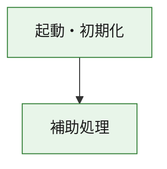
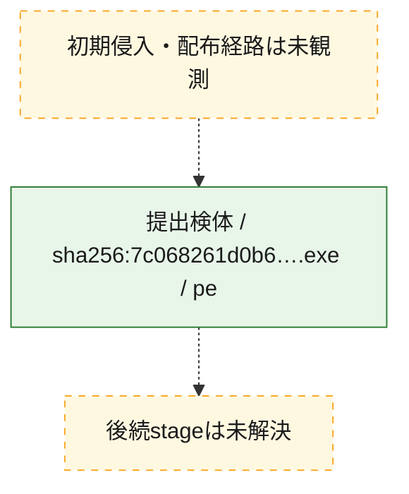
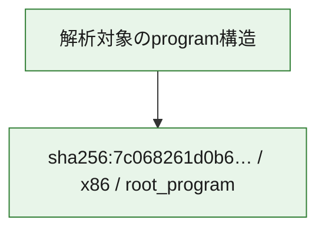

# 全体ロジック：7c068261d0b6bd816f7d238590dc748623cb8e6700c6eb3e40fdde0790a4eba5

代表関数の静的証跡から、起動・初期化の処理群を確認しました。

## 読み方

- phaseの掲載順は解析上の整理順です。observed_call_edgesがない段階間の実行順を断定しません。
- 図の実線は静的に観測した関係、点線と黄色のノードは未観測・未解決の関係を示します。
- 図は静的な要約であり、動的実行を再現するものではありません。
- 詳細な関数解説とfingerprintは[STATIC-LOGIC.md](STATIC-LOGIC.md)を参照してください。

## 静的可視化

### 実行フロー

### 感染チェーン

### モジュール関係

## 処理段階

### 1. 起動・初期化

entry pointから初期化と後続処理への移行を確認します。
確度: `confirmed_static_function_evidence`

- `7c068261d0b6bd816f7d238590dc748623cb8e6700c6eb3e40fdde0790a4eba5:ghidra:180001010` — 初期化と主要処理への分岐を行う入口関数です。 状態: `succeeded`、選定理由: `entry_point`, `meaningful_symbol_name`, `reviewed_call_centrality:22`, `role:entrypoint`, `small_program_complete_context`

### 2. 補助処理

主要処理を支える一般内部関数またはlibrary処理を確認します。
確度: `confirmed_static_function_evidence`

- `7c068261d0b6bd816f7d238590dc748623cb8e6700c6eb3e40fdde0790a4eba5:ghidra:180001240` — 検体内部の一般処理を実装する関数です。 状態: `succeeded`、選定理由: `context_representative`, `reviewed_call_centrality:2`, `small_program_complete_context`
- `7c068261d0b6bd816f7d238590dc748623cb8e6700c6eb3e40fdde0790a4eba5:ghidra:180001350` — 検体内部の一般処理を実装する関数です。 状態: `succeeded`、選定理由: `context_representative`, `reviewed_call_centrality:25`, `small_program_complete_context`
- `7c068261d0b6bd816f7d238590dc748623cb8e6700c6eb3e40fdde0790a4eba5:ghidra:180003780` — 検体内部の一般処理を実装する関数です。 状態: `succeeded`、選定理由: `context_representative`, `reviewed_call_centrality:2`, `small_program_complete_context`
- `7c068261d0b6bd816f7d238590dc748623cb8e6700c6eb3e40fdde0790a4eba5:ghidra:1800038e0` — 検体内部の一般処理を実装する関数です。 状態: `succeeded`、選定理由: `context_representative`, `reviewed_call_centrality:2`, `small_program_complete_context`

## 観測したcall関係

- `7c068261d0b6bd816f7d238590dc748623cb8e6700c6eb3e40fdde0790a4eba5:ghidra:180001010` → `7c068261d0b6bd816f7d238590dc748623cb8e6700c6eb3e40fdde0790a4eba5:ghidra:180001240` （`startup` → `support`）
- `7c068261d0b6bd816f7d238590dc748623cb8e6700c6eb3e40fdde0790a4eba5:ghidra:180001010` → `7c068261d0b6bd816f7d238590dc748623cb8e6700c6eb3e40fdde0790a4eba5:ghidra:180001350` （`startup` → `support`）
- `7c068261d0b6bd816f7d238590dc748623cb8e6700c6eb3e40fdde0790a4eba5:ghidra:180001350` → `7c068261d0b6bd816f7d238590dc748623cb8e6700c6eb3e40fdde0790a4eba5:ghidra:180001240` （`support` → `support`）
- `7c068261d0b6bd816f7d238590dc748623cb8e6700c6eb3e40fdde0790a4eba5:ghidra:180001350` → `7c068261d0b6bd816f7d238590dc748623cb8e6700c6eb3e40fdde0790a4eba5:ghidra:180003780` （`support` → `support`）
- `7c068261d0b6bd816f7d238590dc748623cb8e6700c6eb3e40fdde0790a4eba5:ghidra:180001350` → `7c068261d0b6bd816f7d238590dc748623cb8e6700c6eb3e40fdde0790a4eba5:ghidra:1800038e0` （`support` → `support`）
- `7c068261d0b6bd816f7d238590dc748623cb8e6700c6eb3e40fdde0790a4eba5:ghidra:180003780` → `7c068261d0b6bd816f7d238590dc748623cb8e6700c6eb3e40fdde0790a4eba5:ghidra:1800038e0` （`support` → `support`）
- `ghidra-function:0e01dc4c62b72360b6ea903d` → `ghidra-external:28cda2aefcfacd79124b63ca` （`unclassified` → `unclassified`）
- `ghidra-function:0e01dc4c62b72360b6ea903d` → `ghidra-external:3791a03cbe7d9fc0daaab1c5` （`unclassified` → `unclassified`）
- `ghidra-function:0e01dc4c62b72360b6ea903d` → `ghidra-external:4ea5593098308221fb034eb0` （`unclassified` → `unclassified`）
- `ghidra-function:0e01dc4c62b72360b6ea903d` → `ghidra-external:6da4c605170890cacb77889b` （`unclassified` → `unclassified`）
- `ghidra-function:0e01dc4c62b72360b6ea903d` → `ghidra-external:70b39edcf2a0a606ac04c963` （`unclassified` → `unclassified`）
- `ghidra-function:0e01dc4c62b72360b6ea903d` → `ghidra-external:71e121c99aa42fa18bb99805` （`unclassified` → `unclassified`）
- `ghidra-function:0e01dc4c62b72360b6ea903d` → `ghidra-external:80e8d2426b3512f8250e0e8c` （`unclassified` → `unclassified`）
- `ghidra-function:0e01dc4c62b72360b6ea903d` → `ghidra-external:8559560610a65b2345b6ff21` （`unclassified` → `unclassified`）
- `ghidra-function:0e01dc4c62b72360b6ea903d` → `ghidra-external:86bbe100187010bbecf7a3d2` （`unclassified` → `unclassified`）
- `ghidra-function:0e01dc4c62b72360b6ea903d` → `ghidra-external:924a445f3d906e8cd5c7d138` （`unclassified` → `unclassified`）
- `ghidra-function:0e01dc4c62b72360b6ea903d` → `ghidra-external:948c97bf38195f88ce6c6ed3` （`unclassified` → `unclassified`）
- `ghidra-function:0e01dc4c62b72360b6ea903d` → `ghidra-external:a35abdf3772bf118be5308fa` （`unclassified` → `unclassified`）
- `ghidra-function:0e01dc4c62b72360b6ea903d` → `ghidra-external:a63501a686275308c60bce3b` （`unclassified` → `unclassified`）
- `ghidra-function:0e01dc4c62b72360b6ea903d` → `ghidra-external:c349cc41dcab07372340ce8a` （`unclassified` → `unclassified`）
- `ghidra-function:0e01dc4c62b72360b6ea903d` → `ghidra-external:c53710bb3c4866a91a8c2832` （`unclassified` → `unclassified`）
- `ghidra-function:0e01dc4c62b72360b6ea903d` → `ghidra-external:c55c7cc8a46aa7ffc0965911` （`unclassified` → `unclassified`）
- `ghidra-function:0e01dc4c62b72360b6ea903d` → `ghidra-external:c90dfaeed260adea25d3cd65` （`unclassified` → `unclassified`）
- `ghidra-function:0e01dc4c62b72360b6ea903d` → `ghidra-external:e0f96ed72810457054d7dcce` （`unclassified` → `unclassified`）
- `ghidra-function:0e01dc4c62b72360b6ea903d` → `ghidra-external:e73b9066b82524bf5b1eb519` （`unclassified` → `unclassified`）
- `ghidra-function:0e01dc4c62b72360b6ea903d` → `ghidra-external:f637e7c1d5db3409651798c7` （`unclassified` → `unclassified`）
- `ghidra-function:0e01dc4c62b72360b6ea903d` → `ghidra-external:f95e85053eeb9485327e42f3` （`unclassified` → `unclassified`）
- `ghidra-function:0e01dc4c62b72360b6ea903d` → `ghidra-function:063cb9c30dc366ea268a74cd` （`unclassified` → `unclassified`）
- `ghidra-function:0e01dc4c62b72360b6ea903d` → `ghidra-function:34ca54eaabfbeed03de98583` （`unclassified` → `unclassified`）
- `ghidra-function:0e01dc4c62b72360b6ea903d` → `ghidra-function:4333ea2acc1d9e68ed2904c1` （`unclassified` → `unclassified`）
- `ghidra-function:34ca54eaabfbeed03de98583` → `ghidra-function:4333ea2acc1d9e68ed2904c1` （`unclassified` → `unclassified`）
- `ghidra-function:ecd426cc18b45c38910aba5a` → `ghidra-function:063cb9c30dc366ea268a74cd` （`unclassified` → `unclassified`）
- `ghidra-function:ecd426cc18b45c38910aba5a` → `ghidra-function:0e01dc4c62b72360b6ea903d` （`unclassified` → `unclassified`）
- `ghidra-function:ecd426cc18b45c38910aba5a` → `ghidra-function:13f0cacaa9b2e76b0baefc78` （`unclassified` → `unclassified`）
- `ghidra-function:ecd426cc18b45c38910aba5a` → `ghidra-function:23df47dd6296a439a4a8a345` （`unclassified` → `unclassified`）
- `ghidra-function:ecd426cc18b45c38910aba5a` → `ghidra-function:32dc38e5822b5681ee50b9eb` （`unclassified` → `unclassified`）
- `ghidra-function:ecd426cc18b45c38910aba5a` → `ghidra-function:5fa73bf55e3405ab6795e7b7` （`unclassified` → `unclassified`）
- `ghidra-function:ecd426cc18b45c38910aba5a` → `ghidra-function:6196d6eed10afaee2cceeb36` （`unclassified` → `unclassified`）
- `ghidra-function:ecd426cc18b45c38910aba5a` → `ghidra-function:8a40e3417a18d080dcd34e9a` （`unclassified` → `unclassified`）
- `ghidra-function:ecd426cc18b45c38910aba5a` → `ghidra-function:aa70fd04939e1de2d0915951` （`unclassified` → `unclassified`）
- `ghidra-function:ecd426cc18b45c38910aba5a` → `ghidra-function:c96a98700aa87962d7b98ab5` （`unclassified` → `unclassified`）
- `ghidra-function:ecd426cc18b45c38910aba5a` → `ghidra-function:d88e9ca0e12c67f7bf191242` （`unclassified` → `unclassified`）
- `ghidra-function:ecd426cc18b45c38910aba5a` → `ghidra-function:e44b7b3c87f671d79775e11b` （`unclassified` → `unclassified`）

## 解析範囲と制約

- 選定外関数は全体inventoryへ残しますが、関数本体の個別解説対象にはしていません。
- indirect call、難読化、packer、VM、壊れたcontrol flowによりcall関係が欠落する場合があります。
- 文書は静的解析に基づき、検体実行や外部通信による動的確認は行っていません。
