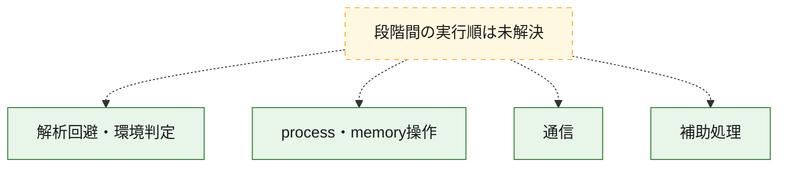
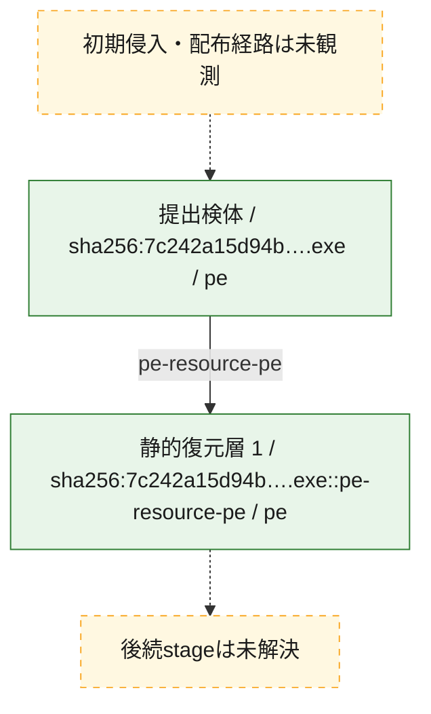
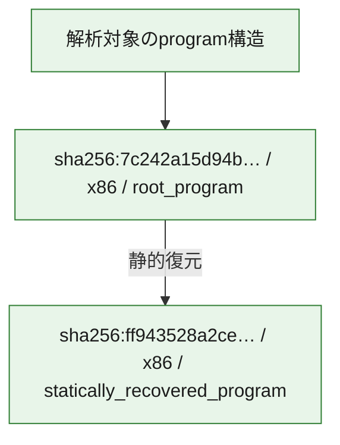

# 全体ロジック：7c242a15d94b0fe18ed80baca703d361fc75c2e1062ed408f73a7679dd99420c

代表関数の静的証跡から、解析回避・環境判定、process・memory操作、通信の処理群を確認しました。

## 読み方

- phaseの掲載順は解析上の整理順です。observed_call_edgesがない段階間の実行順を断定しません。
- 図の実線は静的に観測した関係、点線と黄色のノードは未観測・未解決の関係を示します。
- 図は静的な要約であり、動的実行を再現するものではありません。
- 詳細な関数解説とfingerprintは[STATIC-LOGIC.md](STATIC-LOGIC.md)を参照してください。

## 静的可視化

### 実行フロー

### 感染チェーン

### モジュール関係

## 処理段階

### 1. 解析回避・環境判定

debugger、sandbox、仮想環境、時間差などの判定を確認します。
確度: `confirmed_static_function_evidence`

- `7c242a15d94b0fe18ed80baca703d361fc75c2e1062ed408f73a7679dd99420c:ghidra:1400011d0` — debugger、仮想環境、sandbox、または時間差の確認に関係する関数です。 状態: `succeeded`、選定理由: `context_representative`, `reviewed_call_centrality:3`, `role:anti_analysis`

### 2. process・memory操作

process、thread、module、memory操作と実行移行を確認します。
確度: `confirmed_static_function_evidence`

- `ff943528a2cef4584bfa48a1a49e3773be4a2242a16852e4ce0f22123c682ca3:ghidra:180001000` — process、thread、module、またはmemory操作に関係する関数です。 状態: `succeeded`、選定理由: `context_representative`, `reviewed_call_centrality:11`, `role:process_or_memory_operation`, `small_program_complete_context`
- `ff943528a2cef4584bfa48a1a49e3773be4a2242a16852e4ce0f22123c682ca3:ghidra:180001274` — process、thread、module、またはmemory操作に関係する関数です。 状態: `succeeded`、選定理由: `context_representative`, `reviewed_call_centrality:9`, `role:process_or_memory_operation`, `small_program_complete_context`
- `ff943528a2cef4584bfa48a1a49e3773be4a2242a16852e4ce0f22123c682ca3:ghidra:180001470` — process、thread、module、またはmemory操作に関係する関数です。 状態: `succeeded`、選定理由: `context_representative`, `reviewed_call_centrality:9`, `role:process_or_memory_operation`, `small_program_complete_context`
- `7c242a15d94b0fe18ed80baca703d361fc75c2e1062ed408f73a7679dd99420c:ghidra:140025ce0` — process、thread、module、またはmemory操作に関係する関数です。 状態: `succeeded`、選定理由: `entry_point`, `meaningful_symbol_name`, `reviewed_call_centrality:3`, `role:process_or_memory_operation`
- `7c242a15d94b0fe18ed80baca703d361fc75c2e1062ed408f73a7679dd99420c:ghidra:140025d10` — process、thread、module、またはmemory操作に関係する関数です。 状態: `succeeded`、選定理由: `entry_point`, `meaningful_symbol_name`, `reviewed_call_centrality:30`, `role:process_or_memory_operation`

### 3. 通信

通信初期化、endpoint処理、送受信の役割を確認します。
確度: `confirmed_static_function_evidence`

- `ff943528a2cef4584bfa48a1a49e3773be4a2242a16852e4ce0f22123c682ca3:ghidra:18000155c` — 通信初期化、送受信、またはendpoint処理に関係する関数です。 状態: `succeeded`、選定理由: `entry_point`, `reviewed_call_centrality:38`, `role:network_communication`, `small_program_complete_context`

### 4. 補助処理

主要処理を支える一般内部関数またはlibrary処理を確認します。
確度: `confirmed_static_function_evidence`

- `ff943528a2cef4584bfa48a1a49e3773be4a2242a16852e4ce0f22123c682ca3:ghidra:180001304` — 検体内部の一般処理を実装する関数です。 状態: `succeeded`、選定理由: `context_representative`, `reviewed_call_centrality:1`, `small_program_complete_context`
- `7c242a15d94b0fe18ed80baca703d361fc75c2e1062ed408f73a7679dd99420c:ghidra:140001000` — 検体内部の一般処理を実装する関数です。 状態: `succeeded`、選定理由: `context_representative`, `reviewed_call_centrality:3`
- `7c242a15d94b0fe18ed80baca703d361fc75c2e1062ed408f73a7679dd99420c:ghidra:140001038` — 検体内部の一般処理を実装する関数です。 状態: `succeeded`、選定理由: `context_representative`, `reviewed_call_centrality:3`
- `7c242a15d94b0fe18ed80baca703d361fc75c2e1062ed408f73a7679dd99420c:ghidra:14000107c` — 検体内部の一般処理を実装する関数です。 状態: `succeeded`、選定理由: `context_representative`, `reviewed_call_centrality:3`
- `7c242a15d94b0fe18ed80baca703d361fc75c2e1062ed408f73a7679dd99420c:ghidra:1400010b4` — 検体内部の一般処理を実装する関数です。 状態: `succeeded`、選定理由: `context_representative`, `reviewed_call_centrality:3`
- `7c242a15d94b0fe18ed80baca703d361fc75c2e1062ed408f73a7679dd99420c:ghidra:140001104` — 検体内部の一般処理を実装する関数です。 状態: `succeeded`、選定理由: `context_representative`, `reviewed_call_centrality:3`
- `7c242a15d94b0fe18ed80baca703d361fc75c2e1062ed408f73a7679dd99420c:ghidra:140001170` — 検体内部の一般処理を実装する関数です。 状態: `succeeded`、選定理由: `context_representative`, `reviewed_call_centrality:1`
- `7c242a15d94b0fe18ed80baca703d361fc75c2e1062ed408f73a7679dd99420c:ghidra:1400011ec` — 検体内部の一般処理を実装する関数です。 状態: `succeeded`、選定理由: `context_representative`, `reviewed_call_centrality:3`
- `7c242a15d94b0fe18ed80baca703d361fc75c2e1062ed408f73a7679dd99420c:ghidra:140001204` — 検体内部の一般処理を実装する関数です。 状態: `succeeded`、選定理由: `context_representative`, `reviewed_call_centrality:3`
- `7c242a15d94b0fe18ed80baca703d361fc75c2e1062ed408f73a7679dd99420c:ghidra:1400012b8` — 検体内部の一般処理を実装する関数です。 状態: `succeeded`、選定理由: `context_representative`, `reviewed_call_centrality:1`
- `7c242a15d94b0fe18ed80baca703d361fc75c2e1062ed408f73a7679dd99420c:ghidra:1400012c8` — 検体内部の一般処理を実装する関数です。 状態: `succeeded`、選定理由: `context_representative`, `reviewed_call_centrality:2`
- `7c242a15d94b0fe18ed80baca703d361fc75c2e1062ed408f73a7679dd99420c:ghidra:140001340` — 検体内部の一般処理を実装する関数です。 状態: `succeeded`、選定理由: `context_representative`, `reviewed_call_centrality:2`
- `7c242a15d94b0fe18ed80baca703d361fc75c2e1062ed408f73a7679dd99420c:ghidra:1400013bc` — 検体内部の一般処理を実装する関数です。 状態: `succeeded`、選定理由: `context_representative`, `reviewed_call_centrality:4`
- `7c242a15d94b0fe18ed80baca703d361fc75c2e1062ed408f73a7679dd99420c:ghidra:140001430` — 検体内部の一般処理を実装する関数です。 状態: `succeeded`、選定理由: `context_representative`, `reviewed_call_centrality:2`
- `7c242a15d94b0fe18ed80baca703d361fc75c2e1062ed408f73a7679dd99420c:ghidra:1400014ac` — 検体内部の一般処理を実装する関数です。 状態: `succeeded`、選定理由: `context_representative`, `reviewed_call_centrality:5`
- `7c242a15d94b0fe18ed80baca703d361fc75c2e1062ed408f73a7679dd99420c:ghidra:140001530` — 検体内部の一般処理を実装する関数です。 状態: `succeeded`、選定理由: `context_representative`, `reviewed_call_centrality:3`
- `7c242a15d94b0fe18ed80baca703d361fc75c2e1062ed408f73a7679dd99420c:ghidra:140001624` — 検体内部の一般処理を実装する関数です。 状態: `succeeded`、選定理由: `context_representative`, `reviewed_call_centrality:3`
- `7c242a15d94b0fe18ed80baca703d361fc75c2e1062ed408f73a7679dd99420c:ghidra:140001718` — 検体内部の一般処理を実装する関数です。 状態: `succeeded`、選定理由: `context_representative`, `reviewed_call_centrality:3`
- `7c242a15d94b0fe18ed80baca703d361fc75c2e1062ed408f73a7679dd99420c:ghidra:140001808` — 検体内部の一般処理を実装する関数です。 状態: `succeeded`、選定理由: `context_representative`, `reviewed_call_centrality:5`
- `7c242a15d94b0fe18ed80baca703d361fc75c2e1062ed408f73a7679dd99420c:ghidra:140001918` — 検体内部の一般処理を実装する関数です。 状態: `succeeded`、選定理由: `context_representative`, `reviewed_call_centrality:4`
- `7c242a15d94b0fe18ed80baca703d361fc75c2e1062ed408f73a7679dd99420c:ghidra:140001a34` — 検体内部の一般処理を実装する関数です。 状態: `succeeded`、選定理由: `context_representative`, `reviewed_call_centrality:4`
- `7c242a15d94b0fe18ed80baca703d361fc75c2e1062ed408f73a7679dd99420c:ghidra:140001b50` — 検体内部の一般処理を実装する関数です。 状態: `succeeded`、選定理由: `context_representative`, `reviewed_call_centrality:4`
- `7c242a15d94b0fe18ed80baca703d361fc75c2e1062ed408f73a7679dd99420c:ghidra:140001c70` — 検体内部の一般処理を実装する関数です。 状態: `succeeded`、選定理由: `context_representative`, `reviewed_call_centrality:4`
- `7c242a15d94b0fe18ed80baca703d361fc75c2e1062ed408f73a7679dd99420c:ghidra:140001d90` — 検体内部の一般処理を実装する関数です。 状態: `succeeded`、選定理由: `context_representative`, `reviewed_call_centrality:4`
- `7c242a15d94b0fe18ed80baca703d361fc75c2e1062ed408f73a7679dd99420c:ghidra:140001eac` — 検体内部の一般処理を実装する関数です。 状態: `succeeded`、選定理由: `context_representative`, `reviewed_call_centrality:4`
- `7c242a15d94b0fe18ed80baca703d361fc75c2e1062ed408f73a7679dd99420c:ghidra:140001fc8` — 検体内部の一般処理を実装する関数です。 状態: `succeeded`、選定理由: `context_representative`, `reviewed_call_centrality:4`
- `7c242a15d94b0fe18ed80baca703d361fc75c2e1062ed408f73a7679dd99420c:ghidra:1400020e8` — 検体内部の一般処理を実装する関数です。 状態: `succeeded`、選定理由: `context_representative`, `reviewed_call_centrality:4`
- `7c242a15d94b0fe18ed80baca703d361fc75c2e1062ed408f73a7679dd99420c:ghidra:14000220c` — 検体内部の一般処理を実装する関数です。 状態: `succeeded`、選定理由: `context_representative`, `reviewed_call_centrality:4`
- `7c242a15d94b0fe18ed80baca703d361fc75c2e1062ed408f73a7679dd99420c:ghidra:140002328` — 検体内部の一般処理を実装する関数です。 状態: `succeeded`、選定理由: `context_representative`, `reviewed_call_centrality:4`
- `7c242a15d94b0fe18ed80baca703d361fc75c2e1062ed408f73a7679dd99420c:ghidra:140028930` — 検体内部の一般処理を実装する関数です。 状態: `succeeded`、選定理由: `meaningful_symbol_name`

## 観測したcall関係

- 代表関数間で直接解決できた呼出関係はありません。

## 解析範囲と制約

- 選定外関数は全体inventoryへ残しますが、関数本体の個別解説対象にはしていません。
- indirect call、難読化、packer、VM、壊れたcontrol flowによりcall関係が欠落する場合があります。
- 文書は静的解析に基づき、検体実行や外部通信による動的確認は行っていません。
