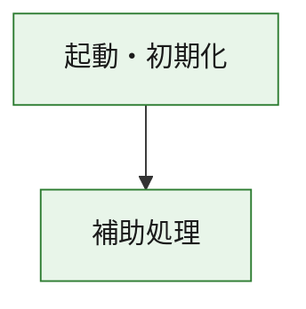
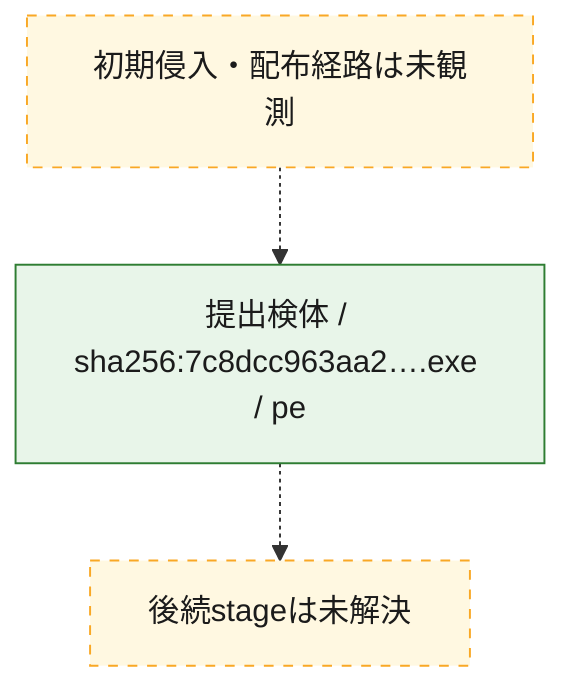
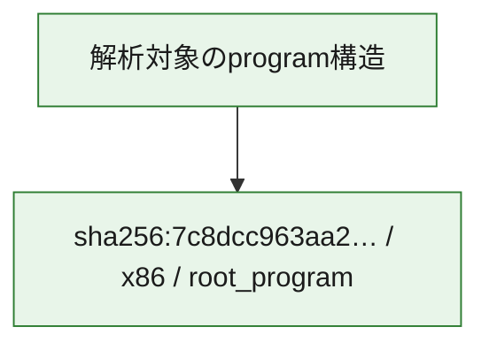

# 全体ロジック：7c8dcc963aa252b5e41ae6a7613beef9b4c54248743da5b443daf370164e80b9

代表関数の静的証跡から、起動・初期化の処理群を確認しました。

## 読み方

- phaseの掲載順は解析上の整理順です。observed_call_edgesがない段階間の実行順を断定しません。
- 図の実線は静的に観測した関係、点線と黄色のノードは未観測・未解決の関係を示します。
- 図は静的な要約であり、動的実行を再現するものではありません。
- 詳細な関数解説とfingerprintは[STATIC-LOGIC.md](STATIC-LOGIC.md)を参照してください。

## 静的可視化

### 実行フロー

### 感染チェーン

### モジュール関係

## 処理段階

### 1. 起動・初期化

entry pointから初期化と後続処理への移行を確認します。
確度: `confirmed_static_function_evidence`

- `7c8dcc963aa252b5e41ae6a7613beef9b4c54248743da5b443daf370164e80b9:ghidra:180001010` — 初期化と主要処理への分岐を行う入口関数です。 状態: `succeeded`、選定理由: `entry_point`, `meaningful_symbol_name`, `reviewed_call_centrality:22`, `role:entrypoint`, `small_program_complete_context`

### 2. 補助処理

主要処理を支える一般内部関数またはlibrary処理を確認します。
確度: `confirmed_static_function_evidence`

- `7c8dcc963aa252b5e41ae6a7613beef9b4c54248743da5b443daf370164e80b9:ghidra:180001240` — 検体内部の一般処理を実装する関数です。 状態: `succeeded`、選定理由: `context_representative`, `reviewed_call_centrality:2`, `small_program_complete_context`
- `7c8dcc963aa252b5e41ae6a7613beef9b4c54248743da5b443daf370164e80b9:ghidra:180001350` — 検体内部の一般処理を実装する関数です。 状態: `succeeded`、選定理由: `context_representative`, `reviewed_call_centrality:25`, `small_program_complete_context`
- `7c8dcc963aa252b5e41ae6a7613beef9b4c54248743da5b443daf370164e80b9:ghidra:180003780` — 検体内部の一般処理を実装する関数です。 状態: `succeeded`、選定理由: `context_representative`, `reviewed_call_centrality:2`, `small_program_complete_context`
- `7c8dcc963aa252b5e41ae6a7613beef9b4c54248743da5b443daf370164e80b9:ghidra:1800038e0` — 検体内部の一般処理を実装する関数です。 状態: `succeeded`、選定理由: `context_representative`, `reviewed_call_centrality:2`, `small_program_complete_context`

## 観測したcall関係

- `7c8dcc963aa252b5e41ae6a7613beef9b4c54248743da5b443daf370164e80b9:ghidra:180001010` → `7c8dcc963aa252b5e41ae6a7613beef9b4c54248743da5b443daf370164e80b9:ghidra:180001240` （`startup` → `support`）
- `7c8dcc963aa252b5e41ae6a7613beef9b4c54248743da5b443daf370164e80b9:ghidra:180001010` → `7c8dcc963aa252b5e41ae6a7613beef9b4c54248743da5b443daf370164e80b9:ghidra:180001350` （`startup` → `support`）
- `7c8dcc963aa252b5e41ae6a7613beef9b4c54248743da5b443daf370164e80b9:ghidra:180001350` → `7c8dcc963aa252b5e41ae6a7613beef9b4c54248743da5b443daf370164e80b9:ghidra:180001240` （`support` → `support`）
- `7c8dcc963aa252b5e41ae6a7613beef9b4c54248743da5b443daf370164e80b9:ghidra:180001350` → `7c8dcc963aa252b5e41ae6a7613beef9b4c54248743da5b443daf370164e80b9:ghidra:180003780` （`support` → `support`）
- `7c8dcc963aa252b5e41ae6a7613beef9b4c54248743da5b443daf370164e80b9:ghidra:180001350` → `7c8dcc963aa252b5e41ae6a7613beef9b4c54248743da5b443daf370164e80b9:ghidra:1800038e0` （`support` → `support`）
- `7c8dcc963aa252b5e41ae6a7613beef9b4c54248743da5b443daf370164e80b9:ghidra:180003780` → `7c8dcc963aa252b5e41ae6a7613beef9b4c54248743da5b443daf370164e80b9:ghidra:1800038e0` （`support` → `support`）
- `ghidra-function:414f1559b48fc4ba21037880` → `ghidra-function:1aa572b7740da212eed62182` （`unclassified` → `unclassified`）
- `ghidra-function:414f1559b48fc4ba21037880` → `ghidra-function:2e28b513a606d4c9cee411e5` （`unclassified` → `unclassified`）
- `ghidra-function:414f1559b48fc4ba21037880` → `ghidra-function:3a8cc94132afab5002ae65c3` （`unclassified` → `unclassified`）
- `ghidra-function:414f1559b48fc4ba21037880` → `ghidra-function:43ef5b733c640811d80ad924` （`unclassified` → `unclassified`）
- `ghidra-function:414f1559b48fc4ba21037880` → `ghidra-function:4c5e7c3a9c8c7df29b098b7e` （`unclassified` → `unclassified`）
- `ghidra-function:414f1559b48fc4ba21037880` → `ghidra-function:52a84c39eef110f5bc050430` （`unclassified` → `unclassified`）
- `ghidra-function:414f1559b48fc4ba21037880` → `ghidra-function:80671efb3855e6f8df2cf0e4` （`unclassified` → `unclassified`）
- `ghidra-function:414f1559b48fc4ba21037880` → `ghidra-function:865286e7bb8196b0e73ac51b` （`unclassified` → `unclassified`）
- `ghidra-function:414f1559b48fc4ba21037880` → `ghidra-function:b758a503504193ace38f5b0a` （`unclassified` → `unclassified`）
- `ghidra-function:414f1559b48fc4ba21037880` → `ghidra-function:dadeacf33e3649dc3caace03` （`unclassified` → `unclassified`）
- `ghidra-function:414f1559b48fc4ba21037880` → `ghidra-function:fb3359c1d9ab17b44b4528af` （`unclassified` → `unclassified`）
- `ghidra-function:414f1559b48fc4ba21037880` → `ghidra-function:ff8ff93a9be0c71987d9800d` （`unclassified` → `unclassified`）
- `ghidra-function:bdb946ba560e842ac831590f` → `ghidra-function:d84a89e52388033a4efbcaa3` （`unclassified` → `unclassified`）
- `ghidra-function:fb3359c1d9ab17b44b4528af` → `ghidra-external:06e79b7994b8fa59f3f9c034` （`unclassified` → `unclassified`）
- `ghidra-function:fb3359c1d9ab17b44b4528af` → `ghidra-external:184924009d2231f6f54061c5` （`unclassified` → `unclassified`）
- `ghidra-function:fb3359c1d9ab17b44b4528af` → `ghidra-external:21e90325867dfee60a361bb7` （`unclassified` → `unclassified`）
- `ghidra-function:fb3359c1d9ab17b44b4528af` → `ghidra-external:384fea526e344b5e548f77b3` （`unclassified` → `unclassified`）
- `ghidra-function:fb3359c1d9ab17b44b4528af` → `ghidra-external:49c519fa6b54ddceaa2a55a4` （`unclassified` → `unclassified`）
- `ghidra-function:fb3359c1d9ab17b44b4528af` → `ghidra-external:57cc75f3b1aca94da01b2705` （`unclassified` → `unclassified`）
- `ghidra-function:fb3359c1d9ab17b44b4528af` → `ghidra-external:5c288729e603ba19694cdff6` （`unclassified` → `unclassified`）
- `ghidra-function:fb3359c1d9ab17b44b4528af` → `ghidra-external:5f6da504de83a3b4e88867a7` （`unclassified` → `unclassified`）
- `ghidra-function:fb3359c1d9ab17b44b4528af` → `ghidra-external:69bfcf22e3dddd2706b7e016` （`unclassified` → `unclassified`）
- `ghidra-function:fb3359c1d9ab17b44b4528af` → `ghidra-external:77a0af787852fa43b8ddce2e` （`unclassified` → `unclassified`）
- `ghidra-function:fb3359c1d9ab17b44b4528af` → `ghidra-external:8bd276e380226218a05eb320` （`unclassified` → `unclassified`）
- `ghidra-function:fb3359c1d9ab17b44b4528af` → `ghidra-external:8cda290670b759a9f04c523a` （`unclassified` → `unclassified`）
- `ghidra-function:fb3359c1d9ab17b44b4528af` → `ghidra-external:939df873efab099eddbea8c6` （`unclassified` → `unclassified`）
- `ghidra-function:fb3359c1d9ab17b44b4528af` → `ghidra-external:a10ff1f8bb4d78009db596b9` （`unclassified` → `unclassified`）
- `ghidra-function:fb3359c1d9ab17b44b4528af` → `ghidra-external:c6331dbfa513fdd6fa4d1f1c` （`unclassified` → `unclassified`）
- `ghidra-function:fb3359c1d9ab17b44b4528af` → `ghidra-external:c97b90f2f50263a9bc64c45c` （`unclassified` → `unclassified`）
- `ghidra-function:fb3359c1d9ab17b44b4528af` → `ghidra-external:ceabf4af65598c3e3985bc60` （`unclassified` → `unclassified`）
- `ghidra-function:fb3359c1d9ab17b44b4528af` → `ghidra-external:ed091e84d30cca3fc983cbd7` （`unclassified` → `unclassified`）
- `ghidra-function:fb3359c1d9ab17b44b4528af` → `ghidra-external:ef862a2ca0a60a84409522cf` （`unclassified` → `unclassified`）
- `ghidra-function:fb3359c1d9ab17b44b4528af` → `ghidra-external:f6364dfa1d197c697cd88e0a` （`unclassified` → `unclassified`）
- `ghidra-function:fb3359c1d9ab17b44b4528af` → `ghidra-external:f826b4c87b1297cf2e63018c` （`unclassified` → `unclassified`）
- `ghidra-function:fb3359c1d9ab17b44b4528af` → `ghidra-function:80671efb3855e6f8df2cf0e4` （`unclassified` → `unclassified`）
- `ghidra-function:fb3359c1d9ab17b44b4528af` → `ghidra-function:bdb946ba560e842ac831590f` （`unclassified` → `unclassified`）
- `ghidra-function:fb3359c1d9ab17b44b4528af` → `ghidra-function:d84a89e52388033a4efbcaa3` （`unclassified` → `unclassified`）

## 解析範囲と制約

- 選定外関数は全体inventoryへ残しますが、関数本体の個別解説対象にはしていません。
- indirect call、難読化、packer、VM、壊れたcontrol flowによりcall関係が欠落する場合があります。
- 文書は静的解析に基づき、検体実行や外部通信による動的確認は行っていません。
