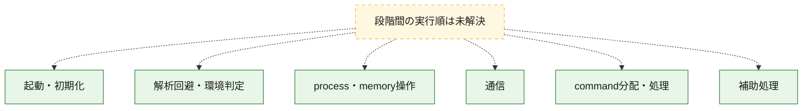
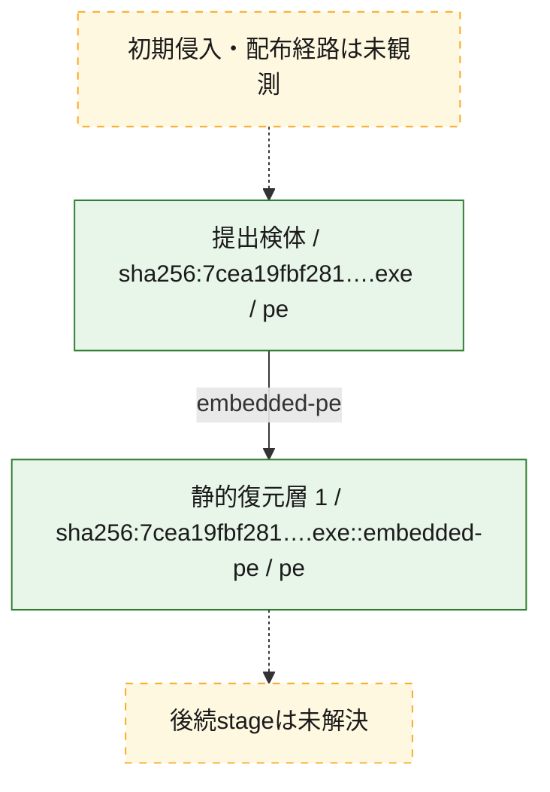
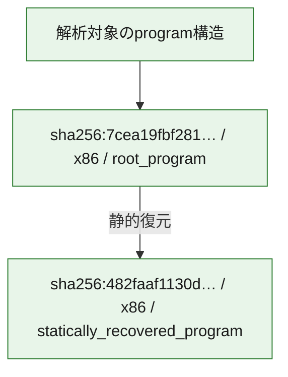

# 全体ロジック：7cea19fbf28115dc8b8cd947d92d7cedcad6b18825f3d52e2340ae558445fce6

代表関数の静的証跡から、起動・初期化、解析回避・環境判定、process・memory操作、通信、command分配・処理の処理群を確認しました。

## 読み方

- phaseの掲載順は解析上の整理順です。observed_call_edgesがない段階間の実行順を断定しません。
- 図の実線は静的に観測した関係、点線と黄色のノードは未観測・未解決の関係を示します。
- 図は静的な要約であり、動的実行を再現するものではありません。
- 詳細な関数解説とfingerprintは[STATIC-LOGIC.md](STATIC-LOGIC.md)を参照してください。

## 静的可視化

### 実行フロー

### 感染チェーン

### モジュール関係

## 処理段階

### 1. 起動・初期化

entry pointから初期化と後続処理への移行を確認します。
確度: `confirmed_static_function_evidence`

- `482faaf1130d041a77b4a4e8a3e516d9c97aa21a3ad10b6a8b88bae38b6eaae5:ghidra:14000e120` — 初期化と主要処理への分岐を行う入口関数です。 状態: `succeeded`、選定理由: `entry_point`, `meaningful_symbol_name`, `reviewed_call_centrality:21`, `role:entrypoint`
- `7cea19fbf28115dc8b8cd947d92d7cedcad6b18825f3d52e2340ae558445fce6:ghidra:2ac4f12ef` — 初期化と主要処理への分岐を行う入口関数です。 状態: `succeeded`、選定理由: `entry_point`, `meaningful_symbol_name`, `reviewed_call_centrality:2`, `role:entrypoint`

### 2. 解析回避・環境判定

debugger、sandbox、仮想環境、時間差などの判定を確認します。
確度: `confirmed_static_function_evidence`

- `7cea19fbf28115dc8b8cd947d92d7cedcad6b18825f3d52e2340ae558445fce6:ghidra:2ac4f1000` — debugger、仮想環境、sandbox、または時間差の確認に関係する関数です。 状態: `succeeded`、選定理由: `context_representative`, `reviewed_call_centrality:13`, `role:anti_analysis`

### 3. process・memory操作

process、thread、module、memory操作と実行移行を確認します。
確度: `confirmed_static_function_evidence`

- `482faaf1130d041a77b4a4e8a3e516d9c97aa21a3ad10b6a8b88bae38b6eaae5:ghidra:140001000` — process、thread、module、またはmemory操作に関係する関数です。 状態: `succeeded`、選定理由: `context_representative`, `reviewed_call_centrality:53`, `role:process_or_memory_operation`
- `482faaf1130d041a77b4a4e8a3e516d9c97aa21a3ad10b6a8b88bae38b6eaae5:ghidra:1400025e0` — process、thread、module、またはmemory操作に関係する関数です。 状態: `succeeded`、選定理由: `context_representative`, `reviewed_call_centrality:12`, `role:process_or_memory_operation`
- `482faaf1130d041a77b4a4e8a3e516d9c97aa21a3ad10b6a8b88bae38b6eaae5:ghidra:140002f90` — process、thread、module、またはmemory操作に関係する関数です。 状態: `succeeded`、選定理由: `context_representative`, `reviewed_call_centrality:10`, `role:process_or_memory_operation`
- `7cea19fbf28115dc8b8cd947d92d7cedcad6b18825f3d52e2340ae558445fce6:ghidra:2ac4f1450` — process、thread、module、またはmemory操作に関係する関数です。 状態: `succeeded`、選定理由: `context_representative`, `reviewed_call_centrality:7`, `role:process_or_memory_operation`
- `7cea19fbf28115dc8b8cd947d92d7cedcad6b18825f3d52e2340ae558445fce6:ghidra:2ac4f1540` — process、thread、module、またはmemory操作に関係する関数です。 状態: `succeeded`、選定理由: `context_representative`, `reviewed_call_centrality:11`, `role:process_or_memory_operation`
- `7cea19fbf28115dc8b8cd947d92d7cedcad6b18825f3d52e2340ae558445fce6:ghidra:2ac4f16c0` — process、thread、module、またはmemory操作に関係する関数です。 状態: `succeeded`、選定理由: `entry_point`, `meaningful_symbol_name`, `reviewed_call_centrality:11`, `role:process_or_memory_operation`

### 4. 通信

通信初期化、endpoint処理、送受信の役割を確認します。
確度: `confirmed_static_function_evidence`

- `482faaf1130d041a77b4a4e8a3e516d9c97aa21a3ad10b6a8b88bae38b6eaae5:ghidra:140003230` — 通信初期化、送受信、またはendpoint処理に関係する関数です。 状態: `succeeded`、選定理由: `context_representative`, `reviewed_call_centrality:22`, `role:network_communication`

### 5. command分配・処理

受信commandやtaskの解釈、分配、個別handlerへの移行を確認します。
確度: `confirmed_static_function_evidence`

- `482faaf1130d041a77b4a4e8a3e516d9c97aa21a3ad10b6a8b88bae38b6eaae5:ghidra:1400028a0` — commandの解釈、分配、または個別処理を担当する関数です。 状態: `succeeded`、選定理由: `context_representative`, `reviewed_call_centrality:7`, `role:command_dispatch_or_handler`
- `7cea19fbf28115dc8b8cd947d92d7cedcad6b18825f3d52e2340ae558445fce6:ghidra:2ac4f26cb` — commandの解釈、分配、または個別処理を担当する関数です。 状態: `succeeded`、選定理由: `context_representative`, `reviewed_call_centrality:1`, `role:command_dispatch_or_handler`

### 6. 補助処理

主要処理を支える一般内部関数またはlibrary処理を確認します。
確度: `confirmed_static_function_evidence_with_limits`

- `482faaf1130d041a77b4a4e8a3e516d9c97aa21a3ad10b6a8b88bae38b6eaae5:ghidra:140001040` — 検体内部の一般処理を実装する関数です。 状態: `succeeded`、選定理由: `context_representative`, `reviewed_call_centrality:12`
- `482faaf1130d041a77b4a4e8a3e516d9c97aa21a3ad10b6a8b88bae38b6eaae5:ghidra:140001200` — 検体内部の一般処理を実装する関数です。 状態: `succeeded`、選定理由: `context_representative`, `reviewed_call_centrality:15`
- `482faaf1130d041a77b4a4e8a3e516d9c97aa21a3ad10b6a8b88bae38b6eaae5:ghidra:1400014a0` — 検体内部の一般処理を実装する関数です。 状態: `succeeded`、選定理由: `context_representative`, `reviewed_call_centrality:10`
- `482faaf1130d041a77b4a4e8a3e516d9c97aa21a3ad10b6a8b88bae38b6eaae5:ghidra:140001630` — 検体内部の一般処理を実装する関数です。 状態: `succeeded`、選定理由: `context_representative`, `reviewed_call_centrality:12`
- `482faaf1130d041a77b4a4e8a3e516d9c97aa21a3ad10b6a8b88bae38b6eaae5:ghidra:140001870` — 検体内部の一般処理を実装する関数です。 状態: `succeeded`、選定理由: `context_representative`, `reviewed_call_centrality:2`
- `482faaf1130d041a77b4a4e8a3e516d9c97aa21a3ad10b6a8b88bae38b6eaae5:ghidra:1400018f0` — 検体内部の一般処理を実装する関数です。 状態: `succeeded`、選定理由: `context_representative`, `reviewed_call_centrality:8`
- `482faaf1130d041a77b4a4e8a3e516d9c97aa21a3ad10b6a8b88bae38b6eaae5:ghidra:140001940` — 検体内部の一般処理を実装する関数です。 状態: `succeeded`、選定理由: `context_representative`, `reviewed_call_centrality:14`
- `482faaf1130d041a77b4a4e8a3e516d9c97aa21a3ad10b6a8b88bae38b6eaae5:ghidra:140001c50` — 検体内部の一般処理を実装する関数です。 状態: `succeeded`、選定理由: `context_representative`, `reviewed_call_centrality:7`
- `482faaf1130d041a77b4a4e8a3e516d9c97aa21a3ad10b6a8b88bae38b6eaae5:ghidra:140001cb0` — 検体内部の一般処理を実装する関数です。 状態: `succeeded`、選定理由: `context_representative`, `reviewed_call_centrality:6`
- `482faaf1130d041a77b4a4e8a3e516d9c97aa21a3ad10b6a8b88bae38b6eaae5:ghidra:140002760` — 検体内部の一般処理を実装する関数です。 状態: `succeeded`、選定理由: `context_representative`, `reviewed_call_centrality:8`
- `482faaf1130d041a77b4a4e8a3e516d9c97aa21a3ad10b6a8b88bae38b6eaae5:ghidra:1400027a0` — 検体内部の一般処理を実装する関数です。 状態: `succeeded`、選定理由: `context_representative`, `reviewed_call_centrality:8`
- `482faaf1130d041a77b4a4e8a3e516d9c97aa21a3ad10b6a8b88bae38b6eaae5:ghidra:140002840` — 検体内部の一般処理を実装する関数です。 状態: `succeeded`、選定理由: `context_representative`, `reviewed_call_centrality:5`
- `482faaf1130d041a77b4a4e8a3e516d9c97aa21a3ad10b6a8b88bae38b6eaae5:ghidra:1400030b0` — 検体内部の一般処理を実装する関数です。 状態: `succeeded`、選定理由: `context_representative`, `reviewed_call_centrality:8`
- `482faaf1130d041a77b4a4e8a3e516d9c97aa21a3ad10b6a8b88bae38b6eaae5:ghidra:140003100` — 検体内部の一般処理を実装する関数です。 状態: `succeeded`、選定理由: `context_representative`, `reviewed_call_centrality:13`
- `482faaf1130d041a77b4a4e8a3e516d9c97aa21a3ad10b6a8b88bae38b6eaae5:ghidra:140003600` — 検体内部の一般処理を実装する関数です。 状態: `succeeded`、選定理由: `context_representative`, `reviewed_call_centrality:10`
- `482faaf1130d041a77b4a4e8a3e516d9c97aa21a3ad10b6a8b88bae38b6eaae5:ghidra:1400036c0` — 検体内部の一般処理を実装する関数です。 状態: `succeeded`、選定理由: `context_representative`, `reviewed_call_centrality:13`
- `482faaf1130d041a77b4a4e8a3e516d9c97aa21a3ad10b6a8b88bae38b6eaae5:ghidra:1400038d0` — 検体内部の一般処理を実装する関数です。 状態: `succeeded`、選定理由: `context_representative`, `reviewed_call_centrality:15`
- `482faaf1130d041a77b4a4e8a3e516d9c97aa21a3ad10b6a8b88bae38b6eaae5:ghidra:140003a40` — 検体内部の一般処理を実装する関数です。 状態: `succeeded`、選定理由: `context_representative`, `reviewed_call_centrality:3`
- `482faaf1130d041a77b4a4e8a3e516d9c97aa21a3ad10b6a8b88bae38b6eaae5:ghidra:140003ae0` — 検体内部の一般処理を実装する関数です。 状態: `succeeded`、選定理由: `context_representative`, `reviewed_call_centrality:10`
- `482faaf1130d041a77b4a4e8a3e516d9c97aa21a3ad10b6a8b88bae38b6eaae5:ghidra:140003b70` — 検体内部の一般処理を実装する関数です。 状態: `succeeded`、選定理由: `context_representative`, `reviewed_call_centrality:4`
- `482faaf1130d041a77b4a4e8a3e516d9c97aa21a3ad10b6a8b88bae38b6eaae5:ghidra:140003bd0` — 検体内部の一般処理を実装する関数です。 状態: `succeeded`、選定理由: `context_representative`, `reviewed_call_centrality:13`
- `482faaf1130d041a77b4a4e8a3e516d9c97aa21a3ad10b6a8b88bae38b6eaae5:ghidra:140003cd0` — 検体内部の一般処理を実装する関数です。 状態: `succeeded`、選定理由: `context_representative`, `reviewed_call_centrality:10`
- `482faaf1130d041a77b4a4e8a3e516d9c97aa21a3ad10b6a8b88bae38b6eaae5:ghidra:140003dd0` — 検体内部の一般処理を実装する関数です。 状態: `succeeded`、選定理由: `context_representative`, `reviewed_call_centrality:15`
- `482faaf1130d041a77b4a4e8a3e516d9c97aa21a3ad10b6a8b88bae38b6eaae5:ghidra:140003f10` — 検体内部の一般処理を実装する関数です。 状態: `succeeded`、選定理由: `context_representative`, `reviewed_call_centrality:8`
- `482faaf1130d041a77b4a4e8a3e516d9c97aa21a3ad10b6a8b88bae38b6eaae5:ghidra:140004010` — 検体内部の一般処理を実装する関数です。 状態: `succeeded`、選定理由: `context_representative`, `reviewed_call_centrality:8`
- `482faaf1130d041a77b4a4e8a3e516d9c97aa21a3ad10b6a8b88bae38b6eaae5:ghidra:140004b50` — 検体内部の一般処理を実装する関数です。 状態: `succeeded`、選定理由: `meaningful_symbol_name`, `reviewed_call_centrality:1`
- `7cea19fbf28115dc8b8cd947d92d7cedcad6b18825f3d52e2340ae558445fce6:ghidra:2ac4f1405` — 検体内部の一般処理を実装する関数です。 状態: `succeeded`、選定理由: `context_representative`, `reviewed_call_centrality:2`
- `7cea19fbf28115dc8b8cd947d92d7cedcad6b18825f3d52e2340ae558445fce6:ghidra:2ac4f1430` — 検体内部の一般処理を実装する関数です。 状態: `succeeded`、選定理由: `context_representative`
- `7cea19fbf28115dc8b8cd947d92d7cedcad6b18825f3d52e2340ae558445fce6:ghidra:2ac4f1440` — 検体内部の一般処理を実装する関数です。 状態: `succeeded`、選定理由: `context_representative`
- `7cea19fbf28115dc8b8cd947d92d7cedcad6b18825f3d52e2340ae558445fce6:ghidra:2ac4f1500` — 検体内部の一般処理を実装する関数です。 状態: `limited_bad_instruction_or_flow`、選定理由: `context_representative`, `reviewed_call_centrality:2`
- `7cea19fbf28115dc8b8cd947d92d7cedcad6b18825f3d52e2340ae558445fce6:ghidra:2ac4f16d0` — 検体内部の一般処理を実装する関数です。 状態: `succeeded`、選定理由: `context_representative`
- `7cea19fbf28115dc8b8cd947d92d7cedcad6b18825f3d52e2340ae558445fce6:ghidra:2ac4f170f` — 検体内部の一般処理を実装する関数です。 状態: `succeeded`、選定理由: `context_representative`, `reviewed_call_centrality:2`
- `7cea19fbf28115dc8b8cd947d92d7cedcad6b18825f3d52e2340ae558445fce6:ghidra:2ac4f1787` — 検体内部の一般処理を実装する関数です。 状態: `succeeded`、選定理由: `context_representative`, `reviewed_call_centrality:2`
- `7cea19fbf28115dc8b8cd947d92d7cedcad6b18825f3d52e2340ae558445fce6:ghidra:2ac4f17b0` — compiler生成処理または汎用library処理とみられる関数です。 状態: `succeeded`、選定理由: `entry_point`, `meaningful_symbol_name`, `reviewed_call_centrality:2`
- `7cea19fbf28115dc8b8cd947d92d7cedcad6b18825f3d52e2340ae558445fce6:ghidra:2ac4f184c` — 検体内部の一般処理を実装する関数です。 状態: `succeeded`、選定理由: `context_representative`
- `7cea19fbf28115dc8b8cd947d92d7cedcad6b18825f3d52e2340ae558445fce6:ghidra:2ac4f1869` — compiler生成処理または汎用library処理とみられる関数です。 状態: `succeeded`、選定理由: `entry_point`, `meaningful_symbol_name`, `reviewed_call_centrality:1`
- `7cea19fbf28115dc8b8cd947d92d7cedcad6b18825f3d52e2340ae558445fce6:ghidra:2ac4f18b0` — 検体内部の一般処理を実装する関数です。 状態: `succeeded`、選定理由: `context_representative`, `reviewed_call_centrality:14`
- `7cea19fbf28115dc8b8cd947d92d7cedcad6b18825f3d52e2340ae558445fce6:ghidra:2ac4f1915` — 検体内部の一般処理を実装する関数です。 状態: `succeeded`、選定理由: `context_representative`, `reviewed_call_centrality:10`
- `7cea19fbf28115dc8b8cd947d92d7cedcad6b18825f3d52e2340ae558445fce6:ghidra:2ac4f1bf3` — 検体内部の一般処理を実装する関数です。 状態: `succeeded`、選定理由: `context_representative`, `reviewed_call_centrality:3`
- `7cea19fbf28115dc8b8cd947d92d7cedcad6b18825f3d52e2340ae558445fce6:ghidra:2ac4f1ccb` — 検体内部の一般処理を実装する関数です。 状態: `succeeded`、選定理由: `context_representative`, `reviewed_call_centrality:3`
- `7cea19fbf28115dc8b8cd947d92d7cedcad6b18825f3d52e2340ae558445fce6:ghidra:2ac4f1d12` — 検体内部の一般処理を実装する関数です。 状態: `succeeded`、選定理由: `context_representative`, `reviewed_call_centrality:3`
- `7cea19fbf28115dc8b8cd947d92d7cedcad6b18825f3d52e2340ae558445fce6:ghidra:2ac4f2090` — 検体内部の一般処理を実装する関数です。 状態: `succeeded`、選定理由: `context_representative`, `reviewed_call_centrality:5`
- `7cea19fbf28115dc8b8cd947d92d7cedcad6b18825f3d52e2340ae558445fce6:ghidra:2ac4f2140` — 検体内部の一般処理を実装する関数です。 状態: `succeeded`、選定理由: `context_representative`, `reviewed_call_centrality:5`
- `7cea19fbf28115dc8b8cd947d92d7cedcad6b18825f3d52e2340ae558445fce6:ghidra:2ac4f21e1` — 検体内部の一般処理を実装する関数です。 状態: `succeeded`、選定理由: `context_representative`, `reviewed_call_centrality:5`
- `7cea19fbf28115dc8b8cd947d92d7cedcad6b18825f3d52e2340ae558445fce6:ghidra:2ac4f22a2` — 検体内部の一般処理を実装する関数です。 状態: `succeeded`、選定理由: `context_representative`, `reviewed_call_centrality:9`
- `7cea19fbf28115dc8b8cd947d92d7cedcad6b18825f3d52e2340ae558445fce6:ghidra:2ac4f2341` — 検体内部の一般処理を実装する関数です。 状態: `succeeded`、選定理由: `context_representative`, `reviewed_call_centrality:9`
- `7cea19fbf28115dc8b8cd947d92d7cedcad6b18825f3d52e2340ae558445fce6:ghidra:2ac4f2440` — 検体内部の一般処理を実装する関数です。 状態: `succeeded`、選定理由: `context_representative`, `reviewed_call_centrality:1`
- `7cea19fbf28115dc8b8cd947d92d7cedcad6b18825f3d52e2340ae558445fce6:ghidra:2ac4f2450` — 検体内部の一般処理を実装する関数です。 状態: `succeeded`、選定理由: `context_representative`, `reviewed_call_centrality:4`
- `7cea19fbf28115dc8b8cd947d92d7cedcad6b18825f3d52e2340ae558445fce6:ghidra:2ac4f24cc` — 検体内部の一般処理を実装する関数です。 状態: `succeeded`、選定理由: `context_representative`, `reviewed_call_centrality:1`
- `7cea19fbf28115dc8b8cd947d92d7cedcad6b18825f3d52e2340ae558445fce6:ghidra:2ac4f2565` — 検体内部の一般処理を実装する関数です。 状態: `succeeded`、選定理由: `context_representative`, `reviewed_call_centrality:3`
- `7cea19fbf28115dc8b8cd947d92d7cedcad6b18825f3d52e2340ae558445fce6:ghidra:2ac4f262b` — 検体内部の一般処理を実装する関数です。 状態: `succeeded`、選定理由: `context_representative`, `reviewed_call_centrality:4`
- `7cea19fbf28115dc8b8cd947d92d7cedcad6b18825f3d52e2340ae558445fce6:ghidra:2ac4f267b` — 検体内部の一般処理を実装する関数です。 状態: `succeeded`、選定理由: `context_representative`, `reviewed_call_centrality:2`

## 観測したcall関係

- 代表関数間で直接解決できた呼出関係はありません。

## 解析範囲と制約

- 選定外関数は全体inventoryへ残しますが、関数本体の個別解説対象にはしていません。
- indirect call、難読化、packer、VM、壊れたcontrol flowによりcall関係が欠落する場合があります。
- 文書は静的解析に基づき、検体実行や外部通信による動的確認は行っていません。
