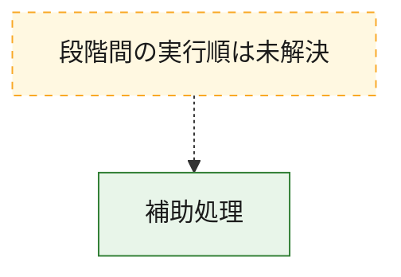
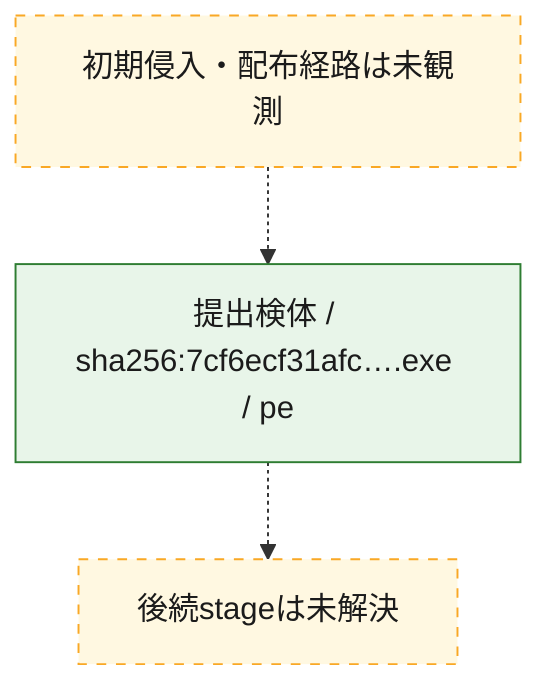
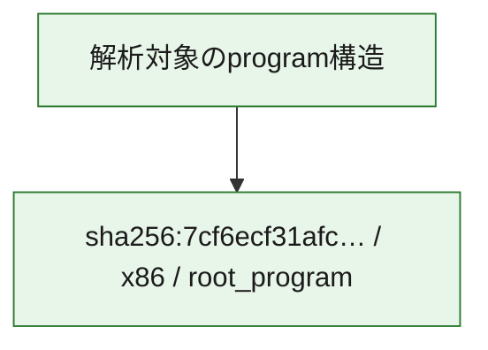

# 全体ロジック：7cf6ecf31afc12585c87147c412fb01611462ee47cf56c0ec8566619dcaddc74

代表関数から主要なmalware処理段階を自動分類できませんでした。

## 読み方

- phaseの掲載順は解析上の整理順です。observed_call_edgesがない段階間の実行順を断定しません。
- 図の実線は静的に観測した関係、点線と黄色のノードは未観測・未解決の関係を示します。
- 図は静的な要約であり、動的実行を再現するものではありません。
- 詳細な関数解説とfingerprintは[STATIC-LOGIC.md](STATIC-LOGIC.md)を参照してください。

## 静的可視化

### 実行フロー

### 感染チェーン

### モジュール関係

## 処理段階

### 1. 補助処理

主要処理を支える一般内部関数またはlibrary処理を確認します。
確度: `confirmed_static_function_evidence_with_limits`

- `7cf6ecf31afc12585c87147c412fb01611462ee47cf56c0ec8566619dcaddc74:ghidra:0041d830` — 検体内部の一般処理を実装する関数です。 状態: `succeeded`、選定理由: `call_graph_centrality:in=1,out=44`, `large_function:instructions=1013`, `reviewed_call_centrality:45`, `reviewed_call_centrality:51`
- `7cf6ecf31afc12585c87147c412fb01611462ee47cf56c0ec8566619dcaddc74:ghidra:00446220` — 検体内部の一般処理を実装する関数です。 状態: `succeeded`、選定理由: `call_graph_centrality:in=1,out=45`, `large_function:instructions=1094`, `reviewed_call_centrality:46`, `reviewed_call_centrality:51`
- `7cf6ecf31afc12585c87147c412fb01611462ee47cf56c0ec8566619dcaddc74:ghidra:00451e20` — 検体内部の一般処理を実装する関数です。 状態: `succeeded`、選定理由: `call_graph_centrality:in=21,out=30`, `large_function:instructions=1250`, `reviewed_call_centrality:51`, `reviewed_call_centrality:52`
- `7cf6ecf31afc12585c87147c412fb01611462ee47cf56c0ec8566619dcaddc74:ghidra:00474470` — 検体内部の一般処理を実装する関数です。 状態: `succeeded`、選定理由: `call_graph_centrality:in=357,out=8`, `large_function:instructions=434`, `reviewed_call_centrality:365`, `reviewed_call_centrality:366`
- `7cf6ecf31afc12585c87147c412fb01611462ee47cf56c0ec8566619dcaddc74:ghidra:004d2680` — 検体内部の一般処理を実装する関数です。 状態: `succeeded`、選定理由: `call_graph_centrality:in=1,out=29`, `large_function:instructions=2483`, `reviewed_call_centrality:30`
- `7cf6ecf31afc12585c87147c412fb01611462ee47cf56c0ec8566619dcaddc74:ghidra:00506d40` — 検体内部の一般処理を実装する関数です。 状態: `succeeded`、選定理由: `call_graph_centrality:in=4,out=34`, `large_function:instructions=1962`, `reviewed_call_centrality:38`, `reviewed_call_centrality:41`
- `7cf6ecf31afc12585c87147c412fb01611462ee47cf56c0ec8566619dcaddc74:ghidra:0050dfd0` — 検体内部の一般処理を実装する関数です。 状態: `succeeded`、選定理由: `call_graph_centrality:in=1,out=36`, `large_function:instructions=1065`, `reviewed_call_centrality:37`, `reviewed_call_centrality:38`
- `7cf6ecf31afc12585c87147c412fb01611462ee47cf56c0ec8566619dcaddc74:ghidra:005c07c0` — 検体内部の一般処理を実装する関数です。 状態: `succeeded`、選定理由: `call_graph_centrality:in=3,out=57`, `large_function:instructions=2399`, `reviewed_call_centrality:60`
- `7cf6ecf31afc12585c87147c412fb01611462ee47cf56c0ec8566619dcaddc74:ghidra:005fec30` — 検体内部の一般処理を実装する関数です。 状態: `succeeded`、選定理由: `call_graph_centrality:in=1,out=33`, `large_function:instructions=1106`, `reviewed_call_centrality:34`, `reviewed_call_centrality:37`
- `7cf6ecf31afc12585c87147c412fb01611462ee47cf56c0ec8566619dcaddc74:ghidra:0062ea60` — 検体内部の一般処理を実装する関数です。 状態: `succeeded`、選定理由: `call_graph_centrality:in=1,out=25`, `large_function:instructions=1405`, `reviewed_call_centrality:26`, `reviewed_call_centrality:27`
- `7cf6ecf31afc12585c87147c412fb01611462ee47cf56c0ec8566619dcaddc74:ghidra:00630b40` — 検体内部の一般処理を実装する関数です。 状態: `succeeded`、選定理由: `call_graph_centrality:in=1,out=40`, `large_function:instructions=1123`, `reviewed_call_centrality:41`, `reviewed_call_centrality:42`
- `7cf6ecf31afc12585c87147c412fb01611462ee47cf56c0ec8566619dcaddc74:ghidra:00639ab0` — 検体内部の一般処理を実装する関数です。 状態: `succeeded`、選定理由: `call_graph_centrality:in=1,out=32`, `large_function:instructions=2084`, `reviewed_call_centrality:33`
- `7cf6ecf31afc12585c87147c412fb01611462ee47cf56c0ec8566619dcaddc74:ghidra:00650320` — 検体内部の一般処理を実装する関数です。 状態: `succeeded`、選定理由: `call_graph_centrality:in=3,out=24`, `large_function:instructions=2286`, `reviewed_call_centrality:27`, `reviewed_call_centrality:30`
- `7cf6ecf31afc12585c87147c412fb01611462ee47cf56c0ec8566619dcaddc74:ghidra:00659800` — 検体内部の一般処理を実装する関数です。 状態: `succeeded`、選定理由: `call_graph_centrality:in=1,out=27`, `large_function:instructions=1592`, `reviewed_call_centrality:28`, `reviewed_call_centrality:32`
- `7cf6ecf31afc12585c87147c412fb01611462ee47cf56c0ec8566619dcaddc74:ghidra:00688d20` — 検体内部の一般処理を実装する関数です。 状態: `succeeded`、選定理由: `call_graph_centrality:in=1,out=51`, `large_function:instructions=1653`, `reviewed_call_centrality:52`
- `7cf6ecf31afc12585c87147c412fb01611462ee47cf56c0ec8566619dcaddc74:ghidra:0068ac40` — 検体内部の一般処理を実装する関数です。 状態: `succeeded`、選定理由: `call_graph_centrality:in=2,out=35`, `large_function:instructions=2272`, `reviewed_call_centrality:37`, `reviewed_call_centrality:40`
- `7cf6ecf31afc12585c87147c412fb01611462ee47cf56c0ec8566619dcaddc74:ghidra:00698760` — 検体内部の一般処理を実装する関数です。 状態: `succeeded`、選定理由: `call_graph_centrality:in=1,out=38`, `large_function:instructions=1280`, `reviewed_call_centrality:39`, `reviewed_call_centrality:41`
- `7cf6ecf31afc12585c87147c412fb01611462ee47cf56c0ec8566619dcaddc74:ghidra:006cb140` — 検体内部の一般処理を実装する関数です。 状態: `succeeded`、選定理由: `call_graph_centrality:in=12,out=31`, `large_function:instructions=1024`, `reviewed_call_centrality:43`, `reviewed_call_centrality:44`
- `7cf6ecf31afc12585c87147c412fb01611462ee47cf56c0ec8566619dcaddc74:ghidra:0073bb30` — 検体内部の一般処理を実装する関数です。 状態: `succeeded`、選定理由: `call_graph_centrality:in=1,out=50`, `large_function:instructions=1792`, `reviewed_call_centrality:51`, `reviewed_call_centrality:52`
- `7cf6ecf31afc12585c87147c412fb01611462ee47cf56c0ec8566619dcaddc74:ghidra:0074b990` — 検体内部の一般処理を実装する関数です。 状態: `succeeded`、選定理由: `call_graph_centrality:in=1,out=23`, `large_function:instructions=2847`, `reviewed_call_centrality:24`
- `7cf6ecf31afc12585c87147c412fb01611462ee47cf56c0ec8566619dcaddc74:ghidra:007cda30` — 検体内部の一般処理を実装する関数です。 状態: `succeeded`、選定理由: `call_graph_centrality:in=1,out=41`, `large_function:instructions=1790`, `reviewed_call_centrality:42`, `reviewed_call_centrality:48`
- `7cf6ecf31afc12585c87147c412fb01611462ee47cf56c0ec8566619dcaddc74:ghidra:007d2800` — 検体内部の一般処理を実装する関数です。 状態: `succeeded`、選定理由: `call_graph_centrality:in=1,out=41`, `large_function:instructions=1794`, `reviewed_call_centrality:42`, `reviewed_call_centrality:48`
- `7cf6ecf31afc12585c87147c412fb01611462ee47cf56c0ec8566619dcaddc74:ghidra:007dc0d0` — 検体内部の一般処理を実装する関数です。 状態: `succeeded`、選定理由: `call_graph_centrality:in=1,out=30`, `large_function:instructions=1737`, `reviewed_call_centrality:31`, `reviewed_call_centrality:32`
- `7cf6ecf31afc12585c87147c412fb01611462ee47cf56c0ec8566619dcaddc74:ghidra:007f9e30` — 検体内部の一般処理を実装する関数です。 状態: `succeeded`、選定理由: `call_graph_centrality:in=2,out=49`, `large_function:instructions=2231`, `reviewed_call_centrality:51`
- `7cf6ecf31afc12585c87147c412fb01611462ee47cf56c0ec8566619dcaddc74:ghidra:008b9450` — 検体内部の一般処理を実装する関数です。 状態: `failed`、選定理由: `call_graph_centrality:in=0,out=96`, `large_function:instructions=9150`, `reviewed_call_centrality:96`
- `7cf6ecf31afc12585c87147c412fb01611462ee47cf56c0ec8566619dcaddc74:ghidra:008d5310` — 検体内部の一般処理を実装する関数です。 状態: `succeeded`、選定理由: `call_graph_centrality:in=0,out=86`, `large_function:instructions=3656`, `reviewed_call_centrality:86`, `reviewed_call_centrality:90`
- `7cf6ecf31afc12585c87147c412fb01611462ee47cf56c0ec8566619dcaddc74:ghidra:008de1a0` — 検体内部の一般処理を実装する関数です。 状態: `succeeded`、選定理由: `call_graph_centrality:in=1,out=37`, `large_function:instructions=1202`, `reviewed_call_centrality:38`, `reviewed_call_centrality:39`
- `7cf6ecf31afc12585c87147c412fb01611462ee47cf56c0ec8566619dcaddc74:ghidra:008dfe00` — 検体内部の一般処理を実装する関数です。 状態: `succeeded`、選定理由: `call_graph_centrality:in=1,out=52`, `large_function:instructions=1683`, `reviewed_call_centrality:53`, `reviewed_call_centrality:54`
- `7cf6ecf31afc12585c87147c412fb01611462ee47cf56c0ec8566619dcaddc74:ghidra:008e27b0` — 検体内部の一般処理を実装する関数です。 状態: `succeeded`、選定理由: `call_graph_centrality:in=1,out=30`, `large_function:instructions=2047`, `reviewed_call_centrality:31`, `reviewed_call_centrality:34`
- `7cf6ecf31afc12585c87147c412fb01611462ee47cf56c0ec8566619dcaddc74:ghidra:008e5a50` — 検体内部の一般処理を実装する関数です。 状態: `succeeded`、選定理由: `call_graph_centrality:in=0,out=74`, `large_function:instructions=3841`, `reviewed_call_centrality:74`, `reviewed_call_centrality:75`
- `7cf6ecf31afc12585c87147c412fb01611462ee47cf56c0ec8566619dcaddc74:ghidra:008ef0d0` — 検体内部の一般処理を実装する関数です。 状態: `succeeded`、選定理由: `call_graph_centrality:in=1,out=33`, `large_function:instructions=1270`, `reviewed_call_centrality:34`, `reviewed_call_centrality:35`
- `7cf6ecf31afc12585c87147c412fb01611462ee47cf56c0ec8566619dcaddc74:ghidra:008f3470` — 検体内部の一般処理を実装する関数です。 状態: `succeeded`、選定理由: `call_graph_centrality:in=2,out=34`, `large_function:instructions=1125`, `reviewed_call_centrality:36`

## 観測したcall関係

- `7cf6ecf31afc12585c87147c412fb01611462ee47cf56c0ec8566619dcaddc74:ghidra:00506d40` → `7cf6ecf31afc12585c87147c412fb01611462ee47cf56c0ec8566619dcaddc74:ghidra:00474470` （`support` → `support`）
- `7cf6ecf31afc12585c87147c412fb01611462ee47cf56c0ec8566619dcaddc74:ghidra:005fec30` → `7cf6ecf31afc12585c87147c412fb01611462ee47cf56c0ec8566619dcaddc74:ghidra:00474470` （`support` → `support`）
- `7cf6ecf31afc12585c87147c412fb01611462ee47cf56c0ec8566619dcaddc74:ghidra:0062ea60` → `7cf6ecf31afc12585c87147c412fb01611462ee47cf56c0ec8566619dcaddc74:ghidra:00474470` （`support` → `support`）
- `7cf6ecf31afc12585c87147c412fb01611462ee47cf56c0ec8566619dcaddc74:ghidra:00630b40` → `7cf6ecf31afc12585c87147c412fb01611462ee47cf56c0ec8566619dcaddc74:ghidra:00474470` （`support` → `support`）
- `7cf6ecf31afc12585c87147c412fb01611462ee47cf56c0ec8566619dcaddc74:ghidra:00630b40` → `7cf6ecf31afc12585c87147c412fb01611462ee47cf56c0ec8566619dcaddc74:ghidra:0062ea60` （`support` → `support`）
- `7cf6ecf31afc12585c87147c412fb01611462ee47cf56c0ec8566619dcaddc74:ghidra:00639ab0` → `7cf6ecf31afc12585c87147c412fb01611462ee47cf56c0ec8566619dcaddc74:ghidra:00474470` （`support` → `support`）
- `7cf6ecf31afc12585c87147c412fb01611462ee47cf56c0ec8566619dcaddc74:ghidra:00659800` → `7cf6ecf31afc12585c87147c412fb01611462ee47cf56c0ec8566619dcaddc74:ghidra:00474470` （`support` → `support`）
- `7cf6ecf31afc12585c87147c412fb01611462ee47cf56c0ec8566619dcaddc74:ghidra:00688d20` → `7cf6ecf31afc12585c87147c412fb01611462ee47cf56c0ec8566619dcaddc74:ghidra:00474470` （`support` → `support`）
- `7cf6ecf31afc12585c87147c412fb01611462ee47cf56c0ec8566619dcaddc74:ghidra:00688d20` → `7cf6ecf31afc12585c87147c412fb01611462ee47cf56c0ec8566619dcaddc74:ghidra:0068ac40` （`support` → `support`）
- `7cf6ecf31afc12585c87147c412fb01611462ee47cf56c0ec8566619dcaddc74:ghidra:00698760` → `7cf6ecf31afc12585c87147c412fb01611462ee47cf56c0ec8566619dcaddc74:ghidra:00474470` （`support` → `support`）
- `7cf6ecf31afc12585c87147c412fb01611462ee47cf56c0ec8566619dcaddc74:ghidra:006cb140` → `7cf6ecf31afc12585c87147c412fb01611462ee47cf56c0ec8566619dcaddc74:ghidra:00474470` （`support` → `support`）
- `7cf6ecf31afc12585c87147c412fb01611462ee47cf56c0ec8566619dcaddc74:ghidra:007f9e30` → `7cf6ecf31afc12585c87147c412fb01611462ee47cf56c0ec8566619dcaddc74:ghidra:00474470` （`support` → `support`）
- `7cf6ecf31afc12585c87147c412fb01611462ee47cf56c0ec8566619dcaddc74:ghidra:008b9450` → `7cf6ecf31afc12585c87147c412fb01611462ee47cf56c0ec8566619dcaddc74:ghidra:00474470` （`support` → `support`）
- `7cf6ecf31afc12585c87147c412fb01611462ee47cf56c0ec8566619dcaddc74:ghidra:008d5310` → `7cf6ecf31afc12585c87147c412fb01611462ee47cf56c0ec8566619dcaddc74:ghidra:00451e20` （`support` → `support`）
- `7cf6ecf31afc12585c87147c412fb01611462ee47cf56c0ec8566619dcaddc74:ghidra:008d5310` → `7cf6ecf31afc12585c87147c412fb01611462ee47cf56c0ec8566619dcaddc74:ghidra:00474470` （`support` → `support`）
- `7cf6ecf31afc12585c87147c412fb01611462ee47cf56c0ec8566619dcaddc74:ghidra:008de1a0` → `7cf6ecf31afc12585c87147c412fb01611462ee47cf56c0ec8566619dcaddc74:ghidra:00474470` （`support` → `support`）
- `7cf6ecf31afc12585c87147c412fb01611462ee47cf56c0ec8566619dcaddc74:ghidra:008de1a0` → `7cf6ecf31afc12585c87147c412fb01611462ee47cf56c0ec8566619dcaddc74:ghidra:006cb140` （`support` → `support`）
- `7cf6ecf31afc12585c87147c412fb01611462ee47cf56c0ec8566619dcaddc74:ghidra:008dfe00` → `7cf6ecf31afc12585c87147c412fb01611462ee47cf56c0ec8566619dcaddc74:ghidra:00474470` （`support` → `support`）
- `7cf6ecf31afc12585c87147c412fb01611462ee47cf56c0ec8566619dcaddc74:ghidra:008dfe00` → `7cf6ecf31afc12585c87147c412fb01611462ee47cf56c0ec8566619dcaddc74:ghidra:006cb140` （`support` → `support`）
- `7cf6ecf31afc12585c87147c412fb01611462ee47cf56c0ec8566619dcaddc74:ghidra:008e5a50` → `7cf6ecf31afc12585c87147c412fb01611462ee47cf56c0ec8566619dcaddc74:ghidra:00474470` （`support` → `support`）
- `7cf6ecf31afc12585c87147c412fb01611462ee47cf56c0ec8566619dcaddc74:ghidra:008e5a50` → `7cf6ecf31afc12585c87147c412fb01611462ee47cf56c0ec8566619dcaddc74:ghidra:008ef0d0` （`support` → `support`）
- `7cf6ecf31afc12585c87147c412fb01611462ee47cf56c0ec8566619dcaddc74:ghidra:008ef0d0` → `7cf6ecf31afc12585c87147c412fb01611462ee47cf56c0ec8566619dcaddc74:ghidra:00474470` （`support` → `support`）
- `7cf6ecf31afc12585c87147c412fb01611462ee47cf56c0ec8566619dcaddc74:ghidra:008f3470` → `7cf6ecf31afc12585c87147c412fb01611462ee47cf56c0ec8566619dcaddc74:ghidra:00474470` （`support` → `support`）
- `ghidra-function:0002694c10684244b38b92be` → `ghidra-function:0bc35e1648d94a84bfc76208` （`unclassified` → `unclassified`）
- `ghidra-function:0002694c10684244b38b92be` → `ghidra-function:1b06690f9665493ee7db9f12` （`unclassified` → `unclassified`）
- `ghidra-function:0002694c10684244b38b92be` → `ghidra-function:49224289d974b44807a144f7` （`unclassified` → `unclassified`）
- `ghidra-function:0002694c10684244b38b92be` → `ghidra-function:611f753790ce4a01610a2231` （`unclassified` → `unclassified`）
- `ghidra-function:0002694c10684244b38b92be` → `ghidra-function:a03b51dedfcdb8ac8dbe3096` （`unclassified` → `unclassified`）
- `ghidra-function:0002694c10684244b38b92be` → `ghidra-function:a4fe51850fd594e63cd7e469` （`unclassified` → `unclassified`）
- `ghidra-function:0002694c10684244b38b92be` → `ghidra-function:b7f4b853d0a9939f920e6da0` （`unclassified` → `unclassified`）
- `ghidra-function:0002694c10684244b38b92be` → `ghidra-function:ccebfe817bc8fbee6064a761` （`unclassified` → `unclassified`）
- `ghidra-function:0033a1e5906cdc2f1397d8f0` → `ghidra-function:0bc35e1648d94a84bfc76208` （`unclassified` → `unclassified`）
- `ghidra-function:0033a1e5906cdc2f1397d8f0` → `ghidra-function:24d0ca0f54cc03412deb8a5e` （`unclassified` → `unclassified`）
- `ghidra-function:0033a1e5906cdc2f1397d8f0` → `ghidra-function:4ee074b8eb8bfd45488cae3c` （`unclassified` → `unclassified`）
- `ghidra-function:0033a1e5906cdc2f1397d8f0` → `ghidra-function:b7f4b853d0a9939f920e6da0` （`unclassified` → `unclassified`）
- `ghidra-function:0033a1e5906cdc2f1397d8f0` → `ghidra-function:cd2b6887051823af5cc41e86` （`unclassified` → `unclassified`）
- `ghidra-function:003a574d3094716773b2dc6d` → `ghidra-function:74e21b13a407c45d700b3cdb` （`unclassified` → `unclassified`）
- `ghidra-function:003a574d3094716773b2dc6d` → `ghidra-function:a4fe51850fd594e63cd7e469` （`unclassified` → `unclassified`）
- `ghidra-function:003a574d3094716773b2dc6d` → `ghidra-function:b7f4b853d0a9939f920e6da0` （`unclassified` → `unclassified`）
- `ghidra-function:003a574d3094716773b2dc6d` → `ghidra-function:c948510107d52411395c5d48` （`unclassified` → `unclassified`）
- `ghidra-function:003a574d3094716773b2dc6d` → `ghidra-function:ccebfe817bc8fbee6064a761` （`unclassified` → `unclassified`）
- `ghidra-function:003a574d3094716773b2dc6d` → `ghidra-function:d6b91b3b81a1a53979629f86` （`unclassified` → `unclassified`）
- `ghidra-function:0042b4346918bd532854f1d3` → `ghidra-function:b7f4b853d0a9939f920e6da0` （`unclassified` → `unclassified`）
- `ghidra-function:0042b4346918bd532854f1d3` → `ghidra-function:d6b91b3b81a1a53979629f86` （`unclassified` → `unclassified`）
- `ghidra-function:004b1ad8597dc3bd6655c8ab` → `ghidra-function:0abf94836b077da2c6ce628d` （`unclassified` → `unclassified`）
- `ghidra-function:004b1ad8597dc3bd6655c8ab` → `ghidra-function:2299dcfba8ea88f90601bd7f` （`unclassified` → `unclassified`）
- `ghidra-function:004b1ad8597dc3bd6655c8ab` → `ghidra-function:292292fdd532b60c0c89e00c` （`unclassified` → `unclassified`）
- `ghidra-function:004b1ad8597dc3bd6655c8ab` → `ghidra-function:579fb477fcdfc323e6a68085` （`unclassified` → `unclassified`）
- `ghidra-function:004b1ad8597dc3bd6655c8ab` → `ghidra-function:6dca4c1ebad784704c4acd08` （`unclassified` → `unclassified`）
- `ghidra-function:004b1ad8597dc3bd6655c8ab` → `ghidra-function:b7f4b853d0a9939f920e6da0` （`unclassified` → `unclassified`）
- `ghidra-function:004fd5caf3fb75821cab325e` → `ghidra-function:35185aba27bb4e4d8d93a6df` （`unclassified` → `unclassified`）
- `ghidra-function:004fd5caf3fb75821cab325e` → `ghidra-function:378bcbf9691df717af79bd70` （`unclassified` → `unclassified`）
- `ghidra-function:004fd5caf3fb75821cab325e` → `ghidra-function:b7f4b853d0a9939f920e6da0` （`unclassified` → `unclassified`）
- `ghidra-function:00503e060fbf398774da3710` → `ghidra-function:96152f86ed7dea879db95dee` （`unclassified` → `unclassified`）
- `ghidra-function:008c9367f367e447e416ee96` → `ghidra-function:06944ee51b51f33b07aa563f` （`unclassified` → `unclassified`）
- `ghidra-function:008c9367f367e447e416ee96` → `ghidra-function:67479f5bf9b12c983b856b12` （`unclassified` → `unclassified`）
- `ghidra-function:008c9367f367e447e416ee96` → `ghidra-function:767ea8748440f6c231da1a41` （`unclassified` → `unclassified`）
- `ghidra-function:008c9367f367e447e416ee96` → `ghidra-function:b7f4b853d0a9939f920e6da0` （`unclassified` → `unclassified`）
- `ghidra-function:00a25fa75eac123929466160` → `ghidra-function:419d99ba61fa88a316776818` （`unclassified` → `unclassified`）
- `ghidra-function:00a25fa75eac123929466160` → `ghidra-function:a1605598cfae59fd683e20b8` （`unclassified` → `unclassified`）
- `ghidra-function:00a25fa75eac123929466160` → `ghidra-function:b7f4b853d0a9939f920e6da0` （`unclassified` → `unclassified`）
- `ghidra-function:00a25fa75eac123929466160` → `ghidra-function:ccebfe817bc8fbee6064a761` （`unclassified` → `unclassified`）
- `ghidra-function:00a25fa75eac123929466160` → `ghidra-function:d6b91b3b81a1a53979629f86` （`unclassified` → `unclassified`）
- `ghidra-function:00cc73107b0988bcef2aebe4` → `ghidra-function:b7f4b853d0a9939f920e6da0` （`unclassified` → `unclassified`）
- `ghidra-function:00e187541780f7e52050f765` → `ghidra-function:02e315fbb2993a1b10fbb0ea` （`unclassified` → `unclassified`）
- `ghidra-function:00e187541780f7e52050f765` → `ghidra-function:0623e461172799f7b56eabcc` （`unclassified` → `unclassified`）
- `ghidra-function:00e187541780f7e52050f765` → `ghidra-function:0f6ca9510ff8acbb6f9612bb` （`unclassified` → `unclassified`）
- `ghidra-function:00e187541780f7e52050f765` → `ghidra-function:991b21142d502655f06e6125` （`unclassified` → `unclassified`）
- `ghidra-function:00e187541780f7e52050f765` → `ghidra-function:a857938ea08e813387bdc69b` （`unclassified` → `unclassified`）
- `ghidra-function:00e187541780f7e52050f765` → `ghidra-function:b7f4b853d0a9939f920e6da0` （`unclassified` → `unclassified`）
- `ghidra-function:00e187541780f7e52050f765` → `ghidra-function:cb2a8169cf977c4304396091` （`unclassified` → `unclassified`）
- `ghidra-function:00e187541780f7e52050f765` → `ghidra-function:d6b91b3b81a1a53979629f86` （`unclassified` → `unclassified`）
- `ghidra-function:00e187541780f7e52050f765` → `ghidra-function:de606767a17af95452720541` （`unclassified` → `unclassified`）
- `ghidra-function:00e50fd5e730861d95f2689f` → `ghidra-function:966c426d62beb62edea8ebb7` （`unclassified` → `unclassified`）
- `ghidra-function:00e50fd5e730861d95f2689f` → `ghidra-function:a42f06b9b0087b6f6cbcadda` （`unclassified` → `unclassified`）
- `ghidra-function:00e50fd5e730861d95f2689f` → `ghidra-function:ad3e2488460ef1fddaf91e5b` （`unclassified` → `unclassified`）
- `ghidra-function:00e50fd5e730861d95f2689f` → `ghidra-function:b7f4b853d0a9939f920e6da0` （`unclassified` → `unclassified`）
- `ghidra-function:00e50fd5e730861d95f2689f` → `ghidra-function:c4e359cf54a3ef7317cb98fa` （`unclassified` → `unclassified`）
- `ghidra-function:0103b443ebdb0b07955f589a` → `ghidra-function:611f753790ce4a01610a2231` （`unclassified` → `unclassified`）
- `ghidra-function:0103b443ebdb0b07955f589a` → `ghidra-function:633cfe991bcc98bd7666a7b9` （`unclassified` → `unclassified`）
- `ghidra-function:0103b443ebdb0b07955f589a` → `ghidra-function:74e21b13a407c45d700b3cdb` （`unclassified` → `unclassified`）
- `ghidra-function:0103b443ebdb0b07955f589a` → `ghidra-function:7d105e72e7064cae57f8a7ce` （`unclassified` → `unclassified`）
- `ghidra-function:0103b443ebdb0b07955f589a` → `ghidra-function:86830394d52cc185d524f721` （`unclassified` → `unclassified`）
- `ghidra-function:0103b443ebdb0b07955f589a` → `ghidra-function:89851985628fcaa3142f3cf1` （`unclassified` → `unclassified`）
- `ghidra-function:0103b443ebdb0b07955f589a` → `ghidra-function:991b21142d502655f06e6125` （`unclassified` → `unclassified`）
- `ghidra-function:0103b443ebdb0b07955f589a` → `ghidra-function:a03b51dedfcdb8ac8dbe3096` （`unclassified` → `unclassified`）
- `ghidra-function:0103b443ebdb0b07955f589a` → `ghidra-function:b7f4b853d0a9939f920e6da0` （`unclassified` → `unclassified`）
- `ghidra-function:0103b443ebdb0b07955f589a` → `ghidra-function:ba1ab8fe161e3f7a7d64bf35` （`unclassified` → `unclassified`）
- `ghidra-function:0103b443ebdb0b07955f589a` → `ghidra-function:c6eed6683a5acbe8de44a248` （`unclassified` → `unclassified`）
- `ghidra-function:013669695a27a4f77339fc71` → `ghidra-function:30104d431238f3595f97c98c` （`unclassified` → `unclassified`）
- `ghidra-function:013669695a27a4f77339fc71` → `ghidra-function:49224289d974b44807a144f7` （`unclassified` → `unclassified`）
- `ghidra-function:013669695a27a4f77339fc71` → `ghidra-function:611f753790ce4a01610a2231` （`unclassified` → `unclassified`）
- `ghidra-function:013669695a27a4f77339fc71` → `ghidra-function:b7f4b853d0a9939f920e6da0` （`unclassified` → `unclassified`）
- `ghidra-function:013669695a27a4f77339fc71` → `ghidra-function:c6eed6683a5acbe8de44a248` （`unclassified` → `unclassified`）
- `ghidra-function:013669695a27a4f77339fc71` → `ghidra-function:d52b364c7a2f6553cc60dfec` （`unclassified` → `unclassified`）
- `ghidra-function:013774b076408f7da5bbb405` → `ghidra-function:0623e461172799f7b56eabcc` （`unclassified` → `unclassified`）
- `ghidra-function:013774b076408f7da5bbb405` → `ghidra-function:289f6d9ea2e6ec27eecf6970` （`unclassified` → `unclassified`）
- `ghidra-function:013774b076408f7da5bbb405` → `ghidra-function:2c5f7b5cc44ea3c62fb3f3c9` （`unclassified` → `unclassified`）
- `ghidra-function:013774b076408f7da5bbb405` → `ghidra-function:2ca2d0c5653d48e262ec49b6` （`unclassified` → `unclassified`）
- `ghidra-function:013774b076408f7da5bbb405` → `ghidra-function:3b83211568f3a8c6f8ee0c67` （`unclassified` → `unclassified`）
- `ghidra-function:013774b076408f7da5bbb405` → `ghidra-function:609469a0032046725f307450` （`unclassified` → `unclassified`）
- `ghidra-function:013774b076408f7da5bbb405` → `ghidra-function:691387125a6c883d844f3cdb` （`unclassified` → `unclassified`）
- `ghidra-function:013774b076408f7da5bbb405` → `ghidra-function:949322011141df05e47c9c29` （`unclassified` → `unclassified`）
- `ghidra-function:013774b076408f7da5bbb405` → `ghidra-function:991b21142d502655f06e6125` （`unclassified` → `unclassified`）
- `ghidra-function:013774b076408f7da5bbb405` → `ghidra-function:af12c01aa4549a986c49c4b3` （`unclassified` → `unclassified`）
- `ghidra-function:013774b076408f7da5bbb405` → `ghidra-function:b7f4b853d0a9939f920e6da0` （`unclassified` → `unclassified`）
- `ghidra-function:013774b076408f7da5bbb405` → `ghidra-function:d48aeacf90c8f7fc48caf4fc` （`unclassified` → `unclassified`）
- `ghidra-function:015391bf097988d35e77a17d` → `ghidra-function:bc5bf9ef7009353cc9a1c846` （`unclassified` → `unclassified`）
- `ghidra-function:0168a0a07359fd7f5b9192c4` → `ghidra-function:0bc35e1648d94a84bfc76208` （`unclassified` → `unclassified`）
- `ghidra-function:0168a0a07359fd7f5b9192c4` → `ghidra-function:0ec4ec13b5749b905f6b83c1` （`unclassified` → `unclassified`）
- `ghidra-function:0168a0a07359fd7f5b9192c4` → `ghidra-function:4748b7140a3554124a687ca5` （`unclassified` → `unclassified`）
- `ghidra-function:0168a0a07359fd7f5b9192c4` → `ghidra-function:49224289d974b44807a144f7` （`unclassified` → `unclassified`）
- `ghidra-function:0168a0a07359fd7f5b9192c4` → `ghidra-function:569f48424adc23bee6e99aff` （`unclassified` → `unclassified`）
- `ghidra-function:0168a0a07359fd7f5b9192c4` → `ghidra-function:7c3b57e46e3e2dae922353b5` （`unclassified` → `unclassified`）
- `ghidra-function:0168a0a07359fd7f5b9192c4` → `ghidra-function:8281fdfda4c24aa0a4a1d956` （`unclassified` → `unclassified`）
- `ghidra-function:0168a0a07359fd7f5b9192c4` → `ghidra-function:86830394d52cc185d524f721` （`unclassified` → `unclassified`）
- `ghidra-function:0168a0a07359fd7f5b9192c4` → `ghidra-function:9071fec8123cb37172386833` （`unclassified` → `unclassified`）
- `ghidra-function:0168a0a07359fd7f5b9192c4` → `ghidra-function:b14c42939d48092f2d47bef9` （`unclassified` → `unclassified`）
- `ghidra-function:0168a0a07359fd7f5b9192c4` → `ghidra-function:b7f4b853d0a9939f920e6da0` （`unclassified` → `unclassified`）
- `ghidra-function:0168a0a07359fd7f5b9192c4` → `ghidra-function:c6eed6683a5acbe8de44a248` （`unclassified` → `unclassified`）
- `ghidra-function:0168a0a07359fd7f5b9192c4` → `ghidra-function:ce33344f7a0a646384b2a4d2` （`unclassified` → `unclassified`）
- `ghidra-function:016b7cb80b6cb1fd574e2d52` → `ghidra-function:0623e461172799f7b56eabcc` （`unclassified` → `unclassified`）
- `ghidra-function:016b7cb80b6cb1fd574e2d52` → `ghidra-function:a03b51dedfcdb8ac8dbe3096` （`unclassified` → `unclassified`）
- `ghidra-function:016b7cb80b6cb1fd574e2d52` → `ghidra-function:a104dd01a9aae4c1b2251986` （`unclassified` → `unclassified`）
- `ghidra-function:016b7cb80b6cb1fd574e2d52` → `ghidra-function:b7f4b853d0a9939f920e6da0` （`unclassified` → `unclassified`）
- `ghidra-function:016b7cb80b6cb1fd574e2d52` → `ghidra-function:d6b91b3b81a1a53979629f86` （`unclassified` → `unclassified`）
- `ghidra-function:01759d79d2e8bf35191b18d3` → `ghidra-function:0b0b07f67c6515634837b9be` （`unclassified` → `unclassified`）
- `ghidra-function:01759d79d2e8bf35191b18d3` → `ghidra-function:a558707aa9113db11c3cf0ad` （`unclassified` → `unclassified`）
- `ghidra-function:018e83e51662e3aa0eecb286` → `ghidra-function:025c15ad5a7400035dcd5b96` （`unclassified` → `unclassified`）
- `ghidra-function:018e83e51662e3aa0eecb286` → `ghidra-function:02e315fbb2993a1b10fbb0ea` （`unclassified` → `unclassified`）
- `ghidra-function:018e83e51662e3aa0eecb286` → `ghidra-function:1ad022d55e07eb3eef0edfba` （`unclassified` → `unclassified`）
- `ghidra-function:018e83e51662e3aa0eecb286` → `ghidra-function:589b4db5faf8677772021040` （`unclassified` → `unclassified`）
- `ghidra-function:018e83e51662e3aa0eecb286` → `ghidra-function:691387125a6c883d844f3cdb` （`unclassified` → `unclassified`）
- `ghidra-function:018e83e51662e3aa0eecb286` → `ghidra-function:991b21142d502655f06e6125` （`unclassified` → `unclassified`）
- `ghidra-function:018e83e51662e3aa0eecb286` → `ghidra-function:ac3cdcf1e633909dad3abecf` （`unclassified` → `unclassified`）
- `ghidra-function:018e83e51662e3aa0eecb286` → `ghidra-function:b7f4b853d0a9939f920e6da0` （`unclassified` → `unclassified`）
- `ghidra-function:018e83e51662e3aa0eecb286` → `ghidra-function:b9c21b8e0d561952a0147cd5` （`unclassified` → `unclassified`）
- `ghidra-function:018e83e51662e3aa0eecb286` → `ghidra-function:cb2a8169cf977c4304396091` （`unclassified` → `unclassified`）
- `ghidra-function:018e83e51662e3aa0eecb286` → `ghidra-function:e21acb71baad17c32f89db51` （`unclassified` → `unclassified`）
- `ghidra-function:01941da428db5296ee734c1f` → `ghidra-function:5881fccc36d1cbe43bee37cb` （`unclassified` → `unclassified`）
- `ghidra-function:01941da428db5296ee734c1f` → `ghidra-function:b7f4b853d0a9939f920e6da0` （`unclassified` → `unclassified`）
- `ghidra-function:01a98d7517ae9891d937f495` → `ghidra-function:0325258f7557a4d7e106e780` （`unclassified` → `unclassified`）
- `ghidra-function:01a98d7517ae9891d937f495` → `ghidra-function:0bc35e1648d94a84bfc76208` （`unclassified` → `unclassified`）
- `ghidra-function:01a98d7517ae9891d937f495` → `ghidra-function:61dcac81e6cdfb5bfe107642` （`unclassified` → `unclassified`）
- `ghidra-function:01a98d7517ae9891d937f495` → `ghidra-function:b7f4b853d0a9939f920e6da0` （`unclassified` → `unclassified`）
- `ghidra-function:01f43a495262f7b01fcfbd27` → `ghidra-function:62b2f2e453063707d1a748f5` （`unclassified` → `unclassified`）
- `ghidra-function:01f43a495262f7b01fcfbd27` → `ghidra-function:b7f4b853d0a9939f920e6da0` （`unclassified` → `unclassified`）
- `ghidra-function:01f43a495262f7b01fcfbd27` → `ghidra-function:cb2a8169cf977c4304396091` （`unclassified` → `unclassified`）
- `ghidra-function:01f43a495262f7b01fcfbd27` → `ghidra-function:d6b91b3b81a1a53979629f86` （`unclassified` → `unclassified`）
- `ghidra-function:01f43a495262f7b01fcfbd27` → `ghidra-function:e21acb71baad17c32f89db51` （`unclassified` → `unclassified`）
- `ghidra-function:01f8302d815703c864d07d30` → `ghidra-function:17a7c07a280a262733779d88` （`unclassified` → `unclassified`）
- `ghidra-function:01f8302d815703c864d07d30` → `ghidra-function:aa6476b5a36b0ca362c60396` （`unclassified` → `unclassified`）
- `ghidra-function:01f8302d815703c864d07d30` → `ghidra-function:ac8b0504e024c7b282a42287` （`unclassified` → `unclassified`）
- `ghidra-function:01f8302d815703c864d07d30` → `ghidra-function:b7f4b853d0a9939f920e6da0` （`unclassified` → `unclassified`）
- `ghidra-function:022f01771f53c80a2941be28` → `ghidra-function:05020f49c01a1217e13f306d` （`unclassified` → `unclassified`）
- `ghidra-function:022f01771f53c80a2941be28` → `ghidra-function:0623e461172799f7b56eabcc` （`unclassified` → `unclassified`）
- `ghidra-function:022f01771f53c80a2941be28` → `ghidra-function:579fb477fcdfc323e6a68085` （`unclassified` → `unclassified`）
- `ghidra-function:022f01771f53c80a2941be28` → `ghidra-function:5a808be799678d35f37489cd` （`unclassified` → `unclassified`）
- `ghidra-function:022f01771f53c80a2941be28` → `ghidra-function:928ac9c7d7d5005a4e0446e6` （`unclassified` → `unclassified`）
- `ghidra-function:022f01771f53c80a2941be28` → `ghidra-function:a03b51dedfcdb8ac8dbe3096` （`unclassified` → `unclassified`）
- `ghidra-function:022f01771f53c80a2941be28` → `ghidra-function:b7f4b853d0a9939f920e6da0` （`unclassified` → `unclassified`）
- `ghidra-function:022f01771f53c80a2941be28` → `ghidra-function:bb7df72740c4092c4bf6429c` （`unclassified` → `unclassified`）
- `ghidra-function:022f01771f53c80a2941be28` → `ghidra-function:bcd7a035f567901e6cd7c80a` （`unclassified` → `unclassified`）
- `ghidra-function:022f01771f53c80a2941be28` → `ghidra-function:d2dc681ff3faa5b125237582` （`unclassified` → `unclassified`）
- `ghidra-function:022f8c04db8773606486d24d` → `ghidra-function:0623e461172799f7b56eabcc` （`unclassified` → `unclassified`）
- `ghidra-function:022f8c04db8773606486d24d` → `ghidra-function:38f07130772ec5ef53ff4c5e` （`unclassified` → `unclassified`）
- `ghidra-function:022f8c04db8773606486d24d` → `ghidra-function:50c16ab526d6de644559736b` （`unclassified` → `unclassified`）
- `ghidra-function:022f8c04db8773606486d24d` → `ghidra-function:611f753790ce4a01610a2231` （`unclassified` → `unclassified`）
- `ghidra-function:022f8c04db8773606486d24d` → `ghidra-function:991b21142d502655f06e6125` （`unclassified` → `unclassified`）
- `ghidra-function:022f8c04db8773606486d24d` → `ghidra-function:a03b51dedfcdb8ac8dbe3096` （`unclassified` → `unclassified`）
- `ghidra-function:022f8c04db8773606486d24d` → `ghidra-function:b7f4b853d0a9939f920e6da0` （`unclassified` → `unclassified`）
- `ghidra-function:022f8c04db8773606486d24d` → `ghidra-function:c6eed6683a5acbe8de44a248` （`unclassified` → `unclassified`）
- `ghidra-function:022f8c04db8773606486d24d` → `ghidra-function:d6b91b3b81a1a53979629f86` （`unclassified` → `unclassified`）
- `ghidra-function:023608787645241a3c47757e` → `ghidra-function:991b21142d502655f06e6125` （`unclassified` → `unclassified`）
- `ghidra-function:023608787645241a3c47757e` → `ghidra-function:b7f4b853d0a9939f920e6da0` （`unclassified` → `unclassified`）
- `ghidra-function:023c3cbb791ace19bb14f444` → `ghidra-function:0623e461172799f7b56eabcc` （`unclassified` → `unclassified`）
- `ghidra-function:023c3cbb791ace19bb14f444` → `ghidra-function:082b9cc4d9ca6ef1e984eefa` （`unclassified` → `unclassified`）
- `ghidra-function:023c3cbb791ace19bb14f444` → `ghidra-function:991b21142d502655f06e6125` （`unclassified` → `unclassified`）
- `ghidra-function:023c3cbb791ace19bb14f444` → `ghidra-function:b7f4b853d0a9939f920e6da0` （`unclassified` → `unclassified`）
- `ghidra-function:02436095c387583857781e73` → `ghidra-function:92040df84ec092369ad331be` （`unclassified` → `unclassified`）
- `ghidra-function:02436095c387583857781e73` → `ghidra-function:b7f4b853d0a9939f920e6da0` （`unclassified` → `unclassified`）
- `ghidra-function:02436095c387583857781e73` → `ghidra-function:d2dc681ff3faa5b125237582` （`unclassified` → `unclassified`）
- `ghidra-function:02768328886fce9d9892d013` → `ghidra-function:0acdef98dad2183f4935d6dd` （`unclassified` → `unclassified`）
- `ghidra-function:02768328886fce9d9892d013` → `ghidra-function:b7f4b853d0a9939f920e6da0` （`unclassified` → `unclassified`）
- `ghidra-function:027c341dcba4569fa02b62b3` → `ghidra-function:28576aec8804beaaf17dc942` （`unclassified` → `unclassified`）
- `ghidra-function:027c341dcba4569fa02b62b3` → `ghidra-function:35185aba27bb4e4d8d93a6df` （`unclassified` → `unclassified`）
- `ghidra-function:027c341dcba4569fa02b62b3` → `ghidra-function:3a08470597ebe79f72fbb574` （`unclassified` → `unclassified`）
- `ghidra-function:027c341dcba4569fa02b62b3` → `ghidra-function:49224289d974b44807a144f7` （`unclassified` → `unclassified`）
- `ghidra-function:027c341dcba4569fa02b62b3` → `ghidra-function:573089203e25f2030ecc3b96` （`unclassified` → `unclassified`）
- `ghidra-function:027c341dcba4569fa02b62b3` → `ghidra-function:584dd66387303bd57565c7b5` （`unclassified` → `unclassified`）
- `ghidra-function:027c341dcba4569fa02b62b3` → `ghidra-function:5df9197a5628b66d6ab889a6` （`unclassified` → `unclassified`）
- `ghidra-function:027c341dcba4569fa02b62b3` → `ghidra-function:67479f5bf9b12c983b856b12` （`unclassified` → `unclassified`）
- `ghidra-function:027c341dcba4569fa02b62b3` → `ghidra-function:756999fee1546a6f61d2fb37` （`unclassified` → `unclassified`）
- `ghidra-function:027c341dcba4569fa02b62b3` → `ghidra-function:78106ac6b15765074bea5833` （`unclassified` → `unclassified`）
- `ghidra-function:027c341dcba4569fa02b62b3` → `ghidra-function:8543e7e543dc26adce80ef3c` （`unclassified` → `unclassified`）
- `ghidra-function:027c341dcba4569fa02b62b3` → `ghidra-function:96152f86ed7dea879db95dee` （`unclassified` → `unclassified`）
- `ghidra-function:027c341dcba4569fa02b62b3` → `ghidra-function:a139b08194ec89c7ccd5daa4` （`unclassified` → `unclassified`）
- `ghidra-function:027c341dcba4569fa02b62b3` → `ghidra-function:b444c0de22a46eb9b82f66be` （`unclassified` → `unclassified`）
- `ghidra-function:027c341dcba4569fa02b62b3` → `ghidra-function:b7f4b853d0a9939f920e6da0` （`unclassified` → `unclassified`）
- `ghidra-function:027c341dcba4569fa02b62b3` → `ghidra-function:ccebfe817bc8fbee6064a761` （`unclassified` → `unclassified`）
- 残り24601件は`static-logic.json`に記録しています。

## 解析範囲と制約

- 選定外関数は全体inventoryへ残しますが、関数本体の個別解説対象にはしていません。
- indirect call、難読化、packer、VM、壊れたcontrol flowによりcall関係が欠落する場合があります。
- 文書は静的解析に基づき、検体実行や外部通信による動的確認は行っていません。
