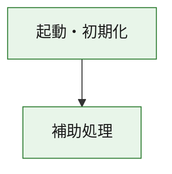
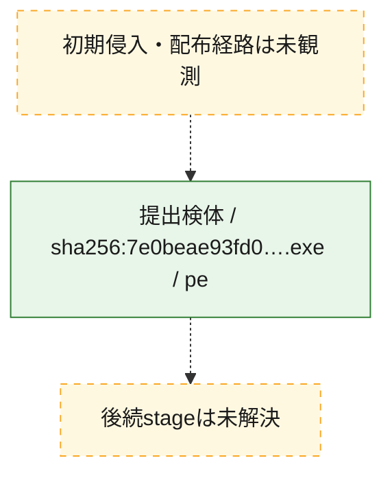
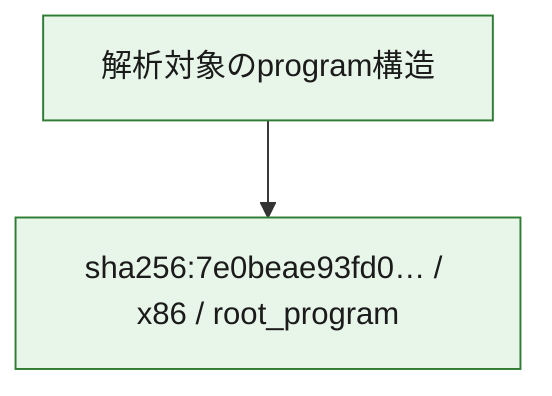

# 全体ロジック：7e0beae93fd073fd057a294bd774a16d16c3dbcdd9b790ffea3a1edec043c71a

代表関数の静的証跡から、起動・初期化の処理群を確認しました。

## 読み方

- phaseの掲載順は解析上の整理順です。observed_call_edgesがない段階間の実行順を断定しません。
- 図の実線は静的に観測した関係、点線と黄色のノードは未観測・未解決の関係を示します。
- 図は静的な要約であり、動的実行を再現するものではありません。
- 詳細な関数解説とfingerprintは[STATIC-LOGIC.md](STATIC-LOGIC.md)を参照してください。

## 静的可視化

### 実行フロー

### 感染チェーン

### モジュール関係

## 処理段階

### 1. 起動・初期化

entry pointから初期化と後続処理への移行を確認します。
確度: `confirmed_static_function_evidence`

- `7e0beae93fd073fd057a294bd774a16d16c3dbcdd9b790ffea3a1edec043c71a:ghidra:180001010` — 初期化と主要処理への分岐を行う入口関数です。 状態: `succeeded`、選定理由: `entry_point`, `meaningful_symbol_name`, `reviewed_call_centrality:22`, `role:entrypoint`, `small_program_complete_context`

### 2. 補助処理

主要処理を支える一般内部関数またはlibrary処理を確認します。
確度: `confirmed_static_function_evidence`

- `7e0beae93fd073fd057a294bd774a16d16c3dbcdd9b790ffea3a1edec043c71a:ghidra:180001240` — 検体内部の一般処理を実装する関数です。 状態: `succeeded`、選定理由: `context_representative`, `reviewed_call_centrality:2`, `small_program_complete_context`
- `7e0beae93fd073fd057a294bd774a16d16c3dbcdd9b790ffea3a1edec043c71a:ghidra:180001350` — 検体内部の一般処理を実装する関数です。 状態: `succeeded`、選定理由: `context_representative`, `reviewed_call_centrality:25`, `small_program_complete_context`
- `7e0beae93fd073fd057a294bd774a16d16c3dbcdd9b790ffea3a1edec043c71a:ghidra:180003780` — 検体内部の一般処理を実装する関数です。 状態: `succeeded`、選定理由: `context_representative`, `reviewed_call_centrality:2`, `small_program_complete_context`
- `7e0beae93fd073fd057a294bd774a16d16c3dbcdd9b790ffea3a1edec043c71a:ghidra:1800038e0` — 検体内部の一般処理を実装する関数です。 状態: `succeeded`、選定理由: `context_representative`, `reviewed_call_centrality:2`, `small_program_complete_context`

## 観測したcall関係

- `7e0beae93fd073fd057a294bd774a16d16c3dbcdd9b790ffea3a1edec043c71a:ghidra:180001010` → `7e0beae93fd073fd057a294bd774a16d16c3dbcdd9b790ffea3a1edec043c71a:ghidra:180001240` （`startup` → `support`）
- `7e0beae93fd073fd057a294bd774a16d16c3dbcdd9b790ffea3a1edec043c71a:ghidra:180001010` → `7e0beae93fd073fd057a294bd774a16d16c3dbcdd9b790ffea3a1edec043c71a:ghidra:180001350` （`startup` → `support`）
- `7e0beae93fd073fd057a294bd774a16d16c3dbcdd9b790ffea3a1edec043c71a:ghidra:180001350` → `7e0beae93fd073fd057a294bd774a16d16c3dbcdd9b790ffea3a1edec043c71a:ghidra:180001240` （`support` → `support`）
- `7e0beae93fd073fd057a294bd774a16d16c3dbcdd9b790ffea3a1edec043c71a:ghidra:180001350` → `7e0beae93fd073fd057a294bd774a16d16c3dbcdd9b790ffea3a1edec043c71a:ghidra:180003780` （`support` → `support`）
- `7e0beae93fd073fd057a294bd774a16d16c3dbcdd9b790ffea3a1edec043c71a:ghidra:180001350` → `7e0beae93fd073fd057a294bd774a16d16c3dbcdd9b790ffea3a1edec043c71a:ghidra:1800038e0` （`support` → `support`）
- `7e0beae93fd073fd057a294bd774a16d16c3dbcdd9b790ffea3a1edec043c71a:ghidra:180003780` → `7e0beae93fd073fd057a294bd774a16d16c3dbcdd9b790ffea3a1edec043c71a:ghidra:1800038e0` （`support` → `support`）
- `ghidra-function:5e1926587cf85ebc63bb1787` → `ghidra-function:539f0175b7b404690a8012f6` （`unclassified` → `unclassified`）
- `ghidra-function:b57a126ee4f0529e1546454d` → `ghidra-function:0fc014bbdfd807cfb8fb14a6` （`unclassified` → `unclassified`）
- `ghidra-function:b57a126ee4f0529e1546454d` → `ghidra-function:16b328ffd753b2ab3d54a190` （`unclassified` → `unclassified`）
- `ghidra-function:b57a126ee4f0529e1546454d` → `ghidra-function:1a4394d89bae16ff362f31cd` （`unclassified` → `unclassified`）
- `ghidra-function:b57a126ee4f0529e1546454d` → `ghidra-function:21ef89151ae6ba15eb6499b8` （`unclassified` → `unclassified`）
- `ghidra-function:b57a126ee4f0529e1546454d` → `ghidra-function:27b8b0d2e6619e8fc8b1fbb7` （`unclassified` → `unclassified`）
- `ghidra-function:b57a126ee4f0529e1546454d` → `ghidra-function:80679cb452c3e5c6e3ecbce5` （`unclassified` → `unclassified`）
- `ghidra-function:b57a126ee4f0529e1546454d` → `ghidra-function:97275fec5e7b26c2618815f9` （`unclassified` → `unclassified`）
- `ghidra-function:b57a126ee4f0529e1546454d` → `ghidra-function:afca91dd06b89610891bbbb4` （`unclassified` → `unclassified`）
- `ghidra-function:b57a126ee4f0529e1546454d` → `ghidra-function:c3c006e26beed32b277fe652` （`unclassified` → `unclassified`）
- `ghidra-function:b57a126ee4f0529e1546454d` → `ghidra-function:caf44ee224ae19205688ada3` （`unclassified` → `unclassified`）
- `ghidra-function:b57a126ee4f0529e1546454d` → `ghidra-function:e8ed461c1331be8932259fe2` （`unclassified` → `unclassified`）
- `ghidra-function:b57a126ee4f0529e1546454d` → `ghidra-function:f1b018936d781cf6ec8d882b` （`unclassified` → `unclassified`）
- `ghidra-function:c3c006e26beed32b277fe652` → `ghidra-external:18ebfd1e3ac6e69b75be5da4` （`unclassified` → `unclassified`）
- `ghidra-function:c3c006e26beed32b277fe652` → `ghidra-external:266dfbde4ffe3a230731ea5f` （`unclassified` → `unclassified`）
- `ghidra-function:c3c006e26beed32b277fe652` → `ghidra-external:2ef28e1e8267791b4bd5bb3a` （`unclassified` → `unclassified`）
- `ghidra-function:c3c006e26beed32b277fe652` → `ghidra-external:30bb0a4f9e8630650b1e9203` （`unclassified` → `unclassified`）
- `ghidra-function:c3c006e26beed32b277fe652` → `ghidra-external:320f04e2945612f68fd2f7ed` （`unclassified` → `unclassified`）
- `ghidra-function:c3c006e26beed32b277fe652` → `ghidra-external:4547bbd3d8fcc87eb4ffbce5` （`unclassified` → `unclassified`）
- `ghidra-function:c3c006e26beed32b277fe652` → `ghidra-external:5f40b91d45583cdd334c83c3` （`unclassified` → `unclassified`）
- `ghidra-function:c3c006e26beed32b277fe652` → `ghidra-external:5fc995a11a38cec811d43042` （`unclassified` → `unclassified`）
- `ghidra-function:c3c006e26beed32b277fe652` → `ghidra-external:605e8e68929b737da6d5ed63` （`unclassified` → `unclassified`）
- `ghidra-function:c3c006e26beed32b277fe652` → `ghidra-external:6ada8756f7139c96c6498273` （`unclassified` → `unclassified`）
- `ghidra-function:c3c006e26beed32b277fe652` → `ghidra-external:6ba8e87007d22595fd822c18` （`unclassified` → `unclassified`）
- `ghidra-function:c3c006e26beed32b277fe652` → `ghidra-external:8e2e6cd978fdbd460d56cdcf` （`unclassified` → `unclassified`）
- `ghidra-function:c3c006e26beed32b277fe652` → `ghidra-external:9dbc759c5acfab89303d94e2` （`unclassified` → `unclassified`）
- `ghidra-function:c3c006e26beed32b277fe652` → `ghidra-external:a79fdfc763003e984148ae6e` （`unclassified` → `unclassified`）
- `ghidra-function:c3c006e26beed32b277fe652` → `ghidra-external:a8591fb52ecddbaa903b1c5f` （`unclassified` → `unclassified`）
- `ghidra-function:c3c006e26beed32b277fe652` → `ghidra-external:b3ce31b3ccd1b1a387e7eac6` （`unclassified` → `unclassified`）
- `ghidra-function:c3c006e26beed32b277fe652` → `ghidra-external:cbc6af984a9fd11359e6d0a6` （`unclassified` → `unclassified`）
- `ghidra-function:c3c006e26beed32b277fe652` → `ghidra-external:d14ebe1de6e9428862115a46` （`unclassified` → `unclassified`）
- `ghidra-function:c3c006e26beed32b277fe652` → `ghidra-external:f64adfef5f2b63fa2d25c4cd` （`unclassified` → `unclassified`）
- `ghidra-function:c3c006e26beed32b277fe652` → `ghidra-external:fa26a47b864a309244b84e03` （`unclassified` → `unclassified`）
- `ghidra-function:c3c006e26beed32b277fe652` → `ghidra-external:fe60a2cd921ebdcc61fdeb62` （`unclassified` → `unclassified`）
- `ghidra-function:c3c006e26beed32b277fe652` → `ghidra-function:21ef89151ae6ba15eb6499b8` （`unclassified` → `unclassified`）
- `ghidra-function:c3c006e26beed32b277fe652` → `ghidra-function:539f0175b7b404690a8012f6` （`unclassified` → `unclassified`）
- `ghidra-function:c3c006e26beed32b277fe652` → `ghidra-function:5e1926587cf85ebc63bb1787` （`unclassified` → `unclassified`）

## 解析範囲と制約

- 選定外関数は全体inventoryへ残しますが、関数本体の個別解説対象にはしていません。
- indirect call、難読化、packer、VM、壊れたcontrol flowによりcall関係が欠落する場合があります。
- 文書は静的解析に基づき、検体実行や外部通信による動的確認は行っていません。
