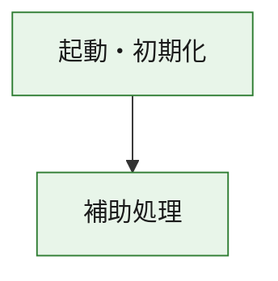
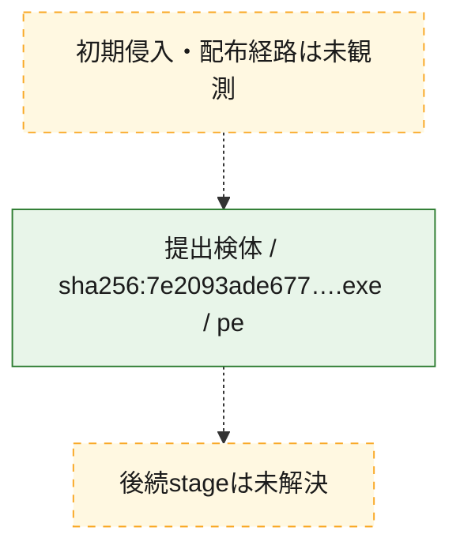
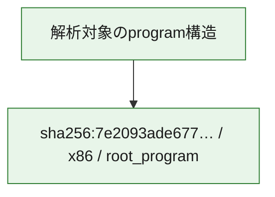

# 全体ロジック：7e2093ade677917244dfc38fa28ce8e763a0d47da635a8d80d49d1a9f2b3c7a4

代表関数の静的証跡から、起動・初期化の処理群を確認しました。

## 読み方

- phaseの掲載順は解析上の整理順です。observed_call_edgesがない段階間の実行順を断定しません。
- 図の実線は静的に観測した関係、点線と黄色のノードは未観測・未解決の関係を示します。
- 図は静的な要約であり、動的実行を再現するものではありません。
- 詳細な関数解説とfingerprintは[STATIC-LOGIC.md](STATIC-LOGIC.md)を参照してください。

## 静的可視化

### 実行フロー

### 感染チェーン

### モジュール関係

## 処理段階

### 1. 起動・初期化

entry pointから初期化と後続処理への移行を確認します。
確度: `confirmed_static_function_evidence`

- `7e2093ade677917244dfc38fa28ce8e763a0d47da635a8d80d49d1a9f2b3c7a4:ghidra:180001010` — 初期化と主要処理への分岐を行う入口関数です。 状態: `succeeded`、選定理由: `entry_point`, `meaningful_symbol_name`, `reviewed_call_centrality:22`, `role:entrypoint`, `small_program_complete_context`

### 2. 補助処理

主要処理を支える一般内部関数またはlibrary処理を確認します。
確度: `confirmed_static_function_evidence`

- `7e2093ade677917244dfc38fa28ce8e763a0d47da635a8d80d49d1a9f2b3c7a4:ghidra:180001240` — 検体内部の一般処理を実装する関数です。 状態: `succeeded`、選定理由: `context_representative`, `reviewed_call_centrality:2`, `small_program_complete_context`
- `7e2093ade677917244dfc38fa28ce8e763a0d47da635a8d80d49d1a9f2b3c7a4:ghidra:180001350` — 検体内部の一般処理を実装する関数です。 状態: `succeeded`、選定理由: `context_representative`, `reviewed_call_centrality:25`, `small_program_complete_context`
- `7e2093ade677917244dfc38fa28ce8e763a0d47da635a8d80d49d1a9f2b3c7a4:ghidra:180003780` — 検体内部の一般処理を実装する関数です。 状態: `succeeded`、選定理由: `context_representative`, `reviewed_call_centrality:2`, `small_program_complete_context`
- `7e2093ade677917244dfc38fa28ce8e763a0d47da635a8d80d49d1a9f2b3c7a4:ghidra:1800038e0` — 検体内部の一般処理を実装する関数です。 状態: `succeeded`、選定理由: `context_representative`, `reviewed_call_centrality:2`, `small_program_complete_context`

## 観測したcall関係

- `7e2093ade677917244dfc38fa28ce8e763a0d47da635a8d80d49d1a9f2b3c7a4:ghidra:180001010` → `7e2093ade677917244dfc38fa28ce8e763a0d47da635a8d80d49d1a9f2b3c7a4:ghidra:180001240` （`startup` → `support`）
- `7e2093ade677917244dfc38fa28ce8e763a0d47da635a8d80d49d1a9f2b3c7a4:ghidra:180001010` → `7e2093ade677917244dfc38fa28ce8e763a0d47da635a8d80d49d1a9f2b3c7a4:ghidra:180001350` （`startup` → `support`）
- `7e2093ade677917244dfc38fa28ce8e763a0d47da635a8d80d49d1a9f2b3c7a4:ghidra:180001350` → `7e2093ade677917244dfc38fa28ce8e763a0d47da635a8d80d49d1a9f2b3c7a4:ghidra:180001240` （`support` → `support`）
- `7e2093ade677917244dfc38fa28ce8e763a0d47da635a8d80d49d1a9f2b3c7a4:ghidra:180001350` → `7e2093ade677917244dfc38fa28ce8e763a0d47da635a8d80d49d1a9f2b3c7a4:ghidra:180003780` （`support` → `support`）
- `7e2093ade677917244dfc38fa28ce8e763a0d47da635a8d80d49d1a9f2b3c7a4:ghidra:180001350` → `7e2093ade677917244dfc38fa28ce8e763a0d47da635a8d80d49d1a9f2b3c7a4:ghidra:1800038e0` （`support` → `support`）
- `7e2093ade677917244dfc38fa28ce8e763a0d47da635a8d80d49d1a9f2b3c7a4:ghidra:180003780` → `7e2093ade677917244dfc38fa28ce8e763a0d47da635a8d80d49d1a9f2b3c7a4:ghidra:1800038e0` （`support` → `support`）
- `ghidra-function:17e3091ffe38710bba950361` → `ghidra-function:8bb4fad4cc8c0d931d5c9988` （`unclassified` → `unclassified`）
- `ghidra-function:a398af1ccf407c96b095e0e5` → `ghidra-function:0b4843821864493ac1950c00` （`unclassified` → `unclassified`）
- `ghidra-function:a398af1ccf407c96b095e0e5` → `ghidra-function:4550e6dd8f4c40f37f9c7919` （`unclassified` → `unclassified`）
- `ghidra-function:a398af1ccf407c96b095e0e5` → `ghidra-function:495790291fea92d2a5d09f5f` （`unclassified` → `unclassified`）
- `ghidra-function:a398af1ccf407c96b095e0e5` → `ghidra-function:4ca4dddf9bec6142e93eb8ab` （`unclassified` → `unclassified`）
- `ghidra-function:a398af1ccf407c96b095e0e5` → `ghidra-function:83e7c69403b6c50b6ea0d183` （`unclassified` → `unclassified`）
- `ghidra-function:a398af1ccf407c96b095e0e5` → `ghidra-function:8796aa58ddf1613e792024f8` （`unclassified` → `unclassified`）
- `ghidra-function:a398af1ccf407c96b095e0e5` → `ghidra-function:9c13b86df0f91a5607130e32` （`unclassified` → `unclassified`）
- `ghidra-function:a398af1ccf407c96b095e0e5` → `ghidra-function:bde5dc2ec027ffeebadaf3cf` （`unclassified` → `unclassified`）
- `ghidra-function:a398af1ccf407c96b095e0e5` → `ghidra-function:d93e6779e3a1215e53d64e40` （`unclassified` → `unclassified`）
- `ghidra-function:a398af1ccf407c96b095e0e5` → `ghidra-function:ef1b33725e9632a5ff559c2c` （`unclassified` → `unclassified`）
- `ghidra-function:a398af1ccf407c96b095e0e5` → `ghidra-function:f54fe20064ed54dd0dc09ce0` （`unclassified` → `unclassified`）
- `ghidra-function:a398af1ccf407c96b095e0e5` → `ghidra-function:f9ddd72bfd7c9d0f8ac81356` （`unclassified` → `unclassified`）
- `ghidra-function:f9ddd72bfd7c9d0f8ac81356` → `ghidra-external:0369643f15fee6314470ad6e` （`unclassified` → `unclassified`）
- `ghidra-function:f9ddd72bfd7c9d0f8ac81356` → `ghidra-external:0a6d680380aea9d9407b87f0` （`unclassified` → `unclassified`）
- `ghidra-function:f9ddd72bfd7c9d0f8ac81356` → `ghidra-external:2520fb9672e1009421d3450c` （`unclassified` → `unclassified`）
- `ghidra-function:f9ddd72bfd7c9d0f8ac81356` → `ghidra-external:319ff1835ecd73ee41c41b0b` （`unclassified` → `unclassified`）
- `ghidra-function:f9ddd72bfd7c9d0f8ac81356` → `ghidra-external:350c468283af03792b7b1cd9` （`unclassified` → `unclassified`）
- `ghidra-function:f9ddd72bfd7c9d0f8ac81356` → `ghidra-external:3982e5733160e91aa061daea` （`unclassified` → `unclassified`）
- `ghidra-function:f9ddd72bfd7c9d0f8ac81356` → `ghidra-external:482632da149b7040c8e04bfc` （`unclassified` → `unclassified`）
- `ghidra-function:f9ddd72bfd7c9d0f8ac81356` → `ghidra-external:5da21248332a5829d4f334cb` （`unclassified` → `unclassified`）
- `ghidra-function:f9ddd72bfd7c9d0f8ac81356` → `ghidra-external:6ed9cbefb2266407a81aaeb7` （`unclassified` → `unclassified`）
- `ghidra-function:f9ddd72bfd7c9d0f8ac81356` → `ghidra-external:74638ffd02d04f7111adc5b2` （`unclassified` → `unclassified`）
- `ghidra-function:f9ddd72bfd7c9d0f8ac81356` → `ghidra-external:7eb80b087547c3ffeb688cec` （`unclassified` → `unclassified`）
- `ghidra-function:f9ddd72bfd7c9d0f8ac81356` → `ghidra-external:7f20022dcd355c17e95db864` （`unclassified` → `unclassified`）
- `ghidra-function:f9ddd72bfd7c9d0f8ac81356` → `ghidra-external:9df53c7a33aaf085baa45bb7` （`unclassified` → `unclassified`）
- `ghidra-function:f9ddd72bfd7c9d0f8ac81356` → `ghidra-external:a2dcd6dad31926d2907c5514` （`unclassified` → `unclassified`）
- `ghidra-function:f9ddd72bfd7c9d0f8ac81356` → `ghidra-external:c0bb15644ebaadd68a76947e` （`unclassified` → `unclassified`）
- `ghidra-function:f9ddd72bfd7c9d0f8ac81356` → `ghidra-external:c2635bbbfb2fd68bfeab56f0` （`unclassified` → `unclassified`）
- `ghidra-function:f9ddd72bfd7c9d0f8ac81356` → `ghidra-external:c6742b5c94838456b9cc71bd` （`unclassified` → `unclassified`）
- `ghidra-function:f9ddd72bfd7c9d0f8ac81356` → `ghidra-external:e43d8d6ab3306820ed42578d` （`unclassified` → `unclassified`）
- `ghidra-function:f9ddd72bfd7c9d0f8ac81356` → `ghidra-external:f3a2c6f5cc55c8d858e0d0a2` （`unclassified` → `unclassified`）
- `ghidra-function:f9ddd72bfd7c9d0f8ac81356` → `ghidra-external:f5671e1711d379cfc91740d7` （`unclassified` → `unclassified`）
- `ghidra-function:f9ddd72bfd7c9d0f8ac81356` → `ghidra-external:f8808b1916ea50374bc06653` （`unclassified` → `unclassified`）
- `ghidra-function:f9ddd72bfd7c9d0f8ac81356` → `ghidra-function:17e3091ffe38710bba950361` （`unclassified` → `unclassified`）
- `ghidra-function:f9ddd72bfd7c9d0f8ac81356` → `ghidra-function:8bb4fad4cc8c0d931d5c9988` （`unclassified` → `unclassified`）
- `ghidra-function:f9ddd72bfd7c9d0f8ac81356` → `ghidra-function:9c13b86df0f91a5607130e32` （`unclassified` → `unclassified`）

## 解析範囲と制約

- 選定外関数は全体inventoryへ残しますが、関数本体の個別解説対象にはしていません。
- indirect call、難読化、packer、VM、壊れたcontrol flowによりcall関係が欠落する場合があります。
- 文書は静的解析に基づき、検体実行や外部通信による動的確認は行っていません。
