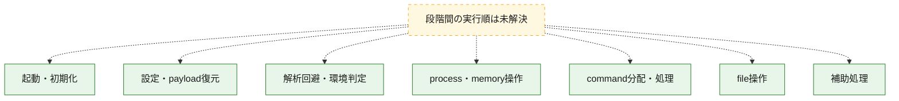
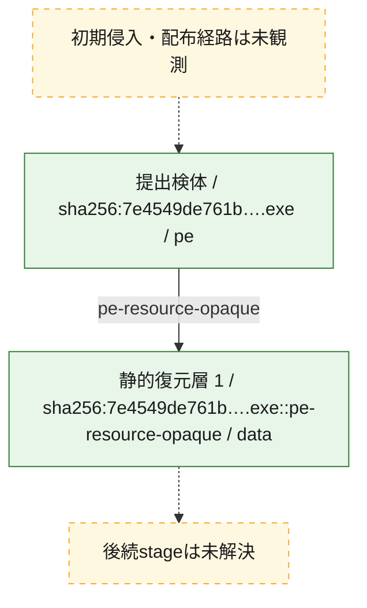
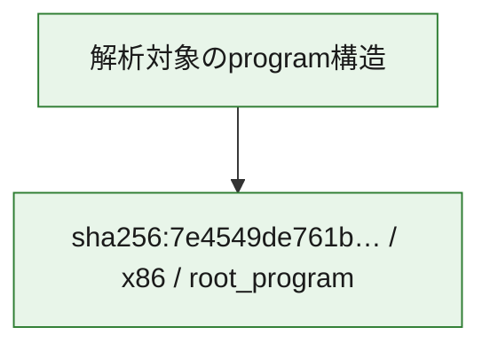

# 全体ロジック：7e4549de761b5bdb361bf22e3f3069539400448094c45d2e84175d76b6553853

代表関数の静的証跡から、起動・初期化、設定・payload復元、解析回避・環境判定、process・memory操作、command分配・処理、file操作の処理群を確認しました。

## 読み方

- phaseの掲載順は解析上の整理順です。observed_call_edgesがない段階間の実行順を断定しません。
- 図の実線は静的に観測した関係、点線と黄色のノードは未観測・未解決の関係を示します。
- 図は静的な要約であり、動的実行を再現するものではありません。
- 詳細な関数解説とfingerprintは[STATIC-LOGIC.md](STATIC-LOGIC.md)を参照してください。

## 静的可視化

### 実行フロー

### 感染チェーン

### モジュール関係

## 処理段階

### 1. 起動・初期化

entry pointから初期化と後続処理への移行を確認します。
確度: `confirmed_static_function_evidence`

- `7e4549de761b5bdb361bf22e3f3069539400448094c45d2e84175d76b6553853:ghidra:1800017b8` — 初期化と主要処理への分岐を行う入口関数です。 状態: `succeeded`、選定理由: `entry_point`, `meaningful_symbol_name`, `reviewed_call_centrality:5`, `role:entrypoint`

### 2. 設定・payload復元

設定、resource、payload、暗号化データの復元・変換を確認します。
確度: `confirmed_static_function_evidence`

- `7e4549de761b5bdb361bf22e3f3069539400448094c45d2e84175d76b6553853:ghidra:180001080` — 設定、resource、payloadなどの解析・変換を行う関数です。 状態: `succeeded`、選定理由: `context_representative`, `reviewed_call_centrality:28`, `role:config_or_data_transform`

### 3. 解析回避・環境判定

debugger、sandbox、仮想環境、時間差などの判定を確認します。
確度: `confirmed_static_function_evidence`

- `7e4549de761b5bdb361bf22e3f3069539400448094c45d2e84175d76b6553853:ghidra:180001ca4` — debugger、仮想環境、sandbox、または時間差の確認に関係する関数です。 状態: `succeeded`、選定理由: `context_representative`, `reviewed_call_centrality:8`, `role:anti_analysis`

### 4. process・memory操作

process、thread、module、memory操作と実行移行を確認します。
確度: `confirmed_static_function_evidence`

- `7e4549de761b5bdb361bf22e3f3069539400448094c45d2e84175d76b6553853:ghidra:1800017f8` — process、thread、module、またはmemory操作に関係する関数です。 状態: `succeeded`、選定理由: `context_representative`, `reviewed_call_centrality:10`, `role:process_or_memory_operation`

### 5. command分配・処理

受信commandやtaskの解釈、分配、個別handlerへの移行を確認します。
確度: `confirmed_static_function_evidence_with_limits`

- `7e4549de761b5bdb361bf22e3f3069539400448094c45d2e84175d76b6553853:ghidra:1800014a4` — commandの解釈、分配、または個別処理を担当する関数です。 状態: `succeeded`、選定理由: `context_representative`, `reviewed_call_centrality:25`, `role:command_dispatch_or_handler`
- `7e4549de761b5bdb361bf22e3f3069539400448094c45d2e84175d76b6553853:ghidra:1800014f4` — commandの解釈、分配、または個別処理を担当する関数です。 状態: `succeeded`、選定理由: `context_representative`, `reviewed_call_centrality:15`, `role:command_dispatch_or_handler`
- `7e4549de761b5bdb361bf22e3f3069539400448094c45d2e84175d76b6553853:ghidra:1800019b8` — commandの解釈、分配、または個別処理を担当する関数です。 状態: `succeeded`、選定理由: `context_representative`, `reviewed_call_centrality:4`, `role:command_dispatch_or_handler`
- `7e4549de761b5bdb361bf22e3f3069539400448094c45d2e84175d76b6553853:ghidra:180001c28` — commandの解釈、分配、または個別処理を担当する関数です。 状態: `succeeded`、選定理由: `context_representative`, `reviewed_call_centrality:3`, `role:command_dispatch_or_handler`
- `7e4549de761b5bdb361bf22e3f3069539400448094c45d2e84175d76b6553853:ghidra:180001c64` — commandの解釈、分配、または個別処理を担当する関数です。 状態: `succeeded`、選定理由: `context_representative`, `reviewed_call_centrality:3`, `role:command_dispatch_or_handler`
- `7e4549de761b5bdb361bf22e3f3069539400448094c45d2e84175d76b6553853:ghidra:18000cbe0` — commandの解釈、分配、または個別処理を担当する関数です。 状態: `limited_bad_instruction_or_flow`、選定理由: `meaningful_symbol_name`, `reviewed_call_centrality:5`, `role:command_dispatch_or_handler`

### 6. file操作

fileやdirectoryの作成、読書き、削除を確認します。
確度: `confirmed_static_function_evidence`

- `7e4549de761b5bdb361bf22e3f3069539400448094c45d2e84175d76b6553853:ghidra:180001400` — fileまたはdirectoryの読書き・管理に関係する関数です。 状態: `succeeded`、選定理由: `context_representative`, `reviewed_call_centrality:7`, `role:file_operation`

### 7. 補助処理

主要処理を支える一般内部関数またはlibrary処理を確認します。
確度: `confirmed_static_function_evidence`

- `7e4549de761b5bdb361bf22e3f3069539400448094c45d2e84175d76b6553853:ghidra:180001040` — 検体内部の一般処理を実装する関数です。 状態: `succeeded`、選定理由: `entry_point`, `meaningful_symbol_name`, `reviewed_call_centrality:3`
- `7e4549de761b5bdb361bf22e3f3069539400448094c45d2e84175d76b6553853:ghidra:18000160c` — 検体内部の一般処理を実装する関数です。 状態: `succeeded`、選定理由: `context_representative`, `reviewed_call_centrality:11`
- `7e4549de761b5bdb361bf22e3f3069539400448094c45d2e84175d76b6553853:ghidra:180001690` — 検体内部の一般処理を実装する関数です。 状態: `succeeded`、選定理由: `context_representative`, `reviewed_call_centrality:4`
- `7e4549de761b5bdb361bf22e3f3069539400448094c45d2e84175d76b6553853:ghidra:1800018d4` — 検体内部の一般処理を実装する関数です。 状態: `succeeded`、選定理由: `context_representative`, `reviewed_call_centrality:4`
- `7e4549de761b5bdb361bf22e3f3069539400448094c45d2e84175d76b6553853:ghidra:1800018f0` — 検体内部の一般処理を実装する関数です。 状態: `succeeded`、選定理由: `context_representative`, `reviewed_call_centrality:6`
- `7e4549de761b5bdb361bf22e3f3069539400448094c45d2e84175d76b6553853:ghidra:18000192c` — 検体内部の一般処理を実装する関数です。 状態: `succeeded`、選定理由: `context_representative`, `reviewed_call_centrality:7`
- `7e4549de761b5bdb361bf22e3f3069539400448094c45d2e84175d76b6553853:ghidra:180001960` — 検体内部の一般処理を実装する関数です。 状態: `succeeded`、選定理由: `context_representative`, `reviewed_call_centrality:3`
- `7e4549de761b5bdb361bf22e3f3069539400448094c45d2e84175d76b6553853:ghidra:180001978` — 検体内部の一般処理を実装する関数です。 状態: `succeeded`、選定理由: `context_representative`, `reviewed_call_centrality:4`
- `7e4549de761b5bdb361bf22e3f3069539400448094c45d2e84175d76b6553853:ghidra:1800019a0` — 検体内部の一般処理を実装する関数です。 状態: `succeeded`、選定理由: `context_representative`, `reviewed_call_centrality:3`
- `7e4549de761b5bdb361bf22e3f3069539400448094c45d2e84175d76b6553853:ghidra:180001a18` — 検体内部の一般処理を実装する関数です。 状態: `succeeded`、選定理由: `context_representative`, `reviewed_call_centrality:6`
- `7e4549de761b5bdb361bf22e3f3069539400448094c45d2e84175d76b6553853:ghidra:180001a48` — 検体内部の一般処理を実装する関数です。 状態: `succeeded`、選定理由: `context_representative`, `reviewed_call_centrality:4`
- `7e4549de761b5bdb361bf22e3f3069539400448094c45d2e84175d76b6553853:ghidra:180001a5c` — 検体内部の一般処理を実装する関数です。 状態: `succeeded`、選定理由: `context_representative`, `reviewed_call_centrality:6`
- `7e4549de761b5bdb361bf22e3f3069539400448094c45d2e84175d76b6553853:ghidra:180001a98` — 検体内部の一般処理を実装する関数です。 状態: `succeeded`、選定理由: `context_representative`, `reviewed_call_centrality:5`
- `7e4549de761b5bdb361bf22e3f3069539400448094c45d2e84175d76b6553853:ghidra:180001b24` — 検体内部の一般処理を実装する関数です。 状態: `succeeded`、選定理由: `context_representative`, `reviewed_call_centrality:4`
- `7e4549de761b5bdb361bf22e3f3069539400448094c45d2e84175d76b6553853:ghidra:180001bbc` — 検体内部の一般処理を実装する関数です。 状態: `succeeded`、選定理由: `context_representative`, `reviewed_call_centrality:6`
- `7e4549de761b5bdb361bf22e3f3069539400448094c45d2e84175d76b6553853:ghidra:180001be0` — 検体内部の一般処理を実装する関数です。 状態: `succeeded`、選定理由: `context_representative`, `reviewed_call_centrality:4`
- `7e4549de761b5bdb361bf22e3f3069539400448094c45d2e84175d76b6553853:ghidra:180001ca0` — 検体内部の一般処理を実装する関数です。 状態: `succeeded`、選定理由: `meaningful_symbol_name`
- `7e4549de761b5bdb361bf22e3f3069539400448094c45d2e84175d76b6553853:ghidra:180001f60` — 検体内部の一般処理を実装する関数です。 状態: `succeeded`、選定理由: `context_representative`, `reviewed_call_centrality:8`
- `7e4549de761b5bdb361bf22e3f3069539400448094c45d2e84175d76b6553853:ghidra:180002190` — 検体内部の一般処理を実装する関数です。 状態: `succeeded`、選定理由: `context_representative`, `reviewed_call_centrality:3`
- `7e4549de761b5bdb361bf22e3f3069539400448094c45d2e84175d76b6553853:ghidra:1800021bc` — 検体内部の一般処理を実装する関数です。 状態: `succeeded`、選定理由: `context_representative`, `reviewed_call_centrality:4`
- `7e4549de761b5bdb361bf22e3f3069539400448094c45d2e84175d76b6553853:ghidra:1800021e4` — 検体内部の一般処理を実装する関数です。 状態: `succeeded`、選定理由: `context_representative`, `reviewed_call_centrality:2`

## 観測したcall関係

- 代表関数間で直接解決できた呼出関係はありません。

## 解析範囲と制約

- 選定外関数は全体inventoryへ残しますが、関数本体の個別解説対象にはしていません。
- indirect call、難読化、packer、VM、壊れたcontrol flowによりcall関係が欠落する場合があります。
- 文書は静的解析に基づき、検体実行や外部通信による動的確認は行っていません。
