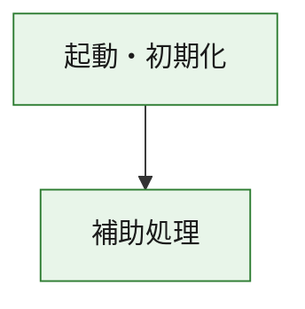
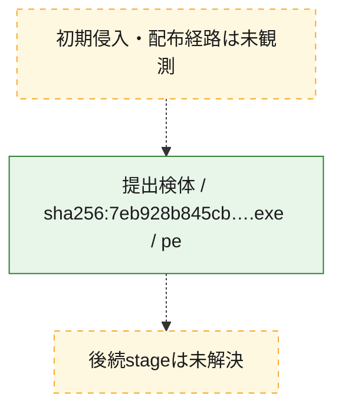
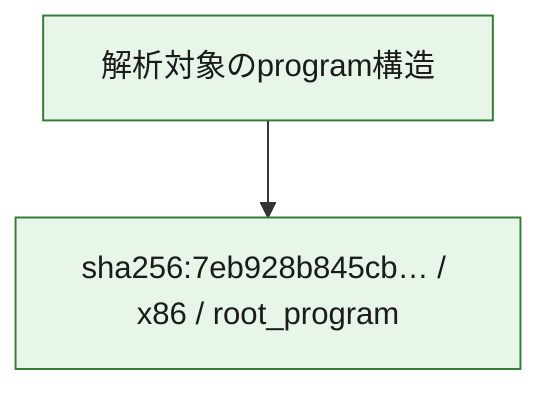

# 全体ロジック：7eb928b845cb639054eae7906b43b301e9f957b904a2abe9a82fcfa75fd83bae

代表関数の静的証跡から、起動・初期化の処理群を確認しました。

## 読み方

- phaseの掲載順は解析上の整理順です。observed_call_edgesがない段階間の実行順を断定しません。
- 図の実線は静的に観測した関係、点線と黄色のノードは未観測・未解決の関係を示します。
- 図は静的な要約であり、動的実行を再現するものではありません。
- 詳細な関数解説とfingerprintは[STATIC-LOGIC.md](STATIC-LOGIC.md)を参照してください。

## 静的可視化

### 実行フロー

### 感染チェーン

### モジュール関係

## 処理段階

### 1. 起動・初期化

entry pointから初期化と後続処理への移行を確認します。
確度: `confirmed_static_function_evidence`

- `7eb928b845cb639054eae7906b43b301e9f957b904a2abe9a82fcfa75fd83bae:ghidra:180001010` — 初期化と主要処理への分岐を行う入口関数です。 状態: `succeeded`、選定理由: `entry_point`, `meaningful_symbol_name`, `reviewed_call_centrality:22`, `role:entrypoint`, `small_program_complete_context`

### 2. 補助処理

主要処理を支える一般内部関数またはlibrary処理を確認します。
確度: `confirmed_static_function_evidence`

- `7eb928b845cb639054eae7906b43b301e9f957b904a2abe9a82fcfa75fd83bae:ghidra:180001240` — 検体内部の一般処理を実装する関数です。 状態: `succeeded`、選定理由: `context_representative`, `reviewed_call_centrality:2`, `small_program_complete_context`
- `7eb928b845cb639054eae7906b43b301e9f957b904a2abe9a82fcfa75fd83bae:ghidra:180001350` — 検体内部の一般処理を実装する関数です。 状態: `succeeded`、選定理由: `context_representative`, `reviewed_call_centrality:25`, `small_program_complete_context`
- `7eb928b845cb639054eae7906b43b301e9f957b904a2abe9a82fcfa75fd83bae:ghidra:180003780` — 検体内部の一般処理を実装する関数です。 状態: `succeeded`、選定理由: `context_representative`, `reviewed_call_centrality:2`, `small_program_complete_context`
- `7eb928b845cb639054eae7906b43b301e9f957b904a2abe9a82fcfa75fd83bae:ghidra:1800038e0` — 検体内部の一般処理を実装する関数です。 状態: `succeeded`、選定理由: `context_representative`, `reviewed_call_centrality:2`, `small_program_complete_context`

## 観測したcall関係

- `7eb928b845cb639054eae7906b43b301e9f957b904a2abe9a82fcfa75fd83bae:ghidra:180001010` → `7eb928b845cb639054eae7906b43b301e9f957b904a2abe9a82fcfa75fd83bae:ghidra:180001240` （`startup` → `support`）
- `7eb928b845cb639054eae7906b43b301e9f957b904a2abe9a82fcfa75fd83bae:ghidra:180001010` → `7eb928b845cb639054eae7906b43b301e9f957b904a2abe9a82fcfa75fd83bae:ghidra:180001350` （`startup` → `support`）
- `7eb928b845cb639054eae7906b43b301e9f957b904a2abe9a82fcfa75fd83bae:ghidra:180001350` → `7eb928b845cb639054eae7906b43b301e9f957b904a2abe9a82fcfa75fd83bae:ghidra:180001240` （`support` → `support`）
- `7eb928b845cb639054eae7906b43b301e9f957b904a2abe9a82fcfa75fd83bae:ghidra:180001350` → `7eb928b845cb639054eae7906b43b301e9f957b904a2abe9a82fcfa75fd83bae:ghidra:180003780` （`support` → `support`）
- `7eb928b845cb639054eae7906b43b301e9f957b904a2abe9a82fcfa75fd83bae:ghidra:180001350` → `7eb928b845cb639054eae7906b43b301e9f957b904a2abe9a82fcfa75fd83bae:ghidra:1800038e0` （`support` → `support`）
- `7eb928b845cb639054eae7906b43b301e9f957b904a2abe9a82fcfa75fd83bae:ghidra:180003780` → `7eb928b845cb639054eae7906b43b301e9f957b904a2abe9a82fcfa75fd83bae:ghidra:1800038e0` （`support` → `support`）
- `ghidra-function:46d06e35f4025308339d0cde` → `ghidra-function:3a8bada3f0b902182a1ecd0a` （`unclassified` → `unclassified`）
- `ghidra-function:46d06e35f4025308339d0cde` → `ghidra-function:51b516ee39d0cae1b6607e14` （`unclassified` → `unclassified`）
- `ghidra-function:46d06e35f4025308339d0cde` → `ghidra-function:649102c9c6b2c79580353a82` （`unclassified` → `unclassified`）
- `ghidra-function:46d06e35f4025308339d0cde` → `ghidra-function:72788374bdeaf14eb909b230` （`unclassified` → `unclassified`）
- `ghidra-function:46d06e35f4025308339d0cde` → `ghidra-function:8b189f99ebc4f67000902bb7` （`unclassified` → `unclassified`）
- `ghidra-function:46d06e35f4025308339d0cde` → `ghidra-function:8d9800be85fa268c034ed04c` （`unclassified` → `unclassified`）
- `ghidra-function:46d06e35f4025308339d0cde` → `ghidra-function:a5d942d1ae5a982a67598786` （`unclassified` → `unclassified`）
- `ghidra-function:46d06e35f4025308339d0cde` → `ghidra-function:a8ef6563b06203845f877410` （`unclassified` → `unclassified`）
- `ghidra-function:46d06e35f4025308339d0cde` → `ghidra-function:c034b156a82f8291f9d99790` （`unclassified` → `unclassified`）
- `ghidra-function:46d06e35f4025308339d0cde` → `ghidra-function:d493c501b1137e8c509cf8a3` （`unclassified` → `unclassified`）
- `ghidra-function:46d06e35f4025308339d0cde` → `ghidra-function:ea8885d7cb6c346a70453868` （`unclassified` → `unclassified`）
- `ghidra-function:46d06e35f4025308339d0cde` → `ghidra-function:f223c546bee3dff96b99fd96` （`unclassified` → `unclassified`）
- `ghidra-function:d3100b8d03ec9f713730df05` → `ghidra-function:79f3bd389fe54c446b5c8b4c` （`unclassified` → `unclassified`）
- `ghidra-function:d493c501b1137e8c509cf8a3` → `ghidra-external:0447140aedf849b42567c26b` （`unclassified` → `unclassified`）
- `ghidra-function:d493c501b1137e8c509cf8a3` → `ghidra-external:0b82c726098fa98d130b8758` （`unclassified` → `unclassified`）
- `ghidra-function:d493c501b1137e8c509cf8a3` → `ghidra-external:21d58868475ec7571e8d81b9` （`unclassified` → `unclassified`）
- `ghidra-function:d493c501b1137e8c509cf8a3` → `ghidra-external:2be3b95e841132070047860d` （`unclassified` → `unclassified`）
- `ghidra-function:d493c501b1137e8c509cf8a3` → `ghidra-external:453d7a85e251b8b529de2acd` （`unclassified` → `unclassified`）
- `ghidra-function:d493c501b1137e8c509cf8a3` → `ghidra-external:4e89c2439d5a6f486f8db97c` （`unclassified` → `unclassified`）
- `ghidra-function:d493c501b1137e8c509cf8a3` → `ghidra-external:64c068ddb66b26ce4d7cd934` （`unclassified` → `unclassified`）
- `ghidra-function:d493c501b1137e8c509cf8a3` → `ghidra-external:67e3a9dc1e26c60ca5284aaa` （`unclassified` → `unclassified`）
- `ghidra-function:d493c501b1137e8c509cf8a3` → `ghidra-external:6a9805d3cebed7ea6ac94d40` （`unclassified` → `unclassified`）
- `ghidra-function:d493c501b1137e8c509cf8a3` → `ghidra-external:9dca30d6e11d5af96c6a83f4` （`unclassified` → `unclassified`）
- `ghidra-function:d493c501b1137e8c509cf8a3` → `ghidra-external:a58188d6d8c9584690ee566c` （`unclassified` → `unclassified`）
- `ghidra-function:d493c501b1137e8c509cf8a3` → `ghidra-external:a768c24c3dd59b8717f96591` （`unclassified` → `unclassified`）
- `ghidra-function:d493c501b1137e8c509cf8a3` → `ghidra-external:b2f6ebea857d6fcf1e168920` （`unclassified` → `unclassified`）
- `ghidra-function:d493c501b1137e8c509cf8a3` → `ghidra-external:b7da6a2152b3e01c5d82d4c0` （`unclassified` → `unclassified`）
- `ghidra-function:d493c501b1137e8c509cf8a3` → `ghidra-external:bba5ae75549d65616cf98de5` （`unclassified` → `unclassified`）
- `ghidra-function:d493c501b1137e8c509cf8a3` → `ghidra-external:d0605aff9181385d7fb2d86b` （`unclassified` → `unclassified`）
- `ghidra-function:d493c501b1137e8c509cf8a3` → `ghidra-external:d264b04ff8f465381ad8aa0f` （`unclassified` → `unclassified`）
- `ghidra-function:d493c501b1137e8c509cf8a3` → `ghidra-external:dc4cbcef34892bbdaad97349` （`unclassified` → `unclassified`）
- `ghidra-function:d493c501b1137e8c509cf8a3` → `ghidra-external:e25095cdf4382a4376c3b3e3` （`unclassified` → `unclassified`）
- `ghidra-function:d493c501b1137e8c509cf8a3` → `ghidra-external:e457d80f262d535d41c8b017` （`unclassified` → `unclassified`）
- `ghidra-function:d493c501b1137e8c509cf8a3` → `ghidra-external:eb2d3a3f8c73ff6b9e659b94` （`unclassified` → `unclassified`）
- `ghidra-function:d493c501b1137e8c509cf8a3` → `ghidra-function:79f3bd389fe54c446b5c8b4c` （`unclassified` → `unclassified`）
- `ghidra-function:d493c501b1137e8c509cf8a3` → `ghidra-function:d3100b8d03ec9f713730df05` （`unclassified` → `unclassified`）
- `ghidra-function:d493c501b1137e8c509cf8a3` → `ghidra-function:f223c546bee3dff96b99fd96` （`unclassified` → `unclassified`）

## 解析範囲と制約

- 選定外関数は全体inventoryへ残しますが、関数本体の個別解説対象にはしていません。
- indirect call、難読化、packer、VM、壊れたcontrol flowによりcall関係が欠落する場合があります。
- 文書は静的解析に基づき、検体実行や外部通信による動的確認は行っていません。
