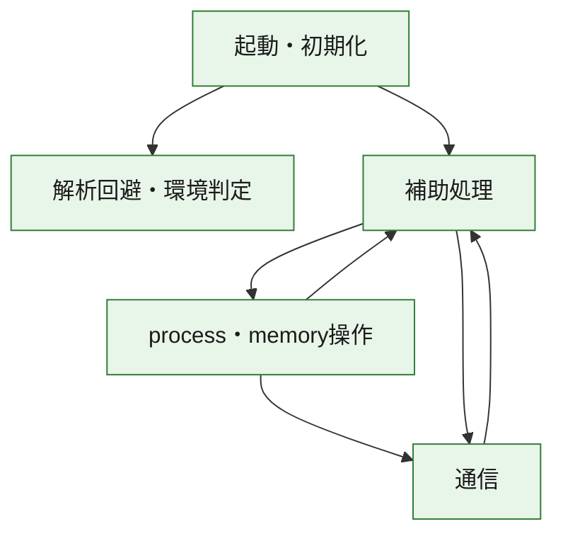
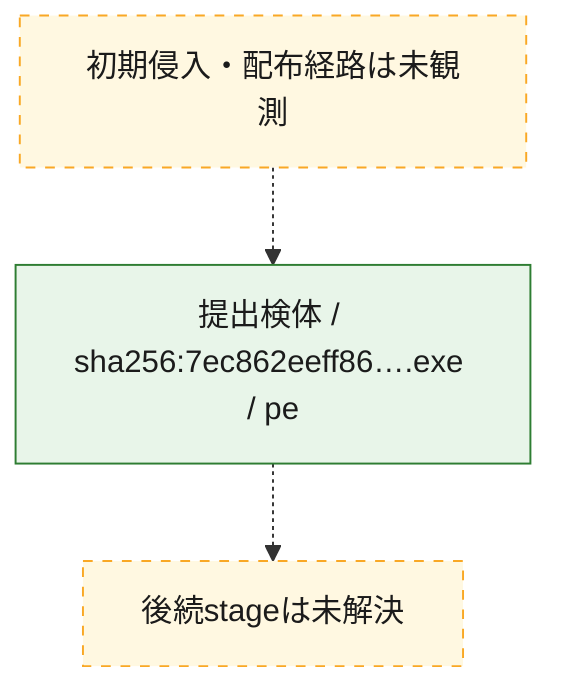
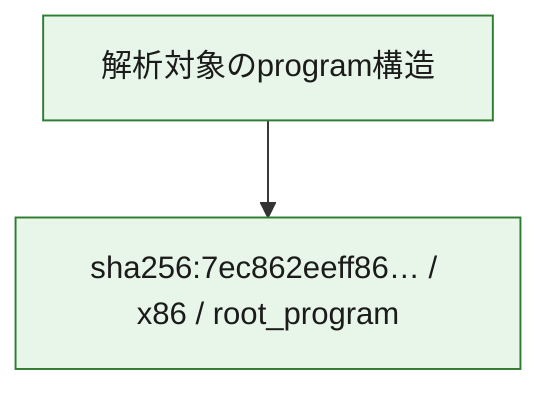

# 全体ロジック：7ec862eeff86921c9f7c591820ca0780576d6ce13f4ddc1e690cc8342e0145cc

代表関数の静的証跡から、起動・初期化、解析回避・環境判定、process・memory操作、通信の処理群を確認しました。

## 読み方

- phaseの掲載順は解析上の整理順です。observed_call_edgesがない段階間の実行順を断定しません。
- 図の実線は静的に観測した関係、点線と黄色のノードは未観測・未解決の関係を示します。
- 図は静的な要約であり、動的実行を再現するものではありません。
- 詳細な関数解説とfingerprintは[STATIC-LOGIC.md](STATIC-LOGIC.md)を参照してください。

## 静的可視化

### 実行フロー

### 感染チェーン

### モジュール関係

## 処理段階

### 1. 起動・初期化

entry pointから初期化と後続処理への移行を確認します。
確度: `confirmed_static_function_evidence`

- `7ec862eeff86921c9f7c591820ca0780576d6ce13f4ddc1e690cc8342e0145cc:ghidra:00402b07` — 初期化と主要処理への分岐を行う入口関数です。 状態: `succeeded`、選定理由: `call_graph_centrality:in=0,out=2`, `entry_point`, `meaningful_symbol_name`, `reviewed_call_centrality:2`, `role:entrypoint`, `small_program_complete_context`

### 2. 解析回避・環境判定

debugger、sandbox、仮想環境、時間差などの判定を確認します。
確度: `confirmed_static_function_evidence`

- `7ec862eeff86921c9f7c591820ca0780576d6ce13f4ddc1e690cc8342e0145cc:ghidra:00402e88` — debugger、仮想環境、sandbox、または時間差の確認に関係する関数です。 状態: `succeeded`、選定理由: `call_graph_centrality:in=1,out=5`, `reviewed_call_centrality:11`, `reviewed_call_centrality:6`, `role:anti_analysis`, `small_program_complete_context`

### 3. process・memory操作

process、thread、module、memory操作と実行移行を確認します。
確度: `confirmed_static_function_evidence`

- `7ec862eeff86921c9f7c591820ca0780576d6ce13f4ddc1e690cc8342e0145cc:ghidra:00402430` — process、thread、module、またはmemory操作に関係する関数です。 状態: `succeeded`、選定理由: `call_graph_centrality:in=0,out=17`, `large_function:instructions=155`, `reviewed_call_centrality:17`, `reviewed_call_centrality:26`, `role:process_or_memory_operation`, `small_program_complete_context`
- `7ec862eeff86921c9f7c591820ca0780576d6ce13f4ddc1e690cc8342e0145cc:ghidra:00402690` — process、thread、module、またはmemory操作に関係する関数です。 状態: `succeeded`、選定理由: `call_graph_centrality:in=1,out=12`, `large_function:instructions=68`, `reviewed_call_centrality:14`, `reviewed_call_centrality:23`, `role:process_or_memory_operation`, `small_program_complete_context`

### 4. 通信

通信初期化、endpoint処理、送受信の役割を確認します。
確度: `confirmed_static_function_evidence`

- `7ec862eeff86921c9f7c591820ca0780576d6ce13f4ddc1e690cc8342e0145cc:ghidra:004010d0` — 通信初期化、送受信、またはendpoint処理に関係する関数です。 状態: `succeeded`、選定理由: `call_graph_centrality:in=1,out=4`, `reviewed_call_centrality:5`, `reviewed_call_centrality:6`, `role:network_communication`, `small_program_complete_context`
- `7ec862eeff86921c9f7c591820ca0780576d6ce13f4ddc1e690cc8342e0145cc:ghidra:00401150` — 通信初期化、送受信、またはendpoint処理に関係する関数です。 状態: `succeeded`、選定理由: `call_graph_centrality:in=1,out=2`, `reviewed_call_centrality:3`, `reviewed_call_centrality:5`, `role:network_communication`, `small_program_complete_context`
- `7ec862eeff86921c9f7c591820ca0780576d6ce13f4ddc1e690cc8342e0145cc:ghidra:00401190` — 通信初期化、送受信、またはendpoint処理に関係する関数です。 状態: `succeeded`、選定理由: `call_graph_centrality:in=1,out=2`, `reviewed_call_centrality:4`, `role:network_communication`, `small_program_complete_context`
- `7ec862eeff86921c9f7c591820ca0780576d6ce13f4ddc1e690cc8342e0145cc:ghidra:00401470` — 通信初期化、送受信、またはendpoint処理に関係する関数です。 状態: `succeeded`、選定理由: `call_graph_centrality:in=2,out=2`, `reviewed_call_centrality:4`, `reviewed_call_centrality:6`, `role:network_communication`, `small_program_complete_context`
- `7ec862eeff86921c9f7c591820ca0780576d6ce13f4ddc1e690cc8342e0145cc:ghidra:00401710` — 通信初期化、送受信、またはendpoint処理に関係する関数です。 状態: `succeeded`、選定理由: `call_graph_centrality:in=1,out=4`, `reviewed_call_centrality:5`, `reviewed_call_centrality:8`, `role:network_communication`, `small_program_complete_context`
- `7ec862eeff86921c9f7c591820ca0780576d6ce13f4ddc1e690cc8342e0145cc:ghidra:00401790` — 通信初期化、送受信、またはendpoint処理に関係する関数です。 状態: `succeeded`、選定理由: `call_graph_centrality:in=1,out=4`, `reviewed_call_centrality:6`, `role:network_communication`, `small_program_complete_context`
- `7ec862eeff86921c9f7c591820ca0780576d6ce13f4ddc1e690cc8342e0145cc:ghidra:00401800` — 通信初期化、送受信、またはendpoint処理に関係する関数です。 状態: `succeeded`、選定理由: `call_graph_centrality:in=1,out=7`, `large_function:instructions=71`, `reviewed_call_centrality:13`, `reviewed_call_centrality:8`, `role:network_communication`, `small_program_complete_context`
- `7ec862eeff86921c9f7c591820ca0780576d6ce13f4ddc1e690cc8342e0145cc:ghidra:00401900` — 通信初期化、送受信、またはendpoint処理に関係する関数です。 状態: `succeeded`、選定理由: `call_graph_centrality:in=1,out=8`, `large_function:instructions=86`, `reviewed_call_centrality:16`, `reviewed_call_centrality:9`, `role:network_communication`, `small_program_complete_context`
- `7ec862eeff86921c9f7c591820ca0780576d6ce13f4ddc1e690cc8342e0145cc:ghidra:00401a10` — 通信初期化、送受信、またはendpoint処理に関係する関数です。 状態: `succeeded`、選定理由: `call_graph_centrality:in=1,out=20`, `large_function:instructions=595`, `reviewed_call_centrality:28`, `reviewed_call_centrality:29`, `role:network_communication`, `small_program_complete_context`

### 5. 補助処理

主要処理を支える一般内部関数またはlibrary処理を確認します。
確度: `confirmed_static_function_evidence`

- `7ec862eeff86921c9f7c591820ca0780576d6ce13f4ddc1e690cc8342e0145cc:ghidra:00401000` — 検体内部の一般処理を実装する関数です。 状態: `succeeded`、選定理由: `call_graph_centrality:in=1,out=1`, `reviewed_call_centrality:2`, `small_program_complete_context`
- `7ec862eeff86921c9f7c591820ca0780576d6ce13f4ddc1e690cc8342e0145cc:ghidra:00401030` — 検体内部の一般処理を実装する関数です。 状態: `succeeded`、選定理由: `call_graph_centrality:in=1,out=1`, `reviewed_call_centrality:2`, `small_program_complete_context`
- `7ec862eeff86921c9f7c591820ca0780576d6ce13f4ddc1e690cc8342e0145cc:ghidra:004011f0` — 検体内部の一般処理を実装する関数です。 状態: `succeeded`、選定理由: `call_graph_centrality:in=1,out=1`, `reviewed_call_centrality:2`, `reviewed_call_centrality:3`, `small_program_complete_context`
- `7ec862eeff86921c9f7c591820ca0780576d6ce13f4ddc1e690cc8342e0145cc:ghidra:00401260` — 検体内部の一般処理を実装する関数です。 状態: `succeeded`、選定理由: `call_graph_centrality:in=1,out=1`, `large_function:instructions=65`, `reviewed_call_centrality:3`, `small_program_complete_context`
- `7ec862eeff86921c9f7c591820ca0780576d6ce13f4ddc1e690cc8342e0145cc:ghidra:00401350` — 検体内部の一般処理を実装する関数です。 状態: `succeeded`、選定理由: `call_graph_centrality:in=1,out=4`, `reviewed_call_centrality:5`, `reviewed_call_centrality:6`, `small_program_complete_context`
- `7ec862eeff86921c9f7c591820ca0780576d6ce13f4ddc1e690cc8342e0145cc:ghidra:004013c0` — 検体内部の一般処理を実装する関数です。 状態: `succeeded`、選定理由: `call_graph_centrality:in=1,out=1`, `reviewed_call_centrality:2`, `small_program_complete_context`
- `7ec862eeff86921c9f7c591820ca0780576d6ce13f4ddc1e690cc8342e0145cc:ghidra:00401430` — 検体内部の一般処理を実装する関数です。 状態: `succeeded`、選定理由: `call_graph_centrality:in=2,out=0`, `reviewed_call_centrality:2`, `small_program_complete_context`
- `7ec862eeff86921c9f7c591820ca0780576d6ce13f4ddc1e690cc8342e0145cc:ghidra:004014c0` — 検体内部の一般処理を実装する関数です。 状態: `succeeded`、選定理由: `call_graph_centrality:in=1,out=5`, `large_function:instructions=156`, `reviewed_call_centrality:11`, `reviewed_call_centrality:6`, `small_program_complete_context`
- `7ec862eeff86921c9f7c591820ca0780576d6ce13f4ddc1e690cc8342e0145cc:ghidra:004018e0` — 検体内部の一般処理を実装する関数です。 状態: `succeeded`、選定理由: `call_graph_centrality:in=2,out=1`, `reviewed_call_centrality:3`, `small_program_complete_context`
- `7ec862eeff86921c9f7c591820ca0780576d6ce13f4ddc1e690cc8342e0145cc:ghidra:004022e0` — 検体内部の一般処理を実装する関数です。 状態: `succeeded`、選定理由: `call_graph_centrality:in=1,out=1`, `reviewed_call_centrality:2`, `small_program_complete_context`
- `7ec862eeff86921c9f7c591820ca0780576d6ce13f4ddc1e690cc8342e0145cc:ghidra:00402300` — 検体内部の一般処理を実装する関数です。 状態: `succeeded`、選定理由: `call_graph_centrality:in=0,out=12`, `large_function:instructions=77`, `reviewed_call_centrality:12`, `reviewed_call_centrality:14`, `small_program_complete_context`
- `7ec862eeff86921c9f7c591820ca0780576d6ce13f4ddc1e690cc8342e0145cc:ghidra:00402847` — 検体内部の一般処理を実装する関数です。 状態: `succeeded`、選定理由: `call_graph_centrality:in=1,out=14`, `large_function:instructions=136`, `reviewed_call_centrality:15`, `reviewed_call_centrality:22`, `small_program_complete_context`
- `7ec862eeff86921c9f7c591820ca0780576d6ce13f4ddc1e690cc8342e0145cc:ghidra:00402c80` — 検体内部の一般処理を実装する関数です。 状態: `succeeded`、選定理由: `call_graph_centrality:in=1,out=0`, `reviewed_call_centrality:1`, `small_program_complete_context`
- `7ec862eeff86921c9f7c591820ca0780576d6ce13f4ddc1e690cc8342e0145cc:ghidra:00402cc0` — 検体内部の一般処理を実装する関数です。 状態: `succeeded`、選定理由: `call_graph_centrality:in=1,out=0`, `reviewed_call_centrality:1`, `small_program_complete_context`
- `7ec862eeff86921c9f7c591820ca0780576d6ce13f4ddc1e690cc8342e0145cc:ghidra:00402d10` — 検体内部の一般処理を実装する関数です。 状態: `succeeded`、選定理由: `call_graph_centrality:in=1,out=2`, `reviewed_call_centrality:3`, `reviewed_call_centrality:4`, `small_program_complete_context`
- `7ec862eeff86921c9f7c591820ca0780576d6ce13f4ddc1e690cc8342e0145cc:ghidra:00402ddc` — 検体内部の一般処理を実装する関数です。 状態: `succeeded`、選定理由: `call_graph_centrality:in=1,out=0`, `reviewed_call_centrality:1`, `small_program_complete_context`
- `7ec862eeff86921c9f7c591820ca0780576d6ce13f4ddc1e690cc8342e0145cc:ghidra:00402e21` — compiler生成処理または汎用library処理とみられる関数です。 状態: `succeeded`、選定理由: `call_graph_centrality:in=1,out=0`, `meaningful_symbol_name`, `reviewed_call_centrality:1`, `small_program_complete_context`
- `7ec862eeff86921c9f7c591820ca0780576d6ce13f4ddc1e690cc8342e0145cc:ghidra:00402e35` — 検体内部の一般処理を実装する関数です。 状態: `succeeded`、選定理由: `call_graph_centrality:in=0,out=1`, `reviewed_call_centrality:1`, `small_program_complete_context`

## 観測したcall関係

- `7ec862eeff86921c9f7c591820ca0780576d6ce13f4ddc1e690cc8342e0145cc:ghidra:004010d0` → `7ec862eeff86921c9f7c591820ca0780576d6ce13f4ddc1e690cc8342e0145cc:ghidra:00401470` （`communication` → `communication`）
- `7ec862eeff86921c9f7c591820ca0780576d6ce13f4ddc1e690cc8342e0145cc:ghidra:00401190` → `7ec862eeff86921c9f7c591820ca0780576d6ce13f4ddc1e690cc8342e0145cc:ghidra:00401260` （`communication` → `support`）
- `7ec862eeff86921c9f7c591820ca0780576d6ce13f4ddc1e690cc8342e0145cc:ghidra:00401710` → `7ec862eeff86921c9f7c591820ca0780576d6ce13f4ddc1e690cc8342e0145cc:ghidra:00401470` （`communication` → `communication`）
- `7ec862eeff86921c9f7c591820ca0780576d6ce13f4ddc1e690cc8342e0145cc:ghidra:00401790` → `7ec862eeff86921c9f7c591820ca0780576d6ce13f4ddc1e690cc8342e0145cc:ghidra:00401710` （`communication` → `communication`）
- `7ec862eeff86921c9f7c591820ca0780576d6ce13f4ddc1e690cc8342e0145cc:ghidra:00401800` → `7ec862eeff86921c9f7c591820ca0780576d6ce13f4ddc1e690cc8342e0145cc:ghidra:00401430` （`communication` → `support`）
- `7ec862eeff86921c9f7c591820ca0780576d6ce13f4ddc1e690cc8342e0145cc:ghidra:00401800` → `7ec862eeff86921c9f7c591820ca0780576d6ce13f4ddc1e690cc8342e0145cc:ghidra:004018e0` （`communication` → `support`）
- `7ec862eeff86921c9f7c591820ca0780576d6ce13f4ddc1e690cc8342e0145cc:ghidra:00401a10` → `7ec862eeff86921c9f7c591820ca0780576d6ce13f4ddc1e690cc8342e0145cc:ghidra:004010d0` （`communication` → `communication`）
- `7ec862eeff86921c9f7c591820ca0780576d6ce13f4ddc1e690cc8342e0145cc:ghidra:00401a10` → `7ec862eeff86921c9f7c591820ca0780576d6ce13f4ddc1e690cc8342e0145cc:ghidra:00401150` （`communication` → `communication`）
- `7ec862eeff86921c9f7c591820ca0780576d6ce13f4ddc1e690cc8342e0145cc:ghidra:00401a10` → `7ec862eeff86921c9f7c591820ca0780576d6ce13f4ddc1e690cc8342e0145cc:ghidra:00401190` （`communication` → `communication`）
- `7ec862eeff86921c9f7c591820ca0780576d6ce13f4ddc1e690cc8342e0145cc:ghidra:00401a10` → `7ec862eeff86921c9f7c591820ca0780576d6ce13f4ddc1e690cc8342e0145cc:ghidra:004011f0` （`communication` → `support`）
- `7ec862eeff86921c9f7c591820ca0780576d6ce13f4ddc1e690cc8342e0145cc:ghidra:00401a10` → `7ec862eeff86921c9f7c591820ca0780576d6ce13f4ddc1e690cc8342e0145cc:ghidra:00401350` （`communication` → `support`）
- `7ec862eeff86921c9f7c591820ca0780576d6ce13f4ddc1e690cc8342e0145cc:ghidra:00401a10` → `7ec862eeff86921c9f7c591820ca0780576d6ce13f4ddc1e690cc8342e0145cc:ghidra:004013c0` （`communication` → `support`）
- `7ec862eeff86921c9f7c591820ca0780576d6ce13f4ddc1e690cc8342e0145cc:ghidra:00401a10` → `7ec862eeff86921c9f7c591820ca0780576d6ce13f4ddc1e690cc8342e0145cc:ghidra:004014c0` （`communication` → `support`）
- `7ec862eeff86921c9f7c591820ca0780576d6ce13f4ddc1e690cc8342e0145cc:ghidra:00401a10` → `7ec862eeff86921c9f7c591820ca0780576d6ce13f4ddc1e690cc8342e0145cc:ghidra:004022e0` （`communication` → `support`）
- `7ec862eeff86921c9f7c591820ca0780576d6ce13f4ddc1e690cc8342e0145cc:ghidra:00402300` → `7ec862eeff86921c9f7c591820ca0780576d6ce13f4ddc1e690cc8342e0145cc:ghidra:00401430` （`support` → `support`）
- `7ec862eeff86921c9f7c591820ca0780576d6ce13f4ddc1e690cc8342e0145cc:ghidra:00402300` → `7ec862eeff86921c9f7c591820ca0780576d6ce13f4ddc1e690cc8342e0145cc:ghidra:004018e0` （`support` → `support`）
- `7ec862eeff86921c9f7c591820ca0780576d6ce13f4ddc1e690cc8342e0145cc:ghidra:00402300` → `7ec862eeff86921c9f7c591820ca0780576d6ce13f4ddc1e690cc8342e0145cc:ghidra:00401a10` （`support` → `communication`）
- `7ec862eeff86921c9f7c591820ca0780576d6ce13f4ddc1e690cc8342e0145cc:ghidra:00402430` → `7ec862eeff86921c9f7c591820ca0780576d6ce13f4ddc1e690cc8342e0145cc:ghidra:00401000` （`execution` → `support`）
- `7ec862eeff86921c9f7c591820ca0780576d6ce13f4ddc1e690cc8342e0145cc:ghidra:00402430` → `7ec862eeff86921c9f7c591820ca0780576d6ce13f4ddc1e690cc8342e0145cc:ghidra:00401800` （`execution` → `communication`）
- `7ec862eeff86921c9f7c591820ca0780576d6ce13f4ddc1e690cc8342e0145cc:ghidra:00402430` → `7ec862eeff86921c9f7c591820ca0780576d6ce13f4ddc1e690cc8342e0145cc:ghidra:00401900` （`execution` → `communication`）
- `7ec862eeff86921c9f7c591820ca0780576d6ce13f4ddc1e690cc8342e0145cc:ghidra:00402690` → `7ec862eeff86921c9f7c591820ca0780576d6ce13f4ddc1e690cc8342e0145cc:ghidra:00401030` （`execution` → `support`）
- `7ec862eeff86921c9f7c591820ca0780576d6ce13f4ddc1e690cc8342e0145cc:ghidra:00402690` → `7ec862eeff86921c9f7c591820ca0780576d6ce13f4ddc1e690cc8342e0145cc:ghidra:00401790` （`execution` → `communication`）
- `7ec862eeff86921c9f7c591820ca0780576d6ce13f4ddc1e690cc8342e0145cc:ghidra:00402847` → `7ec862eeff86921c9f7c591820ca0780576d6ce13f4ddc1e690cc8342e0145cc:ghidra:00402690` （`support` → `execution`）
- `7ec862eeff86921c9f7c591820ca0780576d6ce13f4ddc1e690cc8342e0145cc:ghidra:00402847` → `7ec862eeff86921c9f7c591820ca0780576d6ce13f4ddc1e690cc8342e0145cc:ghidra:00402d10` （`support` → `support`）
- `7ec862eeff86921c9f7c591820ca0780576d6ce13f4ddc1e690cc8342e0145cc:ghidra:00402847` → `7ec862eeff86921c9f7c591820ca0780576d6ce13f4ddc1e690cc8342e0145cc:ghidra:00402ddc` （`support` → `support`）
- `7ec862eeff86921c9f7c591820ca0780576d6ce13f4ddc1e690cc8342e0145cc:ghidra:00402847` → `7ec862eeff86921c9f7c591820ca0780576d6ce13f4ddc1e690cc8342e0145cc:ghidra:00402e21` （`support` → `support`）
- `7ec862eeff86921c9f7c591820ca0780576d6ce13f4ddc1e690cc8342e0145cc:ghidra:00402b07` → `7ec862eeff86921c9f7c591820ca0780576d6ce13f4ddc1e690cc8342e0145cc:ghidra:00402847` （`startup` → `support`）
- `7ec862eeff86921c9f7c591820ca0780576d6ce13f4ddc1e690cc8342e0145cc:ghidra:00402b07` → `7ec862eeff86921c9f7c591820ca0780576d6ce13f4ddc1e690cc8342e0145cc:ghidra:00402e88` （`startup` → `evasion`）
- `7ec862eeff86921c9f7c591820ca0780576d6ce13f4ddc1e690cc8342e0145cc:ghidra:00402d10` → `7ec862eeff86921c9f7c591820ca0780576d6ce13f4ddc1e690cc8342e0145cc:ghidra:00402c80` （`support` → `support`）
- `7ec862eeff86921c9f7c591820ca0780576d6ce13f4ddc1e690cc8342e0145cc:ghidra:00402d10` → `7ec862eeff86921c9f7c591820ca0780576d6ce13f4ddc1e690cc8342e0145cc:ghidra:00402cc0` （`support` → `support`）
- `ghidra-function:0407510317acc2f51f01e286` → `ghidra-external:f36bc1a1d6c4cf5167fbeedb` （`unclassified` → `unclassified`）
- `ghidra-function:0407510317acc2f51f01e286` → `ghidra-function:16abf70ff71eb63ff5524f42` （`unclassified` → `unclassified`）
- `ghidra-function:0407510317acc2f51f01e286` → `ghidra-function:1951b1688508ec3688780c59` （`unclassified` → `unclassified`）
- `ghidra-function:0407510317acc2f51f01e286` → `ghidra-function:3404e782057a4fd1a8451972` （`unclassified` → `unclassified`）
- `ghidra-function:0407510317acc2f51f01e286` → `ghidra-function:4b7ff59c1e9bba946898862c` （`unclassified` → `unclassified`）
- `ghidra-function:0407510317acc2f51f01e286` → `ghidra-function:6621a3d86a0938482577577a` （`unclassified` → `unclassified`）
- `ghidra-function:0407510317acc2f51f01e286` → `ghidra-function:6ab3efc96db8ad82d1137ade` （`unclassified` → `unclassified`）
- `ghidra-function:0407510317acc2f51f01e286` → `ghidra-function:6b74ca80fac1e3c125927b68` （`unclassified` → `unclassified`）
- `ghidra-function:0407510317acc2f51f01e286` → `ghidra-function:745526531b7e69741e78e07b` （`unclassified` → `unclassified`）
- `ghidra-function:0407510317acc2f51f01e286` → `ghidra-function:95cccbe9dcc67c65b9c38273` （`unclassified` → `unclassified`）
- `ghidra-function:0407510317acc2f51f01e286` → `ghidra-function:bc7f0e719a091c5aa89356b9` （`unclassified` → `unclassified`）
- `ghidra-function:0407510317acc2f51f01e286` → `ghidra-function:ce14ea1c2a25077d01b17dfe` （`unclassified` → `unclassified`）
- `ghidra-function:0407510317acc2f51f01e286` → `ghidra-function:f593d4261aa02cc22b417fef` （`unclassified` → `unclassified`）
- `ghidra-function:0614a4fd05856572a02dd069` → `ghidra-external:e9b5f3d02eaa5b2a9f7afcce` （`unclassified` → `unclassified`）
- `ghidra-function:0614a4fd05856572a02dd069` → `ghidra-function:3903ad1fe884fe909cf3409f` （`unclassified` → `unclassified`）
- `ghidra-function:0614a4fd05856572a02dd069` → `ghidra-function:ea08ce67f9981726bcd5fc82` （`unclassified` → `unclassified`）
- `ghidra-function:0a5c0d78f74aaffaa032b88f` → `ghidra-function:0e3cc7af1862c6fefb5840d3` （`unclassified` → `unclassified`）
- `ghidra-function:0a5c0d78f74aaffaa032b88f` → `ghidra-function:16abf70ff71eb63ff5524f42` （`unclassified` → `unclassified`）
- `ghidra-function:0a5c0d78f74aaffaa032b88f` → `ghidra-function:1bf7d1b08be7b1bcf7752804` （`unclassified` → `unclassified`）
- `ghidra-function:0a5c0d78f74aaffaa032b88f` → `ghidra-function:1e06794c46924562f3db0ac7` （`unclassified` → `unclassified`）
- `ghidra-function:0a5c0d78f74aaffaa032b88f` → `ghidra-function:3d7a625bea82970601ae2dba` （`unclassified` → `unclassified`）
- `ghidra-function:0a5c0d78f74aaffaa032b88f` → `ghidra-function:4b7ff59c1e9bba946898862c` （`unclassified` → `unclassified`）
- `ghidra-function:0a5c0d78f74aaffaa032b88f` → `ghidra-function:619acd16f2fb8b0553c66eed` （`unclassified` → `unclassified`）
- `ghidra-function:0a5c0d78f74aaffaa032b88f` → `ghidra-function:6ab3efc96db8ad82d1137ade` （`unclassified` → `unclassified`）
- `ghidra-function:0a5c0d78f74aaffaa032b88f` → `ghidra-function:7e50d618e2ee19c7b584e7c4` （`unclassified` → `unclassified`）
- `ghidra-function:0a5c0d78f74aaffaa032b88f` → `ghidra-function:85a75b7bf4f4831f38605762` （`unclassified` → `unclassified`）
- `ghidra-function:0a5c0d78f74aaffaa032b88f` → `ghidra-function:900e7f736d47bac1d46c6db5` （`unclassified` → `unclassified`）
- `ghidra-function:0a5c0d78f74aaffaa032b88f` → `ghidra-function:95cccbe9dcc67c65b9c38273` （`unclassified` → `unclassified`）
- `ghidra-function:0a5c0d78f74aaffaa032b88f` → `ghidra-function:a695304c9a5b65e808a482e5` （`unclassified` → `unclassified`）
- `ghidra-function:0a5c0d78f74aaffaa032b88f` → `ghidra-function:ab796b8871dfc56095e1f701` （`unclassified` → `unclassified`）
- `ghidra-function:0a5c0d78f74aaffaa032b88f` → `ghidra-function:bc7f0e719a091c5aa89356b9` （`unclassified` → `unclassified`）
- `ghidra-function:0a5c0d78f74aaffaa032b88f` → `ghidra-function:cadbab1411131af858fe3a2b` （`unclassified` → `unclassified`）
- `ghidra-function:0a5c0d78f74aaffaa032b88f` → `ghidra-function:f9ae76874d5bf412d6d269c6` （`unclassified` → `unclassified`）
- `ghidra-function:125f84bc21997982a80e2fd6` → `ghidra-function:a013554af6a477ad11442cfd` （`unclassified` → `unclassified`）
- `ghidra-function:125f84bc21997982a80e2fd6` → `ghidra-function:e2f7acf5dd511204ddcddcae` （`unclassified` → `unclassified`）
- `ghidra-function:1c5a88bb7b9a2308a9aaad06` → `ghidra-function:6f717b25b7ed4dbbc71ccc88` （`unclassified` → `unclassified`）
- `ghidra-function:23924afe99dc1ff7d09d2102` → `ghidra-function:0407510317acc2f51f01e286` （`unclassified` → `unclassified`）
- `ghidra-function:23924afe99dc1ff7d09d2102` → `ghidra-function:101a4570ea190799b43d2492` （`unclassified` → `unclassified`）
- `ghidra-function:23924afe99dc1ff7d09d2102` → `ghidra-function:16abf70ff71eb63ff5524f42` （`unclassified` → `unclassified`）
- `ghidra-function:23924afe99dc1ff7d09d2102` → `ghidra-function:1cfa76763f330d1a1d259f01` （`unclassified` → `unclassified`）
- `ghidra-function:23924afe99dc1ff7d09d2102` → `ghidra-function:2224341c70647e2982063c46` （`unclassified` → `unclassified`）
- `ghidra-function:23924afe99dc1ff7d09d2102` → `ghidra-function:625e1b994d86944792bad63b` （`unclassified` → `unclassified`）
- `ghidra-function:23924afe99dc1ff7d09d2102` → `ghidra-function:a3242df548e9d2186dfacba4` （`unclassified` → `unclassified`）
- `ghidra-function:23924afe99dc1ff7d09d2102` → `ghidra-function:bbab1b382e73d8c47fdee24d` （`unclassified` → `unclassified`）
- `ghidra-function:23924afe99dc1ff7d09d2102` → `ghidra-function:ce5cc8e3003dc514f6cc5fdc` （`unclassified` → `unclassified`）
- `ghidra-function:23924afe99dc1ff7d09d2102` → `ghidra-function:cfb74b386bb4ee8d2760bfcb` （`unclassified` → `unclassified`）
- `ghidra-function:23924afe99dc1ff7d09d2102` → `ghidra-function:e67cc680e02d765f5544f38f` （`unclassified` → `unclassified`）
- `ghidra-function:23924afe99dc1ff7d09d2102` → `ghidra-function:f02ba233240058d595ddd20b` （`unclassified` → `unclassified`）
- `ghidra-function:23924afe99dc1ff7d09d2102` → `ghidra-function:f0b346a31d80ebf6982d36a6` （`unclassified` → `unclassified`）
- `ghidra-function:23924afe99dc1ff7d09d2102` → `ghidra-function:fd021261d0b25b7e92421c12` （`unclassified` → `unclassified`）
- `ghidra-function:27c61bf3aee89d7096668c29` → `ghidra-function:1e06794c46924562f3db0ac7` （`unclassified` → `unclassified`）
- `ghidra-function:27c61bf3aee89d7096668c29` → `ghidra-function:342b3d72339fda15f8362a78` （`unclassified` → `unclassified`）
- `ghidra-function:27c61bf3aee89d7096668c29` → `ghidra-function:78b5265253b1e5a27bc4a474` （`unclassified` → `unclassified`）
- `ghidra-function:27c61bf3aee89d7096668c29` → `ghidra-function:945e301dffc4821dedb9c79c` （`unclassified` → `unclassified`）
- `ghidra-function:27c61bf3aee89d7096668c29` → `ghidra-function:d5537ad325ce87682056621d` （`unclassified` → `unclassified`）
- `ghidra-function:2943503305ac5fc8ba02e409` → `ghidra-function:23924afe99dc1ff7d09d2102` （`unclassified` → `unclassified`）
- `ghidra-function:2943503305ac5fc8ba02e409` → `ghidra-function:27c61bf3aee89d7096668c29` （`unclassified` → `unclassified`）
- `ghidra-function:32b8a39a9dea63cbb14990ec` → `ghidra-function:21327e20a623940fa0b14ec7` （`unclassified` → `unclassified`）
- `ghidra-function:32b8a39a9dea63cbb14990ec` → `ghidra-function:668a3b0852a5f96e28fc50f8` （`unclassified` → `unclassified`）
- `ghidra-function:32b8a39a9dea63cbb14990ec` → `ghidra-function:78a84982eb144be0e00f69c4` （`unclassified` → `unclassified`）
- `ghidra-function:32b8a39a9dea63cbb14990ec` → `ghidra-function:cbff91cf8b1d6a23f43bf185` （`unclassified` → `unclassified`）
- `ghidra-function:3903ad1fe884fe909cf3409f` → `ghidra-external:f36bc1a1d6c4cf5167fbeedb` （`unclassified` → `unclassified`）
- `ghidra-function:3903ad1fe884fe909cf3409f` → `ghidra-function:0ad79110024d839047677ac5` （`unclassified` → `unclassified`）
- `ghidra-function:3d7a625bea82970601ae2dba` → `ghidra-function:ab796b8871dfc56095e1f701` （`unclassified` → `unclassified`）
- `ghidra-function:56d1ec7b1f3da5e9da9f6411` → `ghidra-function:0afb790814e68be78a385366` （`unclassified` → `unclassified`）
- `ghidra-function:56d1ec7b1f3da5e9da9f6411` → `ghidra-function:1951b1688508ec3688780c59` （`unclassified` → `unclassified`）
- `ghidra-function:56d1ec7b1f3da5e9da9f6411` → `ghidra-function:b6dd05fae3cf1ae4d4b6a6ec` （`unclassified` → `unclassified`）
- `ghidra-function:56d1ec7b1f3da5e9da9f6411` → `ghidra-function:e551c6d6ccd52740c6697515` （`unclassified` → `unclassified`）
- `ghidra-function:56d1ec7b1f3da5e9da9f6411` → `ghidra-function:f3503f471cee3c597e3e3b99` （`unclassified` → `unclassified`）
- `ghidra-function:619acd16f2fb8b0553c66eed` → `ghidra-function:13bffe02b6a4bfbe1f41eb21` （`unclassified` → `unclassified`）
- `ghidra-function:619acd16f2fb8b0553c66eed` → `ghidra-function:1951b1688508ec3688780c59` （`unclassified` → `unclassified`）
- `ghidra-function:619acd16f2fb8b0553c66eed` → `ghidra-function:2d7d9bf49e956a8ae301a750` （`unclassified` → `unclassified`）
- `ghidra-function:619acd16f2fb8b0553c66eed` → `ghidra-function:2db1ca9c861ffc9075ea910f` （`unclassified` → `unclassified`）
- `ghidra-function:619acd16f2fb8b0553c66eed` → `ghidra-function:7e9cfc4d31f19f68f3966988` （`unclassified` → `unclassified`）
- `ghidra-function:619acd16f2fb8b0553c66eed` → `ghidra-function:901e4efd0150fcab0a566d7c` （`unclassified` → `unclassified`）
- `ghidra-function:619acd16f2fb8b0553c66eed` → `ghidra-function:9afc1afd3dc2bece4d8a7675` （`unclassified` → `unclassified`）
- `ghidra-function:6621a3d86a0938482577577a` → `ghidra-function:70e9cd5c4251f755b25d3b53` （`unclassified` → `unclassified`）
- `ghidra-function:750e53c5087dfb22f151541e` → `ghidra-function:ab796b8871dfc56095e1f701` （`unclassified` → `unclassified`）
- `ghidra-function:78a84982eb144be0e00f69c4` → `ghidra-function:135f5b1992536494c55e8b29` （`unclassified` → `unclassified`）
- `ghidra-function:78a84982eb144be0e00f69c4` → `ghidra-function:5963a16439a3f9173c1e8582` （`unclassified` → `unclassified`）
- `ghidra-function:7e50d618e2ee19c7b584e7c4` → `ghidra-function:2718ccfceeb028c27aadcd4d` （`unclassified` → `unclassified`）
- `ghidra-function:7e50d618e2ee19c7b584e7c4` → `ghidra-function:2db1ca9c861ffc9075ea910f` （`unclassified` → `unclassified`）
- `ghidra-function:7e50d618e2ee19c7b584e7c4` → `ghidra-function:3b3126218349af97b11c1009` （`unclassified` → `unclassified`）
- `ghidra-function:7e50d618e2ee19c7b584e7c4` → `ghidra-function:400952e11579cd0f3fee2aa6` （`unclassified` → `unclassified`）
- `ghidra-function:7e50d618e2ee19c7b584e7c4` → `ghidra-function:4f08588057249a380c71ff08` （`unclassified` → `unclassified`）
- `ghidra-function:7e50d618e2ee19c7b584e7c4` → `ghidra-function:6bb330e2b7fb40f1f1dbc7dc` （`unclassified` → `unclassified`）
- `ghidra-function:7e50d618e2ee19c7b584e7c4` → `ghidra-function:7e9cfc4d31f19f68f3966988` （`unclassified` → `unclassified`）
- `ghidra-function:7e50d618e2ee19c7b584e7c4` → `ghidra-function:f3dd7b4e900a55c923bdaec9` （`unclassified` → `unclassified`）
- `ghidra-function:8037b1f69173e199209d8f55` → `ghidra-function:1bf7d1b08be7b1bcf7752804` （`unclassified` → `unclassified`）
- `ghidra-function:8037b1f69173e199209d8f55` → `ghidra-function:1e06794c46924562f3db0ac7` （`unclassified` → `unclassified`）
- `ghidra-function:8037b1f69173e199209d8f55` → `ghidra-function:9d17ca936f333351e41ffe87` （`unclassified` → `unclassified`）
- `ghidra-function:8037b1f69173e199209d8f55` → `ghidra-function:ab796b8871dfc56095e1f701` （`unclassified` → `unclassified`）
- `ghidra-function:8561ea97b373dab791bddac0` → `ghidra-function:f2ae9423aadafc1bc4304377` （`unclassified` → `unclassified`）
- `ghidra-function:8f6bc9c0385e33b94a66121f` → `ghidra-external:099c44966056b77f3fb4613e` （`unclassified` → `unclassified`）
- `ghidra-function:8f6bc9c0385e33b94a66121f` → `ghidra-external:55fe06d9dea77d1282148c44` （`unclassified` → `unclassified`）
- `ghidra-function:8f6bc9c0385e33b94a66121f` → `ghidra-external:77b748666209a7ddee9af9dc` （`unclassified` → `unclassified`）
- `ghidra-function:8f6bc9c0385e33b94a66121f` → `ghidra-external:a459c0013a7af9c917391926` （`unclassified` → `unclassified`）
- `ghidra-function:8f6bc9c0385e33b94a66121f` → `ghidra-external:bbc021dd3e2c525301cead79` （`unclassified` → `unclassified`）
- `ghidra-function:8f6bc9c0385e33b94a66121f` → `ghidra-external:c267fbbe8eb8738e4f3bb2fb` （`unclassified` → `unclassified`）
- `ghidra-function:8f6bc9c0385e33b94a66121f` → `ghidra-external:e9b5f3d02eaa5b2a9f7afcce` （`unclassified` → `unclassified`）
- `ghidra-function:8f6bc9c0385e33b94a66121f` → `ghidra-function:0614a4fd05856572a02dd069` （`unclassified` → `unclassified`）
- `ghidra-function:8f6bc9c0385e33b94a66121f` → `ghidra-function:125f84bc21997982a80e2fd6` （`unclassified` → `unclassified`）
- `ghidra-function:8f6bc9c0385e33b94a66121f` → `ghidra-function:16abf70ff71eb63ff5524f42` （`unclassified` → `unclassified`）
- `ghidra-function:8f6bc9c0385e33b94a66121f` → `ghidra-function:1951b1688508ec3688780c59` （`unclassified` → `unclassified`）
- `ghidra-function:8f6bc9c0385e33b94a66121f` → `ghidra-function:1c5a88bb7b9a2308a9aaad06` （`unclassified` → `unclassified`）
- `ghidra-function:8f6bc9c0385e33b94a66121f` → `ghidra-function:21327e20a623940fa0b14ec7` （`unclassified` → `unclassified`）
- `ghidra-function:8f6bc9c0385e33b94a66121f` → `ghidra-function:2718ccfceeb028c27aadcd4d` （`unclassified` → `unclassified`）
- `ghidra-function:8f6bc9c0385e33b94a66121f` → `ghidra-function:426688222865e66a25cfb8bd` （`unclassified` → `unclassified`）
- `ghidra-function:8f6bc9c0385e33b94a66121f` → `ghidra-function:53d1570707a2a1b5c0fe05ab` （`unclassified` → `unclassified`）
- `ghidra-function:8f6bc9c0385e33b94a66121f` → `ghidra-function:56d1ec7b1f3da5e9da9f6411` （`unclassified` → `unclassified`）
- `ghidra-function:8f6bc9c0385e33b94a66121f` → `ghidra-function:668a3b0852a5f96e28fc50f8` （`unclassified` → `unclassified`）
- `ghidra-function:8f6bc9c0385e33b94a66121f` → `ghidra-function:750e53c5087dfb22f151541e` （`unclassified` → `unclassified`）
- `ghidra-function:8f6bc9c0385e33b94a66121f` → `ghidra-function:8037b1f69173e199209d8f55` （`unclassified` → `unclassified`）
- `ghidra-function:8f6bc9c0385e33b94a66121f` → `ghidra-function:85a75b7bf4f4831f38605762` （`unclassified` → `unclassified`）
- `ghidra-function:8f6bc9c0385e33b94a66121f` → `ghidra-function:8756e1521ee52dfc106288e0` （`unclassified` → `unclassified`）
- `ghidra-function:8f6bc9c0385e33b94a66121f` → `ghidra-function:8a488a2075697d92a5d9532b` （`unclassified` → `unclassified`）
- `ghidra-function:8f6bc9c0385e33b94a66121f` → `ghidra-function:8b5a692c13b51819aa8bf1e4` （`unclassified` → `unclassified`）
- `ghidra-function:8f6bc9c0385e33b94a66121f` → `ghidra-function:90fae387b6fe08964ff88e6d` （`unclassified` → `unclassified`）
- `ghidra-function:8f6bc9c0385e33b94a66121f` → `ghidra-function:a7a281cd91b401b6d547c3ff` （`unclassified` → `unclassified`）
- `ghidra-function:8f6bc9c0385e33b94a66121f` → `ghidra-function:ab796b8871dfc56095e1f701` （`unclassified` → `unclassified`）
- `ghidra-function:901e4efd0150fcab0a566d7c` → `ghidra-function:a67292bc6822521eda873c24` （`unclassified` → `unclassified`）
- `ghidra-function:90fae387b6fe08964ff88e6d` → `ghidra-function:ed91791854ad84ad759a3a89` （`unclassified` → `unclassified`）
- `ghidra-function:a7a281cd91b401b6d547c3ff` → `ghidra-function:78a84982eb144be0e00f69c4` （`unclassified` → `unclassified`）
- `ghidra-function:a7a281cd91b401b6d547c3ff` → `ghidra-function:c77861a1c0b6b3a3df5b711e` （`unclassified` → `unclassified`）
- `ghidra-function:a7a281cd91b401b6d547c3ff` → `ghidra-function:cbff91cf8b1d6a23f43bf185` （`unclassified` → `unclassified`）
- `ghidra-function:a7a281cd91b401b6d547c3ff` → `ghidra-function:e2c9f84dc3f04d98c13d530b` （`unclassified` → `unclassified`）
- `ghidra-function:e457a99793aad28be94c7374` → `ghidra-function:13bffe02b6a4bfbe1f41eb21` （`unclassified` → `unclassified`）
- `ghidra-function:e457a99793aad28be94c7374` → `ghidra-function:1bf7d1b08be7b1bcf7752804` （`unclassified` → `unclassified`）
- `ghidra-function:e457a99793aad28be94c7374` → `ghidra-function:1e06794c46924562f3db0ac7` （`unclassified` → `unclassified`）
- `ghidra-function:e457a99793aad28be94c7374` → `ghidra-function:2a2a8587c014afe19abaf1f2` （`unclassified` → `unclassified`）
- `ghidra-function:e457a99793aad28be94c7374` → `ghidra-function:7ebaf149b704e139b79c6214` （`unclassified` → `unclassified`）
- `ghidra-function:e457a99793aad28be94c7374` → `ghidra-function:85a75b7bf4f4831f38605762` （`unclassified` → `unclassified`）
- `ghidra-function:e457a99793aad28be94c7374` → `ghidra-function:8f6bc9c0385e33b94a66121f` （`unclassified` → `unclassified`）
- `ghidra-function:e457a99793aad28be94c7374` → `ghidra-function:901e4efd0150fcab0a566d7c` （`unclassified` → `unclassified`）
- `ghidra-function:e457a99793aad28be94c7374` → `ghidra-function:981ea2f752faab800d391869` （`unclassified` → `unclassified`）
- `ghidra-function:e457a99793aad28be94c7374` → `ghidra-function:ab796b8871dfc56095e1f701` （`unclassified` → `unclassified`）
- `ghidra-function:e457a99793aad28be94c7374` → `ghidra-function:cadbab1411131af858fe3a2b` （`unclassified` → `unclassified`）
- `ghidra-function:e457a99793aad28be94c7374` → `ghidra-function:d3ee43b4ba108de87da28290` （`unclassified` → `unclassified`）
- `ghidra-function:f02ba233240058d595ddd20b` → `ghidra-external:e9b5f3d02eaa5b2a9f7afcce` （`unclassified` → `unclassified`）
- `ghidra-function:f02ba233240058d595ddd20b` → `ghidra-function:3e6ebca190eae69edeaa3297` （`unclassified` → `unclassified`）
- `ghidra-function:f02ba233240058d595ddd20b` → `ghidra-function:660e426c6eb244282b78698c` （`unclassified` → `unclassified`）
- `ghidra-function:f593d4261aa02cc22b417fef` → `ghidra-external:e9b5f3d02eaa5b2a9f7afcce` （`unclassified` → `unclassified`）
- `ghidra-function:f593d4261aa02cc22b417fef` → `ghidra-function:32b8a39a9dea63cbb14990ec` （`unclassified` → `unclassified`）
- `ghidra-function:f593d4261aa02cc22b417fef` → `ghidra-function:8756e1521ee52dfc106288e0` （`unclassified` → `unclassified`）
- `ghidra-function:f593d4261aa02cc22b417fef` → `ghidra-function:c77861a1c0b6b3a3df5b711e` （`unclassified` → `unclassified`）
- `ghidra-function:f593d4261aa02cc22b417fef` → `ghidra-function:e2c9f84dc3f04d98c13d530b` （`unclassified` → `unclassified`）

## 解析範囲と制約

- 選定外関数は全体inventoryへ残しますが、関数本体の個別解説対象にはしていません。
- indirect call、難読化、packer、VM、壊れたcontrol flowによりcall関係が欠落する場合があります。
- 文書は静的解析に基づき、検体実行や外部通信による動的確認は行っていません。
