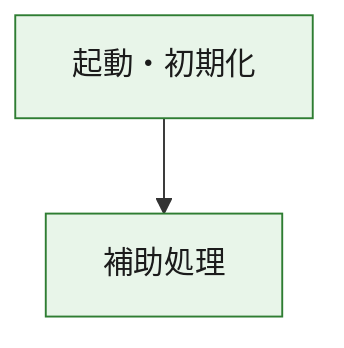
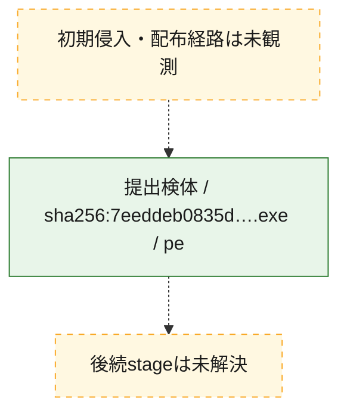
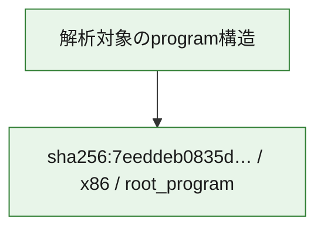

# 全体ロジック：7eeddeb0835d03546d07d2c3590fb4fe5c9cbd4876af2103867b2970b1ba3fa3

代表関数の静的証跡から、起動・初期化の処理群を確認しました。

## 読み方

- phaseの掲載順は解析上の整理順です。observed_call_edgesがない段階間の実行順を断定しません。
- 図の実線は静的に観測した関係、点線と黄色のノードは未観測・未解決の関係を示します。
- 図は静的な要約であり、動的実行を再現するものではありません。
- 詳細な関数解説とfingerprintは[STATIC-LOGIC.md](STATIC-LOGIC.md)を参照してください。

## 静的可視化

### 実行フロー

### 感染チェーン

### モジュール関係

## 処理段階

### 1. 起動・初期化

entry pointから初期化と後続処理への移行を確認します。
確度: `confirmed_static_function_evidence`

- `7eeddeb0835d03546d07d2c3590fb4fe5c9cbd4876af2103867b2970b1ba3fa3:ghidra:180001010` — 初期化と主要処理への分岐を行う入口関数です。 状態: `succeeded`、選定理由: `entry_point`, `meaningful_symbol_name`, `reviewed_call_centrality:22`, `role:entrypoint`, `small_program_complete_context`

### 2. 補助処理

主要処理を支える一般内部関数またはlibrary処理を確認します。
確度: `confirmed_static_function_evidence`

- `7eeddeb0835d03546d07d2c3590fb4fe5c9cbd4876af2103867b2970b1ba3fa3:ghidra:180001240` — 検体内部の一般処理を実装する関数です。 状態: `succeeded`、選定理由: `context_representative`, `reviewed_call_centrality:2`, `small_program_complete_context`
- `7eeddeb0835d03546d07d2c3590fb4fe5c9cbd4876af2103867b2970b1ba3fa3:ghidra:180001350` — 検体内部の一般処理を実装する関数です。 状態: `succeeded`、選定理由: `context_representative`, `reviewed_call_centrality:25`, `small_program_complete_context`
- `7eeddeb0835d03546d07d2c3590fb4fe5c9cbd4876af2103867b2970b1ba3fa3:ghidra:180003780` — 検体内部の一般処理を実装する関数です。 状態: `succeeded`、選定理由: `context_representative`, `reviewed_call_centrality:2`, `small_program_complete_context`
- `7eeddeb0835d03546d07d2c3590fb4fe5c9cbd4876af2103867b2970b1ba3fa3:ghidra:1800038e0` — 検体内部の一般処理を実装する関数です。 状態: `succeeded`、選定理由: `context_representative`, `reviewed_call_centrality:2`, `small_program_complete_context`

## 観測したcall関係

- `7eeddeb0835d03546d07d2c3590fb4fe5c9cbd4876af2103867b2970b1ba3fa3:ghidra:180001010` → `7eeddeb0835d03546d07d2c3590fb4fe5c9cbd4876af2103867b2970b1ba3fa3:ghidra:180001240` （`startup` → `support`）
- `7eeddeb0835d03546d07d2c3590fb4fe5c9cbd4876af2103867b2970b1ba3fa3:ghidra:180001010` → `7eeddeb0835d03546d07d2c3590fb4fe5c9cbd4876af2103867b2970b1ba3fa3:ghidra:180001350` （`startup` → `support`）
- `7eeddeb0835d03546d07d2c3590fb4fe5c9cbd4876af2103867b2970b1ba3fa3:ghidra:180001350` → `7eeddeb0835d03546d07d2c3590fb4fe5c9cbd4876af2103867b2970b1ba3fa3:ghidra:180001240` （`support` → `support`）
- `7eeddeb0835d03546d07d2c3590fb4fe5c9cbd4876af2103867b2970b1ba3fa3:ghidra:180001350` → `7eeddeb0835d03546d07d2c3590fb4fe5c9cbd4876af2103867b2970b1ba3fa3:ghidra:180003780` （`support` → `support`）
- `7eeddeb0835d03546d07d2c3590fb4fe5c9cbd4876af2103867b2970b1ba3fa3:ghidra:180001350` → `7eeddeb0835d03546d07d2c3590fb4fe5c9cbd4876af2103867b2970b1ba3fa3:ghidra:1800038e0` （`support` → `support`）
- `7eeddeb0835d03546d07d2c3590fb4fe5c9cbd4876af2103867b2970b1ba3fa3:ghidra:180003780` → `7eeddeb0835d03546d07d2c3590fb4fe5c9cbd4876af2103867b2970b1ba3fa3:ghidra:1800038e0` （`support` → `support`）
- `ghidra-function:6446c5797d874847847a6e22` → `ghidra-function:02717ed87b55e843b5bbf5e2` （`unclassified` → `unclassified`）
- `ghidra-function:bc1a9ce1e65cec88e8776724` → `ghidra-external:0995f0442340273e4591306f` （`unclassified` → `unclassified`）
- `ghidra-function:bc1a9ce1e65cec88e8776724` → `ghidra-external:0b964a847e366d9f5384ae49` （`unclassified` → `unclassified`）
- `ghidra-function:bc1a9ce1e65cec88e8776724` → `ghidra-external:10bcbced01c15c0884fc8150` （`unclassified` → `unclassified`）
- `ghidra-function:bc1a9ce1e65cec88e8776724` → `ghidra-external:12868882ff93d3a0a779dcf4` （`unclassified` → `unclassified`）
- `ghidra-function:bc1a9ce1e65cec88e8776724` → `ghidra-external:19d21a3670af76e7996603b5` （`unclassified` → `unclassified`）
- `ghidra-function:bc1a9ce1e65cec88e8776724` → `ghidra-external:25a80e4d1501ad2a535234d6` （`unclassified` → `unclassified`）
- `ghidra-function:bc1a9ce1e65cec88e8776724` → `ghidra-external:4cd5ccf0c5bf481afe21b41d` （`unclassified` → `unclassified`）
- `ghidra-function:bc1a9ce1e65cec88e8776724` → `ghidra-external:51405e76f8b56a9d1c2538cb` （`unclassified` → `unclassified`）
- `ghidra-function:bc1a9ce1e65cec88e8776724` → `ghidra-external:545f7a847ba33e8f6f8f7f65` （`unclassified` → `unclassified`）
- `ghidra-function:bc1a9ce1e65cec88e8776724` → `ghidra-external:5a7abc3569a1e3b1b787a5a8` （`unclassified` → `unclassified`）
- `ghidra-function:bc1a9ce1e65cec88e8776724` → `ghidra-external:6a94a86948cd6211ce574de2` （`unclassified` → `unclassified`）
- `ghidra-function:bc1a9ce1e65cec88e8776724` → `ghidra-external:83943cd4b76b6b4ad766e4f5` （`unclassified` → `unclassified`）
- `ghidra-function:bc1a9ce1e65cec88e8776724` → `ghidra-external:a69f202ea149459b4a53a358` （`unclassified` → `unclassified`）
- `ghidra-function:bc1a9ce1e65cec88e8776724` → `ghidra-external:a9a6c2837fb0eccd66be7b0c` （`unclassified` → `unclassified`）
- `ghidra-function:bc1a9ce1e65cec88e8776724` → `ghidra-external:b70dd821eaea63c725edd6b1` （`unclassified` → `unclassified`）
- `ghidra-function:bc1a9ce1e65cec88e8776724` → `ghidra-external:bfd2608322c4e80208f11fa8` （`unclassified` → `unclassified`）
- `ghidra-function:bc1a9ce1e65cec88e8776724` → `ghidra-external:d10ca6380b7880e680e8a01b` （`unclassified` → `unclassified`）
- `ghidra-function:bc1a9ce1e65cec88e8776724` → `ghidra-external:e0574580cf60483184acada2` （`unclassified` → `unclassified`）
- `ghidra-function:bc1a9ce1e65cec88e8776724` → `ghidra-external:e2bbedc45a7626e5a3d91ca8` （`unclassified` → `unclassified`）
- `ghidra-function:bc1a9ce1e65cec88e8776724` → `ghidra-external:e707ecc0f3411eacf755200d` （`unclassified` → `unclassified`）
- `ghidra-function:bc1a9ce1e65cec88e8776724` → `ghidra-external:f099fd5ee36d9ba8471a4fa0` （`unclassified` → `unclassified`）
- `ghidra-function:bc1a9ce1e65cec88e8776724` → `ghidra-function:02717ed87b55e843b5bbf5e2` （`unclassified` → `unclassified`）
- `ghidra-function:bc1a9ce1e65cec88e8776724` → `ghidra-function:6446c5797d874847847a6e22` （`unclassified` → `unclassified`）
- `ghidra-function:bc1a9ce1e65cec88e8776724` → `ghidra-function:73f5a1873d520c8b69a90091` （`unclassified` → `unclassified`）
- `ghidra-function:fa7620db89e794f301e406e2` → `ghidra-function:3262845fc530356419622c52` （`unclassified` → `unclassified`）
- `ghidra-function:fa7620db89e794f301e406e2` → `ghidra-function:4757c73d68a7b18424963849` （`unclassified` → `unclassified`）
- `ghidra-function:fa7620db89e794f301e406e2` → `ghidra-function:4bba7ea5dbda5837e6c6fe6b` （`unclassified` → `unclassified`）
- `ghidra-function:fa7620db89e794f301e406e2` → `ghidra-function:73f5a1873d520c8b69a90091` （`unclassified` → `unclassified`）
- `ghidra-function:fa7620db89e794f301e406e2` → `ghidra-function:75a86ab2b1b09e5f165b7d99` （`unclassified` → `unclassified`）
- `ghidra-function:fa7620db89e794f301e406e2` → `ghidra-function:8b09c06310250f6b997b99a6` （`unclassified` → `unclassified`）
- `ghidra-function:fa7620db89e794f301e406e2` → `ghidra-function:97ffc7bed5cf2ff5f4792d45` （`unclassified` → `unclassified`）
- `ghidra-function:fa7620db89e794f301e406e2` → `ghidra-function:a7ba877a332502ffcc2dc39d` （`unclassified` → `unclassified`）
- `ghidra-function:fa7620db89e794f301e406e2` → `ghidra-function:bc1a9ce1e65cec88e8776724` （`unclassified` → `unclassified`）
- `ghidra-function:fa7620db89e794f301e406e2` → `ghidra-function:c4d860205b3aa0b2d145a27e` （`unclassified` → `unclassified`）
- `ghidra-function:fa7620db89e794f301e406e2` → `ghidra-function:dfef1713e5c3c070549895ad` （`unclassified` → `unclassified`）
- `ghidra-function:fa7620db89e794f301e406e2` → `ghidra-function:eea4baaa828335d367f0ed21` （`unclassified` → `unclassified`）

## 解析範囲と制約

- 選定外関数は全体inventoryへ残しますが、関数本体の個別解説対象にはしていません。
- indirect call、難読化、packer、VM、壊れたcontrol flowによりcall関係が欠落する場合があります。
- 文書は静的解析に基づき、検体実行や外部通信による動的確認は行っていません。
