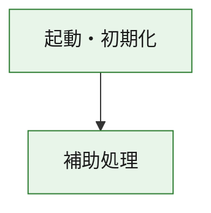
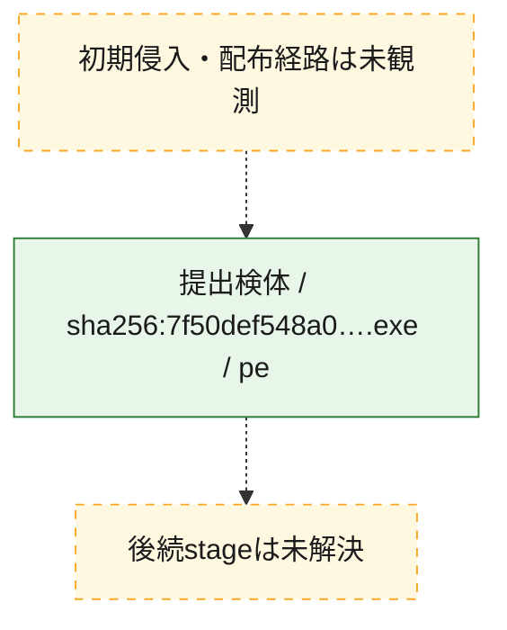
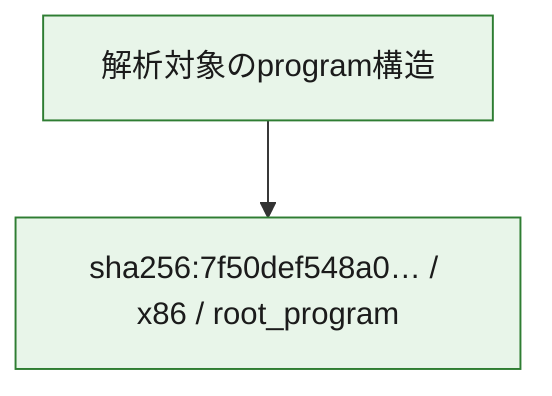

# 全体ロジック：7f50def548a0e26eb6ef0ab431df93a103c12e2a9066d95b4e9951e86709d39f

代表関数の静的証跡から、起動・初期化の処理群を確認しました。

## 読み方

- phaseの掲載順は解析上の整理順です。observed_call_edgesがない段階間の実行順を断定しません。
- 図の実線は静的に観測した関係、点線と黄色のノードは未観測・未解決の関係を示します。
- 図は静的な要約であり、動的実行を再現するものではありません。
- 詳細な関数解説とfingerprintは[STATIC-LOGIC.md](STATIC-LOGIC.md)を参照してください。

## 静的可視化

### 実行フロー

### 感染チェーン

### モジュール関係

## 処理段階

### 1. 起動・初期化

entry pointから初期化と後続処理への移行を確認します。
確度: `confirmed_static_function_evidence`

- `7f50def548a0e26eb6ef0ab431df93a103c12e2a9066d95b4e9951e86709d39f:ghidra:180001010` — 初期化と主要処理への分岐を行う入口関数です。 状態: `succeeded`、選定理由: `entry_point`, `meaningful_symbol_name`, `reviewed_call_centrality:22`, `role:entrypoint`, `small_program_complete_context`

### 2. 補助処理

主要処理を支える一般内部関数またはlibrary処理を確認します。
確度: `confirmed_static_function_evidence`

- `7f50def548a0e26eb6ef0ab431df93a103c12e2a9066d95b4e9951e86709d39f:ghidra:180001240` — 検体内部の一般処理を実装する関数です。 状態: `succeeded`、選定理由: `context_representative`, `reviewed_call_centrality:2`, `small_program_complete_context`
- `7f50def548a0e26eb6ef0ab431df93a103c12e2a9066d95b4e9951e86709d39f:ghidra:180001350` — 検体内部の一般処理を実装する関数です。 状態: `succeeded`、選定理由: `context_representative`, `reviewed_call_centrality:25`, `small_program_complete_context`
- `7f50def548a0e26eb6ef0ab431df93a103c12e2a9066d95b4e9951e86709d39f:ghidra:180003780` — 検体内部の一般処理を実装する関数です。 状態: `succeeded`、選定理由: `context_representative`, `reviewed_call_centrality:2`, `small_program_complete_context`
- `7f50def548a0e26eb6ef0ab431df93a103c12e2a9066d95b4e9951e86709d39f:ghidra:1800038e0` — 検体内部の一般処理を実装する関数です。 状態: `succeeded`、選定理由: `context_representative`, `reviewed_call_centrality:2`, `small_program_complete_context`

## 観測したcall関係

- `7f50def548a0e26eb6ef0ab431df93a103c12e2a9066d95b4e9951e86709d39f:ghidra:180001010` → `7f50def548a0e26eb6ef0ab431df93a103c12e2a9066d95b4e9951e86709d39f:ghidra:180001240` （`startup` → `support`）
- `7f50def548a0e26eb6ef0ab431df93a103c12e2a9066d95b4e9951e86709d39f:ghidra:180001010` → `7f50def548a0e26eb6ef0ab431df93a103c12e2a9066d95b4e9951e86709d39f:ghidra:180001350` （`startup` → `support`）
- `7f50def548a0e26eb6ef0ab431df93a103c12e2a9066d95b4e9951e86709d39f:ghidra:180001350` → `7f50def548a0e26eb6ef0ab431df93a103c12e2a9066d95b4e9951e86709d39f:ghidra:180001240` （`support` → `support`）
- `7f50def548a0e26eb6ef0ab431df93a103c12e2a9066d95b4e9951e86709d39f:ghidra:180001350` → `7f50def548a0e26eb6ef0ab431df93a103c12e2a9066d95b4e9951e86709d39f:ghidra:180003780` （`support` → `support`）
- `7f50def548a0e26eb6ef0ab431df93a103c12e2a9066d95b4e9951e86709d39f:ghidra:180001350` → `7f50def548a0e26eb6ef0ab431df93a103c12e2a9066d95b4e9951e86709d39f:ghidra:1800038e0` （`support` → `support`）
- `7f50def548a0e26eb6ef0ab431df93a103c12e2a9066d95b4e9951e86709d39f:ghidra:180003780` → `7f50def548a0e26eb6ef0ab431df93a103c12e2a9066d95b4e9951e86709d39f:ghidra:1800038e0` （`support` → `support`）
- `ghidra-function:1124d82f8cb6a6aad050944f` → `ghidra-external:005dd9f0915127be30a3e0c4` （`unclassified` → `unclassified`）
- `ghidra-function:1124d82f8cb6a6aad050944f` → `ghidra-external:1bcd4a6380b125c655226541` （`unclassified` → `unclassified`）
- `ghidra-function:1124d82f8cb6a6aad050944f` → `ghidra-external:220e42e55beff846e4ce71f9` （`unclassified` → `unclassified`）
- `ghidra-function:1124d82f8cb6a6aad050944f` → `ghidra-external:3c0767f153d9390d30a90a54` （`unclassified` → `unclassified`）
- `ghidra-function:1124d82f8cb6a6aad050944f` → `ghidra-external:57f79a45d899aac17c458a76` （`unclassified` → `unclassified`）
- `ghidra-function:1124d82f8cb6a6aad050944f` → `ghidra-external:671d4d0f17533463ef79caa1` （`unclassified` → `unclassified`）
- `ghidra-function:1124d82f8cb6a6aad050944f` → `ghidra-external:7e69b90b5763ff6f76b9a5de` （`unclassified` → `unclassified`）
- `ghidra-function:1124d82f8cb6a6aad050944f` → `ghidra-external:9660b9572273681f4e0ee204` （`unclassified` → `unclassified`）
- `ghidra-function:1124d82f8cb6a6aad050944f` → `ghidra-external:9ba33b9ade93058bb19c1d92` （`unclassified` → `unclassified`）
- `ghidra-function:1124d82f8cb6a6aad050944f` → `ghidra-external:a7035af19c9fbdefae466421` （`unclassified` → `unclassified`）
- `ghidra-function:1124d82f8cb6a6aad050944f` → `ghidra-external:ae6b4858abc223a8c9f0f99c` （`unclassified` → `unclassified`）
- `ghidra-function:1124d82f8cb6a6aad050944f` → `ghidra-external:b1d92a236502bcb736241c0b` （`unclassified` → `unclassified`）
- `ghidra-function:1124d82f8cb6a6aad050944f` → `ghidra-external:b51115c2e1eee051808f8238` （`unclassified` → `unclassified`）
- `ghidra-function:1124d82f8cb6a6aad050944f` → `ghidra-external:ba2f99800e4a992245bebc3f` （`unclassified` → `unclassified`）
- `ghidra-function:1124d82f8cb6a6aad050944f` → `ghidra-external:be19736b4a68faa39945307e` （`unclassified` → `unclassified`）
- `ghidra-function:1124d82f8cb6a6aad050944f` → `ghidra-external:c03001fabd654f9c3244d7d0` （`unclassified` → `unclassified`）
- `ghidra-function:1124d82f8cb6a6aad050944f` → `ghidra-external:c9a272454af47364c3fee120` （`unclassified` → `unclassified`）
- `ghidra-function:1124d82f8cb6a6aad050944f` → `ghidra-external:d49cfd08751070f782510177` （`unclassified` → `unclassified`）
- `ghidra-function:1124d82f8cb6a6aad050944f` → `ghidra-external:f6f7dec6bd446c4ffe2de323` （`unclassified` → `unclassified`）
- `ghidra-function:1124d82f8cb6a6aad050944f` → `ghidra-external:fa425c90dd49b5130147f47a` （`unclassified` → `unclassified`）
- `ghidra-function:1124d82f8cb6a6aad050944f` → `ghidra-external:fd511df92dbb41a990fc5fa3` （`unclassified` → `unclassified`）
- `ghidra-function:1124d82f8cb6a6aad050944f` → `ghidra-function:1ae20aa84a6078fe037acaeb` （`unclassified` → `unclassified`）
- `ghidra-function:1124d82f8cb6a6aad050944f` → `ghidra-function:1bdd7a680bbe0f1f31661086` （`unclassified` → `unclassified`）
- `ghidra-function:1124d82f8cb6a6aad050944f` → `ghidra-function:350a830eef41e32e11c35ba4` （`unclassified` → `unclassified`）
- `ghidra-function:350a830eef41e32e11c35ba4` → `ghidra-function:1ae20aa84a6078fe037acaeb` （`unclassified` → `unclassified`）
- `ghidra-function:44b0dee2ec7e6819a5c3a620` → `ghidra-function:00241c946db75ee013f8bbb4` （`unclassified` → `unclassified`）
- `ghidra-function:44b0dee2ec7e6819a5c3a620` → `ghidra-function:1124d82f8cb6a6aad050944f` （`unclassified` → `unclassified`）
- `ghidra-function:44b0dee2ec7e6819a5c3a620` → `ghidra-function:1bdd7a680bbe0f1f31661086` （`unclassified` → `unclassified`）
- `ghidra-function:44b0dee2ec7e6819a5c3a620` → `ghidra-function:60c5693923db755098a19c48` （`unclassified` → `unclassified`）
- `ghidra-function:44b0dee2ec7e6819a5c3a620` → `ghidra-function:71423467aaa72fb39754830a` （`unclassified` → `unclassified`）
- `ghidra-function:44b0dee2ec7e6819a5c3a620` → `ghidra-function:a25d6d3d03d8bf997908e441` （`unclassified` → `unclassified`）
- `ghidra-function:44b0dee2ec7e6819a5c3a620` → `ghidra-function:a38545bf550dbfc35fdd9d76` （`unclassified` → `unclassified`）
- `ghidra-function:44b0dee2ec7e6819a5c3a620` → `ghidra-function:ba721a5730c593082182a308` （`unclassified` → `unclassified`）
- `ghidra-function:44b0dee2ec7e6819a5c3a620` → `ghidra-function:be8ab35ac19064771f698307` （`unclassified` → `unclassified`）
- `ghidra-function:44b0dee2ec7e6819a5c3a620` → `ghidra-function:c95576d7d606925b2a52c391` （`unclassified` → `unclassified`）
- `ghidra-function:44b0dee2ec7e6819a5c3a620` → `ghidra-function:e74a5e14f4e599432ef79384` （`unclassified` → `unclassified`）
- `ghidra-function:44b0dee2ec7e6819a5c3a620` → `ghidra-function:ede526a3807d6a3e332c6206` （`unclassified` → `unclassified`）

## 解析範囲と制約

- 選定外関数は全体inventoryへ残しますが、関数本体の個別解説対象にはしていません。
- indirect call、難読化、packer、VM、壊れたcontrol flowによりcall関係が欠落する場合があります。
- 文書は静的解析に基づき、検体実行や外部通信による動的確認は行っていません。
