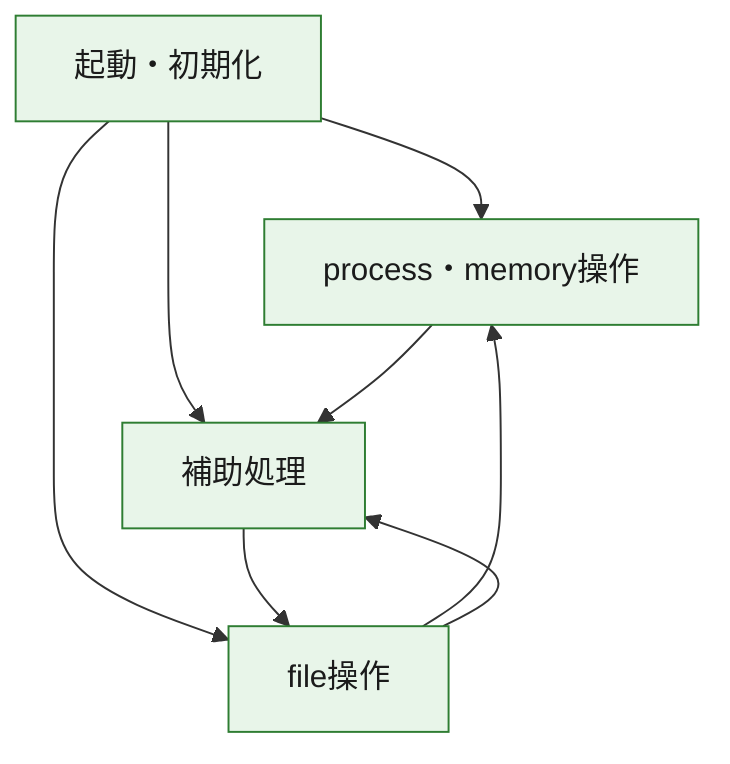
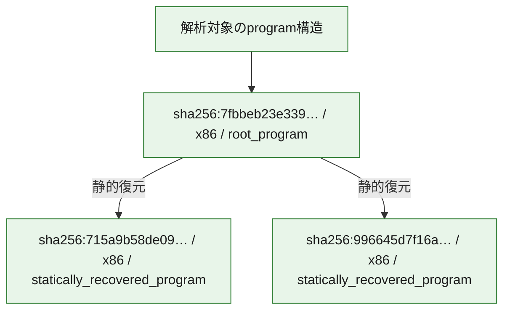

# 全体ロジック：7fbbeb23e339797e7165db5463c8278c4507900e0f37781a2f3d4152ad73ae93

代表関数の静的証跡から、起動・初期化、process・memory操作、file操作の処理群を確認しました。

## 読み方

- phaseの掲載順は解析上の整理順です。observed_call_edgesがない段階間の実行順を断定しません。
- 図の実線は静的に観測した関係、点線と黄色のノードは未観測・未解決の関係を示します。
- 図は静的な要約であり、動的実行を再現するものではありません。
- 詳細な関数解説とfingerprintは[STATIC-LOGIC.md](STATIC-LOGIC.md)を参照してください。

## 静的可視化

### 実行フロー

### 感染チェーン

```mermaid
flowchart TD
  chain_initial["初期侵入・配布経路は未観測"]
  chain_01["提出検体 / sha256:7fbbeb23e339….exe / pe"]
  chain_02["静的復元層 1 / sha256:7fbbeb23e339….exe::7z-data / data"]
  chain_03["静的復元層 1 / sha256:7fbbeb23e339….exe::7z-data / data"]
  chain_04["静的復元層 1 / sha256:7fbbeb23e339….exe::7z-data / data"]
  chain_05["静的復元層 1 / sha256:7fbbeb23e339….exe::7z-data / data"]
  chain_06["静的復元層 1 / sha256:7fbbeb23e339….exe::7z-data / data"]
  chain_07["静的復元層 1 / sha256:7fbbeb23e339….exe::7z-data / data"]
  chain_08["静的復元層 1 / sha256:7fbbeb23e339….exe::7z-data / data"]
  chain_09["静的復元層 1 / sha256:7fbbeb23e339….exe::7z-data / data"]
  chain_10["静的復元層 1 / sha256:7fbbeb23e339….exe::7z-data / data"]
  chain_11["静的復元層 1 / sha256:7fbbeb23e339….exe::7z-data / data"]
  chain_12["静的復元層 1 / sha256:7fbbeb23e339….exe::7z-pe / pe"]
  chain_13["静的復元層 1 / sha256:7fbbeb23e339….exe::7z-pe / pe"]
  chain_01 -->|7z-data| chain_02
  chain_01 -->|7z-data| chain_03
  chain_01 -->|7z-data| chain_04
  chain_01 -->|7z-data| chain_05
  chain_01 -->|7z-data| chain_06
  chain_01 -->|7z-data| chain_07
  chain_01 -->|7z-data| chain_08
  chain_01 -->|7z-data| chain_09
  chain_01 -->|7z-data| chain_10
  chain_01 -->|7z-data| chain_11
  chain_01 -->|7z-pe| chain_12
  chain_01 -->|7z-pe| chain_13
  chain_initial -.-> chain_01
  chain_unknown["後続stageは未解決"]
  chain_02 -.-> chain_unknown
  chain_03 -.-> chain_unknown
  chain_04 -.-> chain_unknown
  chain_05 -.-> chain_unknown
  chain_06 -.-> chain_unknown
  chain_07 -.-> chain_unknown
  chain_08 -.-> chain_unknown
  chain_09 -.-> chain_unknown
  chain_10 -.-> chain_unknown
  chain_11 -.-> chain_unknown
  chain_12 -.-> chain_unknown
  chain_13 -.-> chain_unknown
  class chain_unknown unresolved
  class chain_01,chain_02,chain_03,chain_04,chain_05,chain_06,chain_07,chain_08,chain_09,chain_10,chain_11,chain_12,chain_13 confirmed
  class chain_initial unresolved
  classDef confirmed fill:#e8f5e9,stroke:#2e7d32,color:#1b1b1b
  classDef unresolved fill:#fff8e1,stroke:#f9a825,color:#1b1b1b,stroke-dasharray:5 5
```

### モジュール関係

## 処理段階

### 1. 起動・初期化

entry pointから初期化と後続処理への移行を確認します。
確度: `confirmed_static_function_evidence`

- `715a9b58de0995d1a08384c522ad9af210e2791aaf8e87a6c07bfe72ebfd2cb5:ghidra:10001d67` — 初期化と主要処理への分岐を行う入口関数です。 状態: `succeeded`、選定理由: `entry_point`, `meaningful_symbol_name`, `role:entrypoint`, `small_program_complete_context`
- `996645d7f16a6294babb6da83478062aed7b72318d7a51b66e90ab5d3edc51a5:ghidra:10002a7f` — 初期化と主要処理への分岐を行う入口関数です。 状態: `succeeded`、選定理由: `call_graph_centrality:in=0,out=1`, `entry_point`, `meaningful_symbol_name`, `reviewed_call_centrality:1`, `reviewed_call_centrality:2`, `role:entrypoint`, `small_program_complete_context`
- `7fbbeb23e339797e7165db5463c8278c4507900e0f37781a2f3d4152ad73ae93:ghidra:0040369f` — 初期化と主要処理への分岐を行う入口関数です。 状態: `succeeded`、選定理由: `call_graph_centrality:in=0,out=45`, `entry_point`, `large_function:instructions=467`, `meaningful_symbol_name`, `reviewed_call_centrality:50`, `reviewed_call_centrality:69`, `role:entrypoint`

### 2. process・memory操作

process、thread、module、memory操作と実行移行を確認します。
確度: `confirmed_static_function_evidence`

- `7fbbeb23e339797e7165db5463c8278c4507900e0f37781a2f3d4152ad73ae93:ghidra:004058ad` — process、thread、module、またはmemory操作に関係する関数です。 状態: `succeeded`、選定理由: `call_graph_centrality:in=0,out=25`, `large_function:instructions=284`, `reviewed_call_centrality:25`, `reviewed_call_centrality:43`, `role:process_or_memory_operation`
- `7fbbeb23e339797e7165db5463c8278c4507900e0f37781a2f3d4152ad73ae93:ghidra:00405ccc` — process、thread、module、またはmemory操作に関係する関数です。 状態: `succeeded`、選定理由: `call_graph_centrality:in=2,out=2`, `reviewed_call_centrality:4`, `reviewed_call_centrality:6`, `role:process_or_memory_operation`

### 3. file操作

fileやdirectoryの作成、読書き、削除を確認します。
確度: `confirmed_static_function_evidence_with_limits`

- `7fbbeb23e339797e7165db5463c8278c4507900e0f37781a2f3d4152ad73ae93:ghidra:00401434` — fileまたはdirectoryの読書き・管理に関係する関数です。 状態: `failed`、選定理由: `call_graph_centrality:in=1,out=107`, `large_function:instructions=2019`, `reviewed_call_centrality:112`, `reviewed_call_centrality:167`, `role:file_operation`
- `7fbbeb23e339797e7165db5463c8278c4507900e0f37781a2f3d4152ad73ae93:ghidra:004030fc` — fileまたはdirectoryの読書き・管理に関係する関数です。 状態: `succeeded`、選定理由: `call_graph_centrality:in=1,out=18`, `large_function:instructions=216`, `reviewed_call_centrality:19`, `reviewed_call_centrality:26`, `role:file_operation`
- `7fbbeb23e339797e7165db5463c8278c4507900e0f37781a2f3d4152ad73ae93:ghidra:004033d0` — fileまたはdirectoryの読書き・管理に関係する関数です。 状態: `succeeded`、選定理由: `call_graph_centrality:in=2,out=5`, `large_function:instructions=88`, `reviewed_call_centrality:7`, `reviewed_call_centrality:9`, `role:file_operation`
- `7fbbeb23e339797e7165db5463c8278c4507900e0f37781a2f3d4152ad73ae93:ghidra:00405dad` — fileまたはdirectoryの読書き・管理に関係する関数です。 状態: `succeeded`、選定理由: `call_graph_centrality:in=1,out=4`, `reviewed_call_centrality:5`, `reviewed_call_centrality:8`, `role:file_operation`
- `7fbbeb23e339797e7165db5463c8278c4507900e0f37781a2f3d4152ad73ae93:ghidra:00405df5` — fileまたはdirectoryの読書き・管理に関係する関数です。 状態: `succeeded`、選定理由: `call_graph_centrality:in=4,out=15`, `large_function:instructions=148`, `reviewed_call_centrality:20`, `reviewed_call_centrality:23`, `role:file_operation`
- `7fbbeb23e339797e7165db5463c8278c4507900e0f37781a2f3d4152ad73ae93:ghidra:004061d9` — fileまたはdirectoryの読書き・管理に関係する関数です。 状態: `succeeded`、選定理由: `call_graph_centrality:in=3,out=2`, `reviewed_call_centrality:5`, `reviewed_call_centrality:7`, `role:file_operation`
- `7fbbeb23e339797e7165db5463c8278c4507900e0f37781a2f3d4152ad73ae93:ghidra:0040625c` — fileまたはdirectoryの読書き・管理に関係する関数です。 状態: `succeeded`、選定理由: `call_graph_centrality:in=5,out=1`, `reviewed_call_centrality:6`, `reviewed_call_centrality:7`, `role:file_operation`
- `7fbbeb23e339797e7165db5463c8278c4507900e0f37781a2f3d4152ad73ae93:ghidra:0040628b` — fileまたはdirectoryの読書き・管理に関係する関数です。 状態: `succeeded`、選定理由: `call_graph_centrality:in=5,out=1`, `reviewed_call_centrality:6`, `reviewed_call_centrality:7`, `role:file_operation`
- `7fbbeb23e339797e7165db5463c8278c4507900e0f37781a2f3d4152ad73ae93:ghidra:00406a46` — fileまたはdirectoryの読書き・管理に関係する関数です。 状態: `succeeded`、選定理由: `call_graph_centrality:in=4,out=2`, `reviewed_call_centrality:6`, `reviewed_call_centrality:8`, `role:file_operation`

### 4. 補助処理

主要処理を支える一般内部関数またはlibrary処理を確認します。
確度: `confirmed_static_function_evidence`

- `7fbbeb23e339797e7165db5463c8278c4507900e0f37781a2f3d4152ad73ae93:ghidra:00401000` — 検体内部の一般処理を実装する関数です。 状態: `succeeded`、選定理由: `call_graph_centrality:in=0,out=12`, `large_function:instructions=125`, `reviewed_call_centrality:13`, `reviewed_call_centrality:24`
- `7fbbeb23e339797e7165db5463c8278c4507900e0f37781a2f3d4152ad73ae93:ghidra:00401389` — 検体内部の一般処理を実装する関数です。 状態: `succeeded`、選定理由: `call_graph_centrality:in=3,out=4`, `reviewed_call_centrality:7`, `reviewed_call_centrality:9`
- `7fbbeb23e339797e7165db5463c8278c4507900e0f37781a2f3d4152ad73ae93:ghidra:00402ed5` — 検体内部の一般処理を実装する関数です。 状態: `succeeded`、選定理由: `call_graph_centrality:in=2,out=7`, `large_function:instructions=84`, `reviewed_call_centrality:10`, `reviewed_call_centrality:13`
- `7fbbeb23e339797e7165db5463c8278c4507900e0f37781a2f3d4152ad73ae93:ghidra:0040305a` — 検体内部の一般処理を実装する関数です。 状態: `succeeded`、選定理由: `call_graph_centrality:in=2,out=7`, `reviewed_call_centrality:11`, `reviewed_call_centrality:13`
- `7fbbeb23e339797e7165db5463c8278c4507900e0f37781a2f3d4152ad73ae93:ghidra:004034d8` — 検体内部の一般処理を実装する関数です。 状態: `succeeded`、選定理由: `call_graph_centrality:in=1,out=7`, `large_function:instructions=101`, `reviewed_call_centrality:10`, `reviewed_call_centrality:8`
- `7fbbeb23e339797e7165db5463c8278c4507900e0f37781a2f3d4152ad73ae93:ghidra:00403dbb` — 検体内部の一般処理を実装する関数です。 状態: `succeeded`、選定理由: `call_graph_centrality:in=1,out=24`, `large_function:instructions=215`, `reviewed_call_centrality:28`, `reviewed_call_centrality:33`
- `7fbbeb23e339797e7165db5463c8278c4507900e0f37781a2f3d4152ad73ae93:ghidra:004046cf` — 検体内部の一般処理を実装する関数です。 状態: `succeeded`、選定理由: `call_graph_centrality:in=5,out=7`, `large_function:instructions=68`, `reviewed_call_centrality:12`, `reviewed_call_centrality:19`
- `7fbbeb23e339797e7165db5463c8278c4507900e0f37781a2f3d4152ad73ae93:ghidra:00404827` — 検体内部の一般処理を実装する関数です。 状態: `succeeded`、選定理由: `call_graph_centrality:in=0,out=13`, `large_function:instructions=204`, `reviewed_call_centrality:13`, `reviewed_call_centrality:19`
- `7fbbeb23e339797e7165db5463c8278c4507900e0f37781a2f3d4152ad73ae93:ghidra:00404b59` — 検体内部の一般処理を実装する関数です。 状態: `succeeded`、選定理由: `call_graph_centrality:in=0,out=28`, `large_function:instructions=275`, `reviewed_call_centrality:29`, `reviewed_call_centrality:35`
- `7fbbeb23e339797e7165db5463c8278c4507900e0f37781a2f3d4152ad73ae93:ghidra:00404f15` — 検体内部の一般処理を実装する関数です。 状態: `succeeded`、選定理由: `call_graph_centrality:in=2,out=4`, `large_function:instructions=84`, `reviewed_call_centrality:6`, `reviewed_call_centrality:7`
- `7fbbeb23e339797e7165db5463c8278c4507900e0f37781a2f3d4152ad73ae93:ghidra:004050d5` — 検体内部の一般処理を実装する関数です。 状態: `succeeded`、選定理由: `call_graph_centrality:in=0,out=24`, `large_function:instructions=489`, `reviewed_call_centrality:26`, `reviewed_call_centrality:36`
- `7fbbeb23e339797e7165db5463c8278c4507900e0f37781a2f3d4152ad73ae93:ghidra:0040576e` — 検体内部の一般処理を実装する関数です。 状態: `succeeded`、選定理由: `call_graph_centrality:in=5,out=5`, `large_function:instructions=72`, `reviewed_call_centrality:10`, `reviewed_call_centrality:12`
- `7fbbeb23e339797e7165db5463c8278c4507900e0f37781a2f3d4152ad73ae93:ghidra:00405fb8` — 検体内部の一般処理を実装する関数です。 状態: `succeeded`、選定理由: `call_graph_centrality:in=6,out=3`, `reviewed_call_centrality:10`, `reviewed_call_centrality:9`
- `7fbbeb23e339797e7165db5463c8278c4507900e0f37781a2f3d4152ad73ae93:ghidra:004060c0` — 検体内部の一般処理を実装する関数です。 状態: `succeeded`、選定理由: `call_graph_centrality:in=4,out=8`, `reviewed_call_centrality:12`, `reviewed_call_centrality:13`
- `7fbbeb23e339797e7165db5463c8278c4507900e0f37781a2f3d4152ad73ae93:ghidra:0040632f` — 検体内部の一般処理を実装する関数です。 状態: `succeeded`、選定理由: `call_graph_centrality:in=1,out=14`, `large_function:instructions=130`, `reviewed_call_centrality:15`, `reviewed_call_centrality:23`
- `7fbbeb23e339797e7165db5463c8278c4507900e0f37781a2f3d4152ad73ae93:ghidra:004066e9` — 検体内部の一般処理を実装する関数です。 状態: `succeeded`、選定理由: `call_graph_centrality:in=9,out=1`, `reviewed_call_centrality:10`, `reviewed_call_centrality:11`
- `7fbbeb23e339797e7165db5463c8278c4507900e0f37781a2f3d4152ad73ae93:ghidra:00406726` — 検体内部の一般処理を実装する関数です。 状態: `succeeded`、選定理由: `call_graph_centrality:in=15,out=12`, `large_function:instructions=204`, `reviewed_call_centrality:27`, `reviewed_call_centrality:31`
- `7fbbeb23e339797e7165db5463c8278c4507900e0f37781a2f3d4152ad73ae93:ghidra:00406997` — 検体内部の一般処理を実装する関数です。 状態: `succeeded`、選定理由: `call_graph_centrality:in=6,out=5`, `large_function:instructions=69`, `reviewed_call_centrality:11`, `reviewed_call_centrality:13`
- `7fbbeb23e339797e7165db5463c8278c4507900e0f37781a2f3d4152ad73ae93:ghidra:00406add` — 検体内部の一般処理を実装する関数です。 状態: `succeeded`、選定理由: `call_graph_centrality:in=7,out=3`, `reviewed_call_centrality:10`, `reviewed_call_centrality:12`
- `7fbbeb23e339797e7165db5463c8278c4507900e0f37781a2f3d4152ad73ae93:ghidra:00406c58` — 検体内部の一般処理を実装する関数です。 状態: `succeeded`、選定理由: `call_graph_centrality:in=1,out=2`, `large_function:instructions=781`, `reviewed_call_centrality:3`, `reviewed_call_centrality:5`

## 観測したcall関係

- `7fbbeb23e339797e7165db5463c8278c4507900e0f37781a2f3d4152ad73ae93:ghidra:00401389` → `7fbbeb23e339797e7165db5463c8278c4507900e0f37781a2f3d4152ad73ae93:ghidra:00401434` （`support` → `file_activity`）
- `7fbbeb23e339797e7165db5463c8278c4507900e0f37781a2f3d4152ad73ae93:ghidra:00401434` → `7fbbeb23e339797e7165db5463c8278c4507900e0f37781a2f3d4152ad73ae93:ghidra:00401389` （`file_activity` → `support`）
- `7fbbeb23e339797e7165db5463c8278c4507900e0f37781a2f3d4152ad73ae93:ghidra:00401434` → `7fbbeb23e339797e7165db5463c8278c4507900e0f37781a2f3d4152ad73ae93:ghidra:004033d0` （`file_activity` → `file_activity`）
- `7fbbeb23e339797e7165db5463c8278c4507900e0f37781a2f3d4152ad73ae93:ghidra:00401434` → `7fbbeb23e339797e7165db5463c8278c4507900e0f37781a2f3d4152ad73ae93:ghidra:0040576e` （`file_activity` → `support`）
- `7fbbeb23e339797e7165db5463c8278c4507900e0f37781a2f3d4152ad73ae93:ghidra:00401434` → `7fbbeb23e339797e7165db5463c8278c4507900e0f37781a2f3d4152ad73ae93:ghidra:00405ccc` （`file_activity` → `execution`）
- `7fbbeb23e339797e7165db5463c8278c4507900e0f37781a2f3d4152ad73ae93:ghidra:00401434` → `7fbbeb23e339797e7165db5463c8278c4507900e0f37781a2f3d4152ad73ae93:ghidra:00405df5` （`file_activity` → `file_activity`）
- `7fbbeb23e339797e7165db5463c8278c4507900e0f37781a2f3d4152ad73ae93:ghidra:00401434` → `7fbbeb23e339797e7165db5463c8278c4507900e0f37781a2f3d4152ad73ae93:ghidra:00405fb8` （`file_activity` → `support`）
- `7fbbeb23e339797e7165db5463c8278c4507900e0f37781a2f3d4152ad73ae93:ghidra:00401434` → `7fbbeb23e339797e7165db5463c8278c4507900e0f37781a2f3d4152ad73ae93:ghidra:004061d9` （`file_activity` → `file_activity`）
- `7fbbeb23e339797e7165db5463c8278c4507900e0f37781a2f3d4152ad73ae93:ghidra:00401434` → `7fbbeb23e339797e7165db5463c8278c4507900e0f37781a2f3d4152ad73ae93:ghidra:0040625c` （`file_activity` → `file_activity`）
- `7fbbeb23e339797e7165db5463c8278c4507900e0f37781a2f3d4152ad73ae93:ghidra:00401434` → `7fbbeb23e339797e7165db5463c8278c4507900e0f37781a2f3d4152ad73ae93:ghidra:0040628b` （`file_activity` → `file_activity`）
- `7fbbeb23e339797e7165db5463c8278c4507900e0f37781a2f3d4152ad73ae93:ghidra:00401434` → `7fbbeb23e339797e7165db5463c8278c4507900e0f37781a2f3d4152ad73ae93:ghidra:004066e9` （`file_activity` → `support`）
- `7fbbeb23e339797e7165db5463c8278c4507900e0f37781a2f3d4152ad73ae93:ghidra:00401434` → `7fbbeb23e339797e7165db5463c8278c4507900e0f37781a2f3d4152ad73ae93:ghidra:00406726` （`file_activity` → `support`）
- `7fbbeb23e339797e7165db5463c8278c4507900e0f37781a2f3d4152ad73ae93:ghidra:00401434` → `7fbbeb23e339797e7165db5463c8278c4507900e0f37781a2f3d4152ad73ae93:ghidra:00406997` （`file_activity` → `support`）
- `7fbbeb23e339797e7165db5463c8278c4507900e0f37781a2f3d4152ad73ae93:ghidra:00401434` → `7fbbeb23e339797e7165db5463c8278c4507900e0f37781a2f3d4152ad73ae93:ghidra:00406a46` （`file_activity` → `file_activity`）
- `7fbbeb23e339797e7165db5463c8278c4507900e0f37781a2f3d4152ad73ae93:ghidra:00401434` → `7fbbeb23e339797e7165db5463c8278c4507900e0f37781a2f3d4152ad73ae93:ghidra:00406add` （`file_activity` → `support`）
- `7fbbeb23e339797e7165db5463c8278c4507900e0f37781a2f3d4152ad73ae93:ghidra:00402ed5` → `7fbbeb23e339797e7165db5463c8278c4507900e0f37781a2f3d4152ad73ae93:ghidra:00406add` （`support` → `support`）
- `7fbbeb23e339797e7165db5463c8278c4507900e0f37781a2f3d4152ad73ae93:ghidra:0040305a` → `7fbbeb23e339797e7165db5463c8278c4507900e0f37781a2f3d4152ad73ae93:ghidra:0040576e` （`support` → `support`）
- `7fbbeb23e339797e7165db5463c8278c4507900e0f37781a2f3d4152ad73ae93:ghidra:004030fc` → `7fbbeb23e339797e7165db5463c8278c4507900e0f37781a2f3d4152ad73ae93:ghidra:0040305a` （`file_activity` → `support`）
- `7fbbeb23e339797e7165db5463c8278c4507900e0f37781a2f3d4152ad73ae93:ghidra:004030fc` → `7fbbeb23e339797e7165db5463c8278c4507900e0f37781a2f3d4152ad73ae93:ghidra:004033d0` （`file_activity` → `file_activity`）
- `7fbbeb23e339797e7165db5463c8278c4507900e0f37781a2f3d4152ad73ae93:ghidra:004030fc` → `7fbbeb23e339797e7165db5463c8278c4507900e0f37781a2f3d4152ad73ae93:ghidra:004061d9` （`file_activity` → `file_activity`）
- `7fbbeb23e339797e7165db5463c8278c4507900e0f37781a2f3d4152ad73ae93:ghidra:004030fc` → `7fbbeb23e339797e7165db5463c8278c4507900e0f37781a2f3d4152ad73ae93:ghidra:004066e9` （`file_activity` → `support`）
- `7fbbeb23e339797e7165db5463c8278c4507900e0f37781a2f3d4152ad73ae93:ghidra:004033d0` → `7fbbeb23e339797e7165db5463c8278c4507900e0f37781a2f3d4152ad73ae93:ghidra:004034d8` （`file_activity` → `support`）
- `7fbbeb23e339797e7165db5463c8278c4507900e0f37781a2f3d4152ad73ae93:ghidra:004033d0` → `7fbbeb23e339797e7165db5463c8278c4507900e0f37781a2f3d4152ad73ae93:ghidra:0040625c` （`file_activity` → `file_activity`）
- `7fbbeb23e339797e7165db5463c8278c4507900e0f37781a2f3d4152ad73ae93:ghidra:004033d0` → `7fbbeb23e339797e7165db5463c8278c4507900e0f37781a2f3d4152ad73ae93:ghidra:0040628b` （`file_activity` → `file_activity`）
- `7fbbeb23e339797e7165db5463c8278c4507900e0f37781a2f3d4152ad73ae93:ghidra:004034d8` → `7fbbeb23e339797e7165db5463c8278c4507900e0f37781a2f3d4152ad73ae93:ghidra:0040305a` （`support` → `support`）
- `7fbbeb23e339797e7165db5463c8278c4507900e0f37781a2f3d4152ad73ae93:ghidra:004034d8` → `7fbbeb23e339797e7165db5463c8278c4507900e0f37781a2f3d4152ad73ae93:ghidra:0040628b` （`support` → `file_activity`）
- `7fbbeb23e339797e7165db5463c8278c4507900e0f37781a2f3d4152ad73ae93:ghidra:004034d8` → `7fbbeb23e339797e7165db5463c8278c4507900e0f37781a2f3d4152ad73ae93:ghidra:00406c58` （`support` → `support`）
- `7fbbeb23e339797e7165db5463c8278c4507900e0f37781a2f3d4152ad73ae93:ghidra:0040369f` → `7fbbeb23e339797e7165db5463c8278c4507900e0f37781a2f3d4152ad73ae93:ghidra:004030fc` （`startup` → `file_activity`）
- `7fbbeb23e339797e7165db5463c8278c4507900e0f37781a2f3d4152ad73ae93:ghidra:0040369f` → `7fbbeb23e339797e7165db5463c8278c4507900e0f37781a2f3d4152ad73ae93:ghidra:00403dbb` （`startup` → `support`）
- `7fbbeb23e339797e7165db5463c8278c4507900e0f37781a2f3d4152ad73ae93:ghidra:0040369f` → `7fbbeb23e339797e7165db5463c8278c4507900e0f37781a2f3d4152ad73ae93:ghidra:00405ccc` （`startup` → `execution`）
- `7fbbeb23e339797e7165db5463c8278c4507900e0f37781a2f3d4152ad73ae93:ghidra:0040369f` → `7fbbeb23e339797e7165db5463c8278c4507900e0f37781a2f3d4152ad73ae93:ghidra:00405df5` （`startup` → `file_activity`）
- `7fbbeb23e339797e7165db5463c8278c4507900e0f37781a2f3d4152ad73ae93:ghidra:0040369f` → `7fbbeb23e339797e7165db5463c8278c4507900e0f37781a2f3d4152ad73ae93:ghidra:004060c0` （`startup` → `support`）
- `7fbbeb23e339797e7165db5463c8278c4507900e0f37781a2f3d4152ad73ae93:ghidra:0040369f` → `7fbbeb23e339797e7165db5463c8278c4507900e0f37781a2f3d4152ad73ae93:ghidra:004066e9` （`startup` → `support`）
- `7fbbeb23e339797e7165db5463c8278c4507900e0f37781a2f3d4152ad73ae93:ghidra:0040369f` → `7fbbeb23e339797e7165db5463c8278c4507900e0f37781a2f3d4152ad73ae93:ghidra:00406726` （`startup` → `support`）
- `7fbbeb23e339797e7165db5463c8278c4507900e0f37781a2f3d4152ad73ae93:ghidra:0040369f` → `7fbbeb23e339797e7165db5463c8278c4507900e0f37781a2f3d4152ad73ae93:ghidra:00406a46` （`startup` → `file_activity`）
- `7fbbeb23e339797e7165db5463c8278c4507900e0f37781a2f3d4152ad73ae93:ghidra:0040369f` → `7fbbeb23e339797e7165db5463c8278c4507900e0f37781a2f3d4152ad73ae93:ghidra:00406add` （`startup` → `support`）
- `7fbbeb23e339797e7165db5463c8278c4507900e0f37781a2f3d4152ad73ae93:ghidra:00403dbb` → `7fbbeb23e339797e7165db5463c8278c4507900e0f37781a2f3d4152ad73ae93:ghidra:00405fb8` （`support` → `support`）
- `7fbbeb23e339797e7165db5463c8278c4507900e0f37781a2f3d4152ad73ae93:ghidra:00403dbb` → `7fbbeb23e339797e7165db5463c8278c4507900e0f37781a2f3d4152ad73ae93:ghidra:004060c0` （`support` → `support`）
- `7fbbeb23e339797e7165db5463c8278c4507900e0f37781a2f3d4152ad73ae93:ghidra:00403dbb` → `7fbbeb23e339797e7165db5463c8278c4507900e0f37781a2f3d4152ad73ae93:ghidra:004066e9` （`support` → `support`）
- `7fbbeb23e339797e7165db5463c8278c4507900e0f37781a2f3d4152ad73ae93:ghidra:00403dbb` → `7fbbeb23e339797e7165db5463c8278c4507900e0f37781a2f3d4152ad73ae93:ghidra:00406726` （`support` → `support`）
- `7fbbeb23e339797e7165db5463c8278c4507900e0f37781a2f3d4152ad73ae93:ghidra:00403dbb` → `7fbbeb23e339797e7165db5463c8278c4507900e0f37781a2f3d4152ad73ae93:ghidra:00406add` （`support` → `support`）
- `7fbbeb23e339797e7165db5463c8278c4507900e0f37781a2f3d4152ad73ae93:ghidra:00404827` → `7fbbeb23e339797e7165db5463c8278c4507900e0f37781a2f3d4152ad73ae93:ghidra:004046cf` （`support` → `support`）
- `7fbbeb23e339797e7165db5463c8278c4507900e0f37781a2f3d4152ad73ae93:ghidra:00404b59` → `7fbbeb23e339797e7165db5463c8278c4507900e0f37781a2f3d4152ad73ae93:ghidra:004046cf` （`support` → `support`）
- `7fbbeb23e339797e7165db5463c8278c4507900e0f37781a2f3d4152ad73ae93:ghidra:00404b59` → `7fbbeb23e339797e7165db5463c8278c4507900e0f37781a2f3d4152ad73ae93:ghidra:00404f15` （`support` → `support`）
- `7fbbeb23e339797e7165db5463c8278c4507900e0f37781a2f3d4152ad73ae93:ghidra:00404b59` → `7fbbeb23e339797e7165db5463c8278c4507900e0f37781a2f3d4152ad73ae93:ghidra:00405fb8` （`support` → `support`）
- `7fbbeb23e339797e7165db5463c8278c4507900e0f37781a2f3d4152ad73ae93:ghidra:00404b59` → `7fbbeb23e339797e7165db5463c8278c4507900e0f37781a2f3d4152ad73ae93:ghidra:004060c0` （`support` → `support`）
- `7fbbeb23e339797e7165db5463c8278c4507900e0f37781a2f3d4152ad73ae93:ghidra:00404b59` → `7fbbeb23e339797e7165db5463c8278c4507900e0f37781a2f3d4152ad73ae93:ghidra:004066e9` （`support` → `support`）
- `7fbbeb23e339797e7165db5463c8278c4507900e0f37781a2f3d4152ad73ae93:ghidra:00404b59` → `7fbbeb23e339797e7165db5463c8278c4507900e0f37781a2f3d4152ad73ae93:ghidra:00406726` （`support` → `support`）
- `7fbbeb23e339797e7165db5463c8278c4507900e0f37781a2f3d4152ad73ae93:ghidra:00404b59` → `7fbbeb23e339797e7165db5463c8278c4507900e0f37781a2f3d4152ad73ae93:ghidra:00406997` （`support` → `support`）
- `7fbbeb23e339797e7165db5463c8278c4507900e0f37781a2f3d4152ad73ae93:ghidra:00404b59` → `7fbbeb23e339797e7165db5463c8278c4507900e0f37781a2f3d4152ad73ae93:ghidra:00406add` （`support` → `support`）
- `7fbbeb23e339797e7165db5463c8278c4507900e0f37781a2f3d4152ad73ae93:ghidra:00404f15` → `7fbbeb23e339797e7165db5463c8278c4507900e0f37781a2f3d4152ad73ae93:ghidra:00406726` （`support` → `support`）
- `7fbbeb23e339797e7165db5463c8278c4507900e0f37781a2f3d4152ad73ae93:ghidra:004050d5` → `7fbbeb23e339797e7165db5463c8278c4507900e0f37781a2f3d4152ad73ae93:ghidra:004046cf` （`support` → `support`）
- `7fbbeb23e339797e7165db5463c8278c4507900e0f37781a2f3d4152ad73ae93:ghidra:004050d5` → `7fbbeb23e339797e7165db5463c8278c4507900e0f37781a2f3d4152ad73ae93:ghidra:00406726` （`support` → `support`）
- `7fbbeb23e339797e7165db5463c8278c4507900e0f37781a2f3d4152ad73ae93:ghidra:0040576e` → `7fbbeb23e339797e7165db5463c8278c4507900e0f37781a2f3d4152ad73ae93:ghidra:00406726` （`support` → `support`）
- `7fbbeb23e339797e7165db5463c8278c4507900e0f37781a2f3d4152ad73ae93:ghidra:004058ad` → `7fbbeb23e339797e7165db5463c8278c4507900e0f37781a2f3d4152ad73ae93:ghidra:004046cf` （`execution` → `support`）
- `7fbbeb23e339797e7165db5463c8278c4507900e0f37781a2f3d4152ad73ae93:ghidra:004058ad` → `7fbbeb23e339797e7165db5463c8278c4507900e0f37781a2f3d4152ad73ae93:ghidra:0040576e` （`execution` → `support`）
- `7fbbeb23e339797e7165db5463c8278c4507900e0f37781a2f3d4152ad73ae93:ghidra:004058ad` → `7fbbeb23e339797e7165db5463c8278c4507900e0f37781a2f3d4152ad73ae93:ghidra:00406726` （`execution` → `support`）
- `7fbbeb23e339797e7165db5463c8278c4507900e0f37781a2f3d4152ad73ae93:ghidra:00405df5` → `7fbbeb23e339797e7165db5463c8278c4507900e0f37781a2f3d4152ad73ae93:ghidra:0040576e` （`file_activity` → `support`）
- `7fbbeb23e339797e7165db5463c8278c4507900e0f37781a2f3d4152ad73ae93:ghidra:00405df5` → `7fbbeb23e339797e7165db5463c8278c4507900e0f37781a2f3d4152ad73ae93:ghidra:00405dad` （`file_activity` → `file_activity`）
- `7fbbeb23e339797e7165db5463c8278c4507900e0f37781a2f3d4152ad73ae93:ghidra:00405df5` → `7fbbeb23e339797e7165db5463c8278c4507900e0f37781a2f3d4152ad73ae93:ghidra:00405fb8` （`file_activity` → `support`）
- `7fbbeb23e339797e7165db5463c8278c4507900e0f37781a2f3d4152ad73ae93:ghidra:00405df5` → `7fbbeb23e339797e7165db5463c8278c4507900e0f37781a2f3d4152ad73ae93:ghidra:004060c0` （`file_activity` → `support`）
- `7fbbeb23e339797e7165db5463c8278c4507900e0f37781a2f3d4152ad73ae93:ghidra:00405df5` → `7fbbeb23e339797e7165db5463c8278c4507900e0f37781a2f3d4152ad73ae93:ghidra:004066e9` （`file_activity` → `support`）
- `7fbbeb23e339797e7165db5463c8278c4507900e0f37781a2f3d4152ad73ae93:ghidra:00405df5` → `7fbbeb23e339797e7165db5463c8278c4507900e0f37781a2f3d4152ad73ae93:ghidra:00406a46` （`file_activity` → `file_activity`）
- `7fbbeb23e339797e7165db5463c8278c4507900e0f37781a2f3d4152ad73ae93:ghidra:004060c0` → `7fbbeb23e339797e7165db5463c8278c4507900e0f37781a2f3d4152ad73ae93:ghidra:00405fb8` （`support` → `support`）
- `7fbbeb23e339797e7165db5463c8278c4507900e0f37781a2f3d4152ad73ae93:ghidra:004060c0` → `7fbbeb23e339797e7165db5463c8278c4507900e0f37781a2f3d4152ad73ae93:ghidra:004066e9` （`support` → `support`）
- `7fbbeb23e339797e7165db5463c8278c4507900e0f37781a2f3d4152ad73ae93:ghidra:004060c0` → `7fbbeb23e339797e7165db5463c8278c4507900e0f37781a2f3d4152ad73ae93:ghidra:00406997` （`support` → `support`）
- `7fbbeb23e339797e7165db5463c8278c4507900e0f37781a2f3d4152ad73ae93:ghidra:004060c0` → `7fbbeb23e339797e7165db5463c8278c4507900e0f37781a2f3d4152ad73ae93:ghidra:00406a46` （`support` → `file_activity`）
- `7fbbeb23e339797e7165db5463c8278c4507900e0f37781a2f3d4152ad73ae93:ghidra:0040632f` → `7fbbeb23e339797e7165db5463c8278c4507900e0f37781a2f3d4152ad73ae93:ghidra:004061d9` （`support` → `file_activity`）
- `7fbbeb23e339797e7165db5463c8278c4507900e0f37781a2f3d4152ad73ae93:ghidra:0040632f` → `7fbbeb23e339797e7165db5463c8278c4507900e0f37781a2f3d4152ad73ae93:ghidra:0040625c` （`support` → `file_activity`）
- `7fbbeb23e339797e7165db5463c8278c4507900e0f37781a2f3d4152ad73ae93:ghidra:0040632f` → `7fbbeb23e339797e7165db5463c8278c4507900e0f37781a2f3d4152ad73ae93:ghidra:0040628b` （`support` → `file_activity`）
- `7fbbeb23e339797e7165db5463c8278c4507900e0f37781a2f3d4152ad73ae93:ghidra:0040632f` → `7fbbeb23e339797e7165db5463c8278c4507900e0f37781a2f3d4152ad73ae93:ghidra:00406726` （`support` → `support`）
- `7fbbeb23e339797e7165db5463c8278c4507900e0f37781a2f3d4152ad73ae93:ghidra:00406726` → `7fbbeb23e339797e7165db5463c8278c4507900e0f37781a2f3d4152ad73ae93:ghidra:004066e9` （`support` → `support`）
- `7fbbeb23e339797e7165db5463c8278c4507900e0f37781a2f3d4152ad73ae93:ghidra:00406726` → `7fbbeb23e339797e7165db5463c8278c4507900e0f37781a2f3d4152ad73ae93:ghidra:00406997` （`support` → `support`）
- `7fbbeb23e339797e7165db5463c8278c4507900e0f37781a2f3d4152ad73ae93:ghidra:00406726` → `7fbbeb23e339797e7165db5463c8278c4507900e0f37781a2f3d4152ad73ae93:ghidra:00406add` （`support` → `support`）
- `ghidra-function:0489fe69f84dcb810d67510d` → `ghidra-function:c0e833ad9f49727cdb6ccfb0` （`unclassified` → `unclassified`）
- `ghidra-function:0489fe69f84dcb810d67510d` → `ghidra-function:fda027f1a6556bcf47bd35f6` （`unclassified` → `unclassified`）
- `ghidra-function:04a6c9909e95382890dfd645` → `ghidra-function:064c3d0d757d1d0f55c128a8` （`unclassified` → `unclassified`）
- `ghidra-function:04a6c9909e95382890dfd645` → `ghidra-function:2f70ebae1464f425d0fc3bc8` （`unclassified` → `unclassified`）
- `ghidra-function:04a6c9909e95382890dfd645` → `ghidra-function:32b882350b47a1816487f9a2` （`unclassified` → `unclassified`）
- `ghidra-function:04a6c9909e95382890dfd645` → `ghidra-function:ddb3617ff54fdd5edf94b61e` （`unclassified` → `unclassified`）
- `ghidra-function:08d73e862c3f8afe69e06d63` → `ghidra-external:b57bb819a5c29f93ed0a0b42` （`unclassified` → `unclassified`）
- `ghidra-function:08d73e862c3f8afe69e06d63` → `ghidra-function:05139beab6f43b2fbbeefc1f` （`unclassified` → `unclassified`）
- `ghidra-function:08d73e862c3f8afe69e06d63` → `ghidra-function:161e4c239c234d2fe51e1fa0` （`unclassified` → `unclassified`）
- `ghidra-function:08d73e862c3f8afe69e06d63` → `ghidra-function:5829e4ebde2108fe01afdfc1` （`unclassified` → `unclassified`）
- `ghidra-function:08d73e862c3f8afe69e06d63` → `ghidra-function:63970fd64d54f69a18ce1f31` （`unclassified` → `unclassified`）
- `ghidra-function:08d73e862c3f8afe69e06d63` → `ghidra-function:6c5e49ce7748a3a1bf4c55aa` （`unclassified` → `unclassified`）
- `ghidra-function:08d73e862c3f8afe69e06d63` → `ghidra-function:6d39d937998af9d18e8b656c` （`unclassified` → `unclassified`）
- `ghidra-function:08d73e862c3f8afe69e06d63` → `ghidra-function:82e05ffce02650de22ba3b4e` （`unclassified` → `unclassified`）
- `ghidra-function:08d73e862c3f8afe69e06d63` → `ghidra-function:afe3cd703c731fcfb0bbe48a` （`unclassified` → `unclassified`）
- `ghidra-function:08d73e862c3f8afe69e06d63` → `ghidra-function:bdb1f3f2abc49fc3894ee667` （`unclassified` → `unclassified`）
- `ghidra-function:08d73e862c3f8afe69e06d63` → `ghidra-function:d9a9ff5954b10602cd6716ef` （`unclassified` → `unclassified`）
- `ghidra-function:08d73e862c3f8afe69e06d63` → `ghidra-function:f8a2be8af34ad10810f0607d` （`unclassified` → `unclassified`）
- `ghidra-function:08d73e862c3f8afe69e06d63` → `ghidra-function:f9d6817342aa7f7f6aca401f` （`unclassified` → `unclassified`）
- `ghidra-function:0e2dc3bf94c4eb72a8fd88e0` → `ghidra-function:08c841f9618e496881236fd6` （`unclassified` → `unclassified`）
- `ghidra-function:0e2dc3bf94c4eb72a8fd88e0` → `ghidra-function:13ab443aaa96821bb9a98e07` （`unclassified` → `unclassified`）
- `ghidra-function:0e2dc3bf94c4eb72a8fd88e0` → `ghidra-function:32b882350b47a1816487f9a2` （`unclassified` → `unclassified`）
- `ghidra-function:0e2dc3bf94c4eb72a8fd88e0` → `ghidra-function:ae0fbfefcb52462a18b3f16e` （`unclassified` → `unclassified`）
- `ghidra-function:0e2dc3bf94c4eb72a8fd88e0` → `ghidra-function:f34429bed3f33df7c1afe57b` （`unclassified` → `unclassified`）
- `ghidra-function:0e3e4702077ac3c98bdf47ad` → `ghidra-function:472b44484250af9c04d85f58` （`unclassified` → `unclassified`）
- `ghidra-function:0e3e4702077ac3c98bdf47ad` → `ghidra-function:68c9fc18d1a56e135e79adff` （`unclassified` → `unclassified`）
- `ghidra-function:0e3e4702077ac3c98bdf47ad` → `ghidra-function:86473909be6459b396aa1cf7` （`unclassified` → `unclassified`）
- `ghidra-function:0fc97454fae5eab42ca3799c` → `ghidra-function:1217de21766614ab5db1900e` （`unclassified` → `unclassified`）
- `ghidra-function:0fc97454fae5eab42ca3799c` → `ghidra-function:d3e5ad18cd487ffd0c25545a` （`unclassified` → `unclassified`）
- `ghidra-function:0feca39a496344a9b51c685a` → `ghidra-external:69a5ec5955bcc5f5e8f157cc` （`unclassified` → `unclassified`）
- `ghidra-function:0feca39a496344a9b51c685a` → `ghidra-external:a452f9aeb21e96fdb3d875a3` （`unclassified` → `unclassified`）
- `ghidra-function:0feca39a496344a9b51c685a` → `ghidra-external:ac3fa03ffd4d92e0d5201d53` （`unclassified` → `unclassified`）
- `ghidra-function:0feca39a496344a9b51c685a` → `ghidra-external:d5073d4a8642cfcffbc0b3dd` （`unclassified` → `unclassified`）
- `ghidra-function:0feca39a496344a9b51c685a` → `ghidra-function:01c765ba347cb6ff32f1bbbc` （`unclassified` → `unclassified`）
- `ghidra-function:0feca39a496344a9b51c685a` → `ghidra-function:0489fe69f84dcb810d67510d` （`unclassified` → `unclassified`）
- `ghidra-function:0feca39a496344a9b51c685a` → `ghidra-function:083c06a8c0922baace7e0ff4` （`unclassified` → `unclassified`）
- `ghidra-function:0feca39a496344a9b51c685a` → `ghidra-function:0fc97454fae5eab42ca3799c` （`unclassified` → `unclassified`）
- `ghidra-function:0feca39a496344a9b51c685a` → `ghidra-function:10a23ffb0e93f10e673ad0b8` （`unclassified` → `unclassified`）
- `ghidra-function:0feca39a496344a9b51c685a` → `ghidra-function:1217de21766614ab5db1900e` （`unclassified` → `unclassified`）
- `ghidra-function:0feca39a496344a9b51c685a` → `ghidra-function:122f1ed065f72ca3a9b36d10` （`unclassified` → `unclassified`）
- `ghidra-function:0feca39a496344a9b51c685a` → `ghidra-function:124a5e2efe225932f903a85b` （`unclassified` → `unclassified`）
- `ghidra-function:0feca39a496344a9b51c685a` → `ghidra-function:131f41e254ef7ab2964c147e` （`unclassified` → `unclassified`）
- `ghidra-function:0feca39a496344a9b51c685a` → `ghidra-function:145282c93d52004de962f382` （`unclassified` → `unclassified`）
- `ghidra-function:0feca39a496344a9b51c685a` → `ghidra-function:161e4c239c234d2fe51e1fa0` （`unclassified` → `unclassified`）
- `ghidra-function:0feca39a496344a9b51c685a` → `ghidra-function:177eb928a743470cfdf821c9` （`unclassified` → `unclassified`）
- `ghidra-function:0feca39a496344a9b51c685a` → `ghidra-function:1970b5aac695e31f0f86f6b8` （`unclassified` → `unclassified`）
- `ghidra-function:0feca39a496344a9b51c685a` → `ghidra-function:1acac1f8a9d3f44d6e7b9f10` （`unclassified` → `unclassified`）
- `ghidra-function:0feca39a496344a9b51c685a` → `ghidra-function:1b79c2be22433036dba8cd90` （`unclassified` → `unclassified`）
- `ghidra-function:0feca39a496344a9b51c685a` → `ghidra-function:1bec753b10049d5975cce834` （`unclassified` → `unclassified`）
- `ghidra-function:0feca39a496344a9b51c685a` → `ghidra-function:2350e64523a30cf376647213` （`unclassified` → `unclassified`）
- `ghidra-function:0feca39a496344a9b51c685a` → `ghidra-function:2593fd747562a3a4817abce9` （`unclassified` → `unclassified`）
- `ghidra-function:0feca39a496344a9b51c685a` → `ghidra-function:26551485379e56740c23eb26` （`unclassified` → `unclassified`）
- `ghidra-function:0feca39a496344a9b51c685a` → `ghidra-function:274683926dec5bf0890c84e3` （`unclassified` → `unclassified`）
- `ghidra-function:0feca39a496344a9b51c685a` → `ghidra-function:2768121aa59edfdd92abc00b` （`unclassified` → `unclassified`）
- `ghidra-function:0feca39a496344a9b51c685a` → `ghidra-function:27edce5d9a068bf2bfb7f037` （`unclassified` → `unclassified`）
- `ghidra-function:0feca39a496344a9b51c685a` → `ghidra-function:2e21777565b1f527b8c684fa` （`unclassified` → `unclassified`）
- `ghidra-function:0feca39a496344a9b51c685a` → `ghidra-function:35e4b36b42df01753660dd45` （`unclassified` → `unclassified`）
- `ghidra-function:0feca39a496344a9b51c685a` → `ghidra-function:3975cdd4d843186e8ba58047` （`unclassified` → `unclassified`）
- `ghidra-function:0feca39a496344a9b51c685a` → `ghidra-function:3982a7765f43d671a4c92009` （`unclassified` → `unclassified`）
- `ghidra-function:0feca39a496344a9b51c685a` → `ghidra-function:39e0bc31b77e3ef1e2d2b72e` （`unclassified` → `unclassified`）
- `ghidra-function:0feca39a496344a9b51c685a` → `ghidra-function:3b58f3a8aab42e3e176a49f7` （`unclassified` → `unclassified`）
- `ghidra-function:0feca39a496344a9b51c685a` → `ghidra-function:3ba1add2da7f7d66ba99a40b` （`unclassified` → `unclassified`）
- `ghidra-function:0feca39a496344a9b51c685a` → `ghidra-function:3c5e4762101ea351208a87f8` （`unclassified` → `unclassified`）
- `ghidra-function:0feca39a496344a9b51c685a` → `ghidra-function:3f6ea54dc3b6174fae730c1b` （`unclassified` → `unclassified`）
- `ghidra-function:0feca39a496344a9b51c685a` → `ghidra-function:40dc54e60eb38bd301f5788b` （`unclassified` → `unclassified`）
- `ghidra-function:0feca39a496344a9b51c685a` → `ghidra-function:50121afe1c92ddae7b2419a6` （`unclassified` → `unclassified`）
- `ghidra-function:0feca39a496344a9b51c685a` → `ghidra-function:5050d001d1db19f19d0c89bd` （`unclassified` → `unclassified`）
- `ghidra-function:0feca39a496344a9b51c685a` → `ghidra-function:5b1d1cd37125b664bbbb7f5c` （`unclassified` → `unclassified`）
- `ghidra-function:0feca39a496344a9b51c685a` → `ghidra-function:5c07aa6f2a87356058b414c5` （`unclassified` → `unclassified`）
- `ghidra-function:0feca39a496344a9b51c685a` → `ghidra-function:62373f74da77f5988ff90e72` （`unclassified` → `unclassified`）
- `ghidra-function:0feca39a496344a9b51c685a` → `ghidra-function:67c3c267674472f4c738d873` （`unclassified` → `unclassified`）
- `ghidra-function:0feca39a496344a9b51c685a` → `ghidra-function:68cbb53415f7ff21d844ecf5` （`unclassified` → `unclassified`）
- `ghidra-function:0feca39a496344a9b51c685a` → `ghidra-function:6a504c4ea774a3160204af3d` （`unclassified` → `unclassified`）
- `ghidra-function:0feca39a496344a9b51c685a` → `ghidra-function:6b95b53bd1d44f7026046346` （`unclassified` → `unclassified`）
- `ghidra-function:0feca39a496344a9b51c685a` → `ghidra-function:6c5e49ce7748a3a1bf4c55aa` （`unclassified` → `unclassified`）
- `ghidra-function:0feca39a496344a9b51c685a` → `ghidra-function:6d39d937998af9d18e8b656c` （`unclassified` → `unclassified`）
- `ghidra-function:0feca39a496344a9b51c685a` → `ghidra-function:73ea2ebefc9587e441a78c50` （`unclassified` → `unclassified`）
- `ghidra-function:0feca39a496344a9b51c685a` → `ghidra-function:74f41a47096cebd5df1024c7` （`unclassified` → `unclassified`）
- `ghidra-function:0feca39a496344a9b51c685a` → `ghidra-function:751ebb8de237be0285037ffd` （`unclassified` → `unclassified`）
- `ghidra-function:0feca39a496344a9b51c685a` → `ghidra-function:7525cdc86bb1c2552158e928` （`unclassified` → `unclassified`）
- `ghidra-function:0feca39a496344a9b51c685a` → `ghidra-function:7963c2b13f1d93750f16867f` （`unclassified` → `unclassified`）
- `ghidra-function:0feca39a496344a9b51c685a` → `ghidra-function:7b0292b6fb870e11294d492e` （`unclassified` → `unclassified`）
- `ghidra-function:0feca39a496344a9b51c685a` → `ghidra-function:7b7dd980d2ee379b59754b82` （`unclassified` → `unclassified`）
- `ghidra-function:0feca39a496344a9b51c685a` → `ghidra-function:7be6e33bf98f3004b522ef96` （`unclassified` → `unclassified`）
- `ghidra-function:0feca39a496344a9b51c685a` → `ghidra-function:7e250fd90240ff06859301b2` （`unclassified` → `unclassified`）
- `ghidra-function:0feca39a496344a9b51c685a` → `ghidra-function:8088b608f682adb443d67cbf` （`unclassified` → `unclassified`）
- `ghidra-function:0feca39a496344a9b51c685a` → `ghidra-function:8339b25269661fec1ca26a63` （`unclassified` → `unclassified`）
- `ghidra-function:0feca39a496344a9b51c685a` → `ghidra-function:83fdd995994ec81157f4557d` （`unclassified` → `unclassified`）
- `ghidra-function:0feca39a496344a9b51c685a` → `ghidra-function:84514a18432f4b5cd032dc79` （`unclassified` → `unclassified`）
- `ghidra-function:0feca39a496344a9b51c685a` → `ghidra-function:8ae4dcf0e682f7ef2be0e5b0` （`unclassified` → `unclassified`）
- `ghidra-function:0feca39a496344a9b51c685a` → `ghidra-function:8ca587b0837c055ad2022783` （`unclassified` → `unclassified`）
- `ghidra-function:0feca39a496344a9b51c685a` → `ghidra-function:8cc0d86f52105a9003303c20` （`unclassified` → `unclassified`）
- `ghidra-function:0feca39a496344a9b51c685a` → `ghidra-function:8d3774a304f086c55c78463a` （`unclassified` → `unclassified`）
- `ghidra-function:0feca39a496344a9b51c685a` → `ghidra-function:8f8a73f6f22f3548730e927d` （`unclassified` → `unclassified`）
- `ghidra-function:0feca39a496344a9b51c685a` → `ghidra-function:91c55ade3857bee3896caa61` （`unclassified` → `unclassified`）
- `ghidra-function:0feca39a496344a9b51c685a` → `ghidra-function:95ae5dc4467defde145d693d` （`unclassified` → `unclassified`）
- `ghidra-function:0feca39a496344a9b51c685a` → `ghidra-function:99e4e03367edcebff7bd7a77` （`unclassified` → `unclassified`）
- `ghidra-function:0feca39a496344a9b51c685a` → `ghidra-function:9a88686f52ab599c375ae919` （`unclassified` → `unclassified`）
- `ghidra-function:0feca39a496344a9b51c685a` → `ghidra-function:9ae8073e077db43e76cadf99` （`unclassified` → `unclassified`）
- `ghidra-function:0feca39a496344a9b51c685a` → `ghidra-function:9b36643a3559136b548af7f8` （`unclassified` → `unclassified`）
- `ghidra-function:0feca39a496344a9b51c685a` → `ghidra-function:9de7f13ba776abee0d95307a` （`unclassified` → `unclassified`）
- `ghidra-function:0feca39a496344a9b51c685a` → `ghidra-function:a069dc928ab9e656d33e2750` （`unclassified` → `unclassified`）
- `ghidra-function:0feca39a496344a9b51c685a` → `ghidra-function:a2e9c6192e4a2c938d16004e` （`unclassified` → `unclassified`）
- `ghidra-function:0feca39a496344a9b51c685a` → `ghidra-function:a4d15115d08c6e7684d863f7` （`unclassified` → `unclassified`）
- `ghidra-function:0feca39a496344a9b51c685a` → `ghidra-function:a5954391a7f7bcfe3387018e` （`unclassified` → `unclassified`）
- `ghidra-function:0feca39a496344a9b51c685a` → `ghidra-function:a6bffc0ff9b03973ee2f65b1` （`unclassified` → `unclassified`）
- `ghidra-function:0feca39a496344a9b51c685a` → `ghidra-function:aa39e8a50b718ae99da86061` （`unclassified` → `unclassified`）
- `ghidra-function:0feca39a496344a9b51c685a` → `ghidra-function:abb4d0330aa74775f76b95ac` （`unclassified` → `unclassified`）
- `ghidra-function:0feca39a496344a9b51c685a` → `ghidra-function:ad78ca26675704b3d900f7b4` （`unclassified` → `unclassified`）
- `ghidra-function:0feca39a496344a9b51c685a` → `ghidra-function:adbffb0bf92a45856c2a2ce9` （`unclassified` → `unclassified`）
- `ghidra-function:0feca39a496344a9b51c685a` → `ghidra-function:b2cfcd9b3f8792bfd235a20e` （`unclassified` → `unclassified`）
- `ghidra-function:0feca39a496344a9b51c685a` → `ghidra-function:b2d7fa70ad12c901bbf2c70a` （`unclassified` → `unclassified`）
- `ghidra-function:0feca39a496344a9b51c685a` → `ghidra-function:b7c6d73545ed6b22b6cf6e39` （`unclassified` → `unclassified`）
- `ghidra-function:0feca39a496344a9b51c685a` → `ghidra-function:be0b5c3ea7e5d1292ecb37cc` （`unclassified` → `unclassified`）
- `ghidra-function:0feca39a496344a9b51c685a` → `ghidra-function:c47fbeb63ad3a811d2bc9d86` （`unclassified` → `unclassified`）
- `ghidra-function:0feca39a496344a9b51c685a` → `ghidra-function:c5a2b9cd05b79f1933d9a4db` （`unclassified` → `unclassified`）
- `ghidra-function:0feca39a496344a9b51c685a` → `ghidra-function:c70d188e80a2709709f6e1ff` （`unclassified` → `unclassified`）
- `ghidra-function:0feca39a496344a9b51c685a` → `ghidra-function:c922e63a160b60416e6f1646` （`unclassified` → `unclassified`）
- `ghidra-function:0feca39a496344a9b51c685a` → `ghidra-function:cf01a0bbaa6c2bbb75b6fc4f` （`unclassified` → `unclassified`）
- `ghidra-function:0feca39a496344a9b51c685a` → `ghidra-function:d0d0f3dcf70aeca70e936833` （`unclassified` → `unclassified`）
- `ghidra-function:0feca39a496344a9b51c685a` → `ghidra-function:d3e5ad18cd487ffd0c25545a` （`unclassified` → `unclassified`）
- `ghidra-function:0feca39a496344a9b51c685a` → `ghidra-function:d420d7c86624c943e54d0431` （`unclassified` → `unclassified`）
- `ghidra-function:0feca39a496344a9b51c685a` → `ghidra-function:d56fa12520d0df1a9fc21d32` （`unclassified` → `unclassified`）
- `ghidra-function:0feca39a496344a9b51c685a` → `ghidra-function:d6595b785129599780d6441b` （`unclassified` → `unclassified`）
- `ghidra-function:0feca39a496344a9b51c685a` → `ghidra-function:d86a80e08b2cc1c7dde3175c` （`unclassified` → `unclassified`）
- `ghidra-function:0feca39a496344a9b51c685a` → `ghidra-function:db01b41410bfcc58515bd000` （`unclassified` → `unclassified`）
- 残り427件は`static-logic.json`に記録しています。

## 解析範囲と制約

- 選定外関数は全体inventoryへ残しますが、関数本体の個別解説対象にはしていません。
- indirect call、難読化、packer、VM、壊れたcontrol flowによりcall関係が欠落する場合があります。
- 文書は静的解析に基づき、検体実行や外部通信による動的確認は行っていません。
