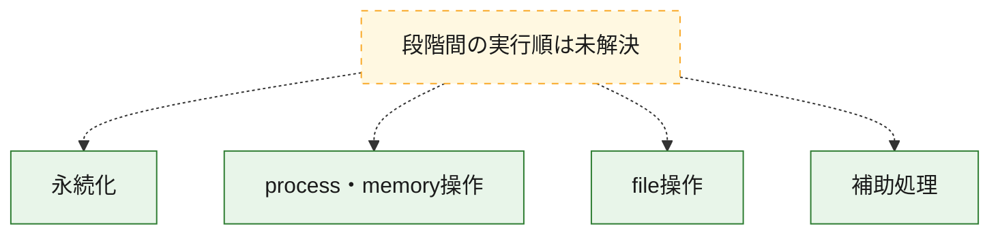
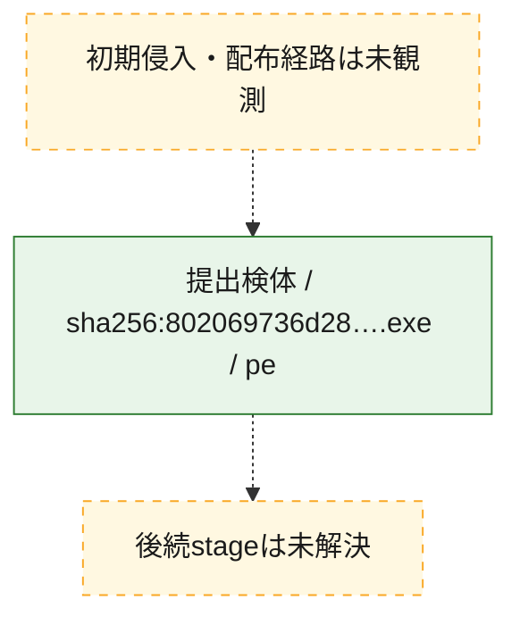
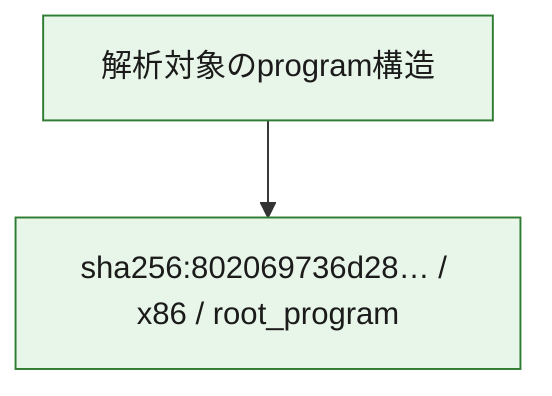

# 全体ロジック：802069736d28e5c16bce132a1cfe905f6f9c7ae44500cb32c3a34e93452400d6

代表関数の静的証跡から、永続化、process・memory操作、file操作の処理群を確認しました。

## 読み方

- phaseの掲載順は解析上の整理順です。observed_call_edgesがない段階間の実行順を断定しません。
- 図の実線は静的に観測した関係、点線と黄色のノードは未観測・未解決の関係を示します。
- 図は静的な要約であり、動的実行を再現するものではありません。
- 詳細な関数解説とfingerprintは[STATIC-LOGIC.md](STATIC-LOGIC.md)を参照してください。

## 静的可視化

### 実行フロー

### 感染チェーン

### モジュール関係

## 処理段階

### 1. 永続化

自動起動や永続化に関係する設定変更を確認します。
確度: `confirmed_static_function_evidence`

- `802069736d28e5c16bce132a1cfe905f6f9c7ae44500cb32c3a34e93452400d6:ghidra:0040139c` — 自動起動または永続化に関係する処理を含む関数です。 状態: `succeeded`、選定理由: `call_graph_centrality:in=0,out=1`, `reviewed_call_centrality:1`, `role:persistence`

### 2. process・memory操作

process、thread、module、memory操作と実行移行を確認します。
確度: `confirmed_static_function_evidence`

- `802069736d28e5c16bce132a1cfe905f6f9c7ae44500cb32c3a34e93452400d6:ghidra:004015a4` — process、thread、module、またはmemory操作に関係する関数です。 状態: `succeeded`、選定理由: `call_graph_centrality:in=1,out=3`, `reviewed_call_centrality:4`, `reviewed_call_centrality:6`, `role:process_or_memory_operation`
- `802069736d28e5c16bce132a1cfe905f6f9c7ae44500cb32c3a34e93452400d6:ghidra:00401608` — process、thread、module、またはmemory操作に関係する関数です。 状態: `succeeded`、選定理由: `call_graph_centrality:in=1,out=3`, `reviewed_call_centrality:4`, `reviewed_call_centrality:6`, `role:process_or_memory_operation`
- `802069736d28e5c16bce132a1cfe905f6f9c7ae44500cb32c3a34e93452400d6:ghidra:00401738` — process、thread、module、またはmemory操作に関係する関数です。 状態: `succeeded`、選定理由: `call_graph_centrality:in=2,out=1`, `reviewed_call_centrality:3`, `reviewed_call_centrality:5`, `role:process_or_memory_operation`
- `802069736d28e5c16bce132a1cfe905f6f9c7ae44500cb32c3a34e93452400d6:ghidra:00403fe0` — process、thread、module、またはmemory操作に関係する関数です。 状態: `succeeded`、選定理由: `call_graph_centrality:in=2,out=8`, `large_function:instructions=71`, `reviewed_call_centrality:12`, `reviewed_call_centrality:9`, `role:process_or_memory_operation`
- `802069736d28e5c16bce132a1cfe905f6f9c7ae44500cb32c3a34e93452400d6:ghidra:00405724` — process、thread、module、またはmemory操作に関係する関数です。 状態: `succeeded`、選定理由: `call_graph_centrality:in=1,out=10`, `large_function:instructions=184`, `reviewed_call_centrality:11`, `reviewed_call_centrality:23`, `role:process_or_memory_operation`

### 3. file操作

fileやdirectoryの作成、読書き、削除を確認します。
確度: `confirmed_static_function_evidence`

- `802069736d28e5c16bce132a1cfe905f6f9c7ae44500cb32c3a34e93452400d6:ghidra:00403f54` — fileまたはdirectoryの読書き・管理に関係する関数です。 状態: `succeeded`、選定理由: `call_graph_centrality:in=1,out=3`, `reviewed_call_centrality:4`, `reviewed_call_centrality:8`, `role:file_operation`
- `802069736d28e5c16bce132a1cfe905f6f9c7ae44500cb32c3a34e93452400d6:ghidra:004054e8` — fileまたはdirectoryの読書き・管理に関係する関数です。 状態: `succeeded`、選定理由: `call_graph_centrality:in=1,out=2`, `reviewed_call_centrality:3`, `reviewed_call_centrality:5`, `role:file_operation`
- `802069736d28e5c16bce132a1cfe905f6f9c7ae44500cb32c3a34e93452400d6:ghidra:0040556c` — fileまたはdirectoryの読書き・管理に関係する関数です。 状態: `succeeded`、選定理由: `call_graph_centrality:in=1,out=7`, `large_function:instructions=136`, `reviewed_call_centrality:16`, `reviewed_call_centrality:8`, `role:file_operation`

### 4. 補助処理

主要処理を支える一般内部関数またはlibrary処理を確認します。
確度: `confirmed_static_function_evidence_with_limits`

- `802069736d28e5c16bce132a1cfe905f6f9c7ae44500cb32c3a34e93452400d6:ghidra:0040274c` — 検体内部の一般処理を実装する関数です。 状態: `succeeded`、選定理由: `call_graph_centrality:in=28,out=2`, `reviewed_call_centrality:30`, `reviewed_call_centrality:8`
- `802069736d28e5c16bce132a1cfe905f6f9c7ae44500cb32c3a34e93452400d6:ghidra:0040276c` — 検体内部の一般処理を実装する関数です。 状態: `succeeded`、選定理由: `call_graph_centrality:in=29,out=2`, `reviewed_call_centrality:11`, `reviewed_call_centrality:32`
- `802069736d28e5c16bce132a1cfe905f6f9c7ae44500cb32c3a34e93452400d6:ghidra:00402948` — 検体内部の一般処理を実装する関数です。 状態: `succeeded`、選定理由: `call_graph_centrality:in=34,out=0`, `reviewed_call_centrality:17`, `reviewed_call_centrality:34`
- `802069736d28e5c16bce132a1cfe905f6f9c7ae44500cb32c3a34e93452400d6:ghidra:00402d3c` — 検体内部の一般処理を実装する関数です。 状態: `succeeded`、選定理由: `call_graph_centrality:in=30,out=0`, `reviewed_call_centrality:3`, `reviewed_call_centrality:32`
- `802069736d28e5c16bce132a1cfe905f6f9c7ae44500cb32c3a34e93452400d6:ghidra:00403350` — 検体内部の一般処理を実装する関数です。 状態: `succeeded`、選定理由: `call_graph_centrality:in=69,out=2`, `reviewed_call_centrality:2`, `reviewed_call_centrality:71`
- `802069736d28e5c16bce132a1cfe905f6f9c7ae44500cb32c3a34e93452400d6:ghidra:00403380` — 検体内部の一般処理を実装する関数です。 状態: `succeeded`、選定理由: `call_graph_centrality:in=96,out=0`, `reviewed_call_centrality:96`
- `802069736d28e5c16bce132a1cfe905f6f9c7ae44500cb32c3a34e93452400d6:ghidra:0040350c` — 検体内部の一般処理を実装する関数です。 状態: `succeeded`、選定理由: `call_graph_centrality:in=108,out=1`, `reviewed_call_centrality:1`, `reviewed_call_centrality:110`
- `802069736d28e5c16bce132a1cfe905f6f9c7ae44500cb32c3a34e93452400d6:ghidra:00403530` — 検体内部の一般処理を実装する関数です。 状態: `succeeded`、選定理由: `call_graph_centrality:in=49,out=1`, `reviewed_call_centrality:1`, `reviewed_call_centrality:51`
- `802069736d28e5c16bce132a1cfe905f6f9c7ae44500cb32c3a34e93452400d6:ghidra:0040357c` — 検体内部の一般処理を実装する関数です。 状態: `limited_bad_instruction_or_flow`、選定理由: `call_graph_centrality:in=113,out=2`, `reviewed_call_centrality:115`, `reviewed_call_centrality:2`
- `802069736d28e5c16bce132a1cfe905f6f9c7ae44500cb32c3a34e93452400d6:ghidra:004036a4` — 検体内部の一般処理を実装する関数です。 状態: `succeeded`、選定理由: `call_graph_centrality:in=103,out=0`, `reviewed_call_centrality:1`, `reviewed_call_centrality:103`
- `802069736d28e5c16bce132a1cfe905f6f9c7ae44500cb32c3a34e93452400d6:ghidra:004036fc` — 検体内部の一般処理を実装する関数です。 状態: `succeeded`、選定理由: `call_graph_centrality:in=90,out=0`, `reviewed_call_centrality:1`, `reviewed_call_centrality:90`
- `802069736d28e5c16bce132a1cfe905f6f9c7ae44500cb32c3a34e93452400d6:ghidra:00403b0c` — 検体内部の一般処理を実装する関数です。 状態: `limited_bad_instruction_or_flow`、選定理由: `call_graph_centrality:in=80,out=1`, `reviewed_call_centrality:1`, `reviewed_call_centrality:81`
- `802069736d28e5c16bce132a1cfe905f6f9c7ae44500cb32c3a34e93452400d6:ghidra:004040d0` — 検体内部の一般処理を実装する関数です。 状態: `succeeded`、選定理由: `call_graph_centrality:in=167,out=1`, `reviewed_call_centrality:170`, `reviewed_call_centrality:9`
- `802069736d28e5c16bce132a1cfe905f6f9c7ae44500cb32c3a34e93452400d6:ghidra:004040f4` — 検体内部の一般処理を実装する関数です。 状態: `succeeded`、選定理由: `call_graph_centrality:in=67,out=1`, `reviewed_call_centrality:2`, `reviewed_call_centrality:70`
- `802069736d28e5c16bce132a1cfe905f6f9c7ae44500cb32c3a34e93452400d6:ghidra:00404124` — 検体内部の一般処理を実装する関数です。 状態: `succeeded`、選定理由: `call_graph_centrality:in=77,out=3`, `reviewed_call_centrality:82`, `reviewed_call_centrality:9`
- `802069736d28e5c16bce132a1cfe905f6f9c7ae44500cb32c3a34e93452400d6:ghidra:00404168` — 検体内部の一般処理を実装する関数です。 状態: `succeeded`、選定理由: `call_graph_centrality:in=24,out=1`, `reviewed_call_centrality:1`, `reviewed_call_centrality:27`
- `802069736d28e5c16bce132a1cfe905f6f9c7ae44500cb32c3a34e93452400d6:ghidra:004041c0` — 検体内部の一般処理を実装する関数です。 状態: `succeeded`、選定理由: `call_graph_centrality:in=34,out=3`, `reviewed_call_centrality:10`, `reviewed_call_centrality:37`
- `802069736d28e5c16bce132a1cfe905f6f9c7ae44500cb32c3a34e93452400d6:ghidra:00404390` — 検体内部の一般処理を実装する関数です。 状態: `succeeded`、選定理由: `call_graph_centrality:in=73,out=0`, `reviewed_call_centrality:3`, `reviewed_call_centrality:73`
- `802069736d28e5c16bce132a1cfe905f6f9c7ae44500cb32c3a34e93452400d6:ghidra:004044dc` — 検体内部の一般処理を実装する関数です。 状態: `succeeded`、選定理由: `call_graph_centrality:in=32,out=0`, `large_function:instructions=75`, `reviewed_call_centrality:32`
- `802069736d28e5c16bce132a1cfe905f6f9c7ae44500cb32c3a34e93452400d6:ghidra:00404590` — 検体内部の一般処理を実装する関数です。 状態: `succeeded`、選定理由: `call_graph_centrality:in=74,out=0`, `reviewed_call_centrality:2`, `reviewed_call_centrality:74`
- `802069736d28e5c16bce132a1cfe905f6f9c7ae44500cb32c3a34e93452400d6:ghidra:004045f0` — 検体内部の一般処理を実装する関数です。 状態: `succeeded`、選定理由: `call_graph_centrality:in=25,out=2`, `reviewed_call_centrality:2`, `reviewed_call_centrality:27`
- `802069736d28e5c16bce132a1cfe905f6f9c7ae44500cb32c3a34e93452400d6:ghidra:004047dc` — 検体内部の一般処理を実装する関数です。 状態: `succeeded`、選定理由: `call_graph_centrality:in=28,out=1`, `reviewed_call_centrality:29`, `reviewed_call_centrality:5`
- `802069736d28e5c16bce132a1cfe905f6f9c7ae44500cb32c3a34e93452400d6:ghidra:00405fc4` — 検体内部の一般処理を実装する関数です。 状態: `succeeded`、選定理由: `call_graph_centrality:in=50,out=4`, `reviewed_call_centrality:54`, `reviewed_call_centrality:6`

## 観測したcall関係

- 代表関数間で直接解決できた呼出関係はありません。

## 解析範囲と制約

- 選定外関数は全体inventoryへ残しますが、関数本体の個別解説対象にはしていません。
- indirect call、難読化、packer、VM、壊れたcontrol flowによりcall関係が欠落する場合があります。
- 文書は静的解析に基づき、検体実行や外部通信による動的確認は行っていません。
