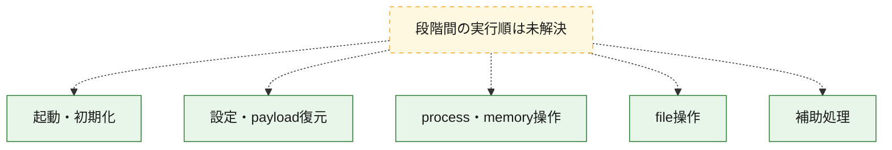
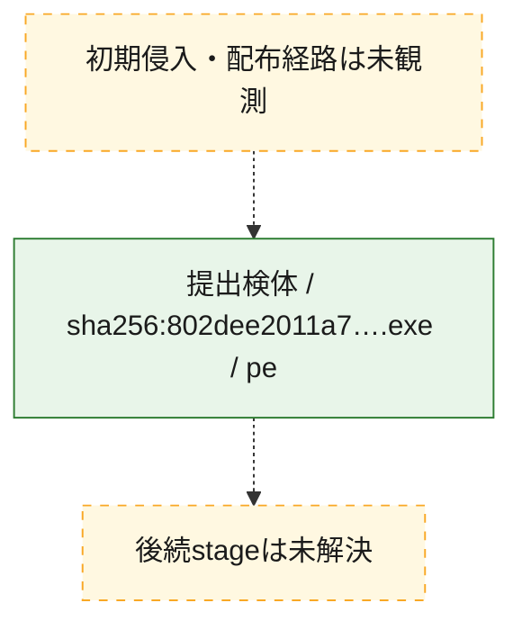
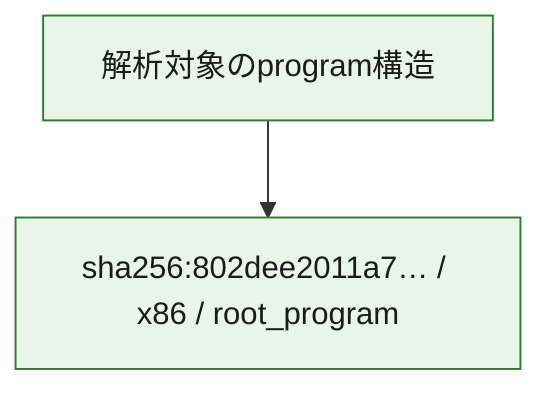

# 全体ロジック：802dee2011a757a13f6afc236e66c6e8440bc733eb001d849286c22d43b0017e

代表関数の静的証跡から、起動・初期化、設定・payload復元、process・memory操作、file操作の処理群を確認しました。

## 読み方

- phaseの掲載順は解析上の整理順です。observed_call_edgesがない段階間の実行順を断定しません。
- 図の実線は静的に観測した関係、点線と黄色のノードは未観測・未解決の関係を示します。
- 図は静的な要約であり、動的実行を再現するものではありません。
- 詳細な関数解説とfingerprintは[STATIC-LOGIC.md](STATIC-LOGIC.md)を参照してください。

## 静的可視化

### 実行フロー

### 感染チェーン

### モジュール関係

## 処理段階

### 1. 起動・初期化

entry pointから初期化と後続処理への移行を確認します。
確度: `confirmed_static_function_evidence`

- `802dee2011a757a13f6afc236e66c6e8440bc733eb001d849286c22d43b0017e:ghidra:180013e60` — 初期化と主要処理への分岐を行う入口関数です。 状態: `succeeded`、選定理由: `entry_point`, `meaningful_symbol_name`, `reviewed_call_centrality:5`, `role:entrypoint`
- `802dee2011a757a13f6afc236e66c6e8440bc733eb001d849286c22d43b0017e:ghidra:18002d7a0` — 初期化と主要処理への分岐を行う入口関数です。 状態: `succeeded`、選定理由: `entry_point`, `meaningful_symbol_name`, `reviewed_call_centrality:6`, `role:entrypoint`

### 2. 設定・payload復元

設定、resource、payload、暗号化データの復元・変換を確認します。
確度: `confirmed_static_function_evidence`

- `802dee2011a757a13f6afc236e66c6e8440bc733eb001d849286c22d43b0017e:ghidra:180010f40` — 暗号、hash、encoding、または復号処理に関係する関数です。 状態: `succeeded`、選定理由: `context_representative`, `reviewed_call_centrality:12`, `role:cryptographic_transform`

### 3. process・memory操作

process、thread、module、memory操作と実行移行を確認します。
確度: `confirmed_static_function_evidence`

- `802dee2011a757a13f6afc236e66c6e8440bc733eb001d849286c22d43b0017e:ghidra:1800139f0` — process、thread、module、またはmemory操作に関係する関数です。 状態: `succeeded`、選定理由: `context_representative`, `reviewed_call_centrality:7`, `role:process_or_memory_operation`
- `802dee2011a757a13f6afc236e66c6e8440bc733eb001d849286c22d43b0017e:ghidra:1800156c4` — process、thread、module、またはmemory操作に関係する関数です。 状態: `succeeded`、選定理由: `context_representative`, `reviewed_call_centrality:10`, `role:process_or_memory_operation`
- `802dee2011a757a13f6afc236e66c6e8440bc733eb001d849286c22d43b0017e:ghidra:180015e20` — process、thread、module、またはmemory操作に関係する関数です。 状態: `succeeded`、選定理由: `context_representative`, `reviewed_call_centrality:13`, `role:process_or_memory_operation`

### 4. file操作

fileやdirectoryの作成、読書き、削除を確認します。
確度: `confirmed_static_function_evidence`

- `802dee2011a757a13f6afc236e66c6e8440bc733eb001d849286c22d43b0017e:ghidra:180017180` — fileまたはdirectoryの読書き・管理に関係する関数です。 状態: `succeeded`、選定理由: `context_representative`, `reviewed_call_centrality:12`, `role:file_operation`

### 5. 補助処理

主要処理を支える一般内部関数またはlibrary処理を確認します。
確度: `confirmed_static_function_evidence`

- `802dee2011a757a13f6afc236e66c6e8440bc733eb001d849286c22d43b0017e:ghidra:18000cc90` — 検体内部の一般処理を実装する関数です。 状態: `succeeded`、選定理由: `context_representative`, `reviewed_call_centrality:12`
- `802dee2011a757a13f6afc236e66c6e8440bc733eb001d849286c22d43b0017e:ghidra:18000e1a0` — 検体内部の一般処理を実装する関数です。 状態: `succeeded`、選定理由: `context_representative`, `reviewed_call_centrality:9`
- `802dee2011a757a13f6afc236e66c6e8440bc733eb001d849286c22d43b0017e:ghidra:18000e710` — 検体内部の一般処理を実装する関数です。 状態: `succeeded`、選定理由: `context_representative`, `reviewed_call_centrality:10`
- `802dee2011a757a13f6afc236e66c6e8440bc733eb001d849286c22d43b0017e:ghidra:18000f240` — 検体内部の一般処理を実装する関数です。 状態: `succeeded`、選定理由: `context_representative`, `reviewed_call_centrality:2`
- `802dee2011a757a13f6afc236e66c6e8440bc733eb001d849286c22d43b0017e:ghidra:18000f8a0` — 検体内部の一般処理を実装する関数です。 状態: `succeeded`、選定理由: `context_representative`, `reviewed_call_centrality:5`
- `802dee2011a757a13f6afc236e66c6e8440bc733eb001d849286c22d43b0017e:ghidra:18000fa40` — 検体内部の一般処理を実装する関数です。 状態: `succeeded`、選定理由: `context_representative`, `reviewed_call_centrality:1`
- `802dee2011a757a13f6afc236e66c6e8440bc733eb001d849286c22d43b0017e:ghidra:18000faec` — 検体内部の一般処理を実装する関数です。 状態: `succeeded`、選定理由: `context_representative`, `reviewed_call_centrality:5`
- `802dee2011a757a13f6afc236e66c6e8440bc733eb001d849286c22d43b0017e:ghidra:180010020` — 検体内部の一般処理を実装する関数です。 状態: `succeeded`、選定理由: `context_representative`, `reviewed_call_centrality:7`
- `802dee2011a757a13f6afc236e66c6e8440bc733eb001d849286c22d43b0017e:ghidra:1800107d8` — 検体内部の一般処理を実装する関数です。 状態: `succeeded`、選定理由: `context_representative`, `reviewed_call_centrality:13`
- `802dee2011a757a13f6afc236e66c6e8440bc733eb001d849286c22d43b0017e:ghidra:180011140` — 検体内部の一般処理を実装する関数です。 状態: `succeeded`、選定理由: `context_representative`, `reviewed_call_centrality:4`
- `802dee2011a757a13f6afc236e66c6e8440bc733eb001d849286c22d43b0017e:ghidra:180011610` — 検体内部の一般処理を実装する関数です。 状態: `succeeded`、選定理由: `context_representative`, `reviewed_call_centrality:16`
- `802dee2011a757a13f6afc236e66c6e8440bc733eb001d849286c22d43b0017e:ghidra:180012a00` — 検体内部の一般処理を実装する関数です。 状態: `succeeded`、選定理由: `context_representative`, `reviewed_call_centrality:3`
- `802dee2011a757a13f6afc236e66c6e8440bc733eb001d849286c22d43b0017e:ghidra:180012b0c` — 検体内部の一般処理を実装する関数です。 状態: `succeeded`、選定理由: `context_representative`, `reviewed_call_centrality:19`
- `802dee2011a757a13f6afc236e66c6e8440bc733eb001d849286c22d43b0017e:ghidra:180013740` — 検体内部の一般処理を実装する関数です。 状態: `succeeded`、選定理由: `context_representative`, `reviewed_call_centrality:5`
- `802dee2011a757a13f6afc236e66c6e8440bc733eb001d849286c22d43b0017e:ghidra:180013970` — 検体内部の一般処理を実装する関数です。 状態: `succeeded`、選定理由: `context_representative`, `reviewed_call_centrality:1`
- `802dee2011a757a13f6afc236e66c6e8440bc733eb001d849286c22d43b0017e:ghidra:180013f58` — 検体内部の一般処理を実装する関数です。 状態: `succeeded`、選定理由: `context_representative`, `reviewed_call_centrality:5`
- `802dee2011a757a13f6afc236e66c6e8440bc733eb001d849286c22d43b0017e:ghidra:180016680` — 検体内部の一般処理を実装する関数です。 状態: `succeeded`、選定理由: `context_representative`, `reviewed_call_centrality:3`
- `802dee2011a757a13f6afc236e66c6e8440bc733eb001d849286c22d43b0017e:ghidra:180016800` — 検体内部の一般処理を実装する関数です。 状態: `succeeded`、選定理由: `context_representative`, `reviewed_call_centrality:9`
- `802dee2011a757a13f6afc236e66c6e8440bc733eb001d849286c22d43b0017e:ghidra:1800170b8` — 検体内部の一般処理を実装する関数です。 状態: `succeeded`、選定理由: `context_representative`, `reviewed_call_centrality:3`
- `802dee2011a757a13f6afc236e66c6e8440bc733eb001d849286c22d43b0017e:ghidra:1800179b8` — 検体内部の一般処理を実装する関数です。 状態: `succeeded`、選定理由: `context_representative`, `reviewed_call_centrality:5`
- `802dee2011a757a13f6afc236e66c6e8440bc733eb001d849286c22d43b0017e:ghidra:180017bb0` — 検体内部の一般処理を実装する関数です。 状態: `succeeded`、選定理由: `context_representative`, `reviewed_call_centrality:4`
- `802dee2011a757a13f6afc236e66c6e8440bc733eb001d849286c22d43b0017e:ghidra:180017e78` — 検体内部の一般処理を実装する関数です。 状態: `succeeded`、選定理由: `context_representative`, `reviewed_call_centrality:9`
- `802dee2011a757a13f6afc236e66c6e8440bc733eb001d849286c22d43b0017e:ghidra:1800186a0` — 検体内部の一般処理を実装する関数です。 状態: `succeeded`、選定理由: `context_representative`, `reviewed_call_centrality:14`
- `802dee2011a757a13f6afc236e66c6e8440bc733eb001d849286c22d43b0017e:ghidra:180019360` — 検体内部の一般処理を実装する関数です。 状態: `succeeded`、選定理由: `context_representative`, `reviewed_call_centrality:9`
- `802dee2011a757a13f6afc236e66c6e8440bc733eb001d849286c22d43b0017e:ghidra:180019710` — 検体内部の一般処理を実装する関数です。 状態: `succeeded`、選定理由: `context_representative`

## 観測したcall関係

- 代表関数間で直接解決できた呼出関係はありません。

## 解析範囲と制約

- 選定外関数は全体inventoryへ残しますが、関数本体の個別解説対象にはしていません。
- indirect call、難読化、packer、VM、壊れたcontrol flowによりcall関係が欠落する場合があります。
- 文書は静的解析に基づき、検体実行や外部通信による動的確認は行っていません。
