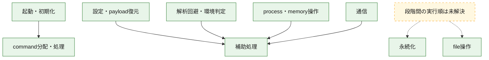

# 全体ロジック：80719d8ef5d25edada79486feff7f73f914409c24faf0979ab805010c0140663

代表関数の静的証跡から、起動・初期化、設定・payload復元、解析回避・環境判定、永続化、process・memory操作、通信、command分配・処理、file操作の処理群を確認しました。

## 読み方

- phaseの掲載順は解析上の整理順です。observed_call_edgesがない段階間の実行順を断定しません。
- 図の実線は静的に観測した関係、点線と黄色のノードは未観測・未解決の関係を示します。
- 図は静的な要約であり、動的実行を再現するものではありません。
- 詳細な関数解説とfingerprintは[STATIC-LOGIC.md](STATIC-LOGIC.md)を参照してください。

## 静的可視化

### 実行フロー

### 感染チェーン

```mermaid
flowchart TD
  chain_initial["初期侵入・配布経路は未観測"]
  chain_01["提出検体 / sha256:80719d8ef5d2….exe / pe"]
  chain_02["静的復元層 1 / sha256:80719d8ef5d2….exe::embedded-pe / pe"]
  chain_03["静的復元層 1 / sha256:80719d8ef5d2….exe::embedded-pe / pe"]
  chain_04["静的復元層 1 / sha256:80719d8ef5d2….exe::embedded-pe / pe"]
  chain_05["静的復元層 1 / sha256:80719d8ef5d2….exe::embedded-pe / pe"]
  chain_06["静的復元層 1 / sha256:80719d8ef5d2….exe::embedded-pe / pe"]
  chain_07["静的復元層 1 / sha256:80719d8ef5d2….exe::embedded-pe / pe"]
  chain_08["静的復元層 1 / sha256:80719d8ef5d2….exe::embedded-pe / pe"]
  chain_09["静的復元層 1 / sha256:80719d8ef5d2….exe::embedded-pe / pe"]
  chain_10["静的復元層 1 / sha256:80719d8ef5d2….exe::embedded-pe / pe"]
  chain_11["静的復元層 1 / sha256:80719d8ef5d2….exe::embedded-pe / pe"]
  chain_12["静的復元層 1 / sha256:80719d8ef5d2….exe::embedded-pe / pe"]
  chain_13["静的復元層 1 / sha256:80719d8ef5d2….exe::embedded-pe / pe"]
  chain_14["静的復元層 1 / sha256:80719d8ef5d2….exe::embedded-pe / pe"]
  chain_15["静的復元層 1 / sha256:80719d8ef5d2….exe::embedded-pe / pe"]
  chain_16["静的復元層 1 / sha256:80719d8ef5d2….exe::embedded-pe / pe"]
  chain_01 -->|embedded-pe| chain_02
  chain_01 -->|embedded-pe| chain_03
  chain_01 -->|embedded-pe| chain_04
  chain_01 -->|embedded-pe| chain_05
  chain_01 -->|embedded-pe| chain_06
  chain_01 -->|embedded-pe| chain_07
  chain_01 -->|embedded-pe| chain_08
  chain_01 -->|embedded-pe| chain_09
  chain_01 -->|embedded-pe| chain_10
  chain_01 -->|embedded-pe| chain_11
  chain_01 -->|embedded-pe| chain_12
  chain_01 -->|embedded-pe| chain_13
  chain_01 -->|embedded-pe| chain_14
  chain_01 -->|embedded-pe| chain_15
  chain_01 -->|embedded-pe| chain_16
  chain_initial -.-> chain_01
  chain_more["その他1層はstatic-layers.jsonを参照"]
  chain_02 -.-> chain_more
  chain_03 -.-> chain_more
  chain_04 -.-> chain_more
  chain_05 -.-> chain_more
  chain_06 -.-> chain_more
  chain_07 -.-> chain_more
  chain_08 -.-> chain_more
  chain_09 -.-> chain_more
  chain_10 -.-> chain_more
  chain_11 -.-> chain_more
  chain_12 -.-> chain_more
  chain_13 -.-> chain_more
  chain_14 -.-> chain_more
  chain_15 -.-> chain_more
  chain_16 -.-> chain_more
  class chain_more unresolved
  class chain_01,chain_02,chain_03,chain_04,chain_05,chain_06,chain_07,chain_08,chain_09,chain_10,chain_11,chain_12,chain_13,chain_14,chain_15,chain_16 confirmed
  class chain_initial unresolved
  classDef confirmed fill:#e8f5e9,stroke:#2e7d32,color:#1b1b1b
  classDef unresolved fill:#fff8e1,stroke:#f9a825,color:#1b1b1b,stroke-dasharray:5 5
```

### モジュール関係

```mermaid
flowchart TD
  module_scope["解析対象のprogram構造"]
  module_01["sha256:b034fa86fda7… / x86 / statically_recovered_program"]
  module_02["sha256:e6aa7f1637e2… / x86 / statically_recovered_program"]
  module_03["sha256:3f8e7e6aa13b… / x86 / statically_recovered_program"]
  module_04["sha256:eff52743773e… / x86 / statically_recovered_program"]
  module_05["sha256:6f7bdc2f60a1… / x86 / statically_recovered_program"]
  module_06["sha256:87dd0c858620… / x86 / statically_recovered_program"]
  module_07["sha256:a19e3c7c03ef… / x86 / statically_recovered_program"]
  module_08["sha256:00b8ca9a338d… / x86 / statically_recovered_program"]
  module_09["sha256:c148292328f0… / x86 / statically_recovered_program"]
  module_10["sha256:02e30b6a2bee… / x86 / statically_recovered_program"]
  module_11["sha256:f5e01b516c2c… / x86 / statically_recovered_program"]
  module_12["sha256:ba5388d6a655… / x86 / statically_recovered_program"]
  module_parent_unknown["復元元・親moduleは未特定"]
  module_parent_unknown -.-> module_01
  module_parent_unknown -.-> module_02
  module_parent_unknown -.-> module_03
  module_parent_unknown -.-> module_04
  module_parent_unknown -.-> module_05
  module_parent_unknown -.-> module_06
  module_parent_unknown -.-> module_07
  module_parent_unknown -.-> module_08
  module_parent_unknown -.-> module_09
  module_parent_unknown -.-> module_10
  module_parent_unknown -.-> module_11
  module_parent_unknown -.-> module_12
  class module_parent_unknown unresolved
  module_more["その他5moduleはstatic-logic.jsonを参照"]
  module_scope -.-> module_more
  class module_more unresolved
  class module_scope confirmed
  class module_01,module_02,module_03,module_04,module_05,module_06,module_07,module_08,module_09,module_10,module_11,module_12 confirmed
  classDef confirmed fill:#e8f5e9,stroke:#2e7d32,color:#1b1b1b
  classDef unresolved fill:#fff8e1,stroke:#f9a825,color:#1b1b1b,stroke-dasharray:5 5
```

## 処理段階

### 1. 起動・初期化

entry pointから初期化と後続処理への移行を確認します。
確度: `confirmed_static_function_evidence`

- `b034fa86fda7ec312142756f5013bf5cdb0ad2dcf8549820259cd3691074d699:ghidra:180001598` — 初期化と主要処理への分岐を行う入口関数です。 状態: `succeeded`、選定理由: `call_graph_centrality:in=0,out=2`, `entry_point`, `meaningful_symbol_name`, `reviewed_call_centrality:2`, `role:entrypoint`
- `e6aa7f1637e211251c9d6f467203b2b6d85e5bc2d901699f2a55af637fa89250:ghidra:1800012e8` — 初期化と主要処理への分岐を行う入口関数です。 状態: `succeeded`、選定理由: `call_graph_centrality:in=1,out=4`, `entry_point`, `large_function:instructions=95`, `meaningful_symbol_name`, `reviewed_call_centrality:5`, `reviewed_call_centrality:7`, `role:entrypoint`
- `e6aa7f1637e211251c9d6f467203b2b6d85e5bc2d901699f2a55af637fa89250:ghidra:18000141c` — 初期化と主要処理への分岐を行う入口関数です。 状態: `succeeded`、選定理由: `call_graph_centrality:in=0,out=2`, `entry_point`, `meaningful_symbol_name`, `reviewed_call_centrality:2`, `role:entrypoint`
- `e6aa7f1637e211251c9d6f467203b2b6d85e5bc2d901699f2a55af637fa89250:ghidra:180001684` — 初期化と主要処理への分岐を行う入口関数です。 状態: `succeeded`、選定理由: `call_graph_centrality:in=1,out=1`, `entry_point`, `meaningful_symbol_name`, `reviewed_call_centrality:2`, `reviewed_call_centrality:3`, `role:entrypoint`
- `3f8e7e6aa13b417acc78b63434fb1144e6319a010a9fc376c54d6e69b638fe4c:ghidra:180001378` — 初期化と主要処理への分岐を行う入口関数です。 状態: `succeeded`、選定理由: `call_graph_centrality:in=1,out=4`, `entry_point`, `large_function:instructions=95`, `meaningful_symbol_name`, `reviewed_call_centrality:5`, `reviewed_call_centrality:7`, `role:entrypoint`
- `3f8e7e6aa13b417acc78b63434fb1144e6319a010a9fc376c54d6e69b638fe4c:ghidra:1800014ac` — 初期化と主要処理への分岐を行う入口関数です。 状態: `succeeded`、選定理由: `call_graph_centrality:in=0,out=2`, `entry_point`, `meaningful_symbol_name`, `reviewed_call_centrality:2`, `role:entrypoint`
- `3f8e7e6aa13b417acc78b63434fb1144e6319a010a9fc376c54d6e69b638fe4c:ghidra:180001714` — 初期化と主要処理への分岐を行う入口関数です。 状態: `succeeded`、選定理由: `call_graph_centrality:in=1,out=1`, `entry_point`, `meaningful_symbol_name`, `reviewed_call_centrality:2`, `reviewed_call_centrality:3`, `role:entrypoint`
- `eff52743773eb550fcc6ce3efc37c85724502233b6b002a35496d828bd7b280a:ghidra:180004bac` — 初期化と主要処理への分岐を行う入口関数です。 状態: `succeeded`、選定理由: `call_graph_centrality:in=1,out=4`, `entry_point`, `large_function:instructions=95`, `meaningful_symbol_name`, `reviewed_call_centrality:5`, `reviewed_call_centrality:7`, `role:entrypoint`
- `eff52743773eb550fcc6ce3efc37c85724502233b6b002a35496d828bd7b280a:ghidra:180004ce0` — 初期化と主要処理への分岐を行う入口関数です。 状態: `succeeded`、選定理由: `call_graph_centrality:in=0,out=2`, `entry_point`, `meaningful_symbol_name`, `reviewed_call_centrality:2`, `role:entrypoint`
- `eff52743773eb550fcc6ce3efc37c85724502233b6b002a35496d828bd7b280a:ghidra:180004f48` — 初期化と主要処理への分岐を行う入口関数です。 状態: `succeeded`、選定理由: `call_graph_centrality:in=1,out=1`, `entry_point`, `meaningful_symbol_name`, `reviewed_call_centrality:2`, `reviewed_call_centrality:3`, `role:entrypoint`
- `6f7bdc2f60a1795b58ec7015ec262d6b234aa8d0f022185de0f52bac4adab449:ghidra:1800016d8` — 初期化と主要処理への分岐を行う入口関数です。 状態: `succeeded`、選定理由: `call_graph_centrality:in=1,out=4`, `entry_point`, `large_function:instructions=95`, `meaningful_symbol_name`, `reviewed_call_centrality:5`, `reviewed_call_centrality:7`, `role:entrypoint`
- `6f7bdc2f60a1795b58ec7015ec262d6b234aa8d0f022185de0f52bac4adab449:ghidra:18000180c` — 初期化と主要処理への分岐を行う入口関数です。 状態: `succeeded`、選定理由: `call_graph_centrality:in=0,out=2`, `entry_point`, `meaningful_symbol_name`, `reviewed_call_centrality:2`, `role:entrypoint`
- `6f7bdc2f60a1795b58ec7015ec262d6b234aa8d0f022185de0f52bac4adab449:ghidra:180001a74` — 初期化と主要処理への分岐を行う入口関数です。 状態: `succeeded`、選定理由: `call_graph_centrality:in=1,out=1`, `entry_point`, `meaningful_symbol_name`, `reviewed_call_centrality:2`, `reviewed_call_centrality:3`, `role:entrypoint`
- `87dd0c858620287454fd6d31d52b6a48eddbb2a08e09e8b2d9fdb0b92200d766:ghidra:180003ef8` — 初期化と主要処理への分岐を行う入口関数です。 状態: `succeeded`、選定理由: `call_graph_centrality:in=1,out=4`, `entry_point`, `large_function:instructions=95`, `meaningful_symbol_name`, `reviewed_call_centrality:5`, `reviewed_call_centrality:7`, `role:entrypoint`
- `87dd0c858620287454fd6d31d52b6a48eddbb2a08e09e8b2d9fdb0b92200d766:ghidra:18000402c` — 初期化と主要処理への分岐を行う入口関数です。 状態: `succeeded`、選定理由: `call_graph_centrality:in=0,out=2`, `entry_point`, `meaningful_symbol_name`, `reviewed_call_centrality:2`, `role:entrypoint`
- `87dd0c858620287454fd6d31d52b6a48eddbb2a08e09e8b2d9fdb0b92200d766:ghidra:180004294` — 初期化と主要処理への分岐を行う入口関数です。 状態: `succeeded`、選定理由: `call_graph_centrality:in=1,out=1`, `entry_point`, `meaningful_symbol_name`, `reviewed_call_centrality:2`, `reviewed_call_centrality:3`, `role:entrypoint`
- `a19e3c7c03ef1b5625790b1c9c42594909311ab6df540fbf43c6aa93300ab166:ghidra:180002488` — 初期化と主要処理への分岐を行う入口関数です。 状態: `succeeded`、選定理由: `call_graph_centrality:in=1,out=4`, `entry_point`, `large_function:instructions=95`, `meaningful_symbol_name`, `reviewed_call_centrality:5`, `reviewed_call_centrality:7`, `role:entrypoint`
- `a19e3c7c03ef1b5625790b1c9c42594909311ab6df540fbf43c6aa93300ab166:ghidra:1800025bc` — 初期化と主要処理への分岐を行う入口関数です。 状態: `succeeded`、選定理由: `call_graph_centrality:in=0,out=2`, `entry_point`, `meaningful_symbol_name`, `reviewed_call_centrality:2`, `role:entrypoint`
- `a19e3c7c03ef1b5625790b1c9c42594909311ab6df540fbf43c6aa93300ab166:ghidra:180002824` — 初期化と主要処理への分岐を行う入口関数です。 状態: `succeeded`、選定理由: `call_graph_centrality:in=1,out=1`, `entry_point`, `meaningful_symbol_name`, `reviewed_call_centrality:2`, `reviewed_call_centrality:3`, `role:entrypoint`
- `00b8ca9a338d2b47285c9e56d6d893db2a999b47216756f18439997fb80a56e3:ghidra:18000a4e4` — 初期化と主要処理への分岐を行う入口関数です。 状態: `succeeded`、選定理由: `call_graph_centrality:in=1,out=4`, `entry_point`, `large_function:instructions=95`, `meaningful_symbol_name`, `reviewed_call_centrality:5`, `reviewed_call_centrality:7`, `role:entrypoint`
- `00b8ca9a338d2b47285c9e56d6d893db2a999b47216756f18439997fb80a56e3:ghidra:18000a618` — 初期化と主要処理への分岐を行う入口関数です。 状態: `succeeded`、選定理由: `call_graph_centrality:in=0,out=2`, `entry_point`, `meaningful_symbol_name`, `reviewed_call_centrality:2`, `role:entrypoint`
- `00b8ca9a338d2b47285c9e56d6d893db2a999b47216756f18439997fb80a56e3:ghidra:18000a704` — 初期化と主要処理への分岐を行う入口関数です。 状態: `succeeded`、選定理由: `call_graph_centrality:in=1,out=1`, `entry_point`, `meaningful_symbol_name`, `reviewed_call_centrality:2`, `reviewed_call_centrality:3`, `role:entrypoint`
- `c148292328f0aab7863af82f54f613961e7cb95b7215f7a81cafaf45bd4c42b7:ghidra:180005b88` — 初期化と主要処理への分岐を行う入口関数です。 状態: `succeeded`、選定理由: `call_graph_centrality:in=1,out=4`, `entry_point`, `large_function:instructions=95`, `meaningful_symbol_name`, `reviewed_call_centrality:5`, `reviewed_call_centrality:7`, `role:entrypoint`
- `c148292328f0aab7863af82f54f613961e7cb95b7215f7a81cafaf45bd4c42b7:ghidra:180005cbc` — 初期化と主要処理への分岐を行う入口関数です。 状態: `succeeded`、選定理由: `call_graph_centrality:in=0,out=2`, `entry_point`, `meaningful_symbol_name`, `reviewed_call_centrality:2`, `role:entrypoint`
- `02e30b6a2bee5be5336e40a9c89575603051bde86f9c9cdc78b7fa7d9b7bd1f0:ghidra:180007798` — 初期化と主要処理への分岐を行う入口関数です。 状態: `succeeded`、選定理由: `call_graph_centrality:in=1,out=4`, `entry_point`, `large_function:instructions=95`, `meaningful_symbol_name`, `reviewed_call_centrality:5`, `reviewed_call_centrality:7`, `role:entrypoint`
- `02e30b6a2bee5be5336e40a9c89575603051bde86f9c9cdc78b7fa7d9b7bd1f0:ghidra:1800078cc` — 初期化と主要処理への分岐を行う入口関数です。 状態: `succeeded`、選定理由: `call_graph_centrality:in=0,out=2`, `entry_point`, `meaningful_symbol_name`, `reviewed_call_centrality:2`, `role:entrypoint`
- `02e30b6a2bee5be5336e40a9c89575603051bde86f9c9cdc78b7fa7d9b7bd1f0:ghidra:180007b34` — 初期化と主要処理への分岐を行う入口関数です。 状態: `succeeded`、選定理由: `call_graph_centrality:in=1,out=1`, `entry_point`, `meaningful_symbol_name`, `reviewed_call_centrality:2`, `reviewed_call_centrality:3`, `role:entrypoint`
- `f5e01b516c2c23035f7703e23569dec26c5616c05a929b2580ae474a5c6722c5:ghidra:1800136b8` — 初期化と主要処理への分岐を行う入口関数です。 状態: `succeeded`、選定理由: `call_graph_centrality:in=1,out=4`, `entry_point`, `large_function:instructions=95`, `meaningful_symbol_name`, `reviewed_call_centrality:5`, `reviewed_call_centrality:7`, `role:entrypoint`
- `f5e01b516c2c23035f7703e23569dec26c5616c05a929b2580ae474a5c6722c5:ghidra:1800137ec` — 初期化と主要処理への分岐を行う入口関数です。 状態: `succeeded`、選定理由: `call_graph_centrality:in=0,out=2`, `entry_point`, `meaningful_symbol_name`, `reviewed_call_centrality:2`, `role:entrypoint`
- `f5e01b516c2c23035f7703e23569dec26c5616c05a929b2580ae474a5c6722c5:ghidra:180013a54` — 初期化と主要処理への分岐を行う入口関数です。 状態: `succeeded`、選定理由: `call_graph_centrality:in=1,out=1`, `entry_point`, `meaningful_symbol_name`, `reviewed_call_centrality:2`, `reviewed_call_centrality:3`, `role:entrypoint`
- `ba5388d6a6557d431e086734a3323621dc447f63ba299b0a815e5837cf869678:ghidra:180002af4` — 初期化と主要処理への分岐を行う入口関数です。 状態: `succeeded`、選定理由: `call_graph_centrality:in=1,out=4`, `entry_point`, `large_function:instructions=95`, `meaningful_symbol_name`, `reviewed_call_centrality:5`, `reviewed_call_centrality:7`, `role:entrypoint`
- `ba5388d6a6557d431e086734a3323621dc447f63ba299b0a815e5837cf869678:ghidra:180002c28` — 初期化と主要処理への分岐を行う入口関数です。 状態: `succeeded`、選定理由: `call_graph_centrality:in=0,out=2`, `entry_point`, `meaningful_symbol_name`, `reviewed_call_centrality:2`, `role:entrypoint`
- `ba5388d6a6557d431e086734a3323621dc447f63ba299b0a815e5837cf869678:ghidra:180002d14` — 初期化と主要処理への分岐を行う入口関数です。 状態: `succeeded`、選定理由: `call_graph_centrality:in=1,out=1`, `entry_point`, `meaningful_symbol_name`, `reviewed_call_centrality:2`, `reviewed_call_centrality:3`, `role:entrypoint`
- `980a63f2b39cf16910f44384398e25f24482346a482addb00de42555b17d4278:ghidra:180020b14` — 初期化と主要処理への分岐を行う入口関数です。 状態: `succeeded`、選定理由: `call_graph_centrality:in=1,out=4`, `entry_point`, `large_function:instructions=95`, `meaningful_symbol_name`, `reviewed_call_centrality:6`, `reviewed_call_centrality:7`, `role:entrypoint`
- `980a63f2b39cf16910f44384398e25f24482346a482addb00de42555b17d4278:ghidra:180020c48` — 初期化と主要処理への分岐を行う入口関数です。 状態: `succeeded`、選定理由: `call_graph_centrality:in=0,out=2`, `entry_point`, `meaningful_symbol_name`, `reviewed_call_centrality:2`, `role:entrypoint`
- `980a63f2b39cf16910f44384398e25f24482346a482addb00de42555b17d4278:ghidra:180020d34` — 初期化と主要処理への分岐を行う入口関数です。 状態: `succeeded`、選定理由: `call_graph_centrality:in=1,out=1`, `entry_point`, `meaningful_symbol_name`, `reviewed_call_centrality:2`, `reviewed_call_centrality:3`, `role:entrypoint`
- `7546f9166f1f7f7720878a76302ca54b48e34479b9a5764f2012dd0d9b7c1d4e:ghidra:2afbd1292` — 初期化と主要処理への分岐を行う入口関数です。 状態: `succeeded`、選定理由: `entry_point`, `meaningful_symbol_name`, `reviewed_call_centrality:1`, `role:entrypoint`
- `80719d8ef5d25edada79486feff7f73f914409c24faf0979ab805010c0140663:ghidra:1400010f6` — 初期化と主要処理への分岐を行う入口関数です。 状態: `succeeded`、選定理由: `entry_point`, `meaningful_symbol_name`, `reviewed_call_centrality:1`, `role:entrypoint`

### 2. 設定・payload復元

設定、resource、payload、暗号化データの復元・変換を確認します。
確度: `confirmed_static_function_evidence_with_limits`

- `b034fa86fda7ec312142756f5013bf5cdb0ad2dcf8549820259cd3691074d699:ghidra:180001010` — 設定、resource、payloadなどの解析・変換を行う関数です。 状態: `succeeded`、選定理由: `call_graph_centrality:in=0,out=7`, `reviewed_call_centrality:13`, `reviewed_call_centrality:7`, `role:config_or_data_transform`
- `b034fa86fda7ec312142756f5013bf5cdb0ad2dcf8549820259cd3691074d699:ghidra:180001100` — 設定、resource、payloadなどの解析・変換を行う関数です。 状態: `succeeded`、選定理由: `call_graph_centrality:in=0,out=7`, `reviewed_call_centrality:13`, `reviewed_call_centrality:7`, `role:config_or_data_transform`
- `b034fa86fda7ec312142756f5013bf5cdb0ad2dcf8549820259cd3691074d699:ghidra:180001b14` — 設定、resource、payloadなどの解析・変換を行う関数です。 状態: `succeeded`、選定理由: `call_graph_centrality:in=0,out=2`, `reviewed_call_centrality:2`, `role:config_or_data_transform`
- `3f8e7e6aa13b417acc78b63434fb1144e6319a010a9fc376c54d6e69b638fe4c:ghidra:180001ffc` — 設定、resource、payloadなどの解析・変換を行う関数です。 状態: `succeeded`、選定理由: `call_graph_centrality:in=0,out=3`, `large_function:instructions=67`, `reviewed_call_centrality:3`, `reviewed_call_centrality:5`, `role:config_or_data_transform`
- `3f8e7e6aa13b417acc78b63434fb1144e6319a010a9fc376c54d6e69b638fe4c:ghidra:180002304` — 設定、resource、payloadなどの解析・変換を行う関数です。 状態: `succeeded`、選定理由: `call_graph_centrality:in=0,out=4`, `reviewed_call_centrality:4`, `reviewed_call_centrality:6`, `role:config_or_data_transform`
- `3f8e7e6aa13b417acc78b63434fb1144e6319a010a9fc376c54d6e69b638fe4c:ghidra:180002428` — 設定、resource、payloadなどの解析・変換を行う関数です。 状態: `succeeded`、選定理由: `call_graph_centrality:in=0,out=2`, `reviewed_call_centrality:2`, `reviewed_call_centrality:3`, `role:config_or_data_transform`
- `6f7bdc2f60a1795b58ec7015ec262d6b234aa8d0f022185de0f52bac4adab449:ghidra:180002aa4` — 設定、resource、payloadなどの解析・変換を行う関数です。 状態: `succeeded`、選定理由: `call_graph_centrality:in=0,out=12`, `large_function:instructions=86`, `reviewed_call_centrality:12`, `reviewed_call_centrality:21`, `role:config_or_data_transform`
- `6f7bdc2f60a1795b58ec7015ec262d6b234aa8d0f022185de0f52bac4adab449:ghidra:180003100` — 設定、resource、payloadなどの解析・変換を行う関数です。 状態: `succeeded`、選定理由: `call_graph_centrality:in=0,out=11`, `large_function:instructions=152`, `reviewed_call_centrality:12`, `reviewed_call_centrality:20`, `role:config_or_data_transform`
- `6f7bdc2f60a1795b58ec7015ec262d6b234aa8d0f022185de0f52bac4adab449:ghidra:180004350` — 設定、resource、payloadなどの解析・変換を行う関数です。 状態: `succeeded`、選定理由: `call_graph_centrality:in=0,out=10`, `large_function:instructions=85`, `reviewed_call_centrality:10`, `reviewed_call_centrality:19`, `role:config_or_data_transform`
- `6f7bdc2f60a1795b58ec7015ec262d6b234aa8d0f022185de0f52bac4adab449:ghidra:180006a40` — 設定、resource、payloadなどの解析・変換を行う関数です。 状態: `succeeded`、選定理由: `call_graph_centrality:in=0,out=12`, `large_function:instructions=128`, `reviewed_call_centrality:12`, `reviewed_call_centrality:21`, `role:config_or_data_transform`
- `6f7bdc2f60a1795b58ec7015ec262d6b234aa8d0f022185de0f52bac4adab449:ghidra:180006f3c` — 設定、resource、payloadなどの解析・変換を行う関数です。 状態: `succeeded`、選定理由: `call_graph_centrality:in=11,out=2`, `reviewed_call_centrality:13`, `reviewed_call_centrality:15`, `role:config_or_data_transform`
- `6f7bdc2f60a1795b58ec7015ec262d6b234aa8d0f022185de0f52bac4adab449:ghidra:180006f78` — 設定、resource、payloadなどの解析・変換を行う関数です。 状態: `succeeded`、選定理由: `call_graph_centrality:in=1,out=11`, `large_function:instructions=180`, `reviewed_call_centrality:12`, `reviewed_call_centrality:22`, `role:config_or_data_transform`
- `87dd0c858620287454fd6d31d52b6a48eddbb2a08e09e8b2d9fdb0b92200d766:ghidra:180001000` — 暗号、hash、encoding、または復号処理に関係する関数です。 状態: `succeeded`、選定理由: `call_graph_centrality:in=12,out=18`, `large_function:instructions=159`, `reviewed_call_centrality:37`, `reviewed_call_centrality:45`, `role:cryptographic_transform`
- `87dd0c858620287454fd6d31d52b6a48eddbb2a08e09e8b2d9fdb0b92200d766:ghidra:1800012b0` — 設定、resource、payloadなどの解析・変換を行う関数です。 状態: `succeeded`、選定理由: `call_graph_centrality:in=0,out=24`, `large_function:instructions=271`, `reviewed_call_centrality:25`, `reviewed_call_centrality:44`, `role:config_or_data_transform`
- `87dd0c858620287454fd6d31d52b6a48eddbb2a08e09e8b2d9fdb0b92200d766:ghidra:180001690` — 暗号、hash、encoding、または復号処理に関係する関数です。 状態: `succeeded`、選定理由: `call_graph_centrality:in=0,out=11`, `large_function:instructions=130`, `reviewed_call_centrality:11`, `reviewed_call_centrality:21`, `role:cryptographic_transform`, `role:process_or_memory_operation`
- `87dd0c858620287454fd6d31d52b6a48eddbb2a08e09e8b2d9fdb0b92200d766:ghidra:1800018e0` — 設定、resource、payloadなどの解析・変換を行う関数です。 状態: `succeeded`、選定理由: `call_graph_centrality:in=0,out=17`, `large_function:instructions=332`, `reviewed_call_centrality:18`, `reviewed_call_centrality:32`, `role:config_or_data_transform`
- `87dd0c858620287454fd6d31d52b6a48eddbb2a08e09e8b2d9fdb0b92200d766:ghidra:180001e60` — 設定、resource、payloadなどの解析・変換を行う関数です。 状態: `succeeded`、選定理由: `call_graph_centrality:in=0,out=11`, `large_function:instructions=162`, `reviewed_call_centrality:11`, `reviewed_call_centrality:20`, `role:config_or_data_transform`
- `87dd0c858620287454fd6d31d52b6a48eddbb2a08e09e8b2d9fdb0b92200d766:ghidra:1800022a0` — 暗号、hash、encoding、または復号処理に関係する関数です。 状態: `succeeded`、選定理由: `call_graph_centrality:in=2,out=5`, `large_function:instructions=78`, `reviewed_call_centrality:11`, `reviewed_call_centrality:7`, `role:cryptographic_transform`
- `87dd0c858620287454fd6d31d52b6a48eddbb2a08e09e8b2d9fdb0b92200d766:ghidra:180002790` — 設定、resource、payloadなどの解析・変換を行う関数です。 状態: `succeeded`、選定理由: `call_graph_centrality:in=0,out=6`, `reviewed_call_centrality:11`, `reviewed_call_centrality:6`, `role:config_or_data_transform`
- `87dd0c858620287454fd6d31d52b6a48eddbb2a08e09e8b2d9fdb0b92200d766:ghidra:180002960` — 設定、resource、payloadなどの解析・変換を行う関数です。 状態: `succeeded`、選定理由: `call_graph_centrality:in=0,out=6`, `reviewed_call_centrality:11`, `reviewed_call_centrality:6`, `role:config_or_data_transform`
- `87dd0c858620287454fd6d31d52b6a48eddbb2a08e09e8b2d9fdb0b92200d766:ghidra:180002c30` — 設定、resource、payloadなどの解析・変換を行う関数です。 状態: `succeeded`、選定理由: `call_graph_centrality:in=0,out=3`, `reviewed_call_centrality:3`, `reviewed_call_centrality:5`, `role:config_or_data_transform`
- `87dd0c858620287454fd6d31d52b6a48eddbb2a08e09e8b2d9fdb0b92200d766:ghidra:180003820` — 暗号、hash、encoding、または復号処理に関係する関数です。 状態: `succeeded`、選定理由: `call_graph_centrality:in=1,out=5`, `reviewed_call_centrality:11`, `reviewed_call_centrality:6`, `role:cryptographic_transform`
- `87dd0c858620287454fd6d31d52b6a48eddbb2a08e09e8b2d9fdb0b92200d766:ghidra:180003cd0` — 暗号、hash、encoding、または復号処理に関係する関数です。 状態: `limited_bad_instruction_or_flow`、選定理由: `entry_point`, `meaningful_symbol_name`, `reviewed_call_centrality:2`, `role:cryptographic_transform`
- `87dd0c858620287454fd6d31d52b6a48eddbb2a08e09e8b2d9fdb0b92200d766:ghidra:180005900` — 設定、resource、payloadなどの解析・変換を行う関数です。 状態: `succeeded`、選定理由: `call_graph_centrality:in=0,out=7`, `large_function:instructions=97`, `reviewed_call_centrality:12`, `reviewed_call_centrality:7`, `role:config_or_data_transform`
- `87dd0c858620287454fd6d31d52b6a48eddbb2a08e09e8b2d9fdb0b92200d766:ghidra:180005bdc` — 設定、resource、payloadなどの解析・変換を行う関数です。 状態: `succeeded`、選定理由: `call_graph_centrality:in=0,out=7`, `large_function:instructions=102`, `reviewed_call_centrality:12`, `reviewed_call_centrality:7`, `role:config_or_data_transform`
- `87dd0c858620287454fd6d31d52b6a48eddbb2a08e09e8b2d9fdb0b92200d766:ghidra:180006020` — 暗号、hash、encoding、または復号処理に関係する関数です。 状態: `succeeded`、選定理由: `call_graph_centrality:in=2,out=11`, `large_function:instructions=86`, `reviewed_call_centrality:13`, `reviewed_call_centrality:23`, `role:cryptographic_transform`, `role:process_or_memory_operation`
- `a19e3c7c03ef1b5625790b1c9c42594909311ab6df540fbf43c6aa93300ab166:ghidra:1800032cc` — 設定、resource、payloadなどの解析・変換を行う関数です。 状態: `succeeded`、選定理由: `call_graph_centrality:in=2,out=14`, `large_function:instructions=172`, `reviewed_call_centrality:17`, `reviewed_call_centrality:26`, `role:config_or_data_transform`
- `a19e3c7c03ef1b5625790b1c9c42594909311ab6df540fbf43c6aa93300ab166:ghidra:180003568` — 設定、resource、payloadなどの解析・変換を行う関数です。 状態: `succeeded`、選定理由: `call_graph_centrality:in=4,out=8`, `large_function:instructions=165`, `reviewed_call_centrality:16`, `reviewed_call_centrality:18`, `role:config_or_data_transform`
- `a19e3c7c03ef1b5625790b1c9c42594909311ab6df540fbf43c6aa93300ab166:ghidra:180004d40` — 設定、resource、payloadなどの解析・変換を行う関数です。 状態: `succeeded`、選定理由: `call_graph_centrality:in=0,out=7`, `large_function:instructions=69`, `reviewed_call_centrality:14`, `reviewed_call_centrality:7`, `role:config_or_data_transform`
- `a19e3c7c03ef1b5625790b1c9c42594909311ab6df540fbf43c6aa93300ab166:ghidra:180007674` — 設定、resource、payloadなどの解析・変換を行う関数です。 状態: `succeeded`、選定理由: `call_graph_centrality:in=0,out=8`, `large_function:instructions=71`, `reviewed_call_centrality:15`, `reviewed_call_centrality:8`, `role:config_or_data_transform`
- `00b8ca9a338d2b47285c9e56d6d893db2a999b47216756f18439997fb80a56e3:ghidra:180003624` — 設定、resource、payloadなどの解析・変換を行う関数です。 状態: `succeeded`、選定理由: `call_graph_centrality:in=0,out=11`, `large_function:instructions=113`, `reviewed_call_centrality:11`, `reviewed_call_centrality:20`, `role:config_or_data_transform`
- `c148292328f0aab7863af82f54f613961e7cb95b7215f7a81cafaf45bd4c42b7:ghidra:18000199c` — 設定、resource、payloadなどの解析・変換を行う関数です。 状態: `succeeded`、選定理由: `call_graph_centrality:in=0,out=13`, `large_function:instructions=126`, `reviewed_call_centrality:13`, `reviewed_call_centrality:19`, `role:config_or_data_transform`
- `c148292328f0aab7863af82f54f613961e7cb95b7215f7a81cafaf45bd4c42b7:ghidra:180001a60` — 設定、resource、payloadなどの解析・変換を行う関数です。 状態: `succeeded`、選定理由: `call_graph_centrality:in=1,out=15`, `large_function:instructions=244`, `reviewed_call_centrality:17`, `reviewed_call_centrality:25`, `role:config_or_data_transform`
- `c148292328f0aab7863af82f54f613961e7cb95b7215f7a81cafaf45bd4c42b7:ghidra:180002e40` — 設定、resource、payloadなどの解析・変換を行う関数です。 状態: `succeeded`、選定理由: `call_graph_centrality:in=2,out=27`, `large_function:instructions=556`, `reviewed_call_centrality:31`, `reviewed_call_centrality:46`, `role:config_or_data_transform`
- `c148292328f0aab7863af82f54f613961e7cb95b7215f7a81cafaf45bd4c42b7:ghidra:1800044cc` — 設定、resource、payloadなどの解析・変換を行う関数です。 状態: `succeeded`、選定理由: `call_graph_centrality:in=0,out=12`, `large_function:instructions=66`, `reviewed_call_centrality:12`, `reviewed_call_centrality:23`, `role:config_or_data_transform`
- `c148292328f0aab7863af82f54f613961e7cb95b7215f7a81cafaf45bd4c42b7:ghidra:180008038` — 設定、resource、payloadなどの解析・変換を行う関数です。 状態: `succeeded`、選定理由: `call_graph_centrality:in=1,out=10`, `large_function:instructions=187`, `reviewed_call_centrality:17`, `reviewed_call_centrality:18`, `role:config_or_data_transform`
- `c148292328f0aab7863af82f54f613961e7cb95b7215f7a81cafaf45bd4c42b7:ghidra:1800094e4` — 設定、resource、payloadなどの解析・変換を行う関数です。 状態: `succeeded`、選定理由: `call_graph_centrality:in=0,out=10`, `large_function:instructions=117`, `reviewed_call_centrality:10`, `reviewed_call_centrality:19`, `role:config_or_data_transform`
- `c148292328f0aab7863af82f54f613961e7cb95b7215f7a81cafaf45bd4c42b7:ghidra:1800097dc` — 設定、resource、payloadなどの解析・変換を行う関数です。 状態: `succeeded`、選定理由: `call_graph_centrality:in=0,out=18`, `large_function:instructions=176`, `reviewed_call_centrality:18`, `reviewed_call_centrality:32`, `role:config_or_data_transform`
- `c148292328f0aab7863af82f54f613961e7cb95b7215f7a81cafaf45bd4c42b7:ghidra:180009acc` — 設定、resource、payloadなどの解析・変換を行う関数です。 状態: `succeeded`、選定理由: `call_graph_centrality:in=0,out=10`, `large_function:instructions=101`, `reviewed_call_centrality:11`, `reviewed_call_centrality:17`, `role:config_or_data_transform`
- `c148292328f0aab7863af82f54f613961e7cb95b7215f7a81cafaf45bd4c42b7:ghidra:180009c50` — 設定、resource、payloadなどの解析・変換を行う関数です。 状態: `succeeded`、選定理由: `call_graph_centrality:in=0,out=8`, `large_function:instructions=79`, `reviewed_call_centrality:13`, `reviewed_call_centrality:9`, `role:config_or_data_transform`
- `c148292328f0aab7863af82f54f613961e7cb95b7215f7a81cafaf45bd4c42b7:ghidra:180009eac` — 設定、resource、payloadなどの解析・変換を行う関数です。 状態: `succeeded`、選定理由: `call_graph_centrality:in=0,out=12`, `large_function:instructions=78`, `reviewed_call_centrality:12`, `reviewed_call_centrality:23`, `role:config_or_data_transform`
- `c148292328f0aab7863af82f54f613961e7cb95b7215f7a81cafaf45bd4c42b7:ghidra:18000ad5c` — 設定、resource、payloadなどの解析・変換を行う関数です。 状態: `succeeded`、選定理由: `call_graph_centrality:in=0,out=6`, `reviewed_call_centrality:11`, `reviewed_call_centrality:6`, `role:config_or_data_transform`
- `c148292328f0aab7863af82f54f613961e7cb95b7215f7a81cafaf45bd4c42b7:ghidra:18000aee4` — 設定、resource、payloadなどの解析・変換を行う関数です。 状態: `succeeded`、選定理由: `call_graph_centrality:in=1,out=6`, `large_function:instructions=145`, `reviewed_call_centrality:10`, `reviewed_call_centrality:8`, `role:config_or_data_transform`
- `c148292328f0aab7863af82f54f613961e7cb95b7215f7a81cafaf45bd4c42b7:ghidra:18000c25c` — 設定、resource、payloadなどの解析・変換を行う関数です。 状態: `succeeded`、選定理由: `call_graph_centrality:in=0,out=5`, `large_function:instructions=75`, `reviewed_call_centrality:10`, `reviewed_call_centrality:5`, `role:config_or_data_transform`
- `c148292328f0aab7863af82f54f613961e7cb95b7215f7a81cafaf45bd4c42b7:ghidra:18000d92c` — 設定、resource、payloadなどの解析・変換を行う関数です。 状態: `succeeded`、選定理由: `call_graph_centrality:in=0,out=6`, `reviewed_call_centrality:10`, `reviewed_call_centrality:7`, `role:config_or_data_transform`
- `c148292328f0aab7863af82f54f613961e7cb95b7215f7a81cafaf45bd4c42b7:ghidra:18000dc64` — 設定、resource、payloadなどの解析・変換を行う関数です。 状態: `succeeded`、選定理由: `call_graph_centrality:in=0,out=6`, `reviewed_call_centrality:11`, `reviewed_call_centrality:6`, `role:config_or_data_transform`
- `c148292328f0aab7863af82f54f613961e7cb95b7215f7a81cafaf45bd4c42b7:ghidra:18000dcf4` — 設定、resource、payloadなどの解析・変換を行う関数です。 状態: `succeeded`、選定理由: `call_graph_centrality:in=0,out=6`, `reviewed_call_centrality:12`, `reviewed_call_centrality:6`, `role:config_or_data_transform`
- `c148292328f0aab7863af82f54f613961e7cb95b7215f7a81cafaf45bd4c42b7:ghidra:18000df10` — 設定、resource、payloadなどの解析・変換を行う関数です。 状態: `succeeded`、選定理由: `call_graph_centrality:in=0,out=8`, `large_function:instructions=76`, `reviewed_call_centrality:14`, `reviewed_call_centrality:8`, `role:config_or_data_transform`
- `c148292328f0aab7863af82f54f613961e7cb95b7215f7a81cafaf45bd4c42b7:ghidra:18000e124` — 設定、resource、payloadなどの解析・変換を行う関数です。 状態: `succeeded`、選定理由: `call_graph_centrality:in=0,out=6`, `reviewed_call_centrality:12`, `reviewed_call_centrality:6`, `role:config_or_data_transform`
- `c148292328f0aab7863af82f54f613961e7cb95b7215f7a81cafaf45bd4c42b7:ghidra:18000f744` — 設定、resource、payloadなどの解析・変換を行う関数です。 状態: `succeeded`、選定理由: `call_graph_centrality:in=2,out=8`, `large_function:instructions=157`, `reviewed_call_centrality:10`, `reviewed_call_centrality:17`, `role:config_or_data_transform`
- `02e30b6a2bee5be5336e40a9c89575603051bde86f9c9cdc78b7fa7d9b7bd1f0:ghidra:18000114c` — 設定、resource、payloadなどの解析・変換を行う関数です。 状態: `succeeded`、選定理由: `call_graph_centrality:in=0,out=3`, `large_function:instructions=71`, `reviewed_call_centrality:3`, `reviewed_call_centrality:4`, `role:config_or_data_transform`
- `02e30b6a2bee5be5336e40a9c89575603051bde86f9c9cdc78b7fa7d9b7bd1f0:ghidra:180001374` — 設定、resource、payloadなどの解析・変換を行う関数です。 状態: `succeeded`、選定理由: `call_graph_centrality:in=0,out=2`, `reviewed_call_centrality:2`, `reviewed_call_centrality:3`, `role:config_or_data_transform`
- `02e30b6a2bee5be5336e40a9c89575603051bde86f9c9cdc78b7fa7d9b7bd1f0:ghidra:180001560` — 設定、resource、payloadなどの解析・変換を行う関数です。 状態: `succeeded`、選定理由: `call_graph_centrality:in=0,out=2`, `reviewed_call_centrality:2`, `reviewed_call_centrality:3`, `role:config_or_data_transform`
- `02e30b6a2bee5be5336e40a9c89575603051bde86f9c9cdc78b7fa7d9b7bd1f0:ghidra:180001f68` — 設定、resource、payloadなどの解析・変換を行う関数です。 状態: `succeeded`、選定理由: `call_graph_centrality:in=0,out=18`, `large_function:instructions=305`, `reviewed_call_centrality:18`, `reviewed_call_centrality:28`, `role:config_or_data_transform`
- `02e30b6a2bee5be5336e40a9c89575603051bde86f9c9cdc78b7fa7d9b7bd1f0:ghidra:1800026e4` — 設定、resource、payloadなどの解析・変換を行う関数です。 状態: `succeeded`、選定理由: `call_graph_centrality:in=0,out=5`, `large_function:instructions=88`, `reviewed_call_centrality:6`, `reviewed_call_centrality:8`, `role:config_or_data_transform`
- `02e30b6a2bee5be5336e40a9c89575603051bde86f9c9cdc78b7fa7d9b7bd1f0:ghidra:180002b6c` — 設定、resource、payloadなどの解析・変換を行う関数です。 状態: `succeeded`、選定理由: `call_graph_centrality:in=0,out=5`, `reviewed_call_centrality:5`, `reviewed_call_centrality:9`, `role:config_or_data_transform`
- `02e30b6a2bee5be5336e40a9c89575603051bde86f9c9cdc78b7fa7d9b7bd1f0:ghidra:180002df8` — 設定、resource、payloadなどの解析・変換を行う関数です。 状態: `succeeded`、選定理由: `call_graph_centrality:in=0,out=6`, `reviewed_call_centrality:6`, `reviewed_call_centrality:9`, `role:config_or_data_transform`
- `02e30b6a2bee5be5336e40a9c89575603051bde86f9c9cdc78b7fa7d9b7bd1f0:ghidra:180002ee4` — 設定、resource、payloadなどの解析・変換を行う関数です。 状態: `succeeded`、選定理由: `call_graph_centrality:in=1,out=10`, `large_function:instructions=223`, `reviewed_call_centrality:11`, `reviewed_call_centrality:16`, `role:config_or_data_transform`
- `02e30b6a2bee5be5336e40a9c89575603051bde86f9c9cdc78b7fa7d9b7bd1f0:ghidra:18000319c` — 設定、resource、payloadなどの解析・変換を行う関数です。 状態: `succeeded`、選定理由: `call_graph_centrality:in=0,out=5`, `large_function:instructions=112`, `reviewed_call_centrality:5`, `reviewed_call_centrality:9`, `role:config_or_data_transform`
- `02e30b6a2bee5be5336e40a9c89575603051bde86f9c9cdc78b7fa7d9b7bd1f0:ghidra:180003558` — 設定、resource、payloadなどの解析・変換を行う関数です。 状態: `succeeded`、選定理由: `call_graph_centrality:in=0,out=8`, `large_function:instructions=138`, `reviewed_call_centrality:14`, `reviewed_call_centrality:8`, `role:config_or_data_transform`
- `02e30b6a2bee5be5336e40a9c89575603051bde86f9c9cdc78b7fa7d9b7bd1f0:ghidra:180003700` — 設定、resource、payloadなどの解析・変換を行う関数です。 状態: `succeeded`、選定理由: `call_graph_centrality:in=3,out=8`, `large_function:instructions=101`, `reviewed_call_centrality:11`, `reviewed_call_centrality:17`, `role:config_or_data_transform`
- `02e30b6a2bee5be5336e40a9c89575603051bde86f9c9cdc78b7fa7d9b7bd1f0:ghidra:180003848` — 設定、resource、payloadなどの解析・変換を行う関数です。 状態: `succeeded`、選定理由: `call_graph_centrality:in=0,out=5`, `reviewed_call_centrality:5`, `reviewed_call_centrality:9`, `role:config_or_data_transform`
- `02e30b6a2bee5be5336e40a9c89575603051bde86f9c9cdc78b7fa7d9b7bd1f0:ghidra:1800042f8` — 設定、resource、payloadなどの解析・変換を行う関数です。 状態: `succeeded`、選定理由: `call_graph_centrality:in=0,out=8`, `large_function:instructions=101`, `reviewed_call_centrality:12`, `reviewed_call_centrality:8`, `role:config_or_data_transform`
- `02e30b6a2bee5be5336e40a9c89575603051bde86f9c9cdc78b7fa7d9b7bd1f0:ghidra:180004638` — 設定、resource、payloadなどの解析・変換を行う関数です。 状態: `succeeded`、選定理由: `call_graph_centrality:in=0,out=5`, `large_function:instructions=112`, `reviewed_call_centrality:5`, `reviewed_call_centrality:9`, `role:config_or_data_transform`
- `02e30b6a2bee5be5336e40a9c89575603051bde86f9c9cdc78b7fa7d9b7bd1f0:ghidra:180005264` — 設定、resource、payloadなどの解析・変換を行う関数です。 状態: `succeeded`、選定理由: `call_graph_centrality:in=0,out=10`, `large_function:instructions=96`, `reviewed_call_centrality:11`, `reviewed_call_centrality:16`, `role:config_or_data_transform`
- `02e30b6a2bee5be5336e40a9c89575603051bde86f9c9cdc78b7fa7d9b7bd1f0:ghidra:180005730` — 設定、resource、payloadなどの解析・変換を行う関数です。 状態: `succeeded`、選定理由: `call_graph_centrality:in=0,out=14`, `large_function:instructions=173`, `reviewed_call_centrality:21`, `reviewed_call_centrality:22`, `role:config_or_data_transform`
- `02e30b6a2bee5be5336e40a9c89575603051bde86f9c9cdc78b7fa7d9b7bd1f0:ghidra:180005d68` — 設定、resource、payloadなどの解析・変換を行う関数です。 状態: `succeeded`、選定理由: `call_graph_centrality:in=0,out=4`, `large_function:instructions=108`, `reviewed_call_centrality:4`, `reviewed_call_centrality:6`, `role:config_or_data_transform`
- `02e30b6a2bee5be5336e40a9c89575603051bde86f9c9cdc78b7fa7d9b7bd1f0:ghidra:180005ff4` — 設定、resource、payloadなどの解析・変換を行う関数です。 状態: `succeeded`、選定理由: `call_graph_centrality:in=0,out=9`, `large_function:instructions=84`, `reviewed_call_centrality:16`, `reviewed_call_centrality:9`, `role:config_or_data_transform`
- `02e30b6a2bee5be5336e40a9c89575603051bde86f9c9cdc78b7fa7d9b7bd1f0:ghidra:180006314` — 設定、resource、payloadなどの解析・変換を行う関数です。 状態: `succeeded`、選定理由: `call_graph_centrality:in=0,out=2`, `reviewed_call_centrality:2`, `reviewed_call_centrality:3`, `role:config_or_data_transform`
- `02e30b6a2bee5be5336e40a9c89575603051bde86f9c9cdc78b7fa7d9b7bd1f0:ghidra:180006700` — 設定、resource、payloadなどの解析・変換を行う関数です。 状態: `succeeded`、選定理由: `call_graph_centrality:in=0,out=2`, `reviewed_call_centrality:2`, `reviewed_call_centrality:3`, `role:config_or_data_transform`
- `02e30b6a2bee5be5336e40a9c89575603051bde86f9c9cdc78b7fa7d9b7bd1f0:ghidra:180006bec` — 設定、resource、payloadなどの解析・変換を行う関数です。 状態: `succeeded`、選定理由: `call_graph_centrality:in=0,out=2`, `reviewed_call_centrality:2`, `reviewed_call_centrality:3`, `role:config_or_data_transform`
- `02e30b6a2bee5be5336e40a9c89575603051bde86f9c9cdc78b7fa7d9b7bd1f0:ghidra:180006ecc` — 設定、resource、payloadなどの解析・変換を行う関数です。 状態: `succeeded`、選定理由: `call_graph_centrality:in=0,out=15`, `entry_point`, `large_function:instructions=135`, `meaningful_symbol_name`, `reviewed_call_centrality:15`, `reviewed_call_centrality:27`, `role:config_or_data_transform`
- `f5e01b516c2c23035f7703e23569dec26c5616c05a929b2580ae474a5c6722c5:ghidra:180006f8c` — 設定、resource、payloadなどの解析・変換を行う関数です。 状態: `succeeded`、選定理由: `call_graph_centrality:in=0,out=5`, `large_function:instructions=89`, `reviewed_call_centrality:5`, `reviewed_call_centrality:8`, `role:config_or_data_transform`
- `f5e01b516c2c23035f7703e23569dec26c5616c05a929b2580ae474a5c6722c5:ghidra:1800080e4` — 設定、resource、payloadなどの解析・変換を行う関数です。 状態: `succeeded`、選定理由: `call_graph_centrality:in=0,out=11`, `large_function:instructions=114`, `reviewed_call_centrality:11`, `reviewed_call_centrality:20`, `role:config_or_data_transform`
- `f5e01b516c2c23035f7703e23569dec26c5616c05a929b2580ae474a5c6722c5:ghidra:1800110a4` — 設定、resource、payloadなどの解析・変換を行う関数です。 状態: `succeeded`、選定理由: `call_graph_centrality:in=0,out=11`, `large_function:instructions=129`, `reviewed_call_centrality:12`, `reviewed_call_centrality:17`, `role:config_or_data_transform`
- `f5e01b516c2c23035f7703e23569dec26c5616c05a929b2580ae474a5c6722c5:ghidra:180011e44` — 設定、resource、payloadなどの解析・変換を行う関数です。 状態: `succeeded`、選定理由: `call_graph_centrality:in=1,out=4`, `reviewed_call_centrality:5`, `reviewed_call_centrality:9`, `role:config_or_data_transform`
- `f5e01b516c2c23035f7703e23569dec26c5616c05a929b2580ae474a5c6722c5:ghidra:180011ed0` — 設定、resource、payloadなどの解析・変換を行う関数です。 状態: `succeeded`、選定理由: `call_graph_centrality:in=1,out=4`, `reviewed_call_centrality:5`, `reviewed_call_centrality:9`, `role:config_or_data_transform`
- `ba5388d6a6557d431e086734a3323621dc447f63ba299b0a815e5837cf869678:ghidra:180001c70` — 設定、resource、payloadなどの解析・変換を行う関数です。 状態: `succeeded`、選定理由: `call_graph_centrality:in=0,out=8`, `large_function:instructions=84`, `reviewed_call_centrality:13`, `reviewed_call_centrality:8`, `role:config_or_data_transform`
- `ba5388d6a6557d431e086734a3323621dc447f63ba299b0a815e5837cf869678:ghidra:180004ff0` — 暗号、hash、encoding、または復号処理に関係する関数です。 状態: `succeeded`、選定理由: `call_graph_centrality:in=1,out=9`, `large_function:instructions=66`, `reviewed_call_centrality:10`, `reviewed_call_centrality:17`, `role:cryptographic_transform`
- `ba5388d6a6557d431e086734a3323621dc447f63ba299b0a815e5837cf869678:ghidra:180006f70` — 設定、resource、payloadなどの解析・変換を行う関数です。 状態: `succeeded`、選定理由: `call_graph_centrality:in=0,out=7`, `large_function:instructions=120`, `reviewed_call_centrality:11`, `reviewed_call_centrality:7`, `role:config_or_data_transform`
- `ba5388d6a6557d431e086734a3323621dc447f63ba299b0a815e5837cf869678:ghidra:180007750` — 暗号、hash、encoding、または復号処理に関係する関数です。 状態: `succeeded`、選定理由: `call_graph_centrality:in=0,out=9`, `large_function:instructions=67`, `reviewed_call_centrality:16`, `reviewed_call_centrality:9`, `role:cryptographic_transform`
- `ba5388d6a6557d431e086734a3323621dc447f63ba299b0a815e5837cf869678:ghidra:180007840` — 暗号、hash、encoding、または復号処理に関係する関数です。 状態: `succeeded`、選定理由: `call_graph_centrality:in=1,out=27`, `large_function:instructions=214`, `reviewed_call_centrality:28`, `reviewed_call_centrality:53`, `role:cryptographic_transform`
- `ba5388d6a6557d431e086734a3323621dc447f63ba299b0a815e5837cf869678:ghidra:180009748` — 暗号、hash、encoding、または復号処理に関係する関数です。 状態: `succeeded`、選定理由: `call_graph_centrality:in=0,out=8`, `large_function:instructions=77`, `reviewed_call_centrality:15`, `reviewed_call_centrality:8`, `role:cryptographic_transform`
- `ba5388d6a6557d431e086734a3323621dc447f63ba299b0a815e5837cf869678:ghidra:18000a01c` — 設定、resource、payloadなどの解析・変換を行う関数です。 状態: `succeeded`、選定理由: `call_graph_centrality:in=1,out=12`, `large_function:instructions=103`, `reviewed_call_centrality:13`, `reviewed_call_centrality:24`, `role:config_or_data_transform`
- `ba5388d6a6557d431e086734a3323621dc447f63ba299b0a815e5837cf869678:ghidra:18000a7c4` — 設定、resource、payloadなどの解析・変換を行う関数です。 状態: `succeeded`、選定理由: `call_graph_centrality:in=0,out=8`, `large_function:instructions=120`, `reviewed_call_centrality:16`, `reviewed_call_centrality:9`, `role:config_or_data_transform`
- `ba5388d6a6557d431e086734a3323621dc447f63ba299b0a815e5837cf869678:ghidra:18000ae08` — 暗号、hash、encoding、または復号処理に関係する関数です。 状態: `succeeded`、選定理由: `call_graph_centrality:in=1,out=15`, `large_function:instructions=143`, `reviewed_call_centrality:17`, `reviewed_call_centrality:28`, `role:cryptographic_transform`
- `ba5388d6a6557d431e086734a3323621dc447f63ba299b0a815e5837cf869678:ghidra:18000b084` — 暗号、hash、encoding、または復号処理に関係する関数です。 状態: `succeeded`、選定理由: `call_graph_centrality:in=2,out=7`, `reviewed_call_centrality:16`, `reviewed_call_centrality:9`, `role:cryptographic_transform`
- `980a63f2b39cf16910f44384398e25f24482346a482addb00de42555b17d4278:ghidra:180001210` — 設定、resource、payloadなどの解析・変換を行う関数です。 状態: `succeeded`、選定理由: `call_graph_centrality:in=0,out=9`, `large_function:instructions=145`, `reviewed_call_centrality:12`, `reviewed_call_centrality:9`, `role:config_or_data_transform`
- `980a63f2b39cf16910f44384398e25f24482346a482addb00de42555b17d4278:ghidra:180002288` — 設定、resource、payloadなどの解析・変換を行う関数です。 状態: `succeeded`、選定理由: `call_graph_centrality:in=0,out=10`, `large_function:instructions=96`, `reviewed_call_centrality:10`, `reviewed_call_centrality:13`, `role:config_or_data_transform`
- `980a63f2b39cf16910f44384398e25f24482346a482addb00de42555b17d4278:ghidra:1800027a0` — 設定、resource、payloadなどの解析・変換を行う関数です。 状態: `succeeded`、選定理由: `call_graph_centrality:in=0,out=9`, `large_function:instructions=110`, `reviewed_call_centrality:12`, `reviewed_call_centrality:9`, `role:config_or_data_transform`
- `980a63f2b39cf16910f44384398e25f24482346a482addb00de42555b17d4278:ghidra:180002910` — 設定、resource、payloadなどの解析・変換を行う関数です。 状態: `succeeded`、選定理由: `call_graph_centrality:in=0,out=9`, `large_function:instructions=111`, `reviewed_call_centrality:12`, `reviewed_call_centrality:9`, `role:config_or_data_transform`
- `980a63f2b39cf16910f44384398e25f24482346a482addb00de42555b17d4278:ghidra:180002a98` — 設定、resource、payloadなどの解析・変換を行う関数です。 状態: `succeeded`、選定理由: `call_graph_centrality:in=0,out=9`, `large_function:instructions=111`, `reviewed_call_centrality:12`, `reviewed_call_centrality:9`, `role:config_or_data_transform`
- `980a63f2b39cf16910f44384398e25f24482346a482addb00de42555b17d4278:ghidra:180002c20` — 設定、resource、payloadなどの解析・変換を行う関数です。 状態: `succeeded`、選定理由: `call_graph_centrality:in=0,out=9`, `large_function:instructions=111`, `reviewed_call_centrality:12`, `reviewed_call_centrality:9`, `role:config_or_data_transform`
- `980a63f2b39cf16910f44384398e25f24482346a482addb00de42555b17d4278:ghidra:180004fcc` — 設定、resource、payloadなどの解析・変換を行う関数です。 状態: `succeeded`、選定理由: `call_graph_centrality:in=0,out=10`, `large_function:instructions=99`, `reviewed_call_centrality:10`, `reviewed_call_centrality:15`, `role:config_or_data_transform`
- `980a63f2b39cf16910f44384398e25f24482346a482addb00de42555b17d4278:ghidra:180005260` — 設定、resource、payloadなどの解析・変換を行う関数です。 状態: `succeeded`、選定理由: `call_graph_centrality:in=0,out=12`, `large_function:instructions=104`, `reviewed_call_centrality:12`, `reviewed_call_centrality:14`, `role:config_or_data_transform`
- `980a63f2b39cf16910f44384398e25f24482346a482addb00de42555b17d4278:ghidra:180009480` — 設定、resource、payloadなどの解析・変換を行う関数です。 状態: `succeeded`、選定理由: `call_graph_centrality:in=0,out=10`, `large_function:instructions=135`, `reviewed_call_centrality:11`, `reviewed_call_centrality:13`, `role:config_or_data_transform`
- `980a63f2b39cf16910f44384398e25f24482346a482addb00de42555b17d4278:ghidra:18000c4f0` — 設定、resource、payloadなどの解析・変換を行う関数です。 状態: `succeeded`、選定理由: `call_graph_centrality:in=0,out=28`, `large_function:instructions=453`, `reviewed_call_centrality:28`, `reviewed_call_centrality:41`, `role:config_or_data_transform`
- `980a63f2b39cf16910f44384398e25f24482346a482addb00de42555b17d4278:ghidra:180013a00` — 設定、resource、payloadなどの解析・変換を行う関数です。 状態: `succeeded`、選定理由: `call_graph_centrality:in=0,out=10`, `large_function:instructions=96`, `reviewed_call_centrality:10`, `reviewed_call_centrality:13`, `role:config_or_data_transform`
- `980a63f2b39cf16910f44384398e25f24482346a482addb00de42555b17d4278:ghidra:180014184` — 暗号、hash、encoding、または復号処理に関係する関数です。 状態: `succeeded`、選定理由: `call_graph_centrality:in=1,out=12`, `large_function:instructions=181`, `reviewed_call_centrality:13`, `reviewed_call_centrality:16`, `role:cryptographic_transform`
- `980a63f2b39cf16910f44384398e25f24482346a482addb00de42555b17d4278:ghidra:1800147b4` — 設定、resource、payloadなどの解析・変換を行う関数です。 状態: `succeeded`、選定理由: `call_graph_centrality:in=0,out=9`, `large_function:instructions=107`, `reviewed_call_centrality:13`, `reviewed_call_centrality:9`, `role:config_or_data_transform`
- `980a63f2b39cf16910f44384398e25f24482346a482addb00de42555b17d4278:ghidra:18001813c` — 設定、resource、payloadなどの解析・変換を行う関数です。 状態: `succeeded`、選定理由: `call_graph_centrality:in=0,out=9`, `large_function:instructions=111`, `reviewed_call_centrality:12`, `reviewed_call_centrality:9`, `role:config_or_data_transform`
- `980a63f2b39cf16910f44384398e25f24482346a482addb00de42555b17d4278:ghidra:1800182c4` — 設定、resource、payloadなどの解析・変換を行う関数です。 状態: `succeeded`、選定理由: `call_graph_centrality:in=0,out=9`, `large_function:instructions=110`, `reviewed_call_centrality:12`, `reviewed_call_centrality:9`, `role:config_or_data_transform`
- `980a63f2b39cf16910f44384398e25f24482346a482addb00de42555b17d4278:ghidra:1800184a8` — 設定、resource、payloadなどの解析・変換を行う関数です。 状態: `succeeded`、選定理由: `call_graph_centrality:in=0,out=9`, `large_function:instructions=110`, `reviewed_call_centrality:12`, `reviewed_call_centrality:9`, `role:config_or_data_transform`
- `980a63f2b39cf16910f44384398e25f24482346a482addb00de42555b17d4278:ghidra:18001862c` — 設定、resource、payloadなどの解析・変換を行う関数です。 状態: `succeeded`、選定理由: `call_graph_centrality:in=0,out=9`, `large_function:instructions=110`, `reviewed_call_centrality:12`, `reviewed_call_centrality:9`, `role:config_or_data_transform`
- `980a63f2b39cf16910f44384398e25f24482346a482addb00de42555b17d4278:ghidra:1800187b0` — 設定、resource、payloadなどの解析・変換を行う関数です。 状態: `succeeded`、選定理由: `call_graph_centrality:in=0,out=9`, `large_function:instructions=110`, `reviewed_call_centrality:12`, `reviewed_call_centrality:9`, `role:config_or_data_transform`
- `980a63f2b39cf16910f44384398e25f24482346a482addb00de42555b17d4278:ghidra:180018934` — 設定、resource、payloadなどの解析・変換を行う関数です。 状態: `succeeded`、選定理由: `call_graph_centrality:in=0,out=9`, `large_function:instructions=110`, `reviewed_call_centrality:12`, `reviewed_call_centrality:9`, `role:config_or_data_transform`
- `980a63f2b39cf16910f44384398e25f24482346a482addb00de42555b17d4278:ghidra:180018ab8` — 設定、resource、payloadなどの解析・変換を行う関数です。 状態: `succeeded`、選定理由: `call_graph_centrality:in=0,out=9`, `large_function:instructions=110`, `reviewed_call_centrality:12`, `reviewed_call_centrality:9`, `role:config_or_data_transform`
- `980a63f2b39cf16910f44384398e25f24482346a482addb00de42555b17d4278:ghidra:18001f018` — 設定、resource、payloadなどの解析・変換を行う関数です。 状態: `succeeded`、選定理由: `call_graph_centrality:in=0,out=9`, `large_function:instructions=111`, `reviewed_call_centrality:12`, `reviewed_call_centrality:9`, `role:config_or_data_transform`
- `980a63f2b39cf16910f44384398e25f24482346a482addb00de42555b17d4278:ghidra:18001f1a0` — 設定、resource、payloadなどの解析・変換を行う関数です。 状態: `succeeded`、選定理由: `call_graph_centrality:in=0,out=9`, `large_function:instructions=111`, `reviewed_call_centrality:12`, `reviewed_call_centrality:9`, `role:config_or_data_transform`
- `980a63f2b39cf16910f44384398e25f24482346a482addb00de42555b17d4278:ghidra:18001f7c8` — 設定、resource、payloadなどの解析・変換を行う関数です。 状態: `succeeded`、選定理由: `call_graph_centrality:in=0,out=9`, `large_function:instructions=110`, `reviewed_call_centrality:12`, `reviewed_call_centrality:9`, `role:config_or_data_transform`
- `05fe080eab7fc535c51e10c1bd76a2f3e6217f9c91a25034774588881c3f99de:ghidra:180016b0d` — 暗号、hash、encoding、または復号処理に関係する関数です。 状態: `succeeded`、選定理由: `context_representative`, `reviewed_call_centrality:5`, `role:cryptographic_transform`
- `05fe080eab7fc535c51e10c1bd76a2f3e6217f9c91a25034774588881c3f99de:ghidra:180016f6d` — 暗号、hash、encoding、または復号処理に関係する関数です。 状態: `succeeded`、選定理由: `context_representative`, `reviewed_call_centrality:5`, `role:cryptographic_transform`
- `05fe080eab7fc535c51e10c1bd76a2f3e6217f9c91a25034774588881c3f99de:ghidra:1800173ad` — 暗号、hash、encoding、または復号処理に関係する関数です。 状態: `succeeded`、選定理由: `context_representative`, `reviewed_call_centrality:5`, `role:cryptographic_transform`
- `05fe080eab7fc535c51e10c1bd76a2f3e6217f9c91a25034774588881c3f99de:ghidra:180017b6d` — 暗号、hash、encoding、または復号処理に関係する関数です。 状態: `succeeded`、選定理由: `context_representative`, `reviewed_call_centrality:5`, `role:cryptographic_transform`
- `05fe080eab7fc535c51e10c1bd76a2f3e6217f9c91a25034774588881c3f99de:ghidra:180018c4d` — 暗号、hash、encoding、または復号処理に関係する関数です。 状態: `succeeded`、選定理由: `context_representative`, `reviewed_call_centrality:6`, `role:cryptographic_transform`
- `05fe080eab7fc535c51e10c1bd76a2f3e6217f9c91a25034774588881c3f99de:ghidra:180019ead` — 暗号、hash、encoding、または復号処理に関係する関数です。 状態: `succeeded`、選定理由: `context_representative`, `reviewed_call_centrality:14`, `role:cryptographic_transform`
- `05fe080eab7fc535c51e10c1bd76a2f3e6217f9c91a25034774588881c3f99de:ghidra:18001b18d` — 暗号、hash、encoding、または復号処理に関係する関数です。 状態: `succeeded`、選定理由: `context_representative`, `reviewed_call_centrality:9`, `role:cryptographic_transform`
- `05fe080eab7fc535c51e10c1bd76a2f3e6217f9c91a25034774588881c3f99de:ghidra:18001d84d` — 暗号、hash、encoding、または復号処理に関係する関数です。 状態: `succeeded`、選定理由: `context_representative`, `reviewed_call_centrality:14`, `role:cryptographic_transform`
- `05fe080eab7fc535c51e10c1bd76a2f3e6217f9c91a25034774588881c3f99de:ghidra:18001ea8d` — 暗号、hash、encoding、または復号処理に関係する関数です。 状態: `succeeded`、選定理由: `context_representative`, `reviewed_call_centrality:20`, `role:cryptographic_transform`
- `05fe080eab7fc535c51e10c1bd76a2f3e6217f9c91a25034774588881c3f99de:ghidra:1800205ad` — 暗号、hash、encoding、または復号処理に関係する関数です。 状態: `succeeded`、選定理由: `context_representative`, `reviewed_call_centrality:8`, `role:cryptographic_transform`
- `05fe080eab7fc535c51e10c1bd76a2f3e6217f9c91a25034774588881c3f99de:ghidra:18002284d` — 暗号、hash、encoding、または復号処理に関係する関数です。 状態: `succeeded`、選定理由: `context_representative`, `reviewed_call_centrality:15`, `role:cryptographic_transform`
- `05fe080eab7fc535c51e10c1bd76a2f3e6217f9c91a25034774588881c3f99de:ghidra:180022e2d` — 暗号、hash、encoding、または復号処理に関係する関数です。 状態: `succeeded`、選定理由: `context_representative`, `reviewed_call_centrality:4`, `role:cryptographic_transform`
- `05fe080eab7fc535c51e10c1bd76a2f3e6217f9c91a25034774588881c3f99de:ghidra:180022f8d` — 暗号、hash、encoding、または復号処理に関係する関数です。 状態: `succeeded`、選定理由: `context_representative`, `reviewed_call_centrality:4`, `role:cryptographic_transform`
- `05fe080eab7fc535c51e10c1bd76a2f3e6217f9c91a25034774588881c3f99de:ghidra:18002316d` — 暗号、hash、encoding、または復号処理に関係する関数です。 状態: `succeeded`、選定理由: `context_representative`, `reviewed_call_centrality:6`, `role:cryptographic_transform`
- `05fe080eab7fc535c51e10c1bd76a2f3e6217f9c91a25034774588881c3f99de:ghidra:180023b6d` — 暗号、hash、encoding、または復号処理に関係する関数です。 状態: `succeeded`、選定理由: `context_representative`, `reviewed_call_centrality:7`, `role:cryptographic_transform`
- `05fe080eab7fc535c51e10c1bd76a2f3e6217f9c91a25034774588881c3f99de:ghidra:18002439d` — 暗号、hash、encoding、または復号処理に関係する関数です。 状態: `succeeded`、選定理由: `context_representative`, `reviewed_call_centrality:11`, `role:cryptographic_transform`
- `05fe080eab7fc535c51e10c1bd76a2f3e6217f9c91a25034774588881c3f99de:ghidra:1800259dd` — 暗号、hash、encoding、または復号処理に関係する関数です。 状態: `succeeded`、選定理由: `context_representative`, `reviewed_call_centrality:10`, `role:cryptographic_transform`
- `05fe080eab7fc535c51e10c1bd76a2f3e6217f9c91a25034774588881c3f99de:ghidra:180026410` — 暗号、hash、encoding、または復号処理に関係する関数です。 状態: `succeeded`、選定理由: `context_representative`, `reviewed_call_centrality:3`, `role:cryptographic_transform`
- `05fe080eab7fc535c51e10c1bd76a2f3e6217f9c91a25034774588881c3f99de:ghidra:180026480` — 暗号、hash、encoding、または復号処理に関係する関数です。 状態: `succeeded`、選定理由: `context_representative`, `reviewed_call_centrality:14`, `role:cryptographic_transform`

### 3. 解析回避・環境判定

debugger、sandbox、仮想環境、時間差などの判定を確認します。
確度: `confirmed_static_function_evidence`

- `b034fa86fda7ec312142756f5013bf5cdb0ad2dcf8549820259cd3691074d699:ghidra:180002498` — debugger、仮想環境、sandbox、または時間差の確認に関係する関数です。 状態: `succeeded`、選定理由: `call_graph_centrality:in=2,out=0`, `large_function:instructions=155`, `reviewed_call_centrality:2`, `reviewed_call_centrality:8`, `role:anti_analysis`
- `e6aa7f1637e211251c9d6f467203b2b6d85e5bc2d901699f2a55af637fa89250:ghidra:180001be0` — debugger、仮想環境、sandbox、または時間差の確認に関係する関数です。 状態: `succeeded`、選定理由: `call_graph_centrality:in=2,out=0`, `large_function:instructions=106`, `reviewed_call_centrality:2`, `reviewed_call_centrality:7`, `role:anti_analysis`
- `3f8e7e6aa13b417acc78b63434fb1144e6319a010a9fc376c54d6e69b638fe4c:ghidra:180001c70` — debugger、仮想環境、sandbox、または時間差の確認に関係する関数です。 状態: `succeeded`、選定理由: `call_graph_centrality:in=2,out=0`, `large_function:instructions=106`, `reviewed_call_centrality:2`, `reviewed_call_centrality:7`, `role:anti_analysis`
- `eff52743773eb550fcc6ce3efc37c85724502233b6b002a35496d828bd7b280a:ghidra:180001f50` — debugger、仮想環境、sandbox、または時間差の確認に関係する関数です。 状態: `succeeded`、選定理由: `call_graph_centrality:in=2,out=5`, `large_function:instructions=523`, `reviewed_call_centrality:11`, `reviewed_call_centrality:9`, `role:anti_analysis`
- `eff52743773eb550fcc6ce3efc37c85724502233b6b002a35496d828bd7b280a:ghidra:1800027a0` — debugger、仮想環境、sandbox、または時間差の確認に関係する関数です。 状態: `succeeded`、選定理由: `call_graph_centrality:in=1,out=6`, `large_function:instructions=240`, `reviewed_call_centrality:11`, `reviewed_call_centrality:9`, `role:anti_analysis`
- `eff52743773eb550fcc6ce3efc37c85724502233b6b002a35496d828bd7b280a:ghidra:180002e00` — debugger、仮想環境、sandbox、または時間差の確認に関係する関数です。 状態: `succeeded`、選定理由: `call_graph_centrality:in=3,out=3`, `reviewed_call_centrality:10`, `reviewed_call_centrality:9`, `role:anti_analysis`
- `7546f9166f1f7f7720878a76302ca54b48e34479b9a5764f2012dd0d9b7c1d4e:ghidra:2afbd101d` — debugger、仮想環境、sandbox、または時間差の確認に関係する関数です。 状態: `succeeded`、選定理由: `context_representative`, `reviewed_call_centrality:9`, `role:anti_analysis`
- `80719d8ef5d25edada79486feff7f73f914409c24faf0979ab805010c0140663:ghidra:140001154` — debugger、仮想環境、sandbox、または時間差の確認に関係する関数です。 状態: `succeeded`、選定理由: `context_representative`, `reviewed_call_centrality:19`, `role:anti_analysis`

### 4. 永続化

自動起動や永続化に関係する設定変更を確認します。
確度: `confirmed_static_function_evidence`

- `b034fa86fda7ec312142756f5013bf5cdb0ad2dcf8549820259cd3691074d699:ghidra:1800013c8` — 自動起動または永続化に関係する処理を含む関数です。 状態: `succeeded`、選定理由: `call_graph_centrality:in=2,out=8`, `reviewed_call_centrality:10`, `reviewed_call_centrality:11`, `role:persistence`
- `b034fa86fda7ec312142756f5013bf5cdb0ad2dcf8549820259cd3691074d699:ghidra:180002906` — 自動起動または永続化に関係する処理を含む関数です。 状態: `succeeded`、選定理由: `call_graph_centrality:in=0,out=1`, `reviewed_call_centrality:1`, `role:persistence`
- `b034fa86fda7ec312142756f5013bf5cdb0ad2dcf8549820259cd3691074d699:ghidra:18000291d` — 自動起動または永続化に関係する処理を含む関数です。 状態: `succeeded`、選定理由: `call_graph_centrality:in=0,out=1`, `reviewed_call_centrality:1`, `role:persistence`
- `e6aa7f1637e211251c9d6f467203b2b6d85e5bc2d901699f2a55af637fa89250:ghidra:180001268` — 自動起動または永続化に関係する処理を含む関数です。 状態: `succeeded`、選定理由: `call_graph_centrality:in=2,out=8`, `reviewed_call_centrality:10`, `reviewed_call_centrality:11`, `role:persistence`
- `e6aa7f1637e211251c9d6f467203b2b6d85e5bc2d901699f2a55af637fa89250:ghidra:180001eb6` — 自動起動または永続化に関係する処理を含む関数です。 状態: `succeeded`、選定理由: `call_graph_centrality:in=0,out=1`, `reviewed_call_centrality:1`, `role:persistence`
- `e6aa7f1637e211251c9d6f467203b2b6d85e5bc2d901699f2a55af637fa89250:ghidra:180001ecd` — 自動起動または永続化に関係する処理を含む関数です。 状態: `succeeded`、選定理由: `call_graph_centrality:in=0,out=1`, `reviewed_call_centrality:1`, `role:persistence`
- `3f8e7e6aa13b417acc78b63434fb1144e6319a010a9fc376c54d6e69b638fe4c:ghidra:1800012f8` — 自動起動または永続化に関係する処理を含む関数です。 状態: `succeeded`、選定理由: `call_graph_centrality:in=2,out=8`, `reviewed_call_centrality:10`, `reviewed_call_centrality:11`, `role:persistence`
- `3f8e7e6aa13b417acc78b63434fb1144e6319a010a9fc376c54d6e69b638fe4c:ghidra:180001f46` — 自動起動または永続化に関係する処理を含む関数です。 状態: `succeeded`、選定理由: `call_graph_centrality:in=0,out=1`, `reviewed_call_centrality:1`, `role:persistence`
- `3f8e7e6aa13b417acc78b63434fb1144e6319a010a9fc376c54d6e69b638fe4c:ghidra:180001f5d` — 自動起動または永続化に関係する処理を含む関数です。 状態: `succeeded`、選定理由: `call_graph_centrality:in=0,out=1`, `reviewed_call_centrality:1`, `role:persistence`
- `eff52743773eb550fcc6ce3efc37c85724502233b6b002a35496d828bd7b280a:ghidra:180004b28` — 自動起動または永続化に関係する処理を含む関数です。 状態: `succeeded`、選定理由: `call_graph_centrality:in=2,out=8`, `reviewed_call_centrality:10`, `reviewed_call_centrality:11`, `role:persistence`
- `6f7bdc2f60a1795b58ec7015ec262d6b234aa8d0f022185de0f52bac4adab449:ghidra:180001658` — 自動起動または永続化に関係する処理を含む関数です。 状態: `succeeded`、選定理由: `call_graph_centrality:in=2,out=8`, `reviewed_call_centrality:10`, `reviewed_call_centrality:11`, `role:persistence`
- `87dd0c858620287454fd6d31d52b6a48eddbb2a08e09e8b2d9fdb0b92200d766:ghidra:180003e78` — 自動起動または永続化に関係する処理を含む関数です。 状態: `succeeded`、選定理由: `call_graph_centrality:in=2,out=8`, `reviewed_call_centrality:10`, `reviewed_call_centrality:11`, `role:persistence`
- `a19e3c7c03ef1b5625790b1c9c42594909311ab6df540fbf43c6aa93300ab166:ghidra:180002408` — 自動起動または永続化に関係する処理を含む関数です。 状態: `succeeded`、選定理由: `call_graph_centrality:in=2,out=8`, `reviewed_call_centrality:10`, `reviewed_call_centrality:11`, `role:persistence`
- `00b8ca9a338d2b47285c9e56d6d893db2a999b47216756f18439997fb80a56e3:ghidra:18000a464` — 自動起動または永続化に関係する処理を含む関数です。 状態: `succeeded`、選定理由: `call_graph_centrality:in=2,out=8`, `reviewed_call_centrality:10`, `reviewed_call_centrality:11`, `role:persistence`
- `00b8ca9a338d2b47285c9e56d6d893db2a999b47216756f18439997fb80a56e3:ghidra:18000afa6` — 自動起動または永続化に関係する処理を含む関数です。 状態: `succeeded`、選定理由: `call_graph_centrality:in=0,out=1`, `reviewed_call_centrality:1`, `role:persistence`
- `00b8ca9a338d2b47285c9e56d6d893db2a999b47216756f18439997fb80a56e3:ghidra:18000afbd` — 自動起動または永続化に関係する処理を含む関数です。 状態: `succeeded`、選定理由: `call_graph_centrality:in=0,out=1`, `reviewed_call_centrality:1`, `role:persistence`
- `c148292328f0aab7863af82f54f613961e7cb95b7215f7a81cafaf45bd4c42b7:ghidra:180005b08` — 自動起動または永続化に関係する処理を含む関数です。 状態: `succeeded`、選定理由: `call_graph_centrality:in=2,out=8`, `reviewed_call_centrality:10`, `reviewed_call_centrality:11`, `role:persistence`
- `02e30b6a2bee5be5336e40a9c89575603051bde86f9c9cdc78b7fa7d9b7bd1f0:ghidra:180007718` — 自動起動または永続化に関係する処理を含む関数です。 状態: `succeeded`、選定理由: `call_graph_centrality:in=2,out=8`, `reviewed_call_centrality:10`, `reviewed_call_centrality:11`, `role:persistence`
- `f5e01b516c2c23035f7703e23569dec26c5616c05a929b2580ae474a5c6722c5:ghidra:180013638` — 自動起動または永続化に関係する処理を含む関数です。 状態: `succeeded`、選定理由: `call_graph_centrality:in=2,out=8`, `reviewed_call_centrality:10`, `reviewed_call_centrality:11`, `role:persistence`
- `f5e01b516c2c23035f7703e23569dec26c5616c05a929b2580ae474a5c6722c5:ghidra:180014296` — 自動起動または永続化に関係する処理を含む関数です。 状態: `succeeded`、選定理由: `call_graph_centrality:in=0,out=1`, `reviewed_call_centrality:1`, `role:persistence`
- `f5e01b516c2c23035f7703e23569dec26c5616c05a929b2580ae474a5c6722c5:ghidra:1800142ad` — 自動起動または永続化に関係する処理を含む関数です。 状態: `succeeded`、選定理由: `call_graph_centrality:in=0,out=1`, `reviewed_call_centrality:1`, `role:persistence`
- `ba5388d6a6557d431e086734a3323621dc447f63ba299b0a815e5837cf869678:ghidra:180002a74` — 自動起動または永続化に関係する処理を含む関数です。 状態: `succeeded`、選定理由: `call_graph_centrality:in=2,out=8`, `reviewed_call_centrality:10`, `reviewed_call_centrality:11`, `role:persistence`
- `980a63f2b39cf16910f44384398e25f24482346a482addb00de42555b17d4278:ghidra:180020a94` — 自動起動または永続化に関係する処理を含む関数です。 状態: `succeeded`、選定理由: `call_graph_centrality:in=2,out=8`, `reviewed_call_centrality:10`, `reviewed_call_centrality:11`, `role:persistence`

### 5. process・memory操作

process、thread、module、memory操作と実行移行を確認します。
確度: `confirmed_static_function_evidence_with_limits`

- `b034fa86fda7ec312142756f5013bf5cdb0ad2dcf8549820259cd3691074d699:ghidra:18000160c` — process、thread、module、またはmemory操作に関係する関数です。 状態: `succeeded`、選定理由: `call_graph_centrality:in=1,out=3`, `reviewed_call_centrality:5`, `role:process_or_memory_operation`
- `b034fa86fda7ec312142756f5013bf5cdb0ad2dcf8549820259cd3691074d699:ghidra:1800016f4` — process、thread、module、またはmemory操作に関係する関数です。 状態: `succeeded`、選定理由: `call_graph_centrality:in=1,out=3`, `reviewed_call_centrality:5`, `role:process_or_memory_operation`
- `b034fa86fda7ec312142756f5013bf5cdb0ad2dcf8549820259cd3691074d699:ghidra:180001794` — process、thread、module、またはmemory操作に関係する関数です。 状態: `succeeded`、選定理由: `call_graph_centrality:in=0,out=3`, `reviewed_call_centrality:4`, `role:process_or_memory_operation`
- `b034fa86fda7ec312142756f5013bf5cdb0ad2dcf8549820259cd3691074d699:ghidra:180001988` — process、thread、module、またはmemory操作に関係する関数です。 状態: `succeeded`、選定理由: `call_graph_centrality:in=0,out=4`, `reviewed_call_centrality:5`, `reviewed_call_centrality:8`, `role:process_or_memory_operation`
- `b034fa86fda7ec312142756f5013bf5cdb0ad2dcf8549820259cd3691074d699:ghidra:1800019f8` — process、thread、module、またはmemory操作に関係する関数です。 状態: `succeeded`、選定理由: `call_graph_centrality:in=1,out=4`, `reviewed_call_centrality:6`, `reviewed_call_centrality:9`, `role:process_or_memory_operation`
- `b034fa86fda7ec312142756f5013bf5cdb0ad2dcf8549820259cd3691074d699:ghidra:180001aa8` — process、thread、module、またはmemory操作に関係する関数です。 状態: `succeeded`、選定理由: `call_graph_centrality:in=1,out=1`, `reviewed_call_centrality:2`, `reviewed_call_centrality:3`, `role:process_or_memory_operation`
- `b034fa86fda7ec312142756f5013bf5cdb0ad2dcf8549820259cd3691074d699:ghidra:180001f5c` — process、thread、module、またはmemory操作に関係する関数です。 状態: `succeeded`、選定理由: `call_graph_centrality:in=3,out=9`, `large_function:instructions=71`, `reviewed_call_centrality:13`, `reviewed_call_centrality:19`, `role:process_or_memory_operation`
- `e6aa7f1637e211251c9d6f467203b2b6d85e5bc2d901699f2a55af637fa89250:ghidra:180001000` — process、thread、module、またはmemory操作に関係する関数です。 状態: `succeeded`、選定理由: `call_graph_centrality:in=0,out=6`, `reviewed_call_centrality:11`, `reviewed_call_centrality:6`, `role:process_or_memory_operation`
- `e6aa7f1637e211251c9d6f467203b2b6d85e5bc2d901699f2a55af637fa89250:ghidra:180001490` — process、thread、module、またはmemory操作に関係する関数です。 状態: `succeeded`、選定理由: `call_graph_centrality:in=1,out=3`, `reviewed_call_centrality:5`, `role:process_or_memory_operation`
- `e6aa7f1637e211251c9d6f467203b2b6d85e5bc2d901699f2a55af637fa89250:ghidra:180001a1c` — process、thread、module、またはmemory操作に関係する関数です。 状態: `succeeded`、選定理由: `call_graph_centrality:in=3,out=9`, `large_function:instructions=71`, `reviewed_call_centrality:13`, `reviewed_call_centrality:19`, `role:process_or_memory_operation`
- `3f8e7e6aa13b417acc78b63434fb1144e6319a010a9fc376c54d6e69b638fe4c:ghidra:180001520` — process、thread、module、またはmemory操作に関係する関数です。 状態: `succeeded`、選定理由: `call_graph_centrality:in=1,out=3`, `reviewed_call_centrality:5`, `role:process_or_memory_operation`
- `3f8e7e6aa13b417acc78b63434fb1144e6319a010a9fc376c54d6e69b638fe4c:ghidra:180001aac` — process、thread、module、またはmemory操作に関係する関数です。 状態: `succeeded`、選定理由: `call_graph_centrality:in=3,out=9`, `large_function:instructions=71`, `reviewed_call_centrality:13`, `reviewed_call_centrality:19`, `role:process_or_memory_operation`
- `3f8e7e6aa13b417acc78b63434fb1144e6319a010a9fc376c54d6e69b638fe4c:ghidra:1800020ec` — process、thread、module、またはmemory操作に関係する関数です。 状態: `failed`、選定理由: `call_graph_centrality:in=2,out=13`, `large_function:instructions=116`, `reviewed_call_centrality:15`, `reviewed_call_centrality:27`, `role:process_or_memory_operation`
- `3f8e7e6aa13b417acc78b63434fb1144e6319a010a9fc376c54d6e69b638fe4c:ghidra:1800023e4` — process、thread、module、またはmemory操作に関係する関数です。 状態: `succeeded`、選定理由: `call_graph_centrality:in=2,out=2`, `reviewed_call_centrality:4`, `reviewed_call_centrality:6`, `role:process_or_memory_operation`
- `3f8e7e6aa13b417acc78b63434fb1144e6319a010a9fc376c54d6e69b638fe4c:ghidra:180002508` — process、thread、module、またはmemory操作に関係する関数です。 状態: `succeeded`、選定理由: `call_graph_centrality:in=0,out=6`, `reviewed_call_centrality:11`, `reviewed_call_centrality:6`, `role:process_or_memory_operation`
- `3f8e7e6aa13b417acc78b63434fb1144e6319a010a9fc376c54d6e69b638fe4c:ghidra:18000266c` — process、thread、module、またはmemory操作に関係する関数です。 状態: `succeeded`、選定理由: `call_graph_centrality:in=1,out=4`, `reviewed_call_centrality:5`, `reviewed_call_centrality:9`, `role:process_or_memory_operation`
- `eff52743773eb550fcc6ce3efc37c85724502233b6b002a35496d828bd7b280a:ghidra:1800015c0` — process、thread、module、またはmemory操作に関係する関数です。 状態: `succeeded`、選定理由: `call_graph_centrality:in=0,out=4`, `entry_point`, `meaningful_symbol_name`, `reviewed_call_centrality:4`, `role:process_or_memory_operation`
- `eff52743773eb550fcc6ce3efc37c85724502233b6b002a35496d828bd7b280a:ghidra:180001900` — process、thread、module、またはmemory操作に関係する関数です。 状態: `succeeded`、選定理由: `call_graph_centrality:in=0,out=4`, `entry_point`, `large_function:instructions=69`, `meaningful_symbol_name`, `reviewed_call_centrality:5`, `reviewed_call_centrality:6`, `role:process_or_memory_operation`
- `eff52743773eb550fcc6ce3efc37c85724502233b6b002a35496d828bd7b280a:ghidra:180003670` — process、thread、module、またはmemory操作に関係する関数です。 状態: `succeeded`、選定理由: `call_graph_centrality:in=1,out=6`, `large_function:instructions=226`, `reviewed_call_centrality:9`, `role:process_or_memory_operation`
- `eff52743773eb550fcc6ce3efc37c85724502233b6b002a35496d828bd7b280a:ghidra:1800052f0` — process、thread、module、またはmemory操作に関係する関数です。 状態: `succeeded`、選定理由: `call_graph_centrality:in=3,out=9`, `large_function:instructions=72`, `reviewed_call_centrality:13`, `reviewed_call_centrality:19`, `role:process_or_memory_operation`
- `6f7bdc2f60a1795b58ec7015ec262d6b234aa8d0f022185de0f52bac4adab449:ghidra:180001000` — process、thread、module、またはmemory操作に関係する関数です。 状態: `succeeded`、選定理由: `call_graph_centrality:in=0,out=25`, `entry_point`, `large_function:instructions=263`, `meaningful_symbol_name`, `reviewed_call_centrality:25`, `reviewed_call_centrality:48`, `role:process_or_memory_operation`
- `6f7bdc2f60a1795b58ec7015ec262d6b234aa8d0f022185de0f52bac4adab449:ghidra:180001e0c` — process、thread、module、またはmemory操作に関係する関数です。 状態: `succeeded`、選定理由: `call_graph_centrality:in=3,out=9`, `large_function:instructions=71`, `reviewed_call_centrality:13`, `reviewed_call_centrality:19`, `role:process_or_memory_operation`
- `6f7bdc2f60a1795b58ec7015ec262d6b234aa8d0f022185de0f52bac4adab449:ghidra:1800026dc` — process、thread、module、またはmemory操作に関係する関数です。 状態: `succeeded`、選定理由: `call_graph_centrality:in=0,out=10`, `large_function:instructions=72`, `reviewed_call_centrality:10`, `reviewed_call_centrality:20`, `role:process_or_memory_operation`
- `6f7bdc2f60a1795b58ec7015ec262d6b234aa8d0f022185de0f52bac4adab449:ghidra:180002e44` — process、thread、module、またはmemory操作に関係する関数です。 状態: `succeeded`、選定理由: `call_graph_centrality:in=0,out=12`, `large_function:instructions=101`, `reviewed_call_centrality:12`, `reviewed_call_centrality:21`, `role:process_or_memory_operation`
- `6f7bdc2f60a1795b58ec7015ec262d6b234aa8d0f022185de0f52bac4adab449:ghidra:1800034a8` — process、thread、module、またはmemory操作に関係する関数です。 状態: `succeeded`、選定理由: `call_graph_centrality:in=0,out=20`, `large_function:instructions=124`, `reviewed_call_centrality:20`, `reviewed_call_centrality:33`, `role:process_or_memory_operation`
- `6f7bdc2f60a1795b58ec7015ec262d6b234aa8d0f022185de0f52bac4adab449:ghidra:1800038bc` — process、thread、module、またはmemory操作に関係する関数です。 状態: `succeeded`、選定理由: `call_graph_centrality:in=0,out=15`, `large_function:instructions=117`, `reviewed_call_centrality:15`, `reviewed_call_centrality:25`, `role:process_or_memory_operation`
- `6f7bdc2f60a1795b58ec7015ec262d6b234aa8d0f022185de0f52bac4adab449:ghidra:180004dc8` — process、thread、module、またはmemory操作に関係する関数です。 状態: `succeeded`、選定理由: `call_graph_centrality:in=1,out=9`, `large_function:instructions=66`, `reviewed_call_centrality:10`, `reviewed_call_centrality:19`, `role:process_or_memory_operation`
- `6f7bdc2f60a1795b58ec7015ec262d6b234aa8d0f022185de0f52bac4adab449:ghidra:180005724` — process、thread、module、またはmemory操作に関係する関数です。 状態: `succeeded`、選定理由: `call_graph_centrality:in=1,out=12`, `large_function:instructions=76`, `reviewed_call_centrality:13`, `reviewed_call_centrality:23`, `role:process_or_memory_operation`
- `6f7bdc2f60a1795b58ec7015ec262d6b234aa8d0f022185de0f52bac4adab449:ghidra:1800058f8` — process、thread、module、またはmemory操作に関係する関数です。 状態: `succeeded`、選定理由: `call_graph_centrality:in=1,out=12`, `large_function:instructions=76`, `reviewed_call_centrality:13`, `reviewed_call_centrality:23`, `role:process_or_memory_operation`
- `6f7bdc2f60a1795b58ec7015ec262d6b234aa8d0f022185de0f52bac4adab449:ghidra:180005acc` — process、thread、module、またはmemory操作に関係する関数です。 状態: `succeeded`、選定理由: `call_graph_centrality:in=1,out=11`, `large_function:instructions=75`, `reviewed_call_centrality:12`, `reviewed_call_centrality:22`, `role:process_or_memory_operation`
- `6f7bdc2f60a1795b58ec7015ec262d6b234aa8d0f022185de0f52bac4adab449:ghidra:180005c9c` — process、thread、module、またはmemory操作に関係する関数です。 状態: `succeeded`、選定理由: `call_graph_centrality:in=1,out=11`, `large_function:instructions=75`, `reviewed_call_centrality:12`, `reviewed_call_centrality:22`, `role:process_or_memory_operation`
- `6f7bdc2f60a1795b58ec7015ec262d6b234aa8d0f022185de0f52bac4adab449:ghidra:180005e70` — process、thread、module、またはmemory操作に関係する関数です。 状態: `succeeded`、選定理由: `call_graph_centrality:in=1,out=11`, `large_function:instructions=75`, `reviewed_call_centrality:12`, `reviewed_call_centrality:22`, `role:process_or_memory_operation`
- `6f7bdc2f60a1795b58ec7015ec262d6b234aa8d0f022185de0f52bac4adab449:ghidra:180006040` — process、thread、module、またはmemory操作に関係する関数です。 状態: `succeeded`、選定理由: `call_graph_centrality:in=1,out=12`, `large_function:instructions=76`, `reviewed_call_centrality:13`, `reviewed_call_centrality:23`, `role:process_or_memory_operation`
- `6f7bdc2f60a1795b58ec7015ec262d6b234aa8d0f022185de0f52bac4adab449:ghidra:180006470` — process、thread、module、またはmemory操作に関係する関数です。 状態: `succeeded`、選定理由: `call_graph_centrality:in=0,out=12`, `large_function:instructions=87`, `reviewed_call_centrality:12`, `reviewed_call_centrality:23`, `role:process_or_memory_operation`
- `6f7bdc2f60a1795b58ec7015ec262d6b234aa8d0f022185de0f52bac4adab449:ghidra:180006644` — process、thread、module、またはmemory操作に関係する関数です。 状態: `succeeded`、選定理由: `call_graph_centrality:in=1,out=13`, `large_function:instructions=122`, `reviewed_call_centrality:14`, `reviewed_call_centrality:27`, `role:process_or_memory_operation`
- `6f7bdc2f60a1795b58ec7015ec262d6b234aa8d0f022185de0f52bac4adab449:ghidra:1800068f8` — process、thread、module、またはmemory操作に関係する関数です。 状態: `succeeded`、選定理由: `call_graph_centrality:in=1,out=12`, `large_function:instructions=77`, `reviewed_call_centrality:13`, `reviewed_call_centrality:23`, `role:process_or_memory_operation`
- `87dd0c858620287454fd6d31d52b6a48eddbb2a08e09e8b2d9fdb0b92200d766:ghidra:180002130` — process、thread、module、またはmemory操作に関係する関数です。 状態: `succeeded`、選定理由: `call_graph_centrality:in=1,out=12`, `large_function:instructions=102`, `reviewed_call_centrality:13`, `reviewed_call_centrality:23`, `role:process_or_memory_operation`
- `87dd0c858620287454fd6d31d52b6a48eddbb2a08e09e8b2d9fdb0b92200d766:ghidra:1800024a0` — process、thread、module、またはmemory操作に関係する関数です。 状態: `succeeded`、選定理由: `call_graph_centrality:in=0,out=4`, `reviewed_call_centrality:4`, `reviewed_call_centrality:8`, `role:process_or_memory_operation`
- `87dd0c858620287454fd6d31d52b6a48eddbb2a08e09e8b2d9fdb0b92200d766:ghidra:180002580` — process、thread、module、またはmemory操作に関係する関数です。 状態: `succeeded`、選定理由: `call_graph_centrality:in=0,out=12`, `reviewed_call_centrality:13`, `reviewed_call_centrality:22`, `role:process_or_memory_operation`
- `87dd0c858620287454fd6d31d52b6a48eddbb2a08e09e8b2d9fdb0b92200d766:ghidra:180002680` — process、thread、module、またはmemory操作に関係する関数です。 状態: `succeeded`、選定理由: `call_graph_centrality:in=0,out=12`, `reviewed_call_centrality:13`, `reviewed_call_centrality:22`, `role:process_or_memory_operation`
- `87dd0c858620287454fd6d31d52b6a48eddbb2a08e09e8b2d9fdb0b92200d766:ghidra:180002a80` — process、thread、module、またはmemory操作に関係する関数です。 状態: `succeeded`、選定理由: `call_graph_centrality:in=3,out=4`, `reviewed_call_centrality:10`, `reviewed_call_centrality:7`, `role:process_or_memory_operation`
- `87dd0c858620287454fd6d31d52b6a48eddbb2a08e09e8b2d9fdb0b92200d766:ghidra:1800040a0` — process、thread、module、またはmemory操作に関係する関数です。 状態: `succeeded`、選定理由: `call_graph_centrality:in=1,out=3`, `reviewed_call_centrality:5`, `role:process_or_memory_operation`
- `87dd0c858620287454fd6d31d52b6a48eddbb2a08e09e8b2d9fdb0b92200d766:ghidra:18000462c` — process、thread、module、またはmemory操作に関係する関数です。 状態: `succeeded`、選定理由: `call_graph_centrality:in=3,out=9`, `large_function:instructions=71`, `reviewed_call_centrality:13`, `reviewed_call_centrality:19`, `role:process_or_memory_operation`
- `87dd0c858620287454fd6d31d52b6a48eddbb2a08e09e8b2d9fdb0b92200d766:ghidra:180004fd1` — process、thread、module、またはmemory操作に関係する関数です。 状態: `succeeded`、選定理由: `call_graph_centrality:in=1,out=4`, `reviewed_call_centrality:19`, `reviewed_call_centrality:8`, `role:process_or_memory_operation`
- `87dd0c858620287454fd6d31d52b6a48eddbb2a08e09e8b2d9fdb0b92200d766:ghidra:180005035` — process、thread、module、またはmemory操作に関係する関数です。 状態: `succeeded`、選定理由: `call_graph_centrality:in=1,out=4`, `reviewed_call_centrality:19`, `reviewed_call_centrality:8`, `role:process_or_memory_operation`
- `87dd0c858620287454fd6d31d52b6a48eddbb2a08e09e8b2d9fdb0b92200d766:ghidra:180005da4` — process、thread、module、またはmemory操作に関係する関数です。 状態: `succeeded`、選定理由: `call_graph_centrality:in=1,out=9`, `large_function:instructions=71`, `reviewed_call_centrality:10`, `reviewed_call_centrality:16`, `role:process_or_memory_operation`
- `87dd0c858620287454fd6d31d52b6a48eddbb2a08e09e8b2d9fdb0b92200d766:ghidra:1800061dc` — process、thread、module、またはmemory操作に関係する関数です。 状態: `succeeded`、選定理由: `call_graph_centrality:in=2,out=5`, `reviewed_call_centrality:12`, `reviewed_call_centrality:7`, `role:process_or_memory_operation`
- `a19e3c7c03ef1b5625790b1c9c42594909311ab6df540fbf43c6aa93300ab166:ghidra:180002bac` — process、thread、module、またはmemory操作に関係する関数です。 状態: `succeeded`、選定理由: `call_graph_centrality:in=3,out=9`, `large_function:instructions=71`, `reviewed_call_centrality:13`, `reviewed_call_centrality:19`, `role:process_or_memory_operation`
- `a19e3c7c03ef1b5625790b1c9c42594909311ab6df540fbf43c6aa93300ab166:ghidra:1800041a0` — process、thread、module、またはmemory操作に関係する関数です。 状態: `succeeded`、選定理由: `call_graph_centrality:in=4,out=10`, `large_function:instructions=164`, `reviewed_call_centrality:15`, `reviewed_call_centrality:21`, `role:process_or_memory_operation`
- `a19e3c7c03ef1b5625790b1c9c42594909311ab6df540fbf43c6aa93300ab166:ghidra:180004698` — process、thread、module、またはmemory操作に関係する関数です。 状態: `failed`、選定理由: `call_graph_centrality:in=7,out=8`, `large_function:instructions=114`, `reviewed_call_centrality:16`, `reviewed_call_centrality:22`, `role:process_or_memory_operation`
- `a19e3c7c03ef1b5625790b1c9c42594909311ab6df540fbf43c6aa93300ab166:ghidra:180004bc0` — process、thread、module、またはmemory操作に関係する関数です。 状態: `succeeded`、選定理由: `call_graph_centrality:in=0,out=7`, `reviewed_call_centrality:10`, `reviewed_call_centrality:7`, `role:process_or_memory_operation`
- `00b8ca9a338d2b47285c9e56d6d893db2a999b47216756f18439997fb80a56e3:ghidra:180001000` — process、thread、module、またはmemory操作に関係する関数です。 状態: `succeeded`、選定理由: `call_graph_centrality:in=1,out=6`, `large_function:instructions=719`, `reviewed_call_centrality:7`, `reviewed_call_centrality:8`, `role:process_or_memory_operation`
- `00b8ca9a338d2b47285c9e56d6d893db2a999b47216756f18439997fb80a56e3:ghidra:18000213c` — process、thread、module、またはmemory操作に関係する関数です。 状態: `succeeded`、選定理由: `call_graph_centrality:in=0,out=6`, `reviewed_call_centrality:11`, `reviewed_call_centrality:7`, `role:process_or_memory_operation`
- `00b8ca9a338d2b47285c9e56d6d893db2a999b47216756f18439997fb80a56e3:ghidra:1800023d4` — process、thread、module、またはmemory操作に関係する関数です。 状態: `succeeded`、選定理由: `call_graph_centrality:in=1,out=5`, `reviewed_call_centrality:6`, `reviewed_call_centrality:9`, `role:process_or_memory_operation`
- `00b8ca9a338d2b47285c9e56d6d893db2a999b47216756f18439997fb80a56e3:ghidra:1800026ec` — process、thread、module、またはmemory操作に関係する関数です。 状態: `succeeded`、選定理由: `call_graph_centrality:in=1,out=6`, `reviewed_call_centrality:12`, `reviewed_call_centrality:7`, `role:process_or_memory_operation`
- `00b8ca9a338d2b47285c9e56d6d893db2a999b47216756f18439997fb80a56e3:ghidra:180002cf8` — process、thread、module、またはmemory操作に関係する関数です。 状態: `succeeded`、選定理由: `call_graph_centrality:in=2,out=10`, `large_function:instructions=108`, `reviewed_call_centrality:12`, `reviewed_call_centrality:17`, `role:process_or_memory_operation`
- `00b8ca9a338d2b47285c9e56d6d893db2a999b47216756f18439997fb80a56e3:ghidra:180002eb0` — process、thread、module、またはmemory操作に関係する関数です。 状態: `succeeded`、選定理由: `call_graph_centrality:in=1,out=4`, `large_function:instructions=364`, `reviewed_call_centrality:5`, `reviewed_call_centrality:6`, `role:process_or_memory_operation`
- `00b8ca9a338d2b47285c9e56d6d893db2a999b47216756f18439997fb80a56e3:ghidra:180003514` — process、thread、module、またはmemory操作に関係する関数です。 状態: `succeeded`、選定理由: `call_graph_centrality:in=1,out=8`, `large_function:instructions=72`, `reviewed_call_centrality:11`, `role:process_or_memory_operation`
- `00b8ca9a338d2b47285c9e56d6d893db2a999b47216756f18439997fb80a56e3:ghidra:1800037ac` — process、thread、module、またはmemory操作に関係する関数です。 状態: `succeeded`、選定理由: `call_graph_centrality:in=1,out=6`, `reviewed_call_centrality:12`, `reviewed_call_centrality:7`, `role:process_or_memory_operation`
- `00b8ca9a338d2b47285c9e56d6d893db2a999b47216756f18439997fb80a56e3:ghidra:1800038ac` — process、thread、module、またはmemory操作に関係する関数です。 状態: `succeeded`、選定理由: `call_graph_centrality:in=1,out=7`, `large_function:instructions=72`, `reviewed_call_centrality:13`, `reviewed_call_centrality:8`, `role:process_or_memory_operation`
- `00b8ca9a338d2b47285c9e56d6d893db2a999b47216756f18439997fb80a56e3:ghidra:1800060f0` — process、thread、module、またはmemory操作に関係する関数です。 状態: `succeeded`、選定理由: `call_graph_centrality:in=1,out=6`, `large_function:instructions=637`, `reviewed_call_centrality:8`, `reviewed_call_centrality:9`, `role:process_or_memory_operation`
- `00b8ca9a338d2b47285c9e56d6d893db2a999b47216756f18439997fb80a56e3:ghidra:1800076e0` — process、thread、module、またはmemory操作に関係する関数です。 状態: `succeeded`、選定理由: `call_graph_centrality:in=1,out=7`, `large_function:instructions=2650`, `reviewed_call_centrality:9`, `role:process_or_memory_operation`
- `00b8ca9a338d2b47285c9e56d6d893db2a999b47216756f18439997fb80a56e3:ghidra:180009b54` — process、thread、module、またはmemory操作に関係する関数です。 状態: `succeeded`、選定理由: `call_graph_centrality:in=0,out=4`, `reviewed_call_centrality:4`, `reviewed_call_centrality:7`, `role:process_or_memory_operation`
- `00b8ca9a338d2b47285c9e56d6d893db2a999b47216756f18439997fb80a56e3:ghidra:180009e50` — process、thread、module、またはmemory操作に関係する関数です。 状態: `succeeded`、選定理由: `call_graph_centrality:in=0,out=2`, `reviewed_call_centrality:2`, `reviewed_call_centrality:4`, `role:process_or_memory_operation`
- `00b8ca9a338d2b47285c9e56d6d893db2a999b47216756f18439997fb80a56e3:ghidra:18000a094` — process、thread、module、またはmemory操作に関係する関数です。 状態: `succeeded`、選定理由: `call_graph_centrality:in=1,out=3`, `reviewed_call_centrality:5`, `role:process_or_memory_operation`
- `00b8ca9a338d2b47285c9e56d6d893db2a999b47216756f18439997fb80a56e3:ghidra:18000a17c` — process、thread、module、またはmemory操作に関係する関数です。 状態: `succeeded`、選定理由: `call_graph_centrality:in=1,out=3`, `reviewed_call_centrality:5`, `role:process_or_memory_operation`
- `00b8ca9a338d2b47285c9e56d6d893db2a999b47216756f18439997fb80a56e3:ghidra:18000aa94` — process、thread、module、またはmemory操作に関係する関数です。 状態: `succeeded`、選定理由: `call_graph_centrality:in=3,out=9`, `large_function:instructions=71`, `reviewed_call_centrality:13`, `reviewed_call_centrality:19`, `role:process_or_memory_operation`
- `c148292328f0aab7863af82f54f613961e7cb95b7215f7a81cafaf45bd4c42b7:ghidra:180003b30` — process、thread、module、またはmemory操作に関係する関数です。 状態: `succeeded`、選定理由: `call_graph_centrality:in=1,out=14`, `large_function:instructions=207`, `reviewed_call_centrality:16`, `reviewed_call_centrality:28`, `role:process_or_memory_operation`
- `c148292328f0aab7863af82f54f613961e7cb95b7215f7a81cafaf45bd4c42b7:ghidra:180006290` — process、thread、module、またはmemory操作に関係する関数です。 状態: `succeeded`、選定理由: `call_graph_centrality:in=3,out=9`, `large_function:instructions=71`, `reviewed_call_centrality:13`, `reviewed_call_centrality:19`, `role:process_or_memory_operation`
- `c148292328f0aab7863af82f54f613961e7cb95b7215f7a81cafaf45bd4c42b7:ghidra:18000c968` — process、thread、module、またはmemory操作に関係する関数です。 状態: `succeeded`、選定理由: `call_graph_centrality:in=1,out=5`, `reviewed_call_centrality:10`, `reviewed_call_centrality:6`, `role:file_operation`, `role:process_or_memory_operation`
- `c148292328f0aab7863af82f54f613961e7cb95b7215f7a81cafaf45bd4c42b7:ghidra:18000d0dc` — process、thread、module、またはmemory操作に関係する関数です。 状態: `succeeded`、選定理由: `call_graph_centrality:in=1,out=11`, `large_function:instructions=123`, `reviewed_call_centrality:13`, `reviewed_call_centrality:21`, `role:process_or_memory_operation`
- `c148292328f0aab7863af82f54f613961e7cb95b7215f7a81cafaf45bd4c42b7:ghidra:18000d62c` — process、thread、module、またはmemory操作に関係する関数です。 状態: `succeeded`、選定理由: `call_graph_centrality:in=4,out=12`, `large_function:instructions=79`, `reviewed_call_centrality:16`, `reviewed_call_centrality:28`, `role:process_or_memory_operation`
- `02e30b6a2bee5be5336e40a9c89575603051bde86f9c9cdc78b7fa7d9b7bd1f0:ghidra:1800059c0` — process、thread、module、またはmemory操作に関係する関数です。 状態: `succeeded`、選定理由: `call_graph_centrality:in=0,out=8`, `large_function:instructions=94`, `reviewed_call_centrality:16`, `reviewed_call_centrality:8`, `role:process_or_memory_operation`
- `02e30b6a2bee5be5336e40a9c89575603051bde86f9c9cdc78b7fa7d9b7bd1f0:ghidra:180007940` — process、thread、module、またはmemory操作に関係する関数です。 状態: `succeeded`、選定理由: `call_graph_centrality:in=1,out=3`, `reviewed_call_centrality:5`, `role:process_or_memory_operation`
- `02e30b6a2bee5be5336e40a9c89575603051bde86f9c9cdc78b7fa7d9b7bd1f0:ghidra:180007ec4` — process、thread、module、またはmemory操作に関係する関数です。 状態: `succeeded`、選定理由: `call_graph_centrality:in=3,out=9`, `large_function:instructions=71`, `reviewed_call_centrality:13`, `reviewed_call_centrality:19`, `role:process_or_memory_operation`
- `f5e01b516c2c23035f7703e23569dec26c5616c05a929b2580ae474a5c6722c5:ghidra:180006864` — process、thread、module、またはmemory操作に関係する関数です。 状態: `succeeded`、選定理由: `call_graph_centrality:in=0,out=3`, `reviewed_call_centrality:3`, `reviewed_call_centrality:5`, `role:process_or_memory_operation`
- `f5e01b516c2c23035f7703e23569dec26c5616c05a929b2580ae474a5c6722c5:ghidra:1800070b8` — process、thread、module、またはmemory操作に関係する関数です。 状態: `succeeded`、選定理由: `call_graph_centrality:in=1,out=15`, `large_function:instructions=154`, `reviewed_call_centrality:16`, `reviewed_call_centrality:25`, `role:process_or_memory_operation`
- `f5e01b516c2c23035f7703e23569dec26c5616c05a929b2580ae474a5c6722c5:ghidra:180007800` — process、thread、module、またはmemory操作に関係する関数です。 状態: `succeeded`、選定理由: `call_graph_centrality:in=0,out=4`, `reviewed_call_centrality:4`, `reviewed_call_centrality:7`, `role:process_or_memory_operation`
- `f5e01b516c2c23035f7703e23569dec26c5616c05a929b2580ae474a5c6722c5:ghidra:180008278` — process、thread、module、またはmemory操作に関係する関数です。 状態: `succeeded`、選定理由: `call_graph_centrality:in=1,out=9`, `large_function:instructions=94`, `reviewed_call_centrality:10`, `reviewed_call_centrality:14`, `role:process_or_memory_operation`
- `f5e01b516c2c23035f7703e23569dec26c5616c05a929b2580ae474a5c6722c5:ghidra:18000844c` — process、thread、module、またはmemory操作に関係する関数です。 状態: `succeeded`、選定理由: `call_graph_centrality:in=2,out=10`, `large_function:instructions=101`, `reviewed_call_centrality:15`, `reviewed_call_centrality:18`, `role:process_or_memory_operation`
- `f5e01b516c2c23035f7703e23569dec26c5616c05a929b2580ae474a5c6722c5:ghidra:180008ef0` — process、thread、module、またはmemory操作に関係する関数です。 状態: `succeeded`、選定理由: `call_graph_centrality:in=1,out=6`, `reviewed_call_centrality:12`, `reviewed_call_centrality:7`, `role:process_or_memory_operation`
- `f5e01b516c2c23035f7703e23569dec26c5616c05a929b2580ae474a5c6722c5:ghidra:1800094d0` — process、thread、module、またはmemory操作に関係する関数です。 状態: `succeeded`、選定理由: `call_graph_centrality:in=1,out=6`, `reviewed_call_centrality:12`, `reviewed_call_centrality:7`, `role:process_or_memory_operation`
- `f5e01b516c2c23035f7703e23569dec26c5616c05a929b2580ae474a5c6722c5:ghidra:180012e98` — process、thread、module、またはmemory操作に関係する関数です。 状態: `succeeded`、選定理由: `call_graph_centrality:in=0,out=6`, `reviewed_call_centrality:11`, `reviewed_call_centrality:7`, `role:process_or_memory_operation`
- `f5e01b516c2c23035f7703e23569dec26c5616c05a929b2580ae474a5c6722c5:ghidra:180013860` — process、thread、module、またはmemory操作に関係する関数です。 状態: `succeeded`、選定理由: `call_graph_centrality:in=1,out=3`, `reviewed_call_centrality:5`, `role:process_or_memory_operation`
- `f5e01b516c2c23035f7703e23569dec26c5616c05a929b2580ae474a5c6722c5:ghidra:180013dec` — process、thread、module、またはmemory操作に関係する関数です。 状態: `succeeded`、選定理由: `call_graph_centrality:in=3,out=9`, `large_function:instructions=71`, `reviewed_call_centrality:13`, `reviewed_call_centrality:19`, `role:process_or_memory_operation`
- `ba5388d6a6557d431e086734a3323621dc447f63ba299b0a815e5837cf869678:ghidra:1800030a4` — process、thread、module、またはmemory操作に関係する関数です。 状態: `succeeded`、選定理由: `call_graph_centrality:in=3,out=9`, `large_function:instructions=71`, `reviewed_call_centrality:13`, `reviewed_call_centrality:19`, `role:process_or_memory_operation`
- `ba5388d6a6557d431e086734a3323621dc447f63ba299b0a815e5837cf869678:ghidra:180004104` — process、thread、module、またはmemory操作に関係する関数です。 状態: `succeeded`、選定理由: `call_graph_centrality:in=4,out=5`, `large_function:instructions=66`, `reviewed_call_centrality:13`, `reviewed_call_centrality:9`, `role:process_or_memory_operation`
- `ba5388d6a6557d431e086734a3323621dc447f63ba299b0a815e5837cf869678:ghidra:1800044f8` — process、thread、module、またはmemory操作に関係する関数です。 状態: `succeeded`、選定理由: `call_graph_centrality:in=0,out=10`, `large_function:instructions=78`, `reviewed_call_centrality:10`, `reviewed_call_centrality:20`, `role:process_or_memory_operation`
- `ba5388d6a6557d431e086734a3323621dc447f63ba299b0a815e5837cf869678:ghidra:1800048ac` — process、thread、module、またはmemory操作に関係する関数です。 状態: `succeeded`、選定理由: `call_graph_centrality:in=0,out=14`, `large_function:instructions=78`, `reviewed_call_centrality:14`, `reviewed_call_centrality:28`, `role:process_or_memory_operation`
- `ba5388d6a6557d431e086734a3323621dc447f63ba299b0a815e5837cf869678:ghidra:180007ca4` — process、thread、module、またはmemory操作に関係する関数です。 状態: `succeeded`、選定理由: `call_graph_centrality:in=1,out=20`, `large_function:instructions=198`, `reviewed_call_centrality:21`, `reviewed_call_centrality:39`, `role:process_or_memory_operation`
- `ba5388d6a6557d431e086734a3323621dc447f63ba299b0a815e5837cf869678:ghidra:180007fcc` — process、thread、module、またはmemory操作に関係する関数です。 状態: `succeeded`、選定理由: `call_graph_centrality:in=0,out=11`, `large_function:instructions=72`, `reviewed_call_centrality:11`, `reviewed_call_centrality:21`, `role:process_or_memory_operation`
- `ba5388d6a6557d431e086734a3323621dc447f63ba299b0a815e5837cf869678:ghidra:1800081d8` — process、thread、module、またはmemory操作に関係する関数です。 状態: `succeeded`、選定理由: `call_graph_centrality:in=1,out=17`, `large_function:instructions=192`, `reviewed_call_centrality:18`, `reviewed_call_centrality:33`, `role:process_or_memory_operation`
- `980a63f2b39cf16910f44384398e25f24482346a482addb00de42555b17d4278:ghidra:1800210c4` — process、thread、module、またはmemory操作に関係する関数です。 状態: `succeeded`、選定理由: `call_graph_centrality:in=3,out=9`, `large_function:instructions=71`, `reviewed_call_centrality:13`, `reviewed_call_centrality:19`, `role:process_or_memory_operation`
- `7546f9166f1f7f7720878a76302ca54b48e34479b9a5764f2012dd0d9b7c1d4e:ghidra:2afbd14b0` — process、thread、module、またはmemory操作に関係する関数です。 状態: `succeeded`、選定理由: `context_representative`, `reviewed_call_centrality:7`, `role:process_or_memory_operation`
- `7546f9166f1f7f7720878a76302ca54b48e34479b9a5764f2012dd0d9b7c1d4e:ghidra:2afbd52d0` — process、thread、module、またはmemory操作に関係する関数です。 状態: `succeeded`、選定理由: `context_representative`, `reviewed_call_centrality:19`, `role:process_or_memory_operation`
- `7546f9166f1f7f7720878a76302ca54b48e34479b9a5764f2012dd0d9b7c1d4e:ghidra:2afbd5a20` — process、thread、module、またはmemory操作に関係する関数です。 状態: `succeeded`、選定理由: `context_representative`, `reviewed_call_centrality:19`, `role:process_or_memory_operation`
- `80719d8ef5d25edada79486feff7f73f914409c24faf0979ab805010c0140663:ghidra:1400015e0` — process、thread、module、またはmemory操作に関係する関数です。 状態: `succeeded`、選定理由: `context_representative`, `reviewed_call_centrality:7`, `role:process_or_memory_operation`
- `80719d8ef5d25edada79486feff7f73f914409c24faf0979ab805010c0140663:ghidra:140001760` — process、thread、module、またはmemory操作に関係する関数です。 状態: `succeeded`、選定理由: `context_representative`, `reviewed_call_centrality:11`, `role:process_or_memory_operation`
- `80719d8ef5d25edada79486feff7f73f914409c24faf0979ab805010c0140663:ghidra:140001db0` — process、thread、module、またはmemory操作に関係する関数です。 状態: `succeeded`、選定理由: `context_representative`, `reviewed_call_centrality:17`, `role:process_or_memory_operation`
- `80719d8ef5d25edada79486feff7f73f914409c24faf0979ab805010c0140663:ghidra:140001dd0` — process、thread、module、またはmemory操作に関係する関数です。 状態: `succeeded`、選定理由: `context_representative`, `reviewed_call_centrality:16`, `role:process_or_memory_operation`
- `80719d8ef5d25edada79486feff7f73f914409c24faf0979ab805010c0140663:ghidra:140001fa0` — process、thread、module、またはmemory操作に関係する関数です。 状態: `succeeded`、選定理由: `context_representative`, `reviewed_call_centrality:29`, `role:process_or_memory_operation`

### 6. 通信

通信初期化、endpoint処理、送受信の役割を確認します。
確度: `confirmed_static_function_evidence_with_limits`

- `a19e3c7c03ef1b5625790b1c9c42594909311ab6df540fbf43c6aa93300ab166:ghidra:180001060` — 通信初期化、送受信、またはendpoint処理に関係する関数です。 状態: `failed`、選定理由: `call_graph_centrality:in=0,out=25`, `entry_point`, `large_function:instructions=922`, `meaningful_symbol_name`, `reviewed_call_centrality:25`, `reviewed_call_centrality:46`, `role:network_communication`
- `a19e3c7c03ef1b5625790b1c9c42594909311ab6df540fbf43c6aa93300ab166:ghidra:180003a68` — 通信初期化、送受信、またはendpoint処理に関係する関数です。 状態: `succeeded`、選定理由: `call_graph_centrality:in=2,out=7`, `large_function:instructions=84`, `reviewed_call_centrality:15`, `reviewed_call_centrality:9`, `role:network_communication`
- `a19e3c7c03ef1b5625790b1c9c42594909311ab6df540fbf43c6aa93300ab166:ghidra:180003ca4` — 通信初期化、送受信、またはendpoint処理に関係する関数です。 状態: `succeeded`、選定理由: `call_graph_centrality:in=3,out=5`, `reviewed_call_centrality:13`, `reviewed_call_centrality:8`, `role:network_communication`
- `a19e3c7c03ef1b5625790b1c9c42594909311ab6df540fbf43c6aa93300ab166:ghidra:180004428` — 通信初期化、送受信、またはendpoint処理に関係する関数です。 状態: `succeeded`、選定理由: `call_graph_centrality:in=0,out=11`, `large_function:instructions=87`, `reviewed_call_centrality:11`, `reviewed_call_centrality:17`, `role:network_communication`
- `a19e3c7c03ef1b5625790b1c9c42594909311ab6df540fbf43c6aa93300ab166:ghidra:180004ab0` — 通信初期化、送受信、またはendpoint処理に関係する関数です。 状態: `succeeded`、選定理由: `call_graph_centrality:in=0,out=8`, `reviewed_call_centrality:16`, `reviewed_call_centrality:8`, `role:network_communication`
- `a19e3c7c03ef1b5625790b1c9c42594909311ab6df540fbf43c6aa93300ab166:ghidra:180004fe8` — 通信初期化、送受信、またはendpoint処理に関係する関数です。 状態: `succeeded`、選定理由: `call_graph_centrality:in=1,out=19`, `large_function:instructions=244`, `reviewed_call_centrality:21`, `reviewed_call_centrality:35`, `role:network_communication`
- `a19e3c7c03ef1b5625790b1c9c42594909311ab6df540fbf43c6aa93300ab166:ghidra:1800058f8` — 通信初期化、送受信、またはendpoint処理に関係する関数です。 状態: `succeeded`、選定理由: `call_graph_centrality:in=0,out=7`, `large_function:instructions=68`, `reviewed_call_centrality:13`, `reviewed_call_centrality:7`, `role:config_or_data_transform`, `role:network_communication`
- `a19e3c7c03ef1b5625790b1c9c42594909311ab6df540fbf43c6aa93300ab166:ghidra:180005dd4` — 通信初期化、送受信、またはendpoint処理に関係する関数です。 状態: `failed`、選定理由: `call_graph_centrality:in=0,out=7`, `large_function:instructions=87`, `reviewed_call_centrality:13`, `reviewed_call_centrality:7`, `role:config_or_data_transform`, `role:network_communication`
- `a19e3c7c03ef1b5625790b1c9c42594909311ab6df540fbf43c6aa93300ab166:ghidra:180005f40` — 通信初期化、送受信、またはendpoint処理に関係する関数です。 状態: `succeeded`、選定理由: `call_graph_centrality:in=0,out=9`, `large_function:instructions=95`, `reviewed_call_centrality:12`, `reviewed_call_centrality:15`, `role:config_or_data_transform`, `role:network_communication`
- `a19e3c7c03ef1b5625790b1c9c42594909311ab6df540fbf43c6aa93300ab166:ghidra:18000651c` — 通信初期化、送受信、またはendpoint処理に関係する関数です。 状態: `succeeded`、選定理由: `call_graph_centrality:in=0,out=11`, `reviewed_call_centrality:11`, `reviewed_call_centrality:20`, `role:network_communication`
- `a19e3c7c03ef1b5625790b1c9c42594909311ab6df540fbf43c6aa93300ab166:ghidra:180006618` — 通信初期化、送受信、またはendpoint処理に関係する関数です。 状態: `succeeded`、選定理由: `call_graph_centrality:in=0,out=20`, `large_function:instructions=242`, `reviewed_call_centrality:21`, `reviewed_call_centrality:37`, `role:config_or_data_transform`, `role:network_communication`
- `a19e3c7c03ef1b5625790b1c9c42594909311ab6df540fbf43c6aa93300ab166:ghidra:180006a00` — 通信初期化、送受信、またはendpoint処理に関係する関数です。 状態: `succeeded`、選定理由: `call_graph_centrality:in=0,out=10`, `large_function:instructions=73`, `reviewed_call_centrality:10`, `reviewed_call_centrality:17`, `role:config_or_data_transform`, `role:network_communication`
- `a19e3c7c03ef1b5625790b1c9c42594909311ab6df540fbf43c6aa93300ab166:ghidra:180006c00` — 通信初期化、送受信、またはendpoint処理に関係する関数です。 状態: `succeeded`、選定理由: `call_graph_centrality:in=0,out=9`, `reviewed_call_centrality:15`, `reviewed_call_centrality:9`, `role:config_or_data_transform`, `role:network_communication`
- `a19e3c7c03ef1b5625790b1c9c42594909311ab6df540fbf43c6aa93300ab166:ghidra:180006ce8` — 通信初期化、送受信、またはendpoint処理に関係する関数です。 状態: `succeeded`、選定理由: `call_graph_centrality:in=0,out=14`, `large_function:instructions=156`, `reviewed_call_centrality:15`, `reviewed_call_centrality:26`, `role:config_or_data_transform`, `role:network_communication`
- `a19e3c7c03ef1b5625790b1c9c42594909311ab6df540fbf43c6aa93300ab166:ghidra:180007038` — 通信初期化、送受信、またはendpoint処理に関係する関数です。 状態: `succeeded`、選定理由: `call_graph_centrality:in=0,out=8`, `reviewed_call_centrality:16`, `reviewed_call_centrality:8`, `role:config_or_data_transform`, `role:network_communication`
- `a19e3c7c03ef1b5625790b1c9c42594909311ab6df540fbf43c6aa93300ab166:ghidra:180007100` — 通信初期化、送受信、またはendpoint処理に関係する関数です。 状態: `succeeded`、選定理由: `call_graph_centrality:in=0,out=8`, `reviewed_call_centrality:16`, `reviewed_call_centrality:8`, `role:config_or_data_transform`, `role:network_communication`
- `00b8ca9a338d2b47285c9e56d6d893db2a999b47216756f18439997fb80a56e3:ghidra:180003e70` — 通信初期化、送受信、またはendpoint処理に関係する関数です。 状態: `succeeded`、選定理由: `call_graph_centrality:in=1,out=9`, `large_function:instructions=1802`, `reviewed_call_centrality:11`, `reviewed_call_centrality:14`, `role:network_communication`
- `f5e01b516c2c23035f7703e23569dec26c5616c05a929b2580ae474a5c6722c5:ghidra:180010ad8` — 通信初期化、送受信、またはendpoint処理に関係する関数です。 状態: `succeeded`、選定理由: `call_graph_centrality:in=2,out=11`, `large_function:instructions=95`, `reviewed_call_centrality:13`, `reviewed_call_centrality:21`, `role:network_communication`
- `f5e01b516c2c23035f7703e23569dec26c5616c05a929b2580ae474a5c6722c5:ghidra:180010c24` — 通信初期化、送受信、またはendpoint処理に関係する関数です。 状態: `succeeded`、選定理由: `call_graph_centrality:in=1,out=12`, `large_function:instructions=110`, `reviewed_call_centrality:13`, `reviewed_call_centrality:23`, `role:network_communication`
- `ba5388d6a6557d431e086734a3323621dc447f63ba299b0a815e5837cf869678:ghidra:1800071e8` — 通信初期化、送受信、またはendpoint処理に関係する関数です。 状態: `succeeded`、選定理由: `call_graph_centrality:in=0,out=7`, `large_function:instructions=109`, `reviewed_call_centrality:11`, `reviewed_call_centrality:7`, `role:config_or_data_transform`, `role:network_communication`
- `ba5388d6a6557d431e086734a3323621dc447f63ba299b0a815e5837cf869678:ghidra:180008b74` — 通信初期化、送受信、またはendpoint処理に関係する関数です。 状態: `failed`、選定理由: `call_graph_centrality:in=0,out=17`, `large_function:instructions=161`, `reviewed_call_centrality:20`, `reviewed_call_centrality:29`, `role:cryptographic_transform`, `role:network_communication`
- `ba5388d6a6557d431e086734a3323621dc447f63ba299b0a815e5837cf869678:ghidra:1800093b8` — 通信初期化、送受信、またはendpoint処理に関係する関数です。 状態: `failed`、選定理由: `call_graph_centrality:in=1,out=21`, `large_function:instructions=228`, `reviewed_call_centrality:23`, `reviewed_call_centrality:38`, `role:network_communication`, `role:process_or_memory_operation`
- `ba5388d6a6557d431e086734a3323621dc447f63ba299b0a815e5837cf869678:ghidra:180009858` — 通信初期化、送受信、またはendpoint処理に関係する関数です。 状態: `failed`、選定理由: `call_graph_centrality:in=0,out=17`, `large_function:instructions=177`, `reviewed_call_centrality:20`, `reviewed_call_centrality:29`, `role:network_communication`, `role:process_or_memory_operation`
- `ba5388d6a6557d431e086734a3323621dc447f63ba299b0a815e5837cf869678:ghidra:180009c48` — 通信初期化、送受信、またはendpoint処理に関係する関数です。 状態: `failed`、選定理由: `call_graph_centrality:in=1,out=18`, `large_function:instructions=177`, `reviewed_call_centrality:22`, `reviewed_call_centrality:32`, `role:network_communication`, `role:process_or_memory_operation`
- `ba5388d6a6557d431e086734a3323621dc447f63ba299b0a815e5837cf869678:ghidra:18000b85c` — 通信初期化、送受信、またはendpoint処理に関係する関数です。 状態: `succeeded`、選定理由: `call_graph_centrality:in=2,out=28`, `large_function:instructions=206`, `reviewed_call_centrality:30`, `reviewed_call_centrality:54`, `role:network_communication`
- `980a63f2b39cf16910f44384398e25f24482346a482addb00de42555b17d4278:ghidra:180016850` — 通信初期化、送受信、またはendpoint処理に関係する関数です。 状態: `succeeded`、選定理由: `call_graph_centrality:in=0,out=18`, `large_function:instructions=254`, `reviewed_call_centrality:19`, `reviewed_call_centrality:27`, `role:config_or_data_transform`, `role:network_communication`
- `980a63f2b39cf16910f44384398e25f24482346a482addb00de42555b17d4278:ghidra:18001e348` — 通信初期化、送受信、またはendpoint処理に関係する関数です。 状態: `succeeded`、選定理由: `call_graph_centrality:in=0,out=24`, `entry_point`, `large_function:instructions=649`, `meaningful_symbol_name`, `reviewed_call_centrality:25`, `reviewed_call_centrality:47`, `role:network_communication`

### 7. command分配・処理

受信commandやtaskの解釈、分配、個別handlerへの移行を確認します。
確度: `confirmed_static_function_evidence_with_limits`

- `b034fa86fda7ec312142756f5013bf5cdb0ad2dcf8549820259cd3691074d699:ghidra:1800012b0` — commandの解釈、分配、または個別処理を担当する関数です。 状態: `succeeded`、選定理由: `call_graph_centrality:in=1,out=14`, `large_function:instructions=67`, `reviewed_call_centrality:15`, `role:command_dispatch_or_handler`
- `b034fa86fda7ec312142756f5013bf5cdb0ad2dcf8549820259cd3691074d699:ghidra:18000144c` — commandの解釈、分配、または個別処理を担当する関数です。 状態: `succeeded`、選定理由: `call_graph_centrality:in=1,out=4`, `large_function:instructions=94`, `reviewed_call_centrality:5`, `reviewed_call_centrality:7`, `role:command_dispatch_or_handler`
- `b034fa86fda7ec312142756f5013bf5cdb0ad2dcf8549820259cd3691074d699:ghidra:1800021bc` — commandの解釈、分配、または個別処理を担当する関数です。 状態: `succeeded`、選定理由: `call_graph_centrality:in=1,out=1`, `reviewed_call_centrality:2`, `role:command_dispatch_or_handler`
- `b034fa86fda7ec312142756f5013bf5cdb0ad2dcf8549820259cd3691074d699:ghidra:1800021f8` — commandの解釈、分配、または個別処理を担当する関数です。 状態: `succeeded`、選定理由: `call_graph_centrality:in=1,out=1`, `reviewed_call_centrality:2`, `role:command_dispatch_or_handler`
- `b034fa86fda7ec312142756f5013bf5cdb0ad2dcf8549820259cd3691074d699:ghidra:1800022d0` — commandの解釈、分配、または個別処理を担当する関数です。 状態: `succeeded`、選定理由: `call_graph_centrality:in=0,out=1`, `reviewed_call_centrality:1`, `role:command_dispatch_or_handler`
- `b034fa86fda7ec312142756f5013bf5cdb0ad2dcf8549820259cd3691074d699:ghidra:180002308` — commandの解釈、分配、または個別処理を担当する関数です。 状態: `succeeded`、選定理由: `call_graph_centrality:in=0,out=1`, `reviewed_call_centrality:1`, `role:command_dispatch_or_handler`
- `b034fa86fda7ec312142756f5013bf5cdb0ad2dcf8549820259cd3691074d699:ghidra:180002410` — commandの解釈、分配、または個別処理を担当する関数です。 状態: `succeeded`、選定理由: `call_graph_centrality:in=0,out=1`, `reviewed_call_centrality:1`, `role:command_dispatch_or_handler`
- `e6aa7f1637e211251c9d6f467203b2b6d85e5bc2d901699f2a55af637fa89250:ghidra:180001150` — commandの解釈、分配、または個別処理を担当する関数です。 状態: `succeeded`、選定理由: `call_graph_centrality:in=1,out=14`, `large_function:instructions=67`, `reviewed_call_centrality:15`, `role:command_dispatch_or_handler`
- `e6aa7f1637e211251c9d6f467203b2b6d85e5bc2d901699f2a55af637fa89250:ghidra:180001b64` — commandの解釈、分配、または個別処理を担当する関数です。 状態: `succeeded`、選定理由: `call_graph_centrality:in=1,out=1`, `reviewed_call_centrality:2`, `role:command_dispatch_or_handler`
- `e6aa7f1637e211251c9d6f467203b2b6d85e5bc2d901699f2a55af637fa89250:ghidra:180001ba0` — commandの解釈、分配、または個別処理を担当する関数です。 状態: `succeeded`、選定理由: `call_graph_centrality:in=1,out=1`, `reviewed_call_centrality:2`, `role:command_dispatch_or_handler`
- `3f8e7e6aa13b417acc78b63434fb1144e6319a010a9fc376c54d6e69b638fe4c:ghidra:1800011e0` — commandの解釈、分配、または個別処理を担当する関数です。 状態: `succeeded`、選定理由: `call_graph_centrality:in=1,out=14`, `large_function:instructions=67`, `reviewed_call_centrality:15`, `role:command_dispatch_or_handler`
- `3f8e7e6aa13b417acc78b63434fb1144e6319a010a9fc376c54d6e69b638fe4c:ghidra:180001bf4` — commandの解釈、分配、または個別処理を担当する関数です。 状態: `succeeded`、選定理由: `call_graph_centrality:in=1,out=1`, `reviewed_call_centrality:2`, `role:command_dispatch_or_handler`
- `3f8e7e6aa13b417acc78b63434fb1144e6319a010a9fc376c54d6e69b638fe4c:ghidra:180001c30` — commandの解釈、分配、または個別処理を担当する関数です。 状態: `succeeded`、選定理由: `call_graph_centrality:in=1,out=1`, `reviewed_call_centrality:2`, `role:command_dispatch_or_handler`
- `eff52743773eb550fcc6ce3efc37c85724502233b6b002a35496d828bd7b280a:ghidra:180004a10` — commandの解釈、分配、または個別処理を担当する関数です。 状態: `succeeded`、選定理由: `call_graph_centrality:in=1,out=14`, `large_function:instructions=67`, `reviewed_call_centrality:15`, `role:command_dispatch_or_handler`
- `6f7bdc2f60a1795b58ec7015ec262d6b234aa8d0f022185de0f52bac4adab449:ghidra:180001540` — commandの解釈、分配、または個別処理を担当する関数です。 状態: `succeeded`、選定理由: `call_graph_centrality:in=1,out=14`, `large_function:instructions=67`, `reviewed_call_centrality:15`, `role:command_dispatch_or_handler`
- `6f7bdc2f60a1795b58ec7015ec262d6b234aa8d0f022185de0f52bac4adab449:ghidra:180003ca8` — commandの解釈、分配、または個別処理を担当する関数です。 状態: `succeeded`、選定理由: `call_graph_centrality:in=1,out=20`, `large_function:instructions=263`, `reviewed_call_centrality:21`, `reviewed_call_centrality:38`, `role:command_dispatch_or_handler`
- `6f7bdc2f60a1795b58ec7015ec262d6b234aa8d0f022185de0f52bac4adab449:ghidra:180004fb4` — commandの解釈、分配、または個別処理を担当する関数です。 状態: `succeeded`、選定理由: `call_graph_centrality:in=1,out=17`, `large_function:instructions=139`, `reviewed_call_centrality:18`, `reviewed_call_centrality:33`, `role:command_dispatch_or_handler`
- `6f7bdc2f60a1795b58ec7015ec262d6b234aa8d0f022185de0f52bac4adab449:ghidra:1800053e0` — commandの解釈、分配、または個別処理を担当する関数です。 状態: `succeeded`、選定理由: `call_graph_centrality:in=1,out=13`, `large_function:instructions=96`, `reviewed_call_centrality:14`, `reviewed_call_centrality:26`, `role:command_dispatch_or_handler`
- `87dd0c858620287454fd6d31d52b6a48eddbb2a08e09e8b2d9fdb0b92200d766:ghidra:180003d60` — commandの解釈、分配、または個別処理を担当する関数です。 状態: `succeeded`、選定理由: `call_graph_centrality:in=1,out=14`, `large_function:instructions=67`, `reviewed_call_centrality:15`, `role:command_dispatch_or_handler`
- `a19e3c7c03ef1b5625790b1c9c42594909311ab6df540fbf43c6aa93300ab166:ghidra:1800022f0` — commandの解釈、分配、または個別処理を担当する関数です。 状態: `succeeded`、選定理由: `call_graph_centrality:in=1,out=14`, `large_function:instructions=67`, `reviewed_call_centrality:15`, `role:command_dispatch_or_handler`
- `a19e3c7c03ef1b5625790b1c9c42594909311ab6df540fbf43c6aa93300ab166:ghidra:1800053f0` — commandの解釈、分配、または個別処理を担当する関数です。 状態: `succeeded`、選定理由: `call_graph_centrality:in=0,out=6`, `large_function:instructions=113`, `reviewed_call_centrality:10`, `reviewed_call_centrality:7`, `role:command_dispatch_or_handler`, `role:config_or_data_transform`
- `00b8ca9a338d2b47285c9e56d6d893db2a999b47216756f18439997fb80a56e3:ghidra:18000a34c` — commandの解釈、分配、または個別処理を担当する関数です。 状態: `succeeded`、選定理由: `call_graph_centrality:in=1,out=14`, `large_function:instructions=67`, `reviewed_call_centrality:15`, `role:command_dispatch_or_handler`
- `00b8ca9a338d2b47285c9e56d6d893db2a999b47216756f18439997fb80a56e3:ghidra:18000abdc` — commandの解釈、分配、または個別処理を担当する関数です。 状態: `succeeded`、選定理由: `call_graph_centrality:in=1,out=1`, `reviewed_call_centrality:2`, `role:command_dispatch_or_handler`
- `00b8ca9a338d2b47285c9e56d6d893db2a999b47216756f18439997fb80a56e3:ghidra:18000ac18` — commandの解釈、分配、または個別処理を担当する関数です。 状態: `succeeded`、選定理由: `call_graph_centrality:in=1,out=1`, `reviewed_call_centrality:2`, `role:command_dispatch_or_handler`
- `c148292328f0aab7863af82f54f613961e7cb95b7215f7a81cafaf45bd4c42b7:ghidra:1800059f0` — commandの解釈、分配、または個別処理を担当する関数です。 状態: `succeeded`、選定理由: `call_graph_centrality:in=1,out=14`, `large_function:instructions=67`, `reviewed_call_centrality:15`, `role:command_dispatch_or_handler`
- `02e30b6a2bee5be5336e40a9c89575603051bde86f9c9cdc78b7fa7d9b7bd1f0:ghidra:180007600` — commandの解釈、分配、または個別処理を担当する関数です。 状態: `succeeded`、選定理由: `call_graph_centrality:in=1,out=14`, `large_function:instructions=67`, `reviewed_call_centrality:15`, `role:command_dispatch_or_handler`
- `02e30b6a2bee5be5336e40a9c89575603051bde86f9c9cdc78b7fa7d9b7bd1f0:ghidra:18000800c` — commandの解釈、分配、または個別処理を担当する関数です。 状態: `succeeded`、選定理由: `call_graph_centrality:in=1,out=1`, `reviewed_call_centrality:2`, `role:command_dispatch_or_handler`
- `f5e01b516c2c23035f7703e23569dec26c5616c05a929b2580ae474a5c6722c5:ghidra:180013520` — commandの解釈、分配、または個別処理を担当する関数です。 状態: `succeeded`、選定理由: `call_graph_centrality:in=1,out=14`, `large_function:instructions=67`, `reviewed_call_centrality:15`, `role:command_dispatch_or_handler`
- `f5e01b516c2c23035f7703e23569dec26c5616c05a929b2580ae474a5c6722c5:ghidra:180013f34` — commandの解釈、分配、または個別処理を担当する関数です。 状態: `succeeded`、選定理由: `call_graph_centrality:in=1,out=1`, `reviewed_call_centrality:2`, `role:command_dispatch_or_handler`
- `f5e01b516c2c23035f7703e23569dec26c5616c05a929b2580ae474a5c6722c5:ghidra:180013f70` — commandの解釈、分配、または個別処理を担当する関数です。 状態: `succeeded`、選定理由: `call_graph_centrality:in=1,out=1`, `reviewed_call_centrality:2`, `role:command_dispatch_or_handler`
- `ba5388d6a6557d431e086734a3323621dc447f63ba299b0a815e5837cf869678:ghidra:18000295c` — commandの解釈、分配、または個別処理を担当する関数です。 状態: `succeeded`、選定理由: `call_graph_centrality:in=1,out=14`, `large_function:instructions=67`, `reviewed_call_centrality:15`, `role:command_dispatch_or_handler`
- `980a63f2b39cf16910f44384398e25f24482346a482addb00de42555b17d4278:ghidra:18002097c` — commandの解釈、分配、または個別処理を担当する関数です。 状態: `succeeded`、選定理由: `call_graph_centrality:in=1,out=14`, `large_function:instructions=67`, `reviewed_call_centrality:15`, `reviewed_call_centrality:16`, `role:command_dispatch_or_handler`
- `05fe080eab7fc535c51e10c1bd76a2f3e6217f9c91a25034774588881c3f99de:ghidra:1800027d9` — commandの解釈、分配、または個別処理を担当する関数です。 状態: `limited_bad_instruction_or_flow`、選定理由: `meaningful_symbol_name`, `role:command_dispatch_or_handler`
- `80719d8ef5d25edada79486feff7f73f914409c24faf0979ab805010c0140663:ghidra:1400028b0` — commandの解釈、分配、または個別処理を担当する関数です。 状態: `limited_bad_instruction_or_flow`、選定理由: `context_representative`, `reviewed_call_centrality:77`, `role:command_dispatch_or_handler`
- `80719d8ef5d25edada79486feff7f73f914409c24faf0979ab805010c0140663:ghidra:1400029f0` — commandの解釈、分配、または個別処理を担当する関数です。 状態: `limited_bad_instruction_or_flow`、選定理由: `context_representative`, `reviewed_call_centrality:74`, `role:command_dispatch_or_handler`
- `80719d8ef5d25edada79486feff7f73f914409c24faf0979ab805010c0140663:ghidra:140002ae0` — commandの解釈、分配、または個別処理を担当する関数です。 状態: `limited_bad_instruction_or_flow`、選定理由: `context_representative`, `reviewed_call_centrality:73`, `role:command_dispatch_or_handler`

### 8. file操作

fileやdirectoryの作成、読書き、削除を確認します。
確度: `confirmed_static_function_evidence_with_limits`

- `00b8ca9a338d2b47285c9e56d6d893db2a999b47216756f18439997fb80a56e3:ghidra:18000c808` — fileまたはdirectoryの読書き・管理に関係する関数です。 状態: `succeeded`、選定理由: `call_graph_centrality:in=8,out=3`, `meaningful_symbol_name`, `reviewed_call_centrality:13`, `reviewed_call_centrality:17`, `role:file_operation`
- `ba5388d6a6557d431e086734a3323621dc447f63ba299b0a815e5837cf869678:ghidra:180009f28` — fileまたはdirectoryの読書き・管理に関係する関数です。 状態: `succeeded`、選定理由: `call_graph_centrality:in=1,out=11`, `large_function:instructions=64`, `reviewed_call_centrality:12`, `reviewed_call_centrality:22`, `role:file_operation`
- `80719d8ef5d25edada79486feff7f73f914409c24faf0979ab805010c0140663:ghidra:140001840` — fileまたはdirectoryの読書き・管理に関係する関数です。 状態: `limited_bad_instruction_or_flow`、選定理由: `context_representative`, `reviewed_call_centrality:27`, `role:file_operation`
- `80719d8ef5d25edada79486feff7f73f914409c24faf0979ab805010c0140663:ghidra:140001a30` — fileまたはdirectoryの読書き・管理に関係する関数です。 状態: `succeeded`、選定理由: `context_representative`, `reviewed_call_centrality:20`, `role:file_operation`

### 9. 補助処理

主要処理を支える一般内部関数またはlibrary処理を確認します。
確度: `confirmed_static_function_evidence_with_limits`

- `b034fa86fda7ec312142756f5013bf5cdb0ad2dcf8549820259cd3691074d699:ghidra:1800011f0` — 検体内部の一般処理を実装する関数です。 状態: `limited_bad_instruction_or_flow`、選定理由: `entry_point`, `meaningful_symbol_name`, `reviewed_call_centrality:2`
- `b034fa86fda7ec312142756f5013bf5cdb0ad2dcf8549820259cd3691074d699:ghidra:180001260` — 検体内部の一般処理を実装する関数です。 状態: `succeeded`、選定理由: `call_graph_centrality:in=1,out=4`, `reviewed_call_centrality:5`, `reviewed_call_centrality:6`
- `b034fa86fda7ec312142756f5013bf5cdb0ad2dcf8549820259cd3691074d699:ghidra:1800018a4` — 検体内部の一般処理を実装する関数です。 状態: `succeeded`、選定理由: `call_graph_centrality:in=2,out=3`, `reviewed_call_centrality:5`, `reviewed_call_centrality:8`
- `b034fa86fda7ec312142756f5013bf5cdb0ad2dcf8549820259cd3691074d699:ghidra:180001914` — 検体内部の一般処理を実装する関数です。 状態: `succeeded`、選定理由: `call_graph_centrality:in=1,out=3`, `reviewed_call_centrality:4`, `reviewed_call_centrality:7`
- `b034fa86fda7ec312142756f5013bf5cdb0ad2dcf8549820259cd3691074d699:ghidra:180001bf4` — compiler生成処理または汎用library処理とみられる関数です。 状態: `succeeded`、選定理由: `call_graph_centrality:in=1,out=5`, `meaningful_symbol_name`, `reviewed_call_centrality:6`, `reviewed_call_centrality:7`
- `b034fa86fda7ec312142756f5013bf5cdb0ad2dcf8549820259cd3691074d699:ghidra:180001d24` — 検体内部の一般処理を実装する関数です。 状態: `succeeded`、選定理由: `call_graph_centrality:in=1,out=3`, `reviewed_call_centrality:4`, `reviewed_call_centrality:5`
- `b034fa86fda7ec312142756f5013bf5cdb0ad2dcf8549820259cd3691074d699:ghidra:180001d60` — 検体内部の一般処理を実装する関数です。 状態: `succeeded`、選定理由: `call_graph_centrality:in=1,out=3`, `reviewed_call_centrality:4`, `reviewed_call_centrality:5`
- `b034fa86fda7ec312142756f5013bf5cdb0ad2dcf8549820259cd3691074d699:ghidra:180001ed4` — 検体内部の一般処理を実装する関数です。 状態: `succeeded`、選定理由: `call_graph_centrality:in=1,out=2`, `meaningful_symbol_name`, `reviewed_call_centrality:3`
- `b034fa86fda7ec312142756f5013bf5cdb0ad2dcf8549820259cd3691074d699:ghidra:180001f30` — 検体内部の一般処理を実装する関数です。 状態: `succeeded`、選定理由: `call_graph_centrality:in=0,out=1`, `meaningful_symbol_name`, `reviewed_call_centrality:1`
- `b034fa86fda7ec312142756f5013bf5cdb0ad2dcf8549820259cd3691074d699:ghidra:180002234` — 検体内部の一般処理を実装する関数です。 状態: `succeeded`、選定理由: `meaningful_symbol_name`
- `e6aa7f1637e211251c9d6f467203b2b6d85e5bc2d901699f2a55af637fa89250:ghidra:180001090` — 検体内部の一般処理を実装する関数です。 状態: `succeeded`、選定理由: `call_graph_centrality:in=0,out=1`, `reviewed_call_centrality:1`, `reviewed_call_centrality:2`
- `e6aa7f1637e211251c9d6f467203b2b6d85e5bc2d901699f2a55af637fa89250:ghidra:1800010c0` — 検体内部の一般処理を実装する関数です。 状態: `limited_bad_instruction_or_flow`、選定理由: `entry_point`, `meaningful_symbol_name`, `reviewed_call_centrality:2`
- `e6aa7f1637e211251c9d6f467203b2b6d85e5bc2d901699f2a55af637fa89250:ghidra:180001100` — 検体内部の一般処理を実装する関数です。 状態: `succeeded`、選定理由: `call_graph_centrality:in=1,out=4`, `reviewed_call_centrality:5`, `reviewed_call_centrality:6`
- `e6aa7f1637e211251c9d6f467203b2b6d85e5bc2d901699f2a55af637fa89250:ghidra:180001564` — 検体内部の一般処理を実装する関数です。 状態: `succeeded`、選定理由: `call_graph_centrality:in=1,out=3`, `meaningful_symbol_name`, `reviewed_call_centrality:4`, `reviewed_call_centrality:7`
- `e6aa7f1637e211251c9d6f467203b2b6d85e5bc2d901699f2a55af637fa89250:ghidra:1800016b8` — 検体内部の一般処理を実装する関数です。 状態: `succeeded`、選定理由: `call_graph_centrality:in=1,out=1`, `reviewed_call_centrality:2`
- `e6aa7f1637e211251c9d6f467203b2b6d85e5bc2d901699f2a55af637fa89250:ghidra:1800016d4` — 検体内部の一般処理を実装する関数です。 状態: `succeeded`、選定理由: `call_graph_centrality:in=1,out=2`, `reviewed_call_centrality:3`
- `e6aa7f1637e211251c9d6f467203b2b6d85e5bc2d901699f2a55af637fa89250:ghidra:18000172c` — compiler生成処理または汎用library処理とみられる関数です。 状態: `succeeded`、選定理由: `call_graph_centrality:in=1,out=5`, `meaningful_symbol_name`, `reviewed_call_centrality:6`, `reviewed_call_centrality:7`
- `e6aa7f1637e211251c9d6f467203b2b6d85e5bc2d901699f2a55af637fa89250:ghidra:180001760` — 検体内部の一般処理を実装する関数です。 状態: `succeeded`、選定理由: `call_graph_centrality:in=1,out=1`, `reviewed_call_centrality:2`
- `e6aa7f1637e211251c9d6f467203b2b6d85e5bc2d901699f2a55af637fa89250:ghidra:180001778` — 検体内部の一般処理を実装する関数です。 状態: `succeeded`、選定理由: `call_graph_centrality:in=1,out=2`, `reviewed_call_centrality:3`
- `e6aa7f1637e211251c9d6f467203b2b6d85e5bc2d901699f2a55af637fa89250:ghidra:1800017a0` — 検体内部の一般処理を実装する関数です。 状態: `succeeded`、選定理由: `call_graph_centrality:in=1,out=1`, `reviewed_call_centrality:2`
- `e6aa7f1637e211251c9d6f467203b2b6d85e5bc2d901699f2a55af637fa89250:ghidra:180001848` — 検体内部の一般処理を実装する関数です。 状態: `succeeded`、選定理由: `call_graph_centrality:in=2,out=1`, `reviewed_call_centrality:3`
- `e6aa7f1637e211251c9d6f467203b2b6d85e5bc2d901699f2a55af637fa89250:ghidra:18000185c` — 検体内部の一般処理を実装する関数です。 状態: `succeeded`、選定理由: `call_graph_centrality:in=1,out=3`, `reviewed_call_centrality:4`, `reviewed_call_centrality:5`
- `e6aa7f1637e211251c9d6f467203b2b6d85e5bc2d901699f2a55af637fa89250:ghidra:180001898` — 検体内部の一般処理を実装する関数です。 状態: `succeeded`、選定理由: `call_graph_centrality:in=1,out=3`, `reviewed_call_centrality:4`, `reviewed_call_centrality:5`
- `e6aa7f1637e211251c9d6f467203b2b6d85e5bc2d901699f2a55af637fa89250:ghidra:180001924` — 検体内部の一般処理を実装する関数です。 状態: `succeeded`、選定理由: `call_graph_centrality:in=1,out=0`, `reviewed_call_centrality:1`, `reviewed_call_centrality:3`
- `e6aa7f1637e211251c9d6f467203b2b6d85e5bc2d901699f2a55af637fa89250:ghidra:180001bdc` — 検体内部の一般処理を実装する関数です。 状態: `succeeded`、選定理由: `meaningful_symbol_name`
- `e6aa7f1637e211251c9d6f467203b2b6d85e5bc2d901699f2a55af637fa89250:ghidra:180001dec` — 検体内部の一般処理を実装する関数です。 状態: `succeeded`、選定理由: `call_graph_centrality:in=2,out=0`, `reviewed_call_centrality:2`
- `e6aa7f1637e211251c9d6f467203b2b6d85e5bc2d901699f2a55af637fa89250:ghidra:180001df0` — 検体内部の一般処理を実装する関数です。 状態: `succeeded`、選定理由: `call_graph_centrality:in=2,out=0`, `reviewed_call_centrality:2`
- `e6aa7f1637e211251c9d6f467203b2b6d85e5bc2d901699f2a55af637fa89250:ghidra:180001ee6` — 検体内部の一般処理を実装する関数です。 状態: `succeeded`、選定理由: `call_graph_centrality:in=0,out=1`, `reviewed_call_centrality:1`
- `e6aa7f1637e211251c9d6f467203b2b6d85e5bc2d901699f2a55af637fa89250:ghidra:180001efa` — 検体内部の一般処理を実装する関数です。 状態: `succeeded`、選定理由: `call_graph_centrality:in=0,out=1`, `reviewed_call_centrality:1`
- `3f8e7e6aa13b417acc78b63434fb1144e6319a010a9fc376c54d6e69b638fe4c:ghidra:1800010b0` — 検体内部の一般処理を実装する関数です。 状態: `succeeded`、選定理由: `call_graph_centrality:in=0,out=4`, `reviewed_call_centrality:6`, `reviewed_call_centrality:8`
- `3f8e7e6aa13b417acc78b63434fb1144e6319a010a9fc376c54d6e69b638fe4c:ghidra:180001140` — 検体内部の一般処理を実装する関数です。 状態: `limited_bad_instruction_or_flow`、選定理由: `entry_point`, `meaningful_symbol_name`, `reviewed_call_centrality:2`
- `3f8e7e6aa13b417acc78b63434fb1144e6319a010a9fc376c54d6e69b638fe4c:ghidra:180001190` — 検体内部の一般処理を実装する関数です。 状態: `succeeded`、選定理由: `call_graph_centrality:in=1,out=4`, `reviewed_call_centrality:5`, `reviewed_call_centrality:6`
- `3f8e7e6aa13b417acc78b63434fb1144e6319a010a9fc376c54d6e69b638fe4c:ghidra:1800015f4` — 検体内部の一般処理を実装する関数です。 状態: `succeeded`、選定理由: `call_graph_centrality:in=1,out=3`, `meaningful_symbol_name`, `reviewed_call_centrality:4`, `reviewed_call_centrality:7`
- `3f8e7e6aa13b417acc78b63434fb1144e6319a010a9fc376c54d6e69b638fe4c:ghidra:180001764` — 検体内部の一般処理を実装する関数です。 状態: `succeeded`、選定理由: `call_graph_centrality:in=1,out=2`, `reviewed_call_centrality:3`
- `3f8e7e6aa13b417acc78b63434fb1144e6319a010a9fc376c54d6e69b638fe4c:ghidra:1800017bc` — compiler生成処理または汎用library処理とみられる関数です。 状態: `succeeded`、選定理由: `call_graph_centrality:in=1,out=5`, `meaningful_symbol_name`, `reviewed_call_centrality:6`, `reviewed_call_centrality:7`
- `3f8e7e6aa13b417acc78b63434fb1144e6319a010a9fc376c54d6e69b638fe4c:ghidra:180001808` — 検体内部の一般処理を実装する関数です。 状態: `succeeded`、選定理由: `call_graph_centrality:in=1,out=2`, `reviewed_call_centrality:3`
- `3f8e7e6aa13b417acc78b63434fb1144e6319a010a9fc376c54d6e69b638fe4c:ghidra:1800018d8` — 検体内部の一般処理を実装する関数です。 状態: `succeeded`、選定理由: `call_graph_centrality:in=2,out=1`, `reviewed_call_centrality:3`
- `3f8e7e6aa13b417acc78b63434fb1144e6319a010a9fc376c54d6e69b638fe4c:ghidra:1800018ec` — 検体内部の一般処理を実装する関数です。 状態: `succeeded`、選定理由: `call_graph_centrality:in=1,out=3`, `reviewed_call_centrality:4`, `reviewed_call_centrality:5`
- `3f8e7e6aa13b417acc78b63434fb1144e6319a010a9fc376c54d6e69b638fe4c:ghidra:180001928` — 検体内部の一般処理を実装する関数です。 状態: `succeeded`、選定理由: `call_graph_centrality:in=1,out=3`, `reviewed_call_centrality:4`, `reviewed_call_centrality:5`
- `3f8e7e6aa13b417acc78b63434fb1144e6319a010a9fc376c54d6e69b638fe4c:ghidra:180001c6c` — 検体内部の一般処理を実装する関数です。 状態: `succeeded`、選定理由: `meaningful_symbol_name`
- `3f8e7e6aa13b417acc78b63434fb1144e6319a010a9fc376c54d6e69b638fe4c:ghidra:180002580` — 検体内部の一般処理を実装する関数です。 状態: `succeeded`、選定理由: `call_graph_centrality:in=0,out=4`, `reviewed_call_centrality:4`, `reviewed_call_centrality:7`
- `3f8e7e6aa13b417acc78b63434fb1144e6319a010a9fc376c54d6e69b638fe4c:ghidra:1800026fc` — 検体内部の一般処理を実装する関数です。 状態: `succeeded`、選定理由: `call_graph_centrality:in=1,out=1`, `reviewed_call_centrality:2`, `reviewed_call_centrality:3`
- `eff52743773eb550fcc6ce3efc37c85724502233b6b002a35496d828bd7b280a:ghidra:180001000` — 検体内部の一般処理を実装する関数です。 状態: `succeeded`、選定理由: `call_graph_centrality:in=0,out=1`, `entry_point`, `meaningful_symbol_name`, `reviewed_call_centrality:1`
- `eff52743773eb550fcc6ce3efc37c85724502233b6b002a35496d828bd7b280a:ghidra:180001030` — 検体内部の一般処理を実装する関数です。 状態: `succeeded`、選定理由: `call_graph_centrality:in=0,out=1`, `entry_point`, `meaningful_symbol_name`, `reviewed_call_centrality:1`
- `eff52743773eb550fcc6ce3efc37c85724502233b6b002a35496d828bd7b280a:ghidra:180001200` — 検体内部の一般処理を実装する関数です。 状態: `succeeded`、選定理由: `call_graph_centrality:in=0,out=1`, `entry_point`, `meaningful_symbol_name`, `reviewed_call_centrality:1`
- `eff52743773eb550fcc6ce3efc37c85724502233b6b002a35496d828bd7b280a:ghidra:1800012b0` — 検体内部の一般処理を実装する関数です。 状態: `succeeded`、選定理由: `call_graph_centrality:in=0,out=1`, `entry_point`, `meaningful_symbol_name`, `reviewed_call_centrality:1`
- `eff52743773eb550fcc6ce3efc37c85724502233b6b002a35496d828bd7b280a:ghidra:1800013c0` — 検体内部の一般処理を実装する関数です。 状態: `succeeded`、選定理由: `call_graph_centrality:in=0,out=1`, `entry_point`, `meaningful_symbol_name`, `reviewed_call_centrality:1`
- `eff52743773eb550fcc6ce3efc37c85724502233b6b002a35496d828bd7b280a:ghidra:180001410` — 検体内部の一般処理を実装する関数です。 状態: `succeeded`、選定理由: `call_graph_centrality:in=0,out=1`, `entry_point`, `meaningful_symbol_name`, `reviewed_call_centrality:1`
- `eff52743773eb550fcc6ce3efc37c85724502233b6b002a35496d828bd7b280a:ghidra:180001460` — 検体内部の一般処理を実装する関数です。 状態: `succeeded`、選定理由: `call_graph_centrality:in=1,out=1`, `entry_point`, `large_function:instructions=88`, `meaningful_symbol_name`, `reviewed_call_centrality:2`
- `eff52743773eb550fcc6ce3efc37c85724502233b6b002a35496d828bd7b280a:ghidra:180001660` — 検体内部の一般処理を実装する関数です。 状態: `succeeded`、選定理由: `entry_point`, `meaningful_symbol_name`
- `eff52743773eb550fcc6ce3efc37c85724502233b6b002a35496d828bd7b280a:ghidra:1800016a0` — 検体内部の一般処理を実装する関数です。 状態: `succeeded`、選定理由: `call_graph_centrality:in=1,out=0`, `entry_point`, `meaningful_symbol_name`, `reviewed_call_centrality:1`
- `eff52743773eb550fcc6ce3efc37c85724502233b6b002a35496d828bd7b280a:ghidra:180001800` — 検体内部の一般処理を実装する関数です。 状態: `succeeded`、選定理由: `call_graph_centrality:in=1,out=0`, `entry_point`, `meaningful_symbol_name`, `reviewed_call_centrality:1`
- `eff52743773eb550fcc6ce3efc37c85724502233b6b002a35496d828bd7b280a:ghidra:1800019f0` — 検体内部の一般処理を実装する関数です。 状態: `succeeded`、選定理由: `call_graph_centrality:in=1,out=1`, `entry_point`, `meaningful_symbol_name`, `reviewed_call_centrality:3`, `reviewed_call_centrality:4`
- `eff52743773eb550fcc6ce3efc37c85724502233b6b002a35496d828bd7b280a:ghidra:180001a50` — 検体内部の一般処理を実装する関数です。 状態: `succeeded`、選定理由: `call_graph_centrality:in=0,out=1`, `entry_point`, `meaningful_symbol_name`, `reviewed_call_centrality:2`, `reviewed_call_centrality:3`
- `eff52743773eb550fcc6ce3efc37c85724502233b6b002a35496d828bd7b280a:ghidra:180001b60` — 検体内部の一般処理を実装する関数です。 状態: `succeeded`、選定理由: `call_graph_centrality:in=0,out=1`, `entry_point`, `meaningful_symbol_name`, `reviewed_call_centrality:1`
- `eff52743773eb550fcc6ce3efc37c85724502233b6b002a35496d828bd7b280a:ghidra:180001bb0` — 検体内部の一般処理を実装する関数です。 状態: `succeeded`、選定理由: `call_graph_centrality:in=0,out=1`, `entry_point`, `meaningful_symbol_name`, `reviewed_call_centrality:1`
- `eff52743773eb550fcc6ce3efc37c85724502233b6b002a35496d828bd7b280a:ghidra:180002b40` — 検体内部の一般処理を実装する関数です。 状態: `succeeded`、選定理由: `call_graph_centrality:in=0,out=3`, `entry_point`, `meaningful_symbol_name`, `reviewed_call_centrality:3`
- `eff52743773eb550fcc6ce3efc37c85724502233b6b002a35496d828bd7b280a:ghidra:180002bf0` — 検体内部の一般処理を実装する関数です。 状態: `succeeded`、選定理由: `call_graph_centrality:in=0,out=3`, `entry_point`, `meaningful_symbol_name`, `reviewed_call_centrality:3`
- `eff52743773eb550fcc6ce3efc37c85724502233b6b002a35496d828bd7b280a:ghidra:1800042b0` — 検体内部の一般処理を実装する関数です。 状態: `succeeded`、選定理由: `call_graph_centrality:in=2,out=1`, `entry_point`, `meaningful_symbol_name`, `reviewed_call_centrality:3`
- `eff52743773eb550fcc6ce3efc37c85724502233b6b002a35496d828bd7b280a:ghidra:1800046b0` — 検体内部の一般処理を実装する関数です。 状態: `succeeded`、選定理由: `call_graph_centrality:in=5,out=0`, `entry_point`, `meaningful_symbol_name`, `reviewed_call_centrality:5`
- `eff52743773eb550fcc6ce3efc37c85724502233b6b002a35496d828bd7b280a:ghidra:180004700` — 検体内部の一般処理を実装する関数です。 状態: `succeeded`、選定理由: `entry_point`, `meaningful_symbol_name`
- `eff52743773eb550fcc6ce3efc37c85724502233b6b002a35496d828bd7b280a:ghidra:1800049a0` — compiler生成処理または汎用library処理とみられる関数です。 状態: `succeeded`、選定理由: `call_graph_centrality:in=7,out=1`, `meaningful_symbol_name`, `reviewed_call_centrality:8`
- `6f7bdc2f60a1795b58ec7015ec262d6b234aa8d0f022185de0f52bac4adab449:ghidra:180001b1c` — compiler生成処理または汎用library処理とみられる関数です。 状態: `succeeded`、選定理由: `call_graph_centrality:in=1,out=5`, `meaningful_symbol_name`, `reviewed_call_centrality:6`, `reviewed_call_centrality:7`
- `6f7bdc2f60a1795b58ec7015ec262d6b234aa8d0f022185de0f52bac4adab449:ghidra:1800023b0` — 検体内部の一般処理を実装する関数です。 状態: `succeeded`、選定理由: `call_graph_centrality:in=4,out=23`, `large_function:instructions=193`, `reviewed_call_centrality:27`, `reviewed_call_centrality:47`
- `87dd0c858620287454fd6d31d52b6a48eddbb2a08e09e8b2d9fdb0b92200d766:ghidra:180002360` — 検体内部の一般処理を実装する関数です。 状態: `succeeded`、選定理由: `call_graph_centrality:in=21,out=8`, `reviewed_call_centrality:32`, `reviewed_call_centrality:37`
- `87dd0c858620287454fd6d31d52b6a48eddbb2a08e09e8b2d9fdb0b92200d766:ghidra:180003cf0` — compiler生成処理または汎用library処理とみられる関数です。 状態: `succeeded`、選定理由: `call_graph_centrality:in=11,out=1`, `meaningful_symbol_name`, `reviewed_call_centrality:12`
- `a19e3c7c03ef1b5625790b1c9c42594909311ab6df540fbf43c6aa93300ab166:ghidra:180002280` — compiler生成処理または汎用library処理とみられる関数です。 状態: `succeeded`、選定理由: `call_graph_centrality:in=30,out=1`, `meaningful_symbol_name`, `reviewed_call_centrality:31`
- `a19e3c7c03ef1b5625790b1c9c42594909311ab6df540fbf43c6aa93300ab166:ghidra:180003e80` — 検体内部の一般処理を実装する関数です。 状態: `succeeded`、選定理由: `call_graph_centrality:in=5,out=8`, `large_function:instructions=89`, `reviewed_call_centrality:13`, `reviewed_call_centrality:18`
- `00b8ca9a338d2b47285c9e56d6d893db2a999b47216756f18439997fb80a56e3:ghidra:180003340` — 検体内部の一般処理を実装する関数です。 状態: `succeeded`、選定理由: `call_graph_centrality:in=1,out=9`, `large_function:instructions=151`, `reviewed_call_centrality:10`, `reviewed_call_centrality:16`
- `00b8ca9a338d2b47285c9e56d6d893db2a999b47216756f18439997fb80a56e3:ghidra:18000a000` — 検体内部の一般処理を実装する関数です。 状態: `limited_bad_instruction_or_flow`、選定理由: `entry_point`, `meaningful_symbol_name`, `reviewed_call_centrality:2`
- `00b8ca9a338d2b47285c9e56d6d893db2a999b47216756f18439997fb80a56e3:ghidra:18000a040` — compiler生成処理または汎用library処理とみられる関数です。 状態: `succeeded`、選定理由: `call_graph_centrality:in=9,out=1`, `meaningful_symbol_name`, `reviewed_call_centrality:10`
- `00b8ca9a338d2b47285c9e56d6d893db2a999b47216756f18439997fb80a56e3:ghidra:18000c898` — 検体内部の一般処理を実装する関数です。 状態: `succeeded`、選定理由: `call_graph_centrality:in=1,out=1`, `large_function:instructions=458`, `reviewed_call_centrality:2`, `reviewed_call_centrality:3`
- `c148292328f0aab7863af82f54f613961e7cb95b7215f7a81cafaf45bd4c42b7:ghidra:180004fa4` — 検体内部の一般処理を実装する関数です。 状態: `succeeded`、選定理由: `call_graph_centrality:in=0,out=4`, `entry_point`, `meaningful_symbol_name`, `reviewed_call_centrality:4`, `reviewed_call_centrality:6`
- `c148292328f0aab7863af82f54f613961e7cb95b7215f7a81cafaf45bd4c42b7:ghidra:180005980` — compiler生成処理または汎用library処理とみられる関数です。 状態: `succeeded`、選定理由: `call_graph_centrality:in=8,out=1`, `meaningful_symbol_name`, `reviewed_call_centrality:9`
- `c148292328f0aab7863af82f54f613961e7cb95b7215f7a81cafaf45bd4c42b7:ghidra:18000c8d4` — 検体内部の一般処理を実装する関数です。 状態: `succeeded`、選定理由: `call_graph_centrality:in=0,out=3`, `entry_point`, `meaningful_symbol_name`, `reviewed_call_centrality:3`, `reviewed_call_centrality:5`
- `c148292328f0aab7863af82f54f613961e7cb95b7215f7a81cafaf45bd4c42b7:ghidra:18000c904` — 検体内部の一般処理を実装する関数です。 状態: `succeeded`、選定理由: `call_graph_centrality:in=0,out=5`, `entry_point`, `meaningful_symbol_name`, `reviewed_call_centrality:5`, `reviewed_call_centrality:9`
- `02e30b6a2bee5be5336e40a9c89575603051bde86f9c9cdc78b7fa7d9b7bd1f0:ghidra:180007bd4` — compiler生成処理または汎用library処理とみられる関数です。 状態: `succeeded`、選定理由: `call_graph_centrality:in=1,out=5`, `meaningful_symbol_name`, `reviewed_call_centrality:6`, `reviewed_call_centrality:7`
- `f5e01b516c2c23035f7703e23569dec26c5616c05a929b2580ae474a5c6722c5:ghidra:180002e60` — 検体内部の一般処理を実装する関数です。 状態: `succeeded`、選定理由: `call_graph_centrality:in=1,out=4`, `large_function:instructions=915`, `reviewed_call_centrality:5`
- `f5e01b516c2c23035f7703e23569dec26c5616c05a929b2580ae474a5c6722c5:ghidra:180007a68` — 検体内部の一般処理を実装する関数です。 状態: `limited_bad_instruction_or_flow`、選定理由: `call_graph_centrality:in=28,out=0`, `reviewed_call_centrality:28`, `reviewed_call_centrality:30`
- `f5e01b516c2c23035f7703e23569dec26c5616c05a929b2580ae474a5c6722c5:ghidra:180009da0` — 検体内部の一般処理を実装する関数です。 状態: `succeeded`、選定理由: `call_graph_centrality:in=0,out=6`, `large_function:instructions=3632`, `reviewed_call_centrality:6`, `reviewed_call_centrality:8`
- `f5e01b516c2c23035f7703e23569dec26c5616c05a929b2580ae474a5c6722c5:ghidra:18000e230` — 検体内部の一般処理を実装する関数です。 状態: `succeeded`、選定理由: `call_graph_centrality:in=2,out=0`, `large_function:instructions=1484`, `reviewed_call_centrality:2`
- `f5e01b516c2c23035f7703e23569dec26c5616c05a929b2580ae474a5c6722c5:ghidra:1800133f4` — 検体内部の一般処理を実装する関数です。 状態: `limited_bad_instruction_or_flow`、選定理由: `entry_point`, `meaningful_symbol_name`, `reviewed_call_centrality:2`
- `f5e01b516c2c23035f7703e23569dec26c5616c05a929b2580ae474a5c6722c5:ghidra:1800134b0` — compiler生成処理または汎用library処理とみられる関数です。 状態: `succeeded`、選定理由: `call_graph_centrality:in=11,out=1`, `meaningful_symbol_name`, `reviewed_call_centrality:12`
- `ba5388d6a6557d431e086734a3323621dc447f63ba299b0a815e5837cf869678:ghidra:180002614` — 検体内部の一般処理を実装する関数です。 状態: `limited_bad_instruction_or_flow`、選定理由: `entry_point`, `meaningful_symbol_name`, `reviewed_call_centrality:2`
- `ba5388d6a6557d431e086734a3323621dc447f63ba299b0a815e5837cf869678:ghidra:180002650` — compiler生成処理または汎用library処理とみられる関数です。 状態: `succeeded`、選定理由: `call_graph_centrality:in=11,out=1`, `meaningful_symbol_name`, `reviewed_call_centrality:12`
- `ba5388d6a6557d431e086734a3323621dc447f63ba299b0a815e5837cf869678:ghidra:18000c408` — 検体内部の一般処理を実装する関数です。 状態: `succeeded`、選定理由: `entry_point`, `meaningful_symbol_name`
- `980a63f2b39cf16910f44384398e25f24482346a482addb00de42555b17d4278:ghidra:180020790` — compiler生成処理または汎用library処理とみられる関数です。 状態: `succeeded`、選定理由: `call_graph_centrality:in=35,out=1`, `meaningful_symbol_name`, `reviewed_call_centrality:34`, `reviewed_call_centrality:36`
- `2e9fbcd8f7fdc13a5179533239811456554f2b3aa2fb10e1b17be0df81c79006:ghidra:180001320` — 外部APIまたはthunkであり、検体固有の関数本体を持ちません。 状態: `excluded_external_or_thunk`、選定理由: `context_representative`, `no_internal_body_structural_fallback`, `reviewed_call_centrality:46`
- `2e9fbcd8f7fdc13a5179533239811456554f2b3aa2fb10e1b17be0df81c79006:ghidra:180001325` — 外部APIまたはthunkであり、検体固有の関数本体を持ちません。 状態: `excluded_external_or_thunk`、選定理由: `context_representative`, `no_internal_body_structural_fallback`, `reviewed_call_centrality:1063`
- `2e9fbcd8f7fdc13a5179533239811456554f2b3aa2fb10e1b17be0df81c79006:ghidra:18000178f` — 外部APIまたはthunkであり、検体固有の関数本体を持ちません。 状態: `excluded_external_or_thunk`、選定理由: `context_representative`, `no_internal_body_structural_fallback`, `reviewed_call_centrality:45`
- `2e9fbcd8f7fdc13a5179533239811456554f2b3aa2fb10e1b17be0df81c79006:ghidra:1800019d3` — 外部APIまたはthunkであり、検体固有の関数本体を持ちません。 状態: `excluded_external_or_thunk`、選定理由: `context_representative`, `no_internal_body_structural_fallback`, `reviewed_call_centrality:70`
- `05fe080eab7fc535c51e10c1bd76a2f3e6217f9c91a25034774588881c3f99de:ghidra:1800014ab` — 検体内部の一般処理を実装する関数です。 状態: `succeeded`、選定理由: `meaningful_symbol_name`
- `05fe080eab7fc535c51e10c1bd76a2f3e6217f9c91a25034774588881c3f99de:ghidra:18001316d` — 検体内部の一般処理を実装する関数です。 状態: `succeeded`、選定理由: `context_representative`, `reviewed_call_centrality:1`
- `05fe080eab7fc535c51e10c1bd76a2f3e6217f9c91a25034774588881c3f99de:ghidra:18001371d` — 検体内部の一般処理を実装する関数です。 状態: `succeeded`、選定理由: `context_representative`, `reviewed_call_centrality:1`
- `05fe080eab7fc535c51e10c1bd76a2f3e6217f9c91a25034774588881c3f99de:ghidra:1800137fd` — 検体内部の一般処理を実装する関数です。 状態: `succeeded`、選定理由: `context_representative`, `reviewed_call_centrality:1`
- `05fe080eab7fc535c51e10c1bd76a2f3e6217f9c91a25034774588881c3f99de:ghidra:180013add` — 検体内部の一般処理を実装する関数です。 状態: `succeeded`、選定理由: `context_representative`, `reviewed_call_centrality:1`
- `05fe080eab7fc535c51e10c1bd76a2f3e6217f9c91a25034774588881c3f99de:ghidra:180013d1d` — 検体内部の一般処理を実装する関数です。 状態: `succeeded`、選定理由: `context_representative`, `reviewed_call_centrality:4`
- `05fe080eab7fc535c51e10c1bd76a2f3e6217f9c91a25034774588881c3f99de:ghidra:18001c74d` — 検体内部の一般処理を実装する関数です。 状態: `limited_bad_instruction_or_flow`、選定理由: `context_representative`, `reviewed_call_centrality:5`
- `05fe080eab7fc535c51e10c1bd76a2f3e6217f9c91a25034774588881c3f99de:ghidra:180024c4d` — 検体内部の一般処理を実装する関数です。 状態: `succeeded`、選定理由: `context_representative`, `reviewed_call_centrality:3`
- `05fe080eab7fc535c51e10c1bd76a2f3e6217f9c91a25034774588881c3f99de:ghidra:1800252ed` — 検体内部の一般処理を実装する関数です。 状態: `succeeded`、選定理由: `context_representative`, `reviewed_call_centrality:4`
- `05fe080eab7fc535c51e10c1bd76a2f3e6217f9c91a25034774588881c3f99de:ghidra:180029403` — 検体内部の一般処理を実装する関数です。 状態: `succeeded`、選定理由: `context_representative`, `reviewed_call_centrality:4`
- `05fe080eab7fc535c51e10c1bd76a2f3e6217f9c91a25034774588881c3f99de:ghidra:180029937` — 検体内部の一般処理を実装する関数です。 状態: `succeeded`、選定理由: `context_representative`, `reviewed_call_centrality:5`
- `05fe080eab7fc535c51e10c1bd76a2f3e6217f9c91a25034774588881c3f99de:ghidra:180029d23` — 検体内部の一般処理を実装する関数です。 状態: `succeeded`、選定理由: `context_representative`, `reviewed_call_centrality:6`
- `7546f9166f1f7f7720878a76302ca54b48e34479b9a5764f2012dd0d9b7c1d4e:ghidra:2afbd1000` — 検体内部の一般処理を実装する関数です。 状態: `succeeded`、選定理由: `context_representative`, `reviewed_call_centrality:1`
- `7546f9166f1f7f7720878a76302ca54b48e34479b9a5764f2012dd0d9b7c1d4e:ghidra:2afbd12ce` — 検体内部の一般処理を実装する関数です。 状態: `succeeded`、選定理由: `context_representative`, `reviewed_call_centrality:6`
- `7546f9166f1f7f7720878a76302ca54b48e34479b9a5764f2012dd0d9b7c1d4e:ghidra:2afbd1467` — 検体内部の一般処理を実装する関数です。 状態: `succeeded`、選定理由: `context_representative`, `reviewed_call_centrality:1`
- `7546f9166f1f7f7720878a76302ca54b48e34479b9a5764f2012dd0d9b7c1d4e:ghidra:2afbd1490` — 検体内部の一般処理を実装する関数です。 状態: `succeeded`、選定理由: `context_representative`
- `7546f9166f1f7f7720878a76302ca54b48e34479b9a5764f2012dd0d9b7c1d4e:ghidra:2afbd14a0` — 検体内部の一般処理を実装する関数です。 状態: `succeeded`、選定理由: `context_representative`
- `7546f9166f1f7f7720878a76302ca54b48e34479b9a5764f2012dd0d9b7c1d4e:ghidra:2afbd1560` — 検体内部の一般処理を実装する関数です。 状態: `limited_bad_instruction_or_flow`、選定理由: `context_representative`, `reviewed_call_centrality:2`
- `7546f9166f1f7f7720878a76302ca54b48e34479b9a5764f2012dd0d9b7c1d4e:ghidra:2afbd15a0` — 検体内部の一般処理を実装する関数です。 状態: `succeeded`、選定理由: `context_representative`, `reviewed_call_centrality:1`
- `7546f9166f1f7f7720878a76302ca54b48e34479b9a5764f2012dd0d9b7c1d4e:ghidra:2afbd1620` — 検体内部の一般処理を実装する関数です。 状態: `limited_bad_instruction_or_flow`、選定理由: `context_representative`, `reviewed_call_centrality:2`
- `7546f9166f1f7f7720878a76302ca54b48e34479b9a5764f2012dd0d9b7c1d4e:ghidra:2afbd1630` — 検体内部の一般処理を実装する関数です。 状態: `limited_bad_instruction_or_flow`、選定理由: `context_representative`, `reviewed_call_centrality:2`
- `7546f9166f1f7f7720878a76302ca54b48e34479b9a5764f2012dd0d9b7c1d4e:ghidra:2afbd16c0` — 検体内部の一般処理を実装する関数です。 状態: `succeeded`、選定理由: `context_representative`, `reviewed_call_centrality:7`
- `7546f9166f1f7f7720878a76302ca54b48e34479b9a5764f2012dd0d9b7c1d4e:ghidra:2afbd1830` — 検体内部の一般処理を実装する関数です。 状態: `succeeded`、選定理由: `context_representative`, `reviewed_call_centrality:21`
- `7546f9166f1f7f7720878a76302ca54b48e34479b9a5764f2012dd0d9b7c1d4e:ghidra:2afbd2a40` — 検体内部の一般処理を実装する関数です。 状態: `succeeded`、選定理由: `context_representative`, `reviewed_call_centrality:22`
- `7546f9166f1f7f7720878a76302ca54b48e34479b9a5764f2012dd0d9b7c1d4e:ghidra:2afbd3a50` — 検体内部の一般処理を実装する関数です。 状態: `succeeded`、選定理由: `context_representative`, `reviewed_call_centrality:3`
- `7546f9166f1f7f7720878a76302ca54b48e34479b9a5764f2012dd0d9b7c1d4e:ghidra:2afbd3bc0` — 検体内部の一般処理を実装する関数です。 状態: `succeeded`、選定理由: `context_representative`, `reviewed_call_centrality:10`
- `7546f9166f1f7f7720878a76302ca54b48e34479b9a5764f2012dd0d9b7c1d4e:ghidra:2afbd3d50` — 検体内部の一般処理を実装する関数です。 状態: `limited_bad_instruction_or_flow`、選定理由: `context_representative`, `reviewed_call_centrality:1`
- `7546f9166f1f7f7720878a76302ca54b48e34479b9a5764f2012dd0d9b7c1d4e:ghidra:2afbd3de0` — 検体内部の一般処理を実装する関数です。 状態: `limited_bad_instruction_or_flow`、選定理由: `context_representative`, `reviewed_call_centrality:8`
- `7546f9166f1f7f7720878a76302ca54b48e34479b9a5764f2012dd0d9b7c1d4e:ghidra:2afbd3e60` — 検体内部の一般処理を実装する関数です。 状態: `succeeded`、選定理由: `context_representative`, `reviewed_call_centrality:10`
- `7546f9166f1f7f7720878a76302ca54b48e34479b9a5764f2012dd0d9b7c1d4e:ghidra:2afbd46a0` — 検体内部の一般処理を実装する関数です。 状態: `succeeded`、選定理由: `context_representative`, `reviewed_call_centrality:6`
- `7546f9166f1f7f7720878a76302ca54b48e34479b9a5764f2012dd0d9b7c1d4e:ghidra:2afbd4a80` — 検体内部の一般処理を実装する関数です。 状態: `succeeded`、選定理由: `context_representative`, `reviewed_call_centrality:10`
- `7546f9166f1f7f7720878a76302ca54b48e34479b9a5764f2012dd0d9b7c1d4e:ghidra:2afbd5010` — 検体内部の一般処理を実装する関数です。 状態: `limited_bad_instruction_or_flow`、選定理由: `context_representative`
- `7546f9166f1f7f7720878a76302ca54b48e34479b9a5764f2012dd0d9b7c1d4e:ghidra:2afbd50a0` — 検体内部の一般処理を実装する関数です。 状態: `succeeded`、選定理由: `context_representative`, `reviewed_call_centrality:3`
- `7546f9166f1f7f7720878a76302ca54b48e34479b9a5764f2012dd0d9b7c1d4e:ghidra:2afbd51e0` — 検体内部の一般処理を実装する関数です。 状態: `succeeded`、選定理由: `context_representative`, `reviewed_call_centrality:8`
- `7546f9166f1f7f7720878a76302ca54b48e34479b9a5764f2012dd0d9b7c1d4e:ghidra:2afbd6170` — 検体内部の一般処理を実装する関数です。 状態: `succeeded`、選定理由: `context_representative`, `reviewed_call_centrality:2`
- `7546f9166f1f7f7720878a76302ca54b48e34479b9a5764f2012dd0d9b7c1d4e:ghidra:2afbd64c0` — 検体内部の一般処理を実装する関数です。 状態: `succeeded`、選定理由: `context_representative`, `reviewed_call_centrality:2`
- `7546f9166f1f7f7720878a76302ca54b48e34479b9a5764f2012dd0d9b7c1d4e:ghidra:2afbd65a0` — 検体内部の一般処理を実装する関数です。 状態: `succeeded`、選定理由: `context_representative`, `reviewed_call_centrality:2`
- `7546f9166f1f7f7720878a76302ca54b48e34479b9a5764f2012dd0d9b7c1d4e:ghidra:2afbd6640` — 検体内部の一般処理を実装する関数です。 状態: `succeeded`、選定理由: `context_representative`, `reviewed_call_centrality:16`
- `7546f9166f1f7f7720878a76302ca54b48e34479b9a5764f2012dd0d9b7c1d4e:ghidra:2afbd6cb0` — 検体内部の一般処理を実装する関数です。 状態: `succeeded`、選定理由: `context_representative`, `reviewed_call_centrality:15`
- `80719d8ef5d25edada79486feff7f73f914409c24faf0979ab805010c0140663:ghidra:140001000` — 検体内部の一般処理を実装する関数です。 状態: `succeeded`、選定理由: `context_representative`
- `80719d8ef5d25edada79486feff7f73f914409c24faf0979ab805010c0140663:ghidra:140001017` — 検体内部の一般処理を実装する関数です。 状態: `succeeded`、選定理由: `context_representative`, `reviewed_call_centrality:6`
- `80719d8ef5d25edada79486feff7f73f914409c24faf0979ab805010c0140663:ghidra:14000109a` — 検体内部の一般処理を実装する関数です。 状態: `succeeded`、選定理由: `context_representative`, `reviewed_call_centrality:1`
- `80719d8ef5d25edada79486feff7f73f914409c24faf0979ab805010c0140663:ghidra:140001125` — 検体内部の一般処理を実装する関数です。 状態: `succeeded`、選定理由: `context_representative`, `reviewed_call_centrality:1`
- `80719d8ef5d25edada79486feff7f73f914409c24faf0979ab805010c0140663:ghidra:140001378` — 検体内部の一般処理を実装する関数です。 状態: `succeeded`、選定理由: `context_representative`, `reviewed_call_centrality:2`
- `80719d8ef5d25edada79486feff7f73f914409c24faf0979ab805010c0140663:ghidra:14000147c` — 検体内部の一般処理を実装する関数です。 状態: `succeeded`、選定理由: `context_representative`, `reviewed_call_centrality:4`
- `80719d8ef5d25edada79486feff7f73f914409c24faf0979ab805010c0140663:ghidra:140001586` — 検体内部の一般処理を実装する関数です。 状態: `succeeded`、選定理由: `context_representative`, `reviewed_call_centrality:1`
- `80719d8ef5d25edada79486feff7f73f914409c24faf0979ab805010c0140663:ghidra:1400015c0` — 検体内部の一般処理を実装する関数です。 状態: `succeeded`、選定理由: `context_representative`
- `80719d8ef5d25edada79486feff7f73f914409c24faf0979ab805010c0140663:ghidra:1400015d0` — 検体内部の一般処理を実装する関数です。 状態: `succeeded`、選定理由: `context_representative`
- `80719d8ef5d25edada79486feff7f73f914409c24faf0979ab805010c0140663:ghidra:140001690` — 検体内部の一般処理を実装する関数です。 状態: `limited_bad_instruction_or_flow`、選定理由: `context_representative`, `reviewed_call_centrality:2`
- `80719d8ef5d25edada79486feff7f73f914409c24faf0979ab805010c0140663:ghidra:1400016e0` — 検体内部の一般処理を実装する関数です。 状態: `succeeded`、選定理由: `context_representative`, `reviewed_call_centrality:8`
- `80719d8ef5d25edada79486feff7f73f914409c24faf0979ab805010c0140663:ghidra:140001710` — 検体内部の一般処理を実装する関数です。 状態: `succeeded`、選定理由: `context_representative`, `reviewed_call_centrality:8`
- `80719d8ef5d25edada79486feff7f73f914409c24faf0979ab805010c0140663:ghidra:140001d10` — 検体内部の一般処理を実装する関数です。 状態: `succeeded`、選定理由: `context_representative`, `reviewed_call_centrality:7`
- `80719d8ef5d25edada79486feff7f73f914409c24faf0979ab805010c0140663:ghidra:140001d40` — 検体内部の一般処理を実装する関数です。 状態: `succeeded`、選定理由: `context_representative`, `reviewed_call_centrality:6`
- `80719d8ef5d25edada79486feff7f73f914409c24faf0979ab805010c0140663:ghidra:140001f20` — 検体内部の一般処理を実装する関数です。 状態: `succeeded`、選定理由: `context_representative`, `reviewed_call_centrality:1`
- `80719d8ef5d25edada79486feff7f73f914409c24faf0979ab805010c0140663:ghidra:140001f40` — 検体内部の一般処理を実装する関数です。 状態: `succeeded`、選定理由: `context_representative`, `reviewed_call_centrality:2`
- `80719d8ef5d25edada79486feff7f73f914409c24faf0979ab805010c0140663:ghidra:140001f70` — 検体内部の一般処理を実装する関数です。 状態: `succeeded`、選定理由: `context_representative`, `reviewed_call_centrality:5`
- `80719d8ef5d25edada79486feff7f73f914409c24faf0979ab805010c0140663:ghidra:140004000` — 検体内部の一般処理を実装する関数です。 状態: `succeeded`、選定理由: `context_representative`
- `80719d8ef5d25edada79486feff7f73f914409c24faf0979ab805010c0140663:ghidra:140004200` — compiler生成処理または汎用library処理とみられる関数です。 状態: `succeeded`、選定理由: `entry_point`, `meaningful_symbol_name`, `reviewed_call_centrality:2`
- `80719d8ef5d25edada79486feff7f73f914409c24faf0979ab805010c0140663:ghidra:1400042c0` — compiler生成処理または汎用library処理とみられる関数です。 状態: `succeeded`、選定理由: `entry_point`, `meaningful_symbol_name`, `reviewed_call_centrality:1`

## 観測したcall関係

- `7546f9166f1f7f7720878a76302ca54b48e34479b9a5764f2012dd0d9b7c1d4e:ghidra:2afbd101d` → `80719d8ef5d25edada79486feff7f73f914409c24faf0979ab805010c0140663:ghidra:140004200` （`evasion` → `support`）
- `980a63f2b39cf16910f44384398e25f24482346a482addb00de42555b17d4278:ghidra:18002097c` → `05fe080eab7fc535c51e10c1bd76a2f3e6217f9c91a25034774588881c3f99de:ghidra:1800027d9` （`dispatch` → `dispatch`）
- `980a63f2b39cf16910f44384398e25f24482346a482addb00de42555b17d4278:ghidra:180020b14` → `05fe080eab7fc535c51e10c1bd76a2f3e6217f9c91a25034774588881c3f99de:ghidra:1800027d9` （`startup` → `dispatch`）
- `a19e3c7c03ef1b5625790b1c9c42594909311ab6df540fbf43c6aa93300ab166:ghidra:180005f40` → `2e9fbcd8f7fdc13a5179533239811456554f2b3aa2fb10e1b17be0df81c79006:ghidra:180001325` （`communication` → `support`）
- `ba5388d6a6557d431e086734a3323621dc447f63ba299b0a815e5837cf869678:ghidra:180007840` → `2e9fbcd8f7fdc13a5179533239811456554f2b3aa2fb10e1b17be0df81c79006:ghidra:180001325` （`configuration` → `support`）
- `c148292328f0aab7863af82f54f613961e7cb95b7215f7a81cafaf45bd4c42b7:ghidra:180003b30` → `eff52743773eb550fcc6ce3efc37c85724502233b6b002a35496d828bd7b280a:ghidra:180001030` （`execution` → `support`）
- `c148292328f0aab7863af82f54f613961e7cb95b7215f7a81cafaf45bd4c42b7:ghidra:180003b30` → `eff52743773eb550fcc6ce3efc37c85724502233b6b002a35496d828bd7b280a:ghidra:1800042b0` （`execution` → `support`）

## 解析範囲と制約

- 選定外関数は全体inventoryへ残しますが、関数本体の個別解説対象にはしていません。
- indirect call、難読化、packer、VM、壊れたcontrol flowによりcall関係が欠落する場合があります。
- 文書は静的解析に基づき、検体実行や外部通信による動的確認は行っていません。
