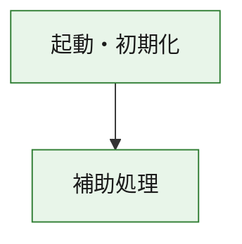
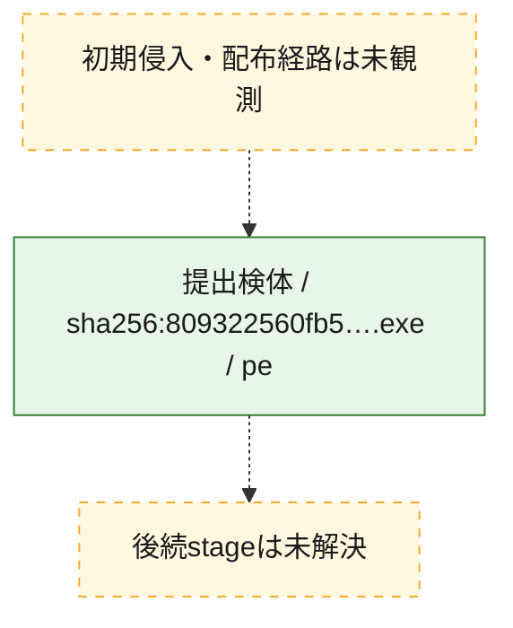
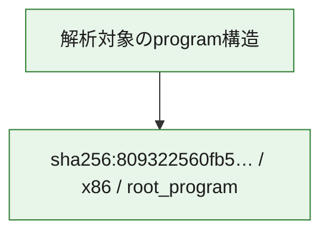

# 全体ロジック：809322560fb5bdf622eab16ed44e8486c93715d110e98540fa9988c664810bf5

代表関数の静的証跡から、起動・初期化の処理群を確認しました。

## 読み方

- phaseの掲載順は解析上の整理順です。observed_call_edgesがない段階間の実行順を断定しません。
- 図の実線は静的に観測した関係、点線と黄色のノードは未観測・未解決の関係を示します。
- 図は静的な要約であり、動的実行を再現するものではありません。
- 詳細な関数解説とfingerprintは[STATIC-LOGIC.md](STATIC-LOGIC.md)を参照してください。

## 静的可視化

### 実行フロー

### 感染チェーン

### モジュール関係

## 処理段階

### 1. 起動・初期化

entry pointから初期化と後続処理への移行を確認します。
確度: `confirmed_static_function_evidence`

- `809322560fb5bdf622eab16ed44e8486c93715d110e98540fa9988c664810bf5:ghidra:180001010` — 初期化と主要処理への分岐を行う入口関数です。 状態: `succeeded`、選定理由: `entry_point`, `meaningful_symbol_name`, `reviewed_call_centrality:22`, `role:entrypoint`, `small_program_complete_context`

### 2. 補助処理

主要処理を支える一般内部関数またはlibrary処理を確認します。
確度: `confirmed_static_function_evidence`

- `809322560fb5bdf622eab16ed44e8486c93715d110e98540fa9988c664810bf5:ghidra:180001240` — 検体内部の一般処理を実装する関数です。 状態: `succeeded`、選定理由: `context_representative`, `reviewed_call_centrality:2`, `small_program_complete_context`
- `809322560fb5bdf622eab16ed44e8486c93715d110e98540fa9988c664810bf5:ghidra:180001350` — 検体内部の一般処理を実装する関数です。 状態: `succeeded`、選定理由: `context_representative`, `reviewed_call_centrality:25`, `small_program_complete_context`
- `809322560fb5bdf622eab16ed44e8486c93715d110e98540fa9988c664810bf5:ghidra:180003780` — 検体内部の一般処理を実装する関数です。 状態: `succeeded`、選定理由: `context_representative`, `reviewed_call_centrality:2`, `small_program_complete_context`
- `809322560fb5bdf622eab16ed44e8486c93715d110e98540fa9988c664810bf5:ghidra:1800038e0` — 検体内部の一般処理を実装する関数です。 状態: `succeeded`、選定理由: `context_representative`, `reviewed_call_centrality:2`, `small_program_complete_context`

## 観測したcall関係

- `809322560fb5bdf622eab16ed44e8486c93715d110e98540fa9988c664810bf5:ghidra:180001010` → `809322560fb5bdf622eab16ed44e8486c93715d110e98540fa9988c664810bf5:ghidra:180001240` （`startup` → `support`）
- `809322560fb5bdf622eab16ed44e8486c93715d110e98540fa9988c664810bf5:ghidra:180001010` → `809322560fb5bdf622eab16ed44e8486c93715d110e98540fa9988c664810bf5:ghidra:180001350` （`startup` → `support`）
- `809322560fb5bdf622eab16ed44e8486c93715d110e98540fa9988c664810bf5:ghidra:180001350` → `809322560fb5bdf622eab16ed44e8486c93715d110e98540fa9988c664810bf5:ghidra:180001240` （`support` → `support`）
- `809322560fb5bdf622eab16ed44e8486c93715d110e98540fa9988c664810bf5:ghidra:180001350` → `809322560fb5bdf622eab16ed44e8486c93715d110e98540fa9988c664810bf5:ghidra:180003780` （`support` → `support`）
- `809322560fb5bdf622eab16ed44e8486c93715d110e98540fa9988c664810bf5:ghidra:180001350` → `809322560fb5bdf622eab16ed44e8486c93715d110e98540fa9988c664810bf5:ghidra:1800038e0` （`support` → `support`）
- `809322560fb5bdf622eab16ed44e8486c93715d110e98540fa9988c664810bf5:ghidra:180003780` → `809322560fb5bdf622eab16ed44e8486c93715d110e98540fa9988c664810bf5:ghidra:1800038e0` （`support` → `support`）
- `ghidra-function:0d3d81a635cf1a9380a285f1` → `ghidra-external:010b3ff627ed4ed8ffb229b7` （`unclassified` → `unclassified`）
- `ghidra-function:0d3d81a635cf1a9380a285f1` → `ghidra-external:01d713ee14365d3df4f9b404` （`unclassified` → `unclassified`）
- `ghidra-function:0d3d81a635cf1a9380a285f1` → `ghidra-external:03ab75196ee8487b76c4ae0c` （`unclassified` → `unclassified`）
- `ghidra-function:0d3d81a635cf1a9380a285f1` → `ghidra-external:0bd4bf9ec073e90c9338e25c` （`unclassified` → `unclassified`）
- `ghidra-function:0d3d81a635cf1a9380a285f1` → `ghidra-external:1db7e6a1a53d306f1e83dabd` （`unclassified` → `unclassified`）
- `ghidra-function:0d3d81a635cf1a9380a285f1` → `ghidra-external:369001f995935a3af154539a` （`unclassified` → `unclassified`）
- `ghidra-function:0d3d81a635cf1a9380a285f1` → `ghidra-external:3958d7e12e2a014b45130fbf` （`unclassified` → `unclassified`）
- `ghidra-function:0d3d81a635cf1a9380a285f1` → `ghidra-external:3ce49bf7033d0511a8f4975d` （`unclassified` → `unclassified`）
- `ghidra-function:0d3d81a635cf1a9380a285f1` → `ghidra-external:50dc9cfcfcf90b6904c838ef` （`unclassified` → `unclassified`）
- `ghidra-function:0d3d81a635cf1a9380a285f1` → `ghidra-external:6776e92c2f372e20e4d298e9` （`unclassified` → `unclassified`）
- `ghidra-function:0d3d81a635cf1a9380a285f1` → `ghidra-external:6a16b912e9949cfea9eeb653` （`unclassified` → `unclassified`）
- `ghidra-function:0d3d81a635cf1a9380a285f1` → `ghidra-external:7df0f08a35cadd753729f684` （`unclassified` → `unclassified`）
- `ghidra-function:0d3d81a635cf1a9380a285f1` → `ghidra-external:80563e9f506b6507ee34d277` （`unclassified` → `unclassified`）
- `ghidra-function:0d3d81a635cf1a9380a285f1` → `ghidra-external:a5a932e3ab8768ce5a344748` （`unclassified` → `unclassified`）
- `ghidra-function:0d3d81a635cf1a9380a285f1` → `ghidra-external:a93fc29067576638ef7420e2` （`unclassified` → `unclassified`）
- `ghidra-function:0d3d81a635cf1a9380a285f1` → `ghidra-external:c5dafc5785cccb5260cb0f2c` （`unclassified` → `unclassified`）
- `ghidra-function:0d3d81a635cf1a9380a285f1` → `ghidra-external:cf6a8f74276f56409630d015` （`unclassified` → `unclassified`）
- `ghidra-function:0d3d81a635cf1a9380a285f1` → `ghidra-external:d5a0173fd6d5bd7e7c2f0767` （`unclassified` → `unclassified`）
- `ghidra-function:0d3d81a635cf1a9380a285f1` → `ghidra-external:dc2551ad98a2b4ddb8df7deb` （`unclassified` → `unclassified`）
- `ghidra-function:0d3d81a635cf1a9380a285f1` → `ghidra-external:e2d0e6e79df80559c5adb18c` （`unclassified` → `unclassified`）
- `ghidra-function:0d3d81a635cf1a9380a285f1` → `ghidra-external:f55d93a67af5fb543d8fadf7` （`unclassified` → `unclassified`）
- `ghidra-function:0d3d81a635cf1a9380a285f1` → `ghidra-function:3c59ab8e7fdaaf0ebc5f66c5` （`unclassified` → `unclassified`）
- `ghidra-function:0d3d81a635cf1a9380a285f1` → `ghidra-function:6659336c4a9690f23ae16da7` （`unclassified` → `unclassified`）
- `ghidra-function:0d3d81a635cf1a9380a285f1` → `ghidra-function:cf7f1e45688e300843c1804a` （`unclassified` → `unclassified`）
- `ghidra-function:3c59ab8e7fdaaf0ebc5f66c5` → `ghidra-function:6659336c4a9690f23ae16da7` （`unclassified` → `unclassified`）
- `ghidra-function:8dcd257f07a999acfedf94de` → `ghidra-function:04c8d3644d5c5d576f802ea6` （`unclassified` → `unclassified`）
- `ghidra-function:8dcd257f07a999acfedf94de` → `ghidra-function:0d3d81a635cf1a9380a285f1` （`unclassified` → `unclassified`）
- `ghidra-function:8dcd257f07a999acfedf94de` → `ghidra-function:3223720e0436eff23dbac104` （`unclassified` → `unclassified`）
- `ghidra-function:8dcd257f07a999acfedf94de` → `ghidra-function:3c6e1e543bb6588533ac3139` （`unclassified` → `unclassified`）
- `ghidra-function:8dcd257f07a999acfedf94de` → `ghidra-function:555a451763bfd7ce05572469` （`unclassified` → `unclassified`）
- `ghidra-function:8dcd257f07a999acfedf94de` → `ghidra-function:86fab99b2e386f559568c1a3` （`unclassified` → `unclassified`）
- `ghidra-function:8dcd257f07a999acfedf94de` → `ghidra-function:8797d6578252672bd143ab44` （`unclassified` → `unclassified`）
- `ghidra-function:8dcd257f07a999acfedf94de` → `ghidra-function:a7214693923ffdf264f3e36b` （`unclassified` → `unclassified`）
- `ghidra-function:8dcd257f07a999acfedf94de` → `ghidra-function:cf63c1699e5afdd3af163ecb` （`unclassified` → `unclassified`）
- `ghidra-function:8dcd257f07a999acfedf94de` → `ghidra-function:cf7f1e45688e300843c1804a` （`unclassified` → `unclassified`）
- `ghidra-function:8dcd257f07a999acfedf94de` → `ghidra-function:dbdfe10e15869face4827c6d` （`unclassified` → `unclassified`）
- `ghidra-function:8dcd257f07a999acfedf94de` → `ghidra-function:ebdd169d05ef595ee0ef00c3` （`unclassified` → `unclassified`）

## 解析範囲と制約

- 選定外関数は全体inventoryへ残しますが、関数本体の個別解説対象にはしていません。
- indirect call、難読化、packer、VM、壊れたcontrol flowによりcall関係が欠落する場合があります。
- 文書は静的解析に基づき、検体実行や外部通信による動的確認は行っていません。
