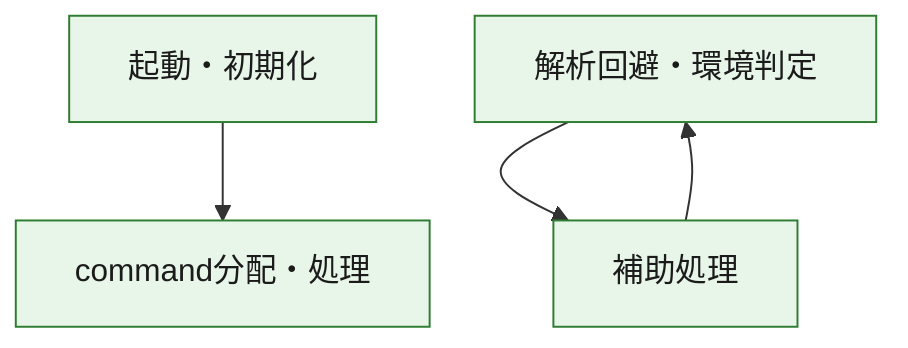
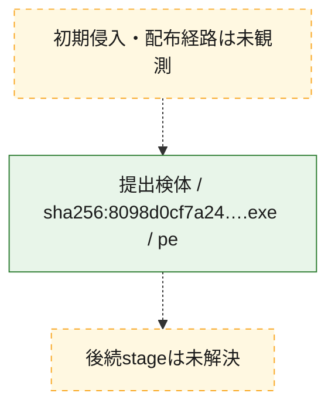
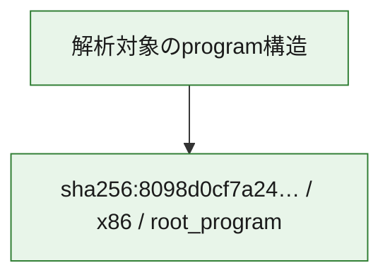

# 全体ロジック：8098d0cf7a2460b14d7145b0c15a183c5fdbaa9e3932b1ee701aa4c2d59c0d9c

代表関数の静的証跡から、起動・初期化、解析回避・環境判定、command分配・処理の処理群を確認しました。

## 読み方

- phaseの掲載順は解析上の整理順です。observed_call_edgesがない段階間の実行順を断定しません。
- 図の実線は静的に観測した関係、点線と黄色のノードは未観測・未解決の関係を示します。
- 図は静的な要約であり、動的実行を再現するものではありません。
- 詳細な関数解説とfingerprintは[STATIC-LOGIC.md](STATIC-LOGIC.md)を参照してください。

## 静的可視化

### 実行フロー

### 感染チェーン

### モジュール関係

## 処理段階

### 1. 起動・初期化

entry pointから初期化と後続処理への移行を確認します。
確度: `confirmed_static_function_evidence`

- `8098d0cf7a2460b14d7145b0c15a183c5fdbaa9e3932b1ee701aa4c2d59c0d9c:ghidra:14002bde0` — 初期化と主要処理への分岐を行う入口関数です。 状態: `succeeded`、選定理由: `entry_point`, `meaningful_symbol_name`, `reviewed_call_centrality:22`, `role:entrypoint`

### 2. 解析回避・環境判定

debugger、sandbox、仮想環境、時間差などの判定を確認します。
確度: `confirmed_static_function_evidence`

- `8098d0cf7a2460b14d7145b0c15a183c5fdbaa9e3932b1ee701aa4c2d59c0d9c:ghidra:1400011d6` — debugger、仮想環境、sandbox、または時間差の確認に関係する関数です。 状態: `succeeded`、選定理由: `context_representative`, `reviewed_call_centrality:25`, `role:anti_analysis`

### 3. command分配・処理

受信commandやtaskの解釈、分配、個別handlerへの移行を確認します。
確度: `confirmed_static_function_evidence_with_limits`

- `8098d0cf7a2460b14d7145b0c15a183c5fdbaa9e3932b1ee701aa4c2d59c0d9c:ghidra:140038520` — commandの解釈、分配、または個別処理を担当する関数です。 状態: `limited_bad_instruction_or_flow`、選定理由: `meaningful_symbol_name`, `reviewed_call_centrality:1`, `role:command_dispatch_or_handler`

### 4. 補助処理

主要処理を支える一般内部関数またはlibrary処理を確認します。
確度: `confirmed_static_function_evidence_with_limits`

- `8098d0cf7a2460b14d7145b0c15a183c5fdbaa9e3932b1ee701aa4c2d59c0d9c:ghidra:140001000` — 検体内部の一般処理を実装する関数です。 状態: `succeeded`、選定理由: `context_representative`, `reviewed_call_centrality:2`
- `8098d0cf7a2460b14d7145b0c15a183c5fdbaa9e3932b1ee701aa4c2d59c0d9c:ghidra:14000107e` — 検体内部の一般処理を実装する関数です。 状態: `succeeded`、選定理由: `context_representative`, `reviewed_call_centrality:2`
- `8098d0cf7a2460b14d7145b0c15a183c5fdbaa9e3932b1ee701aa4c2d59c0d9c:ghidra:140001116` — 検体内部の一般処理を実装する関数です。 状態: `succeeded`、選定理由: `context_representative`, `reviewed_call_centrality:2`
- `8098d0cf7a2460b14d7145b0c15a183c5fdbaa9e3932b1ee701aa4c2d59c0d9c:ghidra:14000115a` — 検体内部の一般処理を実装する関数です。 状態: `succeeded`、選定理由: `context_representative`, `reviewed_call_centrality:2`
- `8098d0cf7a2460b14d7145b0c15a183c5fdbaa9e3932b1ee701aa4c2d59c0d9c:ghidra:1400016d9` — 検体内部の一般処理を実装する関数です。 状態: `succeeded`、選定理由: `context_representative`, `reviewed_call_centrality:1`
- `8098d0cf7a2460b14d7145b0c15a183c5fdbaa9e3932b1ee701aa4c2d59c0d9c:ghidra:140001710` — 検体内部の一般処理を実装する関数です。 状態: `succeeded`、選定理由: `context_representative`, `reviewed_call_centrality:1`
- `8098d0cf7a2460b14d7145b0c15a183c5fdbaa9e3932b1ee701aa4c2d59c0d9c:ghidra:140001747` — 検体内部の一般処理を実装する関数です。 状態: `succeeded`、選定理由: `context_representative`, `reviewed_call_centrality:1`
- `8098d0cf7a2460b14d7145b0c15a183c5fdbaa9e3932b1ee701aa4c2d59c0d9c:ghidra:14000177e` — 検体内部の一般処理を実装する関数です。 状態: `succeeded`、選定理由: `context_representative`, `reviewed_call_centrality:4`
- `8098d0cf7a2460b14d7145b0c15a183c5fdbaa9e3932b1ee701aa4c2d59c0d9c:ghidra:140001815` — 検体内部の一般処理を実装する関数です。 状態: `succeeded`、選定理由: `context_representative`, `reviewed_call_centrality:19`
- `8098d0cf7a2460b14d7145b0c15a183c5fdbaa9e3932b1ee701aa4c2d59c0d9c:ghidra:140001a62` — 検体内部の一般処理を実装する関数です。 状態: `succeeded`、選定理由: `context_representative`, `reviewed_call_centrality:1`
- `8098d0cf7a2460b14d7145b0c15a183c5fdbaa9e3932b1ee701aa4c2d59c0d9c:ghidra:140001aa9` — 検体内部の一般処理を実装する関数です。 状態: `succeeded`、選定理由: `context_representative`, `reviewed_call_centrality:1`
- `8098d0cf7a2460b14d7145b0c15a183c5fdbaa9e3932b1ee701aa4c2d59c0d9c:ghidra:140001b89` — 検体内部の一般処理を実装する関数です。 状態: `succeeded`、選定理由: `context_representative`, `reviewed_call_centrality:1`
- `8098d0cf7a2460b14d7145b0c15a183c5fdbaa9e3932b1ee701aa4c2d59c0d9c:ghidra:140001c3b` — 検体内部の一般処理を実装する関数です。 状態: `succeeded`、選定理由: `context_representative`, `reviewed_call_centrality:91`
- `8098d0cf7a2460b14d7145b0c15a183c5fdbaa9e3932b1ee701aa4c2d59c0d9c:ghidra:140005125` — 検体内部の一般処理を実装する関数です。 状態: `succeeded`、選定理由: `context_representative`, `reviewed_call_centrality:1`
- `8098d0cf7a2460b14d7145b0c15a183c5fdbaa9e3932b1ee701aa4c2d59c0d9c:ghidra:1400051ac` — 検体内部の一般処理を実装する関数です。 状態: `succeeded`、選定理由: `context_representative`, `reviewed_call_centrality:2`
- `8098d0cf7a2460b14d7145b0c15a183c5fdbaa9e3932b1ee701aa4c2d59c0d9c:ghidra:14000524c` — 検体内部の一般処理を実装する関数です。 状態: `succeeded`、選定理由: `context_representative`, `reviewed_call_centrality:4`
- `8098d0cf7a2460b14d7145b0c15a183c5fdbaa9e3932b1ee701aa4c2d59c0d9c:ghidra:1400052ac` — 検体内部の一般処理を実装する関数です。 状態: `failed`、選定理由: `context_representative`, `reviewed_call_centrality:1`
- `8098d0cf7a2460b14d7145b0c15a183c5fdbaa9e3932b1ee701aa4c2d59c0d9c:ghidra:140005777` — 検体内部の一般処理を実装する関数です。 状態: `succeeded`、選定理由: `context_representative`, `reviewed_call_centrality:3`
- `8098d0cf7a2460b14d7145b0c15a183c5fdbaa9e3932b1ee701aa4c2d59c0d9c:ghidra:1400057eb` — 検体内部の一般処理を実装する関数です。 状態: `succeeded`、選定理由: `context_representative`
- `8098d0cf7a2460b14d7145b0c15a183c5fdbaa9e3932b1ee701aa4c2d59c0d9c:ghidra:1400057f7` — 検体内部の一般処理を実装する関数です。 状態: `succeeded`、選定理由: `context_representative`, `reviewed_call_centrality:36`
- `8098d0cf7a2460b14d7145b0c15a183c5fdbaa9e3932b1ee701aa4c2d59c0d9c:ghidra:14000635f` — 検体内部の一般処理を実装する関数です。 状態: `succeeded`、選定理由: `context_representative`, `reviewed_call_centrality:1`
- `8098d0cf7a2460b14d7145b0c15a183c5fdbaa9e3932b1ee701aa4c2d59c0d9c:ghidra:1400063a6` — 検体内部の一般処理を実装する関数です。 状態: `succeeded`、選定理由: `context_representative`, `reviewed_call_centrality:1`
- `8098d0cf7a2460b14d7145b0c15a183c5fdbaa9e3932b1ee701aa4c2d59c0d9c:ghidra:1400063b5` — 検体内部の一般処理を実装する関数です。 状態: `succeeded`、選定理由: `context_representative`, `reviewed_call_centrality:2`
- `8098d0cf7a2460b14d7145b0c15a183c5fdbaa9e3932b1ee701aa4c2d59c0d9c:ghidra:1400063e5` — 検体内部の一般処理を実装する関数です。 状態: `succeeded`、選定理由: `context_representative`, `reviewed_call_centrality:3`
- `8098d0cf7a2460b14d7145b0c15a183c5fdbaa9e3932b1ee701aa4c2d59c0d9c:ghidra:14000641f` — 検体内部の一般処理を実装する関数です。 状態: `succeeded`、選定理由: `context_representative`, `reviewed_call_centrality:2`
- `8098d0cf7a2460b14d7145b0c15a183c5fdbaa9e3932b1ee701aa4c2d59c0d9c:ghidra:140006459` — 検体内部の一般処理を実装する関数です。 状態: `succeeded`、選定理由: `context_representative`, `reviewed_call_centrality:2`
- `8098d0cf7a2460b14d7145b0c15a183c5fdbaa9e3932b1ee701aa4c2d59c0d9c:ghidra:140006496` — 検体内部の一般処理を実装する関数です。 状態: `succeeded`、選定理由: `context_representative`, `reviewed_call_centrality:4`
- `8098d0cf7a2460b14d7145b0c15a183c5fdbaa9e3932b1ee701aa4c2d59c0d9c:ghidra:1400188e0` — compiler生成処理または汎用library処理とみられる関数です。 状態: `limited_bad_instruction_or_flow`、選定理由: `entry_point`, `meaningful_symbol_name`, `reviewed_call_centrality:10`
- `8098d0cf7a2460b14d7145b0c15a183c5fdbaa9e3932b1ee701aa4c2d59c0d9c:ghidra:14002c1a4` — 検体内部の一般処理を実装する関数です。 状態: `succeeded`、選定理由: `meaningful_symbol_name`

## 観測したcall関係

- `8098d0cf7a2460b14d7145b0c15a183c5fdbaa9e3932b1ee701aa4c2d59c0d9c:ghidra:1400011d6` → `8098d0cf7a2460b14d7145b0c15a183c5fdbaa9e3932b1ee701aa4c2d59c0d9c:ghidra:140006496` （`evasion` → `support`）
- `8098d0cf7a2460b14d7145b0c15a183c5fdbaa9e3932b1ee701aa4c2d59c0d9c:ghidra:140001815` → `8098d0cf7a2460b14d7145b0c15a183c5fdbaa9e3932b1ee701aa4c2d59c0d9c:ghidra:1400063e5` （`support` → `support`）
- `8098d0cf7a2460b14d7145b0c15a183c5fdbaa9e3932b1ee701aa4c2d59c0d9c:ghidra:140001c3b` → `8098d0cf7a2460b14d7145b0c15a183c5fdbaa9e3932b1ee701aa4c2d59c0d9c:ghidra:14000115a` （`support` → `support`）
- `8098d0cf7a2460b14d7145b0c15a183c5fdbaa9e3932b1ee701aa4c2d59c0d9c:ghidra:140001c3b` → `8098d0cf7a2460b14d7145b0c15a183c5fdbaa9e3932b1ee701aa4c2d59c0d9c:ghidra:1400011d6` （`support` → `evasion`）
- `8098d0cf7a2460b14d7145b0c15a183c5fdbaa9e3932b1ee701aa4c2d59c0d9c:ghidra:140001c3b` → `8098d0cf7a2460b14d7145b0c15a183c5fdbaa9e3932b1ee701aa4c2d59c0d9c:ghidra:14000177e` （`support` → `support`）
- `8098d0cf7a2460b14d7145b0c15a183c5fdbaa9e3932b1ee701aa4c2d59c0d9c:ghidra:140001c3b` → `8098d0cf7a2460b14d7145b0c15a183c5fdbaa9e3932b1ee701aa4c2d59c0d9c:ghidra:140001815` （`support` → `support`）
- `8098d0cf7a2460b14d7145b0c15a183c5fdbaa9e3932b1ee701aa4c2d59c0d9c:ghidra:140001c3b` → `8098d0cf7a2460b14d7145b0c15a183c5fdbaa9e3932b1ee701aa4c2d59c0d9c:ghidra:140001aa9` （`support` → `support`）
- `8098d0cf7a2460b14d7145b0c15a183c5fdbaa9e3932b1ee701aa4c2d59c0d9c:ghidra:140001c3b` → `8098d0cf7a2460b14d7145b0c15a183c5fdbaa9e3932b1ee701aa4c2d59c0d9c:ghidra:140001b89` （`support` → `support`）
- `8098d0cf7a2460b14d7145b0c15a183c5fdbaa9e3932b1ee701aa4c2d59c0d9c:ghidra:140001c3b` → `8098d0cf7a2460b14d7145b0c15a183c5fdbaa9e3932b1ee701aa4c2d59c0d9c:ghidra:14000524c` （`support` → `support`）
- `8098d0cf7a2460b14d7145b0c15a183c5fdbaa9e3932b1ee701aa4c2d59c0d9c:ghidra:140001c3b` → `8098d0cf7a2460b14d7145b0c15a183c5fdbaa9e3932b1ee701aa4c2d59c0d9c:ghidra:1400063b5` （`support` → `support`）
- `8098d0cf7a2460b14d7145b0c15a183c5fdbaa9e3932b1ee701aa4c2d59c0d9c:ghidra:140001c3b` → `8098d0cf7a2460b14d7145b0c15a183c5fdbaa9e3932b1ee701aa4c2d59c0d9c:ghidra:1400063e5` （`support` → `support`）
- `8098d0cf7a2460b14d7145b0c15a183c5fdbaa9e3932b1ee701aa4c2d59c0d9c:ghidra:140001c3b` → `8098d0cf7a2460b14d7145b0c15a183c5fdbaa9e3932b1ee701aa4c2d59c0d9c:ghidra:14000641f` （`support` → `support`）
- `8098d0cf7a2460b14d7145b0c15a183c5fdbaa9e3932b1ee701aa4c2d59c0d9c:ghidra:140001c3b` → `8098d0cf7a2460b14d7145b0c15a183c5fdbaa9e3932b1ee701aa4c2d59c0d9c:ghidra:140006459` （`support` → `support`）
- `8098d0cf7a2460b14d7145b0c15a183c5fdbaa9e3932b1ee701aa4c2d59c0d9c:ghidra:140001c3b` → `8098d0cf7a2460b14d7145b0c15a183c5fdbaa9e3932b1ee701aa4c2d59c0d9c:ghidra:140006496` （`support` → `support`）
- `8098d0cf7a2460b14d7145b0c15a183c5fdbaa9e3932b1ee701aa4c2d59c0d9c:ghidra:14000524c` → `8098d0cf7a2460b14d7145b0c15a183c5fdbaa9e3932b1ee701aa4c2d59c0d9c:ghidra:14000115a` （`support` → `support`）
- `8098d0cf7a2460b14d7145b0c15a183c5fdbaa9e3932b1ee701aa4c2d59c0d9c:ghidra:1400057f7` → `8098d0cf7a2460b14d7145b0c15a183c5fdbaa9e3932b1ee701aa4c2d59c0d9c:ghidra:140001000` （`support` → `support`）
- `8098d0cf7a2460b14d7145b0c15a183c5fdbaa9e3932b1ee701aa4c2d59c0d9c:ghidra:1400057f7` → `8098d0cf7a2460b14d7145b0c15a183c5fdbaa9e3932b1ee701aa4c2d59c0d9c:ghidra:14000107e` （`support` → `support`）
- `8098d0cf7a2460b14d7145b0c15a183c5fdbaa9e3932b1ee701aa4c2d59c0d9c:ghidra:1400057f7` → `8098d0cf7a2460b14d7145b0c15a183c5fdbaa9e3932b1ee701aa4c2d59c0d9c:ghidra:1400011d6` （`support` → `evasion`）
- `8098d0cf7a2460b14d7145b0c15a183c5fdbaa9e3932b1ee701aa4c2d59c0d9c:ghidra:1400057f7` → `8098d0cf7a2460b14d7145b0c15a183c5fdbaa9e3932b1ee701aa4c2d59c0d9c:ghidra:1400052ac` （`support` → `support`）
- `8098d0cf7a2460b14d7145b0c15a183c5fdbaa9e3932b1ee701aa4c2d59c0d9c:ghidra:1400057f7` → `8098d0cf7a2460b14d7145b0c15a183c5fdbaa9e3932b1ee701aa4c2d59c0d9c:ghidra:140006496` （`support` → `support`）
- `8098d0cf7a2460b14d7145b0c15a183c5fdbaa9e3932b1ee701aa4c2d59c0d9c:ghidra:14002bde0` → `8098d0cf7a2460b14d7145b0c15a183c5fdbaa9e3932b1ee701aa4c2d59c0d9c:ghidra:140038520` （`startup` → `dispatch`）
- `ghidra-function:026c54af74f16f4a1decdac8` → `ghidra-external:1b5bfedf8b7543303ae0bd6f` （`unclassified` → `unclassified`）
- `ghidra-function:026c54af74f16f4a1decdac8` → `ghidra-external:34534d59efc44de6ac6f10b2` （`unclassified` → `unclassified`）
- `ghidra-function:026c54af74f16f4a1decdac8` → `ghidra-external:5b6b46ae3f8d64c387204cfc` （`unclassified` → `unclassified`）
- `ghidra-function:026c54af74f16f4a1decdac8` → `ghidra-external:966ce4440c0d4277422eda2c` （`unclassified` → `unclassified`）
- `ghidra-function:026c54af74f16f4a1decdac8` → `ghidra-external:9b9b07664a1eeba395f653f0` （`unclassified` → `unclassified`）
- `ghidra-function:026c54af74f16f4a1decdac8` → `ghidra-external:b0338a3cda04dd132ed1acb2` （`unclassified` → `unclassified`）
- `ghidra-function:026c54af74f16f4a1decdac8` → `ghidra-external:d4ce0b345f306a2cc255f7c3` （`unclassified` → `unclassified`）
- `ghidra-function:026c54af74f16f4a1decdac8` → `ghidra-external:f176c66e007545238b785f76` （`unclassified` → `unclassified`）
- `ghidra-function:026c54af74f16f4a1decdac8` → `ghidra-function:0e436c44717bc0c8fa204c93` （`unclassified` → `unclassified`）
- `ghidra-function:026c54af74f16f4a1decdac8` → `ghidra-function:20f5f1b9f10151ada2ec5e5f` （`unclassified` → `unclassified`）
- `ghidra-function:026c54af74f16f4a1decdac8` → `ghidra-function:242888ae335d7d3de6b879d8` （`unclassified` → `unclassified`）
- `ghidra-function:026c54af74f16f4a1decdac8` → `ghidra-function:2c12fe1a4ec49f73850c2c5c` （`unclassified` → `unclassified`）
- `ghidra-function:026c54af74f16f4a1decdac8` → `ghidra-function:4f13998b3bfec3533c13f71c` （`unclassified` → `unclassified`）
- `ghidra-function:026c54af74f16f4a1decdac8` → `ghidra-function:5bad138d016df9921b676c98` （`unclassified` → `unclassified`）
- `ghidra-function:026c54af74f16f4a1decdac8` → `ghidra-function:70d0374e7588dcb14993697c` （`unclassified` → `unclassified`）
- `ghidra-function:026c54af74f16f4a1decdac8` → `ghidra-function:aa057acb27415f3eb98a7d80` （`unclassified` → `unclassified`）
- `ghidra-function:026c54af74f16f4a1decdac8` → `ghidra-function:b1f243f1d502d7961392c115` （`unclassified` → `unclassified`）
- `ghidra-function:026c54af74f16f4a1decdac8` → `ghidra-function:c7168f054358803711b6c65c` （`unclassified` → `unclassified`）
- `ghidra-function:026c54af74f16f4a1decdac8` → `ghidra-function:eed6c7f1632c1a7f66203714` （`unclassified` → `unclassified`）
- `ghidra-function:026c54af74f16f4a1decdac8` → `ghidra-function:f7dbbc84b1978c0bc3cf6699` （`unclassified` → `unclassified`）
- `ghidra-function:067889f7b32e2ae3a63af370` → `ghidra-external:11f743f06f12f59a6db397d7` （`unclassified` → `unclassified`）
- `ghidra-function:067889f7b32e2ae3a63af370` → `ghidra-external:5f7dd720074c5002e7a752ae` （`unclassified` → `unclassified`）
- `ghidra-function:067889f7b32e2ae3a63af370` → `ghidra-external:6120acd910620797c9873822` （`unclassified` → `unclassified`）
- `ghidra-function:067889f7b32e2ae3a63af370` → `ghidra-external:7db9ae94255633ea1b9e28cf` （`unclassified` → `unclassified`）
- `ghidra-function:067889f7b32e2ae3a63af370` → `ghidra-external:7fd98f01e5ad10996f347449` （`unclassified` → `unclassified`）
- `ghidra-function:067889f7b32e2ae3a63af370` → `ghidra-external:906589cab38146e013822a05` （`unclassified` → `unclassified`）
- `ghidra-function:067889f7b32e2ae3a63af370` → `ghidra-external:b862186caca90c6443c469e5` （`unclassified` → `unclassified`）
- `ghidra-function:067889f7b32e2ae3a63af370` → `ghidra-external:bd366e6b764b57f46f7b8dd3` （`unclassified` → `unclassified`）
- `ghidra-function:067889f7b32e2ae3a63af370` → `ghidra-external:d3a3367bf78b392eb0677ab8` （`unclassified` → `unclassified`）
- `ghidra-function:067889f7b32e2ae3a63af370` → `ghidra-function:178a3264b5093b3fa3ab7206` （`unclassified` → `unclassified`）
- `ghidra-function:067889f7b32e2ae3a63af370` → `ghidra-function:2c80b1713ccb18b64476e359` （`unclassified` → `unclassified`）
- `ghidra-function:067889f7b32e2ae3a63af370` → `ghidra-function:4ae00acca9eef58ea417691e` （`unclassified` → `unclassified`）
- `ghidra-function:067889f7b32e2ae3a63af370` → `ghidra-function:4fbaa612083bfe41424683f7` （`unclassified` → `unclassified`）
- `ghidra-function:067889f7b32e2ae3a63af370` → `ghidra-function:823b5304c6cffa8b8ad778e9` （`unclassified` → `unclassified`）
- `ghidra-function:067889f7b32e2ae3a63af370` → `ghidra-function:86db0a23e46f42cf506451ff` （`unclassified` → `unclassified`）
- `ghidra-function:067889f7b32e2ae3a63af370` → `ghidra-function:ab7ced79b151a2eeefef6b03` （`unclassified` → `unclassified`）
- `ghidra-function:067889f7b32e2ae3a63af370` → `ghidra-function:b52535172497445a86a29193` （`unclassified` → `unclassified`）
- `ghidra-function:067889f7b32e2ae3a63af370` → `ghidra-function:cbbf8eeb51f3c64444c62b22` （`unclassified` → `unclassified`）
- `ghidra-function:067889f7b32e2ae3a63af370` → `ghidra-function:d64a65fe1524695f9ae7b8e5` （`unclassified` → `unclassified`）
- `ghidra-function:067889f7b32e2ae3a63af370` → `ghidra-function:dc67bea64ec01a58ca49f65a` （`unclassified` → `unclassified`）
- `ghidra-function:067889f7b32e2ae3a63af370` → `ghidra-function:ec92a0a5d9c3c88cb1728673` （`unclassified` → `unclassified`）
- `ghidra-function:067889f7b32e2ae3a63af370` → `ghidra-function:fcfb0c9bf5d707d4b6f1d46e` （`unclassified` → `unclassified`）
- `ghidra-function:1ef827fda3305e37c8c05d6a` → `ghidra-external:5b6b46ae3f8d64c387204cfc` （`unclassified` → `unclassified`）
- `ghidra-function:1ef827fda3305e37c8c05d6a` → `ghidra-external:9b9b07664a1eeba395f653f0` （`unclassified` → `unclassified`）
- `ghidra-function:1ef827fda3305e37c8c05d6a` → `ghidra-external:a760f5ac98c435e5c8c02d9f` （`unclassified` → `unclassified`）
- `ghidra-function:20ed978c6b3967b090faea65` → `ghidra-external:2d4a486bda599673bd85ac72` （`unclassified` → `unclassified`）
- `ghidra-function:20ed978c6b3967b090faea65` → `ghidra-external:71a4f7c920b11775ed5a0d7d` （`unclassified` → `unclassified`）
- `ghidra-function:20ed978c6b3967b090faea65` → `ghidra-external:90e8f3f3e858b783e4967680` （`unclassified` → `unclassified`）
- `ghidra-function:20ed978c6b3967b090faea65` → `ghidra-external:f176c66e007545238b785f76` （`unclassified` → `unclassified`）
- `ghidra-function:20ed978c6b3967b090faea65` → `ghidra-function:7e55f5e327c13141b9eba898` （`unclassified` → `unclassified`）
- `ghidra-function:20ed978c6b3967b090faea65` → `ghidra-function:a3d2b151fb8a3363882c1aa1` （`unclassified` → `unclassified`）
- `ghidra-function:20ed978c6b3967b090faea65` → `ghidra-function:d40a054e323881387036f646` （`unclassified` → `unclassified`）
- `ghidra-function:20ed978c6b3967b090faea65` → `ghidra-function:f058751083d5ff32872b785b` （`unclassified` → `unclassified`）
- `ghidra-function:2b2fa9cd84c8253410b90c7b` → `ghidra-function:ca9f928d19f31d844d76369e` （`unclassified` → `unclassified`）
- `ghidra-function:2eb8408bbc21e249e53d4d53` → `ghidra-function:ca9f928d19f31d844d76369e` （`unclassified` → `unclassified`）
- `ghidra-function:3503cfb7f56d81a50cce369f` → `ghidra-function:d40a054e323881387036f646` （`unclassified` → `unclassified`）
- `ghidra-function:3c4f8ccdf1276cf14d501636` → `ghidra-external:03c96b8d2f4935fb8c7660a1` （`unclassified` → `unclassified`）
- `ghidra-function:3c4f8ccdf1276cf14d501636` → `ghidra-external:0619c7d7da5da48e885b9593` （`unclassified` → `unclassified`）
- `ghidra-function:3c4f8ccdf1276cf14d501636` → `ghidra-external:11697702605ce2327985125a` （`unclassified` → `unclassified`）
- `ghidra-function:3c4f8ccdf1276cf14d501636` → `ghidra-external:17a290d14ab12546923eb843` （`unclassified` → `unclassified`）
- `ghidra-function:3c4f8ccdf1276cf14d501636` → `ghidra-external:1b5bfedf8b7543303ae0bd6f` （`unclassified` → `unclassified`）
- `ghidra-function:3c4f8ccdf1276cf14d501636` → `ghidra-external:1c680b95bd21afe593472ebb` （`unclassified` → `unclassified`）
- `ghidra-function:3c4f8ccdf1276cf14d501636` → `ghidra-external:2450fe7a6f8e9c5c85e40736` （`unclassified` → `unclassified`）
- `ghidra-function:3c4f8ccdf1276cf14d501636` → `ghidra-external:2d4a486bda599673bd85ac72` （`unclassified` → `unclassified`）
- `ghidra-function:3c4f8ccdf1276cf14d501636` → `ghidra-external:34534d59efc44de6ac6f10b2` （`unclassified` → `unclassified`）
- `ghidra-function:3c4f8ccdf1276cf14d501636` → `ghidra-external:365b3cf087bbd79effb71e5c` （`unclassified` → `unclassified`）
- `ghidra-function:3c4f8ccdf1276cf14d501636` → `ghidra-external:3dde75f0e78ae061e19f2804` （`unclassified` → `unclassified`）
- `ghidra-function:3c4f8ccdf1276cf14d501636` → `ghidra-external:4bb3c86b09bfe4e6cef1e76f` （`unclassified` → `unclassified`）
- `ghidra-function:3c4f8ccdf1276cf14d501636` → `ghidra-external:4f7d4912be89f6f7c78e97e3` （`unclassified` → `unclassified`）
- `ghidra-function:3c4f8ccdf1276cf14d501636` → `ghidra-external:5b6b46ae3f8d64c387204cfc` （`unclassified` → `unclassified`）
- `ghidra-function:3c4f8ccdf1276cf14d501636` → `ghidra-external:621d436b00399fb567d0f6c9` （`unclassified` → `unclassified`）
- `ghidra-function:3c4f8ccdf1276cf14d501636` → `ghidra-external:68eaba0764bf940d3f2e6433` （`unclassified` → `unclassified`）
- `ghidra-function:3c4f8ccdf1276cf14d501636` → `ghidra-external:71a4f7c920b11775ed5a0d7d` （`unclassified` → `unclassified`）
- `ghidra-function:3c4f8ccdf1276cf14d501636` → `ghidra-external:7db9ae94255633ea1b9e28cf` （`unclassified` → `unclassified`）
- `ghidra-function:3c4f8ccdf1276cf14d501636` → `ghidra-external:7ed56b9991d42a5043fedab3` （`unclassified` → `unclassified`）
- `ghidra-function:3c4f8ccdf1276cf14d501636` → `ghidra-external:815507e5731f95b19042258c` （`unclassified` → `unclassified`）
- `ghidra-function:3c4f8ccdf1276cf14d501636` → `ghidra-external:89ffbad3da4f46fd095ad0d0` （`unclassified` → `unclassified`）
- `ghidra-function:3c4f8ccdf1276cf14d501636` → `ghidra-external:977a8f321fcad4320e9e2c28` （`unclassified` → `unclassified`）
- `ghidra-function:3c4f8ccdf1276cf14d501636` → `ghidra-external:9b9b07664a1eeba395f653f0` （`unclassified` → `unclassified`）
- `ghidra-function:3c4f8ccdf1276cf14d501636` → `ghidra-external:9ef7bd8fd1cf7efe90f3e9b5` （`unclassified` → `unclassified`）
- `ghidra-function:3c4f8ccdf1276cf14d501636` → `ghidra-external:a1f514aa2ae5e3ce054ccc30` （`unclassified` → `unclassified`）
- `ghidra-function:3c4f8ccdf1276cf14d501636` → `ghidra-external:a760f5ac98c435e5c8c02d9f` （`unclassified` → `unclassified`）
- `ghidra-function:3c4f8ccdf1276cf14d501636` → `ghidra-external:afbee50a85d2a9708ea668a0` （`unclassified` → `unclassified`）
- `ghidra-function:3c4f8ccdf1276cf14d501636` → `ghidra-external:b0338a3cda04dd132ed1acb2` （`unclassified` → `unclassified`）
- `ghidra-function:3c4f8ccdf1276cf14d501636` → `ghidra-external:b34447b5c070490a6e9a814b` （`unclassified` → `unclassified`）
- `ghidra-function:3c4f8ccdf1276cf14d501636` → `ghidra-external:b9bc9a3e8ae8e1bbc38d8a02` （`unclassified` → `unclassified`）
- `ghidra-function:3c4f8ccdf1276cf14d501636` → `ghidra-external:bf4185b7da00e454defdf537` （`unclassified` → `unclassified`）
- `ghidra-function:3c4f8ccdf1276cf14d501636` → `ghidra-external:c86340f4145a9b6edb398ca3` （`unclassified` → `unclassified`）
- `ghidra-function:3c4f8ccdf1276cf14d501636` → `ghidra-external:d4ce0b345f306a2cc255f7c3` （`unclassified` → `unclassified`）
- `ghidra-function:3c4f8ccdf1276cf14d501636` → `ghidra-external:ee874f9ad4f58f94c850143e` （`unclassified` → `unclassified`）
- `ghidra-function:3c4f8ccdf1276cf14d501636` → `ghidra-external:f176c66e007545238b785f76` （`unclassified` → `unclassified`）
- `ghidra-function:3c4f8ccdf1276cf14d501636` → `ghidra-external:f5529dfd4da47541a627eafc` （`unclassified` → `unclassified`）
- `ghidra-function:3c4f8ccdf1276cf14d501636` → `ghidra-external:ff87b5a23ea15f7e29371277` （`unclassified` → `unclassified`）
- `ghidra-function:3c4f8ccdf1276cf14d501636` → `ghidra-function:026c54af74f16f4a1decdac8` （`unclassified` → `unclassified`）
- `ghidra-function:3c4f8ccdf1276cf14d501636` → `ghidra-function:0409c0451b9819aa39f0466a` （`unclassified` → `unclassified`）
- `ghidra-function:3c4f8ccdf1276cf14d501636` → `ghidra-function:060da6f60a2cedd19331c2d0` （`unclassified` → `unclassified`）
- `ghidra-function:3c4f8ccdf1276cf14d501636` → `ghidra-function:0d8c9c97c67380811f760b08` （`unclassified` → `unclassified`）
- `ghidra-function:3c4f8ccdf1276cf14d501636` → `ghidra-function:0f13bb8ac7266cba7de82e0a` （`unclassified` → `unclassified`）
- `ghidra-function:3c4f8ccdf1276cf14d501636` → `ghidra-function:11126f970c9e7c106e6afc3a` （`unclassified` → `unclassified`）
- `ghidra-function:3c4f8ccdf1276cf14d501636` → `ghidra-function:190109e449ce9673be6584a5` （`unclassified` → `unclassified`）
- `ghidra-function:3c4f8ccdf1276cf14d501636` → `ghidra-function:19c7a34ec3d361f0710a03ba` （`unclassified` → `unclassified`）
- `ghidra-function:3c4f8ccdf1276cf14d501636` → `ghidra-function:1cdfc59ea10f2cf8dbb5defe` （`unclassified` → `unclassified`）
- `ghidra-function:3c4f8ccdf1276cf14d501636` → `ghidra-function:1ef827fda3305e37c8c05d6a` （`unclassified` → `unclassified`）
- `ghidra-function:3c4f8ccdf1276cf14d501636` → `ghidra-function:20f5f1b9f10151ada2ec5e5f` （`unclassified` → `unclassified`）
- `ghidra-function:3c4f8ccdf1276cf14d501636` → `ghidra-function:23dcf08c15304d54ef76a771` （`unclassified` → `unclassified`）
- `ghidra-function:3c4f8ccdf1276cf14d501636` → `ghidra-function:2c12fe1a4ec49f73850c2c5c` （`unclassified` → `unclassified`）
- `ghidra-function:3c4f8ccdf1276cf14d501636` → `ghidra-function:2cf247b0fc110594b1006bdd` （`unclassified` → `unclassified`）
- `ghidra-function:3c4f8ccdf1276cf14d501636` → `ghidra-function:388f5e9647bdd327aeaba663` （`unclassified` → `unclassified`）
- `ghidra-function:3c4f8ccdf1276cf14d501636` → `ghidra-function:474fb6db24cc2d4c138734c4` （`unclassified` → `unclassified`）
- `ghidra-function:3c4f8ccdf1276cf14d501636` → `ghidra-function:4f13998b3bfec3533c13f71c` （`unclassified` → `unclassified`）
- `ghidra-function:3c4f8ccdf1276cf14d501636` → `ghidra-function:515961ea4bffb80498dfbdf6` （`unclassified` → `unclassified`）
- `ghidra-function:3c4f8ccdf1276cf14d501636` → `ghidra-function:5215f2e2fa8547618750b99f` （`unclassified` → `unclassified`）
- `ghidra-function:3c4f8ccdf1276cf14d501636` → `ghidra-function:52cacd4e5e0ecec7e2bca872` （`unclassified` → `unclassified`）
- `ghidra-function:3c4f8ccdf1276cf14d501636` → `ghidra-function:5b376399ee6dcb5e4d695e93` （`unclassified` → `unclassified`）
- `ghidra-function:3c4f8ccdf1276cf14d501636` → `ghidra-function:5fe21166a3c81055e46727d1` （`unclassified` → `unclassified`）
- `ghidra-function:3c4f8ccdf1276cf14d501636` → `ghidra-function:675b27415a0d970f9544af7b` （`unclassified` → `unclassified`）
- `ghidra-function:3c4f8ccdf1276cf14d501636` → `ghidra-function:6b8413bec280575e699922cc` （`unclassified` → `unclassified`）
- `ghidra-function:3c4f8ccdf1276cf14d501636` → `ghidra-function:6d0b2267ad2cfe71f0167dc7` （`unclassified` → `unclassified`）
- `ghidra-function:3c4f8ccdf1276cf14d501636` → `ghidra-function:70d0374e7588dcb14993697c` （`unclassified` → `unclassified`）
- `ghidra-function:3c4f8ccdf1276cf14d501636` → `ghidra-function:7487a1d607b9d9c3684dcdfc` （`unclassified` → `unclassified`）
- `ghidra-function:3c4f8ccdf1276cf14d501636` → `ghidra-function:838422740f904ea9adda6105` （`unclassified` → `unclassified`）
- `ghidra-function:3c4f8ccdf1276cf14d501636` → `ghidra-function:8616b5c801f62e42ade1a20d` （`unclassified` → `unclassified`）
- `ghidra-function:3c4f8ccdf1276cf14d501636` → `ghidra-function:924f58d33c6053220a77716d` （`unclassified` → `unclassified`）
- `ghidra-function:3c4f8ccdf1276cf14d501636` → `ghidra-function:9888fda2da30f29fc08af846` （`unclassified` → `unclassified`）
- `ghidra-function:3c4f8ccdf1276cf14d501636` → `ghidra-function:9b86c176986b3405e81e4340` （`unclassified` → `unclassified`）
- `ghidra-function:3c4f8ccdf1276cf14d501636` → `ghidra-function:9f7e63897fc91b3d50ff92fb` （`unclassified` → `unclassified`）
- `ghidra-function:3c4f8ccdf1276cf14d501636` → `ghidra-function:aa057acb27415f3eb98a7d80` （`unclassified` → `unclassified`）
- `ghidra-function:3c4f8ccdf1276cf14d501636` → `ghidra-function:aa0a9a293834645fd0ea018a` （`unclassified` → `unclassified`）
- `ghidra-function:3c4f8ccdf1276cf14d501636` → `ghidra-function:ad4accadf8d105e598a6e04b` （`unclassified` → `unclassified`）
- `ghidra-function:3c4f8ccdf1276cf14d501636` → `ghidra-function:b6ccc101feadb68c4e4b9581` （`unclassified` → `unclassified`）
- `ghidra-function:3c4f8ccdf1276cf14d501636` → `ghidra-function:babed0bf23b9721d97db64de` （`unclassified` → `unclassified`）
- `ghidra-function:3c4f8ccdf1276cf14d501636` → `ghidra-function:baea0f01dad61ca12b1fb180` （`unclassified` → `unclassified`）
- `ghidra-function:3c4f8ccdf1276cf14d501636` → `ghidra-function:c67940b5e13940fc2a7c73db` （`unclassified` → `unclassified`）
- `ghidra-function:3c4f8ccdf1276cf14d501636` → `ghidra-function:ccf6fbb2351d7ccf885689cf` （`unclassified` → `unclassified`）
- `ghidra-function:3c4f8ccdf1276cf14d501636` → `ghidra-function:cd9b39ea3904b2228700f1d6` （`unclassified` → `unclassified`）
- `ghidra-function:3c4f8ccdf1276cf14d501636` → `ghidra-function:cf1a7a138d1846a4d2329d51` （`unclassified` → `unclassified`）
- `ghidra-function:3c4f8ccdf1276cf14d501636` → `ghidra-function:cfe75c3fcb8705b60644fffe` （`unclassified` → `unclassified`）
- `ghidra-function:3c4f8ccdf1276cf14d501636` → `ghidra-function:d338dbe74c1d431191b75e2b` （`unclassified` → `unclassified`）
- `ghidra-function:3c4f8ccdf1276cf14d501636` → `ghidra-function:d40a054e323881387036f646` （`unclassified` → `unclassified`）
- `ghidra-function:3c4f8ccdf1276cf14d501636` → `ghidra-function:dcf4f90f8a591ecb587385aa` （`unclassified` → `unclassified`）
- `ghidra-function:3c4f8ccdf1276cf14d501636` → `ghidra-function:e3adcf6ea5a02728ce0a5731` （`unclassified` → `unclassified`）
- `ghidra-function:3c4f8ccdf1276cf14d501636` → `ghidra-function:e67651e619a4c52b9ed35afd` （`unclassified` → `unclassified`）
- `ghidra-function:3c4f8ccdf1276cf14d501636` → `ghidra-function:e9fc6c82c8670cae798bd027` （`unclassified` → `unclassified`）
- `ghidra-function:3c4f8ccdf1276cf14d501636` → `ghidra-function:f7ba44236d4e878ed8b99323` （`unclassified` → `unclassified`）
- `ghidra-function:3c4f8ccdf1276cf14d501636` → `ghidra-function:f7f5e058279f93f724dd9430` （`unclassified` → `unclassified`）
- `ghidra-function:47455bec9cd55bebdd470095` → `ghidra-function:d40a054e323881387036f646` （`unclassified` → `unclassified`）
- `ghidra-function:5215f2e2fa8547618750b99f` → `ghidra-external:11697702605ce2327985125a` （`unclassified` → `unclassified`）
- `ghidra-function:5215f2e2fa8547618750b99f` → `ghidra-external:1c680b95bd21afe593472ebb` （`unclassified` → `unclassified`）
- `ghidra-function:5215f2e2fa8547618750b99f` → `ghidra-external:977a8f321fcad4320e9e2c28` （`unclassified` → `unclassified`）
- `ghidra-function:5215f2e2fa8547618750b99f` → `ghidra-external:c86340f4145a9b6edb398ca3` （`unclassified` → `unclassified`）
- `ghidra-function:5215f2e2fa8547618750b99f` → `ghidra-function:0409c0451b9819aa39f0466a` （`unclassified` → `unclassified`）
- `ghidra-function:5215f2e2fa8547618750b99f` → `ghidra-function:0f13bb8ac7266cba7de82e0a` （`unclassified` → `unclassified`）
- `ghidra-function:5215f2e2fa8547618750b99f` → `ghidra-function:19c7a34ec3d361f0710a03ba` （`unclassified` → `unclassified`）
- `ghidra-function:5215f2e2fa8547618750b99f` → `ghidra-function:30b48a107671a2aef2d9faf7` （`unclassified` → `unclassified`）
- `ghidra-function:5215f2e2fa8547618750b99f` → `ghidra-function:477d52fd56ebb3d6624f59ba` （`unclassified` → `unclassified`）
- `ghidra-function:5215f2e2fa8547618750b99f` → `ghidra-function:5fe21166a3c81055e46727d1` （`unclassified` → `unclassified`）
- `ghidra-function:5215f2e2fa8547618750b99f` → `ghidra-function:ad4accadf8d105e598a6e04b` （`unclassified` → `unclassified`）
- `ghidra-function:5215f2e2fa8547618750b99f` → `ghidra-function:ca4ea32aa0a6e4bf93daa239` （`unclassified` → `unclassified`）
- `ghidra-function:5215f2e2fa8547618750b99f` → `ghidra-function:d40a054e323881387036f646` （`unclassified` → `unclassified`）
- `ghidra-function:5215f2e2fa8547618750b99f` → `ghidra-function:e78e79236f03f662565650ad` （`unclassified` → `unclassified`）
- `ghidra-function:5215f2e2fa8547618750b99f` → `ghidra-function:eed6c7f1632c1a7f66203714` （`unclassified` → `unclassified`）
- `ghidra-function:5215f2e2fa8547618750b99f` → `ghidra-function:f7f5e058279f93f724dd9430` （`unclassified` → `unclassified`）
- `ghidra-function:52cacd4e5e0ecec7e2bca872` → `ghidra-function:23dcf08c15304d54ef76a771` （`unclassified` → `unclassified`）
- `ghidra-function:70d0374e7588dcb14993697c` → `ghidra-function:2c12fe1a4ec49f73850c2c5c` （`unclassified` → `unclassified`）
- `ghidra-function:855f5a93fca57d9263182e23` → `ghidra-external:c223749e2f19ab90c9e33424` （`unclassified` → `unclassified`）
- `ghidra-function:8616b5c801f62e42ade1a20d` → `ghidra-function:6b8413bec280575e699922cc` （`unclassified` → `unclassified`）
- `ghidra-function:953540b396ce0d257faf9b7e` → `ghidra-function:2ac95618967be885f8ea6998` （`unclassified` → `unclassified`）
- `ghidra-function:9c4159edd698c7c4ce25a070` → `ghidra-function:e67651e619a4c52b9ed35afd` （`unclassified` → `unclassified`）
- `ghidra-function:aa0a9a293834645fd0ea018a` → `ghidra-function:6b8413bec280575e699922cc` （`unclassified` → `unclassified`）
- `ghidra-function:ade06e2db7ccfbac9025d769` → `ghidra-function:425567035673286c6b304ce3` （`unclassified` → `unclassified`）
- `ghidra-function:ade06e2db7ccfbac9025d769` → `ghidra-function:4b3a27730403446ee70fcdbb` （`unclassified` → `unclassified`）
- `ghidra-function:cb9f34be181a4748833c7f46` → `ghidra-external:90e8f3f3e858b783e4967680` （`unclassified` → `unclassified`）
- `ghidra-function:e3adcf6ea5a02728ce0a5731` → `ghidra-external:5b6b46ae3f8d64c387204cfc` （`unclassified` → `unclassified`）
- `ghidra-function:e3adcf6ea5a02728ce0a5731` → `ghidra-external:90e8f3f3e858b783e4967680` （`unclassified` → `unclassified`）
- `ghidra-function:e3adcf6ea5a02728ce0a5731` → `ghidra-function:924f58d33c6053220a77716d` （`unclassified` → `unclassified`）
- `ghidra-function:e8add221013e3f5e91ba2686` → `ghidra-external:c86340f4145a9b6edb398ca3` （`unclassified` → `unclassified`）
- `ghidra-function:e8add221013e3f5e91ba2686` → `ghidra-function:153f826aea242f62066d6aa6` （`unclassified` → `unclassified`）
- `ghidra-function:e8add221013e3f5e91ba2686` → `ghidra-function:70a927848c5dc213f8658cfb` （`unclassified` → `unclassified`）
- `ghidra-function:ec0cf17382578d2d5dd90da2` → `ghidra-function:d40a054e323881387036f646` （`unclassified` → `unclassified`）
- 残り38件は`static-logic.json`に記録しています。

## 解析範囲と制約

- 選定外関数は全体inventoryへ残しますが、関数本体の個別解説対象にはしていません。
- indirect call、難読化、packer、VM、壊れたcontrol flowによりcall関係が欠落する場合があります。
- 文書は静的解析に基づき、検体実行や外部通信による動的確認は行っていません。
