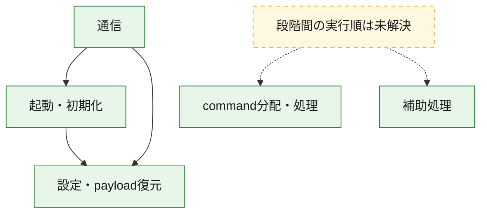
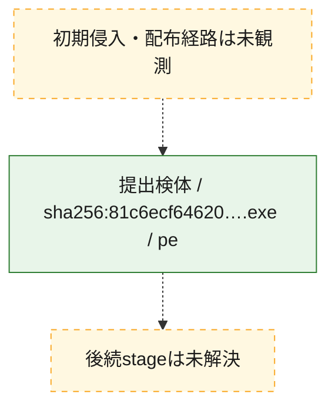
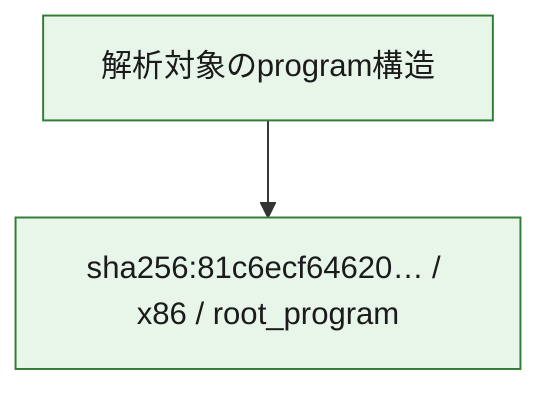

# 全体ロジック：81c6ecf64620a1dbce6d27dbf436165e82fd19414d06b8edc563c2b5379d5907

代表関数の静的証跡から、起動・初期化、設定・payload復元、通信、command分配・処理の処理群を確認しました。

## 読み方

- phaseの掲載順は解析上の整理順です。observed_call_edgesがない段階間の実行順を断定しません。
- 図の実線は静的に観測した関係、点線と黄色のノードは未観測・未解決の関係を示します。
- 図は静的な要約であり、動的実行を再現するものではありません。
- 詳細な関数解説とfingerprintは[STATIC-LOGIC.md](STATIC-LOGIC.md)を参照してください。

## 静的可視化

### 実行フロー

### 感染チェーン

### モジュール関係

## 処理段階

### 1. 起動・初期化

entry pointから初期化と後続処理への移行を確認します。
確度: `confirmed_static_function_evidence`

- `81c6ecf64620a1dbce6d27dbf436165e82fd19414d06b8edc563c2b5379d5907:ghidra:140009b17` — 初期化と主要処理への分岐を行う入口関数です。 状態: `succeeded`、選定理由: `entry_point`, `meaningful_symbol_name`, `reviewed_call_centrality:7`, `role:entrypoint`
- `81c6ecf64620a1dbce6d27dbf436165e82fd19414d06b8edc563c2b5379d5907:ghidra:14000fec4` — 初期化と主要処理への分岐を行う入口関数です。 状態: `succeeded`、選定理由: `entry_point`, `meaningful_symbol_name`, `probable_go_main_user_code`, `reviewed_call_centrality:23`, `role:entrypoint`

### 2. 設定・payload復元

設定、resource、payload、暗号化データの復元・変換を確認します。
確度: `confirmed_static_function_evidence`

- `81c6ecf64620a1dbce6d27dbf436165e82fd19414d06b8edc563c2b5379d5907:ghidra:1400016e1` — 設定、resource、payloadなどの解析・変換を行う関数です。 状態: `succeeded`、選定理由: `meaningful_symbol_name`, `reviewed_call_centrality:1`, `role:config_or_data_transform`
- `81c6ecf64620a1dbce6d27dbf436165e82fd19414d06b8edc563c2b5379d5907:ghidra:140001c94` — 設定、resource、payloadなどの解析・変換を行う関数です。 状態: `succeeded`、選定理由: `meaningful_symbol_name`, `reviewed_call_centrality:1`, `role:config_or_data_transform`
- `81c6ecf64620a1dbce6d27dbf436165e82fd19414d06b8edc563c2b5379d5907:ghidra:1400022ae` — 暗号、hash、encoding、または復号処理に関係する関数です。 状態: `succeeded`、選定理由: `meaningful_symbol_name`, `reviewed_call_centrality:4`, `role:cryptographic_transform`
- `81c6ecf64620a1dbce6d27dbf436165e82fd19414d06b8edc563c2b5379d5907:ghidra:140002ecc` — 暗号、hash、encoding、または復号処理に関係する関数です。 状態: `succeeded`、選定理由: `meaningful_symbol_name`, `reviewed_call_centrality:4`, `role:cryptographic_transform`
- `81c6ecf64620a1dbce6d27dbf436165e82fd19414d06b8edc563c2b5379d5907:ghidra:140002fb6` — 暗号、hash、encoding、または復号処理に関係する関数です。 状態: `succeeded`、選定理由: `meaningful_symbol_name`, `reviewed_call_centrality:12`, `role:cryptographic_transform`
- `81c6ecf64620a1dbce6d27dbf436165e82fd19414d06b8edc563c2b5379d5907:ghidra:1400031e9` — 設定、resource、payloadなどの解析・変換を行う関数です。 状態: `succeeded`、選定理由: `meaningful_symbol_name`, `reviewed_call_centrality:13`, `role:config_or_data_transform`
- `81c6ecf64620a1dbce6d27dbf436165e82fd19414d06b8edc563c2b5379d5907:ghidra:140003c95` — 設定、resource、payloadなどの解析・変換を行う関数です。 状態: `succeeded`、選定理由: `meaningful_symbol_name`, `reviewed_call_centrality:1`, `role:config_or_data_transform`
- `81c6ecf64620a1dbce6d27dbf436165e82fd19414d06b8edc563c2b5379d5907:ghidra:140005261` — 設定、resource、payloadなどの解析・変換を行う関数です。 状態: `succeeded`、選定理由: `meaningful_symbol_name`, `reviewed_call_centrality:2`, `role:config_or_data_transform`
- `81c6ecf64620a1dbce6d27dbf436165e82fd19414d06b8edc563c2b5379d5907:ghidra:140005dfb` — 暗号、hash、encoding、または復号処理に関係する関数です。 状態: `succeeded`、選定理由: `meaningful_symbol_name`, `reviewed_call_centrality:2`, `role:cryptographic_transform`
- `81c6ecf64620a1dbce6d27dbf436165e82fd19414d06b8edc563c2b5379d5907:ghidra:140005f7d` — 設定、resource、payloadなどの解析・変換を行う関数です。 状態: `succeeded`、選定理由: `meaningful_symbol_name`, `reviewed_call_centrality:12`, `role:config_or_data_transform`
- `81c6ecf64620a1dbce6d27dbf436165e82fd19414d06b8edc563c2b5379d5907:ghidra:1400064c3` — 設定、resource、payloadなどの解析・変換を行う関数です。 状態: `succeeded`、選定理由: `meaningful_symbol_name`, `reviewed_call_centrality:9`, `role:config_or_data_transform`
- `81c6ecf64620a1dbce6d27dbf436165e82fd19414d06b8edc563c2b5379d5907:ghidra:140008267` — 設定、resource、payloadなどの解析・変換を行う関数です。 状態: `succeeded`、選定理由: `meaningful_symbol_name`, `reviewed_call_centrality:1`, `role:config_or_data_transform`
- `81c6ecf64620a1dbce6d27dbf436165e82fd19414d06b8edc563c2b5379d5907:ghidra:14000a6ca` — 設定、resource、payloadなどの解析・変換を行う関数です。 状態: `succeeded`、選定理由: `meaningful_symbol_name`, `reviewed_call_centrality:7`, `role:config_or_data_transform`

### 3. 通信

通信初期化、endpoint処理、送受信の役割を確認します。
確度: `confirmed_static_function_evidence`

- `81c6ecf64620a1dbce6d27dbf436165e82fd19414d06b8edc563c2b5379d5907:ghidra:140005b93` — 通信初期化、送受信、またはendpoint処理に関係する関数です。 状態: `succeeded`、選定理由: `meaningful_symbol_name`, `reviewed_call_centrality:3`, `role:network_communication`
- `81c6ecf64620a1dbce6d27dbf436165e82fd19414d06b8edc563c2b5379d5907:ghidra:140006a82` — 通信初期化、送受信、またはendpoint処理に関係する関数です。 状態: `succeeded`、選定理由: `meaningful_symbol_name`, `reviewed_call_centrality:3`, `role:network_communication`
- `81c6ecf64620a1dbce6d27dbf436165e82fd19414d06b8edc563c2b5379d5907:ghidra:1400076c2` — 通信初期化、送受信、またはendpoint処理に関係する関数です。 状態: `succeeded`、選定理由: `meaningful_symbol_name`, `reviewed_call_centrality:3`, `role:network_communication`
- `81c6ecf64620a1dbce6d27dbf436165e82fd19414d06b8edc563c2b5379d5907:ghidra:140009059` — 通信初期化、送受信、またはendpoint処理に関係する関数です。 状態: `succeeded`、選定理由: `meaningful_symbol_name`, `reviewed_call_centrality:20`, `role:network_communication`
- `81c6ecf64620a1dbce6d27dbf436165e82fd19414d06b8edc563c2b5379d5907:ghidra:140009299` — 通信初期化、送受信、またはendpoint処理に関係する関数です。 状態: `succeeded`、選定理由: `meaningful_symbol_name`, `reviewed_call_centrality:5`, `role:network_communication`
- `81c6ecf64620a1dbce6d27dbf436165e82fd19414d06b8edc563c2b5379d5907:ghidra:1400095f6` — 通信初期化、送受信、またはendpoint処理に関係する関数です。 状態: `succeeded`、選定理由: `meaningful_symbol_name`, `reviewed_call_centrality:3`, `role:network_communication`
- `81c6ecf64620a1dbce6d27dbf436165e82fd19414d06b8edc563c2b5379d5907:ghidra:140009655` — 通信初期化、送受信、またはendpoint処理に関係する関数です。 状態: `succeeded`、選定理由: `meaningful_symbol_name`, `reviewed_call_centrality:4`, `role:network_communication`
- `81c6ecf64620a1dbce6d27dbf436165e82fd19414d06b8edc563c2b5379d5907:ghidra:140009791` — 通信初期化、送受信、またはendpoint処理に関係する関数です。 状態: `succeeded`、選定理由: `meaningful_symbol_name`, `reviewed_call_centrality:9`, `role:network_communication`
- `81c6ecf64620a1dbce6d27dbf436165e82fd19414d06b8edc563c2b5379d5907:ghidra:140009f05` — 通信初期化、送受信、またはendpoint処理に関係する関数です。 状態: `succeeded`、選定理由: `meaningful_symbol_name`, `reviewed_call_centrality:3`, `role:network_communication`
- `81c6ecf64620a1dbce6d27dbf436165e82fd19414d06b8edc563c2b5379d5907:ghidra:140009ff9` — 通信初期化、送受信、またはendpoint処理に関係する関数です。 状態: `succeeded`、選定理由: `meaningful_symbol_name`, `reviewed_call_centrality:15`, `role:network_communication`
- `81c6ecf64620a1dbce6d27dbf436165e82fd19414d06b8edc563c2b5379d5907:ghidra:14000b567` — 通信初期化、送受信、またはendpoint処理に関係する関数です。 状態: `succeeded`、選定理由: `meaningful_symbol_name`, `reviewed_call_centrality:11`, `role:network_communication`

### 4. command分配・処理

受信commandやtaskの解釈、分配、個別handlerへの移行を確認します。
確度: `confirmed_static_function_evidence`

- `81c6ecf64620a1dbce6d27dbf436165e82fd19414d06b8edc563c2b5379d5907:ghidra:14000aea9` — commandの解釈、分配、または個別処理を担当する関数です。 状態: `succeeded`、選定理由: `meaningful_symbol_name`, `reviewed_call_centrality:5`, `role:command_dispatch_or_handler`
- `81c6ecf64620a1dbce6d27dbf436165e82fd19414d06b8edc563c2b5379d5907:ghidra:14000b724` — commandの解釈、分配、または個別処理を担当する関数です。 状態: `succeeded`、選定理由: `meaningful_symbol_name`, `reviewed_call_centrality:5`, `role:command_dispatch_or_handler`
- `81c6ecf64620a1dbce6d27dbf436165e82fd19414d06b8edc563c2b5379d5907:ghidra:14000bb2b` — commandの解釈、分配、または個別処理を担当する関数です。 状態: `succeeded`、選定理由: `meaningful_symbol_name`, `reviewed_call_centrality:7`, `role:command_dispatch_or_handler`

### 5. 補助処理

主要処理を支える一般内部関数またはlibrary処理を確認します。
確度: `confirmed_static_function_evidence`

- `81c6ecf64620a1dbce6d27dbf436165e82fd19414d06b8edc563c2b5379d5907:ghidra:140001410` — 検体内部の一般処理を実装する関数です。 状態: `succeeded`、選定理由: `entry_point`, `meaningful_symbol_name`, `reviewed_call_centrality:1`
- `81c6ecf64620a1dbce6d27dbf436165e82fd19414d06b8edc563c2b5379d5907:ghidra:140010660` — compiler生成処理または汎用library処理とみられる関数です。 状態: `succeeded`、選定理由: `entry_point`, `meaningful_symbol_name`, `reviewed_call_centrality:1`
- `81c6ecf64620a1dbce6d27dbf436165e82fd19414d06b8edc563c2b5379d5907:ghidra:140010690` — compiler生成処理または汎用library処理とみられる関数です。 状態: `succeeded`、選定理由: `entry_point`, `meaningful_symbol_name`, `reviewed_call_centrality:2`

## 観測したcall関係

- `81c6ecf64620a1dbce6d27dbf436165e82fd19414d06b8edc563c2b5379d5907:ghidra:140002fb6` → `81c6ecf64620a1dbce6d27dbf436165e82fd19414d06b8edc563c2b5379d5907:ghidra:140002ecc` （`configuration` → `configuration`）
- `81c6ecf64620a1dbce6d27dbf436165e82fd19414d06b8edc563c2b5379d5907:ghidra:1400031e9` → `81c6ecf64620a1dbce6d27dbf436165e82fd19414d06b8edc563c2b5379d5907:ghidra:140002ecc` （`configuration` → `configuration`）
- `81c6ecf64620a1dbce6d27dbf436165e82fd19414d06b8edc563c2b5379d5907:ghidra:140005dfb` → `81c6ecf64620a1dbce6d27dbf436165e82fd19414d06b8edc563c2b5379d5907:ghidra:1400022ae` （`configuration` → `configuration`）
- `81c6ecf64620a1dbce6d27dbf436165e82fd19414d06b8edc563c2b5379d5907:ghidra:1400064c3` → `81c6ecf64620a1dbce6d27dbf436165e82fd19414d06b8edc563c2b5379d5907:ghidra:1400031e9` （`configuration` → `configuration`）
- `81c6ecf64620a1dbce6d27dbf436165e82fd19414d06b8edc563c2b5379d5907:ghidra:1400064c3` → `81c6ecf64620a1dbce6d27dbf436165e82fd19414d06b8edc563c2b5379d5907:ghidra:140005f7d` （`configuration` → `configuration`）
- `81c6ecf64620a1dbce6d27dbf436165e82fd19414d06b8edc563c2b5379d5907:ghidra:140006a82` → `81c6ecf64620a1dbce6d27dbf436165e82fd19414d06b8edc563c2b5379d5907:ghidra:140005b93` （`communication` → `communication`）
- `81c6ecf64620a1dbce6d27dbf436165e82fd19414d06b8edc563c2b5379d5907:ghidra:140009299` → `81c6ecf64620a1dbce6d27dbf436165e82fd19414d06b8edc563c2b5379d5907:ghidra:140009059` （`communication` → `communication`）
- `81c6ecf64620a1dbce6d27dbf436165e82fd19414d06b8edc563c2b5379d5907:ghidra:140009791` → `81c6ecf64620a1dbce6d27dbf436165e82fd19414d06b8edc563c2b5379d5907:ghidra:140002fb6` （`communication` → `configuration`）
- `81c6ecf64620a1dbce6d27dbf436165e82fd19414d06b8edc563c2b5379d5907:ghidra:140009791` → `81c6ecf64620a1dbce6d27dbf436165e82fd19414d06b8edc563c2b5379d5907:ghidra:1400095f6` （`communication` → `communication`）
- `81c6ecf64620a1dbce6d27dbf436165e82fd19414d06b8edc563c2b5379d5907:ghidra:140009ff9` → `81c6ecf64620a1dbce6d27dbf436165e82fd19414d06b8edc563c2b5379d5907:ghidra:140009b17` （`communication` → `startup`）
- `81c6ecf64620a1dbce6d27dbf436165e82fd19414d06b8edc563c2b5379d5907:ghidra:140009ff9` → `81c6ecf64620a1dbce6d27dbf436165e82fd19414d06b8edc563c2b5379d5907:ghidra:140009f05` （`communication` → `communication`）
- `81c6ecf64620a1dbce6d27dbf436165e82fd19414d06b8edc563c2b5379d5907:ghidra:14000b567` → `81c6ecf64620a1dbce6d27dbf436165e82fd19414d06b8edc563c2b5379d5907:ghidra:140009ff9` （`communication` → `communication`）
- `81c6ecf64620a1dbce6d27dbf436165e82fd19414d06b8edc563c2b5379d5907:ghidra:14000fec4` → `81c6ecf64620a1dbce6d27dbf436165e82fd19414d06b8edc563c2b5379d5907:ghidra:1400064c3` （`startup` → `configuration`）
- `ghidra-function:128bffc4e23034e17fe9ce12` → `ghidra-external:2e2b9f0a2c8c4e4f81076afa` （`unclassified` → `unclassified`）
- `ghidra-function:128bffc4e23034e17fe9ce12` → `ghidra-external:48c05fc2467d5590e38a2515` （`unclassified` → `unclassified`）
- `ghidra-function:128bffc4e23034e17fe9ce12` → `ghidra-external:506587d7e6b56e2e04e4bf82` （`unclassified` → `unclassified`）
- `ghidra-function:128bffc4e23034e17fe9ce12` → `ghidra-external:58018a062e23a86f12d2251d` （`unclassified` → `unclassified`）
- `ghidra-function:128bffc4e23034e17fe9ce12` → `ghidra-external:bf62e4b5fc961d7def0040c3` （`unclassified` → `unclassified`）
- `ghidra-function:128bffc4e23034e17fe9ce12` → `ghidra-function:6367314bbfc2fd1eaca14e01` （`unclassified` → `unclassified`）
- `ghidra-function:128bffc4e23034e17fe9ce12` → `ghidra-function:6400d5b2e5368b156893386b` （`unclassified` → `unclassified`）
- `ghidra-function:128bffc4e23034e17fe9ce12` → `ghidra-function:792a0208df6d247db63867e6` （`unclassified` → `unclassified`）
- `ghidra-function:128bffc4e23034e17fe9ce12` → `ghidra-function:8dcecbd917944bb4c3ed7045` （`unclassified` → `unclassified`）
- `ghidra-function:128bffc4e23034e17fe9ce12` → `ghidra-function:9c013737fcc80bc7d3566490` （`unclassified` → `unclassified`）
- `ghidra-function:128bffc4e23034e17fe9ce12` → `ghidra-function:c61baea0094402e5ab98029c` （`unclassified` → `unclassified`）
- `ghidra-function:171daebb26bda49c8de69a6a` → `ghidra-external:09d1ad421b52f75db375e366` （`unclassified` → `unclassified`）
- `ghidra-function:171daebb26bda49c8de69a6a` → `ghidra-external:78858e669b3a34afda7a327f` （`unclassified` → `unclassified`）
- `ghidra-function:171daebb26bda49c8de69a6a` → `ghidra-external:cb69b9f041187a075b179b5b` （`unclassified` → `unclassified`）
- `ghidra-function:171daebb26bda49c8de69a6a` → `ghidra-external:f9550e7436495dd779d2fee8` （`unclassified` → `unclassified`）
- `ghidra-function:171daebb26bda49c8de69a6a` → `ghidra-function:be4e948887fb28adbadcd737` （`unclassified` → `unclassified`）
- `ghidra-function:171daebb26bda49c8de69a6a` → `ghidra-function:e7922bf9d0c48739d010e79d` （`unclassified` → `unclassified`）
- `ghidra-function:1b0ef2cdc5943d3e7c22810b` → `ghidra-external:23cf7a26f1305942f6dab75f` （`unclassified` → `unclassified`）
- `ghidra-function:1b0ef2cdc5943d3e7c22810b` → `ghidra-external:40c302907eee4201c617c024` （`unclassified` → `unclassified`）
- `ghidra-function:1b0ef2cdc5943d3e7c22810b` → `ghidra-external:7a9a1cd6e6b6234eecdbce7c` （`unclassified` → `unclassified`）
- `ghidra-function:1b0ef2cdc5943d3e7c22810b` → `ghidra-external:bcfcf264306fe0bb66e5339e` （`unclassified` → `unclassified`）
- `ghidra-function:1b0ef2cdc5943d3e7c22810b` → `ghidra-external:f9550e7436495dd779d2fee8` （`unclassified` → `unclassified`）
- `ghidra-function:1b0ef2cdc5943d3e7c22810b` → `ghidra-function:3eb1c81504bbd243341bb94e` （`unclassified` → `unclassified`）
- `ghidra-function:1b0ef2cdc5943d3e7c22810b` → `ghidra-function:4dc519d84db08f00a5a33973` （`unclassified` → `unclassified`）
- `ghidra-function:1b0ef2cdc5943d3e7c22810b` → `ghidra-function:6927de92041590a71ae176e5` （`unclassified` → `unclassified`）
- `ghidra-function:1b0ef2cdc5943d3e7c22810b` → `ghidra-function:6b0f74a84564075e4a84d288` （`unclassified` → `unclassified`）
- `ghidra-function:1b0ef2cdc5943d3e7c22810b` → `ghidra-function:a42de6f4beb4d95b9e001103` （`unclassified` → `unclassified`）
- `ghidra-function:1b0ef2cdc5943d3e7c22810b` → `ghidra-function:cdb575e267f097dc7bf88a56` （`unclassified` → `unclassified`）
- `ghidra-function:216d2e41e41646c152e90db9` → `ghidra-external:120008b31cb043cc7a25fc50` （`unclassified` → `unclassified`）
- `ghidra-function:216d2e41e41646c152e90db9` → `ghidra-external:23cf7a26f1305942f6dab75f` （`unclassified` → `unclassified`）
- `ghidra-function:216d2e41e41646c152e90db9` → `ghidra-external:39804816af7a7bbc530578ce` （`unclassified` → `unclassified`）
- `ghidra-function:216d2e41e41646c152e90db9` → `ghidra-external:3cdbc78bdd05896f7cdaf742` （`unclassified` → `unclassified`）
- `ghidra-function:216d2e41e41646c152e90db9` → `ghidra-external:506587d7e6b56e2e04e4bf82` （`unclassified` → `unclassified`）
- `ghidra-function:216d2e41e41646c152e90db9` → `ghidra-external:7adedb5f46a894ddaf2ef81d` （`unclassified` → `unclassified`）
- `ghidra-function:216d2e41e41646c152e90db9` → `ghidra-external:ea877827f7a606cf519ded5a` （`unclassified` → `unclassified`）
- `ghidra-function:216d2e41e41646c152e90db9` → `ghidra-external:f9550e7436495dd779d2fee8` （`unclassified` → `unclassified`）
- `ghidra-function:216d2e41e41646c152e90db9` → `ghidra-function:171daebb26bda49c8de69a6a` （`unclassified` → `unclassified`）
- `ghidra-function:216d2e41e41646c152e90db9` → `ghidra-function:1a644da97253c3ba4c27df65` （`unclassified` → `unclassified`）
- `ghidra-function:216d2e41e41646c152e90db9` → `ghidra-function:7b401bee3e713012e53a8ea6` （`unclassified` → `unclassified`）
- `ghidra-function:216d2e41e41646c152e90db9` → `ghidra-function:a77d4be7812d16b3bc39737f` （`unclassified` → `unclassified`）
- `ghidra-function:216d2e41e41646c152e90db9` → `ghidra-function:cfb197b91c1859f3bd487444` （`unclassified` → `unclassified`）
- `ghidra-function:29151af32df1b54e7a5770f4` → `ghidra-external:5376eadddcffed3e6372f1d7` （`unclassified` → `unclassified`）
- `ghidra-function:33553497aa4cf77be74cce58` → `ghidra-external:23cf7a26f1305942f6dab75f` （`unclassified` → `unclassified`）
- `ghidra-function:33553497aa4cf77be74cce58` → `ghidra-function:387724a0085c4d691ce7f3b3` （`unclassified` → `unclassified`）
- `ghidra-function:33553497aa4cf77be74cce58` → `ghidra-function:61796288fed5624da83f2828` （`unclassified` → `unclassified`）
- `ghidra-function:33553497aa4cf77be74cce58` → `ghidra-function:cfb197b91c1859f3bd487444` （`unclassified` → `unclassified`）
- `ghidra-function:3d23adc4309bff032d10e3ff` → `ghidra-function:54b473a08b41f6d9eae35a34` （`unclassified` → `unclassified`）
- `ghidra-function:5402cba41f6683a655703ef7` → `ghidra-external:3fd1251683c9d219ad718aca` （`unclassified` → `unclassified`）
- `ghidra-function:5402cba41f6683a655703ef7` → `ghidra-function:a6179d3b9222270244ae5df0` （`unclassified` → `unclassified`）
- `ghidra-function:61796288fed5624da83f2828` → `ghidra-external:1053c4079147c773e014b180` （`unclassified` → `unclassified`）
- `ghidra-function:61796288fed5624da83f2828` → `ghidra-external:23cf7a26f1305942f6dab75f` （`unclassified` → `unclassified`）
- `ghidra-function:61796288fed5624da83f2828` → `ghidra-external:7e55717339a67ee2cd0b2ec2` （`unclassified` → `unclassified`）
- `ghidra-function:61796288fed5624da83f2828` → `ghidra-external:a0d5451ff83e7322387ad984` （`unclassified` → `unclassified`）
- `ghidra-function:61796288fed5624da83f2828` → `ghidra-external:d3fd950b7af368097e1b21e1` （`unclassified` → `unclassified`）
- `ghidra-function:61796288fed5624da83f2828` → `ghidra-function:1af6541734921c55a8f08e60` （`unclassified` → `unclassified`）
- `ghidra-function:61796288fed5624da83f2828` → `ghidra-function:6e3a3f046e9b7b0a3f1e00b6` （`unclassified` → `unclassified`）
- `ghidra-function:61796288fed5624da83f2828` → `ghidra-function:71dc800dac5f64011204d03d` （`unclassified` → `unclassified`）
- `ghidra-function:61796288fed5624da83f2828` → `ghidra-function:883137169b5fc216c0039365` （`unclassified` → `unclassified`）
- `ghidra-function:61796288fed5624da83f2828` → `ghidra-function:88a59cbf7b9fce36d5a1a3e4` （`unclassified` → `unclassified`）
- `ghidra-function:61796288fed5624da83f2828` → `ghidra-function:9b42d0a40c8a1b12c1861c44` （`unclassified` → `unclassified`）
- `ghidra-function:61796288fed5624da83f2828` → `ghidra-function:d758bce117960ce7fce6364b` （`unclassified` → `unclassified`）
- `ghidra-function:627ec353759be4b355b30d92` → `ghidra-external:40c302907eee4201c617c024` （`unclassified` → `unclassified`）
- `ghidra-function:627ec353759be4b355b30d92` → `ghidra-external:f9550e7436495dd779d2fee8` （`unclassified` → `unclassified`）
- `ghidra-function:627ec353759be4b355b30d92` → `ghidra-function:6927de92041590a71ae176e5` （`unclassified` → `unclassified`）
- `ghidra-function:627ec353759be4b355b30d92` → `ghidra-function:6b0f74a84564075e4a84d288` （`unclassified` → `unclassified`）
- `ghidra-function:627ec353759be4b355b30d92` → `ghidra-function:a42de6f4beb4d95b9e001103` （`unclassified` → `unclassified`）
- `ghidra-function:781699acd7230d359422ed3c` → `ghidra-external:3cdbc78bdd05896f7cdaf742` （`unclassified` → `unclassified`）
- `ghidra-function:781699acd7230d359422ed3c` → `ghidra-function:0936a81b85660b089e24e549` （`unclassified` → `unclassified`）
- `ghidra-function:781699acd7230d359422ed3c` → `ghidra-function:128bffc4e23034e17fe9ce12` （`unclassified` → `unclassified`）
- `ghidra-function:781699acd7230d359422ed3c` → `ghidra-function:2f331b8eef0474a97a88f4c4` （`unclassified` → `unclassified`）
- `ghidra-function:781699acd7230d359422ed3c` → `ghidra-function:5402cba41f6683a655703ef7` （`unclassified` → `unclassified`）
- `ghidra-function:781699acd7230d359422ed3c` → `ghidra-function:829bf8526e61b92685df624c` （`unclassified` → `unclassified`）
- `ghidra-function:781699acd7230d359422ed3c` → `ghidra-function:aef4a851a529f3933fd8a8ec` （`unclassified` → `unclassified`）
- `ghidra-function:781699acd7230d359422ed3c` → `ghidra-function:b6956c26c02e6e056b80f58c` （`unclassified` → `unclassified`）
- `ghidra-function:781699acd7230d359422ed3c` → `ghidra-function:dd665befdc03c6a586b78d48` （`unclassified` → `unclassified`）
- `ghidra-function:7b401bee3e713012e53a8ea6` → `ghidra-external:3cdbc78bdd05896f7cdaf742` （`unclassified` → `unclassified`）
- `ghidra-function:7b401bee3e713012e53a8ea6` → `ghidra-external:d3fd950b7af368097e1b21e1` （`unclassified` → `unclassified`）
- `ghidra-function:9133f0ddae30a39fe5125eab` → `ghidra-external:506587d7e6b56e2e04e4bf82` （`unclassified` → `unclassified`）
- `ghidra-function:9133f0ddae30a39fe5125eab` → `ghidra-external:f9550e7436495dd779d2fee8` （`unclassified` → `unclassified`）
- `ghidra-function:9133f0ddae30a39fe5125eab` → `ghidra-function:38a5ced037f2ec9c0e86cd6b` （`unclassified` → `unclassified`）
- `ghidra-function:91acab3bed677a5c5a483ca1` → `ghidra-external:23cf7a26f1305942f6dab75f` （`unclassified` → `unclassified`）
- `ghidra-function:91acab3bed677a5c5a483ca1` → `ghidra-external:3cdbc78bdd05896f7cdaf742` （`unclassified` → `unclassified`）
- `ghidra-function:91acab3bed677a5c5a483ca1` → `ghidra-external:d3fd950b7af368097e1b21e1` （`unclassified` → `unclassified`）
- `ghidra-function:91acab3bed677a5c5a483ca1` → `ghidra-function:1b0ef2cdc5943d3e7c22810b` （`unclassified` → `unclassified`）
- `ghidra-function:91acab3bed677a5c5a483ca1` → `ghidra-function:387724a0085c4d691ce7f3b3` （`unclassified` → `unclassified`）
- `ghidra-function:91acab3bed677a5c5a483ca1` → `ghidra-function:9371f50d42c135942964548d` （`unclassified` → `unclassified`）
- `ghidra-function:91acab3bed677a5c5a483ca1` → `ghidra-function:cfb197b91c1859f3bd487444` （`unclassified` → `unclassified`）
- `ghidra-function:9371f50d42c135942964548d` → `ghidra-external:2e2b9f0a2c8c4e4f81076afa` （`unclassified` → `unclassified`）
- `ghidra-function:9371f50d42c135942964548d` → `ghidra-external:40215a6b1a6268cef034e52b` （`unclassified` → `unclassified`）
- `ghidra-function:9371f50d42c135942964548d` → `ghidra-external:48c05fc2467d5590e38a2515` （`unclassified` → `unclassified`）
- `ghidra-function:9371f50d42c135942964548d` → `ghidra-external:506587d7e6b56e2e04e4bf82` （`unclassified` → `unclassified`）
- `ghidra-function:9371f50d42c135942964548d` → `ghidra-external:58018a062e23a86f12d2251d` （`unclassified` → `unclassified`）
- `ghidra-function:9371f50d42c135942964548d` → `ghidra-external:bf62e4b5fc961d7def0040c3` （`unclassified` → `unclassified`）
- `ghidra-function:9371f50d42c135942964548d` → `ghidra-external:f9550e7436495dd779d2fee8` （`unclassified` → `unclassified`）
- `ghidra-function:9371f50d42c135942964548d` → `ghidra-function:6367314bbfc2fd1eaca14e01` （`unclassified` → `unclassified`）
- `ghidra-function:9371f50d42c135942964548d` → `ghidra-function:6400d5b2e5368b156893386b` （`unclassified` → `unclassified`）
- `ghidra-function:9371f50d42c135942964548d` → `ghidra-function:792a0208df6d247db63867e6` （`unclassified` → `unclassified`）
- `ghidra-function:9371f50d42c135942964548d` → `ghidra-function:9c013737fcc80bc7d3566490` （`unclassified` → `unclassified`）
- `ghidra-function:9371f50d42c135942964548d` → `ghidra-function:c61baea0094402e5ab98029c` （`unclassified` → `unclassified`）
- `ghidra-function:97405b2930be82a2158116b8` → `ghidra-external:1053c4079147c773e014b180` （`unclassified` → `unclassified`）
- `ghidra-function:97405b2930be82a2158116b8` → `ghidra-external:23cf7a26f1305942f6dab75f` （`unclassified` → `unclassified`）
- `ghidra-function:97405b2930be82a2158116b8` → `ghidra-external:2dd5789d3a2bcceee9b51aed` （`unclassified` → `unclassified`）
- `ghidra-function:97405b2930be82a2158116b8` → `ghidra-external:5376eadddcffed3e6372f1d7` （`unclassified` → `unclassified`）
- `ghidra-function:97405b2930be82a2158116b8` → `ghidra-external:a0d5451ff83e7322387ad984` （`unclassified` → `unclassified`）
- `ghidra-function:97405b2930be82a2158116b8` → `ghidra-external:f7aae9e63081f172ec94aefc` （`unclassified` → `unclassified`）
- `ghidra-function:97405b2930be82a2158116b8` → `ghidra-external:f9550e7436495dd779d2fee8` （`unclassified` → `unclassified`）
- `ghidra-function:9fcac98d25e3a2837e2833d4` → `ghidra-function:040d41c33f4f1fb9b0ecf656` （`unclassified` → `unclassified`）
- `ghidra-function:9fcac98d25e3a2837e2833d4` → `ghidra-function:5ef802c8473ca435e71ed962` （`unclassified` → `unclassified`）
- `ghidra-function:9fcac98d25e3a2837e2833d4` → `ghidra-function:b9b9371246d6b4156eeb5670` （`unclassified` → `unclassified`）
- `ghidra-function:a5f8b6a207996827019ad763` → `ghidra-function:58b7b739b6a2645f34c8ff48` （`unclassified` → `unclassified`）
- `ghidra-function:a929a292c89f40460bbb79b0` → `ghidra-external:cb69b9f041187a075b179b5b` （`unclassified` → `unclassified`）
- `ghidra-function:a929a292c89f40460bbb79b0` → `ghidra-external:f9550e7436495dd779d2fee8` （`unclassified` → `unclassified`）
- `ghidra-function:b2a9e744a67264fbdf28f13b` → `ghidra-function:e2abed75b41c42195e134e2f` （`unclassified` → `unclassified`）
- `ghidra-function:b30500d683d2434e6a6d39b0` → `ghidra-external:7a9a1cd6e6b6234eecdbce7c` （`unclassified` → `unclassified`）
- `ghidra-function:b30500d683d2434e6a6d39b0` → `ghidra-function:03212b1379b1d18c054872ce` （`unclassified` → `unclassified`）
- `ghidra-function:b30500d683d2434e6a6d39b0` → `ghidra-function:d7ec1d021cc4dfdde1a91545` （`unclassified` → `unclassified`）
- `ghidra-function:b447e16967836f6e9b1f4d3e` → `ghidra-function:0936a81b85660b089e24e549` （`unclassified` → `unclassified`）
- `ghidra-function:b447e16967836f6e9b1f4d3e` → `ghidra-function:2f331b8eef0474a97a88f4c4` （`unclassified` → `unclassified`）
- `ghidra-function:b447e16967836f6e9b1f4d3e` → `ghidra-function:4dfbe4e3e981b0961f66755a` （`unclassified` → `unclassified`）
- `ghidra-function:b447e16967836f6e9b1f4d3e` → `ghidra-function:829bf8526e61b92685df624c` （`unclassified` → `unclassified`）
- `ghidra-function:b447e16967836f6e9b1f4d3e` → `ghidra-function:85f16a4fbe4f9108696d34fd` （`unclassified` → `unclassified`）
- `ghidra-function:b447e16967836f6e9b1f4d3e` → `ghidra-function:b6956c26c02e6e056b80f58c` （`unclassified` → `unclassified`）
- `ghidra-function:b447e16967836f6e9b1f4d3e` → `ghidra-function:c74fc95e78a36b37567a9f14` （`unclassified` → `unclassified`）
- `ghidra-function:bd1d0fee4eee618134815829` → `ghidra-external:40c302907eee4201c617c024` （`unclassified` → `unclassified`）
- `ghidra-function:bd1d0fee4eee618134815829` → `ghidra-external:f9550e7436495dd779d2fee8` （`unclassified` → `unclassified`）
- `ghidra-function:bd1d0fee4eee618134815829` → `ghidra-function:4dc519d84db08f00a5a33973` （`unclassified` → `unclassified`）
- `ghidra-function:bd1d0fee4eee618134815829` → `ghidra-function:6b0f74a84564075e4a84d288` （`unclassified` → `unclassified`）
- `ghidra-function:bd1d0fee4eee618134815829` → `ghidra-function:a42de6f4beb4d95b9e001103` （`unclassified` → `unclassified`）
- `ghidra-function:be2c6299ff2bd2480f6cd4d6` → `ghidra-function:8f2ed4cbe4bec0dc7352cf19` （`unclassified` → `unclassified`）
- `ghidra-function:c61baea0094402e5ab98029c` → `ghidra-function:6367314bbfc2fd1eaca14e01` （`unclassified` → `unclassified`）
- `ghidra-function:c61baea0094402e5ab98029c` → `ghidra-function:792a0208df6d247db63867e6` （`unclassified` → `unclassified`）
- `ghidra-function:d7779791dcf19e3367481bec` → `ghidra-external:3cdbc78bdd05896f7cdaf742` （`unclassified` → `unclassified`）
- `ghidra-function:d7779791dcf19e3367481bec` → `ghidra-external:506587d7e6b56e2e04e4bf82` （`unclassified` → `unclassified`）
- `ghidra-function:d7779791dcf19e3367481bec` → `ghidra-external:da0ff43453ccd49da9b407ca` （`unclassified` → `unclassified`）
- `ghidra-function:d7779791dcf19e3367481bec` → `ghidra-function:16da1ac7c975a30afb914b50` （`unclassified` → `unclassified`）
- `ghidra-function:d7ec1d021cc4dfdde1a91545` → `ghidra-function:694a8935e56a101cf49fa02e` （`unclassified` → `unclassified`）
- `ghidra-function:d7ec1d021cc4dfdde1a91545` → `ghidra-function:97a8f80917ff969edff8fab6` （`unclassified` → `unclassified`）
- `ghidra-function:db7984301d29697ef3b9910a` → `ghidra-function:4e6aeee5beb6c362fc767207` （`unclassified` → `unclassified`）
- `ghidra-function:db7984301d29697ef3b9910a` → `ghidra-function:9fcac98d25e3a2837e2833d4` （`unclassified` → `unclassified`）
- `ghidra-function:e4622a3052c1947684928894` → `ghidra-external:23cf7a26f1305942f6dab75f` （`unclassified` → `unclassified`）
- `ghidra-function:e4622a3052c1947684928894` → `ghidra-external:7a9a1cd6e6b6234eecdbce7c` （`unclassified` → `unclassified`）
- `ghidra-function:e4622a3052c1947684928894` → `ghidra-external:861d8a5d9333cd2ec8e08377` （`unclassified` → `unclassified`）
- `ghidra-function:e4622a3052c1947684928894` → `ghidra-external:bcfcf264306fe0bb66e5339e` （`unclassified` → `unclassified`）
- `ghidra-function:e4622a3052c1947684928894` → `ghidra-function:01cb6897571782f432c5a999` （`unclassified` → `unclassified`）
- `ghidra-function:e4622a3052c1947684928894` → `ghidra-function:07d2fb08c816b6018871ae4b` （`unclassified` → `unclassified`）
- `ghidra-function:e4622a3052c1947684928894` → `ghidra-function:0f6ea5305a7541e94fee5dce` （`unclassified` → `unclassified`）
- `ghidra-function:e4622a3052c1947684928894` → `ghidra-function:2f331b8eef0474a97a88f4c4` （`unclassified` → `unclassified`）
- `ghidra-function:e4622a3052c1947684928894` → `ghidra-function:309f9a87e57029cc473c1ad9` （`unclassified` → `unclassified`）
- `ghidra-function:e4622a3052c1947684928894` → `ghidra-function:3333a74af6645c7f29d53d8e` （`unclassified` → `unclassified`）
- `ghidra-function:e4622a3052c1947684928894` → `ghidra-function:3804cc6fbc42df5d5bed5304` （`unclassified` → `unclassified`）
- `ghidra-function:e4622a3052c1947684928894` → `ghidra-function:5388c56b3be5cedae65a07b3` （`unclassified` → `unclassified`）
- `ghidra-function:e4622a3052c1947684928894` → `ghidra-function:79ac07be6e8e296ae190018d` （`unclassified` → `unclassified`）
- `ghidra-function:e4622a3052c1947684928894` → `ghidra-function:7e431a17cf09eab3b4cd7e96` （`unclassified` → `unclassified`）
- `ghidra-function:e4622a3052c1947684928894` → `ghidra-function:841e0691a9d2697339e18a0d` （`unclassified` → `unclassified`）
- `ghidra-function:e4622a3052c1947684928894` → `ghidra-function:8dcecbd917944bb4c3ed7045` （`unclassified` → `unclassified`）
- `ghidra-function:e4622a3052c1947684928894` → `ghidra-function:91acab3bed677a5c5a483ca1` （`unclassified` → `unclassified`）
- `ghidra-function:e4622a3052c1947684928894` → `ghidra-function:a13188c97ea3137feac4eebf` （`unclassified` → `unclassified`）
- `ghidra-function:e4622a3052c1947684928894` → `ghidra-function:c4c179f8dce0765a0781adfd` （`unclassified` → `unclassified`）
- `ghidra-function:e4622a3052c1947684928894` → `ghidra-function:f7bcc346c24f02a56de0ed72` （`unclassified` → `unclassified`）
- `ghidra-function:f2417fc9c3f07b8b9a64a30a` → `ghidra-function:0936a81b85660b089e24e549` （`unclassified` → `unclassified`）
- `ghidra-function:f2417fc9c3f07b8b9a64a30a` → `ghidra-function:216d2e41e41646c152e90db9` （`unclassified` → `unclassified`）
- `ghidra-function:f2417fc9c3f07b8b9a64a30a` → `ghidra-function:2f331b8eef0474a97a88f4c4` （`unclassified` → `unclassified`）
- `ghidra-function:f2417fc9c3f07b8b9a64a30a` → `ghidra-function:4dfbe4e3e981b0961f66755a` （`unclassified` → `unclassified`）
- `ghidra-function:f2417fc9c3f07b8b9a64a30a` → `ghidra-function:517227ff76a72fd32b36dbdd` （`unclassified` → `unclassified`）
- `ghidra-function:f2417fc9c3f07b8b9a64a30a` → `ghidra-function:6296731da174e77ffbee9fe8` （`unclassified` → `unclassified`）
- `ghidra-function:f2417fc9c3f07b8b9a64a30a` → `ghidra-function:829bf8526e61b92685df624c` （`unclassified` → `unclassified`）
- `ghidra-function:f2417fc9c3f07b8b9a64a30a` → `ghidra-function:85f16a4fbe4f9108696d34fd` （`unclassified` → `unclassified`）
- `ghidra-function:f2417fc9c3f07b8b9a64a30a` → `ghidra-function:b6956c26c02e6e056b80f58c` （`unclassified` → `unclassified`）
- `ghidra-function:f2417fc9c3f07b8b9a64a30a` → `ghidra-function:d8bca84d1bbd38cdfc423b97` （`unclassified` → `unclassified`）
- `ghidra-function:f2417fc9c3f07b8b9a64a30a` → `ghidra-function:fa5a43caabec0ce9526e0197` （`unclassified` → `unclassified`）
- `ghidra-function:f38092fd57faa1fc87420276` → `ghidra-external:45a2c199a6a6676694cb30a3` （`unclassified` → `unclassified`）
- `ghidra-function:f38092fd57faa1fc87420276` → `ghidra-function:58b7b739b6a2645f34c8ff48` （`unclassified` → `unclassified`）
- `ghidra-function:f56f97654af5dc93ed62b30e` → `ghidra-function:a0899116d7f4335c0e2fafcc` （`unclassified` → `unclassified`）

## 解析範囲と制約

- 選定外関数は全体inventoryへ残しますが、関数本体の個別解説対象にはしていません。
- indirect call、難読化、packer、VM、壊れたcontrol flowによりcall関係が欠落する場合があります。
- 文書は静的解析に基づき、検体実行や外部通信による動的確認は行っていません。
