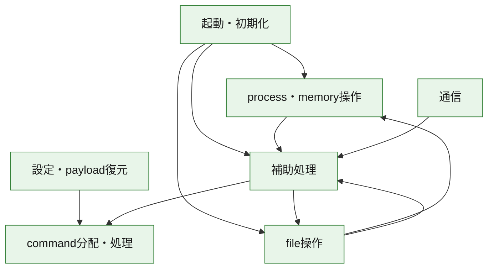

# 全体ロジック：81f7c1c8d2c8367c9774e9c684160a3baabe58e3f9a7be7b5db8efc49f634ff8

代表関数の静的証跡から、起動・初期化、設定・payload復元、process・memory操作、通信、command分配・処理、file操作の処理群を確認しました。

## 読み方

- phaseの掲載順は解析上の整理順です。observed_call_edgesがない段階間の実行順を断定しません。
- 図の実線は静的に観測した関係、点線と黄色のノードは未観測・未解決の関係を示します。
- 図は静的な要約であり、動的実行を再現するものではありません。
- 詳細な関数解説とfingerprintは[STATIC-LOGIC.md](STATIC-LOGIC.md)を参照してください。

## 静的可視化

### 実行フロー

### 感染チェーン

```mermaid
flowchart TD
  chain_initial["初期侵入・配布経路は未観測"]
  chain_01["提出検体 / sha256:81f7c1c8d2c8….exe / pe"]
  chain_02["静的復元層 1 / sha256:81f7c1c8d2c8….exe::nsis-member-000-pe.dll / pe"]
  chain_03["静的復元層 1 / sha256:81f7c1c8d2c8….exe::nsis-member-001-7z.7z / 7z"]
  chain_04["静的復元層 1 / sha256:81f7c1c8d2c8….exe::nsis-member-002-pe.dll / pe"]
  chain_05["静的復元層 1 / sha256:81f7c1c8d2c8….exe::nsis-member-003-pe.dll / pe"]
  chain_06["静的復元層 2 / sha256:81f7c1c8d2c8….exe::nsis-member-001-7z.7z::7z-data / data"]
  chain_07["静的復元層 2 / sha256:81f7c1c8d2c8….exe::nsis-member-001-7z.7z::7z-data / data"]
  chain_08["静的復元層 2 / sha256:81f7c1c8d2c8….exe::nsis-member-001-7z.7z::7z-data / data"]
  chain_09["静的復元層 2 / sha256:81f7c1c8d2c8….exe::nsis-member-001-7z.7z::7z-data / data"]
  chain_10["静的復元層 2 / sha256:81f7c1c8d2c8….exe::nsis-member-001-7z.7z::7z-data / data"]
  chain_11["静的復元層 2 / sha256:81f7c1c8d2c8….exe::nsis-member-001-7z.7z::7z-data / data"]
  chain_12["静的復元層 2 / sha256:81f7c1c8d2c8….exe::nsis-member-001-7z.7z::7z-pe / pe"]
  chain_13["静的復元層 2 / sha256:81f7c1c8d2c8….exe::nsis-member-001-7z.7z::7z-pe / pe"]
  chain_14["静的復元層 2 / sha256:81f7c1c8d2c8….exe::nsis-member-001-7z.7z::7z-pe / pe"]
  chain_15["静的復元層 2 / sha256:81f7c1c8d2c8….exe::nsis-member-001-7z.7z::7z-pe / pe"]
  chain_16["静的復元層 2 / sha256:81f7c1c8d2c8….exe::nsis-member-001-7z.7z::7z-pe / pe"]
  chain_01 -->|nsis-member-000-pe.dll| chain_02
  chain_01 -->|nsis-member-001-7z.7z| chain_03
  chain_01 -->|nsis-member-002-pe.dll| chain_04
  chain_01 -->|nsis-member-003-pe.dll| chain_05
  chain_03 -->|7z-data| chain_06
  chain_03 -->|7z-data| chain_07
  chain_03 -->|7z-data| chain_08
  chain_03 -->|7z-data| chain_09
  chain_03 -->|7z-data| chain_10
  chain_03 -->|7z-data| chain_11
  chain_03 -->|7z-pe| chain_12
  chain_03 -->|7z-pe| chain_13
  chain_03 -->|7z-pe| chain_14
  chain_03 -->|7z-pe| chain_15
  chain_03 -->|7z-pe| chain_16
  chain_initial -.-> chain_01
  chain_more["その他3層はstatic-layers.jsonを参照"]
  chain_02 -.-> chain_more
  chain_04 -.-> chain_more
  chain_05 -.-> chain_more
  chain_06 -.-> chain_more
  chain_07 -.-> chain_more
  chain_08 -.-> chain_more
  chain_09 -.-> chain_more
  chain_10 -.-> chain_more
  chain_11 -.-> chain_more
  chain_12 -.-> chain_more
  chain_13 -.-> chain_more
  chain_14 -.-> chain_more
  chain_15 -.-> chain_more
  chain_16 -.-> chain_more
  class chain_more unresolved
  class chain_01,chain_02,chain_03,chain_04,chain_05,chain_06,chain_07,chain_08,chain_09,chain_10,chain_11,chain_12,chain_13,chain_14,chain_15,chain_16 confirmed
  class chain_initial unresolved
  classDef confirmed fill:#e8f5e9,stroke:#2e7d32,color:#1b1b1b
  classDef unresolved fill:#fff8e1,stroke:#f9a825,color:#1b1b1b,stroke-dasharray:5 5
```

### モジュール関係

```mermaid
flowchart TD
  module_scope["解析対象のprogram構造"]
  module_01["sha256:3eb38ae99653… / x86 / statically_recovered_program"]
  module_02["sha256:b72e9013a620… / x86 / statically_recovered_program"]
  module_03["sha256:9b1fbf0c11c5… / x86 / statically_recovered_program"]
  module_04["sha256:b393f05e8ff9… / x86 / statically_recovered_program"]
  module_05["sha256:a4336a318e8d… / x86 / statically_recovered_program"]
  module_06["sha256:fa6b4e20eb44… / x86 / statically_recovered_program"]
  module_07["sha256:11daf2bf89a3… / x86 / statically_recovered_program"]
  module_08["sha256:7353f25dc5cf… / x86 / statically_recovered_program"]
  module_09["sha256:46afb1ed7ab1… / x86 / statically_recovered_program"]
  module_10["sha256:7b0baa9e2e73… / x86 / statically_recovered_program"]
  module_11["sha256:81f7c1c8d2c8… / x86 / root_program"]
  module_11 -->|静的復元| module_01
  module_11 -->|静的復元| module_02
  module_11 -->|静的復元| module_04
  module_scope --> module_11
  module_parent_unknown["復元元・親moduleは未特定"]
  module_parent_unknown -.-> module_03
  module_parent_unknown -.-> module_05
  module_parent_unknown -.-> module_06
  module_parent_unknown -.-> module_07
  module_parent_unknown -.-> module_08
  module_parent_unknown -.-> module_09
  module_parent_unknown -.-> module_10
  class module_parent_unknown unresolved
  class module_scope confirmed
  class module_01,module_02,module_03,module_04,module_05,module_06,module_07,module_08,module_09,module_10,module_11 confirmed
  classDef confirmed fill:#e8f5e9,stroke:#2e7d32,color:#1b1b1b
  classDef unresolved fill:#fff8e1,stroke:#f9a825,color:#1b1b1b,stroke-dasharray:5 5
```

## 処理段階

### 1. 起動・初期化

entry pointから初期化と後続処理への移行を確認します。
確度: `confirmed_static_function_evidence`

- `3eb38ae99653a7dbc724132ee240f6e5c4af4bfe7c01d31d23faf373f9f2eaca:ghidra:10002993` — 初期化と主要処理への分岐を行う入口関数です。 状態: `succeeded`、選定理由: `entry_point`, `meaningful_symbol_name`, `reviewed_call_centrality:2`, `role:entrypoint`, `small_program_complete_context`
- `b72e9013a6204e9f01076dc38dabbf30870d44dfc66962adbf73619d4331601e:ghidra:1000eab9` — 初期化と主要処理への分岐を行う入口関数です。 状態: `succeeded`、選定理由: `call_graph_centrality:in=0,out=3`, `entry_point`, `meaningful_symbol_name`, `reviewed_call_centrality:3`, `reviewed_call_centrality:5`, `role:entrypoint`, `small_program_complete_context`
- `a4336a318e8d92a47843d5fe429dc6d1ff7271d8bac189d719bc8074a128fd6e:ghidra:18001b280` — 初期化と主要処理への分岐を行う入口関数です。 状態: `succeeded`、選定理由: `entry_point`, `meaningful_symbol_name`, `reviewed_call_centrality:5`, `role:entrypoint`
- `fa6b4e20eb448746e2eff9a7fde7a62585e371f3497a6a928eade0a8ce8c1a9f:ghidra:18005f4c0` — 初期化と主要処理への分岐を行う入口関数です。 状態: `succeeded`、選定理由: `entry_point`, `meaningful_symbol_name`, `reviewed_call_centrality:5`, `role:entrypoint`
- `11daf2bf89a3ac660533b3e487e0624668b35f45d2bd94e9b0324bce8758de60:ghidra:1800b1d30` — 初期化と主要処理への分岐を行う入口関数です。 状態: `succeeded`、選定理由: `entry_point`, `meaningful_symbol_name`, `reviewed_call_centrality:5`, `role:entrypoint`
- `7353f25dc5cf84d09894e3e0461cef0e56799adbc617fce37620ca67240b547d:ghidra:180293cb0` — 初期化と主要処理への分岐を行う入口関数です。 状態: `succeeded`、選定理由: `entry_point`, `meaningful_symbol_name`, `reviewed_call_centrality:4`, `role:entrypoint`
- `46afb1ed7ab1b1a679e00784b2e78cc2358cec615553699624ff77882f55787b:ghidra:1803add90` — 初期化と主要処理への分岐を行う入口関数です。 状態: `succeeded`、選定理由: `entry_point`, `meaningful_symbol_name`, `reviewed_call_centrality:5`, `role:entrypoint`
- `7b0baa9e2e731716efe3e0bebf6a0bcd2d64f35d9f62b20d23acb4e098c9be36:ghidra:1804ad200` — 初期化と主要処理への分岐を行う入口関数です。 状態: `succeeded`、選定理由: `entry_point`, `meaningful_symbol_name`, `reviewed_call_centrality:5`, `role:entrypoint`
- `81f7c1c8d2c8367c9774e9c684160a3baabe58e3f9a7be7b5db8efc49f634ff8:ghidra:0040338f` — 初期化と主要処理への分岐を行う入口関数です。 状態: `succeeded`、選定理由: `call_graph_centrality:in=0,out=41`, `entry_point`, `large_function:instructions=410`, `meaningful_symbol_name`, `reviewed_call_centrality:45`, `reviewed_call_centrality:64`, `role:entrypoint`

### 2. 設定・payload復元

設定、resource、payload、暗号化データの復元・変換を確認します。
確度: `confirmed_static_function_evidence`

- `a4336a318e8d92a47843d5fe429dc6d1ff7271d8bac189d719bc8074a128fd6e:ghidra:1800011b0` — 設定、resource、payloadなどの解析・変換を行う関数です。 状態: `succeeded`、選定理由: `entry_point`, `meaningful_symbol_name`, `reviewed_call_centrality:2`, `role:config_or_data_transform`
- `a4336a318e8d92a47843d5fe429dc6d1ff7271d8bac189d719bc8074a128fd6e:ghidra:180001450` — 設定、resource、payloadなどの解析・変換を行う関数です。 状態: `succeeded`、選定理由: `entry_point`, `meaningful_symbol_name`, `reviewed_call_centrality:2`, `role:config_or_data_transform`
- `7b0baa9e2e731716efe3e0bebf6a0bcd2d64f35d9f62b20d23acb4e098c9be36:ghidra:18000b2e0` — 設定、resource、payloadなどの解析・変換を行う関数です。 状態: `succeeded`、選定理由: `entry_point`, `meaningful_symbol_name`, `reviewed_call_centrality:9`, `role:config_or_data_transform`
- `7b0baa9e2e731716efe3e0bebf6a0bcd2d64f35d9f62b20d23acb4e098c9be36:ghidra:18000b9c0` — 設定、resource、payloadなどの解析・変換を行う関数です。 状態: `succeeded`、選定理由: `entry_point`, `meaningful_symbol_name`, `reviewed_call_centrality:7`, `role:config_or_data_transform`
- `7b0baa9e2e731716efe3e0bebf6a0bcd2d64f35d9f62b20d23acb4e098c9be36:ghidra:180024610` — 設定、resource、payloadなどの解析・変換を行う関数です。 状態: `succeeded`、選定理由: `entry_point`, `meaningful_symbol_name`, `reviewed_call_centrality:28`, `role:config_or_data_transform`
- `7b0baa9e2e731716efe3e0bebf6a0bcd2d64f35d9f62b20d23acb4e098c9be36:ghidra:1800246c0` — 設定、resource、payloadなどの解析・変換を行う関数です。 状態: `succeeded`、選定理由: `entry_point`, `meaningful_symbol_name`, `reviewed_call_centrality:24`, `role:config_or_data_transform`
- `7b0baa9e2e731716efe3e0bebf6a0bcd2d64f35d9f62b20d23acb4e098c9be36:ghidra:180024770` — 設定、resource、payloadなどの解析・変換を行う関数です。 状態: `succeeded`、選定理由: `entry_point`, `meaningful_symbol_name`, `reviewed_call_centrality:20`, `role:config_or_data_transform`
- `7b0baa9e2e731716efe3e0bebf6a0bcd2d64f35d9f62b20d23acb4e098c9be36:ghidra:1800323f0` — 設定、resource、payloadなどの解析・変換を行う関数です。 状態: `succeeded`、選定理由: `entry_point`, `meaningful_symbol_name`, `reviewed_call_centrality:19`, `role:config_or_data_transform`
- `7b0baa9e2e731716efe3e0bebf6a0bcd2d64f35d9f62b20d23acb4e098c9be36:ghidra:18003f600` — 設定、resource、payloadなどの解析・変換を行う関数です。 状態: `succeeded`、選定理由: `entry_point`, `meaningful_symbol_name`, `reviewed_call_centrality:21`, `role:config_or_data_transform`
- `7b0baa9e2e731716efe3e0bebf6a0bcd2d64f35d9f62b20d23acb4e098c9be36:ghidra:180040e90` — 設定、resource、payloadなどの解析・変換を行う関数です。 状態: `succeeded`、選定理由: `entry_point`, `meaningful_symbol_name`, `reviewed_call_centrality:28`, `role:config_or_data_transform`
- `7b0baa9e2e731716efe3e0bebf6a0bcd2d64f35d9f62b20d23acb4e098c9be36:ghidra:180040ea0` — 設定、resource、payloadなどの解析・変換を行う関数です。 状態: `succeeded`、選定理由: `entry_point`, `meaningful_symbol_name`, `reviewed_call_centrality:24`, `role:config_or_data_transform`
- `7b0baa9e2e731716efe3e0bebf6a0bcd2d64f35d9f62b20d23acb4e098c9be36:ghidra:180040eb0` — 設定、resource、payloadなどの解析・変換を行う関数です。 状態: `succeeded`、選定理由: `entry_point`, `meaningful_symbol_name`, `reviewed_call_centrality:20`, `role:config_or_data_transform`
- `7b0baa9e2e731716efe3e0bebf6a0bcd2d64f35d9f62b20d23acb4e098c9be36:ghidra:1800422a0` — 設定、resource、payloadなどの解析・変換を行う関数です。 状態: `succeeded`、選定理由: `entry_point`, `meaningful_symbol_name`, `reviewed_call_centrality:19`, `role:config_or_data_transform`
- `7b0baa9e2e731716efe3e0bebf6a0bcd2d64f35d9f62b20d23acb4e098c9be36:ghidra:180043190` — 設定、resource、payloadなどの解析・変換を行う関数です。 状態: `succeeded`、選定理由: `entry_point`, `meaningful_symbol_name`, `reviewed_call_centrality:21`, `role:config_or_data_transform`

### 3. process・memory操作

process、thread、module、memory操作と実行移行を確認します。
確度: `confirmed_static_function_evidence`

- `81f7c1c8d2c8367c9774e9c684160a3baabe58e3f9a7be7b5db8efc49f634ff8:ghidra:00405461` — process、thread、module、またはmemory操作に関係する関数です。 状態: `succeeded`、選定理由: `call_graph_centrality:in=0,out=25`, `large_function:instructions=284`, `reviewed_call_centrality:25`, `reviewed_call_centrality:43`, `role:process_or_memory_operation`
- `81f7c1c8d2c8367c9774e9c684160a3baabe58e3f9a7be7b5db8efc49f634ff8:ghidra:004058a3` — process、thread、module、またはmemory操作に関係する関数です。 状態: `succeeded`、選定理由: `call_graph_centrality:in=2,out=2`, `reviewed_call_centrality:4`, `reviewed_call_centrality:6`, `role:process_or_memory_operation`

### 4. 通信

通信初期化、endpoint処理、送受信の役割を確認します。
確度: `confirmed_static_function_evidence`

- `11daf2bf89a3ac660533b3e487e0624668b35f45d2bd94e9b0324bce8758de60:ghidra:18004be50` — 通信初期化、送受信、またはendpoint処理に関係する関数です。 状態: `succeeded`、選定理由: `entry_point`, `meaningful_symbol_name`, `reviewed_call_centrality:11`, `role:network_communication`
- `11daf2bf89a3ac660533b3e487e0624668b35f45d2bd94e9b0324bce8758de60:ghidra:18004dd30` — 通信初期化、送受信、またはendpoint処理に関係する関数です。 状態: `succeeded`、選定理由: `entry_point`, `meaningful_symbol_name`, `reviewed_call_centrality:4`, `role:network_communication`

### 5. command分配・処理

受信commandやtaskの解釈、分配、個別handlerへの移行を確認します。
確度: `confirmed_static_function_evidence_with_limits`

- `a4336a318e8d92a47843d5fe429dc6d1ff7271d8bac189d719bc8074a128fd6e:ghidra:180045440` — commandの解釈、分配、または個別処理を担当する関数です。 状態: `limited_bad_instruction_or_flow`、選定理由: `meaningful_symbol_name`, `reviewed_call_centrality:26`, `role:command_dispatch_or_handler`
- `fa6b4e20eb448746e2eff9a7fde7a62585e371f3497a6a928eade0a8ce8c1a9f:ghidra:180032470` — commandの解釈、分配、または個別処理を担当する関数です。 状態: `succeeded`、選定理由: `entry_point`, `meaningful_symbol_name`, `reviewed_call_centrality:4`, `role:command_dispatch_or_handler`
- `fa6b4e20eb448746e2eff9a7fde7a62585e371f3497a6a928eade0a8ce8c1a9f:ghidra:180035400` — commandの解釈、分配、または個別処理を担当する関数です。 状態: `succeeded`、選定理由: `entry_point`, `meaningful_symbol_name`, `reviewed_call_centrality:4`, `role:command_dispatch_or_handler`
- `fa6b4e20eb448746e2eff9a7fde7a62585e371f3497a6a928eade0a8ce8c1a9f:ghidra:180035460` — commandの解釈、分配、または個別処理を担当する関数です。 状態: `succeeded`、選定理由: `entry_point`, `meaningful_symbol_name`, `reviewed_call_centrality:4`, `role:command_dispatch_or_handler`
- `fa6b4e20eb448746e2eff9a7fde7a62585e371f3497a6a928eade0a8ce8c1a9f:ghidra:1800354c0` — commandの解釈、分配、または個別処理を担当する関数です。 状態: `succeeded`、選定理由: `entry_point`, `meaningful_symbol_name`, `reviewed_call_centrality:4`, `role:command_dispatch_or_handler`
- `fa6b4e20eb448746e2eff9a7fde7a62585e371f3497a6a928eade0a8ce8c1a9f:ghidra:180035520` — commandの解釈、分配、または個別処理を担当する関数です。 状態: `succeeded`、選定理由: `entry_point`, `meaningful_symbol_name`, `reviewed_call_centrality:4`, `role:command_dispatch_or_handler`
- `fa6b4e20eb448746e2eff9a7fde7a62585e371f3497a6a928eade0a8ce8c1a9f:ghidra:180035580` — commandの解釈、分配、または個別処理を担当する関数です。 状態: `succeeded`、選定理由: `entry_point`, `meaningful_symbol_name`, `reviewed_call_centrality:4`, `role:command_dispatch_or_handler`
- `fa6b4e20eb448746e2eff9a7fde7a62585e371f3497a6a928eade0a8ce8c1a9f:ghidra:1800355e0` — commandの解釈、分配、または個別処理を担当する関数です。 状態: `failed_empty`、選定理由: `entry_point`, `meaningful_symbol_name`, `role:command_dispatch_or_handler`
- `fa6b4e20eb448746e2eff9a7fde7a62585e371f3497a6a928eade0a8ce8c1a9f:ghidra:180035640` — commandの解釈、分配、または個別処理を担当する関数です。 状態: `failed_empty`、選定理由: `entry_point`, `meaningful_symbol_name`, `role:command_dispatch_or_handler`
- `fa6b4e20eb448746e2eff9a7fde7a62585e371f3497a6a928eade0a8ce8c1a9f:ghidra:180035d00` — commandの解釈、分配、または個別処理を担当する関数です。 状態: `succeeded`、選定理由: `entry_point`, `meaningful_symbol_name`, `reviewed_call_centrality:4`, `role:command_dispatch_or_handler`
- `fa6b4e20eb448746e2eff9a7fde7a62585e371f3497a6a928eade0a8ce8c1a9f:ghidra:180035d60` — commandの解釈、分配、または個別処理を担当する関数です。 状態: `succeeded`、選定理由: `entry_point`, `meaningful_symbol_name`, `reviewed_call_centrality:4`, `role:command_dispatch_or_handler`
- `fa6b4e20eb448746e2eff9a7fde7a62585e371f3497a6a928eade0a8ce8c1a9f:ghidra:1800366c0` — commandの解釈、分配、または個別処理を担当する関数です。 状態: `succeeded`、選定理由: `entry_point`, `meaningful_symbol_name`, `reviewed_call_centrality:4`, `role:command_dispatch_or_handler`
- `fa6b4e20eb448746e2eff9a7fde7a62585e371f3497a6a928eade0a8ce8c1a9f:ghidra:180036e70` — commandの解釈、分配、または個別処理を担当する関数です。 状態: `succeeded`、選定理由: `entry_point`, `meaningful_symbol_name`, `reviewed_call_centrality:4`, `role:command_dispatch_or_handler`
- `fa6b4e20eb448746e2eff9a7fde7a62585e371f3497a6a928eade0a8ce8c1a9f:ghidra:180036ff0` — commandの解釈、分配、または個別処理を担当する関数です。 状態: `succeeded`、選定理由: `entry_point`, `meaningful_symbol_name`, `reviewed_call_centrality:4`, `role:command_dispatch_or_handler`
- `11daf2bf89a3ac660533b3e487e0624668b35f45d2bd94e9b0324bce8758de60:ghidra:1800e7e90` — commandの解釈、分配、または個別処理を担当する関数です。 状態: `limited_bad_instruction_or_flow`、選定理由: `meaningful_symbol_name`, `reviewed_call_centrality:3`, `role:command_dispatch_or_handler`
- `7353f25dc5cf84d09894e3e0461cef0e56799adbc617fce37620ca67240b547d:ghidra:180387ce0` — commandの解釈、分配、または個別処理を担当する関数です。 状態: `limited_bad_instruction_or_flow`、選定理由: `meaningful_symbol_name`, `role:command_dispatch_or_handler`
- `46afb1ed7ab1b1a679e00784b2e78cc2358cec615553699624ff77882f55787b:ghidra:180033c50` — commandの解釈、分配、または個別処理を担当する関数です。 状態: `succeeded`、選定理由: `entry_point`, `meaningful_symbol_name`, `reviewed_call_centrality:9`, `role:command_dispatch_or_handler`
- `46afb1ed7ab1b1a679e00784b2e78cc2358cec615553699624ff77882f55787b:ghidra:180033dc0` — commandの解釈、分配、または個別処理を担当する関数です。 状態: `succeeded`、選定理由: `entry_point`, `meaningful_symbol_name`, `reviewed_call_centrality:10`, `role:command_dispatch_or_handler`
- `46afb1ed7ab1b1a679e00784b2e78cc2358cec615553699624ff77882f55787b:ghidra:180033e30` — commandの解釈、分配、または個別処理を担当する関数です。 状態: `succeeded`、選定理由: `entry_point`, `meaningful_symbol_name`, `reviewed_call_centrality:2`, `role:command_dispatch_or_handler`
- `46afb1ed7ab1b1a679e00784b2e78cc2358cec615553699624ff77882f55787b:ghidra:180033e80` — commandの解釈、分配、または個別処理を担当する関数です。 状態: `succeeded`、選定理由: `entry_point`, `meaningful_symbol_name`, `reviewed_call_centrality:6`, `role:command_dispatch_or_handler`
- `46afb1ed7ab1b1a679e00784b2e78cc2358cec615553699624ff77882f55787b:ghidra:180033f90` — commandの解釈、分配、または個別処理を担当する関数です。 状態: `succeeded`、選定理由: `entry_point`, `meaningful_symbol_name`, `reviewed_call_centrality:7`, `role:command_dispatch_or_handler`
- `46afb1ed7ab1b1a679e00784b2e78cc2358cec615553699624ff77882f55787b:ghidra:180033fe0` — commandの解釈、分配、または個別処理を担当する関数です。 状態: `succeeded`、選定理由: `entry_point`, `meaningful_symbol_name`, `reviewed_call_centrality:6`, `role:command_dispatch_or_handler`
- `46afb1ed7ab1b1a679e00784b2e78cc2358cec615553699624ff77882f55787b:ghidra:1800340e0` — commandの解釈、分配、または個別処理を担当する関数です。 状態: `succeeded`、選定理由: `entry_point`, `meaningful_symbol_name`, `reviewed_call_centrality:1`, `role:command_dispatch_or_handler`
- `46afb1ed7ab1b1a679e00784b2e78cc2358cec615553699624ff77882f55787b:ghidra:180034120` — commandの解釈、分配、または個別処理を担当する関数です。 状態: `succeeded`、選定理由: `entry_point`, `meaningful_symbol_name`, `reviewed_call_centrality:4`, `role:command_dispatch_or_handler`
- `46afb1ed7ab1b1a679e00784b2e78cc2358cec615553699624ff77882f55787b:ghidra:180034eb0` — commandの解釈、分配、または個別処理を担当する関数です。 状態: `succeeded`、選定理由: `entry_point`, `meaningful_symbol_name`, `reviewed_call_centrality:8`, `role:command_dispatch_or_handler`
- `46afb1ed7ab1b1a679e00784b2e78cc2358cec615553699624ff77882f55787b:ghidra:180034f10` — commandの解釈、分配、または個別処理を担当する関数です。 状態: `succeeded`、選定理由: `entry_point`, `meaningful_symbol_name`, `reviewed_call_centrality:8`, `role:command_dispatch_or_handler`
- `46afb1ed7ab1b1a679e00784b2e78cc2358cec615553699624ff77882f55787b:ghidra:180037500` — commandの解釈、分配、または個別処理を担当する関数です。 状態: `succeeded`、選定理由: `entry_point`, `meaningful_symbol_name`, `reviewed_call_centrality:7`, `role:command_dispatch_or_handler`
- `46afb1ed7ab1b1a679e00784b2e78cc2358cec615553699624ff77882f55787b:ghidra:1800379d0` — commandの解釈、分配、または個別処理を担当する関数です。 状態: `succeeded`、選定理由: `entry_point`, `meaningful_symbol_name`, `reviewed_call_centrality:8`, `role:command_dispatch_or_handler`
- `46afb1ed7ab1b1a679e00784b2e78cc2358cec615553699624ff77882f55787b:ghidra:180038770` — commandの解釈、分配、または個別処理を担当する関数です。 状態: `succeeded`、選定理由: `entry_point`, `meaningful_symbol_name`, `reviewed_call_centrality:2`, `role:command_dispatch_or_handler`
- `7b0baa9e2e731716efe3e0bebf6a0bcd2d64f35d9f62b20d23acb4e098c9be36:ghidra:180023d80` — commandの解釈、分配、または個別処理を担当する関数です。 状態: `succeeded`、選定理由: `entry_point`, `meaningful_symbol_name`, `reviewed_call_centrality:26`, `role:command_dispatch_or_handler`
- `7b0baa9e2e731716efe3e0bebf6a0bcd2d64f35d9f62b20d23acb4e098c9be36:ghidra:180023e50` — commandの解釈、分配、または個別処理を担当する関数です。 状態: `succeeded`、選定理由: `entry_point`, `meaningful_symbol_name`, `reviewed_call_centrality:25`, `role:command_dispatch_or_handler`
- `7b0baa9e2e731716efe3e0bebf6a0bcd2d64f35d9f62b20d23acb4e098c9be36:ghidra:180040dd0` — commandの解釈、分配、または個別処理を担当する関数です。 状態: `succeeded`、選定理由: `entry_point`, `meaningful_symbol_name`, `reviewed_call_centrality:26`, `role:command_dispatch_or_handler`
- `7b0baa9e2e731716efe3e0bebf6a0bcd2d64f35d9f62b20d23acb4e098c9be36:ghidra:180040de0` — commandの解釈、分配、または個別処理を担当する関数です。 状態: `succeeded`、選定理由: `entry_point`, `meaningful_symbol_name`, `reviewed_call_centrality:25`, `role:command_dispatch_or_handler`

### 6. file操作

fileやdirectoryの作成、読書き、削除を確認します。
確度: `confirmed_static_function_evidence_with_limits`

- `7353f25dc5cf84d09894e3e0461cef0e56799adbc617fce37620ca67240b547d:ghidra:1800e77d0` — fileまたはdirectoryの読書き・管理に関係する関数です。 状態: `succeeded`、選定理由: `entry_point`, `meaningful_symbol_name`, `reviewed_call_centrality:13`, `role:file_operation`
- `7353f25dc5cf84d09894e3e0461cef0e56799adbc617fce37620ca67240b547d:ghidra:1800e7a40` — fileまたはdirectoryの読書き・管理に関係する関数です。 状態: `succeeded`、選定理由: `entry_point`, `meaningful_symbol_name`, `reviewed_call_centrality:9`, `role:file_operation`
- `81f7c1c8d2c8367c9774e9c684160a3baabe58e3f9a7be7b5db8efc49f634ff8:ghidra:00401434` — fileまたはdirectoryの読書き・管理に関係する関数です。 状態: `failed`、選定理由: `call_graph_centrality:in=1,out=105`, `large_function:instructions=1908`, `reviewed_call_centrality:110`, `reviewed_call_centrality:164`, `role:file_operation`
- `81f7c1c8d2c8367c9774e9c684160a3baabe58e3f9a7be7b5db8efc49f634ff8:ghidra:00405984` — fileまたはdirectoryの読書き・管理に関係する関数です。 状態: `succeeded`、選定理由: `call_graph_centrality:in=1,out=4`, `reviewed_call_centrality:5`, `reviewed_call_centrality:8`, `role:file_operation`
- `81f7c1c8d2c8367c9774e9c684160a3baabe58e3f9a7be7b5db8efc49f634ff8:ghidra:004059cc` — fileまたはdirectoryの読書き・管理に関係する関数です。 状態: `succeeded`、選定理由: `call_graph_centrality:in=3,out=15`, `large_function:instructions=148`, `reviewed_call_centrality:20`, `reviewed_call_centrality:22`, `role:file_operation`
- `81f7c1c8d2c8367c9774e9c684160a3baabe58e3f9a7be7b5db8efc49f634ff8:ghidra:00405db0` — fileまたはdirectoryの読書き・管理に関係する関数です。 状態: `succeeded`、選定理由: `call_graph_centrality:in=3,out=2`, `reviewed_call_centrality:5`, `reviewed_call_centrality:7`, `role:file_operation`
- `81f7c1c8d2c8367c9774e9c684160a3baabe58e3f9a7be7b5db8efc49f634ff8:ghidra:00405e33` — fileまたはdirectoryの読書き・管理に関係する関数です。 状態: `succeeded`、選定理由: `call_graph_centrality:in=4,out=1`, `reviewed_call_centrality:5`, `reviewed_call_centrality:6`, `role:file_operation`
- `81f7c1c8d2c8367c9774e9c684160a3baabe58e3f9a7be7b5db8efc49f634ff8:ghidra:00405e62` — fileまたはdirectoryの読書き・管理に関係する関数です。 状態: `succeeded`、選定理由: `call_graph_centrality:in=4,out=1`, `reviewed_call_centrality:5`, `reviewed_call_centrality:6`, `role:file_operation`
- `81f7c1c8d2c8367c9774e9c684160a3baabe58e3f9a7be7b5db8efc49f634ff8:ghidra:004065fd` — fileまたはdirectoryの読書き・管理に関係する関数です。 状態: `succeeded`、選定理由: `call_graph_centrality:in=3,out=2`, `reviewed_call_centrality:5`, `reviewed_call_centrality:7`, `role:file_operation`

### 7. 補助処理

主要処理を支える一般内部関数またはlibrary処理を確認します。
確度: `confirmed_static_function_evidence_with_limits`

- `b72e9013a6204e9f01076dc38dabbf30870d44dfc66962adbf73619d4331601e:ghidra:10005968` — 検体内部の一般処理を実装する関数です。 状態: `succeeded`、選定理由: `call_graph_centrality:in=1,out=2`, `reviewed_call_centrality:3`, `reviewed_call_centrality:5`, `small_program_complete_context`
- `9b1fbf0c11c520ae714af8aa9af12cfd48503eedecd7398d8992ee94d1b4dc37:ghidra:00401eda` — 検体内部の一般処理を実装する関数です。 状態: `succeeded`、選定理由: `meaningful_symbol_name`, `small_program_complete_context`
- `b393f05e8ff919ef071181050e1873c9a776e1a0ae8329aefff7007d0cadf592:ghidra:100248ac` — 検体内部の一般処理を実装する関数です。 状態: `failed_empty`、選定理由: `meaningful_symbol_name`, `small_program_complete_context`
- `a4336a318e8d92a47843d5fe429dc6d1ff7271d8bac189d719bc8074a128fd6e:ghidra:1800012b0` — 検体内部の一般処理を実装する関数です。 状態: `succeeded`、選定理由: `entry_point`, `meaningful_symbol_name`, `reviewed_call_centrality:2`
- `a4336a318e8d92a47843d5fe429dc6d1ff7271d8bac189d719bc8074a128fd6e:ghidra:1800012f0` — 検体内部の一般処理を実装する関数です。 状態: `succeeded`、選定理由: `entry_point`, `meaningful_symbol_name`, `reviewed_call_centrality:2`
- `a4336a318e8d92a47843d5fe429dc6d1ff7271d8bac189d719bc8074a128fd6e:ghidra:180001330` — 検体内部の一般処理を実装する関数です。 状態: `succeeded`、選定理由: `entry_point`, `meaningful_symbol_name`, `reviewed_call_centrality:2`
- `a4336a318e8d92a47843d5fe429dc6d1ff7271d8bac189d719bc8074a128fd6e:ghidra:180001370` — 検体内部の一般処理を実装する関数です。 状態: `succeeded`、選定理由: `entry_point`, `meaningful_symbol_name`, `reviewed_call_centrality:2`
- `a4336a318e8d92a47843d5fe429dc6d1ff7271d8bac189d719bc8074a128fd6e:ghidra:1800013b0` — 検体内部の一般処理を実装する関数です。 状態: `succeeded`、選定理由: `entry_point`, `meaningful_symbol_name`, `reviewed_call_centrality:2`
- `a4336a318e8d92a47843d5fe429dc6d1ff7271d8bac189d719bc8074a128fd6e:ghidra:1800013f0` — 検体内部の一般処理を実装する関数です。 状態: `succeeded`、選定理由: `entry_point`, `meaningful_symbol_name`, `reviewed_call_centrality:2`
- `a4336a318e8d92a47843d5fe429dc6d1ff7271d8bac189d719bc8074a128fd6e:ghidra:180001420` — 検体内部の一般処理を実装する関数です。 状態: `succeeded`、選定理由: `entry_point`, `meaningful_symbol_name`, `reviewed_call_centrality:2`
- `a4336a318e8d92a47843d5fe429dc6d1ff7271d8bac189d719bc8074a128fd6e:ghidra:180001490` — 検体内部の一般処理を実装する関数です。 状態: `failed_empty`、選定理由: `entry_point`, `meaningful_symbol_name`
- `a4336a318e8d92a47843d5fe429dc6d1ff7271d8bac189d719bc8074a128fd6e:ghidra:1800014d0` — 検体内部の一般処理を実装する関数です。 状態: `failed_empty`、選定理由: `entry_point`, `meaningful_symbol_name`
- `a4336a318e8d92a47843d5fe429dc6d1ff7271d8bac189d719bc8074a128fd6e:ghidra:1800014f0` — 検体内部の一般処理を実装する関数です。 状態: `succeeded`、選定理由: `entry_point`, `meaningful_symbol_name`, `reviewed_call_centrality:2`
- `a4336a318e8d92a47843d5fe429dc6d1ff7271d8bac189d719bc8074a128fd6e:ghidra:180001520` — 検体内部の一般処理を実装する関数です。 状態: `succeeded`、選定理由: `entry_point`, `meaningful_symbol_name`, `reviewed_call_centrality:2`
- `a4336a318e8d92a47843d5fe429dc6d1ff7271d8bac189d719bc8074a128fd6e:ghidra:180001550` — 検体内部の一般処理を実装する関数です。 状態: `succeeded`、選定理由: `entry_point`, `meaningful_symbol_name`, `reviewed_call_centrality:2`
- `a4336a318e8d92a47843d5fe429dc6d1ff7271d8bac189d719bc8074a128fd6e:ghidra:180001570` — 検体内部の一般処理を実装する関数です。 状態: `succeeded`、選定理由: `entry_point`, `meaningful_symbol_name`, `reviewed_call_centrality:2`
- `a4336a318e8d92a47843d5fe429dc6d1ff7271d8bac189d719bc8074a128fd6e:ghidra:1800015a0` — 検体内部の一般処理を実装する関数です。 状態: `succeeded`、選定理由: `entry_point`, `meaningful_symbol_name`, `reviewed_call_centrality:2`
- `a4336a318e8d92a47843d5fe429dc6d1ff7271d8bac189d719bc8074a128fd6e:ghidra:1800015e0` — 検体内部の一般処理を実装する関数です。 状態: `succeeded`、選定理由: `entry_point`, `meaningful_symbol_name`, `reviewed_call_centrality:2`
- `a4336a318e8d92a47843d5fe429dc6d1ff7271d8bac189d719bc8074a128fd6e:ghidra:180001620` — 検体内部の一般処理を実装する関数です。 状態: `succeeded`、選定理由: `entry_point`, `meaningful_symbol_name`, `reviewed_call_centrality:2`
- `a4336a318e8d92a47843d5fe429dc6d1ff7271d8bac189d719bc8074a128fd6e:ghidra:180001660` — 検体内部の一般処理を実装する関数です。 状態: `succeeded`、選定理由: `entry_point`, `meaningful_symbol_name`, `reviewed_call_centrality:2`
- `a4336a318e8d92a47843d5fe429dc6d1ff7271d8bac189d719bc8074a128fd6e:ghidra:180001690` — 検体内部の一般処理を実装する関数です。 状態: `succeeded`、選定理由: `entry_point`, `meaningful_symbol_name`, `reviewed_call_centrality:2`
- `a4336a318e8d92a47843d5fe429dc6d1ff7271d8bac189d719bc8074a128fd6e:ghidra:1800016d0` — 検体内部の一般処理を実装する関数です。 状態: `succeeded`、選定理由: `entry_point`, `meaningful_symbol_name`, `reviewed_call_centrality:2`
- `a4336a318e8d92a47843d5fe429dc6d1ff7271d8bac189d719bc8074a128fd6e:ghidra:180001700` — 検体内部の一般処理を実装する関数です。 状態: `succeeded`、選定理由: `entry_point`, `meaningful_symbol_name`, `reviewed_call_centrality:2`
- `a4336a318e8d92a47843d5fe429dc6d1ff7271d8bac189d719bc8074a128fd6e:ghidra:180001730` — 検体内部の一般処理を実装する関数です。 状態: `succeeded`、選定理由: `entry_point`, `meaningful_symbol_name`, `reviewed_call_centrality:2`
- `a4336a318e8d92a47843d5fe429dc6d1ff7271d8bac189d719bc8074a128fd6e:ghidra:180001750` — 検体内部の一般処理を実装する関数です。 状態: `succeeded`、選定理由: `entry_point`, `meaningful_symbol_name`, `reviewed_call_centrality:2`
- `a4336a318e8d92a47843d5fe429dc6d1ff7271d8bac189d719bc8074a128fd6e:ghidra:180001780` — 検体内部の一般処理を実装する関数です。 状態: `succeeded`、選定理由: `entry_point`, `meaningful_symbol_name`, `reviewed_call_centrality:2`
- `a4336a318e8d92a47843d5fe429dc6d1ff7271d8bac189d719bc8074a128fd6e:ghidra:1800017c0` — 検体内部の一般処理を実装する関数です。 状態: `succeeded`、選定理由: `entry_point`, `meaningful_symbol_name`, `reviewed_call_centrality:2`
- `a4336a318e8d92a47843d5fe429dc6d1ff7271d8bac189d719bc8074a128fd6e:ghidra:180001800` — 検体内部の一般処理を実装する関数です。 状態: `succeeded`、選定理由: `entry_point`, `meaningful_symbol_name`, `reviewed_call_centrality:2`
- `a4336a318e8d92a47843d5fe429dc6d1ff7271d8bac189d719bc8074a128fd6e:ghidra:180001840` — 検体内部の一般処理を実装する関数です。 状態: `failed_empty`、選定理由: `entry_point`, `meaningful_symbol_name`
- `a4336a318e8d92a47843d5fe429dc6d1ff7271d8bac189d719bc8074a128fd6e:ghidra:180001870` — 検体内部の一般処理を実装する関数です。 状態: `failed_empty`、選定理由: `entry_point`, `meaningful_symbol_name`
- `a4336a318e8d92a47843d5fe429dc6d1ff7271d8bac189d719bc8074a128fd6e:ghidra:18001a2c0` — compiler生成処理または汎用library処理とみられる関数です。 状態: `succeeded`、選定理由: `entry_point`, `meaningful_symbol_name`, `reviewed_call_centrality:2`
- `fa6b4e20eb448746e2eff9a7fde7a62585e371f3497a6a928eade0a8ce8c1a9f:ghidra:180032080` — 検体内部の一般処理を実装する関数です。 状態: `failed_empty`、選定理由: `entry_point`, `meaningful_symbol_name`
- `fa6b4e20eb448746e2eff9a7fde7a62585e371f3497a6a928eade0a8ce8c1a9f:ghidra:180032190` — 検体内部の一般処理を実装する関数です。 状態: `failed_empty`、選定理由: `entry_point`, `meaningful_symbol_name`
- `fa6b4e20eb448746e2eff9a7fde7a62585e371f3497a6a928eade0a8ce8c1a9f:ghidra:180032370` — 検体内部の一般処理を実装する関数です。 状態: `limited_bad_instruction_or_flow`、選定理由: `entry_point`, `meaningful_symbol_name`, `reviewed_call_centrality:8`
- `fa6b4e20eb448746e2eff9a7fde7a62585e371f3497a6a928eade0a8ce8c1a9f:ghidra:180032400` — 検体内部の一般処理を実装する関数です。 状態: `succeeded`、選定理由: `entry_point`, `meaningful_symbol_name`, `reviewed_call_centrality:4`
- `fa6b4e20eb448746e2eff9a7fde7a62585e371f3497a6a928eade0a8ce8c1a9f:ghidra:180032500` — 検体内部の一般処理を実装する関数です。 状態: `succeeded`、選定理由: `entry_point`, `meaningful_symbol_name`, `reviewed_call_centrality:4`
- `fa6b4e20eb448746e2eff9a7fde7a62585e371f3497a6a928eade0a8ce8c1a9f:ghidra:180032570` — 検体内部の一般処理を実装する関数です。 状態: `succeeded`、選定理由: `entry_point`, `meaningful_symbol_name`, `reviewed_call_centrality:17`
- `fa6b4e20eb448746e2eff9a7fde7a62585e371f3497a6a928eade0a8ce8c1a9f:ghidra:180032830` — 検体内部の一般処理を実装する関数です。 状態: `succeeded`、選定理由: `entry_point`, `meaningful_symbol_name`, `reviewed_call_centrality:17`
- `fa6b4e20eb448746e2eff9a7fde7a62585e371f3497a6a928eade0a8ce8c1a9f:ghidra:180032af0` — 検体内部の一般処理を実装する関数です。 状態: `succeeded`、選定理由: `entry_point`, `meaningful_symbol_name`, `reviewed_call_centrality:17`
- `fa6b4e20eb448746e2eff9a7fde7a62585e371f3497a6a928eade0a8ce8c1a9f:ghidra:180032dc0` — 検体内部の一般処理を実装する関数です。 状態: `succeeded`、選定理由: `entry_point`, `meaningful_symbol_name`, `reviewed_call_centrality:39`
- `fa6b4e20eb448746e2eff9a7fde7a62585e371f3497a6a928eade0a8ce8c1a9f:ghidra:1800334a0` — 検体内部の一般処理を実装する関数です。 状態: `limited_bad_instruction_or_flow`、選定理由: `entry_point`, `meaningful_symbol_name`, `reviewed_call_centrality:18`
- `fa6b4e20eb448746e2eff9a7fde7a62585e371f3497a6a928eade0a8ce8c1a9f:ghidra:180033670` — 検体内部の一般処理を実装する関数です。 状態: `succeeded`、選定理由: `entry_point`, `meaningful_symbol_name`, `reviewed_call_centrality:10`
- `fa6b4e20eb448746e2eff9a7fde7a62585e371f3497a6a928eade0a8ce8c1a9f:ghidra:180033740` — 検体内部の一般処理を実装する関数です。 状態: `succeeded`、選定理由: `entry_point`, `meaningful_symbol_name`, `reviewed_call_centrality:4`
- `fa6b4e20eb448746e2eff9a7fde7a62585e371f3497a6a928eade0a8ce8c1a9f:ghidra:1800337a0` — 検体内部の一般処理を実装する関数です。 状態: `succeeded`、選定理由: `entry_point`, `meaningful_symbol_name`, `reviewed_call_centrality:4`
- `fa6b4e20eb448746e2eff9a7fde7a62585e371f3497a6a928eade0a8ce8c1a9f:ghidra:180033800` — 検体内部の一般処理を実装する関数です。 状態: `succeeded`、選定理由: `entry_point`, `meaningful_symbol_name`, `reviewed_call_centrality:4`
- `fa6b4e20eb448746e2eff9a7fde7a62585e371f3497a6a928eade0a8ce8c1a9f:ghidra:180033860` — 検体内部の一般処理を実装する関数です。 状態: `succeeded`、選定理由: `entry_point`, `meaningful_symbol_name`, `reviewed_call_centrality:4`
- `fa6b4e20eb448746e2eff9a7fde7a62585e371f3497a6a928eade0a8ce8c1a9f:ghidra:1800338c0` — 検体内部の一般処理を実装する関数です。 状態: `succeeded`、選定理由: `entry_point`, `meaningful_symbol_name`, `reviewed_call_centrality:4`
- `fa6b4e20eb448746e2eff9a7fde7a62585e371f3497a6a928eade0a8ce8c1a9f:ghidra:180033920` — 検体内部の一般処理を実装する関数です。 状態: `failed_empty`、選定理由: `entry_point`, `meaningful_symbol_name`
- `fa6b4e20eb448746e2eff9a7fde7a62585e371f3497a6a928eade0a8ce8c1a9f:ghidra:180033980` — 検体内部の一般処理を実装する関数です。 状態: `failed_empty`、選定理由: `entry_point`, `meaningful_symbol_name`
- `11daf2bf89a3ac660533b3e487e0624668b35f45d2bd94e9b0324bce8758de60:ghidra:18004b5f0` — 検体内部の一般処理を実装する関数です。 状態: `succeeded`、選定理由: `entry_point`, `meaningful_symbol_name`, `reviewed_call_centrality:8`
- `11daf2bf89a3ac660533b3e487e0624668b35f45d2bd94e9b0324bce8758de60:ghidra:18004b6f0` — 検体内部の一般処理を実装する関数です。 状態: `succeeded`、選定理由: `entry_point`, `meaningful_symbol_name`, `reviewed_call_centrality:31`
- `11daf2bf89a3ac660533b3e487e0624668b35f45d2bd94e9b0324bce8758de60:ghidra:18004be90` — 検体内部の一般処理を実装する関数です。 状態: `succeeded`、選定理由: `entry_point`, `meaningful_symbol_name`
- `11daf2bf89a3ac660533b3e487e0624668b35f45d2bd94e9b0324bce8758de60:ghidra:18004bee0` — 検体内部の一般処理を実装する関数です。 状態: `succeeded`、選定理由: `entry_point`, `meaningful_symbol_name`, `reviewed_call_centrality:2`
- `11daf2bf89a3ac660533b3e487e0624668b35f45d2bd94e9b0324bce8758de60:ghidra:18004bf40` — 検体内部の一般処理を実装する関数です。 状態: `succeeded`、選定理由: `entry_point`, `meaningful_symbol_name`, `reviewed_call_centrality:3`
- `11daf2bf89a3ac660533b3e487e0624668b35f45d2bd94e9b0324bce8758de60:ghidra:18004c010` — 検体内部の一般処理を実装する関数です。 状態: `succeeded`、選定理由: `entry_point`, `meaningful_symbol_name`, `reviewed_call_centrality:4`
- `11daf2bf89a3ac660533b3e487e0624668b35f45d2bd94e9b0324bce8758de60:ghidra:18004c0c0` — 検体内部の一般処理を実装する関数です。 状態: `succeeded`、選定理由: `entry_point`, `meaningful_symbol_name`, `reviewed_call_centrality:2`
- `11daf2bf89a3ac660533b3e487e0624668b35f45d2bd94e9b0324bce8758de60:ghidra:18004c470` — 検体内部の一般処理を実装する関数です。 状態: `succeeded`、選定理由: `entry_point`, `meaningful_symbol_name`, `reviewed_call_centrality:5`
- `11daf2bf89a3ac660533b3e487e0624668b35f45d2bd94e9b0324bce8758de60:ghidra:18004d050` — 検体内部の一般処理を実装する関数です。 状態: `succeeded`、選定理由: `entry_point`, `meaningful_symbol_name`, `reviewed_call_centrality:3`
- `11daf2bf89a3ac660533b3e487e0624668b35f45d2bd94e9b0324bce8758de60:ghidra:18004d750` — 検体内部の一般処理を実装する関数です。 状態: `succeeded`、選定理由: `entry_point`, `meaningful_symbol_name`, `reviewed_call_centrality:9`
- `11daf2bf89a3ac660533b3e487e0624668b35f45d2bd94e9b0324bce8758de60:ghidra:1800507b0` — 検体内部の一般処理を実装する関数です。 状態: `succeeded`、選定理由: `entry_point`, `meaningful_symbol_name`, `reviewed_call_centrality:10`
- `11daf2bf89a3ac660533b3e487e0624668b35f45d2bd94e9b0324bce8758de60:ghidra:180050980` — 検体内部の一般処理を実装する関数です。 状態: `succeeded`、選定理由: `entry_point`, `meaningful_symbol_name`, `reviewed_call_centrality:3`
- `11daf2bf89a3ac660533b3e487e0624668b35f45d2bd94e9b0324bce8758de60:ghidra:180052500` — 検体内部の一般処理を実装する関数です。 状態: `succeeded`、選定理由: `entry_point`, `meaningful_symbol_name`
- `11daf2bf89a3ac660533b3e487e0624668b35f45d2bd94e9b0324bce8758de60:ghidra:180052830` — 検体内部の一般処理を実装する関数です。 状態: `succeeded`、選定理由: `entry_point`, `meaningful_symbol_name`, `reviewed_call_centrality:8`
- `11daf2bf89a3ac660533b3e487e0624668b35f45d2bd94e9b0324bce8758de60:ghidra:180053d20` — 検体内部の一般処理を実装する関数です。 状態: `succeeded`、選定理由: `entry_point`, `meaningful_symbol_name`, `reviewed_call_centrality:7`
- `11daf2bf89a3ac660533b3e487e0624668b35f45d2bd94e9b0324bce8758de60:ghidra:180054d60` — 検体内部の一般処理を実装する関数です。 状態: `succeeded`、選定理由: `entry_point`, `meaningful_symbol_name`, `reviewed_call_centrality:68`
- `11daf2bf89a3ac660533b3e487e0624668b35f45d2bd94e9b0324bce8758de60:ghidra:180060f20` — 検体内部の一般処理を実装する関数です。 状態: `succeeded`、選定理由: `entry_point`, `meaningful_symbol_name`, `reviewed_call_centrality:1`
- `11daf2bf89a3ac660533b3e487e0624668b35f45d2bd94e9b0324bce8758de60:ghidra:1800612b0` — 検体内部の一般処理を実装する関数です。 状態: `succeeded`、選定理由: `entry_point`, `meaningful_symbol_name`, `reviewed_call_centrality:1`
- `11daf2bf89a3ac660533b3e487e0624668b35f45d2bd94e9b0324bce8758de60:ghidra:180061c80` — 検体内部の一般処理を実装する関数です。 状態: `succeeded`、選定理由: `entry_point`, `meaningful_symbol_name`, `reviewed_call_centrality:2`
- `11daf2bf89a3ac660533b3e487e0624668b35f45d2bd94e9b0324bce8758de60:ghidra:180061e50` — 検体内部の一般処理を実装する関数です。 状態: `succeeded`、選定理由: `entry_point`, `meaningful_symbol_name`
- `11daf2bf89a3ac660533b3e487e0624668b35f45d2bd94e9b0324bce8758de60:ghidra:180062660` — 検体内部の一般処理を実装する関数です。 状態: `succeeded`、選定理由: `entry_point`, `meaningful_symbol_name`
- `11daf2bf89a3ac660533b3e487e0624668b35f45d2bd94e9b0324bce8758de60:ghidra:180062730` — 検体内部の一般処理を実装する関数です。 状態: `succeeded`、選定理由: `entry_point`, `meaningful_symbol_name`, `reviewed_call_centrality:10`
- `11daf2bf89a3ac660533b3e487e0624668b35f45d2bd94e9b0324bce8758de60:ghidra:180062a70` — 検体内部の一般処理を実装する関数です。 状態: `succeeded`、選定理由: `entry_point`, `meaningful_symbol_name`, `reviewed_call_centrality:6`
- `11daf2bf89a3ac660533b3e487e0624668b35f45d2bd94e9b0324bce8758de60:ghidra:180062b80` — 検体内部の一般処理を実装する関数です。 状態: `succeeded`、選定理由: `entry_point`, `meaningful_symbol_name`, `reviewed_call_centrality:2`
- `11daf2bf89a3ac660533b3e487e0624668b35f45d2bd94e9b0324bce8758de60:ghidra:1800659f0` — 検体内部の一般処理を実装する関数です。 状態: `succeeded`、選定理由: `entry_point`, `meaningful_symbol_name`, `reviewed_call_centrality:3`
- `11daf2bf89a3ac660533b3e487e0624668b35f45d2bd94e9b0324bce8758de60:ghidra:180065a90` — 検体内部の一般処理を実装する関数です。 状態: `succeeded`、選定理由: `entry_point`, `meaningful_symbol_name`, `reviewed_call_centrality:2`
- `11daf2bf89a3ac660533b3e487e0624668b35f45d2bd94e9b0324bce8758de60:ghidra:180065ac0` — 検体内部の一般処理を実装する関数です。 状態: `succeeded`、選定理由: `entry_point`, `meaningful_symbol_name`, `reviewed_call_centrality:7`
- `11daf2bf89a3ac660533b3e487e0624668b35f45d2bd94e9b0324bce8758de60:ghidra:1800668b0` — 検体内部の一般処理を実装する関数です。 状態: `succeeded`、選定理由: `entry_point`, `meaningful_symbol_name`
- `7353f25dc5cf84d09894e3e0461cef0e56799adbc617fce37620ca67240b547d:ghidra:180007c20` — 検体内部の一般処理を実装する関数です。 状態: `succeeded`、選定理由: `entry_point`, `meaningful_symbol_name`, `reviewed_call_centrality:1`
- `7353f25dc5cf84d09894e3e0461cef0e56799adbc617fce37620ca67240b547d:ghidra:180007c60` — 検体内部の一般処理を実装する関数です。 状態: `succeeded`、選定理由: `entry_point`, `meaningful_symbol_name`, `reviewed_call_centrality:1`
- `7353f25dc5cf84d09894e3e0461cef0e56799adbc617fce37620ca67240b547d:ghidra:180007cb0` — 検体内部の一般処理を実装する関数です。 状態: `succeeded`、選定理由: `entry_point`, `meaningful_symbol_name`, `reviewed_call_centrality:1`
- `7353f25dc5cf84d09894e3e0461cef0e56799adbc617fce37620ca67240b547d:ghidra:180007cf0` — 検体内部の一般処理を実装する関数です。 状態: `succeeded`、選定理由: `entry_point`, `meaningful_symbol_name`, `reviewed_call_centrality:1`
- `7353f25dc5cf84d09894e3e0461cef0e56799adbc617fce37620ca67240b547d:ghidra:180007d30` — 検体内部の一般処理を実装する関数です。 状態: `succeeded`、選定理由: `entry_point`, `meaningful_symbol_name`, `reviewed_call_centrality:5`
- `7353f25dc5cf84d09894e3e0461cef0e56799adbc617fce37620ca67240b547d:ghidra:180007ed0` — 検体内部の一般処理を実装する関数です。 状態: `succeeded`、選定理由: `entry_point`, `meaningful_symbol_name`, `reviewed_call_centrality:4`
- `7353f25dc5cf84d09894e3e0461cef0e56799adbc617fce37620ca67240b547d:ghidra:180008070` — 検体内部の一般処理を実装する関数です。 状態: `succeeded`、選定理由: `entry_point`, `meaningful_symbol_name`, `reviewed_call_centrality:2`
- `7353f25dc5cf84d09894e3e0461cef0e56799adbc617fce37620ca67240b547d:ghidra:180008080` — 検体内部の一般処理を実装する関数です。 状態: `succeeded`、選定理由: `entry_point`, `meaningful_symbol_name`, `reviewed_call_centrality:3`
- `7353f25dc5cf84d09894e3e0461cef0e56799adbc617fce37620ca67240b547d:ghidra:180008130` — 検体内部の一般処理を実装する関数です。 状態: `succeeded`、選定理由: `entry_point`, `meaningful_symbol_name`, `reviewed_call_centrality:5`
- `7353f25dc5cf84d09894e3e0461cef0e56799adbc617fce37620ca67240b547d:ghidra:180008250` — 検体内部の一般処理を実装する関数です。 状態: `succeeded`、選定理由: `entry_point`, `meaningful_symbol_name`, `reviewed_call_centrality:4`
- `7353f25dc5cf84d09894e3e0461cef0e56799adbc617fce37620ca67240b547d:ghidra:180018190` — 検体内部の一般処理を実装する関数です。 状態: `succeeded`、選定理由: `entry_point`, `meaningful_symbol_name`, `reviewed_call_centrality:13`
- `7353f25dc5cf84d09894e3e0461cef0e56799adbc617fce37620ca67240b547d:ghidra:1800e98b0` — 検体内部の一般処理を実装する関数です。 状態: `succeeded`、選定理由: `entry_point`, `meaningful_symbol_name`, `reviewed_call_centrality:1`
- `7353f25dc5cf84d09894e3e0461cef0e56799adbc617fce37620ca67240b547d:ghidra:1800e9930` — 検体内部の一般処理を実装する関数です。 状態: `succeeded`、選定理由: `entry_point`, `meaningful_symbol_name`, `reviewed_call_centrality:5`
- `7353f25dc5cf84d09894e3e0461cef0e56799adbc617fce37620ca67240b547d:ghidra:1800e9a40` — 検体内部の一般処理を実装する関数です。 状態: `succeeded`、選定理由: `entry_point`, `meaningful_symbol_name`, `reviewed_call_centrality:7`
- `7353f25dc5cf84d09894e3e0461cef0e56799adbc617fce37620ca67240b547d:ghidra:1800e9bf0` — 検体内部の一般処理を実装する関数です。 状態: `succeeded`、選定理由: `entry_point`, `meaningful_symbol_name`, `reviewed_call_centrality:10`
- `7353f25dc5cf84d09894e3e0461cef0e56799adbc617fce37620ca67240b547d:ghidra:1800eabb0` — 検体内部の一般処理を実装する関数です。 状態: `succeeded`、選定理由: `entry_point`, `meaningful_symbol_name`, `reviewed_call_centrality:5`
- `7353f25dc5cf84d09894e3e0461cef0e56799adbc617fce37620ca67240b547d:ghidra:1800eb4c0` — 検体内部の一般処理を実装する関数です。 状態: `succeeded`、選定理由: `entry_point`, `meaningful_symbol_name`, `reviewed_call_centrality:1`
- `7353f25dc5cf84d09894e3e0461cef0e56799adbc617fce37620ca67240b547d:ghidra:1800eb500` — 検体内部の一般処理を実装する関数です。 状態: `succeeded`、選定理由: `entry_point`, `meaningful_symbol_name`, `reviewed_call_centrality:6`
- `7353f25dc5cf84d09894e3e0461cef0e56799adbc617fce37620ca67240b547d:ghidra:1800ebac0` — 検体内部の一般処理を実装する関数です。 状態: `succeeded`、選定理由: `entry_point`, `meaningful_symbol_name`, `reviewed_call_centrality:1`
- `7353f25dc5cf84d09894e3e0461cef0e56799adbc617fce37620ca67240b547d:ghidra:1800ebaf0` — 検体内部の一般処理を実装する関数です。 状態: `succeeded`、選定理由: `entry_point`, `meaningful_symbol_name`, `reviewed_call_centrality:1`
- `7353f25dc5cf84d09894e3e0461cef0e56799adbc617fce37620ca67240b547d:ghidra:1800ebb20` — 検体内部の一般処理を実装する関数です。 状態: `succeeded`、選定理由: `entry_point`, `meaningful_symbol_name`, `reviewed_call_centrality:1`
- `7353f25dc5cf84d09894e3e0461cef0e56799adbc617fce37620ca67240b547d:ghidra:1800ebb50` — 検体内部の一般処理を実装する関数です。 状態: `succeeded`、選定理由: `entry_point`, `meaningful_symbol_name`, `reviewed_call_centrality:1`
- `7353f25dc5cf84d09894e3e0461cef0e56799adbc617fce37620ca67240b547d:ghidra:1800ebb80` — 検体内部の一般処理を実装する関数です。 状態: `succeeded`、選定理由: `entry_point`, `meaningful_symbol_name`, `reviewed_call_centrality:6`
- `7353f25dc5cf84d09894e3e0461cef0e56799adbc617fce37620ca67240b547d:ghidra:1800ec840` — 検体内部の一般処理を実装する関数です。 状態: `succeeded`、選定理由: `entry_point`, `meaningful_symbol_name`, `reviewed_call_centrality:9`
- `7353f25dc5cf84d09894e3e0461cef0e56799adbc617fce37620ca67240b547d:ghidra:1800ecbb0` — 検体内部の一般処理を実装する関数です。 状態: `succeeded`、選定理由: `entry_point`, `meaningful_symbol_name`, `reviewed_call_centrality:6`
- `7353f25dc5cf84d09894e3e0461cef0e56799adbc617fce37620ca67240b547d:ghidra:1800ecda0` — 検体内部の一般処理を実装する関数です。 状態: `succeeded`、選定理由: `entry_point`, `meaningful_symbol_name`
- `7353f25dc5cf84d09894e3e0461cef0e56799adbc617fce37620ca67240b547d:ghidra:180123010` — 検体内部の一般処理を実装する関数です。 状態: `succeeded`、選定理由: `entry_point`, `meaningful_symbol_name`
- `7353f25dc5cf84d09894e3e0461cef0e56799adbc617fce37620ca67240b547d:ghidra:180294220` — 検体内部の一般処理を実装する関数です。 状態: `succeeded`、選定理由: `meaningful_symbol_name`
- `46afb1ed7ab1b1a679e00784b2e78cc2358cec615553699624ff77882f55787b:ghidra:18002de90` — 検体内部の一般処理を実装する関数です。 状態: `succeeded`、選定理由: `entry_point`, `meaningful_symbol_name`, `reviewed_call_centrality:5`
- `46afb1ed7ab1b1a679e00784b2e78cc2358cec615553699624ff77882f55787b:ghidra:18002dee0` — 検体内部の一般処理を実装する関数です。 状態: `succeeded`、選定理由: `entry_point`, `meaningful_symbol_name`
- `46afb1ed7ab1b1a679e00784b2e78cc2358cec615553699624ff77882f55787b:ghidra:18002df00` — 検体内部の一般処理を実装する関数です。 状態: `succeeded`、選定理由: `entry_point`, `meaningful_symbol_name`, `reviewed_call_centrality:8`
- `46afb1ed7ab1b1a679e00784b2e78cc2358cec615553699624ff77882f55787b:ghidra:18002df20` — 検体内部の一般処理を実装する関数です。 状態: `succeeded`、選定理由: `entry_point`, `meaningful_symbol_name`
- `46afb1ed7ab1b1a679e00784b2e78cc2358cec615553699624ff77882f55787b:ghidra:18002e000` — 検体内部の一般処理を実装する関数です。 状態: `succeeded`、選定理由: `entry_point`, `meaningful_symbol_name`, `reviewed_call_centrality:15`
- `46afb1ed7ab1b1a679e00784b2e78cc2358cec615553699624ff77882f55787b:ghidra:18002e490` — 検体内部の一般処理を実装する関数です。 状態: `succeeded`、選定理由: `entry_point`, `meaningful_symbol_name`, `reviewed_call_centrality:9`
- `46afb1ed7ab1b1a679e00784b2e78cc2358cec615553699624ff77882f55787b:ghidra:18002e4f0` — 検体内部の一般処理を実装する関数です。 状態: `succeeded`、選定理由: `entry_point`, `meaningful_symbol_name`, `reviewed_call_centrality:1`
- `46afb1ed7ab1b1a679e00784b2e78cc2358cec615553699624ff77882f55787b:ghidra:18002e550` — 検体内部の一般処理を実装する関数です。 状態: `limited_bad_instruction_or_flow`、選定理由: `entry_point`, `meaningful_symbol_name`, `reviewed_call_centrality:3`
- `46afb1ed7ab1b1a679e00784b2e78cc2358cec615553699624ff77882f55787b:ghidra:18002e5b0` — 検体内部の一般処理を実装する関数です。 状態: `succeeded`、選定理由: `entry_point`, `meaningful_symbol_name`, `reviewed_call_centrality:4`
- `46afb1ed7ab1b1a679e00784b2e78cc2358cec615553699624ff77882f55787b:ghidra:18002e5f0` — 検体内部の一般処理を実装する関数です。 状態: `succeeded`、選定理由: `entry_point`, `meaningful_symbol_name`, `reviewed_call_centrality:4`
- `46afb1ed7ab1b1a679e00784b2e78cc2358cec615553699624ff77882f55787b:ghidra:18002e700` — 検体内部の一般処理を実装する関数です。 状態: `succeeded`、選定理由: `entry_point`, `meaningful_symbol_name`, `reviewed_call_centrality:10`
- `46afb1ed7ab1b1a679e00784b2e78cc2358cec615553699624ff77882f55787b:ghidra:18002e960` — 検体内部の一般処理を実装する関数です。 状態: `limited_bad_instruction_or_flow`、選定理由: `entry_point`, `meaningful_symbol_name`, `reviewed_call_centrality:5`
- `46afb1ed7ab1b1a679e00784b2e78cc2358cec615553699624ff77882f55787b:ghidra:18002e9c0` — 検体内部の一般処理を実装する関数です。 状態: `succeeded`、選定理由: `entry_point`, `meaningful_symbol_name`, `reviewed_call_centrality:2`
- `46afb1ed7ab1b1a679e00784b2e78cc2358cec615553699624ff77882f55787b:ghidra:18002ea30` — 検体内部の一般処理を実装する関数です。 状態: `limited_bad_instruction_or_flow`、選定理由: `entry_point`, `meaningful_symbol_name`, `reviewed_call_centrality:5`
- `46afb1ed7ab1b1a679e00784b2e78cc2358cec615553699624ff77882f55787b:ghidra:18002ea80` — 検体内部の一般処理を実装する関数です。 状態: `succeeded`、選定理由: `entry_point`, `meaningful_symbol_name`, `reviewed_call_centrality:5`
- `46afb1ed7ab1b1a679e00784b2e78cc2358cec615553699624ff77882f55787b:ghidra:18002ead0` — 検体内部の一般処理を実装する関数です。 状態: `succeeded`、選定理由: `entry_point`, `meaningful_symbol_name`, `reviewed_call_centrality:6`
- `46afb1ed7ab1b1a679e00784b2e78cc2358cec615553699624ff77882f55787b:ghidra:18002eb20` — 検体内部の一般処理を実装する関数です。 状態: `succeeded`、選定理由: `entry_point`, `meaningful_symbol_name`, `reviewed_call_centrality:35`
- `46afb1ed7ab1b1a679e00784b2e78cc2358cec615553699624ff77882f55787b:ghidra:1803ace60` — compiler生成処理または汎用library処理とみられる関数です。 状態: `succeeded`、選定理由: `entry_point`, `meaningful_symbol_name`, `reviewed_call_centrality:1`
- `7b0baa9e2e731716efe3e0bebf6a0bcd2d64f35d9f62b20d23acb4e098c9be36:ghidra:18000b3e0` — 検体内部の一般処理を実装する関数です。 状態: `succeeded`、選定理由: `entry_point`, `meaningful_symbol_name`, `reviewed_call_centrality:7`
- `7b0baa9e2e731716efe3e0bebf6a0bcd2d64f35d9f62b20d23acb4e098c9be36:ghidra:18000b490` — 検体内部の一般処理を実装する関数です。 状態: `succeeded`、選定理由: `entry_point`, `meaningful_symbol_name`, `reviewed_call_centrality:9`
- `7b0baa9e2e731716efe3e0bebf6a0bcd2d64f35d9f62b20d23acb4e098c9be36:ghidra:18000b580` — 検体内部の一般処理を実装する関数です。 状態: `succeeded`、選定理由: `entry_point`, `meaningful_symbol_name`, `reviewed_call_centrality:9`
- `7b0baa9e2e731716efe3e0bebf6a0bcd2d64f35d9f62b20d23acb4e098c9be36:ghidra:18000b660` — 検体内部の一般処理を実装する関数です。 状態: `succeeded`、選定理由: `entry_point`, `meaningful_symbol_name`, `reviewed_call_centrality:9`
- `7b0baa9e2e731716efe3e0bebf6a0bcd2d64f35d9f62b20d23acb4e098c9be36:ghidra:18000b750` — 検体内部の一般処理を実装する関数です。 状態: `succeeded`、選定理由: `entry_point`, `meaningful_symbol_name`, `reviewed_call_centrality:11`
- `7b0baa9e2e731716efe3e0bebf6a0bcd2d64f35d9f62b20d23acb4e098c9be36:ghidra:18000b860` — 検体内部の一般処理を実装する関数です。 状態: `succeeded`、選定理由: `entry_point`, `meaningful_symbol_name`, `reviewed_call_centrality:7`
- `7b0baa9e2e731716efe3e0bebf6a0bcd2d64f35d9f62b20d23acb4e098c9be36:ghidra:18000b900` — 検体内部の一般処理を実装する関数です。 状態: `succeeded`、選定理由: `entry_point`, `meaningful_symbol_name`, `reviewed_call_centrality:9`
- `7b0baa9e2e731716efe3e0bebf6a0bcd2d64f35d9f62b20d23acb4e098c9be36:ghidra:18000ba80` — 検体内部の一般処理を実装する関数です。 状態: `succeeded`、選定理由: `entry_point`, `meaningful_symbol_name`, `reviewed_call_centrality:7`
- `7b0baa9e2e731716efe3e0bebf6a0bcd2d64f35d9f62b20d23acb4e098c9be36:ghidra:18000bb40` — 検体内部の一般処理を実装する関数です。 状態: `succeeded`、選定理由: `entry_point`, `meaningful_symbol_name`, `reviewed_call_centrality:6`
- `7b0baa9e2e731716efe3e0bebf6a0bcd2d64f35d9f62b20d23acb4e098c9be36:ghidra:18000bbd0` — 検体内部の一般処理を実装する関数です。 状態: `succeeded`、選定理由: `entry_point`, `meaningful_symbol_name`, `reviewed_call_centrality:6`
- `7b0baa9e2e731716efe3e0bebf6a0bcd2d64f35d9f62b20d23acb4e098c9be36:ghidra:18000bc60` — 検体内部の一般処理を実装する関数です。 状態: `succeeded`、選定理由: `entry_point`, `meaningful_symbol_name`, `reviewed_call_centrality:6`
- `7b0baa9e2e731716efe3e0bebf6a0bcd2d64f35d9f62b20d23acb4e098c9be36:ghidra:18000bd00` — 検体内部の一般処理を実装する関数です。 状態: `succeeded`、選定理由: `entry_point`, `meaningful_symbol_name`, `reviewed_call_centrality:4`
- `7b0baa9e2e731716efe3e0bebf6a0bcd2d64f35d9f62b20d23acb4e098c9be36:ghidra:18000bd70` — 検体内部の一般処理を実装する関数です。 状態: `succeeded`、選定理由: `entry_point`, `meaningful_symbol_name`, `reviewed_call_centrality:6`
- `7b0baa9e2e731716efe3e0bebf6a0bcd2d64f35d9f62b20d23acb4e098c9be36:ghidra:18000be10` — 検体内部の一般処理を実装する関数です。 状態: `succeeded`、選定理由: `entry_point`, `meaningful_symbol_name`, `reviewed_call_centrality:7`
- `7b0baa9e2e731716efe3e0bebf6a0bcd2d64f35d9f62b20d23acb4e098c9be36:ghidra:1804ac1b0` — compiler生成処理または汎用library処理とみられる関数です。 状態: `succeeded`、選定理由: `entry_point`, `meaningful_symbol_name`, `reviewed_call_centrality:1`
- `81f7c1c8d2c8367c9774e9c684160a3baabe58e3f9a7be7b5db8efc49f634ff8:ghidra:00401000` — 検体内部の一般処理を実装する関数です。 状態: `succeeded`、選定理由: `call_graph_centrality:in=0,out=12`, `large_function:instructions=125`, `reviewed_call_centrality:13`, `reviewed_call_centrality:24`
- `81f7c1c8d2c8367c9774e9c684160a3baabe58e3f9a7be7b5db8efc49f634ff8:ghidra:00401389` — 検体内部の一般処理を実装する関数です。 状態: `succeeded`、選定理由: `call_graph_centrality:in=3,out=4`, `reviewed_call_centrality:7`, `reviewed_call_centrality:9`
- `81f7c1c8d2c8367c9774e9c684160a3baabe58e3f9a7be7b5db8efc49f634ff8:ghidra:00402d44` — 検体内部の一般処理を実装する関数です。 状態: `succeeded`、選定理由: `call_graph_centrality:in=2,out=6`, `reviewed_call_centrality:11`, `reviewed_call_centrality:9`
- `81f7c1c8d2c8367c9774e9c684160a3baabe58e3f9a7be7b5db8efc49f634ff8:ghidra:00402edd` — 検体内部の一般処理を実装する関数です。 状態: `succeeded`、選定理由: `call_graph_centrality:in=1,out=14`, `large_function:instructions=182`, `reviewed_call_centrality:15`, `reviewed_call_centrality:20`
- `81f7c1c8d2c8367c9774e9c684160a3baabe58e3f9a7be7b5db8efc49f634ff8:ghidra:00403116` — 検体内部の一般処理を実装する関数です。 状態: `succeeded`、選定理由: `call_graph_centrality:in=2,out=8`, `large_function:instructions=166`, `reviewed_call_centrality:10`, `reviewed_call_centrality:13`
- `81f7c1c8d2c8367c9774e9c684160a3baabe58e3f9a7be7b5db8efc49f634ff8:ghidra:004039aa` — 検体内部の一般処理を実装する関数です。 状態: `failed_empty`、選定理由: `call_graph_centrality:in=1,out=24`, `large_function:instructions=215`, `reviewed_call_centrality:25`, `reviewed_call_centrality:33`
- `81f7c1c8d2c8367c9774e9c684160a3baabe58e3f9a7be7b5db8efc49f634ff8:ghidra:00404298` — 検体内部の一般処理を実装する関数です。 状態: `succeeded`、選定理由: `call_graph_centrality:in=5,out=7`, `large_function:instructions=68`, `reviewed_call_centrality:12`, `reviewed_call_centrality:19`
- `81f7c1c8d2c8367c9774e9c684160a3baabe58e3f9a7be7b5db8efc49f634ff8:ghidra:004043f0` — 検体内部の一般処理を実装する関数です。 状態: `succeeded`、選定理由: `call_graph_centrality:in=0,out=13`, `large_function:instructions=204`, `reviewed_call_centrality:13`, `reviewed_call_centrality:19`
- `81f7c1c8d2c8367c9774e9c684160a3baabe58e3f9a7be7b5db8efc49f634ff8:ghidra:00404722` — 検体内部の一般処理を実装する関数です。 状態: `succeeded`、選定理由: `call_graph_centrality:in=0,out=28`, `large_function:instructions=275`, `reviewed_call_centrality:29`, `reviewed_call_centrality:35`
- `81f7c1c8d2c8367c9774e9c684160a3baabe58e3f9a7be7b5db8efc49f634ff8:ghidra:00404ade` — 検体内部の一般処理を実装する関数です。 状態: `succeeded`、選定理由: `call_graph_centrality:in=2,out=4`, `large_function:instructions=84`, `reviewed_call_centrality:6`, `reviewed_call_centrality:7`
- `81f7c1c8d2c8367c9774e9c684160a3baabe58e3f9a7be7b5db8efc49f634ff8:ghidra:00404c9e` — 検体内部の一般処理を実装する関数です。 状態: `succeeded`、選定理由: `call_graph_centrality:in=0,out=25`, `large_function:instructions=481`, `reviewed_call_centrality:25`, `reviewed_call_centrality:38`
- `81f7c1c8d2c8367c9774e9c684160a3baabe58e3f9a7be7b5db8efc49f634ff8:ghidra:00405322` — 検体内部の一般処理を実装する関数です。 状態: `succeeded`、選定理由: `call_graph_centrality:in=5,out=5`, `large_function:instructions=72`, `reviewed_call_centrality:10`, `reviewed_call_centrality:12`
- `81f7c1c8d2c8367c9774e9c684160a3baabe58e3f9a7be7b5db8efc49f634ff8:ghidra:00405b8f` — 検体内部の一般処理を実装する関数です。 状態: `succeeded`、選定理由: `call_graph_centrality:in=6,out=3`, `reviewed_call_centrality:10`, `reviewed_call_centrality:9`
- `81f7c1c8d2c8367c9774e9c684160a3baabe58e3f9a7be7b5db8efc49f634ff8:ghidra:00405bdb` — 検体内部の一般処理を実装する関数です。 状態: `succeeded`、選定理由: `call_graph_centrality:in=5,out=2`, `reviewed_call_centrality:7`, `reviewed_call_centrality:8`
- `81f7c1c8d2c8367c9774e9c684160a3baabe58e3f9a7be7b5db8efc49f634ff8:ghidra:00405c97` — 検体内部の一般処理を実装する関数です。 状態: `succeeded`、選定理由: `call_graph_centrality:in=4,out=8`, `reviewed_call_centrality:12`, `reviewed_call_centrality:13`
- `81f7c1c8d2c8367c9774e9c684160a3baabe58e3f9a7be7b5db8efc49f634ff8:ghidra:00405f06` — 検体内部の一般処理を実装する関数です。 状態: `succeeded`、選定理由: `call_graph_centrality:in=1,out=14`, `large_function:instructions=130`, `reviewed_call_centrality:15`, `reviewed_call_centrality:23`
- `81f7c1c8d2c8367c9774e9c684160a3baabe58e3f9a7be7b5db8efc49f634ff8:ghidra:004062ba` — 検体内部の一般処理を実装する関数です。 状態: `succeeded`、選定理由: `call_graph_centrality:in=9,out=1`, `reviewed_call_centrality:10`, `reviewed_call_centrality:11`
- `81f7c1c8d2c8367c9774e9c684160a3baabe58e3f9a7be7b5db8efc49f634ff8:ghidra:004062dc` — 検体内部の一般処理を実装する関数です。 状態: `failed_empty`、選定理由: `call_graph_centrality:in=15,out=12`, `large_function:instructions=209`, `reviewed_call_centrality:27`, `reviewed_call_centrality:32`
- `81f7c1c8d2c8367c9774e9c684160a3baabe58e3f9a7be7b5db8efc49f634ff8:ghidra:0040654e` — 検体内部の一般処理を実装する関数です。 状態: `succeeded`、選定理由: `call_graph_centrality:in=6,out=5`, `large_function:instructions=69`, `reviewed_call_centrality:11`, `reviewed_call_centrality:13`
- `81f7c1c8d2c8367c9774e9c684160a3baabe58e3f9a7be7b5db8efc49f634ff8:ghidra:00406694` — 検体内部の一般処理を実装する関数です。 状態: `succeeded`、選定理由: `call_graph_centrality:in=6,out=3`, `reviewed_call_centrality:11`, `reviewed_call_centrality:9`
- `81f7c1c8d2c8367c9774e9c684160a3baabe58e3f9a7be7b5db8efc49f634ff8:ghidra:004067f5` — 検体内部の一般処理を実装する関数です。 状態: `succeeded`、選定理由: `call_graph_centrality:in=1,out=3`, `large_function:instructions=817`, `reviewed_call_centrality:4`
- `81f7c1c8d2c8367c9774e9c684160a3baabe58e3f9a7be7b5db8efc49f634ff8:ghidra:004072ec` — 検体内部の一般処理を実装する関数です。 状態: `succeeded`、選定理由: `call_graph_centrality:in=1,out=0`, `large_function:instructions=300`, `reviewed_call_centrality:1`, `reviewed_call_centrality:4`

## 観測したcall関係

- `11daf2bf89a3ac660533b3e487e0624668b35f45d2bd94e9b0324bce8758de60:ghidra:18004b5f0` → `11daf2bf89a3ac660533b3e487e0624668b35f45d2bd94e9b0324bce8758de60:ghidra:1800e7e90` （`support` → `dispatch`）
- `11daf2bf89a3ac660533b3e487e0624668b35f45d2bd94e9b0324bce8758de60:ghidra:18004b6f0` → `11daf2bf89a3ac660533b3e487e0624668b35f45d2bd94e9b0324bce8758de60:ghidra:18004b5f0` （`support` → `support`）
- `11daf2bf89a3ac660533b3e487e0624668b35f45d2bd94e9b0324bce8758de60:ghidra:18004b6f0` → `11daf2bf89a3ac660533b3e487e0624668b35f45d2bd94e9b0324bce8758de60:ghidra:18004bee0` （`support` → `support`）
- `11daf2bf89a3ac660533b3e487e0624668b35f45d2bd94e9b0324bce8758de60:ghidra:18004b6f0` → `11daf2bf89a3ac660533b3e487e0624668b35f45d2bd94e9b0324bce8758de60:ghidra:18004d050` （`support` → `support`）
- `11daf2bf89a3ac660533b3e487e0624668b35f45d2bd94e9b0324bce8758de60:ghidra:18004b6f0` → `11daf2bf89a3ac660533b3e487e0624668b35f45d2bd94e9b0324bce8758de60:ghidra:1800659f0` （`support` → `support`）
- `11daf2bf89a3ac660533b3e487e0624668b35f45d2bd94e9b0324bce8758de60:ghidra:18004b6f0` → `11daf2bf89a3ac660533b3e487e0624668b35f45d2bd94e9b0324bce8758de60:ghidra:1800e7e90` （`support` → `dispatch`）
- `11daf2bf89a3ac660533b3e487e0624668b35f45d2bd94e9b0324bce8758de60:ghidra:18004be50` → `11daf2bf89a3ac660533b3e487e0624668b35f45d2bd94e9b0324bce8758de60:ghidra:180065ac0` （`communication` → `support`）
- `11daf2bf89a3ac660533b3e487e0624668b35f45d2bd94e9b0324bce8758de60:ghidra:180052830` → `11daf2bf89a3ac660533b3e487e0624668b35f45d2bd94e9b0324bce8758de60:ghidra:18004bf40` （`support` → `support`）
- `11daf2bf89a3ac660533b3e487e0624668b35f45d2bd94e9b0324bce8758de60:ghidra:180052830` → `11daf2bf89a3ac660533b3e487e0624668b35f45d2bd94e9b0324bce8758de60:ghidra:180062a70` （`support` → `support`）
- `11daf2bf89a3ac660533b3e487e0624668b35f45d2bd94e9b0324bce8758de60:ghidra:180052830` → `11daf2bf89a3ac660533b3e487e0624668b35f45d2bd94e9b0324bce8758de60:ghidra:1800e7e90` （`support` → `dispatch`）
- `11daf2bf89a3ac660533b3e487e0624668b35f45d2bd94e9b0324bce8758de60:ghidra:180053d20` → `11daf2bf89a3ac660533b3e487e0624668b35f45d2bd94e9b0324bce8758de60:ghidra:18004c010` （`support` → `support`）
- `11daf2bf89a3ac660533b3e487e0624668b35f45d2bd94e9b0324bce8758de60:ghidra:180054d60` → `11daf2bf89a3ac660533b3e487e0624668b35f45d2bd94e9b0324bce8758de60:ghidra:18004b6f0` （`support` → `support`）
- `11daf2bf89a3ac660533b3e487e0624668b35f45d2bd94e9b0324bce8758de60:ghidra:180054d60` → `11daf2bf89a3ac660533b3e487e0624668b35f45d2bd94e9b0324bce8758de60:ghidra:18004c010` （`support` → `support`）
- `11daf2bf89a3ac660533b3e487e0624668b35f45d2bd94e9b0324bce8758de60:ghidra:180054d60` → `11daf2bf89a3ac660533b3e487e0624668b35f45d2bd94e9b0324bce8758de60:ghidra:18004d750` （`support` → `support`）
- `11daf2bf89a3ac660533b3e487e0624668b35f45d2bd94e9b0324bce8758de60:ghidra:180054d60` → `11daf2bf89a3ac660533b3e487e0624668b35f45d2bd94e9b0324bce8758de60:ghidra:180062730` （`support` → `support`）
- `11daf2bf89a3ac660533b3e487e0624668b35f45d2bd94e9b0324bce8758de60:ghidra:180054d60` → `11daf2bf89a3ac660533b3e487e0624668b35f45d2bd94e9b0324bce8758de60:ghidra:180062a70` （`support` → `support`）
- `11daf2bf89a3ac660533b3e487e0624668b35f45d2bd94e9b0324bce8758de60:ghidra:180065a90` → `11daf2bf89a3ac660533b3e487e0624668b35f45d2bd94e9b0324bce8758de60:ghidra:180065ac0` （`support` → `support`）
- `11daf2bf89a3ac660533b3e487e0624668b35f45d2bd94e9b0324bce8758de60:ghidra:180065ac0` → `11daf2bf89a3ac660533b3e487e0624668b35f45d2bd94e9b0324bce8758de60:ghidra:180062a70` （`support` → `support`）
- `46afb1ed7ab1b1a679e00784b2e78cc2358cec615553699624ff77882f55787b:ghidra:18002e5f0` → `46afb1ed7ab1b1a679e00784b2e78cc2358cec615553699624ff77882f55787b:ghidra:18002e700` （`support` → `support`）
- `7353f25dc5cf84d09894e3e0461cef0e56799adbc617fce37620ca67240b547d:ghidra:1800e98b0` → `7353f25dc5cf84d09894e3e0461cef0e56799adbc617fce37620ca67240b547d:ghidra:1800e9930` （`support` → `support`）
- `7353f25dc5cf84d09894e3e0461cef0e56799adbc617fce37620ca67240b547d:ghidra:1800e9a40` → `7353f25dc5cf84d09894e3e0461cef0e56799adbc617fce37620ca67240b547d:ghidra:1800e77d0` （`support` → `file_activity`）
- `7353f25dc5cf84d09894e3e0461cef0e56799adbc617fce37620ca67240b547d:ghidra:1800e9a40` → `7353f25dc5cf84d09894e3e0461cef0e56799adbc617fce37620ca67240b547d:ghidra:1800e9930` （`support` → `support`）
- `81f7c1c8d2c8367c9774e9c684160a3baabe58e3f9a7be7b5db8efc49f634ff8:ghidra:00401389` → `81f7c1c8d2c8367c9774e9c684160a3baabe58e3f9a7be7b5db8efc49f634ff8:ghidra:00401434` （`support` → `file_activity`）
- `81f7c1c8d2c8367c9774e9c684160a3baabe58e3f9a7be7b5db8efc49f634ff8:ghidra:00401434` → `81f7c1c8d2c8367c9774e9c684160a3baabe58e3f9a7be7b5db8efc49f634ff8:ghidra:00401389` （`file_activity` → `support`）
- `81f7c1c8d2c8367c9774e9c684160a3baabe58e3f9a7be7b5db8efc49f634ff8:ghidra:00401434` → `81f7c1c8d2c8367c9774e9c684160a3baabe58e3f9a7be7b5db8efc49f634ff8:ghidra:00403116` （`file_activity` → `support`）
- `81f7c1c8d2c8367c9774e9c684160a3baabe58e3f9a7be7b5db8efc49f634ff8:ghidra:00401434` → `81f7c1c8d2c8367c9774e9c684160a3baabe58e3f9a7be7b5db8efc49f634ff8:ghidra:00405322` （`file_activity` → `support`）
- `81f7c1c8d2c8367c9774e9c684160a3baabe58e3f9a7be7b5db8efc49f634ff8:ghidra:00401434` → `81f7c1c8d2c8367c9774e9c684160a3baabe58e3f9a7be7b5db8efc49f634ff8:ghidra:004058a3` （`file_activity` → `execution`）
- `81f7c1c8d2c8367c9774e9c684160a3baabe58e3f9a7be7b5db8efc49f634ff8:ghidra:00401434` → `81f7c1c8d2c8367c9774e9c684160a3baabe58e3f9a7be7b5db8efc49f634ff8:ghidra:004059cc` （`file_activity` → `file_activity`）
- `81f7c1c8d2c8367c9774e9c684160a3baabe58e3f9a7be7b5db8efc49f634ff8:ghidra:00401434` → `81f7c1c8d2c8367c9774e9c684160a3baabe58e3f9a7be7b5db8efc49f634ff8:ghidra:00405b8f` （`file_activity` → `support`）
- `81f7c1c8d2c8367c9774e9c684160a3baabe58e3f9a7be7b5db8efc49f634ff8:ghidra:00401434` → `81f7c1c8d2c8367c9774e9c684160a3baabe58e3f9a7be7b5db8efc49f634ff8:ghidra:00405db0` （`file_activity` → `file_activity`）
- `81f7c1c8d2c8367c9774e9c684160a3baabe58e3f9a7be7b5db8efc49f634ff8:ghidra:00401434` → `81f7c1c8d2c8367c9774e9c684160a3baabe58e3f9a7be7b5db8efc49f634ff8:ghidra:00405e33` （`file_activity` → `file_activity`）
- `81f7c1c8d2c8367c9774e9c684160a3baabe58e3f9a7be7b5db8efc49f634ff8:ghidra:00401434` → `81f7c1c8d2c8367c9774e9c684160a3baabe58e3f9a7be7b5db8efc49f634ff8:ghidra:00405e62` （`file_activity` → `file_activity`）
- `81f7c1c8d2c8367c9774e9c684160a3baabe58e3f9a7be7b5db8efc49f634ff8:ghidra:00401434` → `81f7c1c8d2c8367c9774e9c684160a3baabe58e3f9a7be7b5db8efc49f634ff8:ghidra:004062ba` （`file_activity` → `support`）
- `81f7c1c8d2c8367c9774e9c684160a3baabe58e3f9a7be7b5db8efc49f634ff8:ghidra:00401434` → `81f7c1c8d2c8367c9774e9c684160a3baabe58e3f9a7be7b5db8efc49f634ff8:ghidra:004062dc` （`file_activity` → `support`）
- `81f7c1c8d2c8367c9774e9c684160a3baabe58e3f9a7be7b5db8efc49f634ff8:ghidra:00401434` → `81f7c1c8d2c8367c9774e9c684160a3baabe58e3f9a7be7b5db8efc49f634ff8:ghidra:0040654e` （`file_activity` → `support`）
- `81f7c1c8d2c8367c9774e9c684160a3baabe58e3f9a7be7b5db8efc49f634ff8:ghidra:00401434` → `81f7c1c8d2c8367c9774e9c684160a3baabe58e3f9a7be7b5db8efc49f634ff8:ghidra:004065fd` （`file_activity` → `file_activity`）
- `81f7c1c8d2c8367c9774e9c684160a3baabe58e3f9a7be7b5db8efc49f634ff8:ghidra:00401434` → `81f7c1c8d2c8367c9774e9c684160a3baabe58e3f9a7be7b5db8efc49f634ff8:ghidra:00406694` （`file_activity` → `support`）
- `81f7c1c8d2c8367c9774e9c684160a3baabe58e3f9a7be7b5db8efc49f634ff8:ghidra:00402d44` → `81f7c1c8d2c8367c9774e9c684160a3baabe58e3f9a7be7b5db8efc49f634ff8:ghidra:00406694` （`support` → `support`）
- `81f7c1c8d2c8367c9774e9c684160a3baabe58e3f9a7be7b5db8efc49f634ff8:ghidra:00402edd` → `81f7c1c8d2c8367c9774e9c684160a3baabe58e3f9a7be7b5db8efc49f634ff8:ghidra:00403116` （`support` → `support`）
- `81f7c1c8d2c8367c9774e9c684160a3baabe58e3f9a7be7b5db8efc49f634ff8:ghidra:00402edd` → `81f7c1c8d2c8367c9774e9c684160a3baabe58e3f9a7be7b5db8efc49f634ff8:ghidra:00405bdb` （`support` → `support`）
- `81f7c1c8d2c8367c9774e9c684160a3baabe58e3f9a7be7b5db8efc49f634ff8:ghidra:00402edd` → `81f7c1c8d2c8367c9774e9c684160a3baabe58e3f9a7be7b5db8efc49f634ff8:ghidra:00405db0` （`support` → `file_activity`）
- `81f7c1c8d2c8367c9774e9c684160a3baabe58e3f9a7be7b5db8efc49f634ff8:ghidra:00402edd` → `81f7c1c8d2c8367c9774e9c684160a3baabe58e3f9a7be7b5db8efc49f634ff8:ghidra:004062ba` （`support` → `support`）
- `81f7c1c8d2c8367c9774e9c684160a3baabe58e3f9a7be7b5db8efc49f634ff8:ghidra:00403116` → `81f7c1c8d2c8367c9774e9c684160a3baabe58e3f9a7be7b5db8efc49f634ff8:ghidra:00405322` （`support` → `support`）
- `81f7c1c8d2c8367c9774e9c684160a3baabe58e3f9a7be7b5db8efc49f634ff8:ghidra:00403116` → `81f7c1c8d2c8367c9774e9c684160a3baabe58e3f9a7be7b5db8efc49f634ff8:ghidra:00405e62` （`support` → `file_activity`）
- `81f7c1c8d2c8367c9774e9c684160a3baabe58e3f9a7be7b5db8efc49f634ff8:ghidra:00403116` → `81f7c1c8d2c8367c9774e9c684160a3baabe58e3f9a7be7b5db8efc49f634ff8:ghidra:004067f5` （`support` → `support`）
- `81f7c1c8d2c8367c9774e9c684160a3baabe58e3f9a7be7b5db8efc49f634ff8:ghidra:0040338f` → `81f7c1c8d2c8367c9774e9c684160a3baabe58e3f9a7be7b5db8efc49f634ff8:ghidra:00402edd` （`startup` → `support`）
- `81f7c1c8d2c8367c9774e9c684160a3baabe58e3f9a7be7b5db8efc49f634ff8:ghidra:0040338f` → `81f7c1c8d2c8367c9774e9c684160a3baabe58e3f9a7be7b5db8efc49f634ff8:ghidra:004039aa` （`startup` → `support`）
- `81f7c1c8d2c8367c9774e9c684160a3baabe58e3f9a7be7b5db8efc49f634ff8:ghidra:0040338f` → `81f7c1c8d2c8367c9774e9c684160a3baabe58e3f9a7be7b5db8efc49f634ff8:ghidra:004058a3` （`startup` → `execution`）
- `81f7c1c8d2c8367c9774e9c684160a3baabe58e3f9a7be7b5db8efc49f634ff8:ghidra:0040338f` → `81f7c1c8d2c8367c9774e9c684160a3baabe58e3f9a7be7b5db8efc49f634ff8:ghidra:004059cc` （`startup` → `file_activity`）
- `81f7c1c8d2c8367c9774e9c684160a3baabe58e3f9a7be7b5db8efc49f634ff8:ghidra:0040338f` → `81f7c1c8d2c8367c9774e9c684160a3baabe58e3f9a7be7b5db8efc49f634ff8:ghidra:00405c97` （`startup` → `support`）
- `81f7c1c8d2c8367c9774e9c684160a3baabe58e3f9a7be7b5db8efc49f634ff8:ghidra:0040338f` → `81f7c1c8d2c8367c9774e9c684160a3baabe58e3f9a7be7b5db8efc49f634ff8:ghidra:004062ba` （`startup` → `support`）
- `81f7c1c8d2c8367c9774e9c684160a3baabe58e3f9a7be7b5db8efc49f634ff8:ghidra:0040338f` → `81f7c1c8d2c8367c9774e9c684160a3baabe58e3f9a7be7b5db8efc49f634ff8:ghidra:004062dc` （`startup` → `support`）
- `81f7c1c8d2c8367c9774e9c684160a3baabe58e3f9a7be7b5db8efc49f634ff8:ghidra:0040338f` → `81f7c1c8d2c8367c9774e9c684160a3baabe58e3f9a7be7b5db8efc49f634ff8:ghidra:00406694` （`startup` → `support`）
- `81f7c1c8d2c8367c9774e9c684160a3baabe58e3f9a7be7b5db8efc49f634ff8:ghidra:004039aa` → `81f7c1c8d2c8367c9774e9c684160a3baabe58e3f9a7be7b5db8efc49f634ff8:ghidra:00405b8f` （`support` → `support`）
- `81f7c1c8d2c8367c9774e9c684160a3baabe58e3f9a7be7b5db8efc49f634ff8:ghidra:004039aa` → `81f7c1c8d2c8367c9774e9c684160a3baabe58e3f9a7be7b5db8efc49f634ff8:ghidra:00405bdb` （`support` → `support`）
- `81f7c1c8d2c8367c9774e9c684160a3baabe58e3f9a7be7b5db8efc49f634ff8:ghidra:004039aa` → `81f7c1c8d2c8367c9774e9c684160a3baabe58e3f9a7be7b5db8efc49f634ff8:ghidra:00405c97` （`support` → `support`）
- `81f7c1c8d2c8367c9774e9c684160a3baabe58e3f9a7be7b5db8efc49f634ff8:ghidra:004039aa` → `81f7c1c8d2c8367c9774e9c684160a3baabe58e3f9a7be7b5db8efc49f634ff8:ghidra:004062ba` （`support` → `support`）
- `81f7c1c8d2c8367c9774e9c684160a3baabe58e3f9a7be7b5db8efc49f634ff8:ghidra:004039aa` → `81f7c1c8d2c8367c9774e9c684160a3baabe58e3f9a7be7b5db8efc49f634ff8:ghidra:004062dc` （`support` → `support`）
- `81f7c1c8d2c8367c9774e9c684160a3baabe58e3f9a7be7b5db8efc49f634ff8:ghidra:004039aa` → `81f7c1c8d2c8367c9774e9c684160a3baabe58e3f9a7be7b5db8efc49f634ff8:ghidra:00406694` （`support` → `support`）
- `81f7c1c8d2c8367c9774e9c684160a3baabe58e3f9a7be7b5db8efc49f634ff8:ghidra:004043f0` → `81f7c1c8d2c8367c9774e9c684160a3baabe58e3f9a7be7b5db8efc49f634ff8:ghidra:00404298` （`support` → `support`）
- `81f7c1c8d2c8367c9774e9c684160a3baabe58e3f9a7be7b5db8efc49f634ff8:ghidra:00404722` → `81f7c1c8d2c8367c9774e9c684160a3baabe58e3f9a7be7b5db8efc49f634ff8:ghidra:00404298` （`support` → `support`）
- `81f7c1c8d2c8367c9774e9c684160a3baabe58e3f9a7be7b5db8efc49f634ff8:ghidra:00404722` → `81f7c1c8d2c8367c9774e9c684160a3baabe58e3f9a7be7b5db8efc49f634ff8:ghidra:00404ade` （`support` → `support`）
- `81f7c1c8d2c8367c9774e9c684160a3baabe58e3f9a7be7b5db8efc49f634ff8:ghidra:00404722` → `81f7c1c8d2c8367c9774e9c684160a3baabe58e3f9a7be7b5db8efc49f634ff8:ghidra:00405b8f` （`support` → `support`）
- `81f7c1c8d2c8367c9774e9c684160a3baabe58e3f9a7be7b5db8efc49f634ff8:ghidra:00404722` → `81f7c1c8d2c8367c9774e9c684160a3baabe58e3f9a7be7b5db8efc49f634ff8:ghidra:00405bdb` （`support` → `support`）
- `81f7c1c8d2c8367c9774e9c684160a3baabe58e3f9a7be7b5db8efc49f634ff8:ghidra:00404722` → `81f7c1c8d2c8367c9774e9c684160a3baabe58e3f9a7be7b5db8efc49f634ff8:ghidra:00405c97` （`support` → `support`）
- `81f7c1c8d2c8367c9774e9c684160a3baabe58e3f9a7be7b5db8efc49f634ff8:ghidra:00404722` → `81f7c1c8d2c8367c9774e9c684160a3baabe58e3f9a7be7b5db8efc49f634ff8:ghidra:004062ba` （`support` → `support`）
- `81f7c1c8d2c8367c9774e9c684160a3baabe58e3f9a7be7b5db8efc49f634ff8:ghidra:00404722` → `81f7c1c8d2c8367c9774e9c684160a3baabe58e3f9a7be7b5db8efc49f634ff8:ghidra:004062dc` （`support` → `support`）
- `81f7c1c8d2c8367c9774e9c684160a3baabe58e3f9a7be7b5db8efc49f634ff8:ghidra:00404722` → `81f7c1c8d2c8367c9774e9c684160a3baabe58e3f9a7be7b5db8efc49f634ff8:ghidra:0040654e` （`support` → `support`）
- `81f7c1c8d2c8367c9774e9c684160a3baabe58e3f9a7be7b5db8efc49f634ff8:ghidra:00404722` → `81f7c1c8d2c8367c9774e9c684160a3baabe58e3f9a7be7b5db8efc49f634ff8:ghidra:00406694` （`support` → `support`）
- `81f7c1c8d2c8367c9774e9c684160a3baabe58e3f9a7be7b5db8efc49f634ff8:ghidra:00404ade` → `81f7c1c8d2c8367c9774e9c684160a3baabe58e3f9a7be7b5db8efc49f634ff8:ghidra:004062dc` （`support` → `support`）
- `81f7c1c8d2c8367c9774e9c684160a3baabe58e3f9a7be7b5db8efc49f634ff8:ghidra:00404c9e` → `81f7c1c8d2c8367c9774e9c684160a3baabe58e3f9a7be7b5db8efc49f634ff8:ghidra:00404298` （`support` → `support`）
- `81f7c1c8d2c8367c9774e9c684160a3baabe58e3f9a7be7b5db8efc49f634ff8:ghidra:00404c9e` → `81f7c1c8d2c8367c9774e9c684160a3baabe58e3f9a7be7b5db8efc49f634ff8:ghidra:004062dc` （`support` → `support`）
- `81f7c1c8d2c8367c9774e9c684160a3baabe58e3f9a7be7b5db8efc49f634ff8:ghidra:00405322` → `81f7c1c8d2c8367c9774e9c684160a3baabe58e3f9a7be7b5db8efc49f634ff8:ghidra:004062dc` （`support` → `support`）
- `81f7c1c8d2c8367c9774e9c684160a3baabe58e3f9a7be7b5db8efc49f634ff8:ghidra:00405461` → `81f7c1c8d2c8367c9774e9c684160a3baabe58e3f9a7be7b5db8efc49f634ff8:ghidra:00404298` （`execution` → `support`）
- `81f7c1c8d2c8367c9774e9c684160a3baabe58e3f9a7be7b5db8efc49f634ff8:ghidra:00405461` → `81f7c1c8d2c8367c9774e9c684160a3baabe58e3f9a7be7b5db8efc49f634ff8:ghidra:00405322` （`execution` → `support`）
- `81f7c1c8d2c8367c9774e9c684160a3baabe58e3f9a7be7b5db8efc49f634ff8:ghidra:00405461` → `81f7c1c8d2c8367c9774e9c684160a3baabe58e3f9a7be7b5db8efc49f634ff8:ghidra:004062dc` （`execution` → `support`）
- `81f7c1c8d2c8367c9774e9c684160a3baabe58e3f9a7be7b5db8efc49f634ff8:ghidra:004059cc` → `81f7c1c8d2c8367c9774e9c684160a3baabe58e3f9a7be7b5db8efc49f634ff8:ghidra:00405322` （`file_activity` → `support`）
- `81f7c1c8d2c8367c9774e9c684160a3baabe58e3f9a7be7b5db8efc49f634ff8:ghidra:004059cc` → `81f7c1c8d2c8367c9774e9c684160a3baabe58e3f9a7be7b5db8efc49f634ff8:ghidra:00405984` （`file_activity` → `file_activity`）
- `81f7c1c8d2c8367c9774e9c684160a3baabe58e3f9a7be7b5db8efc49f634ff8:ghidra:004059cc` → `81f7c1c8d2c8367c9774e9c684160a3baabe58e3f9a7be7b5db8efc49f634ff8:ghidra:00405b8f` （`file_activity` → `support`）
- `81f7c1c8d2c8367c9774e9c684160a3baabe58e3f9a7be7b5db8efc49f634ff8:ghidra:004059cc` → `81f7c1c8d2c8367c9774e9c684160a3baabe58e3f9a7be7b5db8efc49f634ff8:ghidra:00405bdb` （`file_activity` → `support`）
- `81f7c1c8d2c8367c9774e9c684160a3baabe58e3f9a7be7b5db8efc49f634ff8:ghidra:004059cc` → `81f7c1c8d2c8367c9774e9c684160a3baabe58e3f9a7be7b5db8efc49f634ff8:ghidra:00405c97` （`file_activity` → `support`）
- `81f7c1c8d2c8367c9774e9c684160a3baabe58e3f9a7be7b5db8efc49f634ff8:ghidra:004059cc` → `81f7c1c8d2c8367c9774e9c684160a3baabe58e3f9a7be7b5db8efc49f634ff8:ghidra:004062ba` （`file_activity` → `support`）
- `81f7c1c8d2c8367c9774e9c684160a3baabe58e3f9a7be7b5db8efc49f634ff8:ghidra:004059cc` → `81f7c1c8d2c8367c9774e9c684160a3baabe58e3f9a7be7b5db8efc49f634ff8:ghidra:004065fd` （`file_activity` → `file_activity`）
- `81f7c1c8d2c8367c9774e9c684160a3baabe58e3f9a7be7b5db8efc49f634ff8:ghidra:00405c97` → `81f7c1c8d2c8367c9774e9c684160a3baabe58e3f9a7be7b5db8efc49f634ff8:ghidra:00405b8f` （`support` → `support`）
- `81f7c1c8d2c8367c9774e9c684160a3baabe58e3f9a7be7b5db8efc49f634ff8:ghidra:00405c97` → `81f7c1c8d2c8367c9774e9c684160a3baabe58e3f9a7be7b5db8efc49f634ff8:ghidra:00405bdb` （`support` → `support`）
- `81f7c1c8d2c8367c9774e9c684160a3baabe58e3f9a7be7b5db8efc49f634ff8:ghidra:00405c97` → `81f7c1c8d2c8367c9774e9c684160a3baabe58e3f9a7be7b5db8efc49f634ff8:ghidra:004062ba` （`support` → `support`）
- `81f7c1c8d2c8367c9774e9c684160a3baabe58e3f9a7be7b5db8efc49f634ff8:ghidra:00405c97` → `81f7c1c8d2c8367c9774e9c684160a3baabe58e3f9a7be7b5db8efc49f634ff8:ghidra:0040654e` （`support` → `support`）
- `81f7c1c8d2c8367c9774e9c684160a3baabe58e3f9a7be7b5db8efc49f634ff8:ghidra:00405c97` → `81f7c1c8d2c8367c9774e9c684160a3baabe58e3f9a7be7b5db8efc49f634ff8:ghidra:004065fd` （`support` → `file_activity`）
- `81f7c1c8d2c8367c9774e9c684160a3baabe58e3f9a7be7b5db8efc49f634ff8:ghidra:00405f06` → `81f7c1c8d2c8367c9774e9c684160a3baabe58e3f9a7be7b5db8efc49f634ff8:ghidra:00405db0` （`support` → `file_activity`）
- `81f7c1c8d2c8367c9774e9c684160a3baabe58e3f9a7be7b5db8efc49f634ff8:ghidra:00405f06` → `81f7c1c8d2c8367c9774e9c684160a3baabe58e3f9a7be7b5db8efc49f634ff8:ghidra:00405e33` （`support` → `file_activity`）
- `81f7c1c8d2c8367c9774e9c684160a3baabe58e3f9a7be7b5db8efc49f634ff8:ghidra:00405f06` → `81f7c1c8d2c8367c9774e9c684160a3baabe58e3f9a7be7b5db8efc49f634ff8:ghidra:00405e62` （`support` → `file_activity`）
- `81f7c1c8d2c8367c9774e9c684160a3baabe58e3f9a7be7b5db8efc49f634ff8:ghidra:00405f06` → `81f7c1c8d2c8367c9774e9c684160a3baabe58e3f9a7be7b5db8efc49f634ff8:ghidra:004062dc` （`support` → `support`）
- `81f7c1c8d2c8367c9774e9c684160a3baabe58e3f9a7be7b5db8efc49f634ff8:ghidra:004062dc` → `81f7c1c8d2c8367c9774e9c684160a3baabe58e3f9a7be7b5db8efc49f634ff8:ghidra:004062ba` （`support` → `support`）
- `81f7c1c8d2c8367c9774e9c684160a3baabe58e3f9a7be7b5db8efc49f634ff8:ghidra:004062dc` → `81f7c1c8d2c8367c9774e9c684160a3baabe58e3f9a7be7b5db8efc49f634ff8:ghidra:0040654e` （`support` → `support`）
- `81f7c1c8d2c8367c9774e9c684160a3baabe58e3f9a7be7b5db8efc49f634ff8:ghidra:004067f5` → `81f7c1c8d2c8367c9774e9c684160a3baabe58e3f9a7be7b5db8efc49f634ff8:ghidra:004072ec` （`support` → `support`）
- `a4336a318e8d92a47843d5fe429dc6d1ff7271d8bac189d719bc8074a128fd6e:ghidra:1800011b0` → `a4336a318e8d92a47843d5fe429dc6d1ff7271d8bac189d719bc8074a128fd6e:ghidra:180045440` （`configuration` → `dispatch`）
- `a4336a318e8d92a47843d5fe429dc6d1ff7271d8bac189d719bc8074a128fd6e:ghidra:1800012b0` → `a4336a318e8d92a47843d5fe429dc6d1ff7271d8bac189d719bc8074a128fd6e:ghidra:180045440` （`support` → `dispatch`）
- `a4336a318e8d92a47843d5fe429dc6d1ff7271d8bac189d719bc8074a128fd6e:ghidra:1800012f0` → `a4336a318e8d92a47843d5fe429dc6d1ff7271d8bac189d719bc8074a128fd6e:ghidra:180045440` （`support` → `dispatch`）
- `a4336a318e8d92a47843d5fe429dc6d1ff7271d8bac189d719bc8074a128fd6e:ghidra:180001330` → `a4336a318e8d92a47843d5fe429dc6d1ff7271d8bac189d719bc8074a128fd6e:ghidra:180045440` （`support` → `dispatch`）
- `a4336a318e8d92a47843d5fe429dc6d1ff7271d8bac189d719bc8074a128fd6e:ghidra:180001370` → `a4336a318e8d92a47843d5fe429dc6d1ff7271d8bac189d719bc8074a128fd6e:ghidra:180045440` （`support` → `dispatch`）
- `a4336a318e8d92a47843d5fe429dc6d1ff7271d8bac189d719bc8074a128fd6e:ghidra:1800013b0` → `a4336a318e8d92a47843d5fe429dc6d1ff7271d8bac189d719bc8074a128fd6e:ghidra:180045440` （`support` → `dispatch`）
- `a4336a318e8d92a47843d5fe429dc6d1ff7271d8bac189d719bc8074a128fd6e:ghidra:1800013f0` → `a4336a318e8d92a47843d5fe429dc6d1ff7271d8bac189d719bc8074a128fd6e:ghidra:180045440` （`support` → `dispatch`）
- `a4336a318e8d92a47843d5fe429dc6d1ff7271d8bac189d719bc8074a128fd6e:ghidra:180001420` → `a4336a318e8d92a47843d5fe429dc6d1ff7271d8bac189d719bc8074a128fd6e:ghidra:180045440` （`support` → `dispatch`）
- `a4336a318e8d92a47843d5fe429dc6d1ff7271d8bac189d719bc8074a128fd6e:ghidra:180001450` → `a4336a318e8d92a47843d5fe429dc6d1ff7271d8bac189d719bc8074a128fd6e:ghidra:180045440` （`configuration` → `dispatch`）
- `a4336a318e8d92a47843d5fe429dc6d1ff7271d8bac189d719bc8074a128fd6e:ghidra:1800014f0` → `a4336a318e8d92a47843d5fe429dc6d1ff7271d8bac189d719bc8074a128fd6e:ghidra:180045440` （`support` → `dispatch`）
- `a4336a318e8d92a47843d5fe429dc6d1ff7271d8bac189d719bc8074a128fd6e:ghidra:180001520` → `a4336a318e8d92a47843d5fe429dc6d1ff7271d8bac189d719bc8074a128fd6e:ghidra:180045440` （`support` → `dispatch`）
- `a4336a318e8d92a47843d5fe429dc6d1ff7271d8bac189d719bc8074a128fd6e:ghidra:180001550` → `a4336a318e8d92a47843d5fe429dc6d1ff7271d8bac189d719bc8074a128fd6e:ghidra:180045440` （`support` → `dispatch`）
- `a4336a318e8d92a47843d5fe429dc6d1ff7271d8bac189d719bc8074a128fd6e:ghidra:180001570` → `a4336a318e8d92a47843d5fe429dc6d1ff7271d8bac189d719bc8074a128fd6e:ghidra:180045440` （`support` → `dispatch`）
- `a4336a318e8d92a47843d5fe429dc6d1ff7271d8bac189d719bc8074a128fd6e:ghidra:1800015a0` → `a4336a318e8d92a47843d5fe429dc6d1ff7271d8bac189d719bc8074a128fd6e:ghidra:180045440` （`support` → `dispatch`）
- `a4336a318e8d92a47843d5fe429dc6d1ff7271d8bac189d719bc8074a128fd6e:ghidra:1800015e0` → `a4336a318e8d92a47843d5fe429dc6d1ff7271d8bac189d719bc8074a128fd6e:ghidra:180045440` （`support` → `dispatch`）
- `a4336a318e8d92a47843d5fe429dc6d1ff7271d8bac189d719bc8074a128fd6e:ghidra:180001620` → `a4336a318e8d92a47843d5fe429dc6d1ff7271d8bac189d719bc8074a128fd6e:ghidra:180045440` （`support` → `dispatch`）
- `a4336a318e8d92a47843d5fe429dc6d1ff7271d8bac189d719bc8074a128fd6e:ghidra:180001660` → `a4336a318e8d92a47843d5fe429dc6d1ff7271d8bac189d719bc8074a128fd6e:ghidra:180045440` （`support` → `dispatch`）
- `a4336a318e8d92a47843d5fe429dc6d1ff7271d8bac189d719bc8074a128fd6e:ghidra:180001690` → `a4336a318e8d92a47843d5fe429dc6d1ff7271d8bac189d719bc8074a128fd6e:ghidra:180045440` （`support` → `dispatch`）
- `a4336a318e8d92a47843d5fe429dc6d1ff7271d8bac189d719bc8074a128fd6e:ghidra:1800016d0` → `a4336a318e8d92a47843d5fe429dc6d1ff7271d8bac189d719bc8074a128fd6e:ghidra:180045440` （`support` → `dispatch`）
- `a4336a318e8d92a47843d5fe429dc6d1ff7271d8bac189d719bc8074a128fd6e:ghidra:180001700` → `a4336a318e8d92a47843d5fe429dc6d1ff7271d8bac189d719bc8074a128fd6e:ghidra:180045440` （`support` → `dispatch`）
- `a4336a318e8d92a47843d5fe429dc6d1ff7271d8bac189d719bc8074a128fd6e:ghidra:180001730` → `a4336a318e8d92a47843d5fe429dc6d1ff7271d8bac189d719bc8074a128fd6e:ghidra:180045440` （`support` → `dispatch`）
- `a4336a318e8d92a47843d5fe429dc6d1ff7271d8bac189d719bc8074a128fd6e:ghidra:180001750` → `a4336a318e8d92a47843d5fe429dc6d1ff7271d8bac189d719bc8074a128fd6e:ghidra:180045440` （`support` → `dispatch`）
- `a4336a318e8d92a47843d5fe429dc6d1ff7271d8bac189d719bc8074a128fd6e:ghidra:180001780` → `a4336a318e8d92a47843d5fe429dc6d1ff7271d8bac189d719bc8074a128fd6e:ghidra:180045440` （`support` → `dispatch`）
- `a4336a318e8d92a47843d5fe429dc6d1ff7271d8bac189d719bc8074a128fd6e:ghidra:1800017c0` → `a4336a318e8d92a47843d5fe429dc6d1ff7271d8bac189d719bc8074a128fd6e:ghidra:180045440` （`support` → `dispatch`）
- `a4336a318e8d92a47843d5fe429dc6d1ff7271d8bac189d719bc8074a128fd6e:ghidra:180001800` → `a4336a318e8d92a47843d5fe429dc6d1ff7271d8bac189d719bc8074a128fd6e:ghidra:180045440` （`support` → `dispatch`）
- `a4336a318e8d92a47843d5fe429dc6d1ff7271d8bac189d719bc8074a128fd6e:ghidra:18001a2c0` → `a4336a318e8d92a47843d5fe429dc6d1ff7271d8bac189d719bc8074a128fd6e:ghidra:180045440` （`support` → `dispatch`）
- `b72e9013a6204e9f01076dc38dabbf30870d44dfc66962adbf73619d4331601e:ghidra:1000eab9` → `b72e9013a6204e9f01076dc38dabbf30870d44dfc66962adbf73619d4331601e:ghidra:10005968` （`startup` → `support`）
- `ghidra-function:010360edf8ecd6328f676823` → `ghidra-function:0586fd66902d6fe35956cb19` （`unclassified` → `unclassified`）
- `ghidra-function:010360edf8ecd6328f676823` → `ghidra-function:c8894a811a4967925426b93e` （`unclassified` → `unclassified`）
- `ghidra-function:0236469efc8c3c064701f171` → `ghidra-function:a90731daf017ee900365ba62` （`unclassified` → `unclassified`）
- `ghidra-function:059e2e77a0630167a6fbe4ed` → `ghidra-function:0586fd66902d6fe35956cb19` （`unclassified` → `unclassified`）
- `ghidra-function:059e2e77a0630167a6fbe4ed` → `ghidra-function:c8894a811a4967925426b93e` （`unclassified` → `unclassified`）
- `ghidra-function:066f65e5f16097697ae40769` → `ghidra-function:4397bd83dfda60308a89d055` （`unclassified` → `unclassified`）
- `ghidra-function:066f65e5f16097697ae40769` → `ghidra-function:67341615d36a1f69601d249a` （`unclassified` → `unclassified`）
- `ghidra-function:07650d3327d4d68ff02c35f5` → `ghidra-external:98055e3fdced44f5ab38cf7f` （`unclassified` → `unclassified`）
- `ghidra-function:07650d3327d4d68ff02c35f5` → `ghidra-function:3c6d4b175331363159d79ea3` （`unclassified` → `unclassified`）
- `ghidra-function:07650d3327d4d68ff02c35f5` → `ghidra-function:5230ed9a7e39b716f0028050` （`unclassified` → `unclassified`）
- `ghidra-function:07650d3327d4d68ff02c35f5` → `ghidra-function:5d1ca9ca4c04f799d3a15df9` （`unclassified` → `unclassified`）
- `ghidra-function:07650d3327d4d68ff02c35f5` → `ghidra-function:ab4973c5f5b136396c92b5b0` （`unclassified` → `unclassified`）
- `ghidra-function:0794dd45925d78b647557295` → `ghidra-function:cb0bcff8ac67da0ea909881f` （`unclassified` → `unclassified`）
- `ghidra-function:07ca8d3969a6031dc4ec393c` → `ghidra-external:0a63de6d805ca2fdb6439d3e` （`unclassified` → `unclassified`）
- `ghidra-function:07ca8d3969a6031dc4ec393c` → `ghidra-external:36e43ec2db0d0cb01cee9845` （`unclassified` → `unclassified`）
- `ghidra-function:07ca8d3969a6031dc4ec393c` → `ghidra-external:5a6dec8f2bfd9741c5a8d70c` （`unclassified` → `unclassified`）
- `ghidra-function:07ca8d3969a6031dc4ec393c` → `ghidra-function:0fcf9f2e4d7f4429865d1b61` （`unclassified` → `unclassified`）
- `ghidra-function:07ca8d3969a6031dc4ec393c` → `ghidra-function:2020d4742493799211cc1d13` （`unclassified` → `unclassified`）
- `ghidra-function:07ca8d3969a6031dc4ec393c` → `ghidra-function:3c6d4b175331363159d79ea3` （`unclassified` → `unclassified`）
- `ghidra-function:07ca8d3969a6031dc4ec393c` → `ghidra-function:6869d12fff91754ba7ab489c` （`unclassified` → `unclassified`）
- `ghidra-function:07ca8d3969a6031dc4ec393c` → `ghidra-function:d03827499d2193cc4672dcec` （`unclassified` → `unclassified`）
- `ghidra-function:07ca8d3969a6031dc4ec393c` → `ghidra-function:da13fccc48c85c2ee9534d49` （`unclassified` → `unclassified`）
- `ghidra-function:08f7bf87e5cd0ff6273a6714` → `ghidra-external:29daaf340b90168b46d961eb` （`unclassified` → `unclassified`）
- `ghidra-function:08f7bf87e5cd0ff6273a6714` → `ghidra-function:1447b93154f1f5260be7246d` （`unclassified` → `unclassified`）
- `ghidra-function:09d5ffebf7158054b6350450` → `ghidra-external:01720ae1ea22b8ef48ffe1d9` （`unclassified` → `unclassified`）
- `ghidra-function:09d5ffebf7158054b6350450` → `ghidra-external:109776375829cf079194c2df` （`unclassified` → `unclassified`）
- `ghidra-function:09d5ffebf7158054b6350450` → `ghidra-external:2e86d3f04be92d34f31ca0f2` （`unclassified` → `unclassified`）
- `ghidra-function:09d5ffebf7158054b6350450` → `ghidra-external:98055e3fdced44f5ab38cf7f` （`unclassified` → `unclassified`）
- `ghidra-function:09d5ffebf7158054b6350450` → `ghidra-function:23f6922fb1a0d7c74f6f34d2` （`unclassified` → `unclassified`）
- `ghidra-function:09d5ffebf7158054b6350450` → `ghidra-function:5899c9bfc4e847371bfae097` （`unclassified` → `unclassified`）
- `ghidra-function:09d5ffebf7158054b6350450` → `ghidra-function:60f11d352d6d6506c964853d` （`unclassified` → `unclassified`）
- `ghidra-function:09d5ffebf7158054b6350450` → `ghidra-function:7fa26638d1d56543b6637512` （`unclassified` → `unclassified`）
- `ghidra-function:09d5ffebf7158054b6350450` → `ghidra-function:c30ad5d84e162625fa8d4d97` （`unclassified` → `unclassified`）
- `ghidra-function:09d5ffebf7158054b6350450` → `ghidra-function:c8518ef5cd4dfd94b277f10c` （`unclassified` → `unclassified`）
- `ghidra-function:09d5ffebf7158054b6350450` → `ghidra-function:f083102dccf726f508ab333b` （`unclassified` → `unclassified`）
- `ghidra-function:0a6a7319419fe5c8a8dc271f` → `ghidra-external:c21426a90e07d8ae2d75e9fa` （`unclassified` → `unclassified`）
- `ghidra-function:0a6a7319419fe5c8a8dc271f` → `ghidra-function:18fc53d805e29f1e109dccd9` （`unclassified` → `unclassified`）
- `ghidra-function:0a6a7319419fe5c8a8dc271f` → `ghidra-function:3720e822c48a17a0ebc2f7d0` （`unclassified` → `unclassified`）
- `ghidra-function:0a6a7319419fe5c8a8dc271f` → `ghidra-function:6a6c633c70d8e505a9676f4f` （`unclassified` → `unclassified`）
- `ghidra-function:0a6a7319419fe5c8a8dc271f` → `ghidra-function:acc91ea33dfa829718251103` （`unclassified` → `unclassified`）
- `ghidra-function:0a6a7319419fe5c8a8dc271f` → `ghidra-function:b6ab1d7fc73e4eeee31a3df0` （`unclassified` → `unclassified`）
- `ghidra-function:0a6a7319419fe5c8a8dc271f` → `ghidra-function:c1414a6b71780ef802a3c92f` （`unclassified` → `unclassified`）
- `ghidra-function:0ba52048db5ab6d92df49b51` → `ghidra-function:0a8d2e52bbabdd8447247b30` （`unclassified` → `unclassified`）
- `ghidra-function:0ca9db2d69af644267a1e6d2` → `ghidra-external:b82c5500c05c41efcdf8801b` （`unclassified` → `unclassified`）
- `ghidra-function:0ca9db2d69af644267a1e6d2` → `ghidra-function:246c26aff821f882dfa52800` （`unclassified` → `unclassified`）
- `ghidra-function:0ca9db2d69af644267a1e6d2` → `ghidra-function:b81d5e4452d28ac0cb17cee5` （`unclassified` → `unclassified`）
- `ghidra-function:0ca9db2d69af644267a1e6d2` → `ghidra-function:bf4bb40b176fd9d098ac5043` （`unclassified` → `unclassified`）
- `ghidra-function:0ca9db2d69af644267a1e6d2` → `ghidra-function:d0fe8b38348c3eac664483b4` （`unclassified` → `unclassified`）
- `ghidra-function:0ca9db2d69af644267a1e6d2` → `ghidra-function:f9a694b48cd3f0ec62fefe53` （`unclassified` → `unclassified`）
- `ghidra-function:0ce2ed3d06692bd7c1bc5f9c` → `ghidra-function:7047c4194f71badd23717804` （`unclassified` → `unclassified`）
- `ghidra-function:0d32415f6276f7c53f01d812` → `ghidra-function:333c9f1830088a29ca9744d2` （`unclassified` → `unclassified`）
- `ghidra-function:0d32415f6276f7c53f01d812` → `ghidra-function:44a232e704cdfe10a9f6c16c` （`unclassified` → `unclassified`）
- `ghidra-function:0d32415f6276f7c53f01d812` → `ghidra-function:678e97f5ab8af12cd2ed2b9f` （`unclassified` → `unclassified`）
- `ghidra-function:0e0875af823b4344e4759054` → `ghidra-external:114c8a4dc6955c01898642c1` （`unclassified` → `unclassified`）
- `ghidra-function:0e0875af823b4344e4759054` → `ghidra-external:651614d77d86baf01a2755a7` （`unclassified` → `unclassified`）
- `ghidra-function:0e0875af823b4344e4759054` → `ghidra-external:7f765851b3ebd7a5caefd435` （`unclassified` → `unclassified`）
- `ghidra-function:0e0875af823b4344e4759054` → `ghidra-function:2a1808fb518a7d6d79402561` （`unclassified` → `unclassified`）
- `ghidra-function:0e0875af823b4344e4759054` → `ghidra-function:acc91ea33dfa829718251103` （`unclassified` → `unclassified`）
- `ghidra-function:0e0875af823b4344e4759054` → `ghidra-function:c1414a6b71780ef802a3c92f` （`unclassified` → `unclassified`）
- `ghidra-function:0e0875af823b4344e4759054` → `ghidra-function:e7208ea86bb3fd66d7619bf1` （`unclassified` → `unclassified`）
- `ghidra-function:125ff7ce744051d8e7830c17` → `ghidra-external:1e2cd82252173e16a3e8cfbf` （`unclassified` → `unclassified`）
- `ghidra-function:125ff7ce744051d8e7830c17` → `ghidra-external:3727a346e240188a938894d0` （`unclassified` → `unclassified`）
- `ghidra-function:125ff7ce744051d8e7830c17` → `ghidra-external:600a689601290367d8d1b306` （`unclassified` → `unclassified`）
- `ghidra-function:125ff7ce744051d8e7830c17` → `ghidra-external:79056b0a60c2047386a3115b` （`unclassified` → `unclassified`）
- `ghidra-function:125ff7ce744051d8e7830c17` → `ghidra-external:8c245ae15f64244f7249bb07` （`unclassified` → `unclassified`）
- `ghidra-function:125ff7ce744051d8e7830c17` → `ghidra-external:a85a507105c1609f09e053e7` （`unclassified` → `unclassified`）
- `ghidra-function:125ff7ce744051d8e7830c17` → `ghidra-external:b42156045316daa1d9bbc633` （`unclassified` → `unclassified`）
- `ghidra-function:125ff7ce744051d8e7830c17` → `ghidra-external:b5f5427d4fe543b2f4cd3c24` （`unclassified` → `unclassified`）
- `ghidra-function:125ff7ce744051d8e7830c17` → `ghidra-external:fd6646a3deaad751f273e39c` （`unclassified` → `unclassified`）
- `ghidra-function:125ff7ce744051d8e7830c17` → `ghidra-external:fed6f8adfcb4ac78ce9fe0bd` （`unclassified` → `unclassified`）
- `ghidra-function:125ff7ce744051d8e7830c17` → `ghidra-function:0437b45110a25f61efbdbb4a` （`unclassified` → `unclassified`）
- `ghidra-function:125ff7ce744051d8e7830c17` → `ghidra-function:0fe4cdf7f241631ad70bc338` （`unclassified` → `unclassified`）
- `ghidra-function:125ff7ce744051d8e7830c17` → `ghidra-function:25ccca519b4b01633a068e0a` （`unclassified` → `unclassified`）
- `ghidra-function:125ff7ce744051d8e7830c17` → `ghidra-function:266ee0411beff7819de609ff` （`unclassified` → `unclassified`）
- `ghidra-function:125ff7ce744051d8e7830c17` → `ghidra-function:31db3a616ca9ed19b2cffcca` （`unclassified` → `unclassified`）
- `ghidra-function:125ff7ce744051d8e7830c17` → `ghidra-function:3c333cfcce3aab9b6a9dc268` （`unclassified` → `unclassified`）
- `ghidra-function:125ff7ce744051d8e7830c17` → `ghidra-function:4060107ecc89a6f57b0a7633` （`unclassified` → `unclassified`）
- `ghidra-function:125ff7ce744051d8e7830c17` → `ghidra-function:4c777c43c58bc8d4ac5aedca` （`unclassified` → `unclassified`）
- 残り1661件は`static-logic.json`に記録しています。

## 解析範囲と制約

- 選定外関数は全体inventoryへ残しますが、関数本体の個別解説対象にはしていません。
- indirect call、難読化、packer、VM、壊れたcontrol flowによりcall関係が欠落する場合があります。
- 文書は静的解析に基づき、検体実行や外部通信による動的確認は行っていません。
