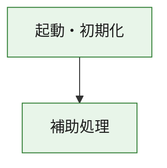
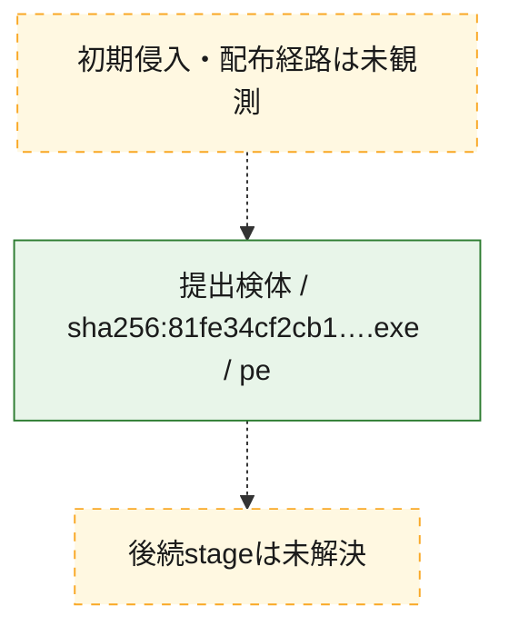
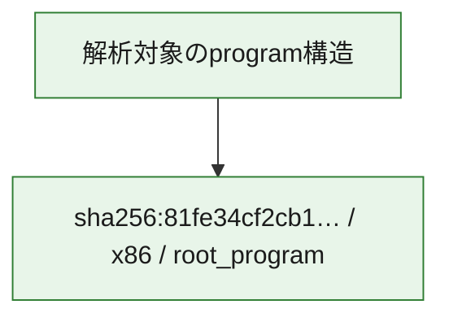

# 全体ロジック：81fe34cf2cb126e599a01394d3fcfb070cbe5a0a3455f4537ffa0b49a809080e

代表関数の静的証跡から、起動・初期化の処理群を確認しました。

## 読み方

- phaseの掲載順は解析上の整理順です。observed_call_edgesがない段階間の実行順を断定しません。
- 図の実線は静的に観測した関係、点線と黄色のノードは未観測・未解決の関係を示します。
- 図は静的な要約であり、動的実行を再現するものではありません。
- 詳細な関数解説とfingerprintは[STATIC-LOGIC.md](STATIC-LOGIC.md)を参照してください。

## 静的可視化

### 実行フロー

### 感染チェーン

### モジュール関係

## 処理段階

### 1. 起動・初期化

entry pointから初期化と後続処理への移行を確認します。
確度: `confirmed_static_function_evidence`

- `81fe34cf2cb126e599a01394d3fcfb070cbe5a0a3455f4537ffa0b49a809080e:ghidra:180001010` — 初期化と主要処理への分岐を行う入口関数です。 状態: `succeeded`、選定理由: `entry_point`, `meaningful_symbol_name`, `reviewed_call_centrality:22`, `role:entrypoint`, `small_program_complete_context`

### 2. 補助処理

主要処理を支える一般内部関数またはlibrary処理を確認します。
確度: `confirmed_static_function_evidence`

- `81fe34cf2cb126e599a01394d3fcfb070cbe5a0a3455f4537ffa0b49a809080e:ghidra:180001240` — 検体内部の一般処理を実装する関数です。 状態: `succeeded`、選定理由: `context_representative`, `reviewed_call_centrality:2`, `small_program_complete_context`
- `81fe34cf2cb126e599a01394d3fcfb070cbe5a0a3455f4537ffa0b49a809080e:ghidra:180001350` — 検体内部の一般処理を実装する関数です。 状態: `succeeded`、選定理由: `context_representative`, `reviewed_call_centrality:25`, `small_program_complete_context`
- `81fe34cf2cb126e599a01394d3fcfb070cbe5a0a3455f4537ffa0b49a809080e:ghidra:180003780` — 検体内部の一般処理を実装する関数です。 状態: `succeeded`、選定理由: `context_representative`, `reviewed_call_centrality:2`, `small_program_complete_context`
- `81fe34cf2cb126e599a01394d3fcfb070cbe5a0a3455f4537ffa0b49a809080e:ghidra:1800038e0` — 検体内部の一般処理を実装する関数です。 状態: `succeeded`、選定理由: `context_representative`, `reviewed_call_centrality:2`, `small_program_complete_context`

## 観測したcall関係

- `81fe34cf2cb126e599a01394d3fcfb070cbe5a0a3455f4537ffa0b49a809080e:ghidra:180001010` → `81fe34cf2cb126e599a01394d3fcfb070cbe5a0a3455f4537ffa0b49a809080e:ghidra:180001240` （`startup` → `support`）
- `81fe34cf2cb126e599a01394d3fcfb070cbe5a0a3455f4537ffa0b49a809080e:ghidra:180001010` → `81fe34cf2cb126e599a01394d3fcfb070cbe5a0a3455f4537ffa0b49a809080e:ghidra:180001350` （`startup` → `support`）
- `81fe34cf2cb126e599a01394d3fcfb070cbe5a0a3455f4537ffa0b49a809080e:ghidra:180001350` → `81fe34cf2cb126e599a01394d3fcfb070cbe5a0a3455f4537ffa0b49a809080e:ghidra:180001240` （`support` → `support`）
- `81fe34cf2cb126e599a01394d3fcfb070cbe5a0a3455f4537ffa0b49a809080e:ghidra:180001350` → `81fe34cf2cb126e599a01394d3fcfb070cbe5a0a3455f4537ffa0b49a809080e:ghidra:180003780` （`support` → `support`）
- `81fe34cf2cb126e599a01394d3fcfb070cbe5a0a3455f4537ffa0b49a809080e:ghidra:180001350` → `81fe34cf2cb126e599a01394d3fcfb070cbe5a0a3455f4537ffa0b49a809080e:ghidra:1800038e0` （`support` → `support`）
- `81fe34cf2cb126e599a01394d3fcfb070cbe5a0a3455f4537ffa0b49a809080e:ghidra:180003780` → `81fe34cf2cb126e599a01394d3fcfb070cbe5a0a3455f4537ffa0b49a809080e:ghidra:1800038e0` （`support` → `support`）
- `ghidra-function:0e37f80ab94062b120cf42d2` → `ghidra-function:03cd4b404164c7af0c4c3a4b` （`unclassified` → `unclassified`）
- `ghidra-function:0e37f80ab94062b120cf42d2` → `ghidra-function:10e70dba14ac5b284b77a2c4` （`unclassified` → `unclassified`）
- `ghidra-function:0e37f80ab94062b120cf42d2` → `ghidra-function:20a43452e5ee8674999f85e4` （`unclassified` → `unclassified`）
- `ghidra-function:0e37f80ab94062b120cf42d2` → `ghidra-function:31b0caba0cde06c5bc06977f` （`unclassified` → `unclassified`）
- `ghidra-function:0e37f80ab94062b120cf42d2` → `ghidra-function:488ea61637fe3d2fa0932268` （`unclassified` → `unclassified`）
- `ghidra-function:0e37f80ab94062b120cf42d2` → `ghidra-function:5800b3810dd9c9b51fa732fe` （`unclassified` → `unclassified`）
- `ghidra-function:0e37f80ab94062b120cf42d2` → `ghidra-function:728ceac82f6392b8c3905238` （`unclassified` → `unclassified`）
- `ghidra-function:0e37f80ab94062b120cf42d2` → `ghidra-function:825c42f301e5ed19f8a5c5e7` （`unclassified` → `unclassified`）
- `ghidra-function:0e37f80ab94062b120cf42d2` → `ghidra-function:b07e4361bec1810cc54f3e89` （`unclassified` → `unclassified`）
- `ghidra-function:0e37f80ab94062b120cf42d2` → `ghidra-function:d0a96155b837efcb416c1bf4` （`unclassified` → `unclassified`）
- `ghidra-function:0e37f80ab94062b120cf42d2` → `ghidra-function:d3bd782ad930fafb5484f32a` （`unclassified` → `unclassified`）
- `ghidra-function:0e37f80ab94062b120cf42d2` → `ghidra-function:d47e3f7de7fc4b4dbd0faf3f` （`unclassified` → `unclassified`）
- `ghidra-function:aa7ae69469d73a06742095b7` → `ghidra-function:5bb653f24c56bac6c4189fe6` （`unclassified` → `unclassified`）
- `ghidra-function:b07e4361bec1810cc54f3e89` → `ghidra-external:0dbae364b8343a0d780547d8` （`unclassified` → `unclassified`）
- `ghidra-function:b07e4361bec1810cc54f3e89` → `ghidra-external:140c56b8a8f1d086885e7276` （`unclassified` → `unclassified`）
- `ghidra-function:b07e4361bec1810cc54f3e89` → `ghidra-external:1f470e033e2a595429cc89a8` （`unclassified` → `unclassified`）
- `ghidra-function:b07e4361bec1810cc54f3e89` → `ghidra-external:27a5279268036bd2116468ef` （`unclassified` → `unclassified`）
- `ghidra-function:b07e4361bec1810cc54f3e89` → `ghidra-external:2d14a07fae5d6d4cf7eac1e8` （`unclassified` → `unclassified`）
- `ghidra-function:b07e4361bec1810cc54f3e89` → `ghidra-external:3467e1c44249ace2fb408b3c` （`unclassified` → `unclassified`）
- `ghidra-function:b07e4361bec1810cc54f3e89` → `ghidra-external:502def8bb109e657b8675b10` （`unclassified` → `unclassified`）
- `ghidra-function:b07e4361bec1810cc54f3e89` → `ghidra-external:54a898c7586fffc3748e1812` （`unclassified` → `unclassified`）
- `ghidra-function:b07e4361bec1810cc54f3e89` → `ghidra-external:5ad558a6fccdfd2c7aa30f5b` （`unclassified` → `unclassified`）
- `ghidra-function:b07e4361bec1810cc54f3e89` → `ghidra-external:69e7355944d791e14933b08b` （`unclassified` → `unclassified`）
- `ghidra-function:b07e4361bec1810cc54f3e89` → `ghidra-external:75373be5a3b997aef33f395b` （`unclassified` → `unclassified`）
- `ghidra-function:b07e4361bec1810cc54f3e89` → `ghidra-external:80010224b949b98bf40eb6e5` （`unclassified` → `unclassified`）
- `ghidra-function:b07e4361bec1810cc54f3e89` → `ghidra-external:86af38e4d9d349efe2a2d320` （`unclassified` → `unclassified`）
- `ghidra-function:b07e4361bec1810cc54f3e89` → `ghidra-external:af4825c4049732d2dfca1e3d` （`unclassified` → `unclassified`）
- `ghidra-function:b07e4361bec1810cc54f3e89` → `ghidra-external:b7555d49a9636d7ad6ca4633` （`unclassified` → `unclassified`）
- `ghidra-function:b07e4361bec1810cc54f3e89` → `ghidra-external:c82534f15f833a0a84d1b0d5` （`unclassified` → `unclassified`）
- `ghidra-function:b07e4361bec1810cc54f3e89` → `ghidra-external:d51e8092024c619e4b6894bb` （`unclassified` → `unclassified`）
- `ghidra-function:b07e4361bec1810cc54f3e89` → `ghidra-external:f2e5c7190b36fe58c370c258` （`unclassified` → `unclassified`）
- `ghidra-function:b07e4361bec1810cc54f3e89` → `ghidra-external:f61f348ca5ff1c2e11f7f046` （`unclassified` → `unclassified`）
- `ghidra-function:b07e4361bec1810cc54f3e89` → `ghidra-external:f85e2682a50b123bde3fe97f` （`unclassified` → `unclassified`）
- `ghidra-function:b07e4361bec1810cc54f3e89` → `ghidra-external:fa4132e0e5686b2cec2978dc` （`unclassified` → `unclassified`）
- `ghidra-function:b07e4361bec1810cc54f3e89` → `ghidra-function:10e70dba14ac5b284b77a2c4` （`unclassified` → `unclassified`）
- `ghidra-function:b07e4361bec1810cc54f3e89` → `ghidra-function:5bb653f24c56bac6c4189fe6` （`unclassified` → `unclassified`）
- `ghidra-function:b07e4361bec1810cc54f3e89` → `ghidra-function:aa7ae69469d73a06742095b7` （`unclassified` → `unclassified`）

## 解析範囲と制約

- 選定外関数は全体inventoryへ残しますが、関数本体の個別解説対象にはしていません。
- indirect call、難読化、packer、VM、壊れたcontrol flowによりcall関係が欠落する場合があります。
- 文書は静的解析に基づき、検体実行や外部通信による動的確認は行っていません。
