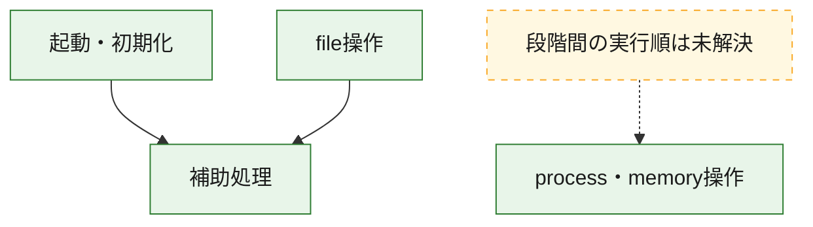
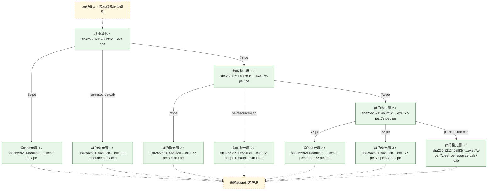
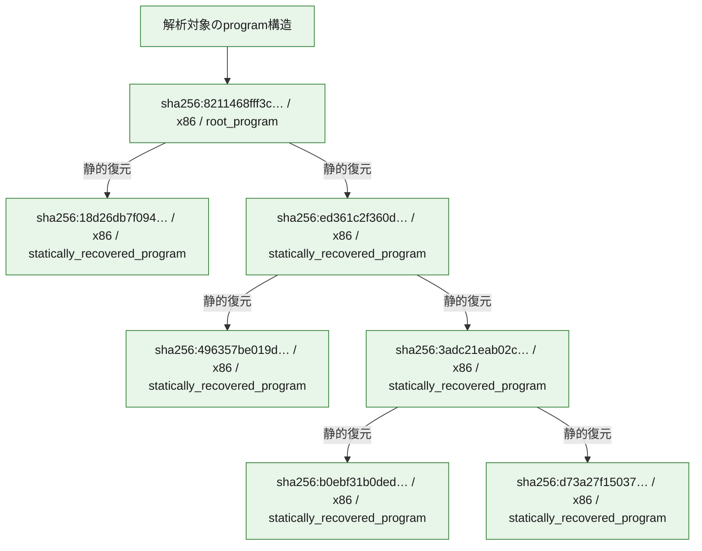

# 全体ロジック：8211468fff3cd6cf858f652b53db995782d573a092d00dac648b863d1b237efd

代表関数の静的証跡から、起動・初期化、process・memory操作、file操作の処理群を確認しました。

## 読み方

- phaseの掲載順は解析上の整理順です。observed_call_edgesがない段階間の実行順を断定しません。
- 図の実線は静的に観測した関係、点線と黄色のノードは未観測・未解決の関係を示します。
- 図は静的な要約であり、動的実行を再現するものではありません。
- 詳細な関数解説とfingerprintは[STATIC-LOGIC.md](STATIC-LOGIC.md)を参照してください。

## 静的可視化

### 実行フロー

### 感染チェーン

### モジュール関係

## 処理段階

### 1. 起動・初期化

entry pointから初期化と後続処理への移行を確認します。
確度: `confirmed_static_function_evidence`

- `3adc21eab02c90f109ae571f8424e7f2dfc305d307bb3dec79c2e75a206af99d:ghidra:00406a60` — 初期化と主要処理への分岐を行う入口関数です。 状態: `succeeded`、選定理由: `entry_point`, `meaningful_symbol_name`, `reviewed_call_centrality:21`, `role:entrypoint`, `small_program_complete_context`
- `ed361c2f360d600af28efba50db555ab11880bd6784e89eaa4aeb8c4be4db84f:ghidra:00406a60` — 初期化と主要処理への分岐を行う入口関数です。 状態: `succeeded`、選定理由: `entry_point`, `meaningful_symbol_name`, `reviewed_call_centrality:21`, `role:entrypoint`, `small_program_complete_context`
- `8211468fff3cd6cf858f652b53db995782d573a092d00dac648b863d1b237efd:ghidra:00406a60` — 初期化と主要処理への分岐を行う入口関数です。 状態: `succeeded`、選定理由: `entry_point`, `meaningful_symbol_name`, `reviewed_call_centrality:21`, `role:entrypoint`, `small_program_complete_context`

### 2. process・memory操作

process、thread、module、memory操作と実行移行を確認します。
確度: `confirmed_static_function_evidence`

- `3adc21eab02c90f109ae571f8424e7f2dfc305d307bb3dec79c2e75a206af99d:ghidra:004034f0` — process、thread、module、またはmemory操作に関係する関数です。 状態: `succeeded`、選定理由: `context_representative`, `reviewed_call_centrality:21`, `role:process_or_memory_operation`, `small_program_complete_context`
- `ed361c2f360d600af28efba50db555ab11880bd6784e89eaa4aeb8c4be4db84f:ghidra:004034f0` — process、thread、module、またはmemory操作に関係する関数です。 状態: `succeeded`、選定理由: `context_representative`, `reviewed_call_centrality:21`, `role:process_or_memory_operation`, `small_program_complete_context`
- `8211468fff3cd6cf858f652b53db995782d573a092d00dac648b863d1b237efd:ghidra:004034f0` — process、thread、module、またはmemory操作に関係する関数です。 状態: `succeeded`、選定理由: `context_representative`, `reviewed_call_centrality:21`, `role:process_or_memory_operation`, `small_program_complete_context`

### 3. file操作

fileやdirectoryの作成、読書き、削除を確認します。
確度: `confirmed_static_function_evidence`

- `3adc21eab02c90f109ae571f8424e7f2dfc305d307bb3dec79c2e75a206af99d:ghidra:00404a50` — fileまたはdirectoryの読書き・管理に関係する関数です。 状態: `succeeded`、選定理由: `context_representative`, `reviewed_call_centrality:3`, `role:file_operation`, `small_program_complete_context`
- `3adc21eab02c90f109ae571f8424e7f2dfc305d307bb3dec79c2e75a206af99d:ghidra:00404ad0` — fileまたはdirectoryの読書き・管理に関係する関数です。 状態: `succeeded`、選定理由: `context_representative`, `reviewed_call_centrality:5`, `role:file_operation`, `small_program_complete_context`
- `3adc21eab02c90f109ae571f8424e7f2dfc305d307bb3dec79c2e75a206af99d:ghidra:004063c0` — fileまたはdirectoryの読書き・管理に関係する関数です。 状態: `succeeded`、選定理由: `context_representative`, `reviewed_call_centrality:9`, `role:file_operation`, `small_program_complete_context`
- `ed361c2f360d600af28efba50db555ab11880bd6784e89eaa4aeb8c4be4db84f:ghidra:00404a50` — fileまたはdirectoryの読書き・管理に関係する関数です。 状態: `succeeded`、選定理由: `context_representative`, `reviewed_call_centrality:3`, `role:file_operation`, `small_program_complete_context`
- `ed361c2f360d600af28efba50db555ab11880bd6784e89eaa4aeb8c4be4db84f:ghidra:00404ad0` — fileまたはdirectoryの読書き・管理に関係する関数です。 状態: `succeeded`、選定理由: `context_representative`, `reviewed_call_centrality:5`, `role:file_operation`, `small_program_complete_context`
- `ed361c2f360d600af28efba50db555ab11880bd6784e89eaa4aeb8c4be4db84f:ghidra:004063c0` — fileまたはdirectoryの読書き・管理に関係する関数です。 状態: `succeeded`、選定理由: `context_representative`, `reviewed_call_centrality:9`, `role:file_operation`, `small_program_complete_context`
- `8211468fff3cd6cf858f652b53db995782d573a092d00dac648b863d1b237efd:ghidra:00404a50` — fileまたはdirectoryの読書き・管理に関係する関数です。 状態: `succeeded`、選定理由: `context_representative`, `reviewed_call_centrality:3`, `role:file_operation`, `small_program_complete_context`
- `8211468fff3cd6cf858f652b53db995782d573a092d00dac648b863d1b237efd:ghidra:00404ad0` — fileまたはdirectoryの読書き・管理に関係する関数です。 状態: `succeeded`、選定理由: `context_representative`, `reviewed_call_centrality:5`, `role:file_operation`, `small_program_complete_context`
- `8211468fff3cd6cf858f652b53db995782d573a092d00dac648b863d1b237efd:ghidra:004063c0` — fileまたはdirectoryの読書き・管理に関係する関数です。 状態: `succeeded`、選定理由: `context_representative`, `reviewed_call_centrality:9`, `role:file_operation`, `small_program_complete_context`

### 4. 補助処理

主要処理を支える一般内部関数またはlibrary処理を確認します。
確度: `confirmed_static_function_evidence`

- `3adc21eab02c90f109ae571f8424e7f2dfc305d307bb3dec79c2e75a206af99d:ghidra:004019e0` — 検体内部の一般処理を実装する関数です。 状態: `succeeded`、選定理由: `context_representative`, `reviewed_call_centrality:12`, `small_program_complete_context`
- `3adc21eab02c90f109ae571f8424e7f2dfc305d307bb3dec79c2e75a206af99d:ghidra:004030c0` — 検体内部の一般処理を実装する関数です。 状態: `succeeded`、選定理由: `context_representative`, `reviewed_call_centrality:2`, `small_program_complete_context`
- `3adc21eab02c90f109ae571f8424e7f2dfc305d307bb3dec79c2e75a206af99d:ghidra:00403100` — 検体内部の一般処理を実装する関数です。 状態: `succeeded`、選定理由: `context_representative`, `reviewed_call_centrality:19`, `small_program_complete_context`
- `3adc21eab02c90f109ae571f8424e7f2dfc305d307bb3dec79c2e75a206af99d:ghidra:00403210` — 検体内部の一般処理を実装する関数です。 状態: `succeeded`、選定理由: `context_representative`, `reviewed_call_centrality:28`, `small_program_complete_context`
- `3adc21eab02c90f109ae571f8424e7f2dfc305d307bb3dec79c2e75a206af99d:ghidra:00403450` — 検体内部の一般処理を実装する関数です。 状態: `succeeded`、選定理由: `context_representative`, `reviewed_call_centrality:11`, `small_program_complete_context`
- `3adc21eab02c90f109ae571f8424e7f2dfc305d307bb3dec79c2e75a206af99d:ghidra:00404200` — 検体内部の一般処理を実装する関数です。 状態: `succeeded`、選定理由: `context_representative`, `reviewed_call_centrality:2`, `small_program_complete_context`
- `3adc21eab02c90f109ae571f8424e7f2dfc305d307bb3dec79c2e75a206af99d:ghidra:00404980` — 検体内部の一般処理を実装する関数です。 状態: `succeeded`、選定理由: `context_representative`, `reviewed_call_centrality:5`, `small_program_complete_context`
- `3adc21eab02c90f109ae571f8424e7f2dfc305d307bb3dec79c2e75a206af99d:ghidra:00404b60` — 検体内部の一般処理を実装する関数です。 状態: `succeeded`、選定理由: `context_representative`, `reviewed_call_centrality:3`, `small_program_complete_context`
- `3adc21eab02c90f109ae571f8424e7f2dfc305d307bb3dec79c2e75a206af99d:ghidra:00404bc0` — 検体内部の一般処理を実装する関数です。 状態: `succeeded`、選定理由: `context_representative`, `reviewed_call_centrality:2`, `small_program_complete_context`
- `3adc21eab02c90f109ae571f8424e7f2dfc305d307bb3dec79c2e75a206af99d:ghidra:00404ca0` — 検体内部の一般処理を実装する関数です。 状態: `succeeded`、選定理由: `context_representative`, `reviewed_call_centrality:2`, `small_program_complete_context`
- `3adc21eab02c90f109ae571f8424e7f2dfc305d307bb3dec79c2e75a206af99d:ghidra:00404cc0` — 検体内部の一般処理を実装する関数です。 状態: `succeeded`、選定理由: `context_representative`, `reviewed_call_centrality:2`, `small_program_complete_context`
- `3adc21eab02c90f109ae571f8424e7f2dfc305d307bb3dec79c2e75a206af99d:ghidra:00404cd0` — 検体内部の一般処理を実装する関数です。 状態: `succeeded`、選定理由: `context_representative`, `reviewed_call_centrality:12`, `small_program_complete_context`
- `3adc21eab02c90f109ae571f8424e7f2dfc305d307bb3dec79c2e75a206af99d:ghidra:00404fe0` — 検体内部の一般処理を実装する関数です。 状態: `succeeded`、選定理由: `context_representative`, `reviewed_call_centrality:23`, `small_program_complete_context`
- `3adc21eab02c90f109ae571f8424e7f2dfc305d307bb3dec79c2e75a206af99d:ghidra:00406380` — 検体内部の一般処理を実装する関数です。 状態: `succeeded`、選定理由: `context_representative`, `small_program_complete_context`
- `3adc21eab02c90f109ae571f8424e7f2dfc305d307bb3dec79c2e75a206af99d:ghidra:00406760` — 検体内部の一般処理を実装する関数です。 状態: `succeeded`、選定理由: `context_representative`, `small_program_complete_context`
- `3adc21eab02c90f109ae571f8424e7f2dfc305d307bb3dec79c2e75a206af99d:ghidra:004069b0` — 検体内部の一般処理を実装する関数です。 状態: `succeeded`、選定理由: `context_representative`, `reviewed_call_centrality:12`, `small_program_complete_context`
- `3adc21eab02c90f109ae571f8424e7f2dfc305d307bb3dec79c2e75a206af99d:ghidra:00406a20` — 検体内部の一般処理を実装する関数です。 状態: `succeeded`、選定理由: `context_representative`, `reviewed_call_centrality:2`, `small_program_complete_context`
- `3adc21eab02c90f109ae571f8424e7f2dfc305d307bb3dec79c2e75a206af99d:ghidra:00406ce0` — 検体内部の一般処理を実装する関数です。 状態: `succeeded`、選定理由: `context_representative`, `reviewed_call_centrality:6`, `small_program_complete_context`
- `3adc21eab02c90f109ae571f8424e7f2dfc305d307bb3dec79c2e75a206af99d:ghidra:00406ef0` — 検体内部の一般処理を実装する関数です。 状態: `succeeded`、選定理由: `context_representative`, `reviewed_call_centrality:1`, `small_program_complete_context`
- `3adc21eab02c90f109ae571f8424e7f2dfc305d307bb3dec79c2e75a206af99d:ghidra:00406f40` — 検体内部の一般処理を実装する関数です。 状態: `succeeded`、選定理由: `context_representative`, `reviewed_call_centrality:2`, `small_program_complete_context`
- `3adc21eab02c90f109ae571f8424e7f2dfc305d307bb3dec79c2e75a206af99d:ghidra:00407000` — 検体内部の一般処理を実装する関数です。 状態: `succeeded`、選定理由: `context_representative`, `reviewed_call_centrality:1`, `small_program_complete_context`
- `3adc21eab02c90f109ae571f8424e7f2dfc305d307bb3dec79c2e75a206af99d:ghidra:00407270` — 検体内部の一般処理を実装する関数です。 状態: `succeeded`、選定理由: `context_representative`, `reviewed_call_centrality:1`, `small_program_complete_context`
- `3adc21eab02c90f109ae571f8424e7f2dfc305d307bb3dec79c2e75a206af99d:ghidra:004072a0` — 検体内部の一般処理を実装する関数です。 状態: `succeeded`、選定理由: `meaningful_symbol_name`, `reviewed_call_centrality:1`, `small_program_complete_context`
- `ed361c2f360d600af28efba50db555ab11880bd6784e89eaa4aeb8c4be4db84f:ghidra:004019e0` — 検体内部の一般処理を実装する関数です。 状態: `succeeded`、選定理由: `context_representative`, `reviewed_call_centrality:12`, `small_program_complete_context`
- `ed361c2f360d600af28efba50db555ab11880bd6784e89eaa4aeb8c4be4db84f:ghidra:004030c0` — 検体内部の一般処理を実装する関数です。 状態: `succeeded`、選定理由: `context_representative`, `reviewed_call_centrality:2`, `small_program_complete_context`
- `ed361c2f360d600af28efba50db555ab11880bd6784e89eaa4aeb8c4be4db84f:ghidra:00403100` — 検体内部の一般処理を実装する関数です。 状態: `succeeded`、選定理由: `context_representative`, `reviewed_call_centrality:19`, `small_program_complete_context`
- `ed361c2f360d600af28efba50db555ab11880bd6784e89eaa4aeb8c4be4db84f:ghidra:00403210` — 検体内部の一般処理を実装する関数です。 状態: `succeeded`、選定理由: `context_representative`, `reviewed_call_centrality:28`, `small_program_complete_context`
- `ed361c2f360d600af28efba50db555ab11880bd6784e89eaa4aeb8c4be4db84f:ghidra:00403450` — 検体内部の一般処理を実装する関数です。 状態: `succeeded`、選定理由: `context_representative`, `reviewed_call_centrality:11`, `small_program_complete_context`
- `ed361c2f360d600af28efba50db555ab11880bd6784e89eaa4aeb8c4be4db84f:ghidra:00404200` — 検体内部の一般処理を実装する関数です。 状態: `succeeded`、選定理由: `context_representative`, `reviewed_call_centrality:2`, `small_program_complete_context`
- `ed361c2f360d600af28efba50db555ab11880bd6784e89eaa4aeb8c4be4db84f:ghidra:00404980` — 検体内部の一般処理を実装する関数です。 状態: `succeeded`、選定理由: `context_representative`, `reviewed_call_centrality:5`, `small_program_complete_context`
- `ed361c2f360d600af28efba50db555ab11880bd6784e89eaa4aeb8c4be4db84f:ghidra:00404b60` — 検体内部の一般処理を実装する関数です。 状態: `succeeded`、選定理由: `context_representative`, `reviewed_call_centrality:3`, `small_program_complete_context`
- `ed361c2f360d600af28efba50db555ab11880bd6784e89eaa4aeb8c4be4db84f:ghidra:00404bc0` — 検体内部の一般処理を実装する関数です。 状態: `succeeded`、選定理由: `context_representative`, `reviewed_call_centrality:2`, `small_program_complete_context`
- `ed361c2f360d600af28efba50db555ab11880bd6784e89eaa4aeb8c4be4db84f:ghidra:00404ca0` — 検体内部の一般処理を実装する関数です。 状態: `succeeded`、選定理由: `context_representative`, `reviewed_call_centrality:2`, `small_program_complete_context`
- `ed361c2f360d600af28efba50db555ab11880bd6784e89eaa4aeb8c4be4db84f:ghidra:00404cc0` — 検体内部の一般処理を実装する関数です。 状態: `succeeded`、選定理由: `context_representative`, `reviewed_call_centrality:2`, `small_program_complete_context`
- `ed361c2f360d600af28efba50db555ab11880bd6784e89eaa4aeb8c4be4db84f:ghidra:00404cd0` — 検体内部の一般処理を実装する関数です。 状態: `succeeded`、選定理由: `context_representative`, `reviewed_call_centrality:12`, `small_program_complete_context`
- `ed361c2f360d600af28efba50db555ab11880bd6784e89eaa4aeb8c4be4db84f:ghidra:00404fe0` — 検体内部の一般処理を実装する関数です。 状態: `succeeded`、選定理由: `context_representative`, `reviewed_call_centrality:23`, `small_program_complete_context`
- `ed361c2f360d600af28efba50db555ab11880bd6784e89eaa4aeb8c4be4db84f:ghidra:00406380` — 検体内部の一般処理を実装する関数です。 状態: `succeeded`、選定理由: `context_representative`, `small_program_complete_context`
- `ed361c2f360d600af28efba50db555ab11880bd6784e89eaa4aeb8c4be4db84f:ghidra:00406760` — 検体内部の一般処理を実装する関数です。 状態: `succeeded`、選定理由: `context_representative`, `small_program_complete_context`
- `ed361c2f360d600af28efba50db555ab11880bd6784e89eaa4aeb8c4be4db84f:ghidra:004069b0` — 検体内部の一般処理を実装する関数です。 状態: `succeeded`、選定理由: `context_representative`, `reviewed_call_centrality:12`, `small_program_complete_context`
- `ed361c2f360d600af28efba50db555ab11880bd6784e89eaa4aeb8c4be4db84f:ghidra:00406a20` — 検体内部の一般処理を実装する関数です。 状態: `succeeded`、選定理由: `context_representative`, `reviewed_call_centrality:2`, `small_program_complete_context`
- `ed361c2f360d600af28efba50db555ab11880bd6784e89eaa4aeb8c4be4db84f:ghidra:00406ce0` — 検体内部の一般処理を実装する関数です。 状態: `succeeded`、選定理由: `context_representative`, `reviewed_call_centrality:6`, `small_program_complete_context`
- `ed361c2f360d600af28efba50db555ab11880bd6784e89eaa4aeb8c4be4db84f:ghidra:00406ef0` — 検体内部の一般処理を実装する関数です。 状態: `succeeded`、選定理由: `context_representative`, `reviewed_call_centrality:1`, `small_program_complete_context`
- `ed361c2f360d600af28efba50db555ab11880bd6784e89eaa4aeb8c4be4db84f:ghidra:00406f40` — 検体内部の一般処理を実装する関数です。 状態: `succeeded`、選定理由: `context_representative`, `reviewed_call_centrality:2`, `small_program_complete_context`
- `ed361c2f360d600af28efba50db555ab11880bd6784e89eaa4aeb8c4be4db84f:ghidra:00407000` — 検体内部の一般処理を実装する関数です。 状態: `succeeded`、選定理由: `context_representative`, `reviewed_call_centrality:1`, `small_program_complete_context`
- `ed361c2f360d600af28efba50db555ab11880bd6784e89eaa4aeb8c4be4db84f:ghidra:00407270` — 検体内部の一般処理を実装する関数です。 状態: `succeeded`、選定理由: `context_representative`, `reviewed_call_centrality:1`, `small_program_complete_context`
- `ed361c2f360d600af28efba50db555ab11880bd6784e89eaa4aeb8c4be4db84f:ghidra:004072a0` — 検体内部の一般処理を実装する関数です。 状態: `succeeded`、選定理由: `meaningful_symbol_name`, `reviewed_call_centrality:1`, `small_program_complete_context`
- `8211468fff3cd6cf858f652b53db995782d573a092d00dac648b863d1b237efd:ghidra:004019e0` — 検体内部の一般処理を実装する関数です。 状態: `succeeded`、選定理由: `context_representative`, `reviewed_call_centrality:12`, `small_program_complete_context`
- `8211468fff3cd6cf858f652b53db995782d573a092d00dac648b863d1b237efd:ghidra:004030c0` — 検体内部の一般処理を実装する関数です。 状態: `succeeded`、選定理由: `context_representative`, `reviewed_call_centrality:2`, `small_program_complete_context`
- `8211468fff3cd6cf858f652b53db995782d573a092d00dac648b863d1b237efd:ghidra:00403100` — 検体内部の一般処理を実装する関数です。 状態: `succeeded`、選定理由: `context_representative`, `reviewed_call_centrality:19`, `small_program_complete_context`
- `8211468fff3cd6cf858f652b53db995782d573a092d00dac648b863d1b237efd:ghidra:00403210` — 検体内部の一般処理を実装する関数です。 状態: `succeeded`、選定理由: `context_representative`, `reviewed_call_centrality:28`, `small_program_complete_context`
- `8211468fff3cd6cf858f652b53db995782d573a092d00dac648b863d1b237efd:ghidra:00403450` — 検体内部の一般処理を実装する関数です。 状態: `succeeded`、選定理由: `context_representative`, `reviewed_call_centrality:11`, `small_program_complete_context`
- `8211468fff3cd6cf858f652b53db995782d573a092d00dac648b863d1b237efd:ghidra:00404200` — 検体内部の一般処理を実装する関数です。 状態: `succeeded`、選定理由: `context_representative`, `reviewed_call_centrality:2`, `small_program_complete_context`
- `8211468fff3cd6cf858f652b53db995782d573a092d00dac648b863d1b237efd:ghidra:00404980` — 検体内部の一般処理を実装する関数です。 状態: `succeeded`、選定理由: `context_representative`, `reviewed_call_centrality:5`, `small_program_complete_context`
- `8211468fff3cd6cf858f652b53db995782d573a092d00dac648b863d1b237efd:ghidra:00404b60` — 検体内部の一般処理を実装する関数です。 状態: `succeeded`、選定理由: `context_representative`, `reviewed_call_centrality:3`, `small_program_complete_context`
- `8211468fff3cd6cf858f652b53db995782d573a092d00dac648b863d1b237efd:ghidra:00404bc0` — 検体内部の一般処理を実装する関数です。 状態: `succeeded`、選定理由: `context_representative`, `reviewed_call_centrality:2`, `small_program_complete_context`
- `8211468fff3cd6cf858f652b53db995782d573a092d00dac648b863d1b237efd:ghidra:00404ca0` — 検体内部の一般処理を実装する関数です。 状態: `succeeded`、選定理由: `context_representative`, `reviewed_call_centrality:2`, `small_program_complete_context`
- `8211468fff3cd6cf858f652b53db995782d573a092d00dac648b863d1b237efd:ghidra:00404cc0` — 検体内部の一般処理を実装する関数です。 状態: `succeeded`、選定理由: `context_representative`, `reviewed_call_centrality:2`, `small_program_complete_context`
- `8211468fff3cd6cf858f652b53db995782d573a092d00dac648b863d1b237efd:ghidra:00404cd0` — 検体内部の一般処理を実装する関数です。 状態: `succeeded`、選定理由: `context_representative`, `reviewed_call_centrality:12`, `small_program_complete_context`
- `8211468fff3cd6cf858f652b53db995782d573a092d00dac648b863d1b237efd:ghidra:00404fe0` — 検体内部の一般処理を実装する関数です。 状態: `succeeded`、選定理由: `context_representative`, `reviewed_call_centrality:23`, `small_program_complete_context`
- `8211468fff3cd6cf858f652b53db995782d573a092d00dac648b863d1b237efd:ghidra:00406380` — 検体内部の一般処理を実装する関数です。 状態: `succeeded`、選定理由: `context_representative`, `small_program_complete_context`
- `8211468fff3cd6cf858f652b53db995782d573a092d00dac648b863d1b237efd:ghidra:00406760` — 検体内部の一般処理を実装する関数です。 状態: `succeeded`、選定理由: `context_representative`, `small_program_complete_context`
- `8211468fff3cd6cf858f652b53db995782d573a092d00dac648b863d1b237efd:ghidra:004069b0` — 検体内部の一般処理を実装する関数です。 状態: `succeeded`、選定理由: `context_representative`, `reviewed_call_centrality:12`, `small_program_complete_context`
- `8211468fff3cd6cf858f652b53db995782d573a092d00dac648b863d1b237efd:ghidra:00406a20` — 検体内部の一般処理を実装する関数です。 状態: `succeeded`、選定理由: `context_representative`, `reviewed_call_centrality:2`, `small_program_complete_context`
- `8211468fff3cd6cf858f652b53db995782d573a092d00dac648b863d1b237efd:ghidra:00406ce0` — 検体内部の一般処理を実装する関数です。 状態: `succeeded`、選定理由: `context_representative`, `reviewed_call_centrality:6`, `small_program_complete_context`
- `8211468fff3cd6cf858f652b53db995782d573a092d00dac648b863d1b237efd:ghidra:00406ef0` — 検体内部の一般処理を実装する関数です。 状態: `succeeded`、選定理由: `context_representative`, `reviewed_call_centrality:1`, `small_program_complete_context`
- `8211468fff3cd6cf858f652b53db995782d573a092d00dac648b863d1b237efd:ghidra:00406f40` — 検体内部の一般処理を実装する関数です。 状態: `succeeded`、選定理由: `context_representative`, `reviewed_call_centrality:2`, `small_program_complete_context`
- `8211468fff3cd6cf858f652b53db995782d573a092d00dac648b863d1b237efd:ghidra:00407000` — 検体内部の一般処理を実装する関数です。 状態: `succeeded`、選定理由: `context_representative`, `reviewed_call_centrality:1`, `small_program_complete_context`
- `8211468fff3cd6cf858f652b53db995782d573a092d00dac648b863d1b237efd:ghidra:00407270` — 検体内部の一般処理を実装する関数です。 状態: `succeeded`、選定理由: `context_representative`, `reviewed_call_centrality:1`, `small_program_complete_context`
- `8211468fff3cd6cf858f652b53db995782d573a092d00dac648b863d1b237efd:ghidra:004072a0` — 検体内部の一般処理を実装する関数です。 状態: `succeeded`、選定理由: `meaningful_symbol_name`, `reviewed_call_centrality:1`, `small_program_complete_context`

## 観測したcall関係

- `3adc21eab02c90f109ae571f8424e7f2dfc305d307bb3dec79c2e75a206af99d:ghidra:004019e0` → `3adc21eab02c90f109ae571f8424e7f2dfc305d307bb3dec79c2e75a206af99d:ghidra:00406ce0` （`support` → `support`）
- `3adc21eab02c90f109ae571f8424e7f2dfc305d307bb3dec79c2e75a206af99d:ghidra:00404cd0` → `3adc21eab02c90f109ae571f8424e7f2dfc305d307bb3dec79c2e75a206af99d:ghidra:00404980` （`support` → `support`）
- `3adc21eab02c90f109ae571f8424e7f2dfc305d307bb3dec79c2e75a206af99d:ghidra:00404cd0` → `3adc21eab02c90f109ae571f8424e7f2dfc305d307bb3dec79c2e75a206af99d:ghidra:00404b60` （`support` → `support`）
- `3adc21eab02c90f109ae571f8424e7f2dfc305d307bb3dec79c2e75a206af99d:ghidra:00404cd0` → `3adc21eab02c90f109ae571f8424e7f2dfc305d307bb3dec79c2e75a206af99d:ghidra:00406ce0` （`support` → `support`）
- `3adc21eab02c90f109ae571f8424e7f2dfc305d307bb3dec79c2e75a206af99d:ghidra:004063c0` → `3adc21eab02c90f109ae571f8424e7f2dfc305d307bb3dec79c2e75a206af99d:ghidra:00406ce0` （`file_activity` → `support`）
- `3adc21eab02c90f109ae571f8424e7f2dfc305d307bb3dec79c2e75a206af99d:ghidra:004069b0` → `3adc21eab02c90f109ae571f8424e7f2dfc305d307bb3dec79c2e75a206af99d:ghidra:00407000` （`support` → `support`）
- `3adc21eab02c90f109ae571f8424e7f2dfc305d307bb3dec79c2e75a206af99d:ghidra:00406a60` → `3adc21eab02c90f109ae571f8424e7f2dfc305d307bb3dec79c2e75a206af99d:ghidra:004072a0` （`startup` → `support`）
- `8211468fff3cd6cf858f652b53db995782d573a092d00dac648b863d1b237efd:ghidra:004019e0` → `8211468fff3cd6cf858f652b53db995782d573a092d00dac648b863d1b237efd:ghidra:00406ce0` （`support` → `support`）
- `8211468fff3cd6cf858f652b53db995782d573a092d00dac648b863d1b237efd:ghidra:00404cd0` → `8211468fff3cd6cf858f652b53db995782d573a092d00dac648b863d1b237efd:ghidra:00404980` （`support` → `support`）
- `8211468fff3cd6cf858f652b53db995782d573a092d00dac648b863d1b237efd:ghidra:00404cd0` → `8211468fff3cd6cf858f652b53db995782d573a092d00dac648b863d1b237efd:ghidra:00404b60` （`support` → `support`）
- `8211468fff3cd6cf858f652b53db995782d573a092d00dac648b863d1b237efd:ghidra:00404cd0` → `8211468fff3cd6cf858f652b53db995782d573a092d00dac648b863d1b237efd:ghidra:00406ce0` （`support` → `support`）
- `8211468fff3cd6cf858f652b53db995782d573a092d00dac648b863d1b237efd:ghidra:004063c0` → `8211468fff3cd6cf858f652b53db995782d573a092d00dac648b863d1b237efd:ghidra:00406ce0` （`file_activity` → `support`）
- `8211468fff3cd6cf858f652b53db995782d573a092d00dac648b863d1b237efd:ghidra:004069b0` → `8211468fff3cd6cf858f652b53db995782d573a092d00dac648b863d1b237efd:ghidra:00407000` （`support` → `support`）
- `8211468fff3cd6cf858f652b53db995782d573a092d00dac648b863d1b237efd:ghidra:00406a60` → `8211468fff3cd6cf858f652b53db995782d573a092d00dac648b863d1b237efd:ghidra:004072a0` （`startup` → `support`）
- `ed361c2f360d600af28efba50db555ab11880bd6784e89eaa4aeb8c4be4db84f:ghidra:004019e0` → `ed361c2f360d600af28efba50db555ab11880bd6784e89eaa4aeb8c4be4db84f:ghidra:00406ce0` （`support` → `support`）
- `ed361c2f360d600af28efba50db555ab11880bd6784e89eaa4aeb8c4be4db84f:ghidra:00404cd0` → `ed361c2f360d600af28efba50db555ab11880bd6784e89eaa4aeb8c4be4db84f:ghidra:00404980` （`support` → `support`）
- `ed361c2f360d600af28efba50db555ab11880bd6784e89eaa4aeb8c4be4db84f:ghidra:00404cd0` → `ed361c2f360d600af28efba50db555ab11880bd6784e89eaa4aeb8c4be4db84f:ghidra:00404b60` （`support` → `support`）
- `ed361c2f360d600af28efba50db555ab11880bd6784e89eaa4aeb8c4be4db84f:ghidra:00404cd0` → `ed361c2f360d600af28efba50db555ab11880bd6784e89eaa4aeb8c4be4db84f:ghidra:00406ce0` （`support` → `support`）
- `ed361c2f360d600af28efba50db555ab11880bd6784e89eaa4aeb8c4be4db84f:ghidra:004063c0` → `ed361c2f360d600af28efba50db555ab11880bd6784e89eaa4aeb8c4be4db84f:ghidra:00406ce0` （`file_activity` → `support`）
- `ed361c2f360d600af28efba50db555ab11880bd6784e89eaa4aeb8c4be4db84f:ghidra:004069b0` → `ed361c2f360d600af28efba50db555ab11880bd6784e89eaa4aeb8c4be4db84f:ghidra:00407000` （`support` → `support`）
- `ed361c2f360d600af28efba50db555ab11880bd6784e89eaa4aeb8c4be4db84f:ghidra:00406a60` → `ed361c2f360d600af28efba50db555ab11880bd6784e89eaa4aeb8c4be4db84f:ghidra:004072a0` （`startup` → `support`）
- `ghidra-function:00680a29e6214f080c82f475` → `ghidra-external:3d5903f8a63a0847d0b88903` （`unclassified` → `unclassified`）
- `ghidra-function:00680a29e6214f080c82f475` → `ghidra-external:498fb1f88d0262f58aca03bb` （`unclassified` → `unclassified`）
- `ghidra-function:00680a29e6214f080c82f475` → `ghidra-external:4e7e51ece3e8c00372fcd45e` （`unclassified` → `unclassified`）
- `ghidra-function:00680a29e6214f080c82f475` → `ghidra-external:56daa1abd92516efc88de70d` （`unclassified` → `unclassified`）
- `ghidra-function:00680a29e6214f080c82f475` → `ghidra-external:ade51c4a2ee9d502a729c806` （`unclassified` → `unclassified`）
- `ghidra-function:00680a29e6214f080c82f475` → `ghidra-external:bfa80243db51f247510432b3` （`unclassified` → `unclassified`）
- `ghidra-function:00680a29e6214f080c82f475` → `ghidra-function:2b453028dca6a48bbf7c4709` （`unclassified` → `unclassified`）
- `ghidra-function:00680a29e6214f080c82f475` → `ghidra-function:4017aaefe90a0d29c20a7a45` （`unclassified` → `unclassified`）
- `ghidra-function:00680a29e6214f080c82f475` → `ghidra-function:7388e6c80d722f8bb444038c` （`unclassified` → `unclassified`）
- `ghidra-function:00680a29e6214f080c82f475` → `ghidra-function:802f5faa36268cbc22ec0b88` （`unclassified` → `unclassified`）
- `ghidra-function:00680a29e6214f080c82f475` → `ghidra-function:9ed2c2ef46732d5f8bdda9e8` （`unclassified` → `unclassified`）
- `ghidra-function:00680a29e6214f080c82f475` → `ghidra-function:a32ff5d523b357764648ebe6` （`unclassified` → `unclassified`）
- `ghidra-function:00680a29e6214f080c82f475` → `ghidra-function:a73db989416a6bded26a42d7` （`unclassified` → `unclassified`）
- `ghidra-function:00680a29e6214f080c82f475` → `ghidra-function:b25324ec18f9cb22c945e48c` （`unclassified` → `unclassified`）
- `ghidra-function:00680a29e6214f080c82f475` → `ghidra-function:b94944f4f862a19e01827187` （`unclassified` → `unclassified`）
- `ghidra-function:00680a29e6214f080c82f475` → `ghidra-function:cbf894a462d6c9d97eedcf8d` （`unclassified` → `unclassified`）
- `ghidra-function:00680a29e6214f080c82f475` → `ghidra-function:e6b06a9d2eba91c279141dc3` （`unclassified` → `unclassified`）
- `ghidra-function:01f41e9db77689fd4680420c` → `ghidra-function:df1f896c340ec0839d7c3ac9` （`unclassified` → `unclassified`）
- `ghidra-function:0302caa96fcb701ecbdf3f2c` → `ghidra-external:3e6128a90c47b9e9b6b58e85` （`unclassified` → `unclassified`）
- `ghidra-function:0302caa96fcb701ecbdf3f2c` → `ghidra-function:21e2ad64fa14ce0a3a2e2954` （`unclassified` → `unclassified`）
- `ghidra-function:0302caa96fcb701ecbdf3f2c` → `ghidra-function:43bb407e7b99e92046d83466` （`unclassified` → `unclassified`）
- `ghidra-function:0302caa96fcb701ecbdf3f2c` → `ghidra-function:8a04edcac29c8957f42dead6` （`unclassified` → `unclassified`）
- `ghidra-function:0302caa96fcb701ecbdf3f2c` → `ghidra-function:a60375c3e2cb909d54ec57f5` （`unclassified` → `unclassified`）
- `ghidra-function:0302caa96fcb701ecbdf3f2c` → `ghidra-function:fc8b83a3644b216d8cba3acf` （`unclassified` → `unclassified`）
- `ghidra-function:0400e14df38f1152b49523b8` → `ghidra-external:0987e26f9915895e0f681d6d` （`unclassified` → `unclassified`）
- `ghidra-function:0400e14df38f1152b49523b8` → `ghidra-external:33cb81a3ad09110a9b170d16` （`unclassified` → `unclassified`）
- `ghidra-function:0400e14df38f1152b49523b8` → `ghidra-external:37cf9dbd08d937670ffd6753` （`unclassified` → `unclassified`）
- `ghidra-function:0400e14df38f1152b49523b8` → `ghidra-external:539efc44dc480a42ac9ac6f0` （`unclassified` → `unclassified`）
- `ghidra-function:0400e14df38f1152b49523b8` → `ghidra-external:582135237a6e286e5fb9be3d` （`unclassified` → `unclassified`）
- `ghidra-function:0400e14df38f1152b49523b8` → `ghidra-external:79534cc71008a117712afbf2` （`unclassified` → `unclassified`）
- `ghidra-function:0400e14df38f1152b49523b8` → `ghidra-external:dc1ba8d06ca61ff2c1d0e46e` （`unclassified` → `unclassified`）
- `ghidra-function:0400e14df38f1152b49523b8` → `ghidra-external:e151628305560b37eb50d7fd` （`unclassified` → `unclassified`）
- `ghidra-function:0400e14df38f1152b49523b8` → `ghidra-external:eff04206dedf7f4bc9650af9` （`unclassified` → `unclassified`）
- `ghidra-function:0400e14df38f1152b49523b8` → `ghidra-external:f65854198034634ab12eac61` （`unclassified` → `unclassified`）
- `ghidra-function:0400e14df38f1152b49523b8` → `ghidra-function:6539765df275df0ba6ba429b` （`unclassified` → `unclassified`）
- `ghidra-function:0400e14df38f1152b49523b8` → `ghidra-function:830d145e5cc2a7c7dc8cfee1` （`unclassified` → `unclassified`）
- `ghidra-function:0400e14df38f1152b49523b8` → `ghidra-function:9957fbacae77996463f00053` （`unclassified` → `unclassified`）
- `ghidra-function:0400e14df38f1152b49523b8` → `ghidra-function:b16b7a66ce14fe291791f616` （`unclassified` → `unclassified`）
- `ghidra-function:0400e14df38f1152b49523b8` → `ghidra-function:d9a3b3683fba2b874eb755e8` （`unclassified` → `unclassified`）
- `ghidra-function:0400e14df38f1152b49523b8` → `ghidra-function:f1d4a1797f17d8b42a8d2b33` （`unclassified` → `unclassified`）
- `ghidra-function:04e357d43a0f19a5ff5216e2` → `ghidra-external:61ef1245d2d585a90c2ada13` （`unclassified` → `unclassified`）
- `ghidra-function:16b76ca953f2502bcc3a636d` → `ghidra-function:e7b2d37977d79a750d5b5838` （`unclassified` → `unclassified`）
- `ghidra-function:16e8724ff77dc00a866f36d6` → `ghidra-external:df43d3ed7087d1591b8482d0` （`unclassified` → `unclassified`）
- `ghidra-function:1b470ed7944194dec74c8321` → `ghidra-external:3e6128a90c47b9e9b6b58e85` （`unclassified` → `unclassified`）
- `ghidra-function:1b470ed7944194dec74c8321` → `ghidra-function:21e2ad64fa14ce0a3a2e2954` （`unclassified` → `unclassified`）
- `ghidra-function:1b470ed7944194dec74c8321` → `ghidra-function:3706604e0c6b834a2bda6fdb` （`unclassified` → `unclassified`）
- `ghidra-function:1b470ed7944194dec74c8321` → `ghidra-function:43bb407e7b99e92046d83466` （`unclassified` → `unclassified`）
- `ghidra-function:1b470ed7944194dec74c8321` → `ghidra-function:86509b74abffd2d83cf3b7d3` （`unclassified` → `unclassified`）
- `ghidra-function:1b470ed7944194dec74c8321` → `ghidra-function:a60375c3e2cb909d54ec57f5` （`unclassified` → `unclassified`）
- `ghidra-function:1b470ed7944194dec74c8321` → `ghidra-function:e03d89f9b89ace5e05cbcf2e` （`unclassified` → `unclassified`）
- `ghidra-function:1b8748b2c1fb9ec103832cc9` → `ghidra-function:a036314603e34cfbe1f12eff` （`unclassified` → `unclassified`）
- `ghidra-function:224656d051af0898b4892182` → `ghidra-function:6c4db702dc087808df35d55c` （`unclassified` → `unclassified`）
- `ghidra-function:2796bfc21e1381b4e7646e7f` → `ghidra-function:984beae24788cf2c5f18458f` （`unclassified` → `unclassified`）
- `ghidra-function:2d79541f1ee59f783c66710b` → `ghidra-function:777622a47b5a68c7ba6fe8f9` （`unclassified` → `unclassified`）
- `ghidra-function:2e54f3f54ee5f82cb3f71e74` → `ghidra-function:ed647e0afbe7f50f2bd5927e` （`unclassified` → `unclassified`）
- `ghidra-function:2f69e364bbca23840a5a9a42` → `ghidra-external:3a7bcd9a8bc747a89c36a554` （`unclassified` → `unclassified`）
- `ghidra-function:2f69e364bbca23840a5a9a42` → `ghidra-external:b50d3d2ad171b0a37a2cc03c` （`unclassified` → `unclassified`）
- `ghidra-function:2f69e364bbca23840a5a9a42` → `ghidra-external:df011c3220a74745163da266` （`unclassified` → `unclassified`）
- `ghidra-function:3212cbe1e5a0d07964582a32` → `ghidra-external:17b405d9106a54fd2ed79d0f` （`unclassified` → `unclassified`）
- `ghidra-function:3212cbe1e5a0d07964582a32` → `ghidra-function:7388e6c80d722f8bb444038c` （`unclassified` → `unclassified`）
- `ghidra-function:3212cbe1e5a0d07964582a32` → `ghidra-function:8b6b10f4d3cc3d222e3d0e8d` （`unclassified` → `unclassified`）
- `ghidra-function:337bd2c1db87e965ad49dce7` → `ghidra-function:6e3233bcd24758e4c47b067d` （`unclassified` → `unclassified`）
- `ghidra-function:345c6d0799008331caa86a2f` → `ghidra-function:c60f508bf1779f58e9e2bde2` （`unclassified` → `unclassified`）
- `ghidra-function:34a343a3ec1567429eddccf2` → `ghidra-function:4191f58dc115217912356448` （`unclassified` → `unclassified`）
- `ghidra-function:35fa7370eed193e2a4ee1d1d` → `ghidra-external:498fb1f88d0262f58aca03bb` （`unclassified` → `unclassified`）
- `ghidra-function:35fa7370eed193e2a4ee1d1d` → `ghidra-function:200c8f07b921d629ade93663` （`unclassified` → `unclassified`）
- `ghidra-function:35fa7370eed193e2a4ee1d1d` → `ghidra-function:2b453028dca6a48bbf7c4709` （`unclassified` → `unclassified`）
- `ghidra-function:35fa7370eed193e2a4ee1d1d` → `ghidra-function:7388e6c80d722f8bb444038c` （`unclassified` → `unclassified`）
- `ghidra-function:35fa7370eed193e2a4ee1d1d` → `ghidra-function:8d21bf931e11c4db18c30675` （`unclassified` → `unclassified`）
- `ghidra-function:35fa7370eed193e2a4ee1d1d` → `ghidra-function:9bf69f6dc55fe6540713f3a1` （`unclassified` → `unclassified`）
- `ghidra-function:35fa7370eed193e2a4ee1d1d` → `ghidra-function:a32ff5d523b357764648ebe6` （`unclassified` → `unclassified`）
- `ghidra-function:35fa7370eed193e2a4ee1d1d` → `ghidra-function:a73db989416a6bded26a42d7` （`unclassified` → `unclassified`）
- `ghidra-function:35fa7370eed193e2a4ee1d1d` → `ghidra-function:b94944f4f862a19e01827187` （`unclassified` → `unclassified`）
- `ghidra-function:35fa7370eed193e2a4ee1d1d` → `ghidra-function:e6b06a9d2eba91c279141dc3` （`unclassified` → `unclassified`）
- `ghidra-function:37d68418eba48c926c471018` → `ghidra-external:8273b1abc31e44e78a8e8586` （`unclassified` → `unclassified`）
- `ghidra-function:3aae6da79cb03983e7de97be` → `ghidra-external:1a5cd485513f3506f31352c4` （`unclassified` → `unclassified`）
- `ghidra-function:3aae6da79cb03983e7de97be` → `ghidra-external:d209a8ecd23e16c8512def44` （`unclassified` → `unclassified`）
- `ghidra-function:3aae6da79cb03983e7de97be` → `ghidra-function:4191f58dc115217912356448` （`unclassified` → `unclassified`）
- `ghidra-function:3aae6da79cb03983e7de97be` → `ghidra-function:b5a2468150abe9a7f1fb7a3e` （`unclassified` → `unclassified`）
- `ghidra-function:3aae6da79cb03983e7de97be` → `ghidra-function:be1946759f899e4eb6a8ff9b` （`unclassified` → `unclassified`）
- `ghidra-function:3aae6da79cb03983e7de97be` → `ghidra-function:dc873a7235d01e221df14275` （`unclassified` → `unclassified`）
- `ghidra-function:3f7c1d8378b3c80d524cdd23` → `ghidra-external:007f39c6d01cb7e52fa9c31f` （`unclassified` → `unclassified`）
- `ghidra-function:3f7c1d8378b3c80d524cdd23` → `ghidra-external:053aa874150fd57afa17e3bf` （`unclassified` → `unclassified`）
- `ghidra-function:3f7c1d8378b3c80d524cdd23` → `ghidra-external:238b21078cbd8cab9cfc5353` （`unclassified` → `unclassified`）
- `ghidra-function:3f7c1d8378b3c80d524cdd23` → `ghidra-external:91dcfbba677b101a05b4b074` （`unclassified` → `unclassified`）
- `ghidra-function:3f7c1d8378b3c80d524cdd23` → `ghidra-external:a5864e28e34e3bebba29ea4b` （`unclassified` → `unclassified`）
- `ghidra-function:3f7c1d8378b3c80d524cdd23` → `ghidra-external:d209a8ecd23e16c8512def44` （`unclassified` → `unclassified`）
- `ghidra-function:3f7c1d8378b3c80d524cdd23` → `ghidra-function:055dfb1d47e15e0f8eea6bfe` （`unclassified` → `unclassified`）
- `ghidra-function:3f7c1d8378b3c80d524cdd23` → `ghidra-function:1ec45f699a28f16f17649a48` （`unclassified` → `unclassified`）
- `ghidra-function:3f7c1d8378b3c80d524cdd23` → `ghidra-function:61297c4acaccf77ca3cb72fb` （`unclassified` → `unclassified`）
- `ghidra-function:3f7c1d8378b3c80d524cdd23` → `ghidra-function:65757a28417ec982bb416a4f` （`unclassified` → `unclassified`）
- `ghidra-function:3f7c1d8378b3c80d524cdd23` → `ghidra-function:72650191df51252a452cc046` （`unclassified` → `unclassified`）
- `ghidra-function:3f7c1d8378b3c80d524cdd23` → `ghidra-function:7f8d68b7b6c6ab35366f8479` （`unclassified` → `unclassified`）
- `ghidra-function:3f7c1d8378b3c80d524cdd23` → `ghidra-function:911317b9c4afd8f4408b5543` （`unclassified` → `unclassified`）
- `ghidra-function:3f7c1d8378b3c80d524cdd23` → `ghidra-function:a34808aad064dff470e6b409` （`unclassified` → `unclassified`）
- `ghidra-function:3f7c1d8378b3c80d524cdd23` → `ghidra-function:b29fab807ef10f201a7109af` （`unclassified` → `unclassified`）
- `ghidra-function:3f7c1d8378b3c80d524cdd23` → `ghidra-function:dd7a14d0dfd0df3229b6e40e` （`unclassified` → `unclassified`）
- `ghidra-function:3f7c1d8378b3c80d524cdd23` → `ghidra-function:fa8592d22701e52354123ba3` （`unclassified` → `unclassified`）
- `ghidra-function:4287eedf386c6ec7bd34a241` → `ghidra-external:3e6128a90c47b9e9b6b58e85` （`unclassified` → `unclassified`）
- `ghidra-function:4287eedf386c6ec7bd34a241` → `ghidra-function:21e2ad64fa14ce0a3a2e2954` （`unclassified` → `unclassified`）
- `ghidra-function:4287eedf386c6ec7bd34a241` → `ghidra-function:43bb407e7b99e92046d83466` （`unclassified` → `unclassified`）
- `ghidra-function:4287eedf386c6ec7bd34a241` → `ghidra-function:45d95eddf9900dfbfcdae0e5` （`unclassified` → `unclassified`）
- `ghidra-function:4287eedf386c6ec7bd34a241` → `ghidra-function:713a4f204f0150a57b4d930b` （`unclassified` → `unclassified`）
- `ghidra-function:4287eedf386c6ec7bd34a241` → `ghidra-function:8a04edcac29c8957f42dead6` （`unclassified` → `unclassified`）
- `ghidra-function:4287eedf386c6ec7bd34a241` → `ghidra-function:a60375c3e2cb909d54ec57f5` （`unclassified` → `unclassified`）
- `ghidra-function:4287eedf386c6ec7bd34a241` → `ghidra-function:c1f05f2513d349b7b95d200f` （`unclassified` → `unclassified`）
- `ghidra-function:4287eedf386c6ec7bd34a241` → `ghidra-function:e88e0885d75657ac87618d13` （`unclassified` → `unclassified`）
- `ghidra-function:4287eedf386c6ec7bd34a241` → `ghidra-function:fc8b83a3644b216d8cba3acf` （`unclassified` → `unclassified`）
- `ghidra-function:42a8d88fce2f2b63a1e1fa89` → `ghidra-external:e5350f29bc873e4412873b2f` （`unclassified` → `unclassified`）
- `ghidra-function:42a8d88fce2f2b63a1e1fa89` → `ghidra-function:eae9fc89ad2a1f53d4186b55` （`unclassified` → `unclassified`）
- `ghidra-function:4389ffc8c86f4437252e426c` → `ghidra-external:2676510530fe113187c3bf7f` （`unclassified` → `unclassified`）
- `ghidra-function:4389ffc8c86f4437252e426c` → `ghidra-external:50bfa6d51a3865b5bd159c9d` （`unclassified` → `unclassified`）
- `ghidra-function:4389ffc8c86f4437252e426c` → `ghidra-external:6ae099a282d68fa29bb09906` （`unclassified` → `unclassified`）
- `ghidra-function:4389ffc8c86f4437252e426c` → `ghidra-external:7d52bf37721aa1882bd1fbd1` （`unclassified` → `unclassified`）
- `ghidra-function:4389ffc8c86f4437252e426c` → `ghidra-external:b5bff0f8775cd6b530a41557` （`unclassified` → `unclassified`）
- `ghidra-function:4389ffc8c86f4437252e426c` → `ghidra-function:055dfb1d47e15e0f8eea6bfe` （`unclassified` → `unclassified`）
- `ghidra-function:4389ffc8c86f4437252e426c` → `ghidra-function:34a343a3ec1567429eddccf2` （`unclassified` → `unclassified`）
- `ghidra-function:4389ffc8c86f4437252e426c` → `ghidra-function:74094258d5bdc97d938cb5ea` （`unclassified` → `unclassified`）
- `ghidra-function:4389ffc8c86f4437252e426c` → `ghidra-function:882107d2967e742a26eb71f9` （`unclassified` → `unclassified`）
- `ghidra-function:4389ffc8c86f4437252e426c` → `ghidra-function:be1946759f899e4eb6a8ff9b` （`unclassified` → `unclassified`）
- `ghidra-function:569254ad8fcc6f243e55c556` → `ghidra-external:01428dba271afa7659d5148d` （`unclassified` → `unclassified`）
- `ghidra-function:569254ad8fcc6f243e55c556` → `ghidra-external:0738ec425657cc250606032d` （`unclassified` → `unclassified`）
- `ghidra-function:569254ad8fcc6f243e55c556` → `ghidra-external:1ec4921714a8ded3e9a6442a` （`unclassified` → `unclassified`）
- `ghidra-function:569254ad8fcc6f243e55c556` → `ghidra-external:2526b4b8f991f0136149f8f8` （`unclassified` → `unclassified`）
- `ghidra-function:569254ad8fcc6f243e55c556` → `ghidra-external:34a59054f8e8d40a47edbe7d` （`unclassified` → `unclassified`）
- `ghidra-function:569254ad8fcc6f243e55c556` → `ghidra-external:3e3590dfb14d49a2c365a32e` （`unclassified` → `unclassified`）
- `ghidra-function:569254ad8fcc6f243e55c556` → `ghidra-external:73e342b250dc5312fec7ba62` （`unclassified` → `unclassified`）
- `ghidra-function:569254ad8fcc6f243e55c556` → `ghidra-external:83282b8622138eff763eed1e` （`unclassified` → `unclassified`）
- `ghidra-function:569254ad8fcc6f243e55c556` → `ghidra-external:8c5215746854b21d4db0ba23` （`unclassified` → `unclassified`）
- `ghidra-function:569254ad8fcc6f243e55c556` → `ghidra-external:f309f99ffdb0caaf469c8e5f` （`unclassified` → `unclassified`）
- `ghidra-function:569254ad8fcc6f243e55c556` → `ghidra-function:10d18ad0eb34db83c46d796c` （`unclassified` → `unclassified`）
- `ghidra-function:569254ad8fcc6f243e55c556` → `ghidra-function:5662f4b9c3bc693c25e103ea` （`unclassified` → `unclassified`）
- `ghidra-function:569254ad8fcc6f243e55c556` → `ghidra-function:696845a134378d488002eb42` （`unclassified` → `unclassified`）
- `ghidra-function:569254ad8fcc6f243e55c556` → `ghidra-function:a31d02b34518a5228b49eabb` （`unclassified` → `unclassified`）
- `ghidra-function:569254ad8fcc6f243e55c556` → `ghidra-function:c90680ac84975f359e0bf0f4` （`unclassified` → `unclassified`）
- `ghidra-function:569254ad8fcc6f243e55c556` → `ghidra-function:f283f4e2484f2cc7d9d609cc` （`unclassified` → `unclassified`）
- `ghidra-function:56f9f7738e93dca4eac99d65` → `ghidra-external:5a7e271eda563d9019061767` （`unclassified` → `unclassified`）
- `ghidra-function:56f9f7738e93dca4eac99d65` → `ghidra-function:8cac2470fba44bb337328cc3` （`unclassified` → `unclassified`）
- `ghidra-function:5a6884a9530ec0a50f5f48fa` → `ghidra-external:042608b23f0d03b4459f5226` （`unclassified` → `unclassified`）
- `ghidra-function:5a6884a9530ec0a50f5f48fa` → `ghidra-external:59cc4237dba6a90454a436b7` （`unclassified` → `unclassified`）
- `ghidra-function:5a6884a9530ec0a50f5f48fa` → `ghidra-external:91dcfbba677b101a05b4b074` （`unclassified` → `unclassified`）
- `ghidra-function:5a6884a9530ec0a50f5f48fa` → `ghidra-function:5981d7aff2643e035cf8b48a` （`unclassified` → `unclassified`）
- `ghidra-function:5a6884a9530ec0a50f5f48fa` → `ghidra-function:76fea4e9fbb8596c81f551fa` （`unclassified` → `unclassified`）
- `ghidra-function:5a6884a9530ec0a50f5f48fa` → `ghidra-function:7a6e38ce8781c55fe555f032` （`unclassified` → `unclassified`）
- `ghidra-function:5a6884a9530ec0a50f5f48fa` → `ghidra-function:9ac118fc01ccb80986c0c6cd` （`unclassified` → `unclassified`）
- `ghidra-function:5a6884a9530ec0a50f5f48fa` → `ghidra-function:9cb6fcaa4bf0eff23d06ce79` （`unclassified` → `unclassified`）
- `ghidra-function:5a6884a9530ec0a50f5f48fa` → `ghidra-function:a036314603e34cfbe1f12eff` （`unclassified` → `unclassified`）
- `ghidra-function:5a6884a9530ec0a50f5f48fa` → `ghidra-function:aafdba667859b5960874543c` （`unclassified` → `unclassified`）
- `ghidra-function:5a6884a9530ec0a50f5f48fa` → `ghidra-function:cb249ea11f6ae361286791f0` （`unclassified` → `unclassified`）
- `ghidra-function:5a6884a9530ec0a50f5f48fa` → `ghidra-function:dd7a14d0dfd0df3229b6e40e` （`unclassified` → `unclassified`）
- `ghidra-function:5a6884a9530ec0a50f5f48fa` → `ghidra-function:ffaf0ca3db3b1311b574b9ee` （`unclassified` → `unclassified`）
- `ghidra-function:5d034532c8bc653ff2471f1a` → `ghidra-external:238b21078cbd8cab9cfc5353` （`unclassified` → `unclassified`）
- `ghidra-function:5d034532c8bc653ff2471f1a` → `ghidra-external:91dcfbba677b101a05b4b074` （`unclassified` → `unclassified`）
- `ghidra-function:5d034532c8bc653ff2471f1a` → `ghidra-external:d607164792830c54607c9cbf` （`unclassified` → `unclassified`）
- `ghidra-function:5d034532c8bc653ff2471f1a` → `ghidra-function:13d53165338f67d1e9004ff0` （`unclassified` → `unclassified`）
- `ghidra-function:5d034532c8bc653ff2471f1a` → `ghidra-function:1ec45f699a28f16f17649a48` （`unclassified` → `unclassified`）
- `ghidra-function:5d034532c8bc653ff2471f1a` → `ghidra-function:3c48cd5a5a58755dd27bcb3a` （`unclassified` → `unclassified`）
- `ghidra-function:5d034532c8bc653ff2471f1a` → `ghidra-function:4489a4f8bd2d80660743bb33` （`unclassified` → `unclassified`）
- `ghidra-function:5d034532c8bc653ff2471f1a` → `ghidra-function:5ca8fd85927f0f6ccb062553` （`unclassified` → `unclassified`）
- `ghidra-function:5d034532c8bc653ff2471f1a` → `ghidra-function:7f8d68b7b6c6ab35366f8479` （`unclassified` → `unclassified`）
- `ghidra-function:5d034532c8bc653ff2471f1a` → `ghidra-function:a036314603e34cfbe1f12eff` （`unclassified` → `unclassified`）
- `ghidra-function:5d034532c8bc653ff2471f1a` → `ghidra-function:dd7a14d0dfd0df3229b6e40e` （`unclassified` → `unclassified`）
- `ghidra-function:5d034532c8bc653ff2471f1a` → `ghidra-function:fa8592d22701e52354123ba3` （`unclassified` → `unclassified`）
- `ghidra-function:5dd4f57023f0c5df4c2accdc` → `ghidra-external:b8562d20a3c3c060f63ed1d3` （`unclassified` → `unclassified`）
- `ghidra-function:5dd4f57023f0c5df4c2accdc` → `ghidra-function:144a974f7466408405a7c456` （`unclassified` → `unclassified`）
- `ghidra-function:60f9c5c79f5400abce029215` → `ghidra-external:238b21078cbd8cab9cfc5353` （`unclassified` → `unclassified`）
- `ghidra-function:60f9c5c79f5400abce029215` → `ghidra-function:055dfb1d47e15e0f8eea6bfe` （`unclassified` → `unclassified`）
- `ghidra-function:60f9c5c79f5400abce029215` → `ghidra-function:1ec45f699a28f16f17649a48` （`unclassified` → `unclassified`）
- `ghidra-function:60f9c5c79f5400abce029215` → `ghidra-function:5d55ff584b2a88365365b5b7` （`unclassified` → `unclassified`）
- `ghidra-function:60f9c5c79f5400abce029215` → `ghidra-function:61297c4acaccf77ca3cb72fb` （`unclassified` → `unclassified`）
- `ghidra-function:60f9c5c79f5400abce029215` → `ghidra-function:7f8d68b7b6c6ab35366f8479` （`unclassified` → `unclassified`）
- `ghidra-function:60f9c5c79f5400abce029215` → `ghidra-function:be1946759f899e4eb6a8ff9b` （`unclassified` → `unclassified`）
- `ghidra-function:620c535a7fae80f441f49d6c` → `ghidra-external:4307b09b729402973d005efc` （`unclassified` → `unclassified`）
- `ghidra-function:620c535a7fae80f441f49d6c` → `ghidra-external:b8b684c15edf1678263e5be8` （`unclassified` → `unclassified`）
- `ghidra-function:620c535a7fae80f441f49d6c` → `ghidra-function:32a0bd75a3dd0128dae82220` （`unclassified` → `unclassified`）
- `ghidra-function:623269d022905238ac610b61` → `ghidra-external:498fb1f88d0262f58aca03bb` （`unclassified` → `unclassified`）
- `ghidra-function:623269d022905238ac610b61` → `ghidra-function:29da9683849dc8887bba917c` （`unclassified` → `unclassified`）
- `ghidra-function:623269d022905238ac610b61` → `ghidra-function:2b453028dca6a48bbf7c4709` （`unclassified` → `unclassified`）
- `ghidra-function:623269d022905238ac610b61` → `ghidra-function:2f69e364bbca23840a5a9a42` （`unclassified` → `unclassified`）
- 残り199件は`static-logic.json`に記録しています。

## 解析範囲と制約

- 選定外関数は全体inventoryへ残しますが、関数本体の個別解説対象にはしていません。
- indirect call、難読化、packer、VM、壊れたcontrol flowによりcall関係が欠落する場合があります。
- 文書は静的解析に基づき、検体実行や外部通信による動的確認は行っていません。
