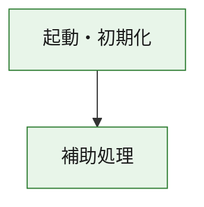
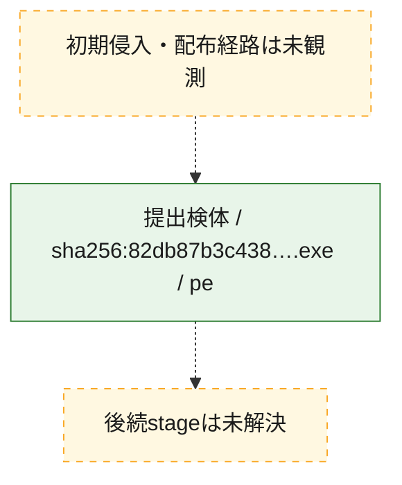
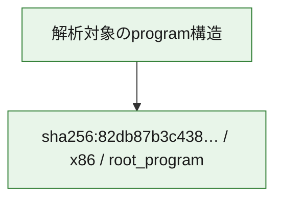

# 全体ロジック：82db87b3c438dd8d3233c74632252bd577ad1faf6b77ade05f69beaf8602b298

代表関数の静的証跡から、起動・初期化の処理群を確認しました。

## 読み方

- phaseの掲載順は解析上の整理順です。observed_call_edgesがない段階間の実行順を断定しません。
- 図の実線は静的に観測した関係、点線と黄色のノードは未観測・未解決の関係を示します。
- 図は静的な要約であり、動的実行を再現するものではありません。
- 詳細な関数解説とfingerprintは[STATIC-LOGIC.md](STATIC-LOGIC.md)を参照してください。

## 静的可視化

### 実行フロー

### 感染チェーン

### モジュール関係

## 処理段階

### 1. 起動・初期化

entry pointから初期化と後続処理への移行を確認します。
確度: `confirmed_static_function_evidence`

- `82db87b3c438dd8d3233c74632252bd577ad1faf6b77ade05f69beaf8602b298:ghidra:3a5b711f0` — 初期化と主要処理への分岐を行う入口関数です。 状態: `succeeded`、選定理由: `entry_point`, `meaningful_symbol_name`, `reviewed_call_centrality:2`, `role:entrypoint`

### 2. 補助処理

主要処理を支える一般内部関数またはlibrary処理を確認します。
確度: `confirmed_static_function_evidence_with_limits`

- `82db87b3c438dd8d3233c74632252bd577ad1faf6b77ade05f69beaf8602b298:ghidra:3a5b71000` — 検体内部の一般処理を実装する関数です。 状態: `succeeded`、選定理由: `context_representative`, `reviewed_call_centrality:14`
- `82db87b3c438dd8d3233c74632252bd577ad1faf6b77ade05f69beaf8602b298:ghidra:3a5b71330` — 検体内部の一般処理を実装する関数です。 状態: `limited_bad_instruction_or_flow`、選定理由: `context_representative`, `reviewed_call_centrality:2`
- `82db87b3c438dd8d3233c74632252bd577ad1faf6b77ade05f69beaf8602b298:ghidra:3a5b71340` — 検体内部の一般処理を実装する関数です。 状態: `limited_bad_instruction_or_flow`、選定理由: `context_representative`, `reviewed_call_centrality:2`
- `82db87b3c438dd8d3233c74632252bd577ad1faf6b77ade05f69beaf8602b298:ghidra:3a5b71350` — 検体内部の一般処理を実装する関数です。 状態: `succeeded`、選定理由: `context_representative`
- `82db87b3c438dd8d3233c74632252bd577ad1faf6b77ade05f69beaf8602b298:ghidra:3a5b91c80` — 検体内部の一般処理を実装する関数です。 状態: `succeeded`、選定理由: `context_representative`, `reviewed_call_centrality:4`
- `82db87b3c438dd8d3233c74632252bd577ad1faf6b77ade05f69beaf8602b298:ghidra:3a5b91d80` — 検体内部の一般処理を実装する関数です。 状態: `succeeded`、選定理由: `context_representative`, `reviewed_call_centrality:4`
- `82db87b3c438dd8d3233c74632252bd577ad1faf6b77ade05f69beaf8602b298:ghidra:3a5b91de0` — 検体内部の一般処理を実装する関数です。 状態: `succeeded`、選定理由: `context_representative`, `reviewed_call_centrality:7`
- `82db87b3c438dd8d3233c74632252bd577ad1faf6b77ade05f69beaf8602b298:ghidra:3a5b91ec0` — 検体内部の一般処理を実装する関数です。 状態: `succeeded`、選定理由: `context_representative`, `reviewed_call_centrality:1`
- `82db87b3c438dd8d3233c74632252bd577ad1faf6b77ade05f69beaf8602b298:ghidra:3a5b91f40` — 検体内部の一般処理を実装する関数です。 状態: `succeeded`、選定理由: `context_representative`, `reviewed_call_centrality:1`
- `82db87b3c438dd8d3233c74632252bd577ad1faf6b77ade05f69beaf8602b298:ghidra:3a5b91fa0` — 検体内部の一般処理を実装する関数です。 状態: `succeeded`、選定理由: `context_representative`, `reviewed_call_centrality:2`
- `82db87b3c438dd8d3233c74632252bd577ad1faf6b77ade05f69beaf8602b298:ghidra:3a5b92010` — 検体内部の一般処理を実装する関数です。 状態: `succeeded`、選定理由: `context_representative`
- `82db87b3c438dd8d3233c74632252bd577ad1faf6b77ade05f69beaf8602b298:ghidra:3a5b92170` — 検体内部の一般処理を実装する関数です。 状態: `succeeded`、選定理由: `context_representative`
- `82db87b3c438dd8d3233c74632252bd577ad1faf6b77ade05f69beaf8602b298:ghidra:3a5b921a0` — 検体内部の一般処理を実装する関数です。 状態: `succeeded`、選定理由: `context_representative`
- `82db87b3c438dd8d3233c74632252bd577ad1faf6b77ade05f69beaf8602b298:ghidra:3a5b921e0` — 検体内部の一般処理を実装する関数です。 状態: `succeeded`、選定理由: `context_representative`, `reviewed_call_centrality:4`
- `82db87b3c438dd8d3233c74632252bd577ad1faf6b77ade05f69beaf8602b298:ghidra:3a5b922c0` — 検体内部の一般処理を実装する関数です。 状態: `succeeded`、選定理由: `context_representative`, `reviewed_call_centrality:1`
- `82db87b3c438dd8d3233c74632252bd577ad1faf6b77ade05f69beaf8602b298:ghidra:3a5b92320` — 検体内部の一般処理を実装する関数です。 状態: `succeeded`、選定理由: `context_representative`
- `82db87b3c438dd8d3233c74632252bd577ad1faf6b77ade05f69beaf8602b298:ghidra:3a5b923a0` — 検体内部の一般処理を実装する関数です。 状態: `succeeded`、選定理由: `context_representative`
- `82db87b3c438dd8d3233c74632252bd577ad1faf6b77ade05f69beaf8602b298:ghidra:3a5b92400` — 検体内部の一般処理を実装する関数です。 状態: `succeeded`、選定理由: `context_representative`, `reviewed_call_centrality:1`
- `82db87b3c438dd8d3233c74632252bd577ad1faf6b77ade05f69beaf8602b298:ghidra:3a5b924d0` — 検体内部の一般処理を実装する関数です。 状態: `succeeded`、選定理由: `context_representative`
- `82db87b3c438dd8d3233c74632252bd577ad1faf6b77ade05f69beaf8602b298:ghidra:3a5b925d0` — 検体内部の一般処理を実装する関数です。 状態: `succeeded`、選定理由: `context_representative`, `reviewed_call_centrality:2`
- `82db87b3c438dd8d3233c74632252bd577ad1faf6b77ade05f69beaf8602b298:ghidra:3a5b92660` — 検体内部の一般処理を実装する関数です。 状態: `succeeded`、選定理由: `context_representative`, `reviewed_call_centrality:6`
- `82db87b3c438dd8d3233c74632252bd577ad1faf6b77ade05f69beaf8602b298:ghidra:3a5b927b0` — 検体内部の一般処理を実装する関数です。 状態: `succeeded`、選定理由: `context_representative`, `reviewed_call_centrality:6`
- `82db87b3c438dd8d3233c74632252bd577ad1faf6b77ade05f69beaf8602b298:ghidra:3a5b92a20` — 検体内部の一般処理を実装する関数です。 状態: `succeeded`、選定理由: `context_representative`, `reviewed_call_centrality:5`
- `82db87b3c438dd8d3233c74632252bd577ad1faf6b77ade05f69beaf8602b298:ghidra:3a5b92b30` — 検体内部の一般処理を実装する関数です。 状態: `succeeded`、選定理由: `context_representative`, `reviewed_call_centrality:4`
- `82db87b3c438dd8d3233c74632252bd577ad1faf6b77ade05f69beaf8602b298:ghidra:3a5b92db0` — 検体内部の一般処理を実装する関数です。 状態: `succeeded`、選定理由: `context_representative`, `reviewed_call_centrality:2`
- `82db87b3c438dd8d3233c74632252bd577ad1faf6b77ade05f69beaf8602b298:ghidra:3a5b92e50` — 検体内部の一般処理を実装する関数です。 状態: `succeeded`、選定理由: `context_representative`, `reviewed_call_centrality:27`
- `82db87b3c438dd8d3233c74632252bd577ad1faf6b77ade05f69beaf8602b298:ghidra:3a5b93a00` — 検体内部の一般処理を実装する関数です。 状態: `succeeded`、選定理由: `context_representative`, `reviewed_call_centrality:6`
- `82db87b3c438dd8d3233c74632252bd577ad1faf6b77ade05f69beaf8602b298:ghidra:3a5b93b20` — 検体内部の一般処理を実装する関数です。 状態: `succeeded`、選定理由: `context_representative`, `reviewed_call_centrality:4`
- `82db87b3c438dd8d3233c74632252bd577ad1faf6b77ade05f69beaf8602b298:ghidra:3a5b9ee30` — compiler生成処理または汎用library処理とみられる関数です。 状態: `succeeded`、選定理由: `entry_point`, `meaningful_symbol_name`, `reviewed_call_centrality:7`
- `82db87b3c438dd8d3233c74632252bd577ad1faf6b77ade05f69beaf8602b298:ghidra:3a5b9ee50` — compiler生成処理または汎用library処理とみられる関数です。 状態: `succeeded`、選定理由: `entry_point`, `meaningful_symbol_name`, `reviewed_call_centrality:4`
- `82db87b3c438dd8d3233c74632252bd577ad1faf6b77ade05f69beaf8602b298:ghidra:3a5bad900` — compiler生成処理または汎用library処理とみられる関数です。 状態: `limited_bad_instruction_or_flow`、選定理由: `entry_point`, `meaningful_symbol_name`, `reviewed_call_centrality:12`

## 観測したcall関係

- `82db87b3c438dd8d3233c74632252bd577ad1faf6b77ade05f69beaf8602b298:ghidra:3a5b71000` → `82db87b3c438dd8d3233c74632252bd577ad1faf6b77ade05f69beaf8602b298:ghidra:3a5b9ee50` （`support` → `support`）
- `82db87b3c438dd8d3233c74632252bd577ad1faf6b77ade05f69beaf8602b298:ghidra:3a5b711f0` → `82db87b3c438dd8d3233c74632252bd577ad1faf6b77ade05f69beaf8602b298:ghidra:3a5b71000` （`startup` → `support`）
- `82db87b3c438dd8d3233c74632252bd577ad1faf6b77ade05f69beaf8602b298:ghidra:3a5b91ec0` → `82db87b3c438dd8d3233c74632252bd577ad1faf6b77ade05f69beaf8602b298:ghidra:3a5b91de0` （`support` → `support`）
- `82db87b3c438dd8d3233c74632252bd577ad1faf6b77ade05f69beaf8602b298:ghidra:3a5b91fa0` → `82db87b3c438dd8d3233c74632252bd577ad1faf6b77ade05f69beaf8602b298:ghidra:3a5b91de0` （`support` → `support`）
- `82db87b3c438dd8d3233c74632252bd577ad1faf6b77ade05f69beaf8602b298:ghidra:3a5b925d0` → `82db87b3c438dd8d3233c74632252bd577ad1faf6b77ade05f69beaf8602b298:ghidra:3a5b91de0` （`support` → `support`）
- `82db87b3c438dd8d3233c74632252bd577ad1faf6b77ade05f69beaf8602b298:ghidra:3a5b92660` → `82db87b3c438dd8d3233c74632252bd577ad1faf6b77ade05f69beaf8602b298:ghidra:3a5b91d80` （`support` → `support`）
- `82db87b3c438dd8d3233c74632252bd577ad1faf6b77ade05f69beaf8602b298:ghidra:3a5b92660` → `82db87b3c438dd8d3233c74632252bd577ad1faf6b77ade05f69beaf8602b298:ghidra:3a5b91de0` （`support` → `support`）
- `82db87b3c438dd8d3233c74632252bd577ad1faf6b77ade05f69beaf8602b298:ghidra:3a5b927b0` → `82db87b3c438dd8d3233c74632252bd577ad1faf6b77ade05f69beaf8602b298:ghidra:3a5b91d80` （`support` → `support`）
- `82db87b3c438dd8d3233c74632252bd577ad1faf6b77ade05f69beaf8602b298:ghidra:3a5b927b0` → `82db87b3c438dd8d3233c74632252bd577ad1faf6b77ade05f69beaf8602b298:ghidra:3a5b91de0` （`support` → `support`）
- `82db87b3c438dd8d3233c74632252bd577ad1faf6b77ade05f69beaf8602b298:ghidra:3a5b92a20` → `82db87b3c438dd8d3233c74632252bd577ad1faf6b77ade05f69beaf8602b298:ghidra:3a5b91d80` （`support` → `support`）
- `82db87b3c438dd8d3233c74632252bd577ad1faf6b77ade05f69beaf8602b298:ghidra:3a5b92a20` → `82db87b3c438dd8d3233c74632252bd577ad1faf6b77ade05f69beaf8602b298:ghidra:3a5b91de0` （`support` → `support`）
- `82db87b3c438dd8d3233c74632252bd577ad1faf6b77ade05f69beaf8602b298:ghidra:3a5b92b30` → `82db87b3c438dd8d3233c74632252bd577ad1faf6b77ade05f69beaf8602b298:ghidra:3a5b91c80` （`support` → `support`）
- `82db87b3c438dd8d3233c74632252bd577ad1faf6b77ade05f69beaf8602b298:ghidra:3a5b92b30` → `82db87b3c438dd8d3233c74632252bd577ad1faf6b77ade05f69beaf8602b298:ghidra:3a5b92a20` （`support` → `support`）
- `82db87b3c438dd8d3233c74632252bd577ad1faf6b77ade05f69beaf8602b298:ghidra:3a5b92db0` → `82db87b3c438dd8d3233c74632252bd577ad1faf6b77ade05f69beaf8602b298:ghidra:3a5b91c80` （`support` → `support`）
- `82db87b3c438dd8d3233c74632252bd577ad1faf6b77ade05f69beaf8602b298:ghidra:3a5b92db0` → `82db87b3c438dd8d3233c74632252bd577ad1faf6b77ade05f69beaf8602b298:ghidra:3a5b92a20` （`support` → `support`）
- `82db87b3c438dd8d3233c74632252bd577ad1faf6b77ade05f69beaf8602b298:ghidra:3a5b92e50` → `82db87b3c438dd8d3233c74632252bd577ad1faf6b77ade05f69beaf8602b298:ghidra:3a5b91c80` （`support` → `support`）
- `82db87b3c438dd8d3233c74632252bd577ad1faf6b77ade05f69beaf8602b298:ghidra:3a5b92e50` → `82db87b3c438dd8d3233c74632252bd577ad1faf6b77ade05f69beaf8602b298:ghidra:3a5b91d80` （`support` → `support`）
- `82db87b3c438dd8d3233c74632252bd577ad1faf6b77ade05f69beaf8602b298:ghidra:3a5b92e50` → `82db87b3c438dd8d3233c74632252bd577ad1faf6b77ade05f69beaf8602b298:ghidra:3a5b91de0` （`support` → `support`）
- `82db87b3c438dd8d3233c74632252bd577ad1faf6b77ade05f69beaf8602b298:ghidra:3a5b92e50` → `82db87b3c438dd8d3233c74632252bd577ad1faf6b77ade05f69beaf8602b298:ghidra:3a5b91f40` （`support` → `support`）
- `82db87b3c438dd8d3233c74632252bd577ad1faf6b77ade05f69beaf8602b298:ghidra:3a5b92e50` → `82db87b3c438dd8d3233c74632252bd577ad1faf6b77ade05f69beaf8602b298:ghidra:3a5b91fa0` （`support` → `support`）
- `82db87b3c438dd8d3233c74632252bd577ad1faf6b77ade05f69beaf8602b298:ghidra:3a5b92e50` → `82db87b3c438dd8d3233c74632252bd577ad1faf6b77ade05f69beaf8602b298:ghidra:3a5b922c0` （`support` → `support`）
- `82db87b3c438dd8d3233c74632252bd577ad1faf6b77ade05f69beaf8602b298:ghidra:3a5b92e50` → `82db87b3c438dd8d3233c74632252bd577ad1faf6b77ade05f69beaf8602b298:ghidra:3a5b925d0` （`support` → `support`）
- `82db87b3c438dd8d3233c74632252bd577ad1faf6b77ade05f69beaf8602b298:ghidra:3a5b92e50` → `82db87b3c438dd8d3233c74632252bd577ad1faf6b77ade05f69beaf8602b298:ghidra:3a5b92a20` （`support` → `support`）
- `82db87b3c438dd8d3233c74632252bd577ad1faf6b77ade05f69beaf8602b298:ghidra:3a5b92e50` → `82db87b3c438dd8d3233c74632252bd577ad1faf6b77ade05f69beaf8602b298:ghidra:3a5b92b30` （`support` → `support`）
- `82db87b3c438dd8d3233c74632252bd577ad1faf6b77ade05f69beaf8602b298:ghidra:3a5b92e50` → `82db87b3c438dd8d3233c74632252bd577ad1faf6b77ade05f69beaf8602b298:ghidra:3a5b93a00` （`support` → `support`）
- `82db87b3c438dd8d3233c74632252bd577ad1faf6b77ade05f69beaf8602b298:ghidra:3a5b92e50` → `82db87b3c438dd8d3233c74632252bd577ad1faf6b77ade05f69beaf8602b298:ghidra:3a5b93b20` （`support` → `support`）
- `82db87b3c438dd8d3233c74632252bd577ad1faf6b77ade05f69beaf8602b298:ghidra:3a5b93a00` → `82db87b3c438dd8d3233c74632252bd577ad1faf6b77ade05f69beaf8602b298:ghidra:3a5b91c80` （`support` → `support`）
- `82db87b3c438dd8d3233c74632252bd577ad1faf6b77ade05f69beaf8602b298:ghidra:3a5b93a00` → `82db87b3c438dd8d3233c74632252bd577ad1faf6b77ade05f69beaf8602b298:ghidra:3a5b92e50` （`support` → `support`）
- `82db87b3c438dd8d3233c74632252bd577ad1faf6b77ade05f69beaf8602b298:ghidra:3a5b93b20` → `82db87b3c438dd8d3233c74632252bd577ad1faf6b77ade05f69beaf8602b298:ghidra:3a5b92e50` （`support` → `support`）
- `82db87b3c438dd8d3233c74632252bd577ad1faf6b77ade05f69beaf8602b298:ghidra:3a5b93b20` → `82db87b3c438dd8d3233c74632252bd577ad1faf6b77ade05f69beaf8602b298:ghidra:3a5b93a00` （`support` → `support`）
- `ghidra-function:04828c9ad260fea27bab4a35` → `ghidra-external:afff94050135f959df343f31` （`unclassified` → `unclassified`）
- `ghidra-function:04828c9ad260fea27bab4a35` → `ghidra-function:5ee6ebb2cba8db158f16fcd5` （`unclassified` → `unclassified`）
- `ghidra-function:04828c9ad260fea27bab4a35` → `ghidra-function:e676b3217ffa22bed3045449` （`unclassified` → `unclassified`）
- `ghidra-function:1e623b2a98ef97a03fbb89cb` → `ghidra-external:43d78a7129ac536b752098fb` （`unclassified` → `unclassified`）
- `ghidra-function:1e623b2a98ef97a03fbb89cb` → `ghidra-function:245c00ec7605343bf10d3cb3` （`unclassified` → `unclassified`）
- `ghidra-function:1e623b2a98ef97a03fbb89cb` → `ghidra-function:f6390713c14756ec1838d607` （`unclassified` → `unclassified`）
- `ghidra-function:245c00ec7605343bf10d3cb3` → `ghidra-external:136f905803df37772ab90c31` （`unclassified` → `unclassified`）
- `ghidra-function:245c00ec7605343bf10d3cb3` → `ghidra-external:d74a48cb50720ee618d31f37` （`unclassified` → `unclassified`）
- `ghidra-function:245c00ec7605343bf10d3cb3` → `ghidra-function:04828c9ad260fea27bab4a35` （`unclassified` → `unclassified`）
- `ghidra-function:245c00ec7605343bf10d3cb3` → `ghidra-function:1e623b2a98ef97a03fbb89cb` （`unclassified` → `unclassified`）
- `ghidra-function:245c00ec7605343bf10d3cb3` → `ghidra-function:237d378a54c5a961879ae057` （`unclassified` → `unclassified`）
- `ghidra-function:245c00ec7605343bf10d3cb3` → `ghidra-function:3d49453a22e9027e50e8a8ae` （`unclassified` → `unclassified`）
- `ghidra-function:245c00ec7605343bf10d3cb3` → `ghidra-function:50be5195b91ea976b8d1a143` （`unclassified` → `unclassified`）
- `ghidra-function:245c00ec7605343bf10d3cb3` → `ghidra-function:5ee6ebb2cba8db158f16fcd5` （`unclassified` → `unclassified`）
- `ghidra-function:245c00ec7605343bf10d3cb3` → `ghidra-function:60913437e5e58c7489178d5e` （`unclassified` → `unclassified`）
- `ghidra-function:245c00ec7605343bf10d3cb3` → `ghidra-function:6e030ce8354458d82f9e3734` （`unclassified` → `unclassified`）
- `ghidra-function:245c00ec7605343bf10d3cb3` → `ghidra-function:73f12a6ab54a061a00772acf` （`unclassified` → `unclassified`）
- `ghidra-function:245c00ec7605343bf10d3cb3` → `ghidra-function:794da6329dd93716ae559c01` （`unclassified` → `unclassified`）
- `ghidra-function:245c00ec7605343bf10d3cb3` → `ghidra-function:8a145e809d72a8eb3d935b2b` （`unclassified` → `unclassified`）
- `ghidra-function:245c00ec7605343bf10d3cb3` → `ghidra-function:9dcffbd106166d31f942915c` （`unclassified` → `unclassified`）
- `ghidra-function:245c00ec7605343bf10d3cb3` → `ghidra-function:9dedb1b6037e7964e2a32dc2` （`unclassified` → `unclassified`）
- `ghidra-function:245c00ec7605343bf10d3cb3` → `ghidra-function:a7ec8df2aa319641a6451a11` （`unclassified` → `unclassified`）
- `ghidra-function:245c00ec7605343bf10d3cb3` → `ghidra-function:aba04aacdc90cfa101d65cb6` （`unclassified` → `unclassified`）
- `ghidra-function:245c00ec7605343bf10d3cb3` → `ghidra-function:ba39c05055248176f24b47df` （`unclassified` → `unclassified`）
- `ghidra-function:245c00ec7605343bf10d3cb3` → `ghidra-function:d313661216f53da6a7b4d08e` （`unclassified` → `unclassified`）
- `ghidra-function:245c00ec7605343bf10d3cb3` → `ghidra-function:da315ffafb8e8eb02c2ab15a` （`unclassified` → `unclassified`）
- `ghidra-function:245c00ec7605343bf10d3cb3` → `ghidra-function:dc1e525c3836fcaba4516dc7` （`unclassified` → `unclassified`）
- `ghidra-function:245c00ec7605343bf10d3cb3` → `ghidra-function:e1cfae43c5f9ee9b7f91b866` （`unclassified` → `unclassified`）
- `ghidra-function:245c00ec7605343bf10d3cb3` → `ghidra-function:e676b3217ffa22bed3045449` （`unclassified` → `unclassified`）
- `ghidra-function:245c00ec7605343bf10d3cb3` → `ghidra-function:f6390713c14756ec1838d607` （`unclassified` → `unclassified`）
- `ghidra-function:245c00ec7605343bf10d3cb3` → `ghidra-function:fe42930e86578a4a04f32457` （`unclassified` → `unclassified`）
- `ghidra-function:30020a4b8813f0317f7ba583` → `ghidra-function:b774f77be15d02310830ab54` （`unclassified` → `unclassified`）
- `ghidra-function:50be5195b91ea976b8d1a143` → `ghidra-function:9dcffbd106166d31f942915c` （`unclassified` → `unclassified`）
- `ghidra-function:5a4af3370b6b944000bbdba3` → `ghidra-external:d74a48cb50720ee618d31f37` （`unclassified` → `unclassified`）
- `ghidra-function:5ee6ebb2cba8db158f16fcd5` → `ghidra-function:9dcffbd106166d31f942915c` （`unclassified` → `unclassified`）
- `ghidra-function:5ee6ebb2cba8db158f16fcd5` → `ghidra-function:ba39c05055248176f24b47df` （`unclassified` → `unclassified`）
- `ghidra-function:5f93545b1379baa3d9948d35` → `ghidra-external:1c3c86fadd27a1d03b78d545` （`unclassified` → `unclassified`）
- `ghidra-function:5f93545b1379baa3d9948d35` → `ghidra-external:815590d9648e0b8596a0894d` （`unclassified` → `unclassified`）
- `ghidra-function:5f93545b1379baa3d9948d35` → `ghidra-external:91f3bf3ac127fe32a5596c1d` （`unclassified` → `unclassified`）
- `ghidra-function:5f93545b1379baa3d9948d35` → `ghidra-external:fa41cd9d171d0782bb1db662` （`unclassified` → `unclassified`）
- `ghidra-function:87d9edbc25730f00fdd6dbc1` → `ghidra-function:9dcffbd106166d31f942915c` （`unclassified` → `unclassified`）
- `ghidra-function:a29fe23f839c033efb8e42df` → `ghidra-external:d74a48cb50720ee618d31f37` （`unclassified` → `unclassified`）
- `ghidra-function:a29fe23f839c033efb8e42df` → `ghidra-function:237d378a54c5a961879ae057` （`unclassified` → `unclassified`）
- `ghidra-function:a29fe23f839c033efb8e42df` → `ghidra-function:8a145e809d72a8eb3d935b2b` （`unclassified` → `unclassified`）
- `ghidra-function:a29fe23f839c033efb8e42df` → `ghidra-function:9dcffbd106166d31f942915c` （`unclassified` → `unclassified`）
- `ghidra-function:a29fe23f839c033efb8e42df` → `ghidra-function:ba39c05055248176f24b47df` （`unclassified` → `unclassified`）
- `ghidra-function:a29fe23f839c033efb8e42df` → `ghidra-function:dc1e525c3836fcaba4516dc7` （`unclassified` → `unclassified`）
- `ghidra-function:a478a9d879d1b514d0215f05` → `ghidra-function:b774f77be15d02310830ab54` （`unclassified` → `unclassified`）
- `ghidra-function:a6cb06d70eb1d7a6bd03ed2e` → `ghidra-external:1f3d20fdbb7292982201250b` （`unclassified` → `unclassified`）
- `ghidra-function:a6cb06d70eb1d7a6bd03ed2e` → `ghidra-external:2296f3442b214e4966d59864` （`unclassified` → `unclassified`）
- `ghidra-function:a6cb06d70eb1d7a6bd03ed2e` → `ghidra-external:89c6fc40020a2266c03353c1` （`unclassified` → `unclassified`）
- `ghidra-function:a6cb06d70eb1d7a6bd03ed2e` → `ghidra-external:8f2a63ff727755487a07e0b6` （`unclassified` → `unclassified`）
- `ghidra-function:a6cb06d70eb1d7a6bd03ed2e` → `ghidra-external:985ebcdc9f5e05eec821c129` （`unclassified` → `unclassified`）
- `ghidra-function:a6cb06d70eb1d7a6bd03ed2e` → `ghidra-external:f5cbb43a4d1097f34aa200fc` （`unclassified` → `unclassified`）
- `ghidra-function:a6cb06d70eb1d7a6bd03ed2e` → `ghidra-external:f96485ef1f378d44a482bf03` （`unclassified` → `unclassified`）
- `ghidra-function:a6cb06d70eb1d7a6bd03ed2e` → `ghidra-function:4e3a6fda256270eb030ae977` （`unclassified` → `unclassified`）
- `ghidra-function:a6cb06d70eb1d7a6bd03ed2e` → `ghidra-function:71893ba291b041089ec49390` （`unclassified` → `unclassified`）
- `ghidra-function:a6cb06d70eb1d7a6bd03ed2e` → `ghidra-function:7ec8680b1a0137e9967a0a8f` （`unclassified` → `unclassified`）
- `ghidra-function:a6cb06d70eb1d7a6bd03ed2e` → `ghidra-function:8a5f111e856d4de03fa48a49` （`unclassified` → `unclassified`）
- `ghidra-function:a6cb06d70eb1d7a6bd03ed2e` → `ghidra-function:f4ebdcce0157c73e6cbcf4c1` （`unclassified` → `unclassified`）
- `ghidra-function:c554fc6ea43e4c64b15f10a9` → `ghidra-external:1c3c86fadd27a1d03b78d545` （`unclassified` → `unclassified`）
- `ghidra-function:c554fc6ea43e4c64b15f10a9` → `ghidra-function:53110e31e6de6827f0941bf6` （`unclassified` → `unclassified`）
- `ghidra-function:c554fc6ea43e4c64b15f10a9` → `ghidra-function:5a86be85b891d338af6dac7a` （`unclassified` → `unclassified`）
- `ghidra-function:c554fc6ea43e4c64b15f10a9` → `ghidra-function:65871582586fac235b560735` （`unclassified` → `unclassified`）
- `ghidra-function:c554fc6ea43e4c64b15f10a9` → `ghidra-function:77ad3bbf8c04509c4feae18b` （`unclassified` → `unclassified`）
- `ghidra-function:c554fc6ea43e4c64b15f10a9` → `ghidra-function:7b91c0a4f7a261b36b357c28` （`unclassified` → `unclassified`）
- `ghidra-function:c554fc6ea43e4c64b15f10a9` → `ghidra-function:93fdd81d92084f67e6dbc27d` （`unclassified` → `unclassified`）
- `ghidra-function:c554fc6ea43e4c64b15f10a9` → `ghidra-function:b2ef8928a9f611df9ed6a676` （`unclassified` → `unclassified`）
- `ghidra-function:c554fc6ea43e4c64b15f10a9` → `ghidra-function:e5a86107c903c7400a9d944b` （`unclassified` → `unclassified`）
- `ghidra-function:cbf8a5daf4c55ea0d3f2797a` → `ghidra-external:d74a48cb50720ee618d31f37` （`unclassified` → `unclassified`）
- `ghidra-function:cbf8a5daf4c55ea0d3f2797a` → `ghidra-function:237d378a54c5a961879ae057` （`unclassified` → `unclassified`）
- `ghidra-function:cbf8a5daf4c55ea0d3f2797a` → `ghidra-function:8a145e809d72a8eb3d935b2b` （`unclassified` → `unclassified`）
- `ghidra-function:cbf8a5daf4c55ea0d3f2797a` → `ghidra-function:9dcffbd106166d31f942915c` （`unclassified` → `unclassified`）
- `ghidra-function:cbf8a5daf4c55ea0d3f2797a` → `ghidra-function:ba39c05055248176f24b47df` （`unclassified` → `unclassified`）
- `ghidra-function:cbf8a5daf4c55ea0d3f2797a` → `ghidra-function:dc1e525c3836fcaba4516dc7` （`unclassified` → `unclassified`）
- `ghidra-function:d313661216f53da6a7b4d08e` → `ghidra-function:9dcffbd106166d31f942915c` （`unclassified` → `unclassified`）
- `ghidra-function:d50210042e792e0a644095f6` → `ghidra-external:2296f3442b214e4966d59864` （`unclassified` → `unclassified`）
- `ghidra-function:d50210042e792e0a644095f6` → `ghidra-function:a6cb06d70eb1d7a6bd03ed2e` （`unclassified` → `unclassified`）
- `ghidra-function:dc27b6cd0a474a8e6142b45a` → `ghidra-function:5ee6ebb2cba8db158f16fcd5` （`unclassified` → `unclassified`）
- `ghidra-function:dc27b6cd0a474a8e6142b45a` → `ghidra-function:e676b3217ffa22bed3045449` （`unclassified` → `unclassified`）
- `ghidra-function:f4e408b7c658c50a777fe68e` → `ghidra-external:fa41cd9d171d0782bb1db662` （`unclassified` → `unclassified`）
- `ghidra-function:f4e408b7c658c50a777fe68e` → `ghidra-function:2b9eb3d94855f53fcdee554d` （`unclassified` → `unclassified`）
- `ghidra-function:f4e408b7c658c50a777fe68e` → `ghidra-function:865027c497cec4d355918708` （`unclassified` → `unclassified`）
- `ghidra-function:f4e408b7c658c50a777fe68e` → `ghidra-function:cfa64afddb06767eb8ccbc1e` （`unclassified` → `unclassified`）
- `ghidra-function:f4e408b7c658c50a777fe68e` → `ghidra-function:e0809d86fb436b7edfdadc6f` （`unclassified` → `unclassified`）
- `ghidra-function:f4ebdcce0157c73e6cbcf4c1` → `ghidra-external:43d78a7129ac536b752098fb` （`unclassified` → `unclassified`）
- `ghidra-function:f4ebdcce0157c73e6cbcf4c1` → `ghidra-function:e0809d86fb436b7edfdadc6f` （`unclassified` → `unclassified`）
- `ghidra-function:f6390713c14756ec1838d607` → `ghidra-external:43d78a7129ac536b752098fb` （`unclassified` → `unclassified`）
- `ghidra-function:f6390713c14756ec1838d607` → `ghidra-function:245c00ec7605343bf10d3cb3` （`unclassified` → `unclassified`）
- `ghidra-function:f6390713c14756ec1838d607` → `ghidra-function:8a145e809d72a8eb3d935b2b` （`unclassified` → `unclassified`）
- `ghidra-function:f6390713c14756ec1838d607` → `ghidra-function:e676b3217ffa22bed3045449` （`unclassified` → `unclassified`）

## 解析範囲と制約

- 選定外関数は全体inventoryへ残しますが、関数本体の個別解説対象にはしていません。
- indirect call、難読化、packer、VM、壊れたcontrol flowによりcall関係が欠落する場合があります。
- 文書は静的解析に基づき、検体実行や外部通信による動的確認は行っていません。
