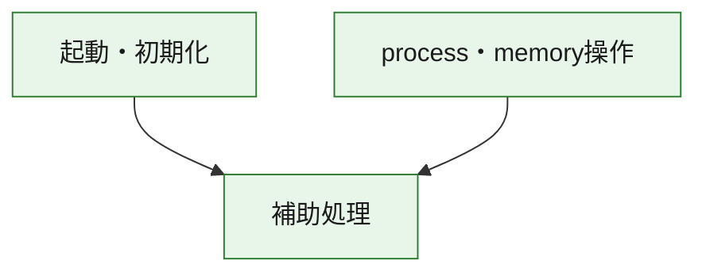
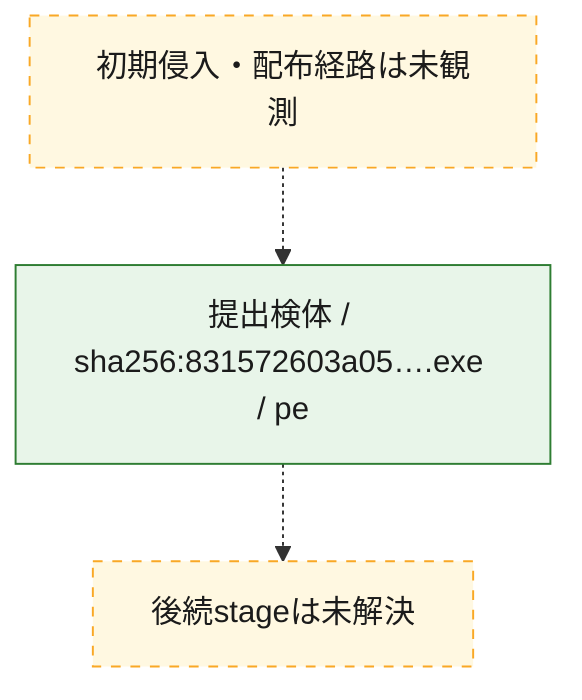
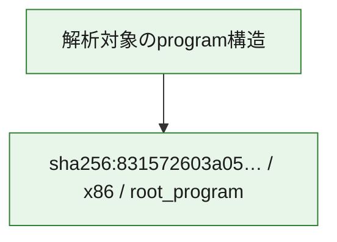

# 全体ロジック：831572603a05b28e8e88bd3287510c97089431fed30597e11a562575be9fa303

代表関数の静的証跡から、起動・初期化、process・memory操作の処理群を確認しました。

## 読み方

- phaseの掲載順は解析上の整理順です。observed_call_edgesがない段階間の実行順を断定しません。
- 図の実線は静的に観測した関係、点線と黄色のノードは未観測・未解決の関係を示します。
- 図は静的な要約であり、動的実行を再現するものではありません。
- 詳細な関数解説とfingerprintは[STATIC-LOGIC.md](STATIC-LOGIC.md)を参照してください。

## 静的可視化

### 実行フロー

### 感染チェーン

### モジュール関係

## 処理段階

### 1. 起動・初期化

entry pointから初期化と後続処理への移行を確認します。
確度: `confirmed_static_function_evidence`

- `831572603a05b28e8e88bd3287510c97089431fed30597e11a562575be9fa303:ghidra:30b891340` — 初期化と主要処理への分岐を行う入口関数です。 状態: `succeeded`、選定理由: `entry_point`, `meaningful_symbol_name`, `reviewed_call_centrality:5`, `role:entrypoint`

### 2. process・memory操作

process、thread、module、memory操作と実行移行を確認します。
確度: `confirmed_static_function_evidence`

- `831572603a05b28e8e88bd3287510c97089431fed30597e11a562575be9fa303:ghidra:30b89b840` — process、thread、module、またはmemory操作に関係する関数です。 状態: `succeeded`、選定理由: `context_representative`, `reviewed_call_centrality:16`, `role:process_or_memory_operation`
- `831572603a05b28e8e88bd3287510c97089431fed30597e11a562575be9fa303:ghidra:30b89b8b0` — process、thread、module、またはmemory操作に関係する関数です。 状態: `succeeded`、選定理由: `context_representative`, `reviewed_call_centrality:12`, `role:process_or_memory_operation`

### 3. 補助処理

主要処理を支える一般内部関数またはlibrary処理を確認します。
確度: `confirmed_static_function_evidence_with_limits`

- `831572603a05b28e8e88bd3287510c97089431fed30597e11a562575be9fa303:ghidra:30b891000` — 検体内部の一般処理を実装する関数です。 状態: `succeeded`、選定理由: `context_representative`, `reviewed_call_centrality:1`
- `831572603a05b28e8e88bd3287510c97089431fed30597e11a562575be9fa303:ghidra:30b891010` — 検体内部の一般処理を実装する関数です。 状態: `succeeded`、選定理由: `context_representative`, `reviewed_call_centrality:10`
- `831572603a05b28e8e88bd3287510c97089431fed30597e11a562575be9fa303:ghidra:30b8911e0` — 検体内部の一般処理を実装する関数です。 状態: `succeeded`、選定理由: `context_representative`, `reviewed_call_centrality:5`
- `831572603a05b28e8e88bd3287510c97089431fed30597e11a562575be9fa303:ghidra:30b891360` — 検体内部の一般処理を実装する関数です。 状態: `succeeded`、選定理由: `context_representative`, `reviewed_call_centrality:4`
- `831572603a05b28e8e88bd3287510c97089431fed30597e11a562575be9fa303:ghidra:30b891370` — 検体内部の一般処理を実装する関数です。 状態: `succeeded`、選定理由: `context_representative`, `reviewed_call_centrality:4`
- `831572603a05b28e8e88bd3287510c97089431fed30597e11a562575be9fa303:ghidra:30b891380` — 検体内部の一般処理を実装する関数です。 状態: `succeeded`、選定理由: `context_representative`
- `831572603a05b28e8e88bd3287510c97089431fed30597e11a562575be9fa303:ghidra:30b89b680` — 検体内部の一般処理を実装する関数です。 状態: `succeeded`、選定理由: `context_representative`
- `831572603a05b28e8e88bd3287510c97089431fed30597e11a562575be9fa303:ghidra:30b89b6d0` — 検体内部の一般処理を実装する関数です。 状態: `succeeded`、選定理由: `context_representative`, `reviewed_call_centrality:4`
- `831572603a05b28e8e88bd3287510c97089431fed30597e11a562575be9fa303:ghidra:30b89b750` — 検体内部の一般処理を実装する関数です。 状態: `succeeded`、選定理由: `context_representative`, `reviewed_call_centrality:6`
- `831572603a05b28e8e88bd3287510c97089431fed30597e11a562575be9fa303:ghidra:30b89b770` — compiler生成処理または汎用library処理とみられる関数です。 状態: `succeeded`、選定理由: `entry_point`, `meaningful_symbol_name`, `reviewed_call_centrality:1`
- `831572603a05b28e8e88bd3287510c97089431fed30597e11a562575be9fa303:ghidra:30b89b7a0` — compiler生成処理または汎用library処理とみられる関数です。 状態: `succeeded`、選定理由: `entry_point`, `meaningful_symbol_name`, `reviewed_call_centrality:3`
- `831572603a05b28e8e88bd3287510c97089431fed30597e11a562575be9fa303:ghidra:30b89b830` — 検体内部の一般処理を実装する関数です。 状態: `succeeded`、選定理由: `context_representative`
- `831572603a05b28e8e88bd3287510c97089431fed30597e11a562575be9fa303:ghidra:30b89ba20` — 検体内部の一般処理を実装する関数です。 状態: `succeeded`、選定理由: `context_representative`, `reviewed_call_centrality:5`
- `831572603a05b28e8e88bd3287510c97089431fed30597e11a562575be9fa303:ghidra:30b89bd80` — 検体内部の一般処理を実装する関数です。 状態: `limited_bad_instruction_or_flow`、選定理由: `context_representative`, `reviewed_call_centrality:9`
- `831572603a05b28e8e88bd3287510c97089431fed30597e11a562575be9fa303:ghidra:30b89be00` — 検体内部の一般処理を実装する関数です。 状態: `succeeded`、選定理由: `context_representative`, `reviewed_call_centrality:5`
- `831572603a05b28e8e88bd3287510c97089431fed30597e11a562575be9fa303:ghidra:30b89be80` — 検体内部の一般処理を実装する関数です。 状態: `succeeded`、選定理由: `context_representative`, `reviewed_call_centrality:5`
- `831572603a05b28e8e88bd3287510c97089431fed30597e11a562575be9fa303:ghidra:30b89bf20` — 検体内部の一般処理を実装する関数です。 状態: `succeeded`、選定理由: `context_representative`, `reviewed_call_centrality:9`
- `831572603a05b28e8e88bd3287510c97089431fed30597e11a562575be9fa303:ghidra:30b89c020` — 検体内部の一般処理を実装する関数です。 状態: `succeeded`、選定理由: `context_representative`
- `831572603a05b28e8e88bd3287510c97089431fed30597e11a562575be9fa303:ghidra:30b89c050` — 検体内部の一般処理を実装する関数です。 状態: `succeeded`、選定理由: `context_representative`
- `831572603a05b28e8e88bd3287510c97089431fed30597e11a562575be9fa303:ghidra:30b89c0a0` — 検体内部の一般処理を実装する関数です。 状態: `succeeded`、選定理由: `context_representative`, `reviewed_call_centrality:2`
- `831572603a05b28e8e88bd3287510c97089431fed30597e11a562575be9fa303:ghidra:30b89c150` — 検体内部の一般処理を実装する関数です。 状態: `succeeded`、選定理由: `context_representative`, `reviewed_call_centrality:2`
- `831572603a05b28e8e88bd3287510c97089431fed30597e11a562575be9fa303:ghidra:30b89c1d0` — 検体内部の一般処理を実装する関数です。 状態: `succeeded`、選定理由: `context_representative`, `reviewed_call_centrality:4`
- `831572603a05b28e8e88bd3287510c97089431fed30597e11a562575be9fa303:ghidra:30b89c210` — 検体内部の一般処理を実装する関数です。 状態: `succeeded`、選定理由: `context_representative`
- `831572603a05b28e8e88bd3287510c97089431fed30597e11a562575be9fa303:ghidra:30b89c290` — 検体内部の一般処理を実装する関数です。 状態: `succeeded`、選定理由: `context_representative`, `reviewed_call_centrality:3`
- `831572603a05b28e8e88bd3287510c97089431fed30597e11a562575be9fa303:ghidra:30b89c2d0` — 検体内部の一般処理を実装する関数です。 状態: `succeeded`、選定理由: `context_representative`, `reviewed_call_centrality:1`
- `831572603a05b28e8e88bd3287510c97089431fed30597e11a562575be9fa303:ghidra:30b89c360` — 検体内部の一般処理を実装する関数です。 状態: `succeeded`、選定理由: `context_representative`, `reviewed_call_centrality:1`
- `831572603a05b28e8e88bd3287510c97089431fed30597e11a562575be9fa303:ghidra:30b89c420` — 検体内部の一般処理を実装する関数です。 状態: `succeeded`、選定理由: `context_representative`, `reviewed_call_centrality:1`
- `831572603a05b28e8e88bd3287510c97089431fed30597e11a562575be9fa303:ghidra:30b89c470` — 検体内部の一般処理を実装する関数です。 状態: `succeeded`、選定理由: `context_representative`, `reviewed_call_centrality:2`
- `831572603a05b28e8e88bd3287510c97089431fed30597e11a562575be9fa303:ghidra:30b89c480` — 検体内部の一般処理を実装する関数です。 状態: `succeeded`、選定理由: `context_representative`, `reviewed_call_centrality:1`

## 観測したcall関係

- `831572603a05b28e8e88bd3287510c97089431fed30597e11a562575be9fa303:ghidra:30b891010` → `831572603a05b28e8e88bd3287510c97089431fed30597e11a562575be9fa303:ghidra:30b89b7a0` （`support` → `support`）
- `831572603a05b28e8e88bd3287510c97089431fed30597e11a562575be9fa303:ghidra:30b8911e0` → `831572603a05b28e8e88bd3287510c97089431fed30597e11a562575be9fa303:ghidra:30b891010` （`support` → `support`）
- `831572603a05b28e8e88bd3287510c97089431fed30597e11a562575be9fa303:ghidra:30b8911e0` → `831572603a05b28e8e88bd3287510c97089431fed30597e11a562575be9fa303:ghidra:30b89b750` （`support` → `support`）
- `831572603a05b28e8e88bd3287510c97089431fed30597e11a562575be9fa303:ghidra:30b8911e0` → `831572603a05b28e8e88bd3287510c97089431fed30597e11a562575be9fa303:ghidra:30b89ba20` （`support` → `support`）
- `831572603a05b28e8e88bd3287510c97089431fed30597e11a562575be9fa303:ghidra:30b8911e0` → `831572603a05b28e8e88bd3287510c97089431fed30597e11a562575be9fa303:ghidra:30b89c470` （`support` → `support`）
- `831572603a05b28e8e88bd3287510c97089431fed30597e11a562575be9fa303:ghidra:30b891340` → `831572603a05b28e8e88bd3287510c97089431fed30597e11a562575be9fa303:ghidra:30b891010` （`startup` → `support`）
- `831572603a05b28e8e88bd3287510c97089431fed30597e11a562575be9fa303:ghidra:30b891340` → `831572603a05b28e8e88bd3287510c97089431fed30597e11a562575be9fa303:ghidra:30b89b750` （`startup` → `support`）
- `831572603a05b28e8e88bd3287510c97089431fed30597e11a562575be9fa303:ghidra:30b891340` → `831572603a05b28e8e88bd3287510c97089431fed30597e11a562575be9fa303:ghidra:30b89ba20` （`startup` → `support`）
- `831572603a05b28e8e88bd3287510c97089431fed30597e11a562575be9fa303:ghidra:30b891340` → `831572603a05b28e8e88bd3287510c97089431fed30597e11a562575be9fa303:ghidra:30b89c470` （`startup` → `support`）
- `831572603a05b28e8e88bd3287510c97089431fed30597e11a562575be9fa303:ghidra:30b89b770` → `831572603a05b28e8e88bd3287510c97089431fed30597e11a562575be9fa303:ghidra:30b89bf20` （`support` → `support`）
- `831572603a05b28e8e88bd3287510c97089431fed30597e11a562575be9fa303:ghidra:30b89b7a0` → `831572603a05b28e8e88bd3287510c97089431fed30597e11a562575be9fa303:ghidra:30b89bf20` （`support` → `support`）
- `831572603a05b28e8e88bd3287510c97089431fed30597e11a562575be9fa303:ghidra:30b89b840` → `831572603a05b28e8e88bd3287510c97089431fed30597e11a562575be9fa303:ghidra:30b89c150` （`execution` → `support`）
- `831572603a05b28e8e88bd3287510c97089431fed30597e11a562575be9fa303:ghidra:30b89b840` → `831572603a05b28e8e88bd3287510c97089431fed30597e11a562575be9fa303:ghidra:30b89c1d0` （`execution` → `support`）
- `831572603a05b28e8e88bd3287510c97089431fed30597e11a562575be9fa303:ghidra:30b89b840` → `831572603a05b28e8e88bd3287510c97089431fed30597e11a562575be9fa303:ghidra:30b89c290` （`execution` → `support`）
- `831572603a05b28e8e88bd3287510c97089431fed30597e11a562575be9fa303:ghidra:30b89b8b0` → `831572603a05b28e8e88bd3287510c97089431fed30597e11a562575be9fa303:ghidra:30b89b840` （`execution` → `execution`）
- `831572603a05b28e8e88bd3287510c97089431fed30597e11a562575be9fa303:ghidra:30b89b8b0` → `831572603a05b28e8e88bd3287510c97089431fed30597e11a562575be9fa303:ghidra:30b89c150` （`execution` → `support`）
- `831572603a05b28e8e88bd3287510c97089431fed30597e11a562575be9fa303:ghidra:30b89b8b0` → `831572603a05b28e8e88bd3287510c97089431fed30597e11a562575be9fa303:ghidra:30b89c1d0` （`execution` → `support`）
- `831572603a05b28e8e88bd3287510c97089431fed30597e11a562575be9fa303:ghidra:30b89b8b0` → `831572603a05b28e8e88bd3287510c97089431fed30597e11a562575be9fa303:ghidra:30b89c290` （`execution` → `support`）
- `831572603a05b28e8e88bd3287510c97089431fed30597e11a562575be9fa303:ghidra:30b89ba20` → `831572603a05b28e8e88bd3287510c97089431fed30597e11a562575be9fa303:ghidra:30b89c1d0` （`support` → `support`）
- `831572603a05b28e8e88bd3287510c97089431fed30597e11a562575be9fa303:ghidra:30b89bf20` → `831572603a05b28e8e88bd3287510c97089431fed30597e11a562575be9fa303:ghidra:30b89bd80` （`support` → `support`）
- `831572603a05b28e8e88bd3287510c97089431fed30597e11a562575be9fa303:ghidra:30b89bf20` → `831572603a05b28e8e88bd3287510c97089431fed30597e11a562575be9fa303:ghidra:30b89c420` （`support` → `support`）
- `ghidra-function:1347ed7718d0e9953affa543` → `ghidra-external:d479e3d9e791be3d252142ed` （`unclassified` → `unclassified`）
- `ghidra-function:1347ed7718d0e9953affa543` → `ghidra-external:e24dedc27ae7ce63ac114ac8` （`unclassified` → `unclassified`）
- `ghidra-function:23d5d0040a3c6c00b6288143` → `ghidra-function:133f5b1c6de7c3546d6b478f` （`unclassified` → `unclassified`）
- `ghidra-function:23d5d0040a3c6c00b6288143` → `ghidra-function:31c2f6c08f142875156f9dc1` （`unclassified` → `unclassified`）
- `ghidra-function:23d5d0040a3c6c00b6288143` → `ghidra-function:55063160fa7fc7e2c82ea6ad` （`unclassified` → `unclassified`）
- `ghidra-function:23d5d0040a3c6c00b6288143` → `ghidra-function:a76759fc4647ef8081f65cbf` （`unclassified` → `unclassified`）
- `ghidra-function:2bc9f35eead4d3a9f70031d4` → `ghidra-external:c896570ea73d79061b8c6aaa` （`unclassified` → `unclassified`）
- `ghidra-function:2d256dd8ac8bebf089ef9f9c` → `ghidra-external:c896570ea73d79061b8c6aaa` （`unclassified` → `unclassified`）
- `ghidra-function:30a7f0df1923ea035751b876` → `ghidra-external:a90e2e9b1d9a603eb6b078dc` （`unclassified` → `unclassified`）
- `ghidra-function:30a7f0df1923ea035751b876` → `ghidra-function:133f5b1c6de7c3546d6b478f` （`unclassified` → `unclassified`）
- `ghidra-function:30a7f0df1923ea035751b876` → `ghidra-function:31c2f6c08f142875156f9dc1` （`unclassified` → `unclassified`）
- `ghidra-function:38139c56d83ffc1e4f4110da` → `ghidra-external:c896570ea73d79061b8c6aaa` （`unclassified` → `unclassified`）
- `ghidra-function:5ddd9743cd899b60308bb817` → `ghidra-external:c896570ea73d79061b8c6aaa` （`unclassified` → `unclassified`）
- `ghidra-function:659bb3a525c096d140b09158` → `ghidra-external:1f8a2409d4de22652e7aef10` （`unclassified` → `unclassified`）
- `ghidra-function:659bb3a525c096d140b09158` → `ghidra-external:8a88407249cc321090311ee7` （`unclassified` → `unclassified`）
- `ghidra-function:659bb3a525c096d140b09158` → `ghidra-external:a90e2e9b1d9a603eb6b078dc` （`unclassified` → `unclassified`）
- `ghidra-function:659bb3a525c096d140b09158` → `ghidra-external:e6d9643bf98fba325e0e9960` （`unclassified` → `unclassified`）
- `ghidra-function:6e22e287f8652c51a5eb589a` → `ghidra-function:4028509af44e7d5775eda9fe` （`unclassified` → `unclassified`）
- `ghidra-function:74582ad7be02155d32bc1032` → `ghidra-external:42f53c69dd3ec485e43f18c5` （`unclassified` → `unclassified`）
- `ghidra-function:74582ad7be02155d32bc1032` → `ghidra-function:133f5b1c6de7c3546d6b478f` （`unclassified` → `unclassified`）
- `ghidra-function:74582ad7be02155d32bc1032` → `ghidra-function:31c2f6c08f142875156f9dc1` （`unclassified` → `unclassified`）
- `ghidra-function:76138b3dd07eb45999f6e9b5` → `ghidra-external:7dc72ba75901813e78aa2227` （`unclassified` → `unclassified`）
- `ghidra-function:76138b3dd07eb45999f6e9b5` → `ghidra-external:c896570ea73d79061b8c6aaa` （`unclassified` → `unclassified`）
- `ghidra-function:76138b3dd07eb45999f6e9b5` → `ghidra-function:338ede7370e98fdd295c8303` （`unclassified` → `unclassified`）
- `ghidra-function:76138b3dd07eb45999f6e9b5` → `ghidra-function:38139c56d83ffc1e4f4110da` （`unclassified` → `unclassified`）
- `ghidra-function:76138b3dd07eb45999f6e9b5` → `ghidra-function:55063160fa7fc7e2c82ea6ad` （`unclassified` → `unclassified`）
- `ghidra-function:76138b3dd07eb45999f6e9b5` → `ghidra-function:80f2af7c2fca393e7d693393` （`unclassified` → `unclassified`）
- `ghidra-function:76138b3dd07eb45999f6e9b5` → `ghidra-function:997561f02644f0f015a9e961` （`unclassified` → `unclassified`）
- `ghidra-function:76138b3dd07eb45999f6e9b5` → `ghidra-function:b3637d45019738bc69969885` （`unclassified` → `unclassified`）
- `ghidra-function:76138b3dd07eb45999f6e9b5` → `ghidra-function:f96031936a502ef1c3d24606` （`unclassified` → `unclassified`）
- `ghidra-function:7884e56c7f3d06df07d2aae4` → `ghidra-external:c896570ea73d79061b8c6aaa` （`unclassified` → `unclassified`）
- `ghidra-function:7884e56c7f3d06df07d2aae4` → `ghidra-function:e0c5341ee050e76544606c84` （`unclassified` → `unclassified`）
- `ghidra-function:80f2af7c2fca393e7d693393` → `ghidra-external:38f10802c7bca2a35db1fba7` （`unclassified` → `unclassified`）
- `ghidra-function:80f2af7c2fca393e7d693393` → `ghidra-external:7dc72ba75901813e78aa2227` （`unclassified` → `unclassified`）
- `ghidra-function:80f2af7c2fca393e7d693393` → `ghidra-external:c896570ea73d79061b8c6aaa` （`unclassified` → `unclassified`）
- `ghidra-function:80f2af7c2fca393e7d693393` → `ghidra-external:e6642a0c927afde227e6430c` （`unclassified` → `unclassified`）
- `ghidra-function:80f2af7c2fca393e7d693393` → `ghidra-external:fe9dbbbf438094916547fc41` （`unclassified` → `unclassified`）
- `ghidra-function:80f2af7c2fca393e7d693393` → `ghidra-function:338ede7370e98fdd295c8303` （`unclassified` → `unclassified`）
- `ghidra-function:80f2af7c2fca393e7d693393` → `ghidra-function:38139c56d83ffc1e4f4110da` （`unclassified` → `unclassified`）
- `ghidra-function:80f2af7c2fca393e7d693393` → `ghidra-function:55063160fa7fc7e2c82ea6ad` （`unclassified` → `unclassified`）
- `ghidra-function:80f2af7c2fca393e7d693393` → `ghidra-function:997561f02644f0f015a9e961` （`unclassified` → `unclassified`）
- `ghidra-function:80f2af7c2fca393e7d693393` → `ghidra-function:b3637d45019738bc69969885` （`unclassified` → `unclassified`）
- `ghidra-function:80f2af7c2fca393e7d693393` → `ghidra-function:d52015ed8e1672e8d06647be` （`unclassified` → `unclassified`）
- `ghidra-function:80f2af7c2fca393e7d693393` → `ghidra-function:f96031936a502ef1c3d24606` （`unclassified` → `unclassified`）
- `ghidra-function:997561f02644f0f015a9e961` → `ghidra-external:c896570ea73d79061b8c6aaa` （`unclassified` → `unclassified`）
- `ghidra-function:9afd7ad756bf358221f76571` → `ghidra-function:e0c5341ee050e76544606c84` （`unclassified` → `unclassified`）
- `ghidra-function:9d49f951f40f0fdb1e211b3d` → `ghidra-external:f877be38d258eec175bcda14` （`unclassified` → `unclassified`）
- `ghidra-function:9d49f951f40f0fdb1e211b3d` → `ghidra-function:7e93413716a41b574593f07d` （`unclassified` → `unclassified`）
- `ghidra-function:9d49f951f40f0fdb1e211b3d` → `ghidra-function:adbbd72dbc16b8ac19412d8c` （`unclassified` → `unclassified`）
- `ghidra-function:9d49f951f40f0fdb1e211b3d` → `ghidra-function:c61ce2754009753e2b116bdf` （`unclassified` → `unclassified`）
- `ghidra-function:9d49f951f40f0fdb1e211b3d` → `ghidra-function:c65b91a9da2a508406379b51` （`unclassified` → `unclassified`）
- `ghidra-function:adbbd72dbc16b8ac19412d8c` → `ghidra-external:1f8a2409d4de22652e7aef10` （`unclassified` → `unclassified`）
- `ghidra-function:adbbd72dbc16b8ac19412d8c` → `ghidra-external:8a88407249cc321090311ee7` （`unclassified` → `unclassified`）
- `ghidra-function:adbbd72dbc16b8ac19412d8c` → `ghidra-external:a90e2e9b1d9a603eb6b078dc` （`unclassified` → `unclassified`）
- `ghidra-function:adbbd72dbc16b8ac19412d8c` → `ghidra-external:e6d9643bf98fba325e0e9960` （`unclassified` → `unclassified`）
- `ghidra-function:bd9dbd9a3377f6e362d2682a` → `ghidra-external:f877be38d258eec175bcda14` （`unclassified` → `unclassified`）
- `ghidra-function:bd9dbd9a3377f6e362d2682a` → `ghidra-function:7e93413716a41b574593f07d` （`unclassified` → `unclassified`）
- `ghidra-function:bd9dbd9a3377f6e362d2682a` → `ghidra-function:adbbd72dbc16b8ac19412d8c` （`unclassified` → `unclassified`）
- `ghidra-function:bd9dbd9a3377f6e362d2682a` → `ghidra-function:c61ce2754009753e2b116bdf` （`unclassified` → `unclassified`）
- `ghidra-function:bd9dbd9a3377f6e362d2682a` → `ghidra-function:c65b91a9da2a508406379b51` （`unclassified` → `unclassified`）
- `ghidra-function:bf2572d46e4fd53e4c78d8ad` → `ghidra-external:1f8a2409d4de22652e7aef10` （`unclassified` → `unclassified`）
- `ghidra-function:bf2572d46e4fd53e4c78d8ad` → `ghidra-external:8a88407249cc321090311ee7` （`unclassified` → `unclassified`）
- `ghidra-function:bf2572d46e4fd53e4c78d8ad` → `ghidra-external:a90e2e9b1d9a603eb6b078dc` （`unclassified` → `unclassified`）
- `ghidra-function:bf2572d46e4fd53e4c78d8ad` → `ghidra-external:e6d9643bf98fba325e0e9960` （`unclassified` → `unclassified`）
- `ghidra-function:c61ce2754009753e2b116bdf` → `ghidra-external:05110f41e995ee4399f98ac4` （`unclassified` → `unclassified`）
- `ghidra-function:c61ce2754009753e2b116bdf` → `ghidra-external:4521300b0d1e44cfc2e8ebdd` （`unclassified` → `unclassified`）
- `ghidra-function:c61ce2754009753e2b116bdf` → `ghidra-external:5997c668b3062d587968f534` （`unclassified` → `unclassified`）
- `ghidra-function:c61ce2754009753e2b116bdf` → `ghidra-external:ef644c392010a8920c948d79` （`unclassified` → `unclassified`）
- `ghidra-function:c61ce2754009753e2b116bdf` → `ghidra-function:3755d409df8a6b4c3224336a` （`unclassified` → `unclassified`）
- `ghidra-function:c61ce2754009753e2b116bdf` → `ghidra-function:7884e56c7f3d06df07d2aae4` （`unclassified` → `unclassified`）
- `ghidra-function:c61ce2754009753e2b116bdf` → `ghidra-function:c919bf682e46eb28befceaa5` （`unclassified` → `unclassified`）
- `ghidra-function:c65b91a9da2a508406379b51` → `ghidra-external:7dc72ba75901813e78aa2227` （`unclassified` → `unclassified`）
- `ghidra-function:c65b91a9da2a508406379b51` → `ghidra-external:c896570ea73d79061b8c6aaa` （`unclassified` → `unclassified`）
- `ghidra-function:c65b91a9da2a508406379b51` → `ghidra-function:38139c56d83ffc1e4f4110da` （`unclassified` → `unclassified`）
- `ghidra-function:e0c5341ee050e76544606c84` → `ghidra-external:42f53c69dd3ec485e43f18c5` （`unclassified` → `unclassified`）
- `ghidra-function:e0c5341ee050e76544606c84` → `ghidra-function:02d73ebd3e69fc037d2f58b4` （`unclassified` → `unclassified`）
- `ghidra-function:e0c5341ee050e76544606c84` → `ghidra-function:23d5d0040a3c6c00b6288143` （`unclassified` → `unclassified`）
- `ghidra-function:e0c5341ee050e76544606c84` → `ghidra-function:744b60f3b411702d5a9559e0` （`unclassified` → `unclassified`）
- `ghidra-function:e0c5341ee050e76544606c84` → `ghidra-function:cc04447de9be739792c34718` （`unclassified` → `unclassified`）
- `ghidra-function:e5cd3f73f22ca23d691d0359` → `ghidra-external:1f8a2409d4de22652e7aef10` （`unclassified` → `unclassified`）
- `ghidra-function:e5cd3f73f22ca23d691d0359` → `ghidra-external:8a88407249cc321090311ee7` （`unclassified` → `unclassified`）
- `ghidra-function:e5cd3f73f22ca23d691d0359` → `ghidra-external:a90e2e9b1d9a603eb6b078dc` （`unclassified` → `unclassified`）
- `ghidra-function:e5cd3f73f22ca23d691d0359` → `ghidra-external:e6d9643bf98fba325e0e9960` （`unclassified` → `unclassified`）

## 解析範囲と制約

- 選定外関数は全体inventoryへ残しますが、関数本体の個別解説対象にはしていません。
- indirect call、難読化、packer、VM、壊れたcontrol flowによりcall関係が欠落する場合があります。
- 文書は静的解析に基づき、検体実行や外部通信による動的確認は行っていません。
