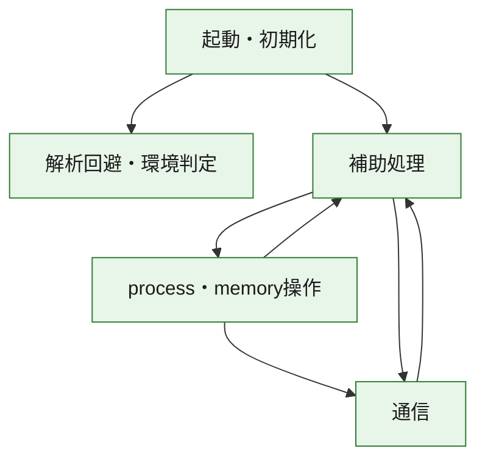
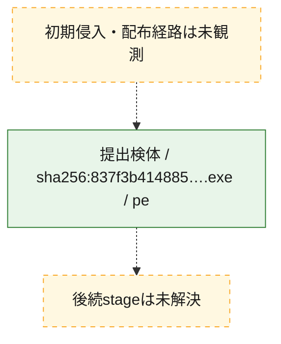
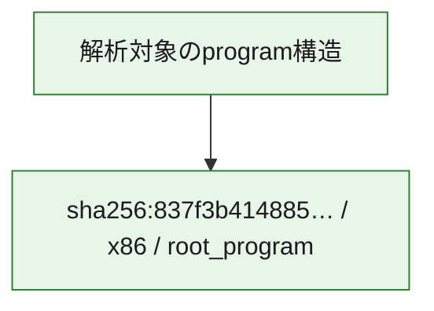

# 全体ロジック：837f3b41488599ff02ffc32a795c073a32143349088c97f786b910c0cbe46503

代表関数の静的証跡から、起動・初期化、解析回避・環境判定、process・memory操作、通信の処理群を確認しました。

## 読み方

- phaseの掲載順は解析上の整理順です。observed_call_edgesがない段階間の実行順を断定しません。
- 図の実線は静的に観測した関係、点線と黄色のノードは未観測・未解決の関係を示します。
- 図は静的な要約であり、動的実行を再現するものではありません。
- 詳細な関数解説とfingerprintは[STATIC-LOGIC.md](STATIC-LOGIC.md)を参照してください。

## 静的可視化

### 実行フロー

### 感染チェーン

### モジュール関係

## 処理段階

### 1. 起動・初期化

entry pointから初期化と後続処理への移行を確認します。
確度: `confirmed_static_function_evidence`

- `837f3b41488599ff02ffc32a795c073a32143349088c97f786b910c0cbe46503:ghidra:00402b07` — 初期化と主要処理への分岐を行う入口関数です。 状態: `succeeded`、選定理由: `call_graph_centrality:in=0,out=2`, `entry_point`, `meaningful_symbol_name`, `reviewed_call_centrality:2`, `role:entrypoint`, `small_program_complete_context`

### 2. 解析回避・環境判定

debugger、sandbox、仮想環境、時間差などの判定を確認します。
確度: `confirmed_static_function_evidence`

- `837f3b41488599ff02ffc32a795c073a32143349088c97f786b910c0cbe46503:ghidra:00402e88` — debugger、仮想環境、sandbox、または時間差の確認に関係する関数です。 状態: `succeeded`、選定理由: `call_graph_centrality:in=1,out=5`, `reviewed_call_centrality:11`, `reviewed_call_centrality:6`, `role:anti_analysis`, `small_program_complete_context`

### 3. process・memory操作

process、thread、module、memory操作と実行移行を確認します。
確度: `confirmed_static_function_evidence`

- `837f3b41488599ff02ffc32a795c073a32143349088c97f786b910c0cbe46503:ghidra:00402430` — process、thread、module、またはmemory操作に関係する関数です。 状態: `succeeded`、選定理由: `call_graph_centrality:in=0,out=17`, `large_function:instructions=155`, `reviewed_call_centrality:17`, `reviewed_call_centrality:26`, `role:process_or_memory_operation`, `small_program_complete_context`
- `837f3b41488599ff02ffc32a795c073a32143349088c97f786b910c0cbe46503:ghidra:00402690` — process、thread、module、またはmemory操作に関係する関数です。 状態: `succeeded`、選定理由: `call_graph_centrality:in=1,out=12`, `large_function:instructions=68`, `reviewed_call_centrality:14`, `reviewed_call_centrality:23`, `role:process_or_memory_operation`, `small_program_complete_context`

### 4. 通信

通信初期化、endpoint処理、送受信の役割を確認します。
確度: `confirmed_static_function_evidence`

- `837f3b41488599ff02ffc32a795c073a32143349088c97f786b910c0cbe46503:ghidra:004010d0` — 通信初期化、送受信、またはendpoint処理に関係する関数です。 状態: `succeeded`、選定理由: `call_graph_centrality:in=1,out=4`, `reviewed_call_centrality:5`, `reviewed_call_centrality:6`, `role:network_communication`, `small_program_complete_context`
- `837f3b41488599ff02ffc32a795c073a32143349088c97f786b910c0cbe46503:ghidra:00401150` — 通信初期化、送受信、またはendpoint処理に関係する関数です。 状態: `succeeded`、選定理由: `call_graph_centrality:in=1,out=2`, `reviewed_call_centrality:3`, `reviewed_call_centrality:5`, `role:network_communication`, `small_program_complete_context`
- `837f3b41488599ff02ffc32a795c073a32143349088c97f786b910c0cbe46503:ghidra:00401190` — 通信初期化、送受信、またはendpoint処理に関係する関数です。 状態: `succeeded`、選定理由: `call_graph_centrality:in=1,out=2`, `reviewed_call_centrality:4`, `role:network_communication`, `small_program_complete_context`
- `837f3b41488599ff02ffc32a795c073a32143349088c97f786b910c0cbe46503:ghidra:00401470` — 通信初期化、送受信、またはendpoint処理に関係する関数です。 状態: `succeeded`、選定理由: `call_graph_centrality:in=2,out=2`, `reviewed_call_centrality:4`, `reviewed_call_centrality:6`, `role:network_communication`, `small_program_complete_context`
- `837f3b41488599ff02ffc32a795c073a32143349088c97f786b910c0cbe46503:ghidra:00401710` — 通信初期化、送受信、またはendpoint処理に関係する関数です。 状態: `succeeded`、選定理由: `call_graph_centrality:in=1,out=4`, `reviewed_call_centrality:5`, `reviewed_call_centrality:8`, `role:network_communication`, `small_program_complete_context`
- `837f3b41488599ff02ffc32a795c073a32143349088c97f786b910c0cbe46503:ghidra:00401790` — 通信初期化、送受信、またはendpoint処理に関係する関数です。 状態: `succeeded`、選定理由: `call_graph_centrality:in=1,out=4`, `reviewed_call_centrality:6`, `role:network_communication`, `small_program_complete_context`
- `837f3b41488599ff02ffc32a795c073a32143349088c97f786b910c0cbe46503:ghidra:00401800` — 通信初期化、送受信、またはendpoint処理に関係する関数です。 状態: `succeeded`、選定理由: `call_graph_centrality:in=1,out=7`, `large_function:instructions=71`, `reviewed_call_centrality:13`, `reviewed_call_centrality:8`, `role:network_communication`, `small_program_complete_context`
- `837f3b41488599ff02ffc32a795c073a32143349088c97f786b910c0cbe46503:ghidra:00401900` — 通信初期化、送受信、またはendpoint処理に関係する関数です。 状態: `succeeded`、選定理由: `call_graph_centrality:in=1,out=8`, `large_function:instructions=86`, `reviewed_call_centrality:16`, `reviewed_call_centrality:9`, `role:network_communication`, `small_program_complete_context`
- `837f3b41488599ff02ffc32a795c073a32143349088c97f786b910c0cbe46503:ghidra:00401a10` — 通信初期化、送受信、またはendpoint処理に関係する関数です。 状態: `succeeded`、選定理由: `call_graph_centrality:in=1,out=20`, `large_function:instructions=595`, `reviewed_call_centrality:28`, `reviewed_call_centrality:29`, `role:network_communication`, `small_program_complete_context`

### 5. 補助処理

主要処理を支える一般内部関数またはlibrary処理を確認します。
確度: `confirmed_static_function_evidence`

- `837f3b41488599ff02ffc32a795c073a32143349088c97f786b910c0cbe46503:ghidra:00401000` — 検体内部の一般処理を実装する関数です。 状態: `succeeded`、選定理由: `call_graph_centrality:in=1,out=1`, `reviewed_call_centrality:2`, `small_program_complete_context`
- `837f3b41488599ff02ffc32a795c073a32143349088c97f786b910c0cbe46503:ghidra:00401030` — 検体内部の一般処理を実装する関数です。 状態: `succeeded`、選定理由: `call_graph_centrality:in=1,out=1`, `reviewed_call_centrality:2`, `small_program_complete_context`
- `837f3b41488599ff02ffc32a795c073a32143349088c97f786b910c0cbe46503:ghidra:004011f0` — 検体内部の一般処理を実装する関数です。 状態: `succeeded`、選定理由: `call_graph_centrality:in=1,out=1`, `reviewed_call_centrality:2`, `reviewed_call_centrality:3`, `small_program_complete_context`
- `837f3b41488599ff02ffc32a795c073a32143349088c97f786b910c0cbe46503:ghidra:00401260` — 検体内部の一般処理を実装する関数です。 状態: `succeeded`、選定理由: `call_graph_centrality:in=1,out=1`, `large_function:instructions=65`, `reviewed_call_centrality:3`, `small_program_complete_context`
- `837f3b41488599ff02ffc32a795c073a32143349088c97f786b910c0cbe46503:ghidra:00401350` — 検体内部の一般処理を実装する関数です。 状態: `succeeded`、選定理由: `call_graph_centrality:in=1,out=4`, `reviewed_call_centrality:5`, `reviewed_call_centrality:6`, `small_program_complete_context`
- `837f3b41488599ff02ffc32a795c073a32143349088c97f786b910c0cbe46503:ghidra:004013c0` — 検体内部の一般処理を実装する関数です。 状態: `succeeded`、選定理由: `call_graph_centrality:in=1,out=1`, `reviewed_call_centrality:2`, `small_program_complete_context`
- `837f3b41488599ff02ffc32a795c073a32143349088c97f786b910c0cbe46503:ghidra:00401430` — 検体内部の一般処理を実装する関数です。 状態: `succeeded`、選定理由: `call_graph_centrality:in=2,out=0`, `reviewed_call_centrality:2`, `small_program_complete_context`
- `837f3b41488599ff02ffc32a795c073a32143349088c97f786b910c0cbe46503:ghidra:004014c0` — 検体内部の一般処理を実装する関数です。 状態: `succeeded`、選定理由: `call_graph_centrality:in=1,out=5`, `large_function:instructions=156`, `reviewed_call_centrality:11`, `reviewed_call_centrality:6`, `small_program_complete_context`
- `837f3b41488599ff02ffc32a795c073a32143349088c97f786b910c0cbe46503:ghidra:004018e0` — 検体内部の一般処理を実装する関数です。 状態: `succeeded`、選定理由: `call_graph_centrality:in=2,out=1`, `reviewed_call_centrality:3`, `small_program_complete_context`
- `837f3b41488599ff02ffc32a795c073a32143349088c97f786b910c0cbe46503:ghidra:004022e0` — 検体内部の一般処理を実装する関数です。 状態: `succeeded`、選定理由: `call_graph_centrality:in=1,out=1`, `reviewed_call_centrality:2`, `small_program_complete_context`
- `837f3b41488599ff02ffc32a795c073a32143349088c97f786b910c0cbe46503:ghidra:00402300` — 検体内部の一般処理を実装する関数です。 状態: `succeeded`、選定理由: `call_graph_centrality:in=0,out=12`, `large_function:instructions=77`, `reviewed_call_centrality:12`, `reviewed_call_centrality:14`, `small_program_complete_context`
- `837f3b41488599ff02ffc32a795c073a32143349088c97f786b910c0cbe46503:ghidra:00402847` — 検体内部の一般処理を実装する関数です。 状態: `succeeded`、選定理由: `call_graph_centrality:in=1,out=14`, `large_function:instructions=136`, `reviewed_call_centrality:15`, `reviewed_call_centrality:22`, `small_program_complete_context`
- `837f3b41488599ff02ffc32a795c073a32143349088c97f786b910c0cbe46503:ghidra:00402c80` — 検体内部の一般処理を実装する関数です。 状態: `succeeded`、選定理由: `call_graph_centrality:in=1,out=0`, `reviewed_call_centrality:1`, `small_program_complete_context`
- `837f3b41488599ff02ffc32a795c073a32143349088c97f786b910c0cbe46503:ghidra:00402cc0` — 検体内部の一般処理を実装する関数です。 状態: `succeeded`、選定理由: `call_graph_centrality:in=1,out=0`, `reviewed_call_centrality:1`, `small_program_complete_context`
- `837f3b41488599ff02ffc32a795c073a32143349088c97f786b910c0cbe46503:ghidra:00402d10` — 検体内部の一般処理を実装する関数です。 状態: `succeeded`、選定理由: `call_graph_centrality:in=1,out=2`, `reviewed_call_centrality:3`, `reviewed_call_centrality:4`, `small_program_complete_context`
- `837f3b41488599ff02ffc32a795c073a32143349088c97f786b910c0cbe46503:ghidra:00402ddc` — 検体内部の一般処理を実装する関数です。 状態: `succeeded`、選定理由: `call_graph_centrality:in=1,out=0`, `reviewed_call_centrality:1`, `small_program_complete_context`
- `837f3b41488599ff02ffc32a795c073a32143349088c97f786b910c0cbe46503:ghidra:00402e21` — compiler生成処理または汎用library処理とみられる関数です。 状態: `succeeded`、選定理由: `call_graph_centrality:in=1,out=0`, `meaningful_symbol_name`, `reviewed_call_centrality:1`, `small_program_complete_context`
- `837f3b41488599ff02ffc32a795c073a32143349088c97f786b910c0cbe46503:ghidra:00402e35` — 検体内部の一般処理を実装する関数です。 状態: `succeeded`、選定理由: `call_graph_centrality:in=0,out=1`, `reviewed_call_centrality:1`, `small_program_complete_context`

## 観測したcall関係

- `837f3b41488599ff02ffc32a795c073a32143349088c97f786b910c0cbe46503:ghidra:004010d0` → `837f3b41488599ff02ffc32a795c073a32143349088c97f786b910c0cbe46503:ghidra:00401470` （`communication` → `communication`）
- `837f3b41488599ff02ffc32a795c073a32143349088c97f786b910c0cbe46503:ghidra:00401190` → `837f3b41488599ff02ffc32a795c073a32143349088c97f786b910c0cbe46503:ghidra:00401260` （`communication` → `support`）
- `837f3b41488599ff02ffc32a795c073a32143349088c97f786b910c0cbe46503:ghidra:00401710` → `837f3b41488599ff02ffc32a795c073a32143349088c97f786b910c0cbe46503:ghidra:00401470` （`communication` → `communication`）
- `837f3b41488599ff02ffc32a795c073a32143349088c97f786b910c0cbe46503:ghidra:00401790` → `837f3b41488599ff02ffc32a795c073a32143349088c97f786b910c0cbe46503:ghidra:00401710` （`communication` → `communication`）
- `837f3b41488599ff02ffc32a795c073a32143349088c97f786b910c0cbe46503:ghidra:00401800` → `837f3b41488599ff02ffc32a795c073a32143349088c97f786b910c0cbe46503:ghidra:00401430` （`communication` → `support`）
- `837f3b41488599ff02ffc32a795c073a32143349088c97f786b910c0cbe46503:ghidra:00401800` → `837f3b41488599ff02ffc32a795c073a32143349088c97f786b910c0cbe46503:ghidra:004018e0` （`communication` → `support`）
- `837f3b41488599ff02ffc32a795c073a32143349088c97f786b910c0cbe46503:ghidra:00401a10` → `837f3b41488599ff02ffc32a795c073a32143349088c97f786b910c0cbe46503:ghidra:004010d0` （`communication` → `communication`）
- `837f3b41488599ff02ffc32a795c073a32143349088c97f786b910c0cbe46503:ghidra:00401a10` → `837f3b41488599ff02ffc32a795c073a32143349088c97f786b910c0cbe46503:ghidra:00401150` （`communication` → `communication`）
- `837f3b41488599ff02ffc32a795c073a32143349088c97f786b910c0cbe46503:ghidra:00401a10` → `837f3b41488599ff02ffc32a795c073a32143349088c97f786b910c0cbe46503:ghidra:00401190` （`communication` → `communication`）
- `837f3b41488599ff02ffc32a795c073a32143349088c97f786b910c0cbe46503:ghidra:00401a10` → `837f3b41488599ff02ffc32a795c073a32143349088c97f786b910c0cbe46503:ghidra:004011f0` （`communication` → `support`）
- `837f3b41488599ff02ffc32a795c073a32143349088c97f786b910c0cbe46503:ghidra:00401a10` → `837f3b41488599ff02ffc32a795c073a32143349088c97f786b910c0cbe46503:ghidra:00401350` （`communication` → `support`）
- `837f3b41488599ff02ffc32a795c073a32143349088c97f786b910c0cbe46503:ghidra:00401a10` → `837f3b41488599ff02ffc32a795c073a32143349088c97f786b910c0cbe46503:ghidra:004013c0` （`communication` → `support`）
- `837f3b41488599ff02ffc32a795c073a32143349088c97f786b910c0cbe46503:ghidra:00401a10` → `837f3b41488599ff02ffc32a795c073a32143349088c97f786b910c0cbe46503:ghidra:004014c0` （`communication` → `support`）
- `837f3b41488599ff02ffc32a795c073a32143349088c97f786b910c0cbe46503:ghidra:00401a10` → `837f3b41488599ff02ffc32a795c073a32143349088c97f786b910c0cbe46503:ghidra:004022e0` （`communication` → `support`）
- `837f3b41488599ff02ffc32a795c073a32143349088c97f786b910c0cbe46503:ghidra:00402300` → `837f3b41488599ff02ffc32a795c073a32143349088c97f786b910c0cbe46503:ghidra:00401430` （`support` → `support`）
- `837f3b41488599ff02ffc32a795c073a32143349088c97f786b910c0cbe46503:ghidra:00402300` → `837f3b41488599ff02ffc32a795c073a32143349088c97f786b910c0cbe46503:ghidra:004018e0` （`support` → `support`）
- `837f3b41488599ff02ffc32a795c073a32143349088c97f786b910c0cbe46503:ghidra:00402300` → `837f3b41488599ff02ffc32a795c073a32143349088c97f786b910c0cbe46503:ghidra:00401a10` （`support` → `communication`）
- `837f3b41488599ff02ffc32a795c073a32143349088c97f786b910c0cbe46503:ghidra:00402430` → `837f3b41488599ff02ffc32a795c073a32143349088c97f786b910c0cbe46503:ghidra:00401000` （`execution` → `support`）
- `837f3b41488599ff02ffc32a795c073a32143349088c97f786b910c0cbe46503:ghidra:00402430` → `837f3b41488599ff02ffc32a795c073a32143349088c97f786b910c0cbe46503:ghidra:00401800` （`execution` → `communication`）
- `837f3b41488599ff02ffc32a795c073a32143349088c97f786b910c0cbe46503:ghidra:00402430` → `837f3b41488599ff02ffc32a795c073a32143349088c97f786b910c0cbe46503:ghidra:00401900` （`execution` → `communication`）
- `837f3b41488599ff02ffc32a795c073a32143349088c97f786b910c0cbe46503:ghidra:00402690` → `837f3b41488599ff02ffc32a795c073a32143349088c97f786b910c0cbe46503:ghidra:00401030` （`execution` → `support`）
- `837f3b41488599ff02ffc32a795c073a32143349088c97f786b910c0cbe46503:ghidra:00402690` → `837f3b41488599ff02ffc32a795c073a32143349088c97f786b910c0cbe46503:ghidra:00401790` （`execution` → `communication`）
- `837f3b41488599ff02ffc32a795c073a32143349088c97f786b910c0cbe46503:ghidra:00402847` → `837f3b41488599ff02ffc32a795c073a32143349088c97f786b910c0cbe46503:ghidra:00402690` （`support` → `execution`）
- `837f3b41488599ff02ffc32a795c073a32143349088c97f786b910c0cbe46503:ghidra:00402847` → `837f3b41488599ff02ffc32a795c073a32143349088c97f786b910c0cbe46503:ghidra:00402d10` （`support` → `support`）
- `837f3b41488599ff02ffc32a795c073a32143349088c97f786b910c0cbe46503:ghidra:00402847` → `837f3b41488599ff02ffc32a795c073a32143349088c97f786b910c0cbe46503:ghidra:00402ddc` （`support` → `support`）
- `837f3b41488599ff02ffc32a795c073a32143349088c97f786b910c0cbe46503:ghidra:00402847` → `837f3b41488599ff02ffc32a795c073a32143349088c97f786b910c0cbe46503:ghidra:00402e21` （`support` → `support`）
- `837f3b41488599ff02ffc32a795c073a32143349088c97f786b910c0cbe46503:ghidra:00402b07` → `837f3b41488599ff02ffc32a795c073a32143349088c97f786b910c0cbe46503:ghidra:00402847` （`startup` → `support`）
- `837f3b41488599ff02ffc32a795c073a32143349088c97f786b910c0cbe46503:ghidra:00402b07` → `837f3b41488599ff02ffc32a795c073a32143349088c97f786b910c0cbe46503:ghidra:00402e88` （`startup` → `evasion`）
- `837f3b41488599ff02ffc32a795c073a32143349088c97f786b910c0cbe46503:ghidra:00402d10` → `837f3b41488599ff02ffc32a795c073a32143349088c97f786b910c0cbe46503:ghidra:00402c80` （`support` → `support`）
- `837f3b41488599ff02ffc32a795c073a32143349088c97f786b910c0cbe46503:ghidra:00402d10` → `837f3b41488599ff02ffc32a795c073a32143349088c97f786b910c0cbe46503:ghidra:00402cc0` （`support` → `support`）
- `ghidra-function:06916a8db295a648090786c3` → `ghidra-function:1b88c458abd98094eaee86b8` （`unclassified` → `unclassified`）
- `ghidra-function:06916a8db295a648090786c3` → `ghidra-function:4534a99b64556bcd40e60c7c` （`unclassified` → `unclassified`）
- `ghidra-function:06916a8db295a648090786c3` → `ghidra-function:5bb9f2b781415f726fb0f11e` （`unclassified` → `unclassified`）
- `ghidra-function:06916a8db295a648090786c3` → `ghidra-function:5d607e05f2d615568c13ca55` （`unclassified` → `unclassified`）
- `ghidra-function:06916a8db295a648090786c3` → `ghidra-function:6160b5f216ee7469098091dd` （`unclassified` → `unclassified`）
- `ghidra-function:06916a8db295a648090786c3` → `ghidra-function:aca448fbb5f4e69138cc26e1` （`unclassified` → `unclassified`）
- `ghidra-function:06916a8db295a648090786c3` → `ghidra-function:ffd376a33166bfc6b8c29e07` （`unclassified` → `unclassified`）
- `ghidra-function:12a524bbe53b9c4882089556` → `ghidra-function:7099ef90c9ed337c4621ee38` （`unclassified` → `unclassified`）
- `ghidra-function:19ab230607f3ed1c8a25f1c5` → `ghidra-function:7099ef90c9ed337c4621ee38` （`unclassified` → `unclassified`）
- `ghidra-function:23db49736749340dc6650252` → `ghidra-external:0aa29372f9b3f949a9b40154` （`unclassified` → `unclassified`）
- `ghidra-function:23db49736749340dc6650252` → `ghidra-external:60867a13b8821d72be2cf131` （`unclassified` → `unclassified`）
- `ghidra-function:23db49736749340dc6650252` → `ghidra-external:76dd1effa53cc44eb4ae0932` （`unclassified` → `unclassified`）
- `ghidra-function:23db49736749340dc6650252` → `ghidra-external:81d3ec803bd0bac61a65d015` （`unclassified` → `unclassified`）
- `ghidra-function:23db49736749340dc6650252` → `ghidra-external:a102d39c1444564608334411` （`unclassified` → `unclassified`）
- `ghidra-function:23db49736749340dc6650252` → `ghidra-external:bc6b0465f7b3bedd676b2efd` （`unclassified` → `unclassified`）
- `ghidra-function:23db49736749340dc6650252` → `ghidra-external:ea1724301bf8be61ac68bf2a` （`unclassified` → `unclassified`）
- `ghidra-function:23db49736749340dc6650252` → `ghidra-function:19ab230607f3ed1c8a25f1c5` （`unclassified` → `unclassified`）
- `ghidra-function:23db49736749340dc6650252` → `ghidra-function:1ad39ba421d2d6eaf37f0647` （`unclassified` → `unclassified`）
- `ghidra-function:23db49736749340dc6650252` → `ghidra-function:1b88c458abd98094eaee86b8` （`unclassified` → `unclassified`）
- `ghidra-function:23db49736749340dc6650252` → `ghidra-function:1bb865e35a8248bee280c3a0` （`unclassified` → `unclassified`）
- `ghidra-function:23db49736749340dc6650252` → `ghidra-function:2aad135e80b61a34b07dcba7` （`unclassified` → `unclassified`）
- `ghidra-function:23db49736749340dc6650252` → `ghidra-function:3b359b012a87328f145c73f2` （`unclassified` → `unclassified`）
- `ghidra-function:23db49736749340dc6650252` → `ghidra-function:4318567057b507f2a34e6b0a` （`unclassified` → `unclassified`）
- `ghidra-function:23db49736749340dc6650252` → `ghidra-function:49be744031e433fce2c58e96` （`unclassified` → `unclassified`）
- `ghidra-function:23db49736749340dc6650252` → `ghidra-function:57b8ad314df8032dae28a648` （`unclassified` → `unclassified`）
- `ghidra-function:23db49736749340dc6650252` → `ghidra-function:701e08bed245ddee792eff3b` （`unclassified` → `unclassified`）
- `ghidra-function:23db49736749340dc6650252` → `ghidra-function:7099ef90c9ed337c4621ee38` （`unclassified` → `unclassified`）
- `ghidra-function:23db49736749340dc6650252` → `ghidra-function:7d893e3df6fc02ca116d94b3` （`unclassified` → `unclassified`）
- `ghidra-function:23db49736749340dc6650252` → `ghidra-function:873e994091edc9ae1a3d8c9d` （`unclassified` → `unclassified`）
- `ghidra-function:23db49736749340dc6650252` → `ghidra-function:ae89e794b696e16024087697` （`unclassified` → `unclassified`）
- `ghidra-function:23db49736749340dc6650252` → `ghidra-function:b3930bd1374aa564873d4d20` （`unclassified` → `unclassified`）
- `ghidra-function:23db49736749340dc6650252` → `ghidra-function:b59c03ae5ae36a7b2e4c45b8` （`unclassified` → `unclassified`）
- `ghidra-function:23db49736749340dc6650252` → `ghidra-function:b9eb5b8c29fa50669aa537ad` （`unclassified` → `unclassified`）
- `ghidra-function:23db49736749340dc6650252` → `ghidra-function:be77421c4347b05b93720ca1` （`unclassified` → `unclassified`）
- `ghidra-function:23db49736749340dc6650252` → `ghidra-function:d60fc357db1c85665bc338ed` （`unclassified` → `unclassified`）
- `ghidra-function:23db49736749340dc6650252` → `ghidra-function:ffef20d10fc7c938f58755d3` （`unclassified` → `unclassified`）
- `ghidra-function:335e9d694132cb4a24a56bb5` → `ghidra-function:26eade805fc59d9443eb8453` （`unclassified` → `unclassified`）
- `ghidra-function:335e9d694132cb4a24a56bb5` → `ghidra-function:39d13deb8e7e5cdca18ffda4` （`unclassified` → `unclassified`）
- `ghidra-function:335e9d694132cb4a24a56bb5` → `ghidra-function:4534a99b64556bcd40e60c7c` （`unclassified` → `unclassified`）
- `ghidra-function:335e9d694132cb4a24a56bb5` → `ghidra-function:49be744031e433fce2c58e96` （`unclassified` → `unclassified`）
- `ghidra-function:335e9d694132cb4a24a56bb5` → `ghidra-function:6cf98c45c3ed6690e33c0db5` （`unclassified` → `unclassified`）
- `ghidra-function:335e9d694132cb4a24a56bb5` → `ghidra-function:8ba9b70b3a3096214c20f70d` （`unclassified` → `unclassified`）
- `ghidra-function:335e9d694132cb4a24a56bb5` → `ghidra-function:97ec43f2a2b1bbbef403f64b` （`unclassified` → `unclassified`）
- `ghidra-function:335e9d694132cb4a24a56bb5` → `ghidra-function:aca448fbb5f4e69138cc26e1` （`unclassified` → `unclassified`）
- `ghidra-function:4318567057b507f2a34e6b0a` → `ghidra-external:bc6b0465f7b3bedd676b2efd` （`unclassified` → `unclassified`）
- `ghidra-function:4318567057b507f2a34e6b0a` → `ghidra-function:925f0e073644ed730ca74e3f` （`unclassified` → `unclassified`）
- `ghidra-function:4318567057b507f2a34e6b0a` → `ghidra-function:e9cab450a7f28f34b22b263e` （`unclassified` → `unclassified`）
- `ghidra-function:4a784c98f9e29735350467d8` → `ghidra-function:824f18260b757ce80d60db8d` （`unclassified` → `unclassified`）
- `ghidra-function:4a784c98f9e29735350467d8` → `ghidra-function:9c74ca7194bf34e1592506f2` （`unclassified` → `unclassified`）
- `ghidra-function:4a784c98f9e29735350467d8` → `ghidra-function:aada11e7c0535e5d2e51ca04` （`unclassified` → `unclassified`）
- `ghidra-function:4a784c98f9e29735350467d8` → `ghidra-function:bf7f33a85243476202278c61` （`unclassified` → `unclassified`）
- `ghidra-function:4a784c98f9e29735350467d8` → `ghidra-function:efcd439a8fcd6e8805f0b674` （`unclassified` → `unclassified`）
- `ghidra-function:553a6dd03cf30be5c8b73e44` → `ghidra-function:7d893e3df6fc02ca116d94b3` （`unclassified` → `unclassified`）
- `ghidra-function:553a6dd03cf30be5c8b73e44` → `ghidra-function:bf01736b8a3878a89da8d9e3` （`unclassified` → `unclassified`）
- `ghidra-function:553a6dd03cf30be5c8b73e44` → `ghidra-function:e13cd8df385fce8bc0850c6e` （`unclassified` → `unclassified`）
- `ghidra-function:553a6dd03cf30be5c8b73e44` → `ghidra-function:ffef20d10fc7c938f58755d3` （`unclassified` → `unclassified`）
- `ghidra-function:57b8ad314df8032dae28a648` → `ghidra-function:27d393f5957d29fb493abd29` （`unclassified` → `unclassified`）
- `ghidra-function:57b8ad314df8032dae28a648` → `ghidra-function:3fc9176c8be55f98fe64db61` （`unclassified` → `unclassified`）
- `ghidra-function:57b8ad314df8032dae28a648` → `ghidra-function:7099ef90c9ed337c4621ee38` （`unclassified` → `unclassified`）
- `ghidra-function:57b8ad314df8032dae28a648` → `ghidra-function:824f18260b757ce80d60db8d` （`unclassified` → `unclassified`）
- `ghidra-function:6160b5f216ee7469098091dd` → `ghidra-function:731e429e48f0bfbf982a5618` （`unclassified` → `unclassified`）
- `ghidra-function:6bedad961e659ae80fc6e64b` → `ghidra-external:7baf8ef8992c78c9ceecf867` （`unclassified` → `unclassified`）
- `ghidra-function:6bedad961e659ae80fc6e64b` → `ghidra-function:19ce8b9c25042a31ea197b90` （`unclassified` → `unclassified`）
- `ghidra-function:6bedad961e659ae80fc6e64b` → `ghidra-function:1ad39ba421d2d6eaf37f0647` （`unclassified` → `unclassified`）
- `ghidra-function:6bedad961e659ae80fc6e64b` → `ghidra-function:1b88c458abd98094eaee86b8` （`unclassified` → `unclassified`）
- `ghidra-function:6bedad961e659ae80fc6e64b` → `ghidra-function:24cbb3d0f5def5d5c7557744` （`unclassified` → `unclassified`）
- `ghidra-function:6bedad961e659ae80fc6e64b` → `ghidra-function:3d141a41f969eb05bc3e0562` （`unclassified` → `unclassified`）
- `ghidra-function:6bedad961e659ae80fc6e64b` → `ghidra-function:6acea33e57a555d87f695906` （`unclassified` → `unclassified`）
- `ghidra-function:6bedad961e659ae80fc6e64b` → `ghidra-function:753937fb2bd7a4117aee764a` （`unclassified` → `unclassified`）
- `ghidra-function:6bedad961e659ae80fc6e64b` → `ghidra-function:78f3b27f2d00bd131278f159` （`unclassified` → `unclassified`）
- `ghidra-function:6bedad961e659ae80fc6e64b` → `ghidra-function:7aa60a349234d44923b2c209` （`unclassified` → `unclassified`）
- `ghidra-function:6bedad961e659ae80fc6e64b` → `ghidra-function:ace9a747d82548dd32b86557` （`unclassified` → `unclassified`）
- `ghidra-function:6bedad961e659ae80fc6e64b` → `ghidra-function:cb302af769c461b34163d984` （`unclassified` → `unclassified`）
- `ghidra-function:6bedad961e659ae80fc6e64b` → `ghidra-function:ec469c5b6ee8a2e0e42ae110` （`unclassified` → `unclassified`）
- `ghidra-function:701e08bed245ddee792eff3b` → `ghidra-function:60091a85e2486c35d7c8797f` （`unclassified` → `unclassified`）
- `ghidra-function:701e08bed245ddee792eff3b` → `ghidra-function:6c400d42a54e4256391d19c8` （`unclassified` → `unclassified`）
- `ghidra-function:701e08bed245ddee792eff3b` → `ghidra-function:bf01736b8a3878a89da8d9e3` （`unclassified` → `unclassified`）
- `ghidra-function:701e08bed245ddee792eff3b` → `ghidra-function:e13cd8df385fce8bc0850c6e` （`unclassified` → `unclassified`）
- `ghidra-function:753937fb2bd7a4117aee764a` → `ghidra-function:f14317e9c815dc9e657d3a27` （`unclassified` → `unclassified`）
- `ghidra-function:78f3b27f2d00bd131278f159` → `ghidra-external:bc6b0465f7b3bedd676b2efd` （`unclassified` → `unclassified`）
- `ghidra-function:78f3b27f2d00bd131278f159` → `ghidra-function:2aad135e80b61a34b07dcba7` （`unclassified` → `unclassified`）
- `ghidra-function:78f3b27f2d00bd131278f159` → `ghidra-function:553a6dd03cf30be5c8b73e44` （`unclassified` → `unclassified`）
- `ghidra-function:78f3b27f2d00bd131278f159` → `ghidra-function:60091a85e2486c35d7c8797f` （`unclassified` → `unclassified`）
- `ghidra-function:78f3b27f2d00bd131278f159` → `ghidra-function:6c400d42a54e4256391d19c8` （`unclassified` → `unclassified`）
- `ghidra-function:82cb07bac617a0ef05c097cc` → `ghidra-function:06916a8db295a648090786c3` （`unclassified` → `unclassified`）
- `ghidra-function:82cb07bac617a0ef05c097cc` → `ghidra-function:1003c17100492667db6d3564` （`unclassified` → `unclassified`）
- `ghidra-function:82cb07bac617a0ef05c097cc` → `ghidra-function:12a524bbe53b9c4882089556` （`unclassified` → `unclassified`）
- `ghidra-function:82cb07bac617a0ef05c097cc` → `ghidra-function:14d1f375eb3fb8c2a62919b8` （`unclassified` → `unclassified`）
- `ghidra-function:82cb07bac617a0ef05c097cc` → `ghidra-function:1ad39ba421d2d6eaf37f0647` （`unclassified` → `unclassified`）
- `ghidra-function:82cb07bac617a0ef05c097cc` → `ghidra-function:335e9d694132cb4a24a56bb5` （`unclassified` → `unclassified`）
- `ghidra-function:82cb07bac617a0ef05c097cc` → `ghidra-function:3d141a41f969eb05bc3e0562` （`unclassified` → `unclassified`）
- `ghidra-function:82cb07bac617a0ef05c097cc` → `ghidra-function:3fc9176c8be55f98fe64db61` （`unclassified` → `unclassified`）
- `ghidra-function:82cb07bac617a0ef05c097cc` → `ghidra-function:7099ef90c9ed337c4621ee38` （`unclassified` → `unclassified`）
- `ghidra-function:82cb07bac617a0ef05c097cc` → `ghidra-function:7aa60a349234d44923b2c209` （`unclassified` → `unclassified`）
- `ghidra-function:82cb07bac617a0ef05c097cc` → `ghidra-function:824f18260b757ce80d60db8d` （`unclassified` → `unclassified`）
- `ghidra-function:82cb07bac617a0ef05c097cc` → `ghidra-function:b162170bc9847e31b7055c04` （`unclassified` → `unclassified`）
- `ghidra-function:82cb07bac617a0ef05c097cc` → `ghidra-function:be77421c4347b05b93720ca1` （`unclassified` → `unclassified`）
- `ghidra-function:82cb07bac617a0ef05c097cc` → `ghidra-function:c9134b858874a9865365cd8c` （`unclassified` → `unclassified`）
- `ghidra-function:82cb07bac617a0ef05c097cc` → `ghidra-function:cb302af769c461b34163d984` （`unclassified` → `unclassified`）
- `ghidra-function:82cb07bac617a0ef05c097cc` → `ghidra-function:dbd2849fda7b4dd9162062cf` （`unclassified` → `unclassified`）
- `ghidra-function:82cb07bac617a0ef05c097cc` → `ghidra-function:ec469c5b6ee8a2e0e42ae110` （`unclassified` → `unclassified`）
- `ghidra-function:873e994091edc9ae1a3d8c9d` → `ghidra-function:1b88c458abd98094eaee86b8` （`unclassified` → `unclassified`）
- `ghidra-function:873e994091edc9ae1a3d8c9d` → `ghidra-function:72debc8f3a3d4356e58b3344` （`unclassified` → `unclassified`）
- `ghidra-function:873e994091edc9ae1a3d8c9d` → `ghidra-function:7f7a3acc6ab0a73c2d16d0b0` （`unclassified` → `unclassified`）
- `ghidra-function:873e994091edc9ae1a3d8c9d` → `ghidra-function:88819c8256009cb980379a87` （`unclassified` → `unclassified`）
- `ghidra-function:873e994091edc9ae1a3d8c9d` → `ghidra-function:9b3dc7afdc64421891d77917` （`unclassified` → `unclassified`）
- `ghidra-function:925f0e073644ed730ca74e3f` → `ghidra-external:7baf8ef8992c78c9ceecf867` （`unclassified` → `unclassified`）
- `ghidra-function:925f0e073644ed730ca74e3f` → `ghidra-function:af5aa55dc417831e7f85d515` （`unclassified` → `unclassified`）
- `ghidra-function:a33e37430bfda6324167144d` → `ghidra-function:1ad39ba421d2d6eaf37f0647` （`unclassified` → `unclassified`）
- `ghidra-function:a33e37430bfda6324167144d` → `ghidra-function:1b3eaf93b9eaf265e2874bce` （`unclassified` → `unclassified`）
- `ghidra-function:a33e37430bfda6324167144d` → `ghidra-function:1bf0fa07be21eaf804539552` （`unclassified` → `unclassified`）
- `ghidra-function:a33e37430bfda6324167144d` → `ghidra-function:34818095372dab0c36f79ac9` （`unclassified` → `unclassified`）
- `ghidra-function:a33e37430bfda6324167144d` → `ghidra-function:6bedad961e659ae80fc6e64b` （`unclassified` → `unclassified`）
- `ghidra-function:a33e37430bfda6324167144d` → `ghidra-function:710ca317347a90205887d3a4` （`unclassified` → `unclassified`）
- `ghidra-function:a33e37430bfda6324167144d` → `ghidra-function:7ee7be47facf8e5089490846` （`unclassified` → `unclassified`）
- `ghidra-function:a33e37430bfda6324167144d` → `ghidra-function:80ff4d05654e3e669b46a22f` （`unclassified` → `unclassified`）
- `ghidra-function:a33e37430bfda6324167144d` → `ghidra-function:847ed95cd99f4dc309f112d0` （`unclassified` → `unclassified`）
- `ghidra-function:a33e37430bfda6324167144d` → `ghidra-function:9bf338b87cce411b76d7aadf` （`unclassified` → `unclassified`）
- `ghidra-function:a33e37430bfda6324167144d` → `ghidra-function:a2a736063dc5b7eafdec8f2a` （`unclassified` → `unclassified`）
- `ghidra-function:a33e37430bfda6324167144d` → `ghidra-function:a929d3000f0f5d2530e1b379` （`unclassified` → `unclassified`）
- `ghidra-function:a33e37430bfda6324167144d` → `ghidra-function:b02352b212ab3251ce88b351` （`unclassified` → `unclassified`）
- `ghidra-function:a33e37430bfda6324167144d` → `ghidra-function:ed18016379a4b1ced0920ebf` （`unclassified` → `unclassified`）
- `ghidra-function:a833fc92f5aa9127ee99e779` → `ghidra-function:23db49736749340dc6650252` （`unclassified` → `unclassified`）
- `ghidra-function:a833fc92f5aa9127ee99e779` → `ghidra-function:3fc9176c8be55f98fe64db61` （`unclassified` → `unclassified`）
- `ghidra-function:a833fc92f5aa9127ee99e779` → `ghidra-function:5bb9f2b781415f726fb0f11e` （`unclassified` → `unclassified`）
- `ghidra-function:a833fc92f5aa9127ee99e779` → `ghidra-function:5d88f3f22729af85c79e4973` （`unclassified` → `unclassified`）
- `ghidra-function:a833fc92f5aa9127ee99e779` → `ghidra-function:6160b5f216ee7469098091dd` （`unclassified` → `unclassified`）
- `ghidra-function:a833fc92f5aa9127ee99e779` → `ghidra-function:7099ef90c9ed337c4621ee38` （`unclassified` → `unclassified`）
- `ghidra-function:a833fc92f5aa9127ee99e779` → `ghidra-function:824f18260b757ce80d60db8d` （`unclassified` → `unclassified`）
- `ghidra-function:a833fc92f5aa9127ee99e779` → `ghidra-function:8bbd6c5b8cfd6a9da0e381a6` （`unclassified` → `unclassified`）
- `ghidra-function:a833fc92f5aa9127ee99e779` → `ghidra-function:a4a3231e3a1d395d00d26df0` （`unclassified` → `unclassified`）
- `ghidra-function:a833fc92f5aa9127ee99e779` → `ghidra-function:be77421c4347b05b93720ca1` （`unclassified` → `unclassified`）
- `ghidra-function:a833fc92f5aa9127ee99e779` → `ghidra-function:dbd2849fda7b4dd9162062cf` （`unclassified` → `unclassified`）
- `ghidra-function:a833fc92f5aa9127ee99e779` → `ghidra-function:ed3c1a6abef1bfac7634fbf2` （`unclassified` → `unclassified`）
- `ghidra-function:b02352b212ab3251ce88b351` → `ghidra-external:bc6b0465f7b3bedd676b2efd` （`unclassified` → `unclassified`）
- `ghidra-function:b02352b212ab3251ce88b351` → `ghidra-function:11e86163fecc343a4d08f02b` （`unclassified` → `unclassified`）
- `ghidra-function:b02352b212ab3251ce88b351` → `ghidra-function:49c3419af611f628e70221e0` （`unclassified` → `unclassified`）
- `ghidra-function:b21f271551d8ce8fba061bf2` → `ghidra-function:4a784c98f9e29735350467d8` （`unclassified` → `unclassified`）
- `ghidra-function:b21f271551d8ce8fba061bf2` → `ghidra-function:a33e37430bfda6324167144d` （`unclassified` → `unclassified`）
- `ghidra-function:b3930bd1374aa564873d4d20` → `ghidra-function:f691a454c8ace0785c700f98` （`unclassified` → `unclassified`）
- `ghidra-function:b59c03ae5ae36a7b2e4c45b8` → `ghidra-function:ee8e09d23090fef38691e8fb` （`unclassified` → `unclassified`）
- `ghidra-function:b9eb5b8c29fa50669aa537ad` → `ghidra-function:32ff7be0e7fef116cb6ee29b` （`unclassified` → `unclassified`）
- `ghidra-function:b9eb5b8c29fa50669aa537ad` → `ghidra-function:3b770d64ac626c339c9785dc` （`unclassified` → `unclassified`）
- `ghidra-function:debdc5a5a3c3e4ccd4b8b8ea` → `ghidra-function:93bb7a57fb4208269dd11427` （`unclassified` → `unclassified`）
- `ghidra-function:e13cd8df385fce8bc0850c6e` → `ghidra-function:82cbcf095cd47d305db6051f` （`unclassified` → `unclassified`）
- `ghidra-function:e13cd8df385fce8bc0850c6e` → `ghidra-function:f10459170c2f26ee74230833` （`unclassified` → `unclassified`）

## 解析範囲と制約

- 選定外関数は全体inventoryへ残しますが、関数本体の個別解説対象にはしていません。
- indirect call、難読化、packer、VM、壊れたcontrol flowによりcall関係が欠落する場合があります。
- 文書は静的解析に基づき、検体実行や外部通信による動的確認は行っていません。
