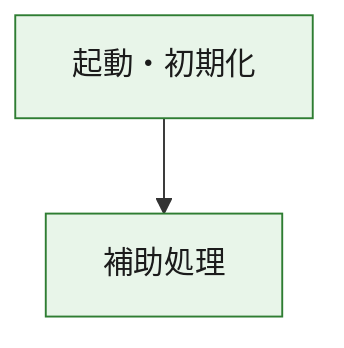
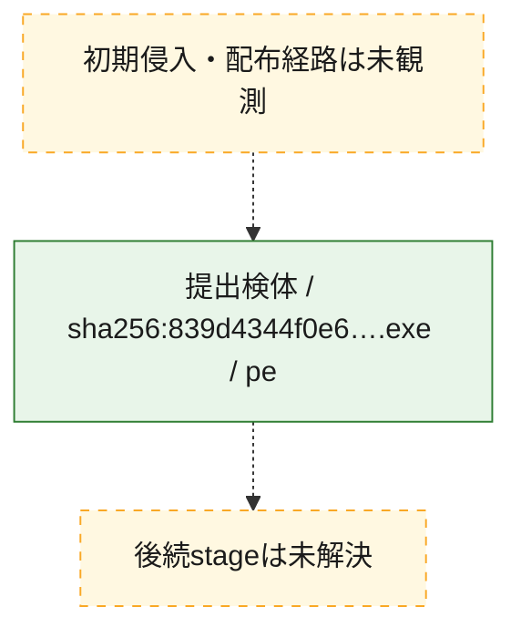
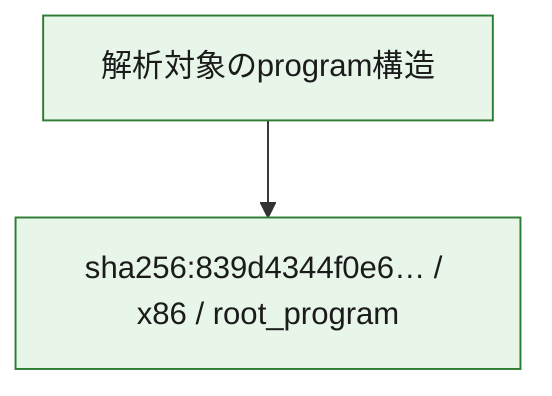

# 全体ロジック：839d4344f0e6b396467df570011971897acfca4aee37011fb64ade9338ecfb81

代表関数の静的証跡から、起動・初期化の処理群を確認しました。

## 読み方

- phaseの掲載順は解析上の整理順です。observed_call_edgesがない段階間の実行順を断定しません。
- 図の実線は静的に観測した関係、点線と黄色のノードは未観測・未解決の関係を示します。
- 図は静的な要約であり、動的実行を再現するものではありません。
- 詳細な関数解説とfingerprintは[STATIC-LOGIC.md](STATIC-LOGIC.md)を参照してください。

## 静的可視化

### 実行フロー

### 感染チェーン

### モジュール関係

## 処理段階

### 1. 起動・初期化

entry pointから初期化と後続処理への移行を確認します。
確度: `confirmed_static_function_evidence`

- `839d4344f0e6b396467df570011971897acfca4aee37011fb64ade9338ecfb81:ghidra:180001010` — 初期化と主要処理への分岐を行う入口関数です。 状態: `succeeded`、選定理由: `entry_point`, `meaningful_symbol_name`, `reviewed_call_centrality:22`, `role:entrypoint`, `small_program_complete_context`

### 2. 補助処理

主要処理を支える一般内部関数またはlibrary処理を確認します。
確度: `confirmed_static_function_evidence`

- `839d4344f0e6b396467df570011971897acfca4aee37011fb64ade9338ecfb81:ghidra:180001240` — 検体内部の一般処理を実装する関数です。 状態: `succeeded`、選定理由: `context_representative`, `reviewed_call_centrality:2`, `small_program_complete_context`
- `839d4344f0e6b396467df570011971897acfca4aee37011fb64ade9338ecfb81:ghidra:180001350` — 検体内部の一般処理を実装する関数です。 状態: `succeeded`、選定理由: `context_representative`, `reviewed_call_centrality:25`, `small_program_complete_context`
- `839d4344f0e6b396467df570011971897acfca4aee37011fb64ade9338ecfb81:ghidra:180003780` — 検体内部の一般処理を実装する関数です。 状態: `succeeded`、選定理由: `context_representative`, `reviewed_call_centrality:2`, `small_program_complete_context`
- `839d4344f0e6b396467df570011971897acfca4aee37011fb64ade9338ecfb81:ghidra:1800038e0` — 検体内部の一般処理を実装する関数です。 状態: `succeeded`、選定理由: `context_representative`, `reviewed_call_centrality:2`, `small_program_complete_context`

## 観測したcall関係

- `839d4344f0e6b396467df570011971897acfca4aee37011fb64ade9338ecfb81:ghidra:180001010` → `839d4344f0e6b396467df570011971897acfca4aee37011fb64ade9338ecfb81:ghidra:180001240` （`startup` → `support`）
- `839d4344f0e6b396467df570011971897acfca4aee37011fb64ade9338ecfb81:ghidra:180001010` → `839d4344f0e6b396467df570011971897acfca4aee37011fb64ade9338ecfb81:ghidra:180001350` （`startup` → `support`）
- `839d4344f0e6b396467df570011971897acfca4aee37011fb64ade9338ecfb81:ghidra:180001350` → `839d4344f0e6b396467df570011971897acfca4aee37011fb64ade9338ecfb81:ghidra:180001240` （`support` → `support`）
- `839d4344f0e6b396467df570011971897acfca4aee37011fb64ade9338ecfb81:ghidra:180001350` → `839d4344f0e6b396467df570011971897acfca4aee37011fb64ade9338ecfb81:ghidra:180003780` （`support` → `support`）
- `839d4344f0e6b396467df570011971897acfca4aee37011fb64ade9338ecfb81:ghidra:180001350` → `839d4344f0e6b396467df570011971897acfca4aee37011fb64ade9338ecfb81:ghidra:1800038e0` （`support` → `support`）
- `839d4344f0e6b396467df570011971897acfca4aee37011fb64ade9338ecfb81:ghidra:180003780` → `839d4344f0e6b396467df570011971897acfca4aee37011fb64ade9338ecfb81:ghidra:1800038e0` （`support` → `support`）
- `ghidra-function:58425bf8420f9794fbdfaa7d` → `ghidra-external:0f97e6537e7753218a5f31cf` （`unclassified` → `unclassified`）
- `ghidra-function:58425bf8420f9794fbdfaa7d` → `ghidra-external:19a402fe81e8d4d45247d157` （`unclassified` → `unclassified`）
- `ghidra-function:58425bf8420f9794fbdfaa7d` → `ghidra-external:2a10c89dfffed4db8922bfd3` （`unclassified` → `unclassified`）
- `ghidra-function:58425bf8420f9794fbdfaa7d` → `ghidra-external:4d0649b1e9a1cfcba6c57db8` （`unclassified` → `unclassified`）
- `ghidra-function:58425bf8420f9794fbdfaa7d` → `ghidra-external:6d6d8bd9f7c803ecf8d7853d` （`unclassified` → `unclassified`）
- `ghidra-function:58425bf8420f9794fbdfaa7d` → `ghidra-external:7001a8ac4da30e02b4667970` （`unclassified` → `unclassified`）
- `ghidra-function:58425bf8420f9794fbdfaa7d` → `ghidra-external:8c47f9555d1e98e882c7c619` （`unclassified` → `unclassified`）
- `ghidra-function:58425bf8420f9794fbdfaa7d` → `ghidra-external:8dd4cb694a875a93f9926359` （`unclassified` → `unclassified`）
- `ghidra-function:58425bf8420f9794fbdfaa7d` → `ghidra-external:a5a30c0bea0d74ca1a5da36b` （`unclassified` → `unclassified`）
- `ghidra-function:58425bf8420f9794fbdfaa7d` → `ghidra-external:ac514f0ed6606ea122fd77a9` （`unclassified` → `unclassified`）
- `ghidra-function:58425bf8420f9794fbdfaa7d` → `ghidra-external:c7db588d5a7fe36dcee57b53` （`unclassified` → `unclassified`）
- `ghidra-function:58425bf8420f9794fbdfaa7d` → `ghidra-external:c9459b9792313bac4a5a9906` （`unclassified` → `unclassified`）
- `ghidra-function:58425bf8420f9794fbdfaa7d` → `ghidra-external:cd47cd90af27644f82c69fa5` （`unclassified` → `unclassified`）
- `ghidra-function:58425bf8420f9794fbdfaa7d` → `ghidra-external:d57166d5b39bf54dc44a12e6` （`unclassified` → `unclassified`）
- `ghidra-function:58425bf8420f9794fbdfaa7d` → `ghidra-external:d732a467f41975e579883280` （`unclassified` → `unclassified`）
- `ghidra-function:58425bf8420f9794fbdfaa7d` → `ghidra-external:e4a5171b43a2261401d16078` （`unclassified` → `unclassified`）
- `ghidra-function:58425bf8420f9794fbdfaa7d` → `ghidra-external:ef9a8772f61041b0c1c41e7c` （`unclassified` → `unclassified`）
- `ghidra-function:58425bf8420f9794fbdfaa7d` → `ghidra-external:fae7c66f729c9a522537691d` （`unclassified` → `unclassified`）
- `ghidra-function:58425bf8420f9794fbdfaa7d` → `ghidra-external:fbb47ad6009646866b427170` （`unclassified` → `unclassified`）
- `ghidra-function:58425bf8420f9794fbdfaa7d` → `ghidra-external:fc80d17ca8dad47ce1079aea` （`unclassified` → `unclassified`）
- `ghidra-function:58425bf8420f9794fbdfaa7d` → `ghidra-external:fdb1c453885552b230da4098` （`unclassified` → `unclassified`）
- `ghidra-function:58425bf8420f9794fbdfaa7d` → `ghidra-function:8eb0d47ecf89ec418a9b45dd` （`unclassified` → `unclassified`）
- `ghidra-function:58425bf8420f9794fbdfaa7d` → `ghidra-function:cf16e7046b002b075030a8ac` （`unclassified` → `unclassified`）
- `ghidra-function:58425bf8420f9794fbdfaa7d` → `ghidra-function:dc03970935f47b80bd935310` （`unclassified` → `unclassified`）
- `ghidra-function:821b167df0945106d87ed010` → `ghidra-function:09d49aa0ae53f601981dc96e` （`unclassified` → `unclassified`）
- `ghidra-function:821b167df0945106d87ed010` → `ghidra-function:2fb8f25cd4fb4442a21e9a69` （`unclassified` → `unclassified`）
- `ghidra-function:821b167df0945106d87ed010` → `ghidra-function:534224d191f96071d630dffa` （`unclassified` → `unclassified`）
- `ghidra-function:821b167df0945106d87ed010` → `ghidra-function:58425bf8420f9794fbdfaa7d` （`unclassified` → `unclassified`）
- `ghidra-function:821b167df0945106d87ed010` → `ghidra-function:688efae614b6fa9e2e72dca2` （`unclassified` → `unclassified`）
- `ghidra-function:821b167df0945106d87ed010` → `ghidra-function:772d7caf185ee7a0fe96e663` （`unclassified` → `unclassified`）
- `ghidra-function:821b167df0945106d87ed010` → `ghidra-function:b9e545b18252c4eaa830d01c` （`unclassified` → `unclassified`）
- `ghidra-function:821b167df0945106d87ed010` → `ghidra-function:cb1295d83becefccdc014d07` （`unclassified` → `unclassified`）
- `ghidra-function:821b167df0945106d87ed010` → `ghidra-function:cf16e7046b002b075030a8ac` （`unclassified` → `unclassified`）
- `ghidra-function:821b167df0945106d87ed010` → `ghidra-function:e3c89296752ae0548a5c8110` （`unclassified` → `unclassified`）
- `ghidra-function:821b167df0945106d87ed010` → `ghidra-function:e740342b086cf35c9fa3354b` （`unclassified` → `unclassified`）
- `ghidra-function:821b167df0945106d87ed010` → `ghidra-function:fbb2aeed157c382f08e48b18` （`unclassified` → `unclassified`）
- `ghidra-function:8eb0d47ecf89ec418a9b45dd` → `ghidra-function:dc03970935f47b80bd935310` （`unclassified` → `unclassified`）

## 解析範囲と制約

- 選定外関数は全体inventoryへ残しますが、関数本体の個別解説対象にはしていません。
- indirect call、難読化、packer、VM、壊れたcontrol flowによりcall関係が欠落する場合があります。
- 文書は静的解析に基づき、検体実行や外部通信による動的確認は行っていません。
