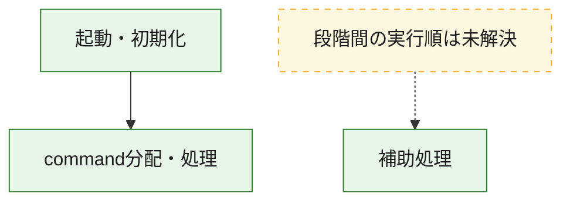
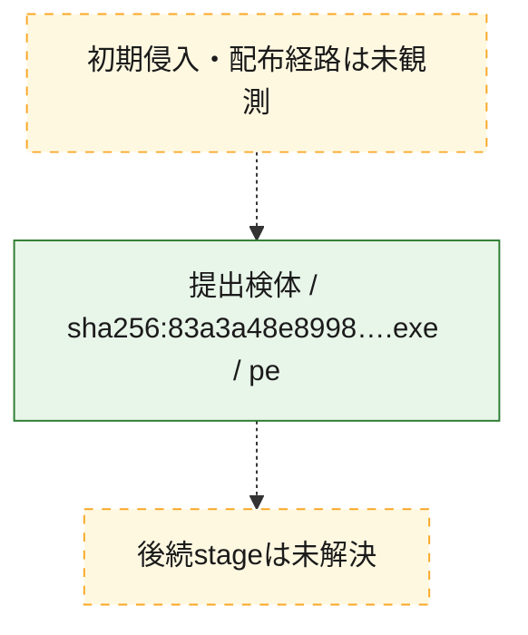
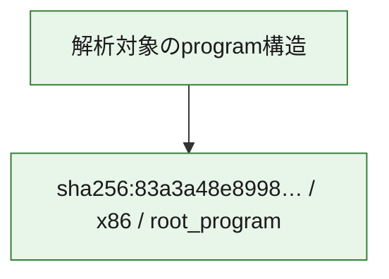

# 全体ロジック：83a3a48e8998fe74853161d31476c613d6eaf05f618446dd9d9b1016ada44822

代表関数の静的証跡から、起動・初期化、command分配・処理の処理群を確認しました。

## 読み方

- phaseの掲載順は解析上の整理順です。observed_call_edgesがない段階間の実行順を断定しません。
- 図の実線は静的に観測した関係、点線と黄色のノードは未観測・未解決の関係を示します。
- 図は静的な要約であり、動的実行を再現するものではありません。
- 詳細な関数解説とfingerprintは[STATIC-LOGIC.md](STATIC-LOGIC.md)を参照してください。

## 静的可視化

### 実行フロー

### 感染チェーン

### モジュール関係

## 処理段階

### 1. 起動・初期化

entry pointから初期化と後続処理への移行を確認します。
確度: `confirmed_static_function_evidence`

- `83a3a48e8998fe74853161d31476c613d6eaf05f618446dd9d9b1016ada44822:ghidra:14019eb98` — 初期化と主要処理への分岐を行う入口関数です。 状態: `succeeded`、選定理由: `entry_point`, `meaningful_symbol_name`, `reviewed_call_centrality:22`, `role:entrypoint`

### 2. command分配・処理

受信commandやtaskの解釈、分配、個別handlerへの移行を確認します。
確度: `confirmed_static_function_evidence_with_limits`

- `83a3a48e8998fe74853161d31476c613d6eaf05f618446dd9d9b1016ada44822:ghidra:1401cdeb0` — commandの解釈、分配、または個別処理を担当する関数です。 状態: `limited_bad_instruction_or_flow`、選定理由: `meaningful_symbol_name`, `reviewed_call_centrality:1`, `role:command_dispatch_or_handler`

### 3. 補助処理

主要処理を支える一般内部関数またはlibrary処理を確認します。
確度: `confirmed_static_function_evidence_with_limits`

- `83a3a48e8998fe74853161d31476c613d6eaf05f618446dd9d9b1016ada44822:ghidra:140001000` — 検体内部の一般処理を実装する関数です。 状態: `succeeded`、選定理由: `context_representative`, `reviewed_call_centrality:2`
- `83a3a48e8998fe74853161d31476c613d6eaf05f618446dd9d9b1016ada44822:ghidra:140001060` — 検体内部の一般処理を実装する関数です。 状態: `succeeded`、選定理由: `context_representative`, `reviewed_call_centrality:2`
- `83a3a48e8998fe74853161d31476c613d6eaf05f618446dd9d9b1016ada44822:ghidra:1400010c0` — 検体内部の一般処理を実装する関数です。 状態: `succeeded`、選定理由: `context_representative`, `reviewed_call_centrality:2`
- `83a3a48e8998fe74853161d31476c613d6eaf05f618446dd9d9b1016ada44822:ghidra:140001100` — 検体内部の一般処理を実装する関数です。 状態: `succeeded`、選定理由: `context_representative`, `reviewed_call_centrality:2`
- `83a3a48e8998fe74853161d31476c613d6eaf05f618446dd9d9b1016ada44822:ghidra:140001140` — 検体内部の一般処理を実装する関数です。 状態: `succeeded`、選定理由: `context_representative`, `reviewed_call_centrality:2`
- `83a3a48e8998fe74853161d31476c613d6eaf05f618446dd9d9b1016ada44822:ghidra:140001180` — 検体内部の一般処理を実装する関数です。 状態: `succeeded`、選定理由: `context_representative`, `reviewed_call_centrality:2`
- `83a3a48e8998fe74853161d31476c613d6eaf05f618446dd9d9b1016ada44822:ghidra:1400011c0` — 検体内部の一般処理を実装する関数です。 状態: `succeeded`、選定理由: `context_representative`, `reviewed_call_centrality:2`
- `83a3a48e8998fe74853161d31476c613d6eaf05f618446dd9d9b1016ada44822:ghidra:140001200` — 検体内部の一般処理を実装する関数です。 状態: `succeeded`、選定理由: `context_representative`, `reviewed_call_centrality:2`
- `83a3a48e8998fe74853161d31476c613d6eaf05f618446dd9d9b1016ada44822:ghidra:140001240` — 検体内部の一般処理を実装する関数です。 状態: `succeeded`、選定理由: `context_representative`, `reviewed_call_centrality:2`
- `83a3a48e8998fe74853161d31476c613d6eaf05f618446dd9d9b1016ada44822:ghidra:140001280` — 検体内部の一般処理を実装する関数です。 状態: `succeeded`、選定理由: `context_representative`, `reviewed_call_centrality:2`
- `83a3a48e8998fe74853161d31476c613d6eaf05f618446dd9d9b1016ada44822:ghidra:1400012c0` — 検体内部の一般処理を実装する関数です。 状態: `succeeded`、選定理由: `context_representative`, `reviewed_call_centrality:2`
- `83a3a48e8998fe74853161d31476c613d6eaf05f618446dd9d9b1016ada44822:ghidra:140001300` — 検体内部の一般処理を実装する関数です。 状態: `succeeded`、選定理由: `context_representative`, `reviewed_call_centrality:2`
- `83a3a48e8998fe74853161d31476c613d6eaf05f618446dd9d9b1016ada44822:ghidra:140001350` — 検体内部の一般処理を実装する関数です。 状態: `succeeded`、選定理由: `context_representative`, `reviewed_call_centrality:2`
- `83a3a48e8998fe74853161d31476c613d6eaf05f618446dd9d9b1016ada44822:ghidra:1400013e0` — 検体内部の一般処理を実装する関数です。 状態: `succeeded`、選定理由: `context_representative`, `reviewed_call_centrality:3`
- `83a3a48e8998fe74853161d31476c613d6eaf05f618446dd9d9b1016ada44822:ghidra:140001480` — 検体内部の一般処理を実装する関数です。 状態: `succeeded`、選定理由: `context_representative`, `reviewed_call_centrality:2`
- `83a3a48e8998fe74853161d31476c613d6eaf05f618446dd9d9b1016ada44822:ghidra:1400014dc` — 検体内部の一般処理を実装する関数です。 状態: `succeeded`、選定理由: `context_representative`, `reviewed_call_centrality:2`
- `83a3a48e8998fe74853161d31476c613d6eaf05f618446dd9d9b1016ada44822:ghidra:140001514` — 検体内部の一般処理を実装する関数です。 状態: `succeeded`、選定理由: `context_representative`, `reviewed_call_centrality:2`
- `83a3a48e8998fe74853161d31476c613d6eaf05f618446dd9d9b1016ada44822:ghidra:140001544` — 検体内部の一般処理を実装する関数です。 状態: `succeeded`、選定理由: `context_representative`, `reviewed_call_centrality:4`
- `83a3a48e8998fe74853161d31476c613d6eaf05f618446dd9d9b1016ada44822:ghidra:1400015dc` — 検体内部の一般処理を実装する関数です。 状態: `succeeded`、選定理由: `context_representative`, `reviewed_call_centrality:2`
- `83a3a48e8998fe74853161d31476c613d6eaf05f618446dd9d9b1016ada44822:ghidra:1400015fc` — 検体内部の一般処理を実装する関数です。 状態: `succeeded`、選定理由: `context_representative`, `reviewed_call_centrality:2`
- `83a3a48e8998fe74853161d31476c613d6eaf05f618446dd9d9b1016ada44822:ghidra:14000164c` — 検体内部の一般処理を実装する関数です。 状態: `succeeded`、選定理由: `context_representative`, `reviewed_call_centrality:2`
- `83a3a48e8998fe74853161d31476c613d6eaf05f618446dd9d9b1016ada44822:ghidra:1400016a8` — 検体内部の一般処理を実装する関数です。 状態: `succeeded`、選定理由: `context_representative`, `reviewed_call_centrality:2`
- `83a3a48e8998fe74853161d31476c613d6eaf05f618446dd9d9b1016ada44822:ghidra:1400016d4` — 検体内部の一般処理を実装する関数です。 状態: `succeeded`、選定理由: `context_representative`, `reviewed_call_centrality:2`
- `83a3a48e8998fe74853161d31476c613d6eaf05f618446dd9d9b1016ada44822:ghidra:140001750` — 検体内部の一般処理を実装する関数です。 状態: `limited_bad_instruction_or_flow`、選定理由: `context_representative`, `reviewed_call_centrality:3`
- `83a3a48e8998fe74853161d31476c613d6eaf05f618446dd9d9b1016ada44822:ghidra:1400018d0` — 検体内部の一般処理を実装する関数です。 状態: `succeeded`、選定理由: `context_representative`, `reviewed_call_centrality:4`
- `83a3a48e8998fe74853161d31476c613d6eaf05f618446dd9d9b1016ada44822:ghidra:1400019e0` — 検体内部の一般処理を実装する関数です。 状態: `succeeded`、選定理由: `context_representative`, `reviewed_call_centrality:1`
- `83a3a48e8998fe74853161d31476c613d6eaf05f618446dd9d9b1016ada44822:ghidra:140001b60` — 検体内部の一般処理を実装する関数です。 状態: `succeeded`、選定理由: `context_representative`
- `83a3a48e8998fe74853161d31476c613d6eaf05f618446dd9d9b1016ada44822:ghidra:140001bc0` — 検体内部の一般処理を実装する関数です。 状態: `succeeded`、選定理由: `context_representative`
- `83a3a48e8998fe74853161d31476c613d6eaf05f618446dd9d9b1016ada44822:ghidra:140001c40` — 検体内部の一般処理を実装する関数です。 状態: `succeeded`、選定理由: `context_representative`, `reviewed_call_centrality:1`
- `83a3a48e8998fe74853161d31476c613d6eaf05f618446dd9d9b1016ada44822:ghidra:140007810` — 検体内部の一般処理を実装する関数です。 状態: `succeeded`、選定理由: `meaningful_symbol_name`

## 観測したcall関係

- `83a3a48e8998fe74853161d31476c613d6eaf05f618446dd9d9b1016ada44822:ghidra:1400018d0` → `83a3a48e8998fe74853161d31476c613d6eaf05f618446dd9d9b1016ada44822:ghidra:140001750` （`support` → `support`）
- `83a3a48e8998fe74853161d31476c613d6eaf05f618446dd9d9b1016ada44822:ghidra:14019eb98` → `83a3a48e8998fe74853161d31476c613d6eaf05f618446dd9d9b1016ada44822:ghidra:1401cdeb0` （`startup` → `dispatch`）
- `ghidra-function:172c65d8e535967683c91b23` → `ghidra-function:8e971263180ae6b1729efb25` （`unclassified` → `unclassified`）
- `ghidra-function:172c65d8e535967683c91b23` → `ghidra-function:dfe50b0aded57d281f2f0ceb` （`unclassified` → `unclassified`）
- `ghidra-function:271406b4031b4bd63e53af2a` → `ghidra-function:49bddb4b3bce8d9deada227b` （`unclassified` → `unclassified`）
- `ghidra-function:274e85a48e5bfea2643bad82` → `ghidra-function:bdd22c1a0ccaf6ead7936484` （`unclassified` → `unclassified`）
- `ghidra-function:274e85a48e5bfea2643bad82` → `ghidra-function:dfe50b0aded57d281f2f0ceb` （`unclassified` → `unclassified`）
- `ghidra-function:3c2d173e28993a63786db117` → `ghidra-external:b725965a5ac71785c7a2a29d` （`unclassified` → `unclassified`）
- `ghidra-function:3c2d173e28993a63786db117` → `ghidra-function:5d0e6e64a7d5a67924685356` （`unclassified` → `unclassified`）
- `ghidra-function:3c2d173e28993a63786db117` → `ghidra-function:8ba6c217f2fa62aac54b22a4` （`unclassified` → `unclassified`）
- `ghidra-function:3c2d173e28993a63786db117` → `ghidra-function:dfe50b0aded57d281f2f0ceb` （`unclassified` → `unclassified`）
- `ghidra-function:3d89a890689c86a004e47434` → `ghidra-function:9a908292e95d0d2427c711a5` （`unclassified` → `unclassified`）
- `ghidra-function:3d89a890689c86a004e47434` → `ghidra-function:dfe50b0aded57d281f2f0ceb` （`unclassified` → `unclassified`）
- `ghidra-function:4e05bc36b195862e372e697e` → `ghidra-function:3defa0e79c63bc158d971416` （`unclassified` → `unclassified`）
- `ghidra-function:4e05bc36b195862e372e697e` → `ghidra-function:dfe50b0aded57d281f2f0ceb` （`unclassified` → `unclassified`）
- `ghidra-function:552ddc76233f064f5079ec33` → `ghidra-function:8e971263180ae6b1729efb25` （`unclassified` → `unclassified`）
- `ghidra-function:552ddc76233f064f5079ec33` → `ghidra-function:dfe50b0aded57d281f2f0ceb` （`unclassified` → `unclassified`）
- `ghidra-function:5876a5ce3245e5dfa13e17fb` → `ghidra-function:8e971263180ae6b1729efb25` （`unclassified` → `unclassified`）
- `ghidra-function:5876a5ce3245e5dfa13e17fb` → `ghidra-function:dfe50b0aded57d281f2f0ceb` （`unclassified` → `unclassified`）
- `ghidra-function:600a443712711e9731e53752` → `ghidra-function:49bddb4b3bce8d9deada227b` （`unclassified` → `unclassified`）
- `ghidra-function:600a443712711e9731e53752` → `ghidra-function:74165904dc1e433feb3b0194` （`unclassified` → `unclassified`）
- `ghidra-function:60b873df4c99b01d1ffd7433` → `ghidra-function:66c4f13add81f2df7e0c59ec` （`unclassified` → `unclassified`）
- `ghidra-function:60b873df4c99b01d1ffd7433` → `ghidra-function:ca52e348a02bc53d2ee82c24` （`unclassified` → `unclassified`）
- `ghidra-function:60b873df4c99b01d1ffd7433` → `ghidra-function:f624eee33f74d41d6b6cde75` （`unclassified` → `unclassified`）
- `ghidra-function:68179a867d4ea98ec52ef305` → `ghidra-function:58e29f14368535e2fed0c925` （`unclassified` → `unclassified`）
- `ghidra-function:68179a867d4ea98ec52ef305` → `ghidra-function:dfe50b0aded57d281f2f0ceb` （`unclassified` → `unclassified`）
- `ghidra-function:6f2f6343f06aa065f192eae5` → `ghidra-function:600a443712711e9731e53752` （`unclassified` → `unclassified`）
- `ghidra-function:6f2f6343f06aa065f192eae5` → `ghidra-function:964bbb3070813cbc4615acd8` （`unclassified` → `unclassified`）
- `ghidra-function:6f2f6343f06aa065f192eae5` → `ghidra-function:cc7ba99cc859c8fd00bc7670` （`unclassified` → `unclassified`）
- `ghidra-function:6f2f6343f06aa065f192eae5` → `ghidra-function:f6a591f49ea2338093d6bf15` （`unclassified` → `unclassified`）
- `ghidra-function:7656bd76d5491d4378c95509` → `ghidra-function:3defa0e79c63bc158d971416` （`unclassified` → `unclassified`）
- `ghidra-function:7656bd76d5491d4378c95509` → `ghidra-function:dfe50b0aded57d281f2f0ceb` （`unclassified` → `unclassified`）
- `ghidra-function:79f425e1fa7b6fa9a65577c1` → `ghidra-function:8e971263180ae6b1729efb25` （`unclassified` → `unclassified`）
- `ghidra-function:79f425e1fa7b6fa9a65577c1` → `ghidra-function:dfe50b0aded57d281f2f0ceb` （`unclassified` → `unclassified`）
- `ghidra-function:8a6f9f4dee6b4c4e8d1040da` → `ghidra-function:6196cc414d7b9b07b4335a88` （`unclassified` → `unclassified`）
- `ghidra-function:8b2051f3248497f610b09e96` → `ghidra-function:3defa0e79c63bc158d971416` （`unclassified` → `unclassified`）
- `ghidra-function:8b2051f3248497f610b09e96` → `ghidra-function:dfe50b0aded57d281f2f0ceb` （`unclassified` → `unclassified`）
- `ghidra-function:8f0e4d653afd9a2fe0fb1097` → `ghidra-function:a07588bc10e6fb2ed269d0e1` （`unclassified` → `unclassified`）
- `ghidra-function:8f0e4d653afd9a2fe0fb1097` → `ghidra-function:dfe50b0aded57d281f2f0ceb` （`unclassified` → `unclassified`）
- `ghidra-function:9b4985528ed8f75cdad1c956` → `ghidra-function:8e971263180ae6b1729efb25` （`unclassified` → `unclassified`）
- `ghidra-function:9b4985528ed8f75cdad1c956` → `ghidra-function:dfe50b0aded57d281f2f0ceb` （`unclassified` → `unclassified`）
- `ghidra-function:9c19115d9b519e844555df60` → `ghidra-function:8e971263180ae6b1729efb25` （`unclassified` → `unclassified`）
- `ghidra-function:9c19115d9b519e844555df60` → `ghidra-function:dfe50b0aded57d281f2f0ceb` （`unclassified` → `unclassified`）
- `ghidra-function:a56b6a7acca6e3cfef60ca64` → `ghidra-function:9a908292e95d0d2427c711a5` （`unclassified` → `unclassified`）
- `ghidra-function:a56b6a7acca6e3cfef60ca64` → `ghidra-function:dfe50b0aded57d281f2f0ceb` （`unclassified` → `unclassified`）
- `ghidra-function:ab65338163e17ed9da7afc33` → `ghidra-function:a07588bc10e6fb2ed269d0e1` （`unclassified` → `unclassified`）
- `ghidra-function:ab65338163e17ed9da7afc33` → `ghidra-function:dfe50b0aded57d281f2f0ceb` （`unclassified` → `unclassified`）
- `ghidra-function:b6d0ef10cc140dddf39a0864` → `ghidra-function:9a908292e95d0d2427c711a5` （`unclassified` → `unclassified`）
- `ghidra-function:b6d0ef10cc140dddf39a0864` → `ghidra-function:dfe50b0aded57d281f2f0ceb` （`unclassified` → `unclassified`）
- `ghidra-function:c7bf9129745a72513cdb1d7e` → `ghidra-function:8e971263180ae6b1729efb25` （`unclassified` → `unclassified`）
- `ghidra-function:c7bf9129745a72513cdb1d7e` → `ghidra-function:dfe50b0aded57d281f2f0ceb` （`unclassified` → `unclassified`）
- `ghidra-function:d63301ec76ce6f78947afbd1` → `ghidra-external:40f54f877f4779ddfef3bf62` （`unclassified` → `unclassified`）
- `ghidra-function:d63301ec76ce6f78947afbd1` → `ghidra-external:41613b467c8cddffc829cf7e` （`unclassified` → `unclassified`）
- `ghidra-function:d63301ec76ce6f78947afbd1` → `ghidra-external:5a7c14fe5f9b4dba4ecd0418` （`unclassified` → `unclassified`）
- `ghidra-function:d63301ec76ce6f78947afbd1` → `ghidra-external:72a2f8d079ef1fea04a20b49` （`unclassified` → `unclassified`）
- `ghidra-function:d63301ec76ce6f78947afbd1` → `ghidra-external:9a8a2f72de4dc26a3bdf73a5` （`unclassified` → `unclassified`）
- `ghidra-function:d63301ec76ce6f78947afbd1` → `ghidra-external:a5ae01ba6b7c91e3c3d4de87` （`unclassified` → `unclassified`）
- `ghidra-function:d63301ec76ce6f78947afbd1` → `ghidra-external:b27053fa59798afa52fdbd57` （`unclassified` → `unclassified`）
- `ghidra-function:d63301ec76ce6f78947afbd1` → `ghidra-external:cc3cc4cf828497e42e6465a5` （`unclassified` → `unclassified`）
- `ghidra-function:d63301ec76ce6f78947afbd1` → `ghidra-function:27fd3e4ce0df8e5b10f44088` （`unclassified` → `unclassified`）
- `ghidra-function:d63301ec76ce6f78947afbd1` → `ghidra-function:34815f5db8e712b9dd18a959` （`unclassified` → `unclassified`）
- `ghidra-function:d63301ec76ce6f78947afbd1` → `ghidra-function:3eccbd77de9cb5876ec9cb3d` （`unclassified` → `unclassified`）
- `ghidra-function:d63301ec76ce6f78947afbd1` → `ghidra-function:56b435db8d1e21e70be218db` （`unclassified` → `unclassified`）
- `ghidra-function:d63301ec76ce6f78947afbd1` → `ghidra-function:5e6f0ca51a495e728e3eef9f` （`unclassified` → `unclassified`）
- `ghidra-function:d63301ec76ce6f78947afbd1` → `ghidra-function:5ffda128a4dcdde94d16dbee` （`unclassified` → `unclassified`）
- `ghidra-function:d63301ec76ce6f78947afbd1` → `ghidra-function:94b55fb0dd7aac905a5135e3` （`unclassified` → `unclassified`）
- `ghidra-function:d63301ec76ce6f78947afbd1` → `ghidra-function:b0349b53f5553140ef00d5c3` （`unclassified` → `unclassified`）
- `ghidra-function:d63301ec76ce6f78947afbd1` → `ghidra-function:c2cddcbcbd3ceb29ba826680` （`unclassified` → `unclassified`）
- `ghidra-function:d63301ec76ce6f78947afbd1` → `ghidra-function:c3a5a37457ad9dbd15506a45` （`unclassified` → `unclassified`）
- `ghidra-function:d63301ec76ce6f78947afbd1` → `ghidra-function:cfc06aa371518aff7e8fa20a` （`unclassified` → `unclassified`）
- `ghidra-function:d63301ec76ce6f78947afbd1` → `ghidra-function:db349028b2e6085d3ea800d4` （`unclassified` → `unclassified`）
- `ghidra-function:d63301ec76ce6f78947afbd1` → `ghidra-function:e2ec069e5b95b6dda6603254` （`unclassified` → `unclassified`）
- `ghidra-function:d63301ec76ce6f78947afbd1` → `ghidra-function:f4669b19dc9c07c6f2bcb99c` （`unclassified` → `unclassified`）
- `ghidra-function:dcfb1df3754c133f832c7022` → `ghidra-function:8e971263180ae6b1729efb25` （`unclassified` → `unclassified`）
- `ghidra-function:dcfb1df3754c133f832c7022` → `ghidra-function:dfe50b0aded57d281f2f0ceb` （`unclassified` → `unclassified`）
- `ghidra-function:eb3cb046fc5c93cb4bdbb44f` → `ghidra-function:9a908292e95d0d2427c711a5` （`unclassified` → `unclassified`）
- `ghidra-function:eb3cb046fc5c93cb4bdbb44f` → `ghidra-function:dfe50b0aded57d281f2f0ceb` （`unclassified` → `unclassified`）
- `ghidra-function:f60833d1012e6cec68125ecc` → `ghidra-function:bdd22c1a0ccaf6ead7936484` （`unclassified` → `unclassified`）
- `ghidra-function:f60833d1012e6cec68125ecc` → `ghidra-function:dfe50b0aded57d281f2f0ceb` （`unclassified` → `unclassified`）
- `ghidra-function:ffbf525d874d8f7a36d9614c` → `ghidra-function:8e971263180ae6b1729efb25` （`unclassified` → `unclassified`）
- `ghidra-function:ffbf525d874d8f7a36d9614c` → `ghidra-function:dfe50b0aded57d281f2f0ceb` （`unclassified` → `unclassified`）

## 解析範囲と制約

- 選定外関数は全体inventoryへ残しますが、関数本体の個別解説対象にはしていません。
- indirect call、難読化、packer、VM、壊れたcontrol flowによりcall関係が欠落する場合があります。
- 文書は静的解析に基づき、検体実行や外部通信による動的確認は行っていません。
