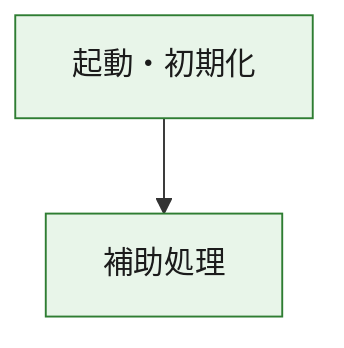
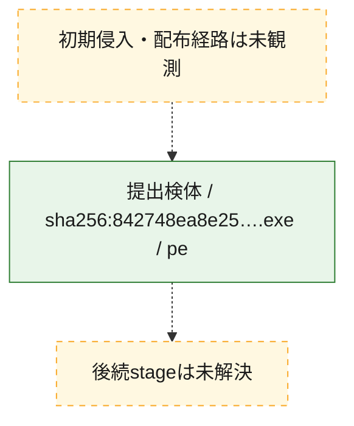
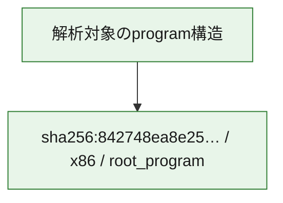

# 全体ロジック：842748ea8e25ea8d72aef5a55d270a0fc6a9bd769047bf1befbb7063a7a4bfef

代表関数の静的証跡から、起動・初期化の処理群を確認しました。

## 読み方

- phaseの掲載順は解析上の整理順です。observed_call_edgesがない段階間の実行順を断定しません。
- 図の実線は静的に観測した関係、点線と黄色のノードは未観測・未解決の関係を示します。
- 図は静的な要約であり、動的実行を再現するものではありません。
- 詳細な関数解説とfingerprintは[STATIC-LOGIC.md](STATIC-LOGIC.md)を参照してください。

## 静的可視化

### 実行フロー

### 感染チェーン

### モジュール関係

## 処理段階

### 1. 起動・初期化

entry pointから初期化と後続処理への移行を確認します。
確度: `confirmed_static_function_evidence`

- `842748ea8e25ea8d72aef5a55d270a0fc6a9bd769047bf1befbb7063a7a4bfef:ghidra:180001010` — 初期化と主要処理への分岐を行う入口関数です。 状態: `succeeded`、選定理由: `entry_point`, `meaningful_symbol_name`, `reviewed_call_centrality:22`, `role:entrypoint`, `small_program_complete_context`

### 2. 補助処理

主要処理を支える一般内部関数またはlibrary処理を確認します。
確度: `confirmed_static_function_evidence`

- `842748ea8e25ea8d72aef5a55d270a0fc6a9bd769047bf1befbb7063a7a4bfef:ghidra:180001240` — 検体内部の一般処理を実装する関数です。 状態: `succeeded`、選定理由: `context_representative`, `reviewed_call_centrality:2`, `small_program_complete_context`
- `842748ea8e25ea8d72aef5a55d270a0fc6a9bd769047bf1befbb7063a7a4bfef:ghidra:180001350` — 検体内部の一般処理を実装する関数です。 状態: `succeeded`、選定理由: `context_representative`, `reviewed_call_centrality:25`, `small_program_complete_context`
- `842748ea8e25ea8d72aef5a55d270a0fc6a9bd769047bf1befbb7063a7a4bfef:ghidra:180003780` — 検体内部の一般処理を実装する関数です。 状態: `succeeded`、選定理由: `context_representative`, `reviewed_call_centrality:2`, `small_program_complete_context`
- `842748ea8e25ea8d72aef5a55d270a0fc6a9bd769047bf1befbb7063a7a4bfef:ghidra:1800038e0` — 検体内部の一般処理を実装する関数です。 状態: `succeeded`、選定理由: `context_representative`, `reviewed_call_centrality:2`, `small_program_complete_context`

## 観測したcall関係

- `842748ea8e25ea8d72aef5a55d270a0fc6a9bd769047bf1befbb7063a7a4bfef:ghidra:180001010` → `842748ea8e25ea8d72aef5a55d270a0fc6a9bd769047bf1befbb7063a7a4bfef:ghidra:180001240` （`startup` → `support`）
- `842748ea8e25ea8d72aef5a55d270a0fc6a9bd769047bf1befbb7063a7a4bfef:ghidra:180001010` → `842748ea8e25ea8d72aef5a55d270a0fc6a9bd769047bf1befbb7063a7a4bfef:ghidra:180001350` （`startup` → `support`）
- `842748ea8e25ea8d72aef5a55d270a0fc6a9bd769047bf1befbb7063a7a4bfef:ghidra:180001350` → `842748ea8e25ea8d72aef5a55d270a0fc6a9bd769047bf1befbb7063a7a4bfef:ghidra:180001240` （`support` → `support`）
- `842748ea8e25ea8d72aef5a55d270a0fc6a9bd769047bf1befbb7063a7a4bfef:ghidra:180001350` → `842748ea8e25ea8d72aef5a55d270a0fc6a9bd769047bf1befbb7063a7a4bfef:ghidra:180003780` （`support` → `support`）
- `842748ea8e25ea8d72aef5a55d270a0fc6a9bd769047bf1befbb7063a7a4bfef:ghidra:180001350` → `842748ea8e25ea8d72aef5a55d270a0fc6a9bd769047bf1befbb7063a7a4bfef:ghidra:1800038e0` （`support` → `support`）
- `842748ea8e25ea8d72aef5a55d270a0fc6a9bd769047bf1befbb7063a7a4bfef:ghidra:180003780` → `842748ea8e25ea8d72aef5a55d270a0fc6a9bd769047bf1befbb7063a7a4bfef:ghidra:1800038e0` （`support` → `support`）
- `ghidra-function:10e59cf43c1762c2f06a9032` → `ghidra-external:22f501e952885af472ac8829` （`unclassified` → `unclassified`）
- `ghidra-function:10e59cf43c1762c2f06a9032` → `ghidra-external:38977d08d22c3232f00f47f3` （`unclassified` → `unclassified`）
- `ghidra-function:10e59cf43c1762c2f06a9032` → `ghidra-external:3b6154d3623ab534683383be` （`unclassified` → `unclassified`）
- `ghidra-function:10e59cf43c1762c2f06a9032` → `ghidra-external:44a4f5990b1530d5e77344ff` （`unclassified` → `unclassified`）
- `ghidra-function:10e59cf43c1762c2f06a9032` → `ghidra-external:50eb0198fd08b2a0f0d24859` （`unclassified` → `unclassified`）
- `ghidra-function:10e59cf43c1762c2f06a9032` → `ghidra-external:52aabd3d5ada34fbf664ade1` （`unclassified` → `unclassified`）
- `ghidra-function:10e59cf43c1762c2f06a9032` → `ghidra-external:60db05f8bdfbfdff6deb6066` （`unclassified` → `unclassified`）
- `ghidra-function:10e59cf43c1762c2f06a9032` → `ghidra-external:673e4d5a38ec20dd07308157` （`unclassified` → `unclassified`）
- `ghidra-function:10e59cf43c1762c2f06a9032` → `ghidra-external:683dcf4d9901405942a706a3` （`unclassified` → `unclassified`）
- `ghidra-function:10e59cf43c1762c2f06a9032` → `ghidra-external:7306ecd0e9486738cd0ff7a6` （`unclassified` → `unclassified`）
- `ghidra-function:10e59cf43c1762c2f06a9032` → `ghidra-external:b62b025c31890e77c16d72cf` （`unclassified` → `unclassified`）
- `ghidra-function:10e59cf43c1762c2f06a9032` → `ghidra-external:b7d9526e65fba844445704a7` （`unclassified` → `unclassified`）
- `ghidra-function:10e59cf43c1762c2f06a9032` → `ghidra-external:c3372de8292b7022fa337b08` （`unclassified` → `unclassified`）
- `ghidra-function:10e59cf43c1762c2f06a9032` → `ghidra-external:cf9cb4893c50af38173b8eb5` （`unclassified` → `unclassified`）
- `ghidra-function:10e59cf43c1762c2f06a9032` → `ghidra-external:d0ae366d74636dd6cd334e69` （`unclassified` → `unclassified`）
- `ghidra-function:10e59cf43c1762c2f06a9032` → `ghidra-external:d53fe431d2a4d06bc44d9576` （`unclassified` → `unclassified`）
- `ghidra-function:10e59cf43c1762c2f06a9032` → `ghidra-external:d70b9c5f5b378d204c1c0dfc` （`unclassified` → `unclassified`）
- `ghidra-function:10e59cf43c1762c2f06a9032` → `ghidra-external:dcf0e7db663928be6e48583d` （`unclassified` → `unclassified`）
- `ghidra-function:10e59cf43c1762c2f06a9032` → `ghidra-external:e2d131865ed0276039a57ebf` （`unclassified` → `unclassified`）
- `ghidra-function:10e59cf43c1762c2f06a9032` → `ghidra-external:e75e1b7efe214568b08d1596` （`unclassified` → `unclassified`）
- `ghidra-function:10e59cf43c1762c2f06a9032` → `ghidra-external:f8e98e1dee79080a9255c565` （`unclassified` → `unclassified`）
- `ghidra-function:10e59cf43c1762c2f06a9032` → `ghidra-function:461e0d3cc52a2f40c0211138` （`unclassified` → `unclassified`）
- `ghidra-function:10e59cf43c1762c2f06a9032` → `ghidra-function:c217262cfceccf8198a29825` （`unclassified` → `unclassified`）
- `ghidra-function:10e59cf43c1762c2f06a9032` → `ghidra-function:fde188cefdb9b573dffd5601` （`unclassified` → `unclassified`）
- `ghidra-function:6a25d4f4316f804ac4c0b810` → `ghidra-function:0b976ac1d0be88ebba41e198` （`unclassified` → `unclassified`）
- `ghidra-function:6a25d4f4316f804ac4c0b810` → `ghidra-function:10e59cf43c1762c2f06a9032` （`unclassified` → `unclassified`）
- `ghidra-function:6a25d4f4316f804ac4c0b810` → `ghidra-function:3f911274e9d90b59358bc85c` （`unclassified` → `unclassified`）
- `ghidra-function:6a25d4f4316f804ac4c0b810` → `ghidra-function:49709b919185609ee08872e3` （`unclassified` → `unclassified`）
- `ghidra-function:6a25d4f4316f804ac4c0b810` → `ghidra-function:56ad8575392f3f73a630b751` （`unclassified` → `unclassified`）
- `ghidra-function:6a25d4f4316f804ac4c0b810` → `ghidra-function:734d5841cd449be811f1656e` （`unclassified` → `unclassified`）
- `ghidra-function:6a25d4f4316f804ac4c0b810` → `ghidra-function:743724669d640f8e50ff40d8` （`unclassified` → `unclassified`）
- `ghidra-function:6a25d4f4316f804ac4c0b810` → `ghidra-function:7a130754bed961037b85618a` （`unclassified` → `unclassified`）
- `ghidra-function:6a25d4f4316f804ac4c0b810` → `ghidra-function:9a4408ad6246da82fa7445e3` （`unclassified` → `unclassified`）
- `ghidra-function:6a25d4f4316f804ac4c0b810` → `ghidra-function:c217262cfceccf8198a29825` （`unclassified` → `unclassified`）
- `ghidra-function:6a25d4f4316f804ac4c0b810` → `ghidra-function:d13de770171869493ccc0572` （`unclassified` → `unclassified`）
- `ghidra-function:6a25d4f4316f804ac4c0b810` → `ghidra-function:e3c3fe95832c0f11f1bdb27e` （`unclassified` → `unclassified`）
- `ghidra-function:fde188cefdb9b573dffd5601` → `ghidra-function:461e0d3cc52a2f40c0211138` （`unclassified` → `unclassified`）

## 解析範囲と制約

- 選定外関数は全体inventoryへ残しますが、関数本体の個別解説対象にはしていません。
- indirect call、難読化、packer、VM、壊れたcontrol flowによりcall関係が欠落する場合があります。
- 文書は静的解析に基づき、検体実行や外部通信による動的確認は行っていません。
