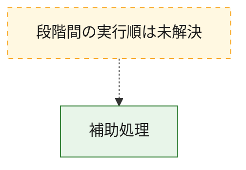
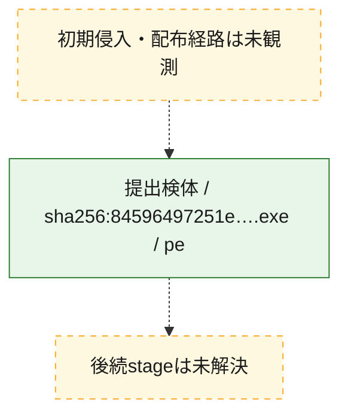
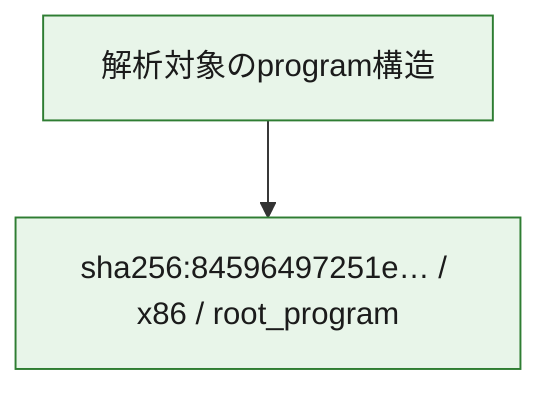

# 全体ロジック：84596497251e3847ce4389cb389a56fe87e08944474ffd4019ec315d306f449e

代表関数から主要なmalware処理段階を自動分類できませんでした。

## 読み方

- phaseの掲載順は解析上の整理順です。observed_call_edgesがない段階間の実行順を断定しません。
- 図の実線は静的に観測した関係、点線と黄色のノードは未観測・未解決の関係を示します。
- 図は静的な要約であり、動的実行を再現するものではありません。
- 詳細な関数解説とfingerprintは[STATIC-LOGIC.md](STATIC-LOGIC.md)を参照してください。

## 静的可視化

### 実行フロー

### 感染チェーン

### モジュール関係

## 処理段階

### 1. 補助処理

主要処理を支える一般内部関数またはlibrary処理を確認します。
確度: `confirmed_static_function_evidence`

- `84596497251e3847ce4389cb389a56fe87e08944474ffd4019ec315d306f449e:ghidra:00401080` — 検体内部の一般処理を実装する関数です。 状態: `succeeded`、選定理由: `context_representative`, `reviewed_call_centrality:3`
- `84596497251e3847ce4389cb389a56fe87e08944474ffd4019ec315d306f449e:ghidra:00401100` — 検体内部の一般処理を実装する関数です。 状態: `succeeded`、選定理由: `context_representative`, `reviewed_call_centrality:5`
- `84596497251e3847ce4389cb389a56fe87e08944474ffd4019ec315d306f449e:ghidra:00401180` — 検体内部の一般処理を実装する関数です。 状態: `succeeded`、選定理由: `context_representative`, `reviewed_call_centrality:5`
- `84596497251e3847ce4389cb389a56fe87e08944474ffd4019ec315d306f449e:ghidra:00401240` — 検体内部の一般処理を実装する関数です。 状態: `succeeded`、選定理由: `context_representative`, `reviewed_call_centrality:5`
- `84596497251e3847ce4389cb389a56fe87e08944474ffd4019ec315d306f449e:ghidra:00401360` — 検体内部の一般処理を実装する関数です。 状態: `succeeded`、選定理由: `context_representative`, `reviewed_call_centrality:3`
- `84596497251e3847ce4389cb389a56fe87e08944474ffd4019ec315d306f449e:ghidra:00401440` — 検体内部の一般処理を実装する関数です。 状態: `succeeded`、選定理由: `context_representative`, `reviewed_call_centrality:2`
- `84596497251e3847ce4389cb389a56fe87e08944474ffd4019ec315d306f449e:ghidra:00401480` — 検体内部の一般処理を実装する関数です。 状態: `succeeded`、選定理由: `context_representative`, `reviewed_call_centrality:3`
- `84596497251e3847ce4389cb389a56fe87e08944474ffd4019ec315d306f449e:ghidra:004014e0` — 検体内部の一般処理を実装する関数です。 状態: `succeeded`、選定理由: `context_representative`, `reviewed_call_centrality:11`
- `84596497251e3847ce4389cb389a56fe87e08944474ffd4019ec315d306f449e:ghidra:00401a20` — 検体内部の一般処理を実装する関数です。 状態: `succeeded`、選定理由: `context_representative`, `reviewed_call_centrality:9`
- `84596497251e3847ce4389cb389a56fe87e08944474ffd4019ec315d306f449e:ghidra:004023e0` — 検体内部の一般処理を実装する関数です。 状態: `succeeded`、選定理由: `context_representative`, `reviewed_call_centrality:2`
- `84596497251e3847ce4389cb389a56fe87e08944474ffd4019ec315d306f449e:ghidra:00402460` — 検体内部の一般処理を実装する関数です。 状態: `succeeded`、選定理由: `context_representative`, `reviewed_call_centrality:2`
- `84596497251e3847ce4389cb389a56fe87e08944474ffd4019ec315d306f449e:ghidra:00403360` — 検体内部の一般処理を実装する関数です。 状態: `succeeded`、選定理由: `context_representative`, `reviewed_call_centrality:1`
- `84596497251e3847ce4389cb389a56fe87e08944474ffd4019ec315d306f449e:ghidra:004033a0` — 検体内部の一般処理を実装する関数です。 状態: `succeeded`、選定理由: `context_representative`, `reviewed_call_centrality:2`
- `84596497251e3847ce4389cb389a56fe87e08944474ffd4019ec315d306f449e:ghidra:00403440` — 検体内部の一般処理を実装する関数です。 状態: `succeeded`、選定理由: `context_representative`, `reviewed_call_centrality:3`
- `84596497251e3847ce4389cb389a56fe87e08944474ffd4019ec315d306f449e:ghidra:00403520` — 検体内部の一般処理を実装する関数です。 状態: `succeeded`、選定理由: `context_representative`, `reviewed_call_centrality:3`
- `84596497251e3847ce4389cb389a56fe87e08944474ffd4019ec315d306f449e:ghidra:00403620` — 検体内部の一般処理を実装する関数です。 状態: `succeeded`、選定理由: `context_representative`, `reviewed_call_centrality:3`
- `84596497251e3847ce4389cb389a56fe87e08944474ffd4019ec315d306f449e:ghidra:00403be0` — 検体内部の一般処理を実装する関数です。 状態: `succeeded`、選定理由: `context_representative`, `reviewed_call_centrality:2`
- `84596497251e3847ce4389cb389a56fe87e08944474ffd4019ec315d306f449e:ghidra:00403c20` — 検体内部の一般処理を実装する関数です。 状態: `succeeded`、選定理由: `context_representative`, `reviewed_call_centrality:2`
- `84596497251e3847ce4389cb389a56fe87e08944474ffd4019ec315d306f449e:ghidra:00403d80` — 検体内部の一般処理を実装する関数です。 状態: `succeeded`、選定理由: `context_representative`, `reviewed_call_centrality:2`
- `84596497251e3847ce4389cb389a56fe87e08944474ffd4019ec315d306f449e:ghidra:00403dc0` — 検体内部の一般処理を実装する関数です。 状態: `succeeded`、選定理由: `context_representative`, `reviewed_call_centrality:2`
- `84596497251e3847ce4389cb389a56fe87e08944474ffd4019ec315d306f449e:ghidra:00403e00` — 検体内部の一般処理を実装する関数です。 状態: `succeeded`、選定理由: `context_representative`, `reviewed_call_centrality:6`
- `84596497251e3847ce4389cb389a56fe87e08944474ffd4019ec315d306f449e:ghidra:00403ec0` — 検体内部の一般処理を実装する関数です。 状態: `succeeded`、選定理由: `context_representative`, `reviewed_call_centrality:6`
- `84596497251e3847ce4389cb389a56fe87e08944474ffd4019ec315d306f449e:ghidra:00403f80` — 検体内部の一般処理を実装する関数です。 状態: `succeeded`、選定理由: `context_representative`, `reviewed_call_centrality:3`
- `84596497251e3847ce4389cb389a56fe87e08944474ffd4019ec315d306f449e:ghidra:00403fe0` — 検体内部の一般処理を実装する関数です。 状態: `succeeded`、選定理由: `context_representative`, `reviewed_call_centrality:3`
- `84596497251e3847ce4389cb389a56fe87e08944474ffd4019ec315d306f449e:ghidra:00404040` — 検体内部の一般処理を実装する関数です。 状態: `succeeded`、選定理由: `context_representative`, `reviewed_call_centrality:8`
- `84596497251e3847ce4389cb389a56fe87e08944474ffd4019ec315d306f449e:ghidra:00404140` — 検体内部の一般処理を実装する関数です。 状態: `succeeded`、選定理由: `context_representative`, `reviewed_call_centrality:8`
- `84596497251e3847ce4389cb389a56fe87e08944474ffd4019ec315d306f449e:ghidra:00404240` — 検体内部の一般処理を実装する関数です。 状態: `succeeded`、選定理由: `context_representative`, `reviewed_call_centrality:18`
- `84596497251e3847ce4389cb389a56fe87e08944474ffd4019ec315d306f449e:ghidra:004044a0` — 検体内部の一般処理を実装する関数です。 状態: `succeeded`、選定理由: `context_representative`, `reviewed_call_centrality:5`
- `84596497251e3847ce4389cb389a56fe87e08944474ffd4019ec315d306f449e:ghidra:00404860` — 検体内部の一般処理を実装する関数です。 状態: `succeeded`、選定理由: `context_representative`, `reviewed_call_centrality:2`
- `84596497251e3847ce4389cb389a56fe87e08944474ffd4019ec315d306f449e:ghidra:004048c0` — 検体内部の一般処理を実装する関数です。 状態: `succeeded`、選定理由: `context_representative`, `reviewed_call_centrality:2`
- `84596497251e3847ce4389cb389a56fe87e08944474ffd4019ec315d306f449e:ghidra:00404920` — 検体内部の一般処理を実装する関数です。 状態: `succeeded`、選定理由: `context_representative`, `reviewed_call_centrality:2`
- `84596497251e3847ce4389cb389a56fe87e08944474ffd4019ec315d306f449e:ghidra:00404980` — 検体内部の一般処理を実装する関数です。 状態: `succeeded`、選定理由: `context_representative`, `reviewed_call_centrality:6`

## 観測したcall関係

- `84596497251e3847ce4389cb389a56fe87e08944474ffd4019ec315d306f449e:ghidra:00401480` → `84596497251e3847ce4389cb389a56fe87e08944474ffd4019ec315d306f449e:ghidra:004014e0` （`support` → `support`）
- `84596497251e3847ce4389cb389a56fe87e08944474ffd4019ec315d306f449e:ghidra:00401480` → `84596497251e3847ce4389cb389a56fe87e08944474ffd4019ec315d306f449e:ghidra:00401a20` （`support` → `support`）
- `84596497251e3847ce4389cb389a56fe87e08944474ffd4019ec315d306f449e:ghidra:004033a0` → `84596497251e3847ce4389cb389a56fe87e08944474ffd4019ec315d306f449e:ghidra:00403620` （`support` → `support`）
- `84596497251e3847ce4389cb389a56fe87e08944474ffd4019ec315d306f449e:ghidra:00403440` → `84596497251e3847ce4389cb389a56fe87e08944474ffd4019ec315d306f449e:ghidra:00403620` （`support` → `support`）
- `84596497251e3847ce4389cb389a56fe87e08944474ffd4019ec315d306f449e:ghidra:00403520` → `84596497251e3847ce4389cb389a56fe87e08944474ffd4019ec315d306f449e:ghidra:00403440` （`support` → `support`）
- `84596497251e3847ce4389cb389a56fe87e08944474ffd4019ec315d306f449e:ghidra:00403520` → `84596497251e3847ce4389cb389a56fe87e08944474ffd4019ec315d306f449e:ghidra:00403620` （`support` → `support`）
- `84596497251e3847ce4389cb389a56fe87e08944474ffd4019ec315d306f449e:ghidra:00403f80` → `84596497251e3847ce4389cb389a56fe87e08944474ffd4019ec315d306f449e:ghidra:00403e00` （`support` → `support`）
- `84596497251e3847ce4389cb389a56fe87e08944474ffd4019ec315d306f449e:ghidra:00403fe0` → `84596497251e3847ce4389cb389a56fe87e08944474ffd4019ec315d306f449e:ghidra:00403ec0` （`support` → `support`）
- `84596497251e3847ce4389cb389a56fe87e08944474ffd4019ec315d306f449e:ghidra:00404040` → `84596497251e3847ce4389cb389a56fe87e08944474ffd4019ec315d306f449e:ghidra:00404240` （`support` → `support`）
- `84596497251e3847ce4389cb389a56fe87e08944474ffd4019ec315d306f449e:ghidra:00404140` → `84596497251e3847ce4389cb389a56fe87e08944474ffd4019ec315d306f449e:ghidra:00404240` （`support` → `support`）
- `84596497251e3847ce4389cb389a56fe87e08944474ffd4019ec315d306f449e:ghidra:00404240` → `84596497251e3847ce4389cb389a56fe87e08944474ffd4019ec315d306f449e:ghidra:00401100` （`support` → `support`）
- `84596497251e3847ce4389cb389a56fe87e08944474ffd4019ec315d306f449e:ghidra:00404240` → `84596497251e3847ce4389cb389a56fe87e08944474ffd4019ec315d306f449e:ghidra:00403e00` （`support` → `support`）
- `84596497251e3847ce4389cb389a56fe87e08944474ffd4019ec315d306f449e:ghidra:00404240` → `84596497251e3847ce4389cb389a56fe87e08944474ffd4019ec315d306f449e:ghidra:00403ec0` （`support` → `support`）
- `84596497251e3847ce4389cb389a56fe87e08944474ffd4019ec315d306f449e:ghidra:00404240` → `84596497251e3847ce4389cb389a56fe87e08944474ffd4019ec315d306f449e:ghidra:00403f80` （`support` → `support`）
- `84596497251e3847ce4389cb389a56fe87e08944474ffd4019ec315d306f449e:ghidra:00404240` → `84596497251e3847ce4389cb389a56fe87e08944474ffd4019ec315d306f449e:ghidra:00403fe0` （`support` → `support`）
- `84596497251e3847ce4389cb389a56fe87e08944474ffd4019ec315d306f449e:ghidra:00404240` → `84596497251e3847ce4389cb389a56fe87e08944474ffd4019ec315d306f449e:ghidra:00404040` （`support` → `support`）
- `84596497251e3847ce4389cb389a56fe87e08944474ffd4019ec315d306f449e:ghidra:00404240` → `84596497251e3847ce4389cb389a56fe87e08944474ffd4019ec315d306f449e:ghidra:00404140` （`support` → `support`）
- `84596497251e3847ce4389cb389a56fe87e08944474ffd4019ec315d306f449e:ghidra:004044a0` → `84596497251e3847ce4389cb389a56fe87e08944474ffd4019ec315d306f449e:ghidra:00401100` （`support` → `support`）
- `84596497251e3847ce4389cb389a56fe87e08944474ffd4019ec315d306f449e:ghidra:00404920` → `84596497251e3847ce4389cb389a56fe87e08944474ffd4019ec315d306f449e:ghidra:00404980` （`support` → `support`）
- `ghidra-function:071707c357267269b26b6b28` → `ghidra-external:14134a47f3da4e802dc562d9` （`unclassified` → `unclassified`）
- `ghidra-function:071707c357267269b26b6b28` → `ghidra-external:85ba0b55dfbae2fda6c8d211` （`unclassified` → `unclassified`）
- `ghidra-function:071707c357267269b26b6b28` → `ghidra-function:c09154cbc9e39987eb73008a` （`unclassified` → `unclassified`）
- `ghidra-function:08a5997a7ba72f1d6ca53d48` → `ghidra-external:322c40709a159a8c8ed4981b` （`unclassified` → `unclassified`）
- `ghidra-function:08a5997a7ba72f1d6ca53d48` → `ghidra-external:a49a5bae409de935357372c9` （`unclassified` → `unclassified`）
- `ghidra-function:08a5997a7ba72f1d6ca53d48` → `ghidra-function:679dbe2d2d03c533b71b5cfa` （`unclassified` → `unclassified`）
- `ghidra-function:08a5997a7ba72f1d6ca53d48` → `ghidra-function:7d2bdb1dde1bba92652202ea` （`unclassified` → `unclassified`）
- `ghidra-function:08a5997a7ba72f1d6ca53d48` → `ghidra-function:9cb135e04eac16c3b0f6db24` （`unclassified` → `unclassified`）
- `ghidra-function:08a5997a7ba72f1d6ca53d48` → `ghidra-function:b8f488c199939be7a269c6aa` （`unclassified` → `unclassified`）
- `ghidra-function:08a5997a7ba72f1d6ca53d48` → `ghidra-function:cba8cdd74fc9bdb20fdc04fe` （`unclassified` → `unclassified`）
- `ghidra-function:1878c800cd42531d1841f0aa` → `ghidra-external:ac23e15104a9055811168be0` （`unclassified` → `unclassified`）
- `ghidra-function:1878c800cd42531d1841f0aa` → `ghidra-external:c677c4db15016ca63806090c` （`unclassified` → `unclassified`）
- `ghidra-function:1878c800cd42531d1841f0aa` → `ghidra-function:a1cfcf558f201673d60192e9` （`unclassified` → `unclassified`）
- `ghidra-function:26f7362ef8d1b0346d7523c3` → `ghidra-external:becf1b367fcd9a5c15b0b360` （`unclassified` → `unclassified`）
- `ghidra-function:27cb694557dd04d94a5e252e` → `ghidra-external:322c40709a159a8c8ed4981b` （`unclassified` → `unclassified`）
- `ghidra-function:27cb694557dd04d94a5e252e` → `ghidra-external:a49a5bae409de935357372c9` （`unclassified` → `unclassified`）
- `ghidra-function:27cb694557dd04d94a5e252e` → `ghidra-function:679dbe2d2d03c533b71b5cfa` （`unclassified` → `unclassified`）
- `ghidra-function:27cb694557dd04d94a5e252e` → `ghidra-function:7d2bdb1dde1bba92652202ea` （`unclassified` → `unclassified`）
- `ghidra-function:27cb694557dd04d94a5e252e` → `ghidra-function:9cb135e04eac16c3b0f6db24` （`unclassified` → `unclassified`）
- `ghidra-function:27cb694557dd04d94a5e252e` → `ghidra-function:b8f488c199939be7a269c6aa` （`unclassified` → `unclassified`）
- `ghidra-function:27cb694557dd04d94a5e252e` → `ghidra-function:cba8cdd74fc9bdb20fdc04fe` （`unclassified` → `unclassified`）
- `ghidra-function:2e219e91ae048a3128c69234` → `ghidra-external:a49a5bae409de935357372c9` （`unclassified` → `unclassified`）
- `ghidra-function:2e219e91ae048a3128c69234` → `ghidra-function:56019d72173a7e673f864b95` （`unclassified` → `unclassified`）
- `ghidra-function:2f18edbe70b0c7d2d271d513` → `ghidra-external:a49a5bae409de935357372c9` （`unclassified` → `unclassified`）
- `ghidra-function:2f18edbe70b0c7d2d271d513` → `ghidra-function:81d97677577ca5c4cce380fd` （`unclassified` → `unclassified`）
- `ghidra-function:2f18edbe70b0c7d2d271d513` → `ghidra-function:ef7ebe4bc3028bc9af27d29c` （`unclassified` → `unclassified`）
- `ghidra-function:3c8b47e0fb42f884287d0803` → `ghidra-external:a49a5bae409de935357372c9` （`unclassified` → `unclassified`）
- `ghidra-function:3c8b47e0fb42f884287d0803` → `ghidra-function:61c83bb0bf805426049f7ee2` （`unclassified` → `unclassified`）
- `ghidra-function:3fe86ff06cb2d69b17e2a1b6` → `ghidra-external:7131d8cd24ae79f65323c7b3` （`unclassified` → `unclassified`）
- `ghidra-function:3fe86ff06cb2d69b17e2a1b6` → `ghidra-external:a49a5bae409de935357372c9` （`unclassified` → `unclassified`）
- `ghidra-function:3fe86ff06cb2d69b17e2a1b6` → `ghidra-function:9cad708c72952a71f9a06c36` （`unclassified` → `unclassified`）
- `ghidra-function:3fe86ff06cb2d69b17e2a1b6` → `ghidra-function:a1cfcf558f201673d60192e9` （`unclassified` → `unclassified`）
- `ghidra-function:3fe86ff06cb2d69b17e2a1b6` → `ghidra-function:b03554a78f56ae698fce01af` （`unclassified` → `unclassified`）
- `ghidra-function:40b33ef3e58c70788f026f92` → `ghidra-external:37a2448a4ba0c824d2900127` （`unclassified` → `unclassified`）
- `ghidra-function:40b33ef3e58c70788f026f92` → `ghidra-external:a49a5bae409de935357372c9` （`unclassified` → `unclassified`）
- `ghidra-function:4c95e7f3f71e68cb6301589b` → `ghidra-external:a49a5bae409de935357372c9` （`unclassified` → `unclassified`）
- `ghidra-function:4c95e7f3f71e68cb6301589b` → `ghidra-function:7d2bdb1dde1bba92652202ea` （`unclassified` → `unclassified`）
- `ghidra-function:4c95e7f3f71e68cb6301589b` → `ghidra-function:9cb135e04eac16c3b0f6db24` （`unclassified` → `unclassified`）
- `ghidra-function:4c95e7f3f71e68cb6301589b` → `ghidra-function:b8f488c199939be7a269c6aa` （`unclassified` → `unclassified`）
- `ghidra-function:4c95e7f3f71e68cb6301589b` → `ghidra-function:cba8cdd74fc9bdb20fdc04fe` （`unclassified` → `unclassified`）
- `ghidra-function:539f42ea879fc748f6946f3a` → `ghidra-external:a49a5bae409de935357372c9` （`unclassified` → `unclassified`）
- `ghidra-function:539f42ea879fc748f6946f3a` → `ghidra-function:4c95e7f3f71e68cb6301589b` （`unclassified` → `unclassified`）
- `ghidra-function:56019d72173a7e673f864b95` → `ghidra-external:39ab16418f96a12eb35fdb21` （`unclassified` → `unclassified`）
- `ghidra-function:56019d72173a7e673f864b95` → `ghidra-external:a49a5bae409de935357372c9` （`unclassified` → `unclassified`）
- `ghidra-function:56019d72173a7e673f864b95` → `ghidra-external:e7c6f79bf4664977c83820d3` （`unclassified` → `unclassified`）
- `ghidra-function:56019d72173a7e673f864b95` → `ghidra-function:2c115829d0c34a9faf685f40` （`unclassified` → `unclassified`）
- `ghidra-function:56409ae4d63819283a1ee38e` → `ghidra-external:a49a5bae409de935357372c9` （`unclassified` → `unclassified`）
- `ghidra-function:56409ae4d63819283a1ee38e` → `ghidra-external:fdc305b1589965cc4ff5bbe6` （`unclassified` → `unclassified`）
- `ghidra-function:66e77935fcd1a8083c578fbf` → `ghidra-external:a49a5bae409de935357372c9` （`unclassified` → `unclassified`）
- `ghidra-function:66e77935fcd1a8083c578fbf` → `ghidra-function:cf19e75ab94e3367d0c61293` （`unclassified` → `unclassified`）
- `ghidra-function:679dbe2d2d03c533b71b5cfa` → `ghidra-external:1ba56bdca8c0be10e34cc7aa` （`unclassified` → `unclassified`）
- `ghidra-function:679dbe2d2d03c533b71b5cfa` → `ghidra-external:5a94919c003102f8398012e6` （`unclassified` → `unclassified`）
- `ghidra-function:679dbe2d2d03c533b71b5cfa` → `ghidra-external:a49a5bae409de935357372c9` （`unclassified` → `unclassified`）
- `ghidra-function:679dbe2d2d03c533b71b5cfa` → `ghidra-external:e7c6f79bf4664977c83820d3` （`unclassified` → `unclassified`）
- `ghidra-function:679dbe2d2d03c533b71b5cfa` → `ghidra-external:f74276c5b7ad4098db2eabf6` （`unclassified` → `unclassified`）
- `ghidra-function:679dbe2d2d03c533b71b5cfa` → `ghidra-function:08a5997a7ba72f1d6ca53d48` （`unclassified` → `unclassified`）
- `ghidra-function:679dbe2d2d03c533b71b5cfa` → `ghidra-function:1878c800cd42531d1841f0aa` （`unclassified` → `unclassified`）
- `ghidra-function:679dbe2d2d03c533b71b5cfa` → `ghidra-function:27cb694557dd04d94a5e252e` （`unclassified` → `unclassified`）
- `ghidra-function:679dbe2d2d03c533b71b5cfa` → `ghidra-function:2e219e91ae048a3128c69234` （`unclassified` → `unclassified`）
- `ghidra-function:679dbe2d2d03c533b71b5cfa` → `ghidra-function:56019d72173a7e673f864b95` （`unclassified` → `unclassified`）
- `ghidra-function:679dbe2d2d03c533b71b5cfa` → `ghidra-function:7d2bdb1dde1bba92652202ea` （`unclassified` → `unclassified`）
- `ghidra-function:679dbe2d2d03c533b71b5cfa` → `ghidra-function:9cb135e04eac16c3b0f6db24` （`unclassified` → `unclassified`）
- `ghidra-function:679dbe2d2d03c533b71b5cfa` → `ghidra-function:b8f488c199939be7a269c6aa` （`unclassified` → `unclassified`）
- `ghidra-function:679dbe2d2d03c533b71b5cfa` → `ghidra-function:c98d2a0bb72435c0156df3a2` （`unclassified` → `unclassified`）
- `ghidra-function:679dbe2d2d03c533b71b5cfa` → `ghidra-function:cba8cdd74fc9bdb20fdc04fe` （`unclassified` → `unclassified`）
- `ghidra-function:679dbe2d2d03c533b71b5cfa` → `ghidra-function:d08716f459fdabc92e4057c7` （`unclassified` → `unclassified`）
- `ghidra-function:7c352f316709778a10174cce` → `ghidra-external:a49a5bae409de935357372c9` （`unclassified` → `unclassified`）
- `ghidra-function:7c352f316709778a10174cce` → `ghidra-external:fdc305b1589965cc4ff5bbe6` （`unclassified` → `unclassified`）
- `ghidra-function:81d97677577ca5c4cce380fd` → `ghidra-external:0a535a518257b6f94d4546e8` （`unclassified` → `unclassified`）
- `ghidra-function:81d97677577ca5c4cce380fd` → `ghidra-external:0b8b9132ef01f28737cfadc6` （`unclassified` → `unclassified`）
- `ghidra-function:81d97677577ca5c4cce380fd` → `ghidra-external:481ffd0c97c11e6b38c3ea61` （`unclassified` → `unclassified`）
- `ghidra-function:81d97677577ca5c4cce380fd` → `ghidra-external:48ecf5327b4c8c3768a9fceb` （`unclassified` → `unclassified`）
- `ghidra-function:81d97677577ca5c4cce380fd` → `ghidra-external:a49a5bae409de935357372c9` （`unclassified` → `unclassified`）
- `ghidra-function:81d97677577ca5c4cce380fd` → `ghidra-external:a809d5ee2f82f557981c545d` （`unclassified` → `unclassified`）
- `ghidra-function:81d97677577ca5c4cce380fd` → `ghidra-function:247d50054d6234b92d24c6da` （`unclassified` → `unclassified`）
- `ghidra-function:81d97677577ca5c4cce380fd` → `ghidra-function:8c51f67d9075d58385edcb29` （`unclassified` → `unclassified`）
- `ghidra-function:8e22e2df397763e014be0076` → `ghidra-external:a49a5bae409de935357372c9` （`unclassified` → `unclassified`）
- `ghidra-function:8e22e2df397763e014be0076` → `ghidra-function:1878c800cd42531d1841f0aa` （`unclassified` → `unclassified`）
- `ghidra-function:8e22e2df397763e014be0076` → `ghidra-function:9cb135e04eac16c3b0f6db24` （`unclassified` → `unclassified`）
- `ghidra-function:8e22e2df397763e014be0076` → `ghidra-function:b8f488c199939be7a269c6aa` （`unclassified` → `unclassified`）
- `ghidra-function:8e22e2df397763e014be0076` → `ghidra-function:cba8cdd74fc9bdb20fdc04fe` （`unclassified` → `unclassified`）
- `ghidra-function:b4f720aa02017dec381f5994` → `ghidra-external:a49a5bae409de935357372c9` （`unclassified` → `unclassified`）
- `ghidra-function:b4f720aa02017dec381f5994` → `ghidra-external:fdc305b1589965cc4ff5bbe6` （`unclassified` → `unclassified`）
- `ghidra-function:bd054a5183f825614d2c063c` → `ghidra-external:a49a5bae409de935357372c9` （`unclassified` → `unclassified`）
- `ghidra-function:bd054a5183f825614d2c063c` → `ghidra-function:3c8b47e0fb42f884287d0803` （`unclassified` → `unclassified`）
- `ghidra-function:bd054a5183f825614d2c063c` → `ghidra-function:61c83bb0bf805426049f7ee2` （`unclassified` → `unclassified`）
- `ghidra-function:be3194eb30fc4d9b9cb1ef44` → `ghidra-external:7131d8cd24ae79f65323c7b3` （`unclassified` → `unclassified`）
- `ghidra-function:be3194eb30fc4d9b9cb1ef44` → `ghidra-external:a49a5bae409de935357372c9` （`unclassified` → `unclassified`）
- `ghidra-function:be3194eb30fc4d9b9cb1ef44` → `ghidra-function:9cad708c72952a71f9a06c36` （`unclassified` → `unclassified`）
- `ghidra-function:be3194eb30fc4d9b9cb1ef44` → `ghidra-function:a1cfcf558f201673d60192e9` （`unclassified` → `unclassified`）
- `ghidra-function:be3194eb30fc4d9b9cb1ef44` → `ghidra-function:b03554a78f56ae698fce01af` （`unclassified` → `unclassified`）
- `ghidra-function:c150e4e950fe65d14f8b2a7e` → `ghidra-external:481ffd0c97c11e6b38c3ea61` （`unclassified` → `unclassified`）
- `ghidra-function:c150e4e950fe65d14f8b2a7e` → `ghidra-external:a49a5bae409de935357372c9` （`unclassified` → `unclassified`）
- `ghidra-function:c16d33a2fd1c960cfc08d86b` → `ghidra-external:a49a5bae409de935357372c9` （`unclassified` → `unclassified`）
- `ghidra-function:c16d33a2fd1c960cfc08d86b` → `ghidra-external:e7c6f79bf4664977c83820d3` （`unclassified` → `unclassified`）
- `ghidra-function:c4d42b14c213455733b524d8` → `ghidra-external:14134a47f3da4e802dc562d9` （`unclassified` → `unclassified`）
- `ghidra-function:c4d42b14c213455733b524d8` → `ghidra-external:85ba0b55dfbae2fda6c8d211` （`unclassified` → `unclassified`）
- `ghidra-function:c4d42b14c213455733b524d8` → `ghidra-external:c677c4db15016ca63806090c` （`unclassified` → `unclassified`）
- `ghidra-function:c98d2a0bb72435c0156df3a2` → `ghidra-external:a49a5bae409de935357372c9` （`unclassified` → `unclassified`）
- `ghidra-function:c98d2a0bb72435c0156df3a2` → `ghidra-function:d08716f459fdabc92e4057c7` （`unclassified` → `unclassified`）
- `ghidra-function:d08716f459fdabc92e4057c7` → `ghidra-external:39ab16418f96a12eb35fdb21` （`unclassified` → `unclassified`）
- `ghidra-function:d08716f459fdabc92e4057c7` → `ghidra-external:a49a5bae409de935357372c9` （`unclassified` → `unclassified`）
- `ghidra-function:d08716f459fdabc92e4057c7` → `ghidra-external:e7c6f79bf4664977c83820d3` （`unclassified` → `unclassified`）
- `ghidra-function:d08716f459fdabc92e4057c7` → `ghidra-function:2c115829d0c34a9faf685f40` （`unclassified` → `unclassified`）
- `ghidra-function:d80d56c1025849ab150df8ff` → `ghidra-external:a49a5bae409de935357372c9` （`unclassified` → `unclassified`）
- `ghidra-function:d80d56c1025849ab150df8ff` → `ghidra-external:fdc305b1589965cc4ff5bbe6` （`unclassified` → `unclassified`）
- `ghidra-function:e0ceba32db2bb82f62167410` → `ghidra-external:a49a5bae409de935357372c9` （`unclassified` → `unclassified`）
- `ghidra-function:e0ceba32db2bb82f62167410` → `ghidra-function:61c83bb0bf805426049f7ee2` （`unclassified` → `unclassified`）
- `ghidra-function:ef7ebe4bc3028bc9af27d29c` → `ghidra-external:0ca4cb1566283116ebea50c5` （`unclassified` → `unclassified`）
- `ghidra-function:ef7ebe4bc3028bc9af27d29c` → `ghidra-external:14134a47f3da4e802dc562d9` （`unclassified` → `unclassified`）
- `ghidra-function:ef7ebe4bc3028bc9af27d29c` → `ghidra-external:322c40709a159a8c8ed4981b` （`unclassified` → `unclassified`）
- `ghidra-function:ef7ebe4bc3028bc9af27d29c` → `ghidra-external:a49a5bae409de935357372c9` （`unclassified` → `unclassified`）
- `ghidra-function:ef7ebe4bc3028bc9af27d29c` → `ghidra-external:ac23e15104a9055811168be0` （`unclassified` → `unclassified`）
- `ghidra-function:ef7ebe4bc3028bc9af27d29c` → `ghidra-external:ce08689a26e1852e5864d631` （`unclassified` → `unclassified`）
- `ghidra-function:ef7ebe4bc3028bc9af27d29c` → `ghidra-external:fdc305b1589965cc4ff5bbe6` （`unclassified` → `unclassified`）
- `ghidra-function:ef7ebe4bc3028bc9af27d29c` → `ghidra-function:47e2ff7ee01219388b4119c0` （`unclassified` → `unclassified`）
- `ghidra-function:ef7ebe4bc3028bc9af27d29c` → `ghidra-function:c04c65b4f9edbda961798818` （`unclassified` → `unclassified`）
- `ghidra-function:ef7ebe4bc3028bc9af27d29c` → `ghidra-function:d6074c93b631c3197b14365f` （`unclassified` → `unclassified`）
- `ghidra-function:fc73b979aece245f23ee6092` → `ghidra-external:a49a5bae409de935357372c9` （`unclassified` → `unclassified`）
- `ghidra-function:fc73b979aece245f23ee6092` → `ghidra-external:fdc305b1589965cc4ff5bbe6` （`unclassified` → `unclassified`）

## 解析範囲と制約

- 選定外関数は全体inventoryへ残しますが、関数本体の個別解説対象にはしていません。
- indirect call、難読化、packer、VM、壊れたcontrol flowによりcall関係が欠落する場合があります。
- 文書は静的解析に基づき、検体実行や外部通信による動的確認は行っていません。
