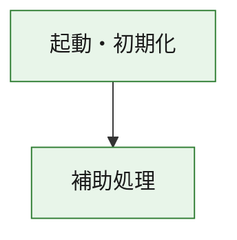
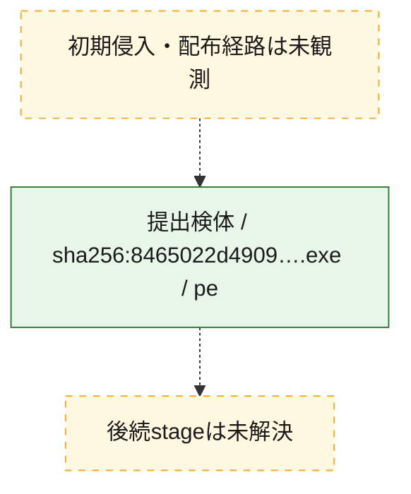
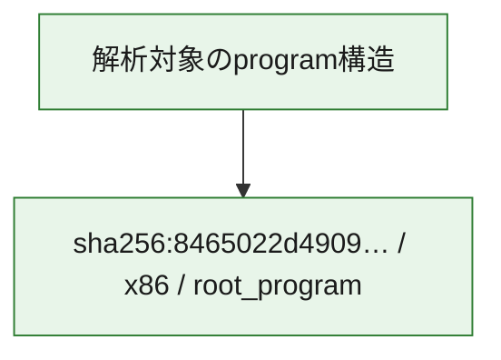

# 全体ロジック：8465022d4909c943a2811e743f5868b5647b5bec787e136f45b4b40f8ff8e519

代表関数の静的証跡から、起動・初期化の処理群を確認しました。

## 読み方

- phaseの掲載順は解析上の整理順です。observed_call_edgesがない段階間の実行順を断定しません。
- 図の実線は静的に観測した関係、点線と黄色のノードは未観測・未解決の関係を示します。
- 図は静的な要約であり、動的実行を再現するものではありません。
- 詳細な関数解説とfingerprintは[STATIC-LOGIC.md](STATIC-LOGIC.md)を参照してください。

## 静的可視化

### 実行フロー

### 感染チェーン

### モジュール関係

## 処理段階

### 1. 起動・初期化

entry pointから初期化と後続処理への移行を確認します。
確度: `confirmed_static_function_evidence`

- `8465022d4909c943a2811e743f5868b5647b5bec787e136f45b4b40f8ff8e519:ghidra:180001010` — 初期化と主要処理への分岐を行う入口関数です。 状態: `succeeded`、選定理由: `entry_point`, `meaningful_symbol_name`, `reviewed_call_centrality:22`, `role:entrypoint`, `small_program_complete_context`

### 2. 補助処理

主要処理を支える一般内部関数またはlibrary処理を確認します。
確度: `confirmed_static_function_evidence`

- `8465022d4909c943a2811e743f5868b5647b5bec787e136f45b4b40f8ff8e519:ghidra:180001240` — 検体内部の一般処理を実装する関数です。 状態: `succeeded`、選定理由: `context_representative`, `reviewed_call_centrality:2`, `small_program_complete_context`
- `8465022d4909c943a2811e743f5868b5647b5bec787e136f45b4b40f8ff8e519:ghidra:180001350` — 検体内部の一般処理を実装する関数です。 状態: `succeeded`、選定理由: `context_representative`, `reviewed_call_centrality:25`, `small_program_complete_context`
- `8465022d4909c943a2811e743f5868b5647b5bec787e136f45b4b40f8ff8e519:ghidra:180003780` — 検体内部の一般処理を実装する関数です。 状態: `succeeded`、選定理由: `context_representative`, `reviewed_call_centrality:2`, `small_program_complete_context`
- `8465022d4909c943a2811e743f5868b5647b5bec787e136f45b4b40f8ff8e519:ghidra:1800038e0` — 検体内部の一般処理を実装する関数です。 状態: `succeeded`、選定理由: `context_representative`, `reviewed_call_centrality:2`, `small_program_complete_context`

## 観測したcall関係

- `8465022d4909c943a2811e743f5868b5647b5bec787e136f45b4b40f8ff8e519:ghidra:180001010` → `8465022d4909c943a2811e743f5868b5647b5bec787e136f45b4b40f8ff8e519:ghidra:180001240` （`startup` → `support`）
- `8465022d4909c943a2811e743f5868b5647b5bec787e136f45b4b40f8ff8e519:ghidra:180001010` → `8465022d4909c943a2811e743f5868b5647b5bec787e136f45b4b40f8ff8e519:ghidra:180001350` （`startup` → `support`）
- `8465022d4909c943a2811e743f5868b5647b5bec787e136f45b4b40f8ff8e519:ghidra:180001350` → `8465022d4909c943a2811e743f5868b5647b5bec787e136f45b4b40f8ff8e519:ghidra:180001240` （`support` → `support`）
- `8465022d4909c943a2811e743f5868b5647b5bec787e136f45b4b40f8ff8e519:ghidra:180001350` → `8465022d4909c943a2811e743f5868b5647b5bec787e136f45b4b40f8ff8e519:ghidra:180003780` （`support` → `support`）
- `8465022d4909c943a2811e743f5868b5647b5bec787e136f45b4b40f8ff8e519:ghidra:180001350` → `8465022d4909c943a2811e743f5868b5647b5bec787e136f45b4b40f8ff8e519:ghidra:1800038e0` （`support` → `support`）
- `8465022d4909c943a2811e743f5868b5647b5bec787e136f45b4b40f8ff8e519:ghidra:180003780` → `8465022d4909c943a2811e743f5868b5647b5bec787e136f45b4b40f8ff8e519:ghidra:1800038e0` （`support` → `support`）
- `ghidra-function:7657762d691d352b5812ea65` → `ghidra-function:0a8c1f54ffacfd3092dc4c96` （`unclassified` → `unclassified`）
- `ghidra-function:7657762d691d352b5812ea65` → `ghidra-function:7d7cbdcc0c178814b4bd82c8` （`unclassified` → `unclassified`）
- `ghidra-function:7657762d691d352b5812ea65` → `ghidra-function:811f3d826c9e97d1a06c3333` （`unclassified` → `unclassified`）
- `ghidra-function:7657762d691d352b5812ea65` → `ghidra-function:84899f068af4302a47e72a6c` （`unclassified` → `unclassified`）
- `ghidra-function:7657762d691d352b5812ea65` → `ghidra-function:997a698780b7ffb83714f8de` （`unclassified` → `unclassified`）
- `ghidra-function:7657762d691d352b5812ea65` → `ghidra-function:9baf5e11189c1055309cb42d` （`unclassified` → `unclassified`）
- `ghidra-function:7657762d691d352b5812ea65` → `ghidra-function:9de84991bfb699aa269feb6e` （`unclassified` → `unclassified`）
- `ghidra-function:7657762d691d352b5812ea65` → `ghidra-function:c09f98ecf78fe8f92b1720e9` （`unclassified` → `unclassified`）
- `ghidra-function:7657762d691d352b5812ea65` → `ghidra-function:ca52d68d4ddc9db5060da6fb` （`unclassified` → `unclassified`）
- `ghidra-function:7657762d691d352b5812ea65` → `ghidra-function:cb9aa2de384d6c793c4c5a0d` （`unclassified` → `unclassified`）
- `ghidra-function:7657762d691d352b5812ea65` → `ghidra-function:e180cfc99655d4a0dbbc86f9` （`unclassified` → `unclassified`）
- `ghidra-function:7657762d691d352b5812ea65` → `ghidra-function:e32cfe9154504505bac68abe` （`unclassified` → `unclassified`）
- `ghidra-function:c09f98ecf78fe8f92b1720e9` → `ghidra-external:037b352bdb94e6bcf9ad96d2` （`unclassified` → `unclassified`）
- `ghidra-function:c09f98ecf78fe8f92b1720e9` → `ghidra-external:3e545f65e786f3e69d3d3b90` （`unclassified` → `unclassified`）
- `ghidra-function:c09f98ecf78fe8f92b1720e9` → `ghidra-external:45c8d01b3ecb06389fd8937c` （`unclassified` → `unclassified`）
- `ghidra-function:c09f98ecf78fe8f92b1720e9` → `ghidra-external:4e40acf18ccc52b85d15aa5b` （`unclassified` → `unclassified`）
- `ghidra-function:c09f98ecf78fe8f92b1720e9` → `ghidra-external:602ad3dfc971aa586cb347da` （`unclassified` → `unclassified`）
- `ghidra-function:c09f98ecf78fe8f92b1720e9` → `ghidra-external:75b6884bf89e78a8d591d307` （`unclassified` → `unclassified`）
- `ghidra-function:c09f98ecf78fe8f92b1720e9` → `ghidra-external:821b1afd1d683d97a99aad48` （`unclassified` → `unclassified`）
- `ghidra-function:c09f98ecf78fe8f92b1720e9` → `ghidra-external:84eff94e259381d9079c4d1a` （`unclassified` → `unclassified`）
- `ghidra-function:c09f98ecf78fe8f92b1720e9` → `ghidra-external:89da344a58fb1d29781d232c` （`unclassified` → `unclassified`）
- `ghidra-function:c09f98ecf78fe8f92b1720e9` → `ghidra-external:9294289eb48cfd2d337a1f1b` （`unclassified` → `unclassified`）
- `ghidra-function:c09f98ecf78fe8f92b1720e9` → `ghidra-external:92db57199a1f7587cf89032d` （`unclassified` → `unclassified`）
- `ghidra-function:c09f98ecf78fe8f92b1720e9` → `ghidra-external:9711fd7f1d01a30da946e84b` （`unclassified` → `unclassified`）
- `ghidra-function:c09f98ecf78fe8f92b1720e9` → `ghidra-external:97dfd8baf128568f08e738db` （`unclassified` → `unclassified`）
- `ghidra-function:c09f98ecf78fe8f92b1720e9` → `ghidra-external:acd1c7cc4d6407c6a93d646a` （`unclassified` → `unclassified`）
- `ghidra-function:c09f98ecf78fe8f92b1720e9` → `ghidra-external:acdb3253f614802a5078d387` （`unclassified` → `unclassified`）
- `ghidra-function:c09f98ecf78fe8f92b1720e9` → `ghidra-external:b3862ff0f08cbd6855169a37` （`unclassified` → `unclassified`）
- `ghidra-function:c09f98ecf78fe8f92b1720e9` → `ghidra-external:bdbb3243dbc590d8a76d9191` （`unclassified` → `unclassified`）
- `ghidra-function:c09f98ecf78fe8f92b1720e9` → `ghidra-external:cf19bab2e66f157718fc598d` （`unclassified` → `unclassified`）
- `ghidra-function:c09f98ecf78fe8f92b1720e9` → `ghidra-external:cf3ec51cc6a8a3cc998add10` （`unclassified` → `unclassified`）
- `ghidra-function:c09f98ecf78fe8f92b1720e9` → `ghidra-external:ea336d33e76aeabaa3abbf43` （`unclassified` → `unclassified`）
- `ghidra-function:c09f98ecf78fe8f92b1720e9` → `ghidra-external:fb861d474724d749438e2727` （`unclassified` → `unclassified`）
- `ghidra-function:c09f98ecf78fe8f92b1720e9` → `ghidra-function:0a8c1f54ffacfd3092dc4c96` （`unclassified` → `unclassified`）
- `ghidra-function:c09f98ecf78fe8f92b1720e9` → `ghidra-function:6deb838acdea373b9372d28d` （`unclassified` → `unclassified`）
- `ghidra-function:c09f98ecf78fe8f92b1720e9` → `ghidra-function:da7c9adb4c0e751961330525` （`unclassified` → `unclassified`）
- `ghidra-function:da7c9adb4c0e751961330525` → `ghidra-function:6deb838acdea373b9372d28d` （`unclassified` → `unclassified`）

## 解析範囲と制約

- 選定外関数は全体inventoryへ残しますが、関数本体の個別解説対象にはしていません。
- indirect call、難読化、packer、VM、壊れたcontrol flowによりcall関係が欠落する場合があります。
- 文書は静的解析に基づき、検体実行や外部通信による動的確認は行っていません。
