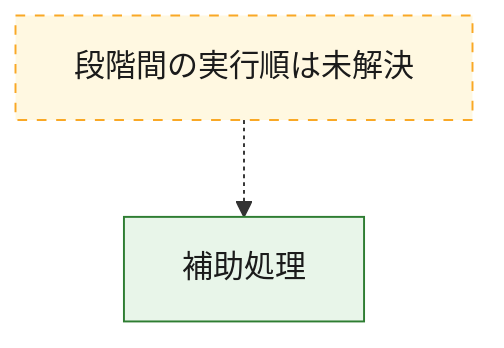
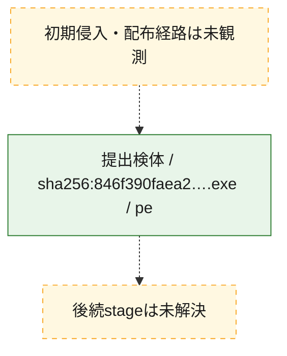
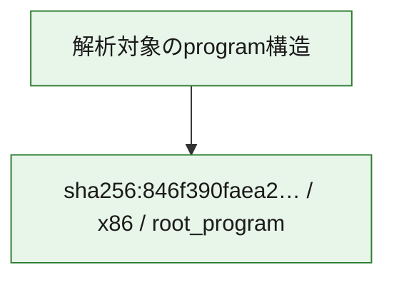

# 全体ロジック：846f390faea2a33d5ca0c1876292853c55439bd1c26c8206a62afcd4c7333593

代表関数から主要なmalware処理段階を自動分類できませんでした。

## 読み方

- phaseの掲載順は解析上の整理順です。observed_call_edgesがない段階間の実行順を断定しません。
- 図の実線は静的に観測した関係、点線と黄色のノードは未観測・未解決の関係を示します。
- 図は静的な要約であり、動的実行を再現するものではありません。
- 詳細な関数解説とfingerprintは[STATIC-LOGIC.md](STATIC-LOGIC.md)を参照してください。

## 静的可視化

### 実行フロー

### 感染チェーン

### モジュール関係

## 処理段階

### 1. 補助処理

主要処理を支える一般内部関数またはlibrary処理を確認します。
確度: `confirmed_static_function_evidence_with_limits`

- `846f390faea2a33d5ca0c1876292853c55439bd1c26c8206a62afcd4c7333593:ghidra:1400040c0` — 検体内部の一般処理を実装する関数です。 状態: `limited_bad_instruction_or_flow`、選定理由: `context_representative`, `reviewed_call_centrality:1`
- `846f390faea2a33d5ca0c1876292853c55439bd1c26c8206a62afcd4c7333593:ghidra:14000429c` — 検体内部の一般処理を実装する関数です。 状態: `limited_bad_instruction_or_flow`、選定理由: `context_representative`, `reviewed_call_centrality:1`
- `846f390faea2a33d5ca0c1876292853c55439bd1c26c8206a62afcd4c7333593:ghidra:1400042e4` — 検体内部の一般処理を実装する関数です。 状態: `limited_bad_instruction_or_flow`、選定理由: `context_representative`, `reviewed_call_centrality:1`
- `846f390faea2a33d5ca0c1876292853c55439bd1c26c8206a62afcd4c7333593:ghidra:14000430c` — 検体内部の一般処理を実装する関数です。 状態: `limited_bad_instruction_or_flow`、選定理由: `context_representative`, `reviewed_call_centrality:1`
- `846f390faea2a33d5ca0c1876292853c55439bd1c26c8206a62afcd4c7333593:ghidra:140004348` — 検体内部の一般処理を実装する関数です。 状態: `limited_bad_instruction_or_flow`、選定理由: `context_representative`, `reviewed_call_centrality:1`
- `846f390faea2a33d5ca0c1876292853c55439bd1c26c8206a62afcd4c7333593:ghidra:140004388` — 検体内部の一般処理を実装する関数です。 状態: `limited_bad_instruction_or_flow`、選定理由: `context_representative`, `reviewed_call_centrality:1`
- `846f390faea2a33d5ca0c1876292853c55439bd1c26c8206a62afcd4c7333593:ghidra:1400043ec` — 検体内部の一般処理を実装する関数です。 状態: `limited_bad_instruction_or_flow`、選定理由: `context_representative`, `reviewed_call_centrality:1`
- `846f390faea2a33d5ca0c1876292853c55439bd1c26c8206a62afcd4c7333593:ghidra:140004470` — 検体内部の一般処理を実装する関数です。 状態: `limited_bad_instruction_or_flow`、選定理由: `context_representative`, `reviewed_call_centrality:1`
- `846f390faea2a33d5ca0c1876292853c55439bd1c26c8206a62afcd4c7333593:ghidra:1400044e8` — 検体内部の一般処理を実装する関数です。 状態: `limited_bad_instruction_or_flow`、選定理由: `context_representative`, `reviewed_call_centrality:1`
- `846f390faea2a33d5ca0c1876292853c55439bd1c26c8206a62afcd4c7333593:ghidra:140004554` — 検体内部の一般処理を実装する関数です。 状態: `limited_bad_instruction_or_flow`、選定理由: `context_representative`, `reviewed_call_centrality:1`
- `846f390faea2a33d5ca0c1876292853c55439bd1c26c8206a62afcd4c7333593:ghidra:140004680` — 検体内部の一般処理を実装する関数です。 状態: `limited_bad_instruction_or_flow`、選定理由: `context_representative`, `reviewed_call_centrality:1`
- `846f390faea2a33d5ca0c1876292853c55439bd1c26c8206a62afcd4c7333593:ghidra:1400047ac` — 検体内部の一般処理を実装する関数です。 状態: `limited_bad_instruction_or_flow`、選定理由: `context_representative`, `reviewed_call_centrality:1`
- `846f390faea2a33d5ca0c1876292853c55439bd1c26c8206a62afcd4c7333593:ghidra:14000484c` — 検体内部の一般処理を実装する関数です。 状態: `limited_bad_instruction_or_flow`、選定理由: `context_representative`, `reviewed_call_centrality:1`
- `846f390faea2a33d5ca0c1876292853c55439bd1c26c8206a62afcd4c7333593:ghidra:1400048c8` — 検体内部の一般処理を実装する関数です。 状態: `limited_bad_instruction_or_flow`、選定理由: `context_representative`, `reviewed_call_centrality:1`
- `846f390faea2a33d5ca0c1876292853c55439bd1c26c8206a62afcd4c7333593:ghidra:140004950` — 検体内部の一般処理を実装する関数です。 状態: `limited_bad_instruction_or_flow`、選定理由: `context_representative`, `reviewed_call_centrality:1`
- `846f390faea2a33d5ca0c1876292853c55439bd1c26c8206a62afcd4c7333593:ghidra:1400049d8` — 検体内部の一般処理を実装する関数です。 状態: `limited_bad_instruction_or_flow`、選定理由: `context_representative`, `reviewed_call_centrality:1`
- `846f390faea2a33d5ca0c1876292853c55439bd1c26c8206a62afcd4c7333593:ghidra:1400049f0` — 検体内部の一般処理を実装する関数です。 状態: `limited_bad_instruction_or_flow`、選定理由: `context_representative`, `reviewed_call_centrality:1`
- `846f390faea2a33d5ca0c1876292853c55439bd1c26c8206a62afcd4c7333593:ghidra:140004a90` — 検体内部の一般処理を実装する関数です。 状態: `limited_bad_instruction_or_flow`、選定理由: `context_representative`, `reviewed_call_centrality:1`
- `846f390faea2a33d5ca0c1876292853c55439bd1c26c8206a62afcd4c7333593:ghidra:140004b18` — 検体内部の一般処理を実装する関数です。 状態: `limited_bad_instruction_or_flow`、選定理由: `context_representative`, `reviewed_call_centrality:1`
- `846f390faea2a33d5ca0c1876292853c55439bd1c26c8206a62afcd4c7333593:ghidra:140004b88` — 検体内部の一般処理を実装する関数です。 状態: `limited_bad_instruction_or_flow`、選定理由: `context_representative`, `reviewed_call_centrality:1`
- `846f390faea2a33d5ca0c1876292853c55439bd1c26c8206a62afcd4c7333593:ghidra:140004be8` — 検体内部の一般処理を実装する関数です。 状態: `limited_bad_instruction_or_flow`、選定理由: `context_representative`, `reviewed_call_centrality:1`
- `846f390faea2a33d5ca0c1876292853c55439bd1c26c8206a62afcd4c7333593:ghidra:140004c3c` — 検体内部の一般処理を実装する関数です。 状態: `limited_bad_instruction_or_flow`、選定理由: `context_representative`, `reviewed_call_centrality:1`
- `846f390faea2a33d5ca0c1876292853c55439bd1c26c8206a62afcd4c7333593:ghidra:140004cb4` — 検体内部の一般処理を実装する関数です。 状態: `limited_bad_instruction_or_flow`、選定理由: `context_representative`, `reviewed_call_centrality:1`
- `846f390faea2a33d5ca0c1876292853c55439bd1c26c8206a62afcd4c7333593:ghidra:140004d10` — 検体内部の一般処理を実装する関数です。 状態: `limited_bad_instruction_or_flow`、選定理由: `context_representative`, `reviewed_call_centrality:1`
- `846f390faea2a33d5ca0c1876292853c55439bd1c26c8206a62afcd4c7333593:ghidra:140004d68` — 検体内部の一般処理を実装する関数です。 状態: `limited_bad_instruction_or_flow`、選定理由: `context_representative`, `reviewed_call_centrality:1`
- `846f390faea2a33d5ca0c1876292853c55439bd1c26c8206a62afcd4c7333593:ghidra:140004df0` — 検体内部の一般処理を実装する関数です。 状態: `limited_bad_instruction_or_flow`、選定理由: `context_representative`, `reviewed_call_centrality:1`
- `846f390faea2a33d5ca0c1876292853c55439bd1c26c8206a62afcd4c7333593:ghidra:140004e70` — 検体内部の一般処理を実装する関数です。 状態: `limited_bad_instruction_or_flow`、選定理由: `context_representative`, `reviewed_call_centrality:1`
- `846f390faea2a33d5ca0c1876292853c55439bd1c26c8206a62afcd4c7333593:ghidra:140004ec4` — 検体内部の一般処理を実装する関数です。 状態: `limited_bad_instruction_or_flow`、選定理由: `context_representative`, `reviewed_call_centrality:1`
- `846f390faea2a33d5ca0c1876292853c55439bd1c26c8206a62afcd4c7333593:ghidra:140004f58` — 検体内部の一般処理を実装する関数です。 状態: `limited_bad_instruction_or_flow`、選定理由: `context_representative`, `reviewed_call_centrality:1`
- `846f390faea2a33d5ca0c1876292853c55439bd1c26c8206a62afcd4c7333593:ghidra:140004fac` — 検体内部の一般処理を実装する関数です。 状態: `limited_bad_instruction_or_flow`、選定理由: `context_representative`, `reviewed_call_centrality:1`
- `846f390faea2a33d5ca0c1876292853c55439bd1c26c8206a62afcd4c7333593:ghidra:140005044` — 検体内部の一般処理を実装する関数です。 状態: `limited_bad_instruction_or_flow`、選定理由: `context_representative`, `reviewed_call_centrality:1`
- `846f390faea2a33d5ca0c1876292853c55439bd1c26c8206a62afcd4c7333593:ghidra:140005120` — 検体内部の一般処理を実装する関数です。 状態: `limited_bad_instruction_or_flow`、選定理由: `context_representative`, `reviewed_call_centrality:1`

## 観測したcall関係

- `ghidra-function:0baeff60d85f6a8393c700a4` → `ghidra-external:3b65b677f6507796bdd60205` （`unclassified` → `unclassified`）
- `ghidra-function:0df708dfea82afd08694c1d8` → `ghidra-external:3b65b677f6507796bdd60205` （`unclassified` → `unclassified`）
- `ghidra-function:0e6d0f3d2b33bdc618a04b59` → `ghidra-external:3b65b677f6507796bdd60205` （`unclassified` → `unclassified`）
- `ghidra-function:0f5c93ccc740c980f8eec6e3` → `ghidra-external:3b65b677f6507796bdd60205` （`unclassified` → `unclassified`）
- `ghidra-function:135b362182d5c69bc5d67df6` → `ghidra-external:3b65b677f6507796bdd60205` （`unclassified` → `unclassified`）
- `ghidra-function:14dd036cad5912e932c1a254` → `ghidra-external:3b65b677f6507796bdd60205` （`unclassified` → `unclassified`）
- `ghidra-function:1529a6110ee8ac22a17da1e1` → `ghidra-external:3b65b677f6507796bdd60205` （`unclassified` → `unclassified`）
- `ghidra-function:17b0be9089f58ae012b33e71` → `ghidra-external:3b65b677f6507796bdd60205` （`unclassified` → `unclassified`）
- `ghidra-function:1dea784c42573715499d90fa` → `ghidra-external:3b65b677f6507796bdd60205` （`unclassified` → `unclassified`）
- `ghidra-function:297d19904930d5e2fb0c8360` → `ghidra-external:3b65b677f6507796bdd60205` （`unclassified` → `unclassified`）
- `ghidra-function:378475716ac08ce7704d0859` → `ghidra-external:3b65b677f6507796bdd60205` （`unclassified` → `unclassified`）
- `ghidra-function:3a6ecc6b8c31d4549059f474` → `ghidra-external:3b65b677f6507796bdd60205` （`unclassified` → `unclassified`）
- `ghidra-function:3c3b9212e604a62a87809866` → `ghidra-external:3b65b677f6507796bdd60205` （`unclassified` → `unclassified`）
- `ghidra-function:43d415ddd2a1314f0e684aae` → `ghidra-external:3b65b677f6507796bdd60205` （`unclassified` → `unclassified`）
- `ghidra-function:43d9b155f8b41498dfb542d9` → `ghidra-external:3b65b677f6507796bdd60205` （`unclassified` → `unclassified`）
- `ghidra-function:5f893e4a05e100efe6724fc2` → `ghidra-external:3b65b677f6507796bdd60205` （`unclassified` → `unclassified`）
- `ghidra-function:63014feb93853b21a2a69cc9` → `ghidra-external:3b65b677f6507796bdd60205` （`unclassified` → `unclassified`）
- `ghidra-function:63b85f17f1336e3243a4465d` → `ghidra-external:3b65b677f6507796bdd60205` （`unclassified` → `unclassified`）
- `ghidra-function:647b22e7605f9256ac8eb45d` → `ghidra-external:3b65b677f6507796bdd60205` （`unclassified` → `unclassified`）
- `ghidra-function:68465d53ee849ba7e8796362` → `ghidra-external:3b65b677f6507796bdd60205` （`unclassified` → `unclassified`）
- `ghidra-function:6d18767485cce2f6b06c7fdf` → `ghidra-external:3b65b677f6507796bdd60205` （`unclassified` → `unclassified`）
- `ghidra-function:77550b844f55cc687ba3fd19` → `ghidra-external:3b65b677f6507796bdd60205` （`unclassified` → `unclassified`）
- `ghidra-function:7cb5d5d073b0c630d89c50e7` → `ghidra-external:3b65b677f6507796bdd60205` （`unclassified` → `unclassified`）
- `ghidra-function:8a742a8059ecb08850af1fe4` → `ghidra-external:3b65b677f6507796bdd60205` （`unclassified` → `unclassified`）
- `ghidra-function:9ff6ddcdc15b2aaea87f1802` → `ghidra-external:3b65b677f6507796bdd60205` （`unclassified` → `unclassified`）
- `ghidra-function:a06b83d3e62ae9dd8742baf6` → `ghidra-external:3b65b677f6507796bdd60205` （`unclassified` → `unclassified`）
- `ghidra-function:a24b98910b258fc0a6cb9ea6` → `ghidra-external:3b65b677f6507796bdd60205` （`unclassified` → `unclassified`）
- `ghidra-function:b02f3ff782208be70cd10fdb` → `ghidra-external:3b65b677f6507796bdd60205` （`unclassified` → `unclassified`）
- `ghidra-function:c193d955cbee4d4f84e7aaaa` → `ghidra-external:3b65b677f6507796bdd60205` （`unclassified` → `unclassified`）
- `ghidra-function:c944df5c940896923490ca0c` → `ghidra-external:3b65b677f6507796bdd60205` （`unclassified` → `unclassified`）
- `ghidra-function:d343068c55c58fc74ac78bce` → `ghidra-external:3b65b677f6507796bdd60205` （`unclassified` → `unclassified`）
- `ghidra-function:de026cf2dea262e46360f8c4` → `ghidra-external:3b65b677f6507796bdd60205` （`unclassified` → `unclassified`）

## 解析範囲と制約

- 選定外関数は全体inventoryへ残しますが、関数本体の個別解説対象にはしていません。
- indirect call、難読化、packer、VM、壊れたcontrol flowによりcall関係が欠落する場合があります。
- 文書は静的解析に基づき、検体実行や外部通信による動的確認は行っていません。
