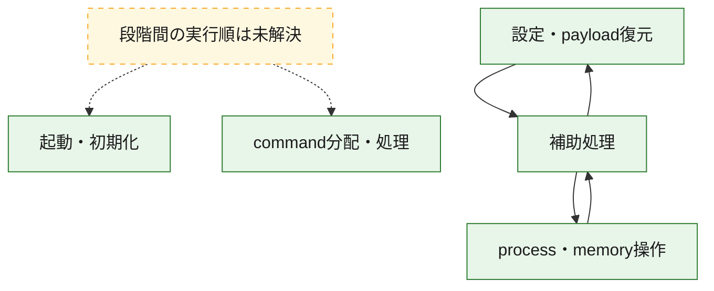
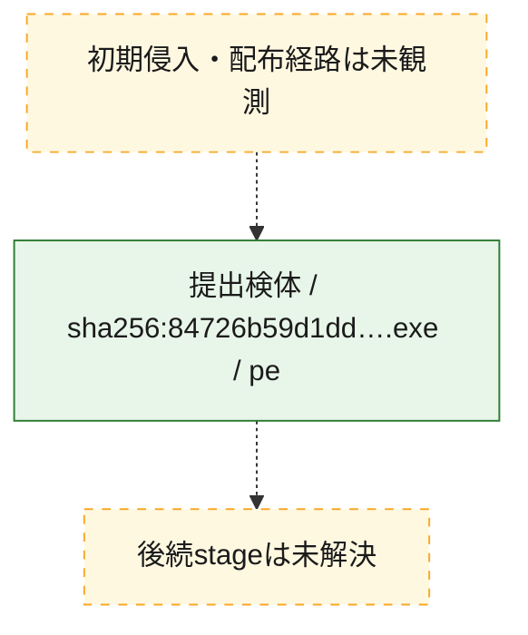
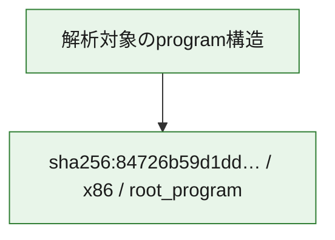

# 全体ロジック：84726b59d1ddd3f88abc4b164e8d5616fb65e1c0ea444473bcb995a0c25832fb

代表関数の静的証跡から、起動・初期化、設定・payload復元、process・memory操作、command分配・処理の処理群を確認しました。

## 読み方

- phaseの掲載順は解析上の整理順です。observed_call_edgesがない段階間の実行順を断定しません。
- 図の実線は静的に観測した関係、点線と黄色のノードは未観測・未解決の関係を示します。
- 図は静的な要約であり、動的実行を再現するものではありません。
- 詳細な関数解説とfingerprintは[STATIC-LOGIC.md](STATIC-LOGIC.md)を参照してください。

## 静的可視化

### 実行フロー

### 感染チェーン

### モジュール関係

## 処理段階

### 1. 起動・初期化

entry pointから初期化と後続処理への移行を確認します。
確度: `confirmed_static_function_evidence`

- `84726b59d1ddd3f88abc4b164e8d5616fb65e1c0ea444473bcb995a0c25832fb:ghidra:180002ce8` — 初期化と主要処理への分岐を行う入口関数です。 状態: `succeeded`、選定理由: `entry_point`, `meaningful_symbol_name`, `reviewed_call_centrality:5`, `role:entrypoint`

### 2. 設定・payload復元

設定、resource、payload、暗号化データの復元・変換を確認します。
確度: `confirmed_static_function_evidence`

- `84726b59d1ddd3f88abc4b164e8d5616fb65e1c0ea444473bcb995a0c25832fb:ghidra:1800012b0` — 暗号、hash、encoding、または復号処理に関係する関数です。 状態: `succeeded`、選定理由: `context_representative`, `reviewed_call_centrality:16`, `role:cryptographic_transform`

### 3. process・memory操作

process、thread、module、memory操作と実行移行を確認します。
確度: `confirmed_static_function_evidence`

- `84726b59d1ddd3f88abc4b164e8d5616fb65e1c0ea444473bcb995a0c25832fb:ghidra:180001988` — process、thread、module、またはmemory操作に関係する関数です。 状態: `succeeded`、選定理由: `context_representative`, `reviewed_call_centrality:16`, `role:process_or_memory_operation`
- `84726b59d1ddd3f88abc4b164e8d5616fb65e1c0ea444473bcb995a0c25832fb:ghidra:180001ca0` — process、thread、module、またはmemory操作に関係する関数です。 状態: `succeeded`、選定理由: `context_representative`, `reviewed_call_centrality:12`, `role:process_or_memory_operation`

### 4. command分配・処理

受信commandやtaskの解釈、分配、個別handlerへの移行を確認します。
確度: `confirmed_static_function_evidence_with_limits`

- `84726b59d1ddd3f88abc4b164e8d5616fb65e1c0ea444473bcb995a0c25832fb:ghidra:18000fb80` — commandの解釈、分配、または個別処理を担当する関数です。 状態: `limited_bad_instruction_or_flow`、選定理由: `meaningful_symbol_name`, `role:command_dispatch_or_handler`

### 5. 補助処理

主要処理を支える一般内部関数またはlibrary処理を確認します。
確度: `confirmed_static_function_evidence`

- `84726b59d1ddd3f88abc4b164e8d5616fb65e1c0ea444473bcb995a0c25832fb:ghidra:180001000` — 検体内部の一般処理を実装する関数です。 状態: `succeeded`、選定理由: `context_representative`, `reviewed_call_centrality:1`
- `84726b59d1ddd3f88abc4b164e8d5616fb65e1c0ea444473bcb995a0c25832fb:ghidra:180001048` — 検体内部の一般処理を実装する関数です。 状態: `succeeded`、選定理由: `context_representative`, `reviewed_call_centrality:2`
- `84726b59d1ddd3f88abc4b164e8d5616fb65e1c0ea444473bcb995a0c25832fb:ghidra:1800010c4` — 検体内部の一般処理を実装する関数です。 状態: `succeeded`、選定理由: `context_representative`, `reviewed_call_centrality:8`
- `84726b59d1ddd3f88abc4b164e8d5616fb65e1c0ea444473bcb995a0c25832fb:ghidra:1800010e4` — 検体内部の一般処理を実装する関数です。 状態: `succeeded`、選定理由: `context_representative`, `reviewed_call_centrality:1`
- `84726b59d1ddd3f88abc4b164e8d5616fb65e1c0ea444473bcb995a0c25832fb:ghidra:180001120` — 検体内部の一般処理を実装する関数です。 状態: `succeeded`、選定理由: `context_representative`, `reviewed_call_centrality:1`
- `84726b59d1ddd3f88abc4b164e8d5616fb65e1c0ea444473bcb995a0c25832fb:ghidra:18000115c` — 検体内部の一般処理を実装する関数です。 状態: `succeeded`、選定理由: `context_representative`, `reviewed_call_centrality:6`
- `84726b59d1ddd3f88abc4b164e8d5616fb65e1c0ea444473bcb995a0c25832fb:ghidra:180001170` — 検体内部の一般処理を実装する関数です。 状態: `succeeded`、選定理由: `context_representative`, `reviewed_call_centrality:6`
- `84726b59d1ddd3f88abc4b164e8d5616fb65e1c0ea444473bcb995a0c25832fb:ghidra:1800014ec` — 検体内部の一般処理を実装する関数です。 状態: `succeeded`、選定理由: `context_representative`, `reviewed_call_centrality:21`
- `84726b59d1ddd3f88abc4b164e8d5616fb65e1c0ea444473bcb995a0c25832fb:ghidra:18000190c` — 検体内部の一般処理を実装する関数です。 状態: `succeeded`、選定理由: `context_representative`, `reviewed_call_centrality:5`
- `84726b59d1ddd3f88abc4b164e8d5616fb65e1c0ea444473bcb995a0c25832fb:ghidra:180001dd0` — 検体内部の一般処理を実装する関数です。 状態: `succeeded`、選定理由: `context_representative`, `reviewed_call_centrality:5`
- `84726b59d1ddd3f88abc4b164e8d5616fb65e1c0ea444473bcb995a0c25832fb:ghidra:180001ee4` — 検体内部の一般処理を実装する関数です。 状態: `succeeded`、選定理由: `context_representative`, `reviewed_call_centrality:14`
- `84726b59d1ddd3f88abc4b164e8d5616fb65e1c0ea444473bcb995a0c25832fb:ghidra:180002044` — 検体内部の一般処理を実装する関数です。 状態: `succeeded`、選定理由: `context_representative`, `reviewed_call_centrality:7`
- `84726b59d1ddd3f88abc4b164e8d5616fb65e1c0ea444473bcb995a0c25832fb:ghidra:1800020cc` — 検体内部の一般処理を実装する関数です。 状態: `succeeded`、選定理由: `entry_point`, `meaningful_symbol_name`, `reviewed_call_centrality:17`
- `84726b59d1ddd3f88abc4b164e8d5616fb65e1c0ea444473bcb995a0c25832fb:ghidra:180002108` — 検体内部の一般処理を実装する関数です。 状態: `succeeded`、選定理由: `entry_point`, `meaningful_symbol_name`
- `84726b59d1ddd3f88abc4b164e8d5616fb65e1c0ea444473bcb995a0c25832fb:ghidra:180002114` — 検体内部の一般処理を実装する関数です。 状態: `succeeded`、選定理由: `context_representative`, `reviewed_call_centrality:4`
- `84726b59d1ddd3f88abc4b164e8d5616fb65e1c0ea444473bcb995a0c25832fb:ghidra:1800021e0` — 検体内部の一般処理を実装する関数です。 状態: `succeeded`、選定理由: `context_representative`, `reviewed_call_centrality:6`
- `84726b59d1ddd3f88abc4b164e8d5616fb65e1c0ea444473bcb995a0c25832fb:ghidra:180002254` — 検体内部の一般処理を実装する関数です。 状態: `succeeded`、選定理由: `context_representative`, `reviewed_call_centrality:6`
- `84726b59d1ddd3f88abc4b164e8d5616fb65e1c0ea444473bcb995a0c25832fb:ghidra:180002368` — 検体内部の一般処理を実装する関数です。 状態: `succeeded`、選定理由: `context_representative`, `reviewed_call_centrality:10`
- `84726b59d1ddd3f88abc4b164e8d5616fb65e1c0ea444473bcb995a0c25832fb:ghidra:180002488` — 検体内部の一般処理を実装する関数です。 状態: `succeeded`、選定理由: `context_representative`, `reviewed_call_centrality:9`
- `84726b59d1ddd3f88abc4b164e8d5616fb65e1c0ea444473bcb995a0c25832fb:ghidra:180002600` — 検体内部の一般処理を実装する関数です。 状態: `succeeded`、選定理由: `context_representative`, `reviewed_call_centrality:4`
- `84726b59d1ddd3f88abc4b164e8d5616fb65e1c0ea444473bcb995a0c25832fb:ghidra:180002620` — 検体内部の一般処理を実装する関数です。 状態: `succeeded`、選定理由: `context_representative`, `reviewed_call_centrality:10`
- `84726b59d1ddd3f88abc4b164e8d5616fb65e1c0ea444473bcb995a0c25832fb:ghidra:1800027b8` — 検体内部の一般処理を実装する関数です。 状態: `succeeded`、選定理由: `context_representative`, `reviewed_call_centrality:3`
- `84726b59d1ddd3f88abc4b164e8d5616fb65e1c0ea444473bcb995a0c25832fb:ghidra:1800027e0` — 検体内部の一般処理を実装する関数です。 状態: `succeeded`、選定理由: `context_representative`, `reviewed_call_centrality:1`
- `84726b59d1ddd3f88abc4b164e8d5616fb65e1c0ea444473bcb995a0c25832fb:ghidra:18000280c` — 検体内部の一般処理を実装する関数です。 状態: `succeeded`、選定理由: `context_representative`, `reviewed_call_centrality:9`
- `84726b59d1ddd3f88abc4b164e8d5616fb65e1c0ea444473bcb995a0c25832fb:ghidra:180002880` — 検体内部の一般処理を実装する関数です。 状態: `succeeded`、選定理由: `context_representative`, `reviewed_call_centrality:1`
- `84726b59d1ddd3f88abc4b164e8d5616fb65e1c0ea444473bcb995a0c25832fb:ghidra:1800028bc` — 検体内部の一般処理を実装する関数です。 状態: `succeeded`、選定理由: `context_representative`, `reviewed_call_centrality:1`
- `84726b59d1ddd3f88abc4b164e8d5616fb65e1c0ea444473bcb995a0c25832fb:ghidra:180002904` — 検体内部の一般処理を実装する関数です。 状態: `succeeded`、選定理由: `context_representative`, `reviewed_call_centrality:1`

## 観測したcall関係

- `84726b59d1ddd3f88abc4b164e8d5616fb65e1c0ea444473bcb995a0c25832fb:ghidra:180001170` → `84726b59d1ddd3f88abc4b164e8d5616fb65e1c0ea444473bcb995a0c25832fb:ghidra:180002368` （`support` → `support`）
- `84726b59d1ddd3f88abc4b164e8d5616fb65e1c0ea444473bcb995a0c25832fb:ghidra:180001170` → `84726b59d1ddd3f88abc4b164e8d5616fb65e1c0ea444473bcb995a0c25832fb:ghidra:180002600` （`support` → `support`）
- `84726b59d1ddd3f88abc4b164e8d5616fb65e1c0ea444473bcb995a0c25832fb:ghidra:1800012b0` → `84726b59d1ddd3f88abc4b164e8d5616fb65e1c0ea444473bcb995a0c25832fb:ghidra:180002368` （`configuration` → `support`）
- `84726b59d1ddd3f88abc4b164e8d5616fb65e1c0ea444473bcb995a0c25832fb:ghidra:1800012b0` → `84726b59d1ddd3f88abc4b164e8d5616fb65e1c0ea444473bcb995a0c25832fb:ghidra:180002600` （`configuration` → `support`）
- `84726b59d1ddd3f88abc4b164e8d5616fb65e1c0ea444473bcb995a0c25832fb:ghidra:1800014ec` → `84726b59d1ddd3f88abc4b164e8d5616fb65e1c0ea444473bcb995a0c25832fb:ghidra:1800010c4` （`support` → `support`）
- `84726b59d1ddd3f88abc4b164e8d5616fb65e1c0ea444473bcb995a0c25832fb:ghidra:1800014ec` → `84726b59d1ddd3f88abc4b164e8d5616fb65e1c0ea444473bcb995a0c25832fb:ghidra:18000115c` （`support` → `support`）
- `84726b59d1ddd3f88abc4b164e8d5616fb65e1c0ea444473bcb995a0c25832fb:ghidra:1800014ec` → `84726b59d1ddd3f88abc4b164e8d5616fb65e1c0ea444473bcb995a0c25832fb:ghidra:180002114` （`support` → `support`）
- `84726b59d1ddd3f88abc4b164e8d5616fb65e1c0ea444473bcb995a0c25832fb:ghidra:1800014ec` → `84726b59d1ddd3f88abc4b164e8d5616fb65e1c0ea444473bcb995a0c25832fb:ghidra:180002488` （`support` → `support`）
- `84726b59d1ddd3f88abc4b164e8d5616fb65e1c0ea444473bcb995a0c25832fb:ghidra:1800014ec` → `84726b59d1ddd3f88abc4b164e8d5616fb65e1c0ea444473bcb995a0c25832fb:ghidra:180002620` （`support` → `support`）
- `84726b59d1ddd3f88abc4b164e8d5616fb65e1c0ea444473bcb995a0c25832fb:ghidra:1800014ec` → `84726b59d1ddd3f88abc4b164e8d5616fb65e1c0ea444473bcb995a0c25832fb:ghidra:18000280c` （`support` → `support`）
- `84726b59d1ddd3f88abc4b164e8d5616fb65e1c0ea444473bcb995a0c25832fb:ghidra:180001988` → `84726b59d1ddd3f88abc4b164e8d5616fb65e1c0ea444473bcb995a0c25832fb:ghidra:18000115c` （`execution` → `support`）
- `84726b59d1ddd3f88abc4b164e8d5616fb65e1c0ea444473bcb995a0c25832fb:ghidra:180001988` → `84726b59d1ddd3f88abc4b164e8d5616fb65e1c0ea444473bcb995a0c25832fb:ghidra:180002114` （`execution` → `support`）
- `84726b59d1ddd3f88abc4b164e8d5616fb65e1c0ea444473bcb995a0c25832fb:ghidra:180001988` → `84726b59d1ddd3f88abc4b164e8d5616fb65e1c0ea444473bcb995a0c25832fb:ghidra:1800021e0` （`execution` → `support`）
- `84726b59d1ddd3f88abc4b164e8d5616fb65e1c0ea444473bcb995a0c25832fb:ghidra:180001988` → `84726b59d1ddd3f88abc4b164e8d5616fb65e1c0ea444473bcb995a0c25832fb:ghidra:180002254` （`execution` → `support`）
- `84726b59d1ddd3f88abc4b164e8d5616fb65e1c0ea444473bcb995a0c25832fb:ghidra:180001dd0` → `84726b59d1ddd3f88abc4b164e8d5616fb65e1c0ea444473bcb995a0c25832fb:ghidra:180001ca0` （`support` → `execution`）
- `84726b59d1ddd3f88abc4b164e8d5616fb65e1c0ea444473bcb995a0c25832fb:ghidra:180001ee4` → `84726b59d1ddd3f88abc4b164e8d5616fb65e1c0ea444473bcb995a0c25832fb:ghidra:180001170` （`support` → `support`）
- `84726b59d1ddd3f88abc4b164e8d5616fb65e1c0ea444473bcb995a0c25832fb:ghidra:180001ee4` → `84726b59d1ddd3f88abc4b164e8d5616fb65e1c0ea444473bcb995a0c25832fb:ghidra:1800012b0` （`support` → `configuration`）
- `84726b59d1ddd3f88abc4b164e8d5616fb65e1c0ea444473bcb995a0c25832fb:ghidra:180001ee4` → `84726b59d1ddd3f88abc4b164e8d5616fb65e1c0ea444473bcb995a0c25832fb:ghidra:1800014ec` （`support` → `support`）
- `84726b59d1ddd3f88abc4b164e8d5616fb65e1c0ea444473bcb995a0c25832fb:ghidra:180001ee4` → `84726b59d1ddd3f88abc4b164e8d5616fb65e1c0ea444473bcb995a0c25832fb:ghidra:18000190c` （`support` → `support`）
- `84726b59d1ddd3f88abc4b164e8d5616fb65e1c0ea444473bcb995a0c25832fb:ghidra:180001ee4` → `84726b59d1ddd3f88abc4b164e8d5616fb65e1c0ea444473bcb995a0c25832fb:ghidra:180001988` （`support` → `execution`）
- `84726b59d1ddd3f88abc4b164e8d5616fb65e1c0ea444473bcb995a0c25832fb:ghidra:180001ee4` → `84726b59d1ddd3f88abc4b164e8d5616fb65e1c0ea444473bcb995a0c25832fb:ghidra:180001dd0` （`support` → `support`）
- `84726b59d1ddd3f88abc4b164e8d5616fb65e1c0ea444473bcb995a0c25832fb:ghidra:180001ee4` → `84726b59d1ddd3f88abc4b164e8d5616fb65e1c0ea444473bcb995a0c25832fb:ghidra:1800021e0` （`support` → `support`）
- `84726b59d1ddd3f88abc4b164e8d5616fb65e1c0ea444473bcb995a0c25832fb:ghidra:1800020cc` → `84726b59d1ddd3f88abc4b164e8d5616fb65e1c0ea444473bcb995a0c25832fb:ghidra:180001170` （`support` → `support`）
- `84726b59d1ddd3f88abc4b164e8d5616fb65e1c0ea444473bcb995a0c25832fb:ghidra:1800020cc` → `84726b59d1ddd3f88abc4b164e8d5616fb65e1c0ea444473bcb995a0c25832fb:ghidra:1800012b0` （`support` → `configuration`）
- `84726b59d1ddd3f88abc4b164e8d5616fb65e1c0ea444473bcb995a0c25832fb:ghidra:1800020cc` → `84726b59d1ddd3f88abc4b164e8d5616fb65e1c0ea444473bcb995a0c25832fb:ghidra:1800014ec` （`support` → `support`）
- `84726b59d1ddd3f88abc4b164e8d5616fb65e1c0ea444473bcb995a0c25832fb:ghidra:1800020cc` → `84726b59d1ddd3f88abc4b164e8d5616fb65e1c0ea444473bcb995a0c25832fb:ghidra:18000190c` （`support` → `support`）
- `84726b59d1ddd3f88abc4b164e8d5616fb65e1c0ea444473bcb995a0c25832fb:ghidra:1800020cc` → `84726b59d1ddd3f88abc4b164e8d5616fb65e1c0ea444473bcb995a0c25832fb:ghidra:180001988` （`support` → `execution`）
- `84726b59d1ddd3f88abc4b164e8d5616fb65e1c0ea444473bcb995a0c25832fb:ghidra:1800020cc` → `84726b59d1ddd3f88abc4b164e8d5616fb65e1c0ea444473bcb995a0c25832fb:ghidra:180001dd0` （`support` → `support`）
- `84726b59d1ddd3f88abc4b164e8d5616fb65e1c0ea444473bcb995a0c25832fb:ghidra:1800020cc` → `84726b59d1ddd3f88abc4b164e8d5616fb65e1c0ea444473bcb995a0c25832fb:ghidra:180002044` （`support` → `support`）
- `84726b59d1ddd3f88abc4b164e8d5616fb65e1c0ea444473bcb995a0c25832fb:ghidra:1800020cc` → `84726b59d1ddd3f88abc4b164e8d5616fb65e1c0ea444473bcb995a0c25832fb:ghidra:1800021e0` （`support` → `support`）
- `84726b59d1ddd3f88abc4b164e8d5616fb65e1c0ea444473bcb995a0c25832fb:ghidra:180002114` → `84726b59d1ddd3f88abc4b164e8d5616fb65e1c0ea444473bcb995a0c25832fb:ghidra:180002620` （`support` → `support`）
- `84726b59d1ddd3f88abc4b164e8d5616fb65e1c0ea444473bcb995a0c25832fb:ghidra:180002254` → `84726b59d1ddd3f88abc4b164e8d5616fb65e1c0ea444473bcb995a0c25832fb:ghidra:1800010c4` （`support` → `support`）
- `84726b59d1ddd3f88abc4b164e8d5616fb65e1c0ea444473bcb995a0c25832fb:ghidra:180002254` → `84726b59d1ddd3f88abc4b164e8d5616fb65e1c0ea444473bcb995a0c25832fb:ghidra:18000280c` （`support` → `support`）
- `84726b59d1ddd3f88abc4b164e8d5616fb65e1c0ea444473bcb995a0c25832fb:ghidra:180002368` → `84726b59d1ddd3f88abc4b164e8d5616fb65e1c0ea444473bcb995a0c25832fb:ghidra:180002600` （`support` → `support`）
- `84726b59d1ddd3f88abc4b164e8d5616fb65e1c0ea444473bcb995a0c25832fb:ghidra:180002368` → `84726b59d1ddd3f88abc4b164e8d5616fb65e1c0ea444473bcb995a0c25832fb:ghidra:1800027b8` （`support` → `support`）
- `84726b59d1ddd3f88abc4b164e8d5616fb65e1c0ea444473bcb995a0c25832fb:ghidra:180002368` → `84726b59d1ddd3f88abc4b164e8d5616fb65e1c0ea444473bcb995a0c25832fb:ghidra:18000280c` （`support` → `support`）
- `84726b59d1ddd3f88abc4b164e8d5616fb65e1c0ea444473bcb995a0c25832fb:ghidra:180002488` → `84726b59d1ddd3f88abc4b164e8d5616fb65e1c0ea444473bcb995a0c25832fb:ghidra:1800010c4` （`support` → `support`）
- `84726b59d1ddd3f88abc4b164e8d5616fb65e1c0ea444473bcb995a0c25832fb:ghidra:180002488` → `84726b59d1ddd3f88abc4b164e8d5616fb65e1c0ea444473bcb995a0c25832fb:ghidra:18000115c` （`support` → `support`）
- `84726b59d1ddd3f88abc4b164e8d5616fb65e1c0ea444473bcb995a0c25832fb:ghidra:180002488` → `84726b59d1ddd3f88abc4b164e8d5616fb65e1c0ea444473bcb995a0c25832fb:ghidra:18000280c` （`support` → `support`）
- `84726b59d1ddd3f88abc4b164e8d5616fb65e1c0ea444473bcb995a0c25832fb:ghidra:180002620` → `84726b59d1ddd3f88abc4b164e8d5616fb65e1c0ea444473bcb995a0c25832fb:ghidra:1800010c4` （`support` → `support`）
- `84726b59d1ddd3f88abc4b164e8d5616fb65e1c0ea444473bcb995a0c25832fb:ghidra:180002620` → `84726b59d1ddd3f88abc4b164e8d5616fb65e1c0ea444473bcb995a0c25832fb:ghidra:18000115c` （`support` → `support`）
- `84726b59d1ddd3f88abc4b164e8d5616fb65e1c0ea444473bcb995a0c25832fb:ghidra:180002620` → `84726b59d1ddd3f88abc4b164e8d5616fb65e1c0ea444473bcb995a0c25832fb:ghidra:18000280c` （`support` → `support`）
- `84726b59d1ddd3f88abc4b164e8d5616fb65e1c0ea444473bcb995a0c25832fb:ghidra:18000280c` → `84726b59d1ddd3f88abc4b164e8d5616fb65e1c0ea444473bcb995a0c25832fb:ghidra:1800010c4` （`support` → `support`）
- `ghidra-function:130b6e663f77da74538368c6` → `ghidra-external:27c23a55854aa6502c4375ad` （`unclassified` → `unclassified`）
- `ghidra-function:130b6e663f77da74538368c6` → `ghidra-external:af7bd248cc4339f3a6e141f4` （`unclassified` → `unclassified`）
- `ghidra-function:130b6e663f77da74538368c6` → `ghidra-function:1048705b4cc283442f002f13` （`unclassified` → `unclassified`）
- `ghidra-function:14f6a37cdb4234fb8542d358` → `ghidra-external:27c23a55854aa6502c4375ad` （`unclassified` → `unclassified`）
- `ghidra-function:14f6a37cdb4234fb8542d358` → `ghidra-external:af7bd248cc4339f3a6e141f4` （`unclassified` → `unclassified`）
- `ghidra-function:14f6a37cdb4234fb8542d358` → `ghidra-function:1048705b4cc283442f002f13` （`unclassified` → `unclassified`）
- `ghidra-function:14f6a37cdb4234fb8542d358` → `ghidra-function:1df1cfb9e2c76494aa942fe3` （`unclassified` → `unclassified`）
- `ghidra-function:14f6a37cdb4234fb8542d358` → `ghidra-function:421b4daee96ffb44e84544f4` （`unclassified` → `unclassified`）
- `ghidra-function:14f6a37cdb4234fb8542d358` → `ghidra-function:9d467fdb8dcb03f5cb597c18` （`unclassified` → `unclassified`）
- `ghidra-function:14f6a37cdb4234fb8542d358` → `ghidra-function:aad61137d2ed42307a3821b1` （`unclassified` → `unclassified`）
- `ghidra-function:14f6a37cdb4234fb8542d358` → `ghidra-function:e122129a73f243410e521902` （`unclassified` → `unclassified`）
- `ghidra-function:1df1cfb9e2c76494aa942fe3` → `ghidra-external:af7bd248cc4339f3a6e141f4` （`unclassified` → `unclassified`）
- `ghidra-function:1df1cfb9e2c76494aa942fe3` → `ghidra-function:f0823e9403f7c589135abc5c` （`unclassified` → `unclassified`）
- `ghidra-function:285237c936c4b85391f44336` → `ghidra-function:c7e0de09c61969d8a2109913` （`unclassified` → `unclassified`）
- `ghidra-function:2ffea0310a542490614b52b2` → `ghidra-external:27c23a55854aa6502c4375ad` （`unclassified` → `unclassified`）
- `ghidra-function:2ffea0310a542490614b52b2` → `ghidra-external:af7bd248cc4339f3a6e141f4` （`unclassified` → `unclassified`）
- `ghidra-function:2ffea0310a542490614b52b2` → `ghidra-function:1048705b4cc283442f002f13` （`unclassified` → `unclassified`）
- `ghidra-function:2ffea0310a542490614b52b2` → `ghidra-function:130b6e663f77da74538368c6` （`unclassified` → `unclassified`）
- `ghidra-function:2ffea0310a542490614b52b2` → `ghidra-function:456396416727956a08a18c70` （`unclassified` → `unclassified`）
- `ghidra-function:2ffea0310a542490614b52b2` → `ghidra-function:48927aa378168e3cb3deebfb` （`unclassified` → `unclassified`）
- `ghidra-function:2ffea0310a542490614b52b2` → `ghidra-function:6adbe5e28f16752cb069969b` （`unclassified` → `unclassified`）
- `ghidra-function:2ffea0310a542490614b52b2` → `ghidra-function:73ef1bc075671858ebe893fc` （`unclassified` → `unclassified`）
- `ghidra-function:2ffea0310a542490614b52b2` → `ghidra-function:c0712b3c12cb5666f92cc8b2` （`unclassified` → `unclassified`）
- `ghidra-function:2ffea0310a542490614b52b2` → `ghidra-function:c22267bdeb92eb2ba2f95f01` （`unclassified` → `unclassified`）
- `ghidra-function:2ffea0310a542490614b52b2` → `ghidra-function:ca25580eb72a0296606b88c6` （`unclassified` → `unclassified`）
- `ghidra-function:2ffea0310a542490614b52b2` → `ghidra-function:e1b83c090131e6a1e771cc60` （`unclassified` → `unclassified`）
- `ghidra-function:366cde0439203b59ef8a0f3b` → `ghidra-function:7ea5d97cc0989a6f5dc0e1f6` （`unclassified` → `unclassified`）
- `ghidra-function:366cde0439203b59ef8a0f3b` → `ghidra-function:825b0b51509cc0136f4d833d` （`unclassified` → `unclassified`）
- `ghidra-function:366cde0439203b59ef8a0f3b` → `ghidra-function:d061c2d8dcbe0390de47401b` （`unclassified` → `unclassified`）
- `ghidra-function:39ed9af6034d8d3e8afd2d4a` → `ghidra-function:318e777db261315174845874` （`unclassified` → `unclassified`）
- `ghidra-function:39ed9af6034d8d3e8afd2d4a` → `ghidra-function:357cb94a4ae8c3fe9dca569f` （`unclassified` → `unclassified`）
- `ghidra-function:39ed9af6034d8d3e8afd2d4a` → `ghidra-function:5d69cd06a47c0317543ecab8` （`unclassified` → `unclassified`）
- `ghidra-function:39ed9af6034d8d3e8afd2d4a` → `ghidra-function:92b8cee29091fcfcf479bff3` （`unclassified` → `unclassified`）
- `ghidra-function:39ed9af6034d8d3e8afd2d4a` → `ghidra-function:b3be64a0776f5e54146a6db4` （`unclassified` → `unclassified`）
- `ghidra-function:39ed9af6034d8d3e8afd2d4a` → `ghidra-function:f252857ca4614b0fd8f48782` （`unclassified` → `unclassified`）
- `ghidra-function:456396416727956a08a18c70` → `ghidra-external:27c23a55854aa6502c4375ad` （`unclassified` → `unclassified`）
- `ghidra-function:456396416727956a08a18c70` → `ghidra-external:561404833e4358110f5cb7a0` （`unclassified` → `unclassified`）
- `ghidra-function:456396416727956a08a18c70` → `ghidra-external:af7bd248cc4339f3a6e141f4` （`unclassified` → `unclassified`）
- `ghidra-function:456396416727956a08a18c70` → `ghidra-external:bb91bed1e58fe9161654c126` （`unclassified` → `unclassified`）
- `ghidra-function:456396416727956a08a18c70` → `ghidra-function:1048705b4cc283442f002f13` （`unclassified` → `unclassified`）
- `ghidra-function:456396416727956a08a18c70` → `ghidra-function:130b6e663f77da74538368c6` （`unclassified` → `unclassified`）
- `ghidra-function:456396416727956a08a18c70` → `ghidra-function:1df1cfb9e2c76494aa942fe3` （`unclassified` → `unclassified`）
- `ghidra-function:456396416727956a08a18c70` → `ghidra-function:4e228cb9ec4754af7afe4255` （`unclassified` → `unclassified`）
- `ghidra-function:456396416727956a08a18c70` → `ghidra-function:947322fc5ecc9a21fc647f3c` （`unclassified` → `unclassified`）
- `ghidra-function:456396416727956a08a18c70` → `ghidra-function:97edf81a88e715c6b70b8bb5` （`unclassified` → `unclassified`）
- `ghidra-function:456396416727956a08a18c70` → `ghidra-function:b3be64a0776f5e54146a6db4` （`unclassified` → `unclassified`）
- `ghidra-function:456396416727956a08a18c70` → `ghidra-function:f252857ca4614b0fd8f48782` （`unclassified` → `unclassified`）
- `ghidra-function:48927aa378168e3cb3deebfb` → `ghidra-function:87ae1bc53c30e1bb492a7302` （`unclassified` → `unclassified`）
- `ghidra-function:48927aa378168e3cb3deebfb` → `ghidra-function:8bf313324d204714640a57cf` （`unclassified` → `unclassified`）
- `ghidra-function:48927aa378168e3cb3deebfb` → `ghidra-function:fe9f7a2f9c0810ed2e43a328` （`unclassified` → `unclassified`）
- `ghidra-function:4e228cb9ec4754af7afe4255` → `ghidra-function:421b4daee96ffb44e84544f4` （`unclassified` → `unclassified`）
- `ghidra-function:4e228cb9ec4754af7afe4255` → `ghidra-function:f73662caabea535159489055` （`unclassified` → `unclassified`）
- `ghidra-function:5e43bec0dd4241d6a807d94c` → `ghidra-external:af7bd248cc4339f3a6e141f4` （`unclassified` → `unclassified`）
- `ghidra-function:5e43bec0dd4241d6a807d94c` → `ghidra-function:f0823e9403f7c589135abc5c` （`unclassified` → `unclassified`）
- `ghidra-function:5f6c9999461a8df463503d86` → `ghidra-function:b3be64a0776f5e54146a6db4` （`unclassified` → `unclassified`）
- `ghidra-function:6192f2371fe8ff8163437f45` → `ghidra-function:c7e0de09c61969d8a2109913` （`unclassified` → `unclassified`）
- `ghidra-function:625c8572f3cfd048a8279a1b` → `ghidra-function:c7e0de09c61969d8a2109913` （`unclassified` → `unclassified`）
- `ghidra-function:6adbe5e28f16752cb069969b` → `ghidra-function:318e777db261315174845874` （`unclassified` → `unclassified`）
- `ghidra-function:6adbe5e28f16752cb069969b` → `ghidra-function:39ed9af6034d8d3e8afd2d4a` （`unclassified` → `unclassified`）
- `ghidra-function:73ef1bc075671858ebe893fc` → `ghidra-external:27c23a55854aa6502c4375ad` （`unclassified` → `unclassified`）
- `ghidra-function:73ef1bc075671858ebe893fc` → `ghidra-external:933ab3dac72abb300a8c5e0b` （`unclassified` → `unclassified`）
- `ghidra-function:73ef1bc075671858ebe893fc` → `ghidra-external:af7bd248cc4339f3a6e141f4` （`unclassified` → `unclassified`）
- `ghidra-function:73ef1bc075671858ebe893fc` → `ghidra-external:ed7537d5a70e3ed6c5b5cbbf` （`unclassified` → `unclassified`）
- `ghidra-function:73ef1bc075671858ebe893fc` → `ghidra-function:052f1a59f69f7531518b8d11` （`unclassified` → `unclassified`）
- `ghidra-function:73ef1bc075671858ebe893fc` → `ghidra-function:1048705b4cc283442f002f13` （`unclassified` → `unclassified`）
- `ghidra-function:73ef1bc075671858ebe893fc` → `ghidra-function:14f6a37cdb4234fb8542d358` （`unclassified` → `unclassified`）
- `ghidra-function:73ef1bc075671858ebe893fc` → `ghidra-function:1df1cfb9e2c76494aa942fe3` （`unclassified` → `unclassified`）
- `ghidra-function:73ef1bc075671858ebe893fc` → `ghidra-function:421b4daee96ffb44e84544f4` （`unclassified` → `unclassified`）
- `ghidra-function:73ef1bc075671858ebe893fc` → `ghidra-function:4e228cb9ec4754af7afe4255` （`unclassified` → `unclassified`）
- `ghidra-function:73ef1bc075671858ebe893fc` → `ghidra-function:9d467fdb8dcb03f5cb597c18` （`unclassified` → `unclassified`）
- `ghidra-function:73ef1bc075671858ebe893fc` → `ghidra-function:aad61137d2ed42307a3821b1` （`unclassified` → `unclassified`）
- `ghidra-function:73ef1bc075671858ebe893fc` → `ghidra-function:ab6463217be8e08495965388` （`unclassified` → `unclassified`）
- `ghidra-function:73ef1bc075671858ebe893fc` → `ghidra-function:e122129a73f243410e521902` （`unclassified` → `unclassified`）
- `ghidra-function:73ef1bc075671858ebe893fc` → `ghidra-function:ea803c074ef370b51c6f98a0` （`unclassified` → `unclassified`）
- `ghidra-function:73ef1bc075671858ebe893fc` → `ghidra-function:f2f4ac2547a4a42c5a8d595b` （`unclassified` → `unclassified`）
- `ghidra-function:73ef1bc075671858ebe893fc` → `ghidra-function:f73662caabea535159489055` （`unclassified` → `unclassified`）
- `ghidra-function:91ef0f7d88842ab88c95cf3c` → `ghidra-external:902acc621e347447fff36f52` （`unclassified` → `unclassified`）
- `ghidra-function:91ef0f7d88842ab88c95cf3c` → `ghidra-external:d27794739a87405f985665db` （`unclassified` → `unclassified`）
- `ghidra-function:91ef0f7d88842ab88c95cf3c` → `ghidra-function:30945d2770ea2e31b02ebfef` （`unclassified` → `unclassified`）
- `ghidra-function:91ef0f7d88842ab88c95cf3c` → `ghidra-function:9d437f56dcc01bf3221f858d` （`unclassified` → `unclassified`）
- `ghidra-function:91ef0f7d88842ab88c95cf3c` → `ghidra-function:f58ae127c77778fc4053174f` （`unclassified` → `unclassified`）
- `ghidra-function:947322fc5ecc9a21fc647f3c` → `ghidra-external:af7bd248cc4339f3a6e141f4` （`unclassified` → `unclassified`）
- `ghidra-function:947322fc5ecc9a21fc647f3c` → `ghidra-function:421b4daee96ffb44e84544f4` （`unclassified` → `unclassified`）
- `ghidra-function:947322fc5ecc9a21fc647f3c` → `ghidra-function:9d467fdb8dcb03f5cb597c18` （`unclassified` → `unclassified`）
- `ghidra-function:947322fc5ecc9a21fc647f3c` → `ghidra-function:aad61137d2ed42307a3821b1` （`unclassified` → `unclassified`）
- `ghidra-function:947322fc5ecc9a21fc647f3c` → `ghidra-function:e122129a73f243410e521902` （`unclassified` → `unclassified`）
- `ghidra-function:9d467fdb8dcb03f5cb597c18` → `ghidra-external:af7bd248cc4339f3a6e141f4` （`unclassified` → `unclassified`）
- `ghidra-function:9d467fdb8dcb03f5cb597c18` → `ghidra-external:c2e7415edd5af88602c2681d` （`unclassified` → `unclassified`）
- `ghidra-function:9d467fdb8dcb03f5cb597c18` → `ghidra-function:484849027c27395b2036011d` （`unclassified` → `unclassified`）
- `ghidra-function:a0a4d3c9d63d7b8e739f36c2` → `ghidra-function:c7e0de09c61969d8a2109913` （`unclassified` → `unclassified`）
- `ghidra-function:a9983949bee9762ce6a53b5d` → `ghidra-function:c7e0de09c61969d8a2109913` （`unclassified` → `unclassified`）
- `ghidra-function:c22267bdeb92eb2ba2f95f01` → `ghidra-function:14272f07a8256c66e05f6587` （`unclassified` → `unclassified`）
- `ghidra-function:c22267bdeb92eb2ba2f95f01` → `ghidra-function:221a792371c9b158c0cb9336` （`unclassified` → `unclassified`）
- `ghidra-function:c22267bdeb92eb2ba2f95f01` → `ghidra-function:5f6c9999461a8df463503d86` （`unclassified` → `unclassified`）
- `ghidra-function:c22267bdeb92eb2ba2f95f01` → `ghidra-function:62ee1b761fc1af9165a5f9cf` （`unclassified` → `unclassified`）
- `ghidra-function:c22267bdeb92eb2ba2f95f01` → `ghidra-function:8d45c4b88bc3e0a7a5f3a3dc` （`unclassified` → `unclassified`）
- `ghidra-function:c22267bdeb92eb2ba2f95f01` → `ghidra-function:ade54ae152a771e4853a8043` （`unclassified` → `unclassified`）
- `ghidra-function:c22267bdeb92eb2ba2f95f01` → `ghidra-function:e67774ce63495f98ad1bddc6` （`unclassified` → `unclassified`）
- `ghidra-function:c22267bdeb92eb2ba2f95f01` → `ghidra-function:f72b681381848c22fe9ea62f` （`unclassified` → `unclassified`）
- `ghidra-function:ca25580eb72a0296606b88c6` → `ghidra-function:5f6c9999461a8df463503d86` （`unclassified` → `unclassified`）
- `ghidra-function:ca25580eb72a0296606b88c6` → `ghidra-function:ecd06ab3cfe655f451fe953d` （`unclassified` → `unclassified`）
- `ghidra-function:ca25580eb72a0296606b88c6` → `ghidra-function:f72b681381848c22fe9ea62f` （`unclassified` → `unclassified`）
- `ghidra-function:d212e12e7e8404d6b4a5e0c8` → `ghidra-external:27c23a55854aa6502c4375ad` （`unclassified` → `unclassified`）
- `ghidra-function:d212e12e7e8404d6b4a5e0c8` → `ghidra-external:af7bd248cc4339f3a6e141f4` （`unclassified` → `unclassified`）
- `ghidra-function:d212e12e7e8404d6b4a5e0c8` → `ghidra-function:1048705b4cc283442f002f13` （`unclassified` → `unclassified`）
- `ghidra-function:d212e12e7e8404d6b4a5e0c8` → `ghidra-function:130b6e663f77da74538368c6` （`unclassified` → `unclassified`）
- `ghidra-function:d212e12e7e8404d6b4a5e0c8` → `ghidra-function:366cde0439203b59ef8a0f3b` （`unclassified` → `unclassified`）
- `ghidra-function:d212e12e7e8404d6b4a5e0c8` → `ghidra-function:456396416727956a08a18c70` （`unclassified` → `unclassified`）
- `ghidra-function:d212e12e7e8404d6b4a5e0c8` → `ghidra-function:48927aa378168e3cb3deebfb` （`unclassified` → `unclassified`）
- `ghidra-function:d212e12e7e8404d6b4a5e0c8` → `ghidra-function:6adbe5e28f16752cb069969b` （`unclassified` → `unclassified`）
- `ghidra-function:d212e12e7e8404d6b4a5e0c8` → `ghidra-function:73ef1bc075671858ebe893fc` （`unclassified` → `unclassified`）
- `ghidra-function:d212e12e7e8404d6b4a5e0c8` → `ghidra-function:c0712b3c12cb5666f92cc8b2` （`unclassified` → `unclassified`）
- `ghidra-function:d212e12e7e8404d6b4a5e0c8` → `ghidra-function:c20366d87db9dfc575f21471` （`unclassified` → `unclassified`）
- `ghidra-function:d212e12e7e8404d6b4a5e0c8` → `ghidra-function:c22267bdeb92eb2ba2f95f01` （`unclassified` → `unclassified`）
- `ghidra-function:d212e12e7e8404d6b4a5e0c8` → `ghidra-function:ca25580eb72a0296606b88c6` （`unclassified` → `unclassified`）
- `ghidra-function:d212e12e7e8404d6b4a5e0c8` → `ghidra-function:e1b83c090131e6a1e771cc60` （`unclassified` → `unclassified`）
- `ghidra-function:e122129a73f243410e521902` → `ghidra-external:af7bd248cc4339f3a6e141f4` （`unclassified` → `unclassified`）
- `ghidra-function:e122129a73f243410e521902` → `ghidra-function:1048705b4cc283442f002f13` （`unclassified` → `unclassified`）
- `ghidra-function:e122129a73f243410e521902` → `ghidra-function:9d467fdb8dcb03f5cb597c18` （`unclassified` → `unclassified`）
- `ghidra-function:e122129a73f243410e521902` → `ghidra-function:aad61137d2ed42307a3821b1` （`unclassified` → `unclassified`）
- `ghidra-function:e12cbfe2b5d7c5d71df9d574` → `ghidra-function:c7e0de09c61969d8a2109913` （`unclassified` → `unclassified`）
- `ghidra-function:ef804d3dd4c0a28558c0795b` → `ghidra-function:421b4daee96ffb44e84544f4` （`unclassified` → `unclassified`）
- `ghidra-function:f72b681381848c22fe9ea62f` → `ghidra-external:27c23a55854aa6502c4375ad` （`unclassified` → `unclassified`）
- `ghidra-function:f72b681381848c22fe9ea62f` → `ghidra-external:af7bd248cc4339f3a6e141f4` （`unclassified` → `unclassified`）
- `ghidra-function:f72b681381848c22fe9ea62f` → `ghidra-external:f4a7aa4f779cb7fd66b81d38` （`unclassified` → `unclassified`）
- `ghidra-function:f72b681381848c22fe9ea62f` → `ghidra-function:1048705b4cc283442f002f13` （`unclassified` → `unclassified`）
- `ghidra-function:f72b681381848c22fe9ea62f` → `ghidra-function:5e43bec0dd4241d6a807d94c` （`unclassified` → `unclassified`）
- `ghidra-function:f72b681381848c22fe9ea62f` → `ghidra-function:5f6c9999461a8df463503d86` （`unclassified` → `unclassified`）
- `ghidra-function:f72b681381848c22fe9ea62f` → `ghidra-function:aad61137d2ed42307a3821b1` （`unclassified` → `unclassified`）
- `ghidra-function:f72b681381848c22fe9ea62f` → `ghidra-function:e122129a73f243410e521902` （`unclassified` → `unclassified`）
- `ghidra-function:f73662caabea535159489055` → `ghidra-external:27c23a55854aa6502c4375ad` （`unclassified` → `unclassified`）
- `ghidra-function:f73662caabea535159489055` → `ghidra-external:af7bd248cc4339f3a6e141f4` （`unclassified` → `unclassified`）
- `ghidra-function:f73662caabea535159489055` → `ghidra-function:1048705b4cc283442f002f13` （`unclassified` → `unclassified`）
- `ghidra-function:f73662caabea535159489055` → `ghidra-function:1df1cfb9e2c76494aa942fe3` （`unclassified` → `unclassified`）
- `ghidra-function:f73662caabea535159489055` → `ghidra-function:421b4daee96ffb44e84544f4` （`unclassified` → `unclassified`）
- `ghidra-function:f73662caabea535159489055` → `ghidra-function:9d467fdb8dcb03f5cb597c18` （`unclassified` → `unclassified`）
- `ghidra-function:f73662caabea535159489055` → `ghidra-function:aad61137d2ed42307a3821b1` （`unclassified` → `unclassified`）
- `ghidra-function:f73662caabea535159489055` → `ghidra-function:e122129a73f243410e521902` （`unclassified` → `unclassified`）
- `ghidra-function:fd35be53bedd77a7a11125b6` → `ghidra-external:27c23a55854aa6502c4375ad` （`unclassified` → `unclassified`）
- `ghidra-function:fd35be53bedd77a7a11125b6` → `ghidra-function:e2737c067964e6186854f794` （`unclassified` → `unclassified`）

## 解析範囲と制約

- 選定外関数は全体inventoryへ残しますが、関数本体の個別解説対象にはしていません。
- indirect call、難読化、packer、VM、壊れたcontrol flowによりcall関係が欠落する場合があります。
- 文書は静的解析に基づき、検体実行や外部通信による動的確認は行っていません。
