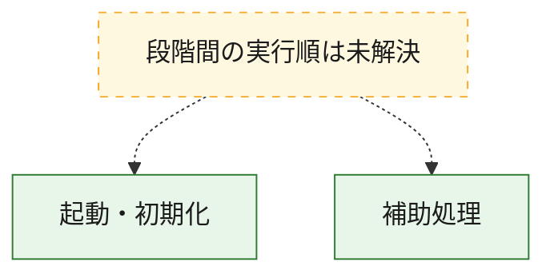
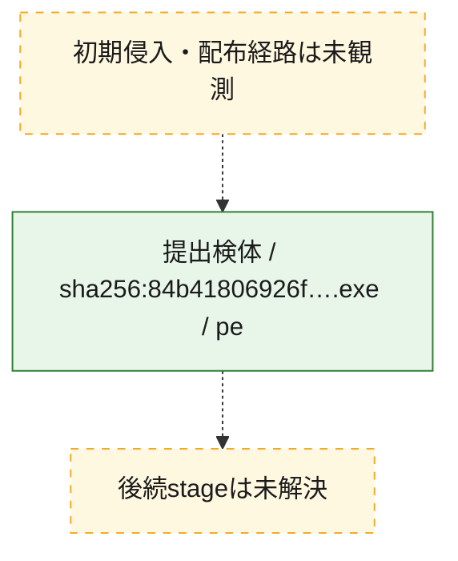
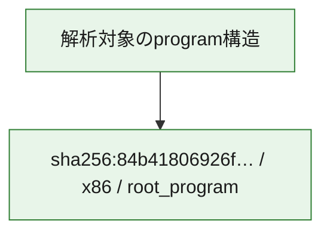

# 全体ロジック：84b41806926f1046b6e23b7b8b1f1665c095b5e68d8b73ce71516a4beebf254a

代表関数の静的証跡から、起動・初期化の処理群を確認しました。

## 読み方

- phaseの掲載順は解析上の整理順です。observed_call_edgesがない段階間の実行順を断定しません。
- 図の実線は静的に観測した関係、点線と黄色のノードは未観測・未解決の関係を示します。
- 図は静的な要約であり、動的実行を再現するものではありません。
- 詳細な関数解説とfingerprintは[STATIC-LOGIC.md](STATIC-LOGIC.md)を参照してください。

## 静的可視化

### 実行フロー

### 感染チェーン

### モジュール関係

## 処理段階

### 1. 起動・初期化

entry pointから初期化と後続処理への移行を確認します。
確度: `confirmed_static_function_evidence`

- `84b41806926f1046b6e23b7b8b1f1665c095b5e68d8b73ce71516a4beebf254a:ghidra:00401000` — 初期化と主要処理への分岐を行う入口関数です。 状態: `succeeded`、選定理由: `entry_point`, `meaningful_symbol_name`, `reviewed_call_centrality:3`, `role:entrypoint`

### 2. 補助処理

主要処理を支える一般内部関数またはlibrary処理を確認します。
確度: `confirmed_static_function_evidence_with_limits`

- `84b41806926f1046b6e23b7b8b1f1665c095b5e68d8b73ce71516a4beebf254a:ghidra:00401011` — 検体内部の一般処理を実装する関数です。 状態: `succeeded`、選定理由: `context_representative`, `reviewed_call_centrality:37`
- `84b41806926f1046b6e23b7b8b1f1665c095b5e68d8b73ce71516a4beebf254a:ghidra:00402494` — 検体内部の一般処理を実装する関数です。 状態: `succeeded`、選定理由: `context_representative`, `reviewed_call_centrality:64`
- `84b41806926f1046b6e23b7b8b1f1665c095b5e68d8b73ce71516a4beebf254a:ghidra:00406166` — 検体内部の一般処理を実装する関数です。 状態: `succeeded`、選定理由: `context_representative`, `reviewed_call_centrality:2`
- `84b41806926f1046b6e23b7b8b1f1665c095b5e68d8b73ce71516a4beebf254a:ghidra:004061a5` — 検体内部の一般処理を実装する関数です。 状態: `succeeded`、選定理由: `context_representative`, `reviewed_call_centrality:2`
- `84b41806926f1046b6e23b7b8b1f1665c095b5e68d8b73ce71516a4beebf254a:ghidra:00406216` — 検体内部の一般処理を実装する関数です。 状態: `succeeded`、選定理由: `context_representative`, `reviewed_call_centrality:14`
- `84b41806926f1046b6e23b7b8b1f1665c095b5e68d8b73ce71516a4beebf254a:ghidra:00406883` — 検体内部の一般処理を実装する関数です。 状態: `succeeded`、選定理由: `context_representative`, `reviewed_call_centrality:5`
- `84b41806926f1046b6e23b7b8b1f1665c095b5e68d8b73ce71516a4beebf254a:ghidra:004069f8` — 検体内部の一般処理を実装する関数です。 状態: `limited_bad_instruction_or_flow`、選定理由: `context_representative`, `reviewed_call_centrality:10`
- `84b41806926f1046b6e23b7b8b1f1665c095b5e68d8b73ce71516a4beebf254a:ghidra:00406bdd` — 検体内部の一般処理を実装する関数です。 状態: `succeeded`、選定理由: `context_representative`, `reviewed_call_centrality:2`
- `84b41806926f1046b6e23b7b8b1f1665c095b5e68d8b73ce71516a4beebf254a:ghidra:00406c42` — 検体内部の一般処理を実装する関数です。 状態: `succeeded`、選定理由: `context_representative`, `reviewed_call_centrality:3`
- `84b41806926f1046b6e23b7b8b1f1665c095b5e68d8b73ce71516a4beebf254a:ghidra:00406dec` — 検体内部の一般処理を実装する関数です。 状態: `succeeded`、選定理由: `context_representative`, `reviewed_call_centrality:6`
- `84b41806926f1046b6e23b7b8b1f1665c095b5e68d8b73ce71516a4beebf254a:ghidra:00406f03` — 検体内部の一般処理を実装する関数です。 状態: `succeeded`、選定理由: `context_representative`, `reviewed_call_centrality:3`
- `84b41806926f1046b6e23b7b8b1f1665c095b5e68d8b73ce71516a4beebf254a:ghidra:00406f5f` — 検体内部の一般処理を実装する関数です。 状態: `succeeded`、選定理由: `context_representative`, `reviewed_call_centrality:1`
- `84b41806926f1046b6e23b7b8b1f1665c095b5e68d8b73ce71516a4beebf254a:ghidra:00406f84` — 検体内部の一般処理を実装する関数です。 状態: `succeeded`、選定理由: `context_representative`, `reviewed_call_centrality:4`
- `84b41806926f1046b6e23b7b8b1f1665c095b5e68d8b73ce71516a4beebf254a:ghidra:00406fcd` — 検体内部の一般処理を実装する関数です。 状態: `succeeded`、選定理由: `context_representative`, `reviewed_call_centrality:7`
- `84b41806926f1046b6e23b7b8b1f1665c095b5e68d8b73ce71516a4beebf254a:ghidra:004070b5` — 検体内部の一般処理を実装する関数です。 状態: `succeeded`、選定理由: `context_representative`, `reviewed_call_centrality:10`
- `84b41806926f1046b6e23b7b8b1f1665c095b5e68d8b73ce71516a4beebf254a:ghidra:00407249` — 検体内部の一般処理を実装する関数です。 状態: `succeeded`、選定理由: `context_representative`, `reviewed_call_centrality:2`
- `84b41806926f1046b6e23b7b8b1f1665c095b5e68d8b73ce71516a4beebf254a:ghidra:0040727d` — 検体内部の一般処理を実装する関数です。 状態: `succeeded`、選定理由: `context_representative`, `reviewed_call_centrality:2`
- `84b41806926f1046b6e23b7b8b1f1665c095b5e68d8b73ce71516a4beebf254a:ghidra:004072b1` — 検体内部の一般処理を実装する関数です。 状態: `succeeded`、選定理由: `context_representative`, `reviewed_call_centrality:2`
- `84b41806926f1046b6e23b7b8b1f1665c095b5e68d8b73ce71516a4beebf254a:ghidra:004072f4` — 検体内部の一般処理を実装する関数です。 状態: `succeeded`、選定理由: `context_representative`, `reviewed_call_centrality:6`
- `84b41806926f1046b6e23b7b8b1f1665c095b5e68d8b73ce71516a4beebf254a:ghidra:0040732f` — 検体内部の一般処理を実装する関数です。 状態: `succeeded`、選定理由: `context_representative`, `reviewed_call_centrality:5`
- `84b41806926f1046b6e23b7b8b1f1665c095b5e68d8b73ce71516a4beebf254a:ghidra:0040737e` — 検体内部の一般処理を実装する関数です。 状態: `succeeded`、選定理由: `context_representative`, `reviewed_call_centrality:15`
- `84b41806926f1046b6e23b7b8b1f1665c095b5e68d8b73ce71516a4beebf254a:ghidra:00407763` — 検体内部の一般処理を実装する関数です。 状態: `succeeded`、選定理由: `context_representative`, `reviewed_call_centrality:9`
- `84b41806926f1046b6e23b7b8b1f1665c095b5e68d8b73ce71516a4beebf254a:ghidra:004078d2` — 検体内部の一般処理を実装する関数です。 状態: `succeeded`、選定理由: `context_representative`, `reviewed_call_centrality:8`
- `84b41806926f1046b6e23b7b8b1f1665c095b5e68d8b73ce71516a4beebf254a:ghidra:004079ff` — 検体内部の一般処理を実装する関数です。 状態: `succeeded`、選定理由: `context_representative`, `reviewed_call_centrality:3`
- `84b41806926f1046b6e23b7b8b1f1665c095b5e68d8b73ce71516a4beebf254a:ghidra:00407a27` — 検体内部の一般処理を実装する関数です。 状態: `succeeded`、選定理由: `context_representative`, `reviewed_call_centrality:3`
- `84b41806926f1046b6e23b7b8b1f1665c095b5e68d8b73ce71516a4beebf254a:ghidra:00407a8a` — 検体内部の一般処理を実装する関数です。 状態: `succeeded`、選定理由: `context_representative`, `reviewed_call_centrality:24`
- `84b41806926f1046b6e23b7b8b1f1665c095b5e68d8b73ce71516a4beebf254a:ghidra:0040af7c` — 検体内部の一般処理を実装する関数です。 状態: `succeeded`、選定理由: `context_representative`, `reviewed_call_centrality:3`
- `84b41806926f1046b6e23b7b8b1f1665c095b5e68d8b73ce71516a4beebf254a:ghidra:0040afc9` — 検体内部の一般処理を実装する関数です。 状態: `succeeded`、選定理由: `context_representative`, `reviewed_call_centrality:2`
- `84b41806926f1046b6e23b7b8b1f1665c095b5e68d8b73ce71516a4beebf254a:ghidra:0040b047` — 検体内部の一般処理を実装する関数です。 状態: `succeeded`、選定理由: `context_representative`, `reviewed_call_centrality:3`
- `84b41806926f1046b6e23b7b8b1f1665c095b5e68d8b73ce71516a4beebf254a:ghidra:0040b091` — 検体内部の一般処理を実装する関数です。 状態: `succeeded`、選定理由: `context_representative`, `reviewed_call_centrality:4`
- `84b41806926f1046b6e23b7b8b1f1665c095b5e68d8b73ce71516a4beebf254a:ghidra:0040b189` — 検体内部の一般処理を実装する関数です。 状態: `succeeded`、選定理由: `context_representative`, `reviewed_call_centrality:4`

## 観測したcall関係

- 代表関数間で直接解決できた呼出関係はありません。

## 解析範囲と制約

- 選定外関数は全体inventoryへ残しますが、関数本体の個別解説対象にはしていません。
- indirect call、難読化、packer、VM、壊れたcontrol flowによりcall関係が欠落する場合があります。
- 文書は静的解析に基づき、検体実行や外部通信による動的確認は行っていません。
