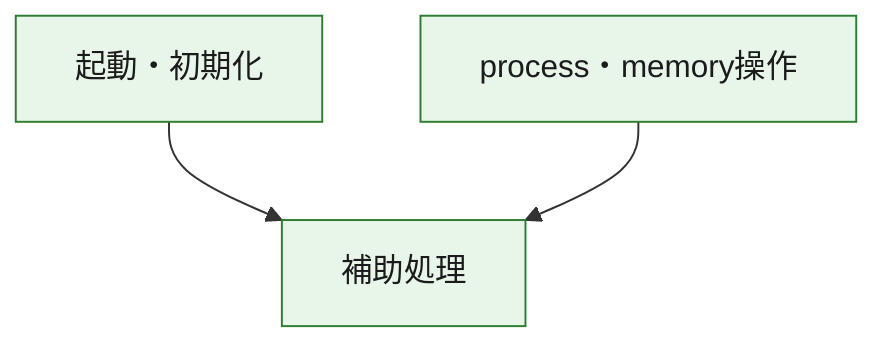
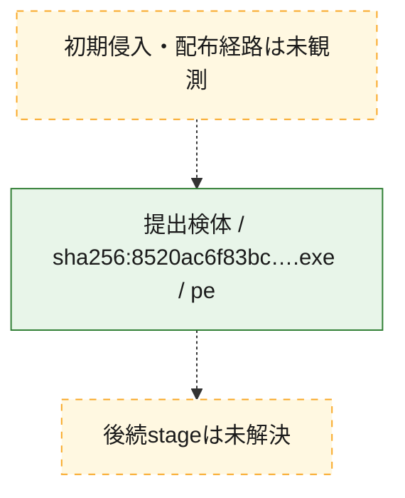
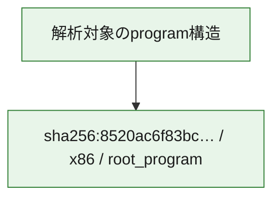

# 全体ロジック：8520ac6f83bcae7f1a3df6b15ab9ef3cb4ca9717f4c47fd9711f2350deb51edb

代表関数の静的証跡から、起動・初期化、process・memory操作の処理群を確認しました。

## 読み方

- phaseの掲載順は解析上の整理順です。observed_call_edgesがない段階間の実行順を断定しません。
- 図の実線は静的に観測した関係、点線と黄色のノードは未観測・未解決の関係を示します。
- 図は静的な要約であり、動的実行を再現するものではありません。
- 詳細な関数解説とfingerprintは[STATIC-LOGIC.md](STATIC-LOGIC.md)を参照してください。

## 静的可視化

### 実行フロー

### 感染チェーン

### モジュール関係

## 処理段階

### 1. 起動・初期化

entry pointから初期化と後続処理への移行を確認します。
確度: `confirmed_static_function_evidence`

- `8520ac6f83bcae7f1a3df6b15ab9ef3cb4ca9717f4c47fd9711f2350deb51edb:ghidra:2c0013e0` — 初期化と主要処理への分岐を行う入口関数です。 状態: `succeeded`、選定理由: `entry_point`, `meaningful_symbol_name`, `reviewed_call_centrality:1`, `role:entrypoint`

### 2. process・memory操作

process、thread、module、memory操作と実行移行を確認します。
確度: `confirmed_static_function_evidence`

- `8520ac6f83bcae7f1a3df6b15ab9ef3cb4ca9717f4c47fd9711f2350deb51edb:ghidra:2c0017a0` — process、thread、module、またはmemory操作に関係する関数です。 状態: `succeeded`、選定理由: `context_representative`, `reviewed_call_centrality:16`, `role:process_or_memory_operation`
- `8520ac6f83bcae7f1a3df6b15ab9ef3cb4ca9717f4c47fd9711f2350deb51edb:ghidra:2c001810` — process、thread、module、またはmemory操作に関係する関数です。 状態: `succeeded`、選定理由: `context_representative`, `reviewed_call_centrality:12`, `role:process_or_memory_operation`

### 3. 補助処理

主要処理を支える一般内部関数またはlibrary処理を確認します。
確度: `confirmed_static_function_evidence_with_limits`

- `8520ac6f83bcae7f1a3df6b15ab9ef3cb4ca9717f4c47fd9711f2350deb51edb:ghidra:2c001000` — 検体内部の一般処理を実装する関数です。 状態: `succeeded`、選定理由: `context_representative`
- `8520ac6f83bcae7f1a3df6b15ab9ef3cb4ca9717f4c47fd9711f2350deb51edb:ghidra:2c001010` — 検体内部の一般処理を実装する関数です。 状態: `succeeded`、選定理由: `context_representative`, `reviewed_call_centrality:6`
- `8520ac6f83bcae7f1a3df6b15ab9ef3cb4ca9717f4c47fd9711f2350deb51edb:ghidra:2c001140` — 検体内部の一般処理を実装する関数です。 状態: `succeeded`、選定理由: `context_representative`, `reviewed_call_centrality:1`
- `8520ac6f83bcae7f1a3df6b15ab9ef3cb4ca9717f4c47fd9711f2350deb51edb:ghidra:2c001190` — 検体内部の一般処理を実装する関数です。 状態: `succeeded`、選定理由: `context_representative`, `reviewed_call_centrality:21`
- `8520ac6f83bcae7f1a3df6b15ab9ef3cb4ca9717f4c47fd9711f2350deb51edb:ghidra:2c001410` — 検体内部の一般処理を実装する関数です。 状態: `succeeded`、選定理由: `context_representative`, `reviewed_call_centrality:1`
- `8520ac6f83bcae7f1a3df6b15ab9ef3cb4ca9717f4c47fd9711f2350deb51edb:ghidra:2c001440` — 検体内部の一般処理を実装する関数です。 状態: `succeeded`、選定理由: `context_representative`, `reviewed_call_centrality:1`
- `8520ac6f83bcae7f1a3df6b15ab9ef3cb4ca9717f4c47fd9711f2350deb51edb:ghidra:2c001460` — 検体内部の一般処理を実装する関数です。 状態: `succeeded`、選定理由: `context_representative`, `reviewed_call_centrality:1`
- `8520ac6f83bcae7f1a3df6b15ab9ef3cb4ca9717f4c47fd9711f2350deb51edb:ghidra:2c001470` — 検体内部の一般処理を実装する関数です。 状態: `succeeded`、選定理由: `context_representative`
- `8520ac6f83bcae7f1a3df6b15ab9ef3cb4ca9717f4c47fd9711f2350deb51edb:ghidra:2c0014c0` — 検体内部の一般処理を実装する関数です。 状態: `succeeded`、選定理由: `context_representative`
- `8520ac6f83bcae7f1a3df6b15ab9ef3cb4ca9717f4c47fd9711f2350deb51edb:ghidra:2c001510` — 検体内部の一般処理を実装する関数です。 状態: `succeeded`、選定理由: `context_representative`, `reviewed_call_centrality:1`
- `8520ac6f83bcae7f1a3df6b15ab9ef3cb4ca9717f4c47fd9711f2350deb51edb:ghidra:2c001590` — 検体内部の一般処理を実装する関数です。 状態: `succeeded`、選定理由: `context_representative`, `reviewed_call_centrality:2`
- `8520ac6f83bcae7f1a3df6b15ab9ef3cb4ca9717f4c47fd9711f2350deb51edb:ghidra:2c0015b0` — 検体内部の一般処理を実装する関数です。 状態: `succeeded`、選定理由: `context_representative`, `reviewed_call_centrality:1`
- `8520ac6f83bcae7f1a3df6b15ab9ef3cb4ca9717f4c47fd9711f2350deb51edb:ghidra:2c0015c0` — compiler生成処理または汎用library処理とみられる関数です。 状態: `succeeded`、選定理由: `entry_point`, `meaningful_symbol_name`, `reviewed_call_centrality:1`
- `8520ac6f83bcae7f1a3df6b15ab9ef3cb4ca9717f4c47fd9711f2350deb51edb:ghidra:2c0015f0` — compiler生成処理または汎用library処理とみられる関数です。 状態: `succeeded`、選定理由: `entry_point`, `meaningful_symbol_name`, `reviewed_call_centrality:3`
- `8520ac6f83bcae7f1a3df6b15ab9ef3cb4ca9717f4c47fd9711f2350deb51edb:ghidra:2c001680` — 検体内部の一般処理を実装する関数です。 状態: `succeeded`、選定理由: `context_representative`
- `8520ac6f83bcae7f1a3df6b15ab9ef3cb4ca9717f4c47fd9711f2350deb51edb:ghidra:2c001690` — 検体内部の一般処理を実装する関数です。 状態: `succeeded`、選定理由: `context_representative`, `reviewed_call_centrality:2`
- `8520ac6f83bcae7f1a3df6b15ab9ef3cb4ca9717f4c47fd9711f2350deb51edb:ghidra:2c001790` — 検体内部の一般処理を実装する関数です。 状態: `succeeded`、選定理由: `context_representative`, `reviewed_call_centrality:3`
- `8520ac6f83bcae7f1a3df6b15ab9ef3cb4ca9717f4c47fd9711f2350deb51edb:ghidra:2c001980` — 検体内部の一般処理を実装する関数です。 状態: `succeeded`、選定理由: `context_representative`, `reviewed_call_centrality:4`
- `8520ac6f83bcae7f1a3df6b15ab9ef3cb4ca9717f4c47fd9711f2350deb51edb:ghidra:2c001ce0` — 検体内部の一般処理を実装する関数です。 状態: `succeeded`、選定理由: `context_representative`
- `8520ac6f83bcae7f1a3df6b15ab9ef3cb4ca9717f4c47fd9711f2350deb51edb:ghidra:2c001d20` — 検体内部の一般処理を実装する関数です。 状態: `limited_bad_instruction_or_flow`、選定理由: `context_representative`, `reviewed_call_centrality:3`
- `8520ac6f83bcae7f1a3df6b15ab9ef3cb4ca9717f4c47fd9711f2350deb51edb:ghidra:2c001d30` — 検体内部の一般処理を実装する関数です。 状態: `limited_bad_instruction_or_flow`、選定理由: `context_representative`, `reviewed_call_centrality:2`
- `8520ac6f83bcae7f1a3df6b15ab9ef3cb4ca9717f4c47fd9711f2350deb51edb:ghidra:2c001ef0` — 検体内部の一般処理を実装する関数です。 状態: `limited_bad_instruction_or_flow`、選定理由: `context_representative`, `reviewed_call_centrality:9`
- `8520ac6f83bcae7f1a3df6b15ab9ef3cb4ca9717f4c47fd9711f2350deb51edb:ghidra:2c001f70` — 検体内部の一般処理を実装する関数です。 状態: `succeeded`、選定理由: `context_representative`, `reviewed_call_centrality:5`
- `8520ac6f83bcae7f1a3df6b15ab9ef3cb4ca9717f4c47fd9711f2350deb51edb:ghidra:2c001ff0` — 検体内部の一般処理を実装する関数です。 状態: `succeeded`、選定理由: `context_representative`, `reviewed_call_centrality:5`
- `8520ac6f83bcae7f1a3df6b15ab9ef3cb4ca9717f4c47fd9711f2350deb51edb:ghidra:2c002090` — 検体内部の一般処理を実装する関数です。 状態: `succeeded`、選定理由: `context_representative`, `reviewed_call_centrality:9`
- `8520ac6f83bcae7f1a3df6b15ab9ef3cb4ca9717f4c47fd9711f2350deb51edb:ghidra:2c002190` — 検体内部の一般処理を実装する関数です。 状態: `succeeded`、選定理由: `context_representative`
- `8520ac6f83bcae7f1a3df6b15ab9ef3cb4ca9717f4c47fd9711f2350deb51edb:ghidra:2c0021c0` — 検体内部の一般処理を実装する関数です。 状態: `succeeded`、選定理由: `context_representative`
- `8520ac6f83bcae7f1a3df6b15ab9ef3cb4ca9717f4c47fd9711f2350deb51edb:ghidra:2c002210` — 検体内部の一般処理を実装する関数です。 状態: `succeeded`、選定理由: `context_representative`, `reviewed_call_centrality:2`
- `8520ac6f83bcae7f1a3df6b15ab9ef3cb4ca9717f4c47fd9711f2350deb51edb:ghidra:2c0022c0` — 検体内部の一般処理を実装する関数です。 状態: `succeeded`、選定理由: `context_representative`, `reviewed_call_centrality:2`

## 観測したcall関係

- `8520ac6f83bcae7f1a3df6b15ab9ef3cb4ca9717f4c47fd9711f2350deb51edb:ghidra:2c001010` → `8520ac6f83bcae7f1a3df6b15ab9ef3cb4ca9717f4c47fd9711f2350deb51edb:ghidra:2c0015b0` （`support` → `support`）
- `8520ac6f83bcae7f1a3df6b15ab9ef3cb4ca9717f4c47fd9711f2350deb51edb:ghidra:2c001010` → `8520ac6f83bcae7f1a3df6b15ab9ef3cb4ca9717f4c47fd9711f2350deb51edb:ghidra:2c001d20` （`support` → `support`）
- `8520ac6f83bcae7f1a3df6b15ab9ef3cb4ca9717f4c47fd9711f2350deb51edb:ghidra:2c001190` → `8520ac6f83bcae7f1a3df6b15ab9ef3cb4ca9717f4c47fd9711f2350deb51edb:ghidra:2c001590` （`support` → `support`）
- `8520ac6f83bcae7f1a3df6b15ab9ef3cb4ca9717f4c47fd9711f2350deb51edb:ghidra:2c001190` → `8520ac6f83bcae7f1a3df6b15ab9ef3cb4ca9717f4c47fd9711f2350deb51edb:ghidra:2c0015f0` （`support` → `support`）
- `8520ac6f83bcae7f1a3df6b15ab9ef3cb4ca9717f4c47fd9711f2350deb51edb:ghidra:2c001190` → `8520ac6f83bcae7f1a3df6b15ab9ef3cb4ca9717f4c47fd9711f2350deb51edb:ghidra:2c001790` （`support` → `support`）
- `8520ac6f83bcae7f1a3df6b15ab9ef3cb4ca9717f4c47fd9711f2350deb51edb:ghidra:2c001190` → `8520ac6f83bcae7f1a3df6b15ab9ef3cb4ca9717f4c47fd9711f2350deb51edb:ghidra:2c001980` （`support` → `support`）
- `8520ac6f83bcae7f1a3df6b15ab9ef3cb4ca9717f4c47fd9711f2350deb51edb:ghidra:2c0013e0` → `8520ac6f83bcae7f1a3df6b15ab9ef3cb4ca9717f4c47fd9711f2350deb51edb:ghidra:2c001190` （`startup` → `support`）
- `8520ac6f83bcae7f1a3df6b15ab9ef3cb4ca9717f4c47fd9711f2350deb51edb:ghidra:2c001410` → `8520ac6f83bcae7f1a3df6b15ab9ef3cb4ca9717f4c47fd9711f2350deb51edb:ghidra:2c001190` （`support` → `support`）
- `8520ac6f83bcae7f1a3df6b15ab9ef3cb4ca9717f4c47fd9711f2350deb51edb:ghidra:2c0015c0` → `8520ac6f83bcae7f1a3df6b15ab9ef3cb4ca9717f4c47fd9711f2350deb51edb:ghidra:2c002090` （`support` → `support`）
- `8520ac6f83bcae7f1a3df6b15ab9ef3cb4ca9717f4c47fd9711f2350deb51edb:ghidra:2c0015f0` → `8520ac6f83bcae7f1a3df6b15ab9ef3cb4ca9717f4c47fd9711f2350deb51edb:ghidra:2c002090` （`support` → `support`）
- `8520ac6f83bcae7f1a3df6b15ab9ef3cb4ca9717f4c47fd9711f2350deb51edb:ghidra:2c0017a0` → `8520ac6f83bcae7f1a3df6b15ab9ef3cb4ca9717f4c47fd9711f2350deb51edb:ghidra:2c0022c0` （`execution` → `support`）
- `8520ac6f83bcae7f1a3df6b15ab9ef3cb4ca9717f4c47fd9711f2350deb51edb:ghidra:2c001810` → `8520ac6f83bcae7f1a3df6b15ab9ef3cb4ca9717f4c47fd9711f2350deb51edb:ghidra:2c0017a0` （`execution` → `execution`）
- `8520ac6f83bcae7f1a3df6b15ab9ef3cb4ca9717f4c47fd9711f2350deb51edb:ghidra:2c001810` → `8520ac6f83bcae7f1a3df6b15ab9ef3cb4ca9717f4c47fd9711f2350deb51edb:ghidra:2c0022c0` （`execution` → `support`）
- `8520ac6f83bcae7f1a3df6b15ab9ef3cb4ca9717f4c47fd9711f2350deb51edb:ghidra:2c001d30` → `8520ac6f83bcae7f1a3df6b15ab9ef3cb4ca9717f4c47fd9711f2350deb51edb:ghidra:2c001790` （`support` → `support`）
- `8520ac6f83bcae7f1a3df6b15ab9ef3cb4ca9717f4c47fd9711f2350deb51edb:ghidra:2c002090` → `8520ac6f83bcae7f1a3df6b15ab9ef3cb4ca9717f4c47fd9711f2350deb51edb:ghidra:2c001790` （`support` → `support`）
- `8520ac6f83bcae7f1a3df6b15ab9ef3cb4ca9717f4c47fd9711f2350deb51edb:ghidra:2c002090` → `8520ac6f83bcae7f1a3df6b15ab9ef3cb4ca9717f4c47fd9711f2350deb51edb:ghidra:2c001ef0` （`support` → `support`）
- `ghidra-function:0ea2b2c045f2dda0e8b33042` → `ghidra-external:fc29675242e584e20c091178` （`unclassified` → `unclassified`）
- `ghidra-function:18a978e3f3a5600e871aaf75` → `ghidra-external:fc29675242e584e20c091178` （`unclassified` → `unclassified`）
- `ghidra-function:1e4280d60fd6bd8d4025adcb` → `ghidra-external:aa26b556840bbf2dfe6d87bf` （`unclassified` → `unclassified`）
- `ghidra-function:1e4280d60fd6bd8d4025adcb` → `ghidra-function:4c5aeb1bfefb427d5a36af94` （`unclassified` → `unclassified`）
- `ghidra-function:1e4280d60fd6bd8d4025adcb` → `ghidra-function:7028aecc57706442f82f8866` （`unclassified` → `unclassified`）
- `ghidra-function:24047bf68f6fad23cd7fb544` → `ghidra-external:4062b7f0455255b46d744863` （`unclassified` → `unclassified`）
- `ghidra-function:24047bf68f6fad23cd7fb544` → `ghidra-external:48771ccfb10898e0a5b55b08` （`unclassified` → `unclassified`）
- `ghidra-function:24047bf68f6fad23cd7fb544` → `ghidra-external:66c7729b2766672fd5f0cdf4` （`unclassified` → `unclassified`）
- `ghidra-function:24047bf68f6fad23cd7fb544` → `ghidra-external:85970bebd7f05543fff08c43` （`unclassified` → `unclassified`）
- `ghidra-function:24047bf68f6fad23cd7fb544` → `ghidra-external:89053dff631b76c5c595243e` （`unclassified` → `unclassified`）
- `ghidra-function:24047bf68f6fad23cd7fb544` → `ghidra-external:8c8b2e3b3704285fe179e5b7` （`unclassified` → `unclassified`）
- `ghidra-function:24047bf68f6fad23cd7fb544` → `ghidra-external:94347c49bbe7341bee276d47` （`unclassified` → `unclassified`）
- `ghidra-function:24047bf68f6fad23cd7fb544` → `ghidra-external:df1a449cc0f90a861dc7e56f` （`unclassified` → `unclassified`）
- `ghidra-function:24047bf68f6fad23cd7fb544` → `ghidra-external:e819baf8c266e72654ef99ed` （`unclassified` → `unclassified`）
- `ghidra-function:24047bf68f6fad23cd7fb544` → `ghidra-function:18a978e3f3a5600e871aaf75` （`unclassified` → `unclassified`）
- `ghidra-function:24047bf68f6fad23cd7fb544` → `ghidra-function:315c0a88b84d95cded263b18` （`unclassified` → `unclassified`）
- `ghidra-function:24047bf68f6fad23cd7fb544` → `ghidra-function:3309957a367e4876170c7cc0` （`unclassified` → `unclassified`）
- `ghidra-function:24047bf68f6fad23cd7fb544` → `ghidra-function:5a0886321d6b0ed0c8d0b00a` （`unclassified` → `unclassified`）
- `ghidra-function:24047bf68f6fad23cd7fb544` → `ghidra-function:615f17ab2fcf6e32a41c4db1` （`unclassified` → `unclassified`）
- `ghidra-function:24047bf68f6fad23cd7fb544` → `ghidra-function:97dd38ba2ac3424ac5a91384` （`unclassified` → `unclassified`）
- `ghidra-function:24047bf68f6fad23cd7fb544` → `ghidra-function:99cd658516012ff3322b292d` （`unclassified` → `unclassified`）
- `ghidra-function:24047bf68f6fad23cd7fb544` → `ghidra-function:b6f0ea1ac3caec402776bb0f` （`unclassified` → `unclassified`）
- `ghidra-function:290b7aed9cd73dd37c3d8fc4` → `ghidra-external:aa26b556840bbf2dfe6d87bf` （`unclassified` → `unclassified`）
- `ghidra-function:290b7aed9cd73dd37c3d8fc4` → `ghidra-function:31df47151edd6fba7252c09c` （`unclassified` → `unclassified`）
- `ghidra-function:290b7aed9cd73dd37c3d8fc4` → `ghidra-function:b6f0ea1ac3caec402776bb0f` （`unclassified` → `unclassified`）
- `ghidra-function:290b7aed9cd73dd37c3d8fc4` → `ghidra-function:e629f9be60d549b64f6163b9` （`unclassified` → `unclassified`）
- `ghidra-function:290b7aed9cd73dd37c3d8fc4` → `ghidra-function:eb7e9ae4fed8fa4b78e65e25` （`unclassified` → `unclassified`）
- `ghidra-function:3309957a367e4876170c7cc0` → `ghidra-external:a6009a428a3f2031de713ab3` （`unclassified` → `unclassified`）
- `ghidra-function:3309957a367e4876170c7cc0` → `ghidra-external:e962b8c1d92cf7d22de328ac` （`unclassified` → `unclassified`）
- `ghidra-function:3309957a367e4876170c7cc0` → `ghidra-function:048e4d6401685a997974d19a` （`unclassified` → `unclassified`）
- `ghidra-function:4d0073bc6f8691903cdb1ae0` → `ghidra-external:911bd5f4ea681cfab34f1487` （`unclassified` → `unclassified`）
- `ghidra-function:4d0073bc6f8691903cdb1ae0` → `ghidra-function:4c5aeb1bfefb427d5a36af94` （`unclassified` → `unclassified`）
- `ghidra-function:4d0073bc6f8691903cdb1ae0` → `ghidra-function:7028aecc57706442f82f8866` （`unclassified` → `unclassified`）
- `ghidra-function:4d97d3f88bbef93138912ea9` → `ghidra-external:36ba378a929058b4a71b88f5` （`unclassified` → `unclassified`）
- `ghidra-function:4d97d3f88bbef93138912ea9` → `ghidra-function:9a9605a0481fe85b3ac6d29d` （`unclassified` → `unclassified`）
- `ghidra-function:5a0886321d6b0ed0c8d0b00a` → `ghidra-external:e962b8c1d92cf7d22de328ac` （`unclassified` → `unclassified`）
- `ghidra-function:5a0886321d6b0ed0c8d0b00a` → `ghidra-function:290b7aed9cd73dd37c3d8fc4` （`unclassified` → `unclassified`）
- `ghidra-function:5f43b88b88eec4ad3373e063` → `ghidra-external:a6009a428a3f2031de713ab3` （`unclassified` → `unclassified`）
- `ghidra-function:5f43b88b88eec4ad3373e063` → `ghidra-external:e962b8c1d92cf7d22de328ac` （`unclassified` → `unclassified`）
- `ghidra-function:5f43b88b88eec4ad3373e063` → `ghidra-function:048e4d6401685a997974d19a` （`unclassified` → `unclassified`）
- `ghidra-function:5f43b88b88eec4ad3373e063` → `ghidra-function:29b64d77609ad9f8860a74ae` （`unclassified` → `unclassified`）
- `ghidra-function:5f43b88b88eec4ad3373e063` → `ghidra-function:59dde00a66ad61a5a0127342` （`unclassified` → `unclassified`）
- `ghidra-function:5f43b88b88eec4ad3373e063` → `ghidra-function:734110f9bc832c998cd4dd89` （`unclassified` → `unclassified`）
- `ghidra-function:5f43b88b88eec4ad3373e063` → `ghidra-function:b28ba623f064c53fa6665daa` （`unclassified` → `unclassified`）
- `ghidra-function:5f43b88b88eec4ad3373e063` → `ghidra-function:e01e7d0ea3ebefcf54f7646d` （`unclassified` → `unclassified`）
- `ghidra-function:5f43b88b88eec4ad3373e063` → `ghidra-function:e4ed3e4a9bfa10f646a517af` （`unclassified` → `unclassified`）
- `ghidra-function:6307cafb17a5f161eacae1f2` → `ghidra-external:ddc68fe6c6cee3531d0ca0c9` （`unclassified` → `unclassified`）
- `ghidra-function:6307cafb17a5f161eacae1f2` → `ghidra-function:b6f0ea1ac3caec402776bb0f` （`unclassified` → `unclassified`）
- `ghidra-function:75bf903e6a1db175bc840486` → `ghidra-external:fc85f14895b3e5fa86242021` （`unclassified` → `unclassified`）
- `ghidra-function:78a26e0a998b9ee991202f57` → `ghidra-external:fc29675242e584e20c091178` （`unclassified` → `unclassified`）
- `ghidra-function:9151d03529bcb650fead7eac` → `ghidra-function:290b7aed9cd73dd37c3d8fc4` （`unclassified` → `unclassified`）
- `ghidra-function:9e312aa05f63cddf52ed4e56` → `ghidra-function:d89bc121c1361f16e20d9da9` （`unclassified` → `unclassified`）
- `ghidra-function:b16679ee208ca2798c84334d` → `ghidra-function:24047bf68f6fad23cd7fb544` （`unclassified` → `unclassified`）
- `ghidra-function:b62271aafb0c2e7beefaa777` → `ghidra-external:c0a093225b8eb6d91defdf0d` （`unclassified` → `unclassified`）
- `ghidra-function:b62271aafb0c2e7beefaa777` → `ghidra-external:df1a449cc0f90a861dc7e56f` （`unclassified` → `unclassified`）
- `ghidra-function:c99d87e1ef7ca4ecac0cd4ba` → `ghidra-function:24047bf68f6fad23cd7fb544` （`unclassified` → `unclassified`）
- `ghidra-function:ca20ff46cab2659071dc1b2a` → `ghidra-external:a5b80d8c7dd4d341d22c2e56` （`unclassified` → `unclassified`）
- `ghidra-function:ca20ff46cab2659071dc1b2a` → `ghidra-external:e962b8c1d92cf7d22de328ac` （`unclassified` → `unclassified`）
- `ghidra-function:ca20ff46cab2659071dc1b2a` → `ghidra-function:21878a8a91c63f45d4a334d5` （`unclassified` → `unclassified`）
- `ghidra-function:ca20ff46cab2659071dc1b2a` → `ghidra-function:9e312aa05f63cddf52ed4e56` （`unclassified` → `unclassified`）
- `ghidra-function:ca20ff46cab2659071dc1b2a` → `ghidra-function:c847063c8c3c851fba8cdf51` （`unclassified` → `unclassified`）
- `ghidra-function:ca20ff46cab2659071dc1b2a` → `ghidra-function:d3f74599be350fa56eaccc3b` （`unclassified` → `unclassified`）
- `ghidra-function:e01e7d0ea3ebefcf54f7646d` → `ghidra-external:6ec4d137b828d4e30cea1259` （`unclassified` → `unclassified`）
- `ghidra-function:e01e7d0ea3ebefcf54f7646d` → `ghidra-external:a03f9baf1f9806e48a30026f` （`unclassified` → `unclassified`）
- `ghidra-function:e01e7d0ea3ebefcf54f7646d` → `ghidra-external:a6009a428a3f2031de713ab3` （`unclassified` → `unclassified`）
- `ghidra-function:e01e7d0ea3ebefcf54f7646d` → `ghidra-external:e962b8c1d92cf7d22de328ac` （`unclassified` → `unclassified`）
- `ghidra-function:e01e7d0ea3ebefcf54f7646d` → `ghidra-external:f31b85eef69508b95dd8419a` （`unclassified` → `unclassified`）
- `ghidra-function:e01e7d0ea3ebefcf54f7646d` → `ghidra-function:048e4d6401685a997974d19a` （`unclassified` → `unclassified`）
- `ghidra-function:e01e7d0ea3ebefcf54f7646d` → `ghidra-function:29b64d77609ad9f8860a74ae` （`unclassified` → `unclassified`）
- `ghidra-function:e01e7d0ea3ebefcf54f7646d` → `ghidra-function:59dde00a66ad61a5a0127342` （`unclassified` → `unclassified`）
- `ghidra-function:e01e7d0ea3ebefcf54f7646d` → `ghidra-function:734110f9bc832c998cd4dd89` （`unclassified` → `unclassified`）
- `ghidra-function:e01e7d0ea3ebefcf54f7646d` → `ghidra-function:9a9605a0481fe85b3ac6d29d` （`unclassified` → `unclassified`）
- `ghidra-function:e01e7d0ea3ebefcf54f7646d` → `ghidra-function:b28ba623f064c53fa6665daa` （`unclassified` → `unclassified`）
- `ghidra-function:e01e7d0ea3ebefcf54f7646d` → `ghidra-function:e4ed3e4a9bfa10f646a517af` （`unclassified` → `unclassified`）
- `ghidra-function:eb7e9ae4fed8fa4b78e65e25` → `ghidra-function:36b88980a604008a04aa6477` （`unclassified` → `unclassified`）
- `ghidra-function:eb7e9ae4fed8fa4b78e65e25` → `ghidra-function:4c5aeb1bfefb427d5a36af94` （`unclassified` → `unclassified`）
- `ghidra-function:eb7e9ae4fed8fa4b78e65e25` → `ghidra-function:7028aecc57706442f82f8866` （`unclassified` → `unclassified`）
- `ghidra-function:eb7e9ae4fed8fa4b78e65e25` → `ghidra-function:e4ed3e4a9bfa10f646a517af` （`unclassified` → `unclassified`）
- `ghidra-function:f2b45e15589b37e879f9d0a3` → `ghidra-external:fc29675242e584e20c091178` （`unclassified` → `unclassified`）

## 解析範囲と制約

- 選定外関数は全体inventoryへ残しますが、関数本体の個別解説対象にはしていません。
- indirect call、難読化、packer、VM、壊れたcontrol flowによりcall関係が欠落する場合があります。
- 文書は静的解析に基づき、検体実行や外部通信による動的確認は行っていません。
