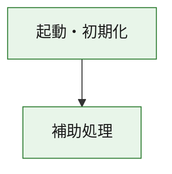
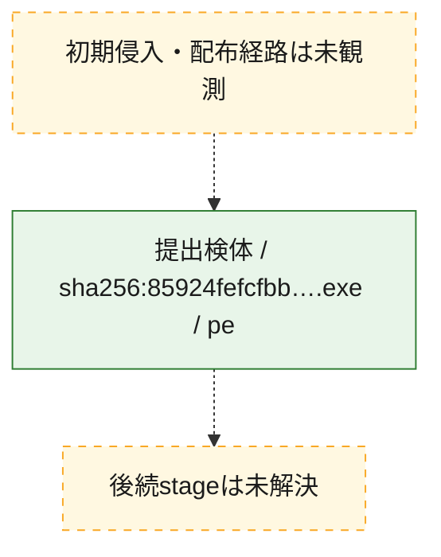
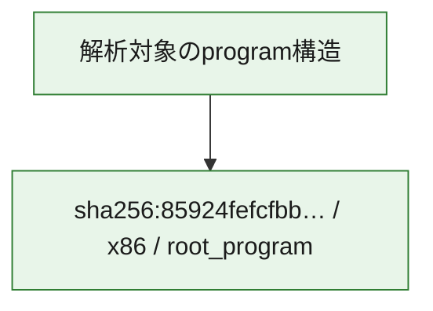

# 全体ロジック：85924fefcfbbbd26057dc4d5ffd65557f7af612b9481e8b4a0b6b7b13a0fe330

代表関数の静的証跡から、起動・初期化の処理群を確認しました。

## 読み方

- phaseの掲載順は解析上の整理順です。observed_call_edgesがない段階間の実行順を断定しません。
- 図の実線は静的に観測した関係、点線と黄色のノードは未観測・未解決の関係を示します。
- 図は静的な要約であり、動的実行を再現するものではありません。
- 詳細な関数解説とfingerprintは[STATIC-LOGIC.md](STATIC-LOGIC.md)を参照してください。

## 静的可視化

### 実行フロー

### 感染チェーン

### モジュール関係

## 処理段階

### 1. 起動・初期化

entry pointから初期化と後続処理への移行を確認します。
確度: `confirmed_static_function_evidence`

- `85924fefcfbbbd26057dc4d5ffd65557f7af612b9481e8b4a0b6b7b13a0fe330:ghidra:180001010` — 初期化と主要処理への分岐を行う入口関数です。 状態: `succeeded`、選定理由: `entry_point`, `meaningful_symbol_name`, `reviewed_call_centrality:22`, `role:entrypoint`, `small_program_complete_context`

### 2. 補助処理

主要処理を支える一般内部関数またはlibrary処理を確認します。
確度: `confirmed_static_function_evidence`

- `85924fefcfbbbd26057dc4d5ffd65557f7af612b9481e8b4a0b6b7b13a0fe330:ghidra:180001240` — 検体内部の一般処理を実装する関数です。 状態: `succeeded`、選定理由: `context_representative`, `reviewed_call_centrality:2`, `small_program_complete_context`
- `85924fefcfbbbd26057dc4d5ffd65557f7af612b9481e8b4a0b6b7b13a0fe330:ghidra:180001350` — 検体内部の一般処理を実装する関数です。 状態: `succeeded`、選定理由: `context_representative`, `reviewed_call_centrality:25`, `small_program_complete_context`
- `85924fefcfbbbd26057dc4d5ffd65557f7af612b9481e8b4a0b6b7b13a0fe330:ghidra:180003780` — 検体内部の一般処理を実装する関数です。 状態: `succeeded`、選定理由: `context_representative`, `reviewed_call_centrality:2`, `small_program_complete_context`
- `85924fefcfbbbd26057dc4d5ffd65557f7af612b9481e8b4a0b6b7b13a0fe330:ghidra:1800038e0` — 検体内部の一般処理を実装する関数です。 状態: `succeeded`、選定理由: `context_representative`, `reviewed_call_centrality:2`, `small_program_complete_context`

## 観測したcall関係

- `85924fefcfbbbd26057dc4d5ffd65557f7af612b9481e8b4a0b6b7b13a0fe330:ghidra:180001010` → `85924fefcfbbbd26057dc4d5ffd65557f7af612b9481e8b4a0b6b7b13a0fe330:ghidra:180001240` （`startup` → `support`）
- `85924fefcfbbbd26057dc4d5ffd65557f7af612b9481e8b4a0b6b7b13a0fe330:ghidra:180001010` → `85924fefcfbbbd26057dc4d5ffd65557f7af612b9481e8b4a0b6b7b13a0fe330:ghidra:180001350` （`startup` → `support`）
- `85924fefcfbbbd26057dc4d5ffd65557f7af612b9481e8b4a0b6b7b13a0fe330:ghidra:180001350` → `85924fefcfbbbd26057dc4d5ffd65557f7af612b9481e8b4a0b6b7b13a0fe330:ghidra:180001240` （`support` → `support`）
- `85924fefcfbbbd26057dc4d5ffd65557f7af612b9481e8b4a0b6b7b13a0fe330:ghidra:180001350` → `85924fefcfbbbd26057dc4d5ffd65557f7af612b9481e8b4a0b6b7b13a0fe330:ghidra:180003780` （`support` → `support`）
- `85924fefcfbbbd26057dc4d5ffd65557f7af612b9481e8b4a0b6b7b13a0fe330:ghidra:180001350` → `85924fefcfbbbd26057dc4d5ffd65557f7af612b9481e8b4a0b6b7b13a0fe330:ghidra:1800038e0` （`support` → `support`）
- `85924fefcfbbbd26057dc4d5ffd65557f7af612b9481e8b4a0b6b7b13a0fe330:ghidra:180003780` → `85924fefcfbbbd26057dc4d5ffd65557f7af612b9481e8b4a0b6b7b13a0fe330:ghidra:1800038e0` （`support` → `support`）
- `ghidra-function:8895670cde8cc57e8379463c` → `ghidra-external:0e2dca8409ddd2c6c8a2a8b4` （`unclassified` → `unclassified`）
- `ghidra-function:8895670cde8cc57e8379463c` → `ghidra-external:1e720a0705263a2836a7b98b` （`unclassified` → `unclassified`）
- `ghidra-function:8895670cde8cc57e8379463c` → `ghidra-external:1efa88a4b0a06417049d2c95` （`unclassified` → `unclassified`）
- `ghidra-function:8895670cde8cc57e8379463c` → `ghidra-external:2017fe53b24949637c9eadd1` （`unclassified` → `unclassified`）
- `ghidra-function:8895670cde8cc57e8379463c` → `ghidra-external:2a4885bea6d87de482c15993` （`unclassified` → `unclassified`）
- `ghidra-function:8895670cde8cc57e8379463c` → `ghidra-external:3064f4eb631769dd58cbff65` （`unclassified` → `unclassified`）
- `ghidra-function:8895670cde8cc57e8379463c` → `ghidra-external:4cef94418360a5d018157130` （`unclassified` → `unclassified`）
- `ghidra-function:8895670cde8cc57e8379463c` → `ghidra-external:7e4b7833c183b16c0a812cf0` （`unclassified` → `unclassified`）
- `ghidra-function:8895670cde8cc57e8379463c` → `ghidra-external:93b628e2aa00a9630a4d2666` （`unclassified` → `unclassified`）
- `ghidra-function:8895670cde8cc57e8379463c` → `ghidra-external:984cc06256286c56489e3fec` （`unclassified` → `unclassified`）
- `ghidra-function:8895670cde8cc57e8379463c` → `ghidra-external:a281b5ff892b055824ff45df` （`unclassified` → `unclassified`）
- `ghidra-function:8895670cde8cc57e8379463c` → `ghidra-external:abc929ab59e7c27f016dfcc3` （`unclassified` → `unclassified`）
- `ghidra-function:8895670cde8cc57e8379463c` → `ghidra-external:ac139f574497f43a6ed4dc88` （`unclassified` → `unclassified`）
- `ghidra-function:8895670cde8cc57e8379463c` → `ghidra-external:bb041f6a91e55128276e6924` （`unclassified` → `unclassified`）
- `ghidra-function:8895670cde8cc57e8379463c` → `ghidra-external:bc30c3b915afb3d06fae1441` （`unclassified` → `unclassified`）
- `ghidra-function:8895670cde8cc57e8379463c` → `ghidra-external:c14ca25a26eace4ef809b265` （`unclassified` → `unclassified`）
- `ghidra-function:8895670cde8cc57e8379463c` → `ghidra-external:ebb2f29788c89af4036c5b77` （`unclassified` → `unclassified`）
- `ghidra-function:8895670cde8cc57e8379463c` → `ghidra-external:f8220840d165e6a2a0ff9b91` （`unclassified` → `unclassified`）
- `ghidra-function:8895670cde8cc57e8379463c` → `ghidra-external:fa839d1380095f58c6a1beba` （`unclassified` → `unclassified`）
- `ghidra-function:8895670cde8cc57e8379463c` → `ghidra-external:fc6a56ac328022cdba9df231` （`unclassified` → `unclassified`）
- `ghidra-function:8895670cde8cc57e8379463c` → `ghidra-external:fe6d70877cdec40598961885` （`unclassified` → `unclassified`）
- `ghidra-function:8895670cde8cc57e8379463c` → `ghidra-function:b97aeddba6fb2d8139b7a504` （`unclassified` → `unclassified`）
- `ghidra-function:8895670cde8cc57e8379463c` → `ghidra-function:d9a582eefb2baef824ac5342` （`unclassified` → `unclassified`）
- `ghidra-function:8895670cde8cc57e8379463c` → `ghidra-function:f51a5406d2b20f34dabdd1f1` （`unclassified` → `unclassified`）
- `ghidra-function:ab5452e086627195f98ab285` → `ghidra-function:054cc74f7c57499a42785aba` （`unclassified` → `unclassified`）
- `ghidra-function:ab5452e086627195f98ab285` → `ghidra-function:1c70b39f0ee552d20af28418` （`unclassified` → `unclassified`）
- `ghidra-function:ab5452e086627195f98ab285` → `ghidra-function:2634a28ae2435616c3d3e9ff` （`unclassified` → `unclassified`）
- `ghidra-function:ab5452e086627195f98ab285` → `ghidra-function:30ce75bff59dbf23c2db8ceb` （`unclassified` → `unclassified`）
- `ghidra-function:ab5452e086627195f98ab285` → `ghidra-function:3a534bba718d3029c0e0501b` （`unclassified` → `unclassified`）
- `ghidra-function:ab5452e086627195f98ab285` → `ghidra-function:61b83a3ca60e3a44dd64c2db` （`unclassified` → `unclassified`）
- `ghidra-function:ab5452e086627195f98ab285` → `ghidra-function:8895670cde8cc57e8379463c` （`unclassified` → `unclassified`）
- `ghidra-function:ab5452e086627195f98ab285` → `ghidra-function:a12bbf11650a65c83e2bc365` （`unclassified` → `unclassified`）
- `ghidra-function:ab5452e086627195f98ab285` → `ghidra-function:c11bdbd466689587be1b3391` （`unclassified` → `unclassified`）
- `ghidra-function:ab5452e086627195f98ab285` → `ghidra-function:e06857fa5c4273967e17ea5c` （`unclassified` → `unclassified`）
- `ghidra-function:ab5452e086627195f98ab285` → `ghidra-function:f51a5406d2b20f34dabdd1f1` （`unclassified` → `unclassified`）
- `ghidra-function:ab5452e086627195f98ab285` → `ghidra-function:f80564e81d9620bd8d271581` （`unclassified` → `unclassified`）
- `ghidra-function:d9a582eefb2baef824ac5342` → `ghidra-function:b97aeddba6fb2d8139b7a504` （`unclassified` → `unclassified`）

## 解析範囲と制約

- 選定外関数は全体inventoryへ残しますが、関数本体の個別解説対象にはしていません。
- indirect call、難読化、packer、VM、壊れたcontrol flowによりcall関係が欠落する場合があります。
- 文書は静的解析に基づき、検体実行や外部通信による動的確認は行っていません。
