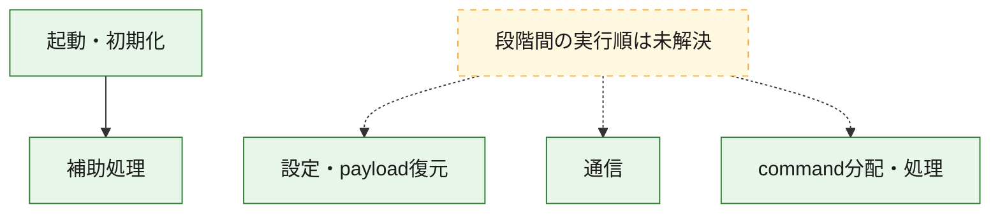
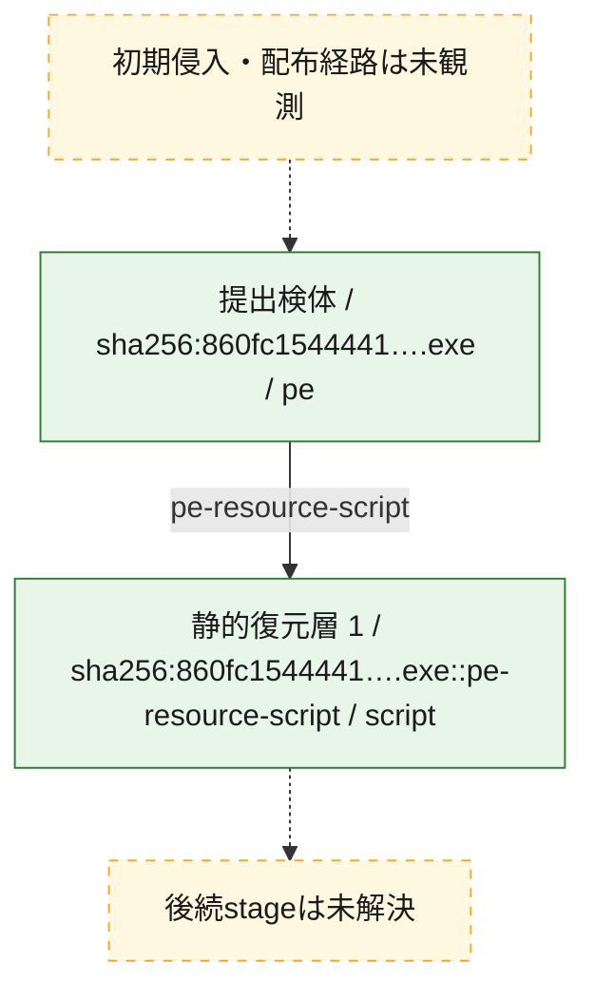
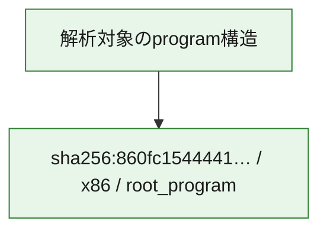

# 全体ロジック：860fc154444167d8411d3796d047093ad242fcb071eb645e845ea9e048c15cb5

代表関数の静的証跡から、起動・初期化、設定・payload復元、通信、command分配・処理の処理群を確認しました。

## 読み方

- phaseの掲載順は解析上の整理順です。observed_call_edgesがない段階間の実行順を断定しません。
- 図の実線は静的に観測した関係、点線と黄色のノードは未観測・未解決の関係を示します。
- 図は静的な要約であり、動的実行を再現するものではありません。
- 詳細な関数解説とfingerprintは[STATIC-LOGIC.md](STATIC-LOGIC.md)を参照してください。

## 静的可視化

### 実行フロー

### 感染チェーン

### モジュール関係

## 処理段階

### 1. 起動・初期化

entry pointから初期化と後続処理への移行を確認します。
確度: `confirmed_static_function_evidence`

- `860fc154444167d8411d3796d047093ad242fcb071eb645e845ea9e048c15cb5:ghidra:00646fc0` — 初期化と主要処理への分岐を行う入口関数です。 状態: `succeeded`、選定理由: `entry_point`, `meaningful_symbol_name`, `reviewed_call_centrality:22`, `role:entrypoint`

### 2. 設定・payload復元

設定、resource、payload、暗号化データの復元・変換を確認します。
確度: `confirmed_static_function_evidence_with_limits`

- `860fc154444167d8411d3796d047093ad242fcb071eb645e845ea9e048c15cb5:ghidra:0064031e` — 設定、resource、payloadなどの解析・変換を行う関数です。 状態: `limited_bad_instruction_or_flow`、選定理由: `meaningful_symbol_name`, `reviewed_call_centrality:1`, `role:config_or_data_transform`

### 3. 通信

通信初期化、endpoint処理、送受信の役割を確認します。
確度: `confirmed_static_function_evidence_with_limits`

- `860fc154444167d8411d3796d047093ad242fcb071eb645e845ea9e048c15cb5:ghidra:00640115` — 通信初期化、送受信、またはendpoint処理に関係する関数です。 状態: `limited_bad_instruction_or_flow`、選定理由: `meaningful_symbol_name`, `reviewed_call_centrality:1`, `role:network_communication`
- `860fc154444167d8411d3796d047093ad242fcb071eb645e845ea9e048c15cb5:ghidra:00640364` — 通信初期化、送受信、またはendpoint処理に関係する関数です。 状態: `limited_bad_instruction_or_flow`、選定理由: `meaningful_symbol_name`, `reviewed_call_centrality:1`, `role:network_communication`
- `860fc154444167d8411d3796d047093ad242fcb071eb645e845ea9e048c15cb5:ghidra:0066f35f` — 通信初期化、送受信、またはendpoint処理に関係する関数です。 状態: `limited_bad_instruction_or_flow`、選定理由: `meaningful_symbol_name`, `reviewed_call_centrality:1`, `role:network_communication`
- `860fc154444167d8411d3796d047093ad242fcb071eb645e845ea9e048c15cb5:ghidra:0066f373` — 通信初期化、送受信、またはendpoint処理に関係する関数です。 状態: `limited_bad_instruction_or_flow`、選定理由: `meaningful_symbol_name`, `reviewed_call_centrality:1`, `role:network_communication`
- `860fc154444167d8411d3796d047093ad242fcb071eb645e845ea9e048c15cb5:ghidra:0066f5ef` — 通信初期化、送受信、またはendpoint処理に関係する関数です。 状態: `limited_bad_instruction_or_flow`、選定理由: `meaningful_symbol_name`, `reviewed_call_centrality:1`, `role:network_communication`
- `860fc154444167d8411d3796d047093ad242fcb071eb645e845ea9e048c15cb5:ghidra:0066f635` — 通信初期化、送受信、またはendpoint処理に関係する関数です。 状態: `failed`、選定理由: `meaningful_symbol_name`, `reviewed_call_centrality:1`, `role:network_communication`

### 4. command分配・処理

受信commandやtaskの解釈、分配、個別handlerへの移行を確認します。
確度: `confirmed_static_function_evidence_with_limits`

- `860fc154444167d8411d3796d047093ad242fcb071eb645e845ea9e048c15cb5:ghidra:006403c8` — commandの解釈、分配、または個別処理を担当する関数です。 状態: `limited_bad_instruction_or_flow`、選定理由: `meaningful_symbol_name`, `reviewed_call_centrality:1`, `role:command_dispatch_or_handler`
- `860fc154444167d8411d3796d047093ad242fcb071eb645e845ea9e048c15cb5:ghidra:006407ed` — commandの解釈、分配、または個別処理を担当する関数です。 状態: `limited_bad_instruction_or_flow`、選定理由: `meaningful_symbol_name`, `reviewed_call_centrality:1`, `role:command_dispatch_or_handler`
- `860fc154444167d8411d3796d047093ad242fcb071eb645e845ea9e048c15cb5:ghidra:006407f7` — commandの解釈、分配、または個別処理を担当する関数です。 状態: `limited_bad_instruction_or_flow`、選定理由: `meaningful_symbol_name`, `reviewed_call_centrality:1`, `role:command_dispatch_or_handler`
- `860fc154444167d8411d3796d047093ad242fcb071eb645e845ea9e048c15cb5:ghidra:0066f387` — commandの解釈、分配、または個別処理を担当する関数です。 状態: `limited_bad_instruction_or_flow`、選定理由: `meaningful_symbol_name`, `reviewed_call_centrality:1`, `role:command_dispatch_or_handler`

### 5. 補助処理

主要処理を支える一般内部関数またはlibrary処理を確認します。
確度: `confirmed_static_function_evidence_with_limits`

- `860fc154444167d8411d3796d047093ad242fcb071eb645e845ea9e048c15cb5:ghidra:00408440` — 検体内部の一般処理を実装する関数です。 状態: `succeeded`、選定理由: `meaningful_symbol_name`, `reviewed_call_centrality:3`
- `860fc154444167d8411d3796d047093ad242fcb071eb645e845ea9e048c15cb5:ghidra:0063fd4a` — 検体内部の一般処理を実装する関数です。 状態: `limited_bad_instruction_or_flow`、選定理由: `meaningful_symbol_name`, `reviewed_call_centrality:1`
- `860fc154444167d8411d3796d047093ad242fcb071eb645e845ea9e048c15cb5:ghidra:0063fd65` — 検体内部の一般処理を実装する関数です。 状態: `limited_bad_instruction_or_flow`、選定理由: `meaningful_symbol_name`, `reviewed_call_centrality:1`
- `860fc154444167d8411d3796d047093ad242fcb071eb645e845ea9e048c15cb5:ghidra:0063fd6f` — 検体内部の一般処理を実装する関数です。 状態: `limited_bad_instruction_or_flow`、選定理由: `meaningful_symbol_name`, `reviewed_call_centrality:1`
- `860fc154444167d8411d3796d047093ad242fcb071eb645e845ea9e048c15cb5:ghidra:0063fd8a` — 検体内部の一般処理を実装する関数です。 状態: `limited_bad_instruction_or_flow`、選定理由: `meaningful_symbol_name`, `reviewed_call_centrality:1`
- `860fc154444167d8411d3796d047093ad242fcb071eb645e845ea9e048c15cb5:ghidra:0063fdaa` — 検体内部の一般処理を実装する関数です。 状態: `limited_bad_instruction_or_flow`、選定理由: `meaningful_symbol_name`, `reviewed_call_centrality:1`
- `860fc154444167d8411d3796d047093ad242fcb071eb645e845ea9e048c15cb5:ghidra:0063fdb4` — 検体内部の一般処理を実装する関数です。 状態: `limited_bad_instruction_or_flow`、選定理由: `meaningful_symbol_name`, `reviewed_call_centrality:1`
- `860fc154444167d8411d3796d047093ad242fcb071eb645e845ea9e048c15cb5:ghidra:0063fdbe` — 検体内部の一般処理を実装する関数です。 状態: `limited_bad_instruction_or_flow`、選定理由: `meaningful_symbol_name`, `reviewed_call_centrality:1`
- `860fc154444167d8411d3796d047093ad242fcb071eb645e845ea9e048c15cb5:ghidra:0063fdc8` — 検体内部の一般処理を実装する関数です。 状態: `limited_bad_instruction_or_flow`、選定理由: `meaningful_symbol_name`, `reviewed_call_centrality:1`
- `860fc154444167d8411d3796d047093ad242fcb071eb645e845ea9e048c15cb5:ghidra:0063fe1a` — 検体内部の一般処理を実装する関数です。 状態: `limited_bad_instruction_or_flow`、選定理由: `meaningful_symbol_name`, `reviewed_call_centrality:1`
- `860fc154444167d8411d3796d047093ad242fcb071eb645e845ea9e048c15cb5:ghidra:0063fe24` — 検体内部の一般処理を実装する関数です。 状態: `limited_bad_instruction_or_flow`、選定理由: `meaningful_symbol_name`, `reviewed_call_centrality:1`
- `860fc154444167d8411d3796d047093ad242fcb071eb645e845ea9e048c15cb5:ghidra:0063fe2e` — 検体内部の一般処理を実装する関数です。 状態: `limited_bad_instruction_or_flow`、選定理由: `meaningful_symbol_name`, `reviewed_call_centrality:1`
- `860fc154444167d8411d3796d047093ad242fcb071eb645e845ea9e048c15cb5:ghidra:0063fe38` — 検体内部の一般処理を実装する関数です。 状態: `limited_bad_instruction_or_flow`、選定理由: `meaningful_symbol_name`, `reviewed_call_centrality:1`
- `860fc154444167d8411d3796d047093ad242fcb071eb645e845ea9e048c15cb5:ghidra:0063fe53` — 検体内部の一般処理を実装する関数です。 状態: `limited_bad_instruction_or_flow`、選定理由: `meaningful_symbol_name`, `reviewed_call_centrality:1`
- `860fc154444167d8411d3796d047093ad242fcb071eb645e845ea9e048c15cb5:ghidra:0063fe5d` — 検体内部の一般処理を実装する関数です。 状態: `limited_bad_instruction_or_flow`、選定理由: `meaningful_symbol_name`, `reviewed_call_centrality:1`
- `860fc154444167d8411d3796d047093ad242fcb071eb645e845ea9e048c15cb5:ghidra:0063fe67` — 検体内部の一般処理を実装する関数です。 状態: `limited_bad_instruction_or_flow`、選定理由: `meaningful_symbol_name`, `reviewed_call_centrality:1`
- `860fc154444167d8411d3796d047093ad242fcb071eb645e845ea9e048c15cb5:ghidra:0063fe71` — 検体内部の一般処理を実装する関数です。 状態: `limited_bad_instruction_or_flow`、選定理由: `meaningful_symbol_name`, `reviewed_call_centrality:1`
- `860fc154444167d8411d3796d047093ad242fcb071eb645e845ea9e048c15cb5:ghidra:0063fe7b` — 検体内部の一般処理を実装する関数です。 状態: `limited_bad_instruction_or_flow`、選定理由: `meaningful_symbol_name`, `reviewed_call_centrality:1`
- `860fc154444167d8411d3796d047093ad242fcb071eb645e845ea9e048c15cb5:ghidra:0066fc20` — compiler生成処理または汎用library処理とみられる関数です。 状態: `succeeded`、選定理由: `entry_point`, `meaningful_symbol_name`, `reviewed_call_centrality:1`
- `860fc154444167d8411d3796d047093ad242fcb071eb645e845ea9e048c15cb5:ghidra:0066fcb0` — compiler生成処理または汎用library処理とみられる関数です。 状態: `succeeded`、選定理由: `entry_point`, `meaningful_symbol_name`, `reviewed_call_centrality:2`

## 観測したcall関係

- `860fc154444167d8411d3796d047093ad242fcb071eb645e845ea9e048c15cb5:ghidra:00646fc0` → `860fc154444167d8411d3796d047093ad242fcb071eb645e845ea9e048c15cb5:ghidra:00408440` （`startup` → `support`）
- `860fc154444167d8411d3796d047093ad242fcb071eb645e845ea9e048c15cb5:ghidra:0066fc20` → `860fc154444167d8411d3796d047093ad242fcb071eb645e845ea9e048c15cb5:ghidra:00408440` （`support` → `support`）
- `860fc154444167d8411d3796d047093ad242fcb071eb645e845ea9e048c15cb5:ghidra:0066fcb0` → `860fc154444167d8411d3796d047093ad242fcb071eb645e845ea9e048c15cb5:ghidra:00408440` （`support` → `support`）
- `ghidra-function:0585fd5fd9a62dd7c46ac4cf` → `ghidra-external:1148a825d6df41bfb080b300` （`unclassified` → `unclassified`）
- `ghidra-function:1734d4da9806a8b9753c29c6` → `ghidra-external:1148a825d6df41bfb080b300` （`unclassified` → `unclassified`）
- `ghidra-function:1789234b09d5b33b2b7b73ae` → `ghidra-external:1148a825d6df41bfb080b300` （`unclassified` → `unclassified`）
- `ghidra-function:232c553cf9421c4feb28ebd3` → `ghidra-external:1148a825d6df41bfb080b300` （`unclassified` → `unclassified`）
- `ghidra-function:232fdd068cc72f0d4d485c64` → `ghidra-external:1148a825d6df41bfb080b300` （`unclassified` → `unclassified`）
- `ghidra-function:325426f2ea0fb26c8e0acde4` → `ghidra-external:1148a825d6df41bfb080b300` （`unclassified` → `unclassified`）
- `ghidra-function:3aae028cf3adcf8cd2a2c8d8` → `ghidra-external:1148a825d6df41bfb080b300` （`unclassified` → `unclassified`）
- `ghidra-function:43a05413da233b6d8b681c41` → `ghidra-external:1148a825d6df41bfb080b300` （`unclassified` → `unclassified`）
- `ghidra-function:43a80eb7f9809ff9c16ab6da` → `ghidra-external:1148a825d6df41bfb080b300` （`unclassified` → `unclassified`）
- `ghidra-function:491c69884c37c94fe06f8d86` → `ghidra-function:2e694c0d15d2a08c6ea95b81` （`unclassified` → `unclassified`）
- `ghidra-function:5541a395dd73667357286189` → `ghidra-external:1148a825d6df41bfb080b300` （`unclassified` → `unclassified`）
- `ghidra-function:56c81e09a08ce2bfb4e660d3` → `ghidra-external:1148a825d6df41bfb080b300` （`unclassified` → `unclassified`）
- `ghidra-function:59f275531bd8f7436320280c` → `ghidra-external:1148a825d6df41bfb080b300` （`unclassified` → `unclassified`）
- `ghidra-function:5d76a3042149e36cc62c12ad` → `ghidra-external:1148a825d6df41bfb080b300` （`unclassified` → `unclassified`）
- `ghidra-function:61d2389dd08bae7f173677e5` → `ghidra-external:1148a825d6df41bfb080b300` （`unclassified` → `unclassified`）
- `ghidra-function:671b66eb0666594141b102cb` → `ghidra-external:1148a825d6df41bfb080b300` （`unclassified` → `unclassified`）
- `ghidra-function:715bc4326290c2f189babd0e` → `ghidra-external:73205f69a4f2e4d0bc58a198` （`unclassified` → `unclassified`）
- `ghidra-function:715bc4326290c2f189babd0e` → `ghidra-function:2e694c0d15d2a08c6ea95b81` （`unclassified` → `unclassified`）
- `ghidra-function:7994fc2d27b1228788887689` → `ghidra-external:1148a825d6df41bfb080b300` （`unclassified` → `unclassified`）
- `ghidra-function:7e0dae0e52ed428eb6060489` → `ghidra-external:1148a825d6df41bfb080b300` （`unclassified` → `unclassified`）
- `ghidra-function:7e616e96550509a1b62d472f` → `ghidra-external:1148a825d6df41bfb080b300` （`unclassified` → `unclassified`）
- `ghidra-function:80077880926723c9ca95b43d` → `ghidra-external:1148a825d6df41bfb080b300` （`unclassified` → `unclassified`）
- `ghidra-function:88f72c3f89eb1fb2c7bbd92d` → `ghidra-external:1148a825d6df41bfb080b300` （`unclassified` → `unclassified`）
- `ghidra-function:90d9994fab3a89deb34a34b6` → `ghidra-external:1148a825d6df41bfb080b300` （`unclassified` → `unclassified`）
- `ghidra-function:9cdff2edfede1e08c2520367` → `ghidra-external:1148a825d6df41bfb080b300` （`unclassified` → `unclassified`）
- `ghidra-function:c06d8ae319bfa494e9993a2a` → `ghidra-external:1148a825d6df41bfb080b300` （`unclassified` → `unclassified`）
- `ghidra-function:dc1b9b89dea772f0936a6b61` → `ghidra-external:1148a825d6df41bfb080b300` （`unclassified` → `unclassified`）
- `ghidra-function:e08ea60c11e3a794b3a895ad` → `ghidra-external:1148a825d6df41bfb080b300` （`unclassified` → `unclassified`）
- `ghidra-function:eb721ff622c3d9dad2352042` → `ghidra-external:1148a825d6df41bfb080b300` （`unclassified` → `unclassified`）
- `ghidra-function:f1c0dff248b1e16df3adfd79` → `ghidra-external:067dd10cc53ac1389eae2fa7` （`unclassified` → `unclassified`）
- `ghidra-function:f1c0dff248b1e16df3adfd79` → `ghidra-external:09c867bb0fe5bab746cf135d` （`unclassified` → `unclassified`）
- `ghidra-function:f1c0dff248b1e16df3adfd79` → `ghidra-external:0b36ca81799deaa8bd1d82c7` （`unclassified` → `unclassified`）
- `ghidra-function:f1c0dff248b1e16df3adfd79` → `ghidra-external:2b0c75f6784a2e0d7b82d225` （`unclassified` → `unclassified`）
- `ghidra-function:f1c0dff248b1e16df3adfd79` → `ghidra-external:2db5768439a68149cb80c214` （`unclassified` → `unclassified`）
- `ghidra-function:f1c0dff248b1e16df3adfd79` → `ghidra-external:42158a1f1a4bd624030b8f35` （`unclassified` → `unclassified`）
- `ghidra-function:f1c0dff248b1e16df3adfd79` → `ghidra-external:452fe7d3348979f5a30b74c3` （`unclassified` → `unclassified`）
- `ghidra-function:f1c0dff248b1e16df3adfd79` → `ghidra-external:4a9553a2200ce29a6f800003` （`unclassified` → `unclassified`）
- `ghidra-function:f1c0dff248b1e16df3adfd79` → `ghidra-external:4acfa4d4bf1198986e0e5175` （`unclassified` → `unclassified`）
- `ghidra-function:f1c0dff248b1e16df3adfd79` → `ghidra-external:69cfd45e33e2d6d2c43fc24c` （`unclassified` → `unclassified`）
- `ghidra-function:f1c0dff248b1e16df3adfd79` → `ghidra-external:69d93133264fd9b0c0aef487` （`unclassified` → `unclassified`）
- `ghidra-function:f1c0dff248b1e16df3adfd79` → `ghidra-external:6fded3ef3d9535f2ffce9190` （`unclassified` → `unclassified`）
- `ghidra-function:f1c0dff248b1e16df3adfd79` → `ghidra-external:733a4a4f988f0d0f2aed00eb` （`unclassified` → `unclassified`）
- `ghidra-function:f1c0dff248b1e16df3adfd79` → `ghidra-external:7edf57523dc9e10079a4d450` （`unclassified` → `unclassified`）
- `ghidra-function:f1c0dff248b1e16df3adfd79` → `ghidra-external:91fb874e514ce63fc1078fc9` （`unclassified` → `unclassified`）
- `ghidra-function:f1c0dff248b1e16df3adfd79` → `ghidra-external:a7d3a1ccea15606b5f3dd4c8` （`unclassified` → `unclassified`）
- `ghidra-function:f1c0dff248b1e16df3adfd79` → `ghidra-external:da392edc936d4f2f16e00fcd` （`unclassified` → `unclassified`）
- `ghidra-function:f1c0dff248b1e16df3adfd79` → `ghidra-external:df940740c866837094e61301` （`unclassified` → `unclassified`）
- `ghidra-function:f1c0dff248b1e16df3adfd79` → `ghidra-external:f0683d4ae2e93601883aa74a` （`unclassified` → `unclassified`）
- `ghidra-function:f1c0dff248b1e16df3adfd79` → `ghidra-external:fc357a82845d1b57d5df3ffb` （`unclassified` → `unclassified`）
- `ghidra-function:f1c0dff248b1e16df3adfd79` → `ghidra-function:2e694c0d15d2a08c6ea95b81` （`unclassified` → `unclassified`）
- `ghidra-function:f1c0dff248b1e16df3adfd79` → `ghidra-function:ec24d49ddd388ddd72be3fb2` （`unclassified` → `unclassified`）
- `ghidra-function:f8d498bebca2b0005a0f9579` → `ghidra-external:1148a825d6df41bfb080b300` （`unclassified` → `unclassified`）
- `ghidra-function:ff37f5cda2f1de8a8f22040c` → `ghidra-external:1148a825d6df41bfb080b300` （`unclassified` → `unclassified`）

## 解析範囲と制約

- 選定外関数は全体inventoryへ残しますが、関数本体の個別解説対象にはしていません。
- indirect call、難読化、packer、VM、壊れたcontrol flowによりcall関係が欠落する場合があります。
- 文書は静的解析に基づき、検体実行や外部通信による動的確認は行っていません。
