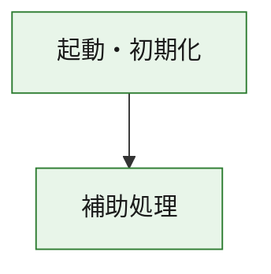
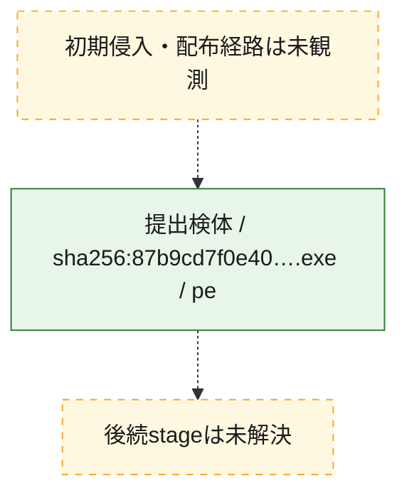
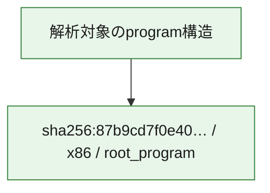

# 全体ロジック：87b9cd7f0e4003d9adf618690e2e42d5b32db03b2e736e5655309f23198a0a72

代表関数の静的証跡から、起動・初期化の処理群を確認しました。

## 読み方

- phaseの掲載順は解析上の整理順です。observed_call_edgesがない段階間の実行順を断定しません。
- 図の実線は静的に観測した関係、点線と黄色のノードは未観測・未解決の関係を示します。
- 図は静的な要約であり、動的実行を再現するものではありません。
- 詳細な関数解説とfingerprintは[STATIC-LOGIC.md](STATIC-LOGIC.md)を参照してください。

## 静的可視化

### 実行フロー

### 感染チェーン

### モジュール関係

## 処理段階

### 1. 起動・初期化

entry pointから初期化と後続処理への移行を確認します。
確度: `confirmed_static_function_evidence`

- `87b9cd7f0e4003d9adf618690e2e42d5b32db03b2e736e5655309f23198a0a72:ghidra:180001010` — 初期化と主要処理への分岐を行う入口関数です。 状態: `succeeded`、選定理由: `entry_point`, `meaningful_symbol_name`, `reviewed_call_centrality:22`, `role:entrypoint`, `small_program_complete_context`

### 2. 補助処理

主要処理を支える一般内部関数またはlibrary処理を確認します。
確度: `confirmed_static_function_evidence`

- `87b9cd7f0e4003d9adf618690e2e42d5b32db03b2e736e5655309f23198a0a72:ghidra:180001240` — 検体内部の一般処理を実装する関数です。 状態: `succeeded`、選定理由: `context_representative`, `reviewed_call_centrality:2`, `small_program_complete_context`
- `87b9cd7f0e4003d9adf618690e2e42d5b32db03b2e736e5655309f23198a0a72:ghidra:180001350` — 検体内部の一般処理を実装する関数です。 状態: `succeeded`、選定理由: `context_representative`, `reviewed_call_centrality:25`, `small_program_complete_context`
- `87b9cd7f0e4003d9adf618690e2e42d5b32db03b2e736e5655309f23198a0a72:ghidra:180003780` — 検体内部の一般処理を実装する関数です。 状態: `succeeded`、選定理由: `context_representative`, `reviewed_call_centrality:2`, `small_program_complete_context`
- `87b9cd7f0e4003d9adf618690e2e42d5b32db03b2e736e5655309f23198a0a72:ghidra:1800038e0` — 検体内部の一般処理を実装する関数です。 状態: `succeeded`、選定理由: `context_representative`, `reviewed_call_centrality:2`, `small_program_complete_context`

## 観測したcall関係

- `87b9cd7f0e4003d9adf618690e2e42d5b32db03b2e736e5655309f23198a0a72:ghidra:180001010` → `87b9cd7f0e4003d9adf618690e2e42d5b32db03b2e736e5655309f23198a0a72:ghidra:180001240` （`startup` → `support`）
- `87b9cd7f0e4003d9adf618690e2e42d5b32db03b2e736e5655309f23198a0a72:ghidra:180001010` → `87b9cd7f0e4003d9adf618690e2e42d5b32db03b2e736e5655309f23198a0a72:ghidra:180001350` （`startup` → `support`）
- `87b9cd7f0e4003d9adf618690e2e42d5b32db03b2e736e5655309f23198a0a72:ghidra:180001350` → `87b9cd7f0e4003d9adf618690e2e42d5b32db03b2e736e5655309f23198a0a72:ghidra:180001240` （`support` → `support`）
- `87b9cd7f0e4003d9adf618690e2e42d5b32db03b2e736e5655309f23198a0a72:ghidra:180001350` → `87b9cd7f0e4003d9adf618690e2e42d5b32db03b2e736e5655309f23198a0a72:ghidra:180003780` （`support` → `support`）
- `87b9cd7f0e4003d9adf618690e2e42d5b32db03b2e736e5655309f23198a0a72:ghidra:180001350` → `87b9cd7f0e4003d9adf618690e2e42d5b32db03b2e736e5655309f23198a0a72:ghidra:1800038e0` （`support` → `support`）
- `87b9cd7f0e4003d9adf618690e2e42d5b32db03b2e736e5655309f23198a0a72:ghidra:180003780` → `87b9cd7f0e4003d9adf618690e2e42d5b32db03b2e736e5655309f23198a0a72:ghidra:1800038e0` （`support` → `support`）
- `ghidra-function:38b352d11f85cb07114da337` → `ghidra-function:70a3be031bc7958ac424aa67` （`unclassified` → `unclassified`）
- `ghidra-function:919b7845a45deb30e0f827ea` → `ghidra-external:0b22253fba62366e4183a1ab` （`unclassified` → `unclassified`）
- `ghidra-function:919b7845a45deb30e0f827ea` → `ghidra-external:1d0860c246c8a36daad73208` （`unclassified` → `unclassified`）
- `ghidra-function:919b7845a45deb30e0f827ea` → `ghidra-external:295be0e6c7ef1aae14af245d` （`unclassified` → `unclassified`）
- `ghidra-function:919b7845a45deb30e0f827ea` → `ghidra-external:2bf6a74528132bf837f13fb5` （`unclassified` → `unclassified`）
- `ghidra-function:919b7845a45deb30e0f827ea` → `ghidra-external:372392157ab7a6c53059b053` （`unclassified` → `unclassified`）
- `ghidra-function:919b7845a45deb30e0f827ea` → `ghidra-external:40675182d0954a1d5e7f98d2` （`unclassified` → `unclassified`）
- `ghidra-function:919b7845a45deb30e0f827ea` → `ghidra-external:527432b02e5db37658cfc226` （`unclassified` → `unclassified`）
- `ghidra-function:919b7845a45deb30e0f827ea` → `ghidra-external:52ab6c45c414c405614fd874` （`unclassified` → `unclassified`）
- `ghidra-function:919b7845a45deb30e0f827ea` → `ghidra-external:5a122fc2e42835127855c622` （`unclassified` → `unclassified`）
- `ghidra-function:919b7845a45deb30e0f827ea` → `ghidra-external:5bd1caf27d72587ea0108481` （`unclassified` → `unclassified`）
- `ghidra-function:919b7845a45deb30e0f827ea` → `ghidra-external:6cbca9c0a35c232f0496785b` （`unclassified` → `unclassified`）
- `ghidra-function:919b7845a45deb30e0f827ea` → `ghidra-external:6de516bd404de4525bbdf97b` （`unclassified` → `unclassified`）
- `ghidra-function:919b7845a45deb30e0f827ea` → `ghidra-external:93e741725434644b628b425d` （`unclassified` → `unclassified`）
- `ghidra-function:919b7845a45deb30e0f827ea` → `ghidra-external:94f5f4664d4c6e4eba5368d0` （`unclassified` → `unclassified`）
- `ghidra-function:919b7845a45deb30e0f827ea` → `ghidra-external:9636adef60640cd09a028490` （`unclassified` → `unclassified`）
- `ghidra-function:919b7845a45deb30e0f827ea` → `ghidra-external:9d3cc37a38b7677a022bd6a2` （`unclassified` → `unclassified`）
- `ghidra-function:919b7845a45deb30e0f827ea` → `ghidra-external:a99bc914c2879e40fad50a88` （`unclassified` → `unclassified`）
- `ghidra-function:919b7845a45deb30e0f827ea` → `ghidra-external:d1869c8188c2ef6f73af522c` （`unclassified` → `unclassified`）
- `ghidra-function:919b7845a45deb30e0f827ea` → `ghidra-external:dc76bc01c62e1a5157787cd6` （`unclassified` → `unclassified`）
- `ghidra-function:919b7845a45deb30e0f827ea` → `ghidra-external:dddd2fd04671c28b421f19b0` （`unclassified` → `unclassified`）
- `ghidra-function:919b7845a45deb30e0f827ea` → `ghidra-external:ec0f21dd556d5ca03363c027` （`unclassified` → `unclassified`）
- `ghidra-function:919b7845a45deb30e0f827ea` → `ghidra-function:38b352d11f85cb07114da337` （`unclassified` → `unclassified`）
- `ghidra-function:919b7845a45deb30e0f827ea` → `ghidra-function:6b773c7dc95180dc1425d4c4` （`unclassified` → `unclassified`）
- `ghidra-function:919b7845a45deb30e0f827ea` → `ghidra-function:70a3be031bc7958ac424aa67` （`unclassified` → `unclassified`）
- `ghidra-function:bff9aad47e802dbeb48afabb` → `ghidra-function:2f3fed16fa85fad9d8db8d88` （`unclassified` → `unclassified`）
- `ghidra-function:bff9aad47e802dbeb48afabb` → `ghidra-function:36e2b2b16c9138e399c2b04d` （`unclassified` → `unclassified`）
- `ghidra-function:bff9aad47e802dbeb48afabb` → `ghidra-function:6b773c7dc95180dc1425d4c4` （`unclassified` → `unclassified`）
- `ghidra-function:bff9aad47e802dbeb48afabb` → `ghidra-function:74e2acd7318c28d7642f3aab` （`unclassified` → `unclassified`）
- `ghidra-function:bff9aad47e802dbeb48afabb` → `ghidra-function:9170e50fe7a697ed6e01e48f` （`unclassified` → `unclassified`）
- `ghidra-function:bff9aad47e802dbeb48afabb` → `ghidra-function:919b7845a45deb30e0f827ea` （`unclassified` → `unclassified`）
- `ghidra-function:bff9aad47e802dbeb48afabb` → `ghidra-function:a3c26f4ff85d8c0c837cb734` （`unclassified` → `unclassified`）
- `ghidra-function:bff9aad47e802dbeb48afabb` → `ghidra-function:a6dd8bdb6204f0150a080cc2` （`unclassified` → `unclassified`）
- `ghidra-function:bff9aad47e802dbeb48afabb` → `ghidra-function:ba10b4b493c9443a223bdde8` （`unclassified` → `unclassified`）
- `ghidra-function:bff9aad47e802dbeb48afabb` → `ghidra-function:c83f2627a0a2b069c16f2663` （`unclassified` → `unclassified`）
- `ghidra-function:bff9aad47e802dbeb48afabb` → `ghidra-function:f22f06b4b67deca85190b1e0` （`unclassified` → `unclassified`）
- `ghidra-function:bff9aad47e802dbeb48afabb` → `ghidra-function:fb91aabb36441caf2f5e160d` （`unclassified` → `unclassified`）

## 解析範囲と制約

- 選定外関数は全体inventoryへ残しますが、関数本体の個別解説対象にはしていません。
- indirect call、難読化、packer、VM、壊れたcontrol flowによりcall関係が欠落する場合があります。
- 文書は静的解析に基づき、検体実行や外部通信による動的確認は行っていません。
