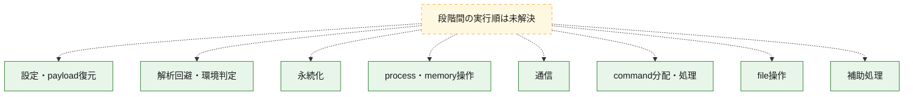
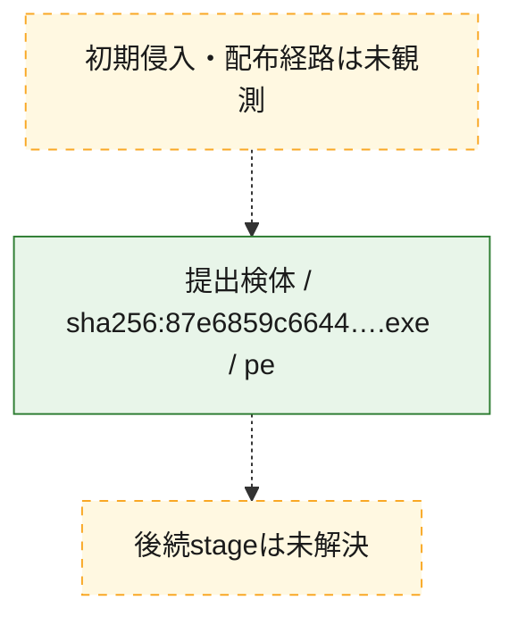
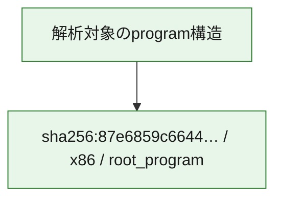

# 全体ロジック：87e6859c66447242daaf9e0fa55d608bce1c572082e2e0d117d81a13663fc318

代表関数の静的証跡から、設定・payload復元、解析回避・環境判定、永続化、process・memory操作、通信、command分配・処理、file操作の処理群を確認しました。

## 読み方

- phaseの掲載順は解析上の整理順です。observed_call_edgesがない段階間の実行順を断定しません。
- 図の実線は静的に観測した関係、点線と黄色のノードは未観測・未解決の関係を示します。
- 図は静的な要約であり、動的実行を再現するものではありません。
- 詳細な関数解説とfingerprintは[STATIC-LOGIC.md](STATIC-LOGIC.md)を参照してください。

## 静的可視化

### 実行フロー

### 感染チェーン

### モジュール関係

## 処理段階

### 1. 設定・payload復元

設定、resource、payload、暗号化データの復元・変換を確認します。
確度: `confirmed_static_function_evidence`

- `87e6859c66447242daaf9e0fa55d608bce1c572082e2e0d117d81a13663fc318:ghidra:00403620` — 暗号、hash、encoding、または復号処理に関係する関数です。 状態: `succeeded`、選定理由: `call_graph_centrality:in=3,out=17`, `large_function:instructions=169`, `meaningful_symbol_name`, `reviewed_call_centrality:28`, `reviewed_call_centrality:38`, `role:cryptographic_transform`
- `87e6859c66447242daaf9e0fa55d608bce1c572082e2e0d117d81a13663fc318:ghidra:004091c0` — 暗号、hash、encoding、または復号処理に関係する関数です。 状態: `succeeded`、選定理由: `call_graph_centrality:in=4,out=15`, `large_function:instructions=169`, `meaningful_symbol_name`, `reviewed_call_centrality:26`, `reviewed_call_centrality:33`, `role:cryptographic_transform`, `role:persistence`
- `87e6859c66447242daaf9e0fa55d608bce1c572082e2e0d117d81a13663fc318:ghidra:0040d940` — 暗号、hash、encoding、または復号処理に関係する関数です。 状態: `succeeded`、選定理由: `call_graph_centrality:in=4,out=9`, `large_function:instructions=309`, `meaningful_symbol_name`, `reviewed_call_centrality:13`, `reviewed_call_centrality:23`, `role:cryptographic_transform`
- `87e6859c66447242daaf9e0fa55d608bce1c572082e2e0d117d81a13663fc318:ghidra:0040e600` — 暗号、hash、encoding、または復号処理に関係する関数です。 状態: `succeeded`、選定理由: `call_graph_centrality:in=5,out=7`, `large_function:instructions=127`, `meaningful_symbol_name`, `reviewed_call_centrality:17`, `reviewed_call_centrality:18`, `role:cryptographic_transform`
- `87e6859c66447242daaf9e0fa55d608bce1c572082e2e0d117d81a13663fc318:ghidra:0040f200` — 暗号、hash、encoding、または復号処理に関係する関数です。 状態: `succeeded`、選定理由: `call_graph_centrality:in=2,out=8`, `large_function:instructions=203`, `meaningful_symbol_name`, `reviewed_call_centrality:12`, `reviewed_call_centrality:19`, `role:cryptographic_transform`
- `87e6859c66447242daaf9e0fa55d608bce1c572082e2e0d117d81a13663fc318:ghidra:0040fca0` — 暗号、hash、encoding、または復号処理に関係する関数です。 状態: `succeeded`、選定理由: `call_graph_centrality:in=34,out=8`, `large_function:instructions=201`, `meaningful_symbol_name`, `reviewed_call_centrality:12`, `reviewed_call_centrality:51`, `role:cryptographic_transform`
- `87e6859c66447242daaf9e0fa55d608bce1c572082e2e0d117d81a13663fc318:ghidra:0040ffc0` — 暗号、hash、encoding、または復号処理に関係する関数です。 状態: `succeeded`、選定理由: `call_graph_centrality:in=1,out=8`, `large_function:instructions=214`, `meaningful_symbol_name`, `reviewed_call_centrality:12`, `reviewed_call_centrality:18`, `role:cryptographic_transform`
- `87e6859c66447242daaf9e0fa55d608bce1c572082e2e0d117d81a13663fc318:ghidra:00410f60` — 暗号、hash、encoding、または復号処理に関係する関数です。 状態: `succeeded`、選定理由: `call_graph_centrality:in=6,out=9`, `large_function:instructions=258`, `meaningful_symbol_name`, `reviewed_call_centrality:13`, `reviewed_call_centrality:25`, `role:cryptographic_transform`
- `87e6859c66447242daaf9e0fa55d608bce1c572082e2e0d117d81a13663fc318:ghidra:0041e320` — 設定、resource、payloadなどの解析・変換を行う関数です。 状態: `succeeded`、選定理由: `call_graph_centrality:in=1,out=8`, `meaningful_symbol_name`, `reviewed_call_centrality:16`, `reviewed_call_centrality:18`, `role:config_or_data_transform`
- `87e6859c66447242daaf9e0fa55d608bce1c572082e2e0d117d81a13663fc318:ghidra:0042d1c0` — 暗号、hash、encoding、または復号処理に関係する関数です。 状態: `succeeded`、選定理由: `call_graph_centrality:in=6,out=9`, `large_function:instructions=159`, `meaningful_symbol_name`, `reviewed_call_centrality:16`, `reviewed_call_centrality:27`, `role:cryptographic_transform`

### 2. 解析回避・環境判定

debugger、sandbox、仮想環境、時間差などの判定を確認します。
確度: `confirmed_static_function_evidence`

- `87e6859c66447242daaf9e0fa55d608bce1c572082e2e0d117d81a13663fc318:ghidra:00402000` — debugger、仮想環境、sandbox、または時間差の確認に関係する関数です。 状態: `succeeded`、選定理由: `call_graph_centrality:in=1,out=7`, `large_function:instructions=381`, `meaningful_symbol_name`, `reviewed_call_centrality:11`, `reviewed_call_centrality:17`, `role:anti_analysis`
- `87e6859c66447242daaf9e0fa55d608bce1c572082e2e0d117d81a13663fc318:ghidra:0040a520` — debugger、仮想環境、sandbox、または時間差の確認に関係する関数です。 状態: `succeeded`、選定理由: `call_graph_centrality:in=147,out=6`, `large_function:instructions=117`, `meaningful_symbol_name`, `reviewed_call_centrality:162`, `reviewed_call_centrality:73`, `role:anti_analysis`
- `87e6859c66447242daaf9e0fa55d608bce1c572082e2e0d117d81a13663fc318:ghidra:0040a8a0` — debugger、仮想環境、sandbox、または時間差の確認に関係する関数です。 状態: `succeeded`、選定理由: `call_graph_centrality:in=5,out=5`, `large_function:instructions=73`, `meaningful_symbol_name`, `reviewed_call_centrality:10`, `reviewed_call_centrality:18`, `role:anti_analysis`
- `87e6859c66447242daaf9e0fa55d608bce1c572082e2e0d117d81a13663fc318:ghidra:0041ebc0` — debugger、仮想環境、sandbox、または時間差の確認に関係する関数です。 状態: `succeeded`、選定理由: `call_graph_centrality:in=1,out=10`, `large_function:instructions=148`, `meaningful_symbol_name`, `reviewed_call_centrality:17`, `reviewed_call_centrality:25`, `role:anti_analysis`

### 3. 永続化

自動起動や永続化に関係する設定変更を確認します。
確度: `confirmed_static_function_evidence`

- `87e6859c66447242daaf9e0fa55d608bce1c572082e2e0d117d81a13663fc318:ghidra:0040c8e0` — 自動起動または永続化に関係する処理を含む関数です。 状態: `succeeded`、選定理由: `call_graph_centrality:in=14,out=2`, `meaningful_symbol_name`, `reviewed_call_centrality:18`, `reviewed_call_centrality:19`, `role:persistence`
- `87e6859c66447242daaf9e0fa55d608bce1c572082e2e0d117d81a13663fc318:ghidra:0040c9e0` — 自動起動または永続化に関係する処理を含む関数です。 状態: `succeeded`、選定理由: `call_graph_centrality:in=1,out=6`, `large_function:instructions=167`, `meaningful_symbol_name`, `reviewed_call_centrality:16`, `reviewed_call_centrality:9`, `role:persistence`
- `87e6859c66447242daaf9e0fa55d608bce1c572082e2e0d117d81a13663fc318:ghidra:004151e0` — 自動起動または永続化に関係する処理を含む関数です。 状態: `succeeded`、選定理由: `call_graph_centrality:in=1,out=8`, `large_function:instructions=135`, `meaningful_symbol_name`, `reviewed_call_centrality:14`, `reviewed_call_centrality:22`, `role:persistence`

### 4. process・memory操作

process、thread、module、memory操作と実行移行を確認します。
確度: `confirmed_static_function_evidence`

- `87e6859c66447242daaf9e0fa55d608bce1c572082e2e0d117d81a13663fc318:ghidra:00401ac0` — process、thread、module、またはmemory操作に関係する関数です。 状態: `succeeded`、選定理由: `call_graph_centrality:in=1,out=8`, `large_function:instructions=307`, `meaningful_symbol_name`, `reviewed_call_centrality:16`, `reviewed_call_centrality:20`, `role:process_or_memory_operation`
- `87e6859c66447242daaf9e0fa55d608bce1c572082e2e0d117d81a13663fc318:ghidra:00417180` — process、thread、module、またはmemory操作に関係する関数です。 状態: `succeeded`、選定理由: `call_graph_centrality:in=1,out=30`, `large_function:instructions=647`, `meaningful_symbol_name`, `reviewed_call_centrality:49`, `reviewed_call_centrality:65`, `role:process_or_memory_operation`

### 5. 通信

通信初期化、endpoint処理、送受信の役割を確認します。
確度: `confirmed_static_function_evidence`

- `87e6859c66447242daaf9e0fa55d608bce1c572082e2e0d117d81a13663fc318:ghidra:004045e0` — 通信初期化、送受信、またはendpoint処理に関係する関数です。 状態: `succeeded`、選定理由: `call_graph_centrality:in=1,out=10`, `large_function:instructions=172`, `meaningful_symbol_name`, `reviewed_call_centrality:17`, `reviewed_call_centrality:22`, `role:network_communication`
- `87e6859c66447242daaf9e0fa55d608bce1c572082e2e0d117d81a13663fc318:ghidra:00404ca0` — 通信初期化、送受信、またはendpoint処理に関係する関数です。 状態: `succeeded`、選定理由: `call_graph_centrality:in=1,out=17`, `large_function:instructions=344`, `meaningful_symbol_name`, `reviewed_call_centrality:30`, `reviewed_call_centrality:34`, `role:network_communication`
- `87e6859c66447242daaf9e0fa55d608bce1c572082e2e0d117d81a13663fc318:ghidra:004059e0` — 通信初期化、送受信、またはendpoint処理に関係する関数です。 状態: `succeeded`、選定理由: `call_graph_centrality:in=1,out=17`, `large_function:instructions=376`, `meaningful_symbol_name`, `reviewed_call_centrality:29`, `reviewed_call_centrality:34`, `role:network_communication`
- `87e6859c66447242daaf9e0fa55d608bce1c572082e2e0d117d81a13663fc318:ghidra:00406020` — 通信初期化、送受信、またはendpoint処理に関係する関数です。 状態: `succeeded`、選定理由: `call_graph_centrality:in=1,out=7`, `large_function:instructions=119`, `meaningful_symbol_name`, `reviewed_call_centrality:13`, `reviewed_call_centrality:16`, `role:network_communication`
- `87e6859c66447242daaf9e0fa55d608bce1c572082e2e0d117d81a13663fc318:ghidra:0040b120` — 通信初期化、送受信、またはendpoint処理に関係する関数です。 状態: `succeeded`、選定理由: `call_graph_centrality:in=1,out=18`, `large_function:instructions=391`, `meaningful_symbol_name`, `reviewed_call_centrality:31`, `reviewed_call_centrality:44`, `role:network_communication`, `role:persistence`
- `87e6859c66447242daaf9e0fa55d608bce1c572082e2e0d117d81a13663fc318:ghidra:0040bcc0` — 通信初期化、送受信、またはendpoint処理に関係する関数です。 状態: `succeeded`、選定理由: `call_graph_centrality:in=27,out=17`, `large_function:instructions=513`, `meaningful_symbol_name`, `reviewed_call_centrality:40`, `reviewed_call_centrality:62`, `role:network_communication`, `role:persistence`
- `87e6859c66447242daaf9e0fa55d608bce1c572082e2e0d117d81a13663fc318:ghidra:004162a0` — 通信初期化、送受信、またはendpoint処理に関係する関数です。 状態: `succeeded`、選定理由: `call_graph_centrality:in=6,out=7`, `large_function:instructions=74`, `meaningful_symbol_name`, `reviewed_call_centrality:19`, `reviewed_call_centrality:24`, `role:network_communication`, `role:persistence`
- `87e6859c66447242daaf9e0fa55d608bce1c572082e2e0d117d81a13663fc318:ghidra:004211a0` — 通信初期化、送受信、またはendpoint処理に関係する関数です。 状態: `succeeded`、選定理由: `call_graph_centrality:in=1,out=9`, `large_function:instructions=95`, `meaningful_symbol_name`, `reviewed_call_centrality:14`, `reviewed_call_centrality:22`, `role:network_communication`
- `87e6859c66447242daaf9e0fa55d608bce1c572082e2e0d117d81a13663fc318:ghidra:0042c2a0` — 通信初期化、送受信、またはendpoint処理に関係する関数です。 状態: `succeeded`、選定理由: `call_graph_centrality:in=1,out=12`, `large_function:instructions=332`, `meaningful_symbol_name`, `reviewed_call_centrality:23`, `reviewed_call_centrality:29`, `role:network_communication`, `role:persistence`
- `87e6859c66447242daaf9e0fa55d608bce1c572082e2e0d117d81a13663fc318:ghidra:0042c8c0` — 通信初期化、送受信、またはendpoint処理に関係する関数です。 状態: `succeeded`、選定理由: `call_graph_centrality:in=4,out=7`, `large_function:instructions=114`, `meaningful_symbol_name`, `reviewed_call_centrality:13`, `reviewed_call_centrality:24`, `role:network_communication`, `role:persistence`

### 6. command分配・処理

受信commandやtaskの解釈、分配、個別handlerへの移行を確認します。
確度: `confirmed_static_function_evidence`

- `87e6859c66447242daaf9e0fa55d608bce1c572082e2e0d117d81a13663fc318:ghidra:0042efa0` — commandの解釈、分配、または個別処理を担当する関数です。 状態: `succeeded`、選定理由: `call_graph_centrality:in=0,out=12`, `meaningful_symbol_name`, `reviewed_call_centrality:18`, `reviewed_call_centrality:25`, `role:command_dispatch_or_handler`

### 7. file操作

fileやdirectoryの作成、読書き、削除を確認します。
確度: `confirmed_static_function_evidence`

- `87e6859c66447242daaf9e0fa55d608bce1c572082e2e0d117d81a13663fc318:ghidra:0042b700` — fileまたはdirectoryの読書き・管理に関係する関数です。 状態: `succeeded`、選定理由: `call_graph_centrality:in=1,out=10`, `large_function:instructions=74`, `meaningful_symbol_name`, `reviewed_call_centrality:21`, `reviewed_call_centrality:24`, `role:file_operation`

### 8. 補助処理

主要処理を支える一般内部関数またはlibrary処理を確認します。
確度: `confirmed_static_function_evidence`

- `87e6859c66447242daaf9e0fa55d608bce1c572082e2e0d117d81a13663fc318:ghidra:00408920` — 検体内部の一般処理を実装する関数です。 状態: `succeeded`、選定理由: `call_graph_centrality:in=33,out=14`, `large_function:instructions=190`, `meaningful_symbol_name`, `reviewed_call_centrality:27`, `reviewed_call_centrality:64`

## 観測したcall関係

- 代表関数間で直接解決できた呼出関係はありません。

## 解析範囲と制約

- 選定外関数は全体inventoryへ残しますが、関数本体の個別解説対象にはしていません。
- indirect call、難読化、packer、VM、壊れたcontrol flowによりcall関係が欠落する場合があります。
- 文書は静的解析に基づき、検体実行や外部通信による動的確認は行っていません。
