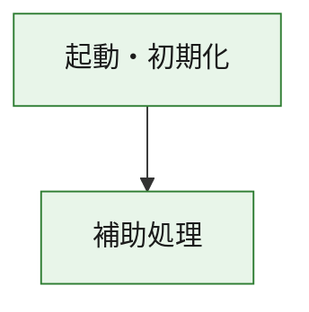
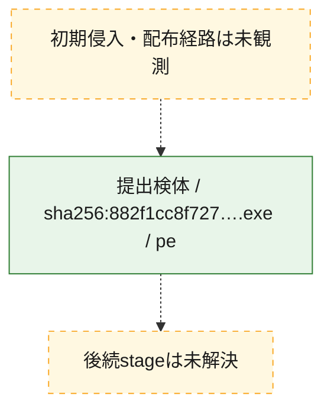
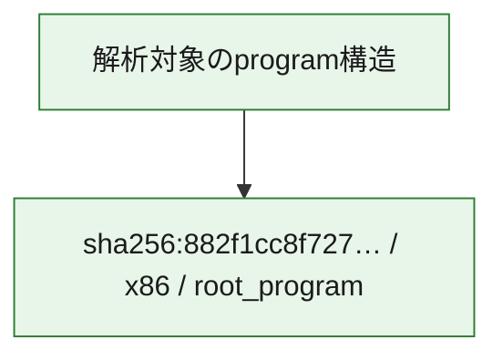

# 全体ロジック：882f1cc8f727b6077eb0e37a3014c2e2750f595cffcb22b36f61bdcc5cb7699d

代表関数の静的証跡から、起動・初期化の処理群を確認しました。

## 読み方

- phaseの掲載順は解析上の整理順です。observed_call_edgesがない段階間の実行順を断定しません。
- 図の実線は静的に観測した関係、点線と黄色のノードは未観測・未解決の関係を示します。
- 図は静的な要約であり、動的実行を再現するものではありません。
- 詳細な関数解説とfingerprintは[STATIC-LOGIC.md](STATIC-LOGIC.md)を参照してください。

## 静的可視化

### 実行フロー

### 感染チェーン

### モジュール関係

## 処理段階

### 1. 起動・初期化

entry pointから初期化と後続処理への移行を確認します。
確度: `confirmed_static_function_evidence`

- `882f1cc8f727b6077eb0e37a3014c2e2750f595cffcb22b36f61bdcc5cb7699d:ghidra:180001010` — 初期化と主要処理への分岐を行う入口関数です。 状態: `succeeded`、選定理由: `entry_point`, `meaningful_symbol_name`, `reviewed_call_centrality:22`, `role:entrypoint`, `small_program_complete_context`

### 2. 補助処理

主要処理を支える一般内部関数またはlibrary処理を確認します。
確度: `confirmed_static_function_evidence`

- `882f1cc8f727b6077eb0e37a3014c2e2750f595cffcb22b36f61bdcc5cb7699d:ghidra:180001240` — 検体内部の一般処理を実装する関数です。 状態: `succeeded`、選定理由: `context_representative`, `reviewed_call_centrality:2`, `small_program_complete_context`
- `882f1cc8f727b6077eb0e37a3014c2e2750f595cffcb22b36f61bdcc5cb7699d:ghidra:180001350` — 検体内部の一般処理を実装する関数です。 状態: `succeeded`、選定理由: `context_representative`, `reviewed_call_centrality:25`, `small_program_complete_context`
- `882f1cc8f727b6077eb0e37a3014c2e2750f595cffcb22b36f61bdcc5cb7699d:ghidra:180003780` — 検体内部の一般処理を実装する関数です。 状態: `succeeded`、選定理由: `context_representative`, `reviewed_call_centrality:2`, `small_program_complete_context`
- `882f1cc8f727b6077eb0e37a3014c2e2750f595cffcb22b36f61bdcc5cb7699d:ghidra:1800038e0` — 検体内部の一般処理を実装する関数です。 状態: `succeeded`、選定理由: `context_representative`, `reviewed_call_centrality:2`, `small_program_complete_context`

## 観測したcall関係

- `882f1cc8f727b6077eb0e37a3014c2e2750f595cffcb22b36f61bdcc5cb7699d:ghidra:180001010` → `882f1cc8f727b6077eb0e37a3014c2e2750f595cffcb22b36f61bdcc5cb7699d:ghidra:180001240` （`startup` → `support`）
- `882f1cc8f727b6077eb0e37a3014c2e2750f595cffcb22b36f61bdcc5cb7699d:ghidra:180001010` → `882f1cc8f727b6077eb0e37a3014c2e2750f595cffcb22b36f61bdcc5cb7699d:ghidra:180001350` （`startup` → `support`）
- `882f1cc8f727b6077eb0e37a3014c2e2750f595cffcb22b36f61bdcc5cb7699d:ghidra:180001350` → `882f1cc8f727b6077eb0e37a3014c2e2750f595cffcb22b36f61bdcc5cb7699d:ghidra:180001240` （`support` → `support`）
- `882f1cc8f727b6077eb0e37a3014c2e2750f595cffcb22b36f61bdcc5cb7699d:ghidra:180001350` → `882f1cc8f727b6077eb0e37a3014c2e2750f595cffcb22b36f61bdcc5cb7699d:ghidra:180003780` （`support` → `support`）
- `882f1cc8f727b6077eb0e37a3014c2e2750f595cffcb22b36f61bdcc5cb7699d:ghidra:180001350` → `882f1cc8f727b6077eb0e37a3014c2e2750f595cffcb22b36f61bdcc5cb7699d:ghidra:1800038e0` （`support` → `support`）
- `882f1cc8f727b6077eb0e37a3014c2e2750f595cffcb22b36f61bdcc5cb7699d:ghidra:180003780` → `882f1cc8f727b6077eb0e37a3014c2e2750f595cffcb22b36f61bdcc5cb7699d:ghidra:1800038e0` （`support` → `support`）
- `ghidra-function:09abe2d46496a61986d67e9d` → `ghidra-external:06e1b800d0355d81433b5557` （`unclassified` → `unclassified`）
- `ghidra-function:09abe2d46496a61986d67e9d` → `ghidra-external:18004ef053cd7d18cf3008e1` （`unclassified` → `unclassified`）
- `ghidra-function:09abe2d46496a61986d67e9d` → `ghidra-external:3ac038174c93d17567877273` （`unclassified` → `unclassified`）
- `ghidra-function:09abe2d46496a61986d67e9d` → `ghidra-external:3c03d46ae187333a02f8c1a4` （`unclassified` → `unclassified`）
- `ghidra-function:09abe2d46496a61986d67e9d` → `ghidra-external:465ed72b7ec43ea6ca8e3b2f` （`unclassified` → `unclassified`）
- `ghidra-function:09abe2d46496a61986d67e9d` → `ghidra-external:4ddd0b750d53cf1d18e6bd45` （`unclassified` → `unclassified`）
- `ghidra-function:09abe2d46496a61986d67e9d` → `ghidra-external:4e0c594a3472c31bbabbdaa4` （`unclassified` → `unclassified`）
- `ghidra-function:09abe2d46496a61986d67e9d` → `ghidra-external:61196414ff8aa5491df86a8e` （`unclassified` → `unclassified`）
- `ghidra-function:09abe2d46496a61986d67e9d` → `ghidra-external:684f65727eef5be2e4a895d3` （`unclassified` → `unclassified`）
- `ghidra-function:09abe2d46496a61986d67e9d` → `ghidra-external:75bf736d97582189f1a5c1d4` （`unclassified` → `unclassified`）
- `ghidra-function:09abe2d46496a61986d67e9d` → `ghidra-external:779aaf34693feaf850c26b7a` （`unclassified` → `unclassified`）
- `ghidra-function:09abe2d46496a61986d67e9d` → `ghidra-external:a5c14eca32a6fea7ea31624a` （`unclassified` → `unclassified`）
- `ghidra-function:09abe2d46496a61986d67e9d` → `ghidra-external:a751af2c976a436984636309` （`unclassified` → `unclassified`）
- `ghidra-function:09abe2d46496a61986d67e9d` → `ghidra-external:aeb2329c4aee58d6d3bb7ac4` （`unclassified` → `unclassified`）
- `ghidra-function:09abe2d46496a61986d67e9d` → `ghidra-external:bc944627f5f53879d40b9b42` （`unclassified` → `unclassified`）
- `ghidra-function:09abe2d46496a61986d67e9d` → `ghidra-external:bf4f9c8b8398737ce044f4bf` （`unclassified` → `unclassified`）
- `ghidra-function:09abe2d46496a61986d67e9d` → `ghidra-external:bfc75e9b5eade3d3dab39caa` （`unclassified` → `unclassified`）
- `ghidra-function:09abe2d46496a61986d67e9d` → `ghidra-external:c791a7c515391dc7c4ad79e1` （`unclassified` → `unclassified`）
- `ghidra-function:09abe2d46496a61986d67e9d` → `ghidra-external:c9e86dc204b43d507b8d71c7` （`unclassified` → `unclassified`）
- `ghidra-function:09abe2d46496a61986d67e9d` → `ghidra-external:cbd97d193494fccf9a3eb7f2` （`unclassified` → `unclassified`）
- `ghidra-function:09abe2d46496a61986d67e9d` → `ghidra-external:dfca6bbbb90d7dd940ee91cf` （`unclassified` → `unclassified`）
- `ghidra-function:09abe2d46496a61986d67e9d` → `ghidra-function:02c253c699465b8445426b2c` （`unclassified` → `unclassified`）
- `ghidra-function:09abe2d46496a61986d67e9d` → `ghidra-function:9423399d4fbc3285e3e71117` （`unclassified` → `unclassified`）
- `ghidra-function:09abe2d46496a61986d67e9d` → `ghidra-function:b7afd0b4d89fd696ac954323` （`unclassified` → `unclassified`）
- `ghidra-function:19c272622d0a3243ec4f52ab` → `ghidra-function:07517f065efc404ca7eb531f` （`unclassified` → `unclassified`）
- `ghidra-function:19c272622d0a3243ec4f52ab` → `ghidra-function:09abe2d46496a61986d67e9d` （`unclassified` → `unclassified`）
- `ghidra-function:19c272622d0a3243ec4f52ab` → `ghidra-function:16436717d53d17ef66fbaf91` （`unclassified` → `unclassified`）
- `ghidra-function:19c272622d0a3243ec4f52ab` → `ghidra-function:2eeb280a057f4ab70cb1d578` （`unclassified` → `unclassified`）
- `ghidra-function:19c272622d0a3243ec4f52ab` → `ghidra-function:3bb045284e86faf426649108` （`unclassified` → `unclassified`）
- `ghidra-function:19c272622d0a3243ec4f52ab` → `ghidra-function:53792f49239541fa4a88bdbe` （`unclassified` → `unclassified`）
- `ghidra-function:19c272622d0a3243ec4f52ab` → `ghidra-function:72134a789c43cd237112bad4` （`unclassified` → `unclassified`）
- `ghidra-function:19c272622d0a3243ec4f52ab` → `ghidra-function:75063599a751ae1e1ca15c25` （`unclassified` → `unclassified`）
- `ghidra-function:19c272622d0a3243ec4f52ab` → `ghidra-function:9423399d4fbc3285e3e71117` （`unclassified` → `unclassified`）
- `ghidra-function:19c272622d0a3243ec4f52ab` → `ghidra-function:ab5ada702182bf76d8be44be` （`unclassified` → `unclassified`）
- `ghidra-function:19c272622d0a3243ec4f52ab` → `ghidra-function:db51d9030bf937c073fc2a70` （`unclassified` → `unclassified`）
- `ghidra-function:19c272622d0a3243ec4f52ab` → `ghidra-function:e909d5751b597746e2694dd6` （`unclassified` → `unclassified`）
- `ghidra-function:b7afd0b4d89fd696ac954323` → `ghidra-function:02c253c699465b8445426b2c` （`unclassified` → `unclassified`）

## 解析範囲と制約

- 選定外関数は全体inventoryへ残しますが、関数本体の個別解説対象にはしていません。
- indirect call、難読化、packer、VM、壊れたcontrol flowによりcall関係が欠落する場合があります。
- 文書は静的解析に基づき、検体実行や外部通信による動的確認は行っていません。
