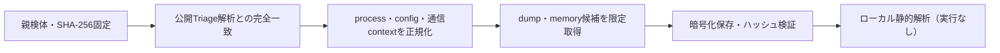

# Triage公開解析・後段取得証跡

## 完全ハッシュ一致

- [260923-yzgyesbh73](https://tria.ge/260923-yzgyesbh73): ファミリー候補 `未確定`、評価score `7`
- [260923-szvlmaed75](https://tria.ge/260923-szvlmaed75): ファミリー候補 `未確定`、評価score `7`

## プロセス・通信

- 観測process: `24627168.KEAa, 27378747.yEYG, 3846348375.Gmj, 5631412112.NbX, AJrORWGpTwcEEaudugQXpJoOCvvGnoVy.SFV.exe, APILDbAEAPJhOvhyQOHfsJDYFavgtsSy.jkE.exe, AqThAZsZaMSAiEawOgwZASmAGbrRRntT.lvM.exe, BpVzPwOWcbnsRLuhiWFcaWbwTsANTxxm.VRv.exe, CBVtWZHqoNFheLBfsQCtqADACZJTXvBt.LEJ.exe, CMD.EXE, CVGSDNIqjzlSWjmUtjFmcSsXJzHShAfX.pfa.exe, ComputerDefaults.exe, DaKoYAclVPLcriAHPaJXtbfqaOKeAvUI.iXO.exe, EdkDdXKUXPHZyPymADYWClIPzlrPZJRX.Yap.exe, EvwWEAqyQHOxwIdvQuRJvphPZkFUDbmk.kKK.exe, ExtcdJZWFreauxxnwdDQuzYjSeQvrZIw.cVP.exe, EzwrIzMNnZjOWNuNDAVIFnIyVVjtaGrP.VRX.exe, GrEmfPMGvuSSuOMWcIdQIEiCSLzBUgNS.Blx.exe, GzLUwHkyOeTwPjrUgXNQRikHzednVcyI.Qqs.exe, HAINLFvIBTuhckmVZknxZyYPDWawLIVV.kxG.exe, HVhoZOyyfVUjlRHPwxDEVMppemtaueYP.WeN.exe, HefQGSdrDRvXpjJxIlyNCbCXswMcCYBI.SfN.exe, IHPXxYoqljgMbhpgFSnCwxgVaGKTLwvf.qSK.exe, JCGmAQGCrygzdAVlrLOERQqrPXViPSuQ.Eyh.exe, JEYawGSAHvbQsnBxRVJeUuruhmUZdVpZ.MkK.exe, JvqJSRNUjhkABuDWQhEasOYGuuPjLOXq.rRM.exe, KRNXerwCUeEQwGnUleBPMtncxoXwQvst.cce.exe, KswFSipFmUebamqeWtpgkjKZDoNGTQLL.jBF.exe, LTIExsDmDYmCSmIEivcHINJyyNYkHAzH.WUS.exe, LczbZxtzdKKxqtchxOYvjjLqeGbZqUoK.LwV.exe, MAfaFtiulociNpynXcxQqAIAyRGJLEbZ.joZ.exe, MLNIKPQtjeQynjBpfDMRLRriInsMLfti.dSi.exe, McMXftDviJSrGWIvOXHeideAptrqtlGZ.ypl.exe, MmFfmtcnrhorCCIQHdmpOGVolMBwntYe.YXE.exe, MseeokmrqbXavYJdWWPzFrcMAZVCKlXL.TCT.exe, NaFtNQLVTxWzlRRvTJbDodhkZcLJSCCi.YDX.exe, OFYjcXmQLFkJIPaFxwKYWOpdhjUDqFLL.jld.exe, PIatdqbwAQTkVlcvoICFHchuNrsjkyxF.CrP.exe, PLDrRkuHmbiEEPadPTDYabzBPUvgtjXj.oRW.exe, PgSiPtJHXWYNYfXAGEKfnnMxRMdMjXsb.toX.exe, PyIigiDxdwDLGTszOqnXlGutdwgmlKHn.kez.exe, QBhJtHUhnjFTrFzOkvtxcrQbLfkJQCxw.YPM.exe, QOfNSvHUbUJyfkLOyTYoMXAUMejysYTb.ses.exe, QZQGYCzqfBxiXucnWogBwFdDubJrTCkt.olH.exe, QriEtVTMWJcsjopQyykSqvSsoHcoGSvE.qaQ.exe, RcRnxJpNIcdxpFdgbTHIQnEOYxwIUKmN.dwW.exe, RseorzeYdtKEgKwoySWWzcYsERHoLrBW.jQU.exe, TIKIOKEAYjBJqxjjtpcMwqvhrrUBaxee.VjK.exe, UDIpkgOBQrdltsNmkYqaKDwdsYvOgtgy.AUU.exe, VLfWcBwpBpcqkQkqPlWDIDYyFAySNpCb.SQx.exe, VdXxJiFxZEovnuhcrKETcTfaUieXdtiY.TGj.exe, WfUdbZGrVbCABLyeZNRQkXpFyazqbqdC.qeR.exe, WtZwFBnZIPXstWzfHBYpjGMRzMXfAAvJ.Ncy.exe, XSGkUGfqXYCCQgwKiakpzmzWGzACApys.xSt.exe, XhYcYKBjwxFxulChASwfYRFUsnJtnKGm.xZV.exe, YMeogWQSqxPumxQRmkvRcWsPKzLssKtS.AGC.exe, YNYWZmSkgmYrBzYwYtWXHihShIDmdJFI.AHX.exe, YPTxrvUSBksgvDLnKccwgiwLSeDMRvlo.yqJ.exe, YxcxisKkbgqYguYXHdLcOdISxTqBBbKw.olp.exe, akAIkDLlgZvpEoTxQcEIJhetVdbVDoaz.wnZ.exe, bNqJAumRCrnTVbDzBvIYQaGGMWZqEyvh.REu.exe, bpBQDSxdyMZWxONfpehtWoWRPKMxxmwO.bWf.exe, cCfaSeBVdweylCRqaDyQBwtEUSLxTGTy.uTh.exe, dJczlwSKGFWCJrQTHZBTfvRYZJvJoamN.ToB.exe, dgWAtNuUdcPMbhIuLWlhJxESjaLwLjmk.Yru.exe, eNURlNMEZZUsQKOtFdGanrHwTjZGKKqS.HzC.exe, eNdgUhiBWdsDhDHXtSVAhbFazxAOBQZK.hia.exe, gGpsLaawDhPYPuBCjCXikMFQGXmkKaAO.jFK.exe, glNncLTLBxxGvKIHvHWjFpGOFHfOznaK.yBm.exe, hOzPgfKrlUcSsPeRCOMcCYoIszNfTIGA.YrT.exe, isZCKGAAvfXOEpKcdMzGMvoTIuCGWJNr.NAi.exe, jWCLVLewFExWOcpYXekPwzIdRylxNVIT.wrQ.exe, jtYaVfzjcZzEPWDWewKsIPdOwUqRUfNz.lqa.exe, juWbakVPzkGAaKGFCzaTRtgdpFvguzJf.Xsp.exe, ktBDHAuZuULaUYPLFyqBOTpzxZRcPDyz.NRP.exe, mSZPZiPtVzWBnhZIogsqETFStPTaxtWw.ZaC.exe, nJVZWgRjBurnkgQsBizpDYNsgyMqnSNT.izL.exe, prtLrFpFTxQMsikJAPEtRCiIPgxDUvcS.sOK.exe, qHHcLBfBcuNfkhUyxLIpzuvhFfkkxQzw.QBz.exe, qhbFhzPaEFQqrkaVnCqyVXbnIZUZRNGK.ymN.exe, qzCxoBzhfbmbtEPfYRFByeIzUIQqdRGg.ToF.exe, roWHZZHNJrGXWtSRaIjFlshaWEUHREVD.zMh.exe, rundll32.exe, tJChIzOltqXDYXIlYnLjMUvpoMECnNTV.HAZ.exe, tTMGPPYOnyMfgPBsgHMnLcCXapVeEsBb.Yky.exe, uiOmalPOEjFxmOLkHXlQrAboYapZfiwH.XsS.exe, uvOIIHfdBguomnKbBeecWsvXIHoMlvKL.kEq.exe, vBDOKJrsPSHFqBplUsZOPkiBlIBiWRcU.ifU.exe, vIQOzeVweZJepxQPcJKJfbQpWBFabjvP.gjP.exe, vKfjSkUffDunRJWsHLlAEMiHUBmtwmZF.YFT.exe, wJcLYQxRDdmXdKrJfINncxinvduwrbaY.BXA.exe, wuCbSMlxCWBUebsRrJwOSBeiThTQxzRa.hxX.exe, xaCqvxKhwiMdqZWLYuhXOnUHcKXLGdHD.olk.exe, ymuVseuMWtJALYjabTzrslrkSpKCxBMP.OxQ.exe, zKoNuXueiZHhpTvuxFBZHKFdOqdYootS.bGZ.exe`
- raw commandは保存せず、command SHA-256と処理patternだけをJSONへ保持します。
- sandbox background trafficは`context_only`であり、C2へ自動昇格しません。

- 取得できませんでした。

## 後段取得物

- `c5a628d27c53213d005367b24f9e846c415011e828ff7acd541c8e85a20da5ec` / `memory_image` / 28672 bytes / 親と同一: `false` / 静的解析: `partial`

## 判定境界

Triage由来のfamily、process、config、通信は外部sandbox証跡です。Config extractorが返したendpointはC2候補として扱いますが、静的設定復元またはprocess帰属とprotocol応答が揃うまでは確認済みC2とはしません。取得成果物と検体は実行していません。
