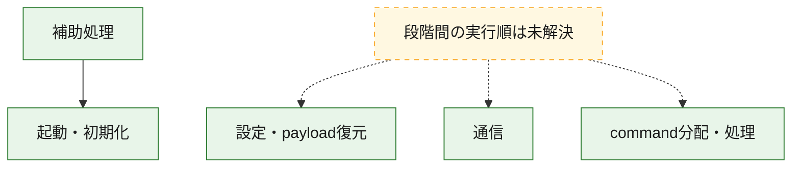
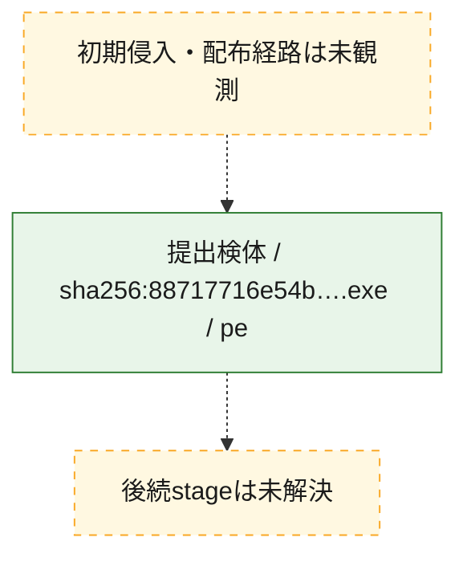
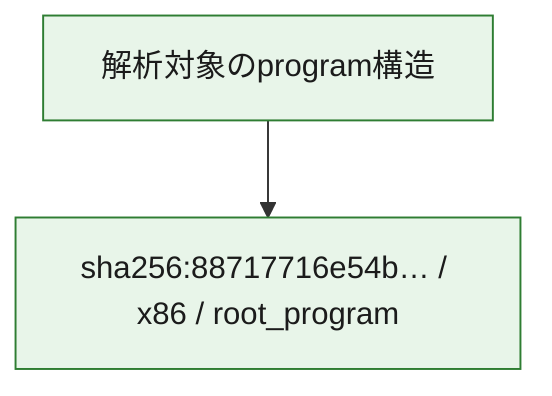

# 全体ロジック：88717716e54b35682a28d673764975d439a31ee194c85dfc619a15ea93ab1280

代表関数の静的証跡から、起動・初期化、設定・payload復元、通信、command分配・処理の処理群を確認しました。

## 読み方

- phaseの掲載順は解析上の整理順です。observed_call_edgesがない段階間の実行順を断定しません。
- 図の実線は静的に観測した関係、点線と黄色のノードは未観測・未解決の関係を示します。
- 図は静的な要約であり、動的実行を再現するものではありません。
- 詳細な関数解説とfingerprintは[STATIC-LOGIC.md](STATIC-LOGIC.md)を参照してください。

## 静的可視化

### 実行フロー

### 感染チェーン

### モジュール関係

## 処理段階

### 1. 起動・初期化

entry pointから初期化と後続処理への移行を確認します。
確度: `confirmed_static_function_evidence`

- `88717716e54b35682a28d673764975d439a31ee194c85dfc619a15ea93ab1280:ghidra:1400029f6` — 初期化と主要処理への分岐を行う入口関数です。 状態: `succeeded`、選定理由: `entry_point`, `meaningful_symbol_name`, `probable_go_main_user_code`, `reviewed_call_centrality:27`, `role:entrypoint`
- `88717716e54b35682a28d673764975d439a31ee194c85dfc619a15ea93ab1280:ghidra:14001ef35` — 初期化と主要処理への分岐を行う入口関数です。 状態: `succeeded`、選定理由: `entry_point`, `meaningful_symbol_name`, `reviewed_call_centrality:2`, `role:entrypoint`

### 2. 設定・payload復元

設定、resource、payload、暗号化データの復元・変換を確認します。
確度: `confirmed_static_function_evidence`

- `88717716e54b35682a28d673764975d439a31ee194c85dfc619a15ea93ab1280:ghidra:140006384` — 設定、resource、payloadなどの解析・変換を行う関数です。 状態: `succeeded`、選定理由: `meaningful_symbol_name`, `role:config_or_data_transform`
- `88717716e54b35682a28d673764975d439a31ee194c85dfc619a15ea93ab1280:ghidra:14005bca0` — 暗号、hash、encoding、または復号処理に関係する関数です。 状態: `succeeded`、選定理由: `meaningful_symbol_name`, `reviewed_call_centrality:1`, `role:cryptographic_transform`

### 3. 通信

通信初期化、endpoint処理、送受信の役割を確認します。
確度: `confirmed_static_function_evidence`

- `88717716e54b35682a28d673764975d439a31ee194c85dfc619a15ea93ab1280:ghidra:14001f0d4` — 通信初期化、送受信、またはendpoint処理に関係する関数です。 状態: `succeeded`、選定理由: `entry_point`, `meaningful_symbol_name`, `reviewed_call_centrality:1`, `role:network_communication`
- `88717716e54b35682a28d673764975d439a31ee194c85dfc619a15ea93ab1280:ghidra:14001f122` — 通信初期化、送受信、またはendpoint処理に関係する関数です。 状態: `succeeded`、選定理由: `entry_point`, `meaningful_symbol_name`, `reviewed_call_centrality:1`, `role:network_communication`
- `88717716e54b35682a28d673764975d439a31ee194c85dfc619a15ea93ab1280:ghidra:14001f83c` — 通信初期化、送受信、またはendpoint処理に関係する関数です。 状態: `succeeded`、選定理由: `entry_point`, `meaningful_symbol_name`, `reviewed_call_centrality:1`, `role:network_communication`
- `88717716e54b35682a28d673764975d439a31ee194c85dfc619a15ea93ab1280:ghidra:14001f891` — 通信初期化、送受信、またはendpoint処理に関係する関数です。 状態: `succeeded`、選定理由: `entry_point`, `meaningful_symbol_name`, `reviewed_call_centrality:1`, `role:network_communication`
- `88717716e54b35682a28d673764975d439a31ee194c85dfc619a15ea93ab1280:ghidra:14001f8e6` — 通信初期化、送受信、またはendpoint処理に関係する関数です。 状態: `succeeded`、選定理由: `entry_point`, `meaningful_symbol_name`, `reviewed_call_centrality:1`, `role:network_communication`
- `88717716e54b35682a28d673764975d439a31ee194c85dfc619a15ea93ab1280:ghidra:1400203fe` — 通信初期化、送受信、またはendpoint処理に関係する関数です。 状態: `succeeded`、選定理由: `entry_point`, `meaningful_symbol_name`, `reviewed_call_centrality:1`, `role:network_communication`
- `88717716e54b35682a28d673764975d439a31ee194c85dfc619a15ea93ab1280:ghidra:140020449` — 通信初期化、送受信、またはendpoint処理に関係する関数です。 状態: `succeeded`、選定理由: `entry_point`, `meaningful_symbol_name`, `reviewed_call_centrality:1`, `role:network_communication`
- `88717716e54b35682a28d673764975d439a31ee194c85dfc619a15ea93ab1280:ghidra:140020494` — 通信初期化、送受信、またはendpoint処理に関係する関数です。 状態: `succeeded`、選定理由: `entry_point`, `meaningful_symbol_name`, `reviewed_call_centrality:1`, `role:network_communication`
- `88717716e54b35682a28d673764975d439a31ee194c85dfc619a15ea93ab1280:ghidra:140020f2d` — 通信初期化、送受信、またはendpoint処理に関係する関数です。 状態: `succeeded`、選定理由: `entry_point`, `meaningful_symbol_name`, `reviewed_call_centrality:1`, `role:network_communication`
- `88717716e54b35682a28d673764975d439a31ee194c85dfc619a15ea93ab1280:ghidra:140021014` — 通信初期化、送受信、またはendpoint処理に関係する関数です。 状態: `succeeded`、選定理由: `entry_point`, `meaningful_symbol_name`, `reviewed_call_centrality:1`, `role:network_communication`

### 4. command分配・処理

受信commandやtaskの解釈、分配、個別handlerへの移行を確認します。
確度: `confirmed_static_function_evidence`

- `88717716e54b35682a28d673764975d439a31ee194c85dfc619a15ea93ab1280:ghidra:140005ec2` — commandの解釈、分配、または個別処理を担当する関数です。 状態: `succeeded`、選定理由: `meaningful_symbol_name`, `reviewed_call_centrality:4`, `role:command_dispatch_or_handler`

### 5. 補助処理

主要処理を支える一般内部関数またはlibrary処理を確認します。
確度: `confirmed_static_function_evidence_with_limits`

- `88717716e54b35682a28d673764975d439a31ee194c85dfc619a15ea93ab1280:ghidra:140001480` — 検体内部の一般処理を実装する関数です。 状態: `succeeded`、選定理由: `entry_point`, `meaningful_symbol_name`, `reviewed_call_centrality:30`
- `88717716e54b35682a28d673764975d439a31ee194c85dfc619a15ea93ab1280:ghidra:14001ef8e` — 検体内部の一般処理を実装する関数です。 状態: `succeeded`、選定理由: `entry_point`, `meaningful_symbol_name`, `reviewed_call_centrality:3`
- `88717716e54b35682a28d673764975d439a31ee194c85dfc619a15ea93ab1280:ghidra:14001effd` — 検体内部の一般処理を実装する関数です。 状態: `succeeded`、選定理由: `entry_point`, `meaningful_symbol_name`
- `88717716e54b35682a28d673764975d439a31ee194c85dfc619a15ea93ab1280:ghidra:14001f042` — 検体内部の一般処理を実装する関数です。 状態: `succeeded`、選定理由: `entry_point`, `meaningful_symbol_name`, `reviewed_call_centrality:1`
- `88717716e54b35682a28d673764975d439a31ee194c85dfc619a15ea93ab1280:ghidra:14001f099` — 検体内部の一般処理を実装する関数です。 状態: `succeeded`、選定理由: `entry_point`, `meaningful_symbol_name`, `reviewed_call_centrality:1`
- `88717716e54b35682a28d673764975d439a31ee194c85dfc619a15ea93ab1280:ghidra:14001f14e` — 検体内部の一般処理を実装する関数です。 状態: `succeeded`、選定理由: `entry_point`, `meaningful_symbol_name`, `reviewed_call_centrality:1`
- `88717716e54b35682a28d673764975d439a31ee194c85dfc619a15ea93ab1280:ghidra:14001f17a` — 検体内部の一般処理を実装する関数です。 状態: `succeeded`、選定理由: `entry_point`, `meaningful_symbol_name`, `reviewed_call_centrality:1`
- `88717716e54b35682a28d673764975d439a31ee194c85dfc619a15ea93ab1280:ghidra:14001f1b7` — 検体内部の一般処理を実装する関数です。 状態: `succeeded`、選定理由: `entry_point`, `meaningful_symbol_name`, `reviewed_call_centrality:1`
- `88717716e54b35682a28d673764975d439a31ee194c85dfc619a15ea93ab1280:ghidra:14001f1f4` — 検体内部の一般処理を実装する関数です。 状態: `succeeded`、選定理由: `entry_point`, `meaningful_symbol_name`, `reviewed_call_centrality:1`
- `88717716e54b35682a28d673764975d439a31ee194c85dfc619a15ea93ab1280:ghidra:14001f233` — 検体内部の一般処理を実装する関数です。 状態: `succeeded`、選定理由: `entry_point`, `meaningful_symbol_name`, `reviewed_call_centrality:1`
- `88717716e54b35682a28d673764975d439a31ee194c85dfc619a15ea93ab1280:ghidra:14001f296` — 検体内部の一般処理を実装する関数です。 状態: `succeeded`、選定理由: `entry_point`, `meaningful_symbol_name`, `reviewed_call_centrality:1`
- `88717716e54b35682a28d673764975d439a31ee194c85dfc619a15ea93ab1280:ghidra:14001f2f9` — 検体内部の一般処理を実装する関数です。 状態: `succeeded`、選定理由: `entry_point`, `meaningful_symbol_name`, `reviewed_call_centrality:1`
- `88717716e54b35682a28d673764975d439a31ee194c85dfc619a15ea93ab1280:ghidra:14001f33a` — 検体内部の一般処理を実装する関数です。 状態: `succeeded`、選定理由: `entry_point`, `meaningful_symbol_name`, `reviewed_call_centrality:1`
- `88717716e54b35682a28d673764975d439a31ee194c85dfc619a15ea93ab1280:ghidra:14001f37b` — 検体内部の一般処理を実装する関数です。 状態: `succeeded`、選定理由: `entry_point`, `meaningful_symbol_name`, `reviewed_call_centrality:1`
- `88717716e54b35682a28d673764975d439a31ee194c85dfc619a15ea93ab1280:ghidra:14001f3d0` — 検体内部の一般処理を実装する関数です。 状態: `succeeded`、選定理由: `entry_point`, `meaningful_symbol_name`, `reviewed_call_centrality:1`
- `88717716e54b35682a28d673764975d439a31ee194c85dfc619a15ea93ab1280:ghidra:14001f425` — 検体内部の一般処理を実装する関数です。 状態: `succeeded`、選定理由: `entry_point`, `meaningful_symbol_name`, `reviewed_call_centrality:1`
- `88717716e54b35682a28d673764975d439a31ee194c85dfc619a15ea93ab1280:ghidra:140045c80` — compiler生成処理または汎用library処理とみられる関数です。 状態: `limited_bad_instruction_or_flow`、選定理由: `entry_point`, `meaningful_symbol_name`, `reviewed_call_centrality:12`

## 観測したcall関係

- `88717716e54b35682a28d673764975d439a31ee194c85dfc619a15ea93ab1280:ghidra:140001480` → `88717716e54b35682a28d673764975d439a31ee194c85dfc619a15ea93ab1280:ghidra:1400029f6` （`support` → `startup`）
- `ghidra-function:0a685c04515720b61ed3a8a5` → `ghidra-function:a86158c4e3a28dbbb9322c75` （`unclassified` → `unclassified`）
- `ghidra-function:0ccd61849319815d2efcf27d` → `ghidra-function:93ac608a6bf9f43046d54ff8` （`unclassified` → `unclassified`）
- `ghidra-function:25df9acde45f60c3c946bf96` → `ghidra-function:c49fdf88901ebc51870bd05c` （`unclassified` → `unclassified`）
- `ghidra-function:31ec1bf03a2bfb473663e0f2` → `ghidra-function:7dc97b05bc876cc0a2d637a1` （`unclassified` → `unclassified`）
- `ghidra-function:34a9c352ea3447ea94fa3242` → `ghidra-function:6a362611dcd406803e5f988e` （`unclassified` → `unclassified`）
- `ghidra-function:3dd49f0df1a96feecb8a53da` → `ghidra-function:6b3f50042a1bf4b04df7a0e5` （`unclassified` → `unclassified`）
- `ghidra-function:3dd49f0df1a96feecb8a53da` → `ghidra-function:96e29da6076eab221da2c057` （`unclassified` → `unclassified`）
- `ghidra-function:4286e880b79a0e3944bc7dcd` → `ghidra-function:9f957d71ea60a45d662a9e65` （`unclassified` → `unclassified`）
- `ghidra-function:4b9d6d18b039b0ec6d50bc7f` → `ghidra-function:f7bee8e43477d6e4ba5cce4a` （`unclassified` → `unclassified`）
- `ghidra-function:5267606309999d85865a606e` → `ghidra-function:2212ad7f7c58379d75c9e867` （`unclassified` → `unclassified`）
- `ghidra-function:54b143a16aa445cf44d9a0d9` → `ghidra-function:f8578003849472786da2094a` （`unclassified` → `unclassified`）
- `ghidra-function:54f9344cd39dbde3cd1dab88` → `ghidra-function:20f54979b90e485ecf304639` （`unclassified` → `unclassified`）
- `ghidra-function:567bd9dbb1d7cdef0f70ae63` → `ghidra-function:57d3c95dc7a52fb5033bcb85` （`unclassified` → `unclassified`）
- `ghidra-function:656cef7382cd020307f23fe9` → `ghidra-function:2561efee5393a984efc49e44` （`unclassified` → `unclassified`）
- `ghidra-function:68f22e303c559e4f2c44dd63` → `ghidra-function:ed873229e7a36c2dadbafa76` （`unclassified` → `unclassified`）
- `ghidra-function:7e830bc86c2b4c328ecfc12d` → `ghidra-external:c85273ef8bbf20aa4fab50fd` （`unclassified` → `unclassified`）
- `ghidra-function:7e830bc86c2b4c328ecfc12d` → `ghidra-external:d1c072412871fed8b1b40830` （`unclassified` → `unclassified`）
- `ghidra-function:7e830bc86c2b4c328ecfc12d` → `ghidra-function:a169e1b9e929735cdb6eeabd` （`unclassified` → `unclassified`）
- `ghidra-function:7e830bc86c2b4c328ecfc12d` → `ghidra-function:e758d796da054fe2ef899424` （`unclassified` → `unclassified`）
- `ghidra-function:82acf8e194d213e187667c5e` → `ghidra-function:955c03940378478f096d3594` （`unclassified` → `unclassified`）
- `ghidra-function:87ff2c685d9736154f1dfcc3` → `ghidra-function:13432dc63a0f38d0f5cf688f` （`unclassified` → `unclassified`）
- `ghidra-function:88b601cde6587fb0573fbd59` → `ghidra-external:080a081fd51f20f92dbc5abe` （`unclassified` → `unclassified`）
- `ghidra-function:88b601cde6587fb0573fbd59` → `ghidra-external:5452ea80d001f40a9efb5f12` （`unclassified` → `unclassified`）
- `ghidra-function:88b601cde6587fb0573fbd59` → `ghidra-external:56823c5a7142f8ca434514a2` （`unclassified` → `unclassified`）
- `ghidra-function:88b601cde6587fb0573fbd59` → `ghidra-external:74ab59ffb670dfedfe6235bc` （`unclassified` → `unclassified`）
- `ghidra-function:88b601cde6587fb0573fbd59` → `ghidra-external:a3eb01fcc3344606dafa8387` （`unclassified` → `unclassified`）
- `ghidra-function:88b601cde6587fb0573fbd59` → `ghidra-external:ef6cffa5ec679a60a04e6660` （`unclassified` → `unclassified`）
- `ghidra-function:88b601cde6587fb0573fbd59` → `ghidra-function:0deeae561443d0055b6b247f` （`unclassified` → `unclassified`）
- `ghidra-function:88b601cde6587fb0573fbd59` → `ghidra-function:1a7152656097ae57e4eb627a` （`unclassified` → `unclassified`）
- `ghidra-function:88b601cde6587fb0573fbd59` → `ghidra-function:2671cf69cb606c9a0086fec2` （`unclassified` → `unclassified`）
- `ghidra-function:88b601cde6587fb0573fbd59` → `ghidra-function:2ab774ee1fe76fad1f2452c8` （`unclassified` → `unclassified`）
- `ghidra-function:88b601cde6587fb0573fbd59` → `ghidra-function:42d32497c69149983e1d8ed0` （`unclassified` → `unclassified`）
- `ghidra-function:88b601cde6587fb0573fbd59` → `ghidra-function:87d6760d6aa6fc286a662da1` （`unclassified` → `unclassified`）
- `ghidra-function:88b601cde6587fb0573fbd59` → `ghidra-function:9f1e16a7d78ea53dfe7403a1` （`unclassified` → `unclassified`）
- `ghidra-function:88b601cde6587fb0573fbd59` → `ghidra-function:b5c46101edc1fd61c3579fff` （`unclassified` → `unclassified`）
- `ghidra-function:88b601cde6587fb0573fbd59` → `ghidra-function:bb642c5312fed0eb9ab794e7` （`unclassified` → `unclassified`）
- `ghidra-function:88b601cde6587fb0573fbd59` → `ghidra-function:bc7616ef7508c6a5a20f7246` （`unclassified` → `unclassified`）
- `ghidra-function:88b601cde6587fb0573fbd59` → `ghidra-function:bd2ad42be86d6af533b455c8` （`unclassified` → `unclassified`）
- `ghidra-function:88b601cde6587fb0573fbd59` → `ghidra-function:d5a98b7c68b4ff26be63f717` （`unclassified` → `unclassified`）
- `ghidra-function:88b601cde6587fb0573fbd59` → `ghidra-function:da4983c229021c4531f9542e` （`unclassified` → `unclassified`）
- `ghidra-function:88b601cde6587fb0573fbd59` → `ghidra-function:e346891b7f0f2656c49573b4` （`unclassified` → `unclassified`）
- `ghidra-function:88b601cde6587fb0573fbd59` → `ghidra-function:e38e27dd2b0fb3c963bf026c` （`unclassified` → `unclassified`）
- `ghidra-function:88b601cde6587fb0573fbd59` → `ghidra-function:ed6bba236fdca1649db9de40` （`unclassified` → `unclassified`）
- `ghidra-function:90da2db7782da1f200cad76b` → `ghidra-function:9cf30f7da23768d9795b9c26` （`unclassified` → `unclassified`）
- `ghidra-function:bbad00cb3aa301c2ca654464` → `ghidra-external:2f468cc08ba484f69406b7a7` （`unclassified` → `unclassified`）
- `ghidra-function:bbad00cb3aa301c2ca654464` → `ghidra-external:33474a875aa3124f443e2afa` （`unclassified` → `unclassified`）
- `ghidra-function:bbad00cb3aa301c2ca654464` → `ghidra-external:4044106b4899ef648b1a472d` （`unclassified` → `unclassified`）
- `ghidra-function:bbad00cb3aa301c2ca654464` → `ghidra-external:fccf7d95321c1721f990b1f7` （`unclassified` → `unclassified`）
- `ghidra-function:bbad00cb3aa301c2ca654464` → `ghidra-function:2fc7d657640f08da46c7952f` （`unclassified` → `unclassified`）
- `ghidra-function:bbad00cb3aa301c2ca654464` → `ghidra-function:5cd5244dedf3a10f39acd02c` （`unclassified` → `unclassified`）
- `ghidra-function:bbad00cb3aa301c2ca654464` → `ghidra-function:8decddc52a9e4f01b46dce37` （`unclassified` → `unclassified`）
- `ghidra-function:bbad00cb3aa301c2ca654464` → `ghidra-function:ab17db351a060a3637d5fa1e` （`unclassified` → `unclassified`）
- `ghidra-function:bbad00cb3aa301c2ca654464` → `ghidra-function:eb37c62f8052f4ff5b3f795a` （`unclassified` → `unclassified`）
- `ghidra-function:c372e67f75b8a15d8394ecee` → `ghidra-function:d9a411cfc4d60a802332741f` （`unclassified` → `unclassified`）
- `ghidra-function:d56be346a592ca788aaebe11` → `ghidra-function:f802c96adbf5398dd9e0964d` （`unclassified` → `unclassified`）
- `ghidra-function:d786fd8efceb6d95aa03dc36` → `ghidra-function:86404c5fad3e7db59da7ac75` （`unclassified` → `unclassified`）
- `ghidra-function:da033912038894d25822c026` → `ghidra-function:600b99da9c801f37ee9da021` （`unclassified` → `unclassified`）
- `ghidra-function:dcd64506336a597bf32e4a27` → `ghidra-function:9f76cfa859394902b1ea4745` （`unclassified` → `unclassified`）
- `ghidra-function:de03763b3bc5b59306e8cdaf` → `ghidra-external:1056b4a11e6a9009995d4ac7` （`unclassified` → `unclassified`）
- `ghidra-function:de03763b3bc5b59306e8cdaf` → `ghidra-external:473a66b88477131e1a6a624a` （`unclassified` → `unclassified`）
- `ghidra-function:de03763b3bc5b59306e8cdaf` → `ghidra-external:4cdb364e681c17c8c07e279b` （`unclassified` → `unclassified`）
- `ghidra-function:de03763b3bc5b59306e8cdaf` → `ghidra-external:66e9061821e0d17d9bb206f3` （`unclassified` → `unclassified`）
- `ghidra-function:de03763b3bc5b59306e8cdaf` → `ghidra-external:6c6d3ddb1e32ac848ba4327b` （`unclassified` → `unclassified`）
- `ghidra-function:de03763b3bc5b59306e8cdaf` → `ghidra-external:81dab7a8d45d83b60595e1d5` （`unclassified` → `unclassified`）
- `ghidra-function:de03763b3bc5b59306e8cdaf` → `ghidra-external:93eaa550411059b99d378381` （`unclassified` → `unclassified`）
- `ghidra-function:de03763b3bc5b59306e8cdaf` → `ghidra-external:a36bffbf72fd8a501b0f2da9` （`unclassified` → `unclassified`）
- `ghidra-function:de03763b3bc5b59306e8cdaf` → `ghidra-external:a4a3f236ee048f611c6a2e2d` （`unclassified` → `unclassified`）
- `ghidra-function:de03763b3bc5b59306e8cdaf` → `ghidra-external:d00903889655b7e7a771638e` （`unclassified` → `unclassified`）
- `ghidra-function:de03763b3bc5b59306e8cdaf` → `ghidra-external:d59f3e0bc9d869361b9052b2` （`unclassified` → `unclassified`）
- `ghidra-function:de03763b3bc5b59306e8cdaf` → `ghidra-external:d95086d42640111b313ca68e` （`unclassified` → `unclassified`）
- `ghidra-function:de03763b3bc5b59306e8cdaf` → `ghidra-external:da01a063d76864fe131e8856` （`unclassified` → `unclassified`）
- `ghidra-function:de03763b3bc5b59306e8cdaf` → `ghidra-external:dc34e89fd08c44e7883d1585` （`unclassified` → `unclassified`）
- `ghidra-function:de03763b3bc5b59306e8cdaf` → `ghidra-external:e83f488d96696fdea68c1b2d` （`unclassified` → `unclassified`）
- `ghidra-function:de03763b3bc5b59306e8cdaf` → `ghidra-external:e98116fc4af7872d157bc7ba` （`unclassified` → `unclassified`）
- `ghidra-function:de03763b3bc5b59306e8cdaf` → `ghidra-external:ede8c685a0f59febb8627bde` （`unclassified` → `unclassified`）
- `ghidra-function:de03763b3bc5b59306e8cdaf` → `ghidra-external:ef28291ae33216a8d21b85da` （`unclassified` → `unclassified`）
- `ghidra-function:de03763b3bc5b59306e8cdaf` → `ghidra-external:fa7c23d47124d1a41a230ce8` （`unclassified` → `unclassified`）
- `ghidra-function:de03763b3bc5b59306e8cdaf` → `ghidra-function:0721d9319f4fa692ddcdc16e` （`unclassified` → `unclassified`）
- `ghidra-function:de03763b3bc5b59306e8cdaf` → `ghidra-function:2ab774ee1fe76fad1f2452c8` （`unclassified` → `unclassified`）
- `ghidra-function:de03763b3bc5b59306e8cdaf` → `ghidra-function:43ef3a619c0f13ca05618c61` （`unclassified` → `unclassified`）
- `ghidra-function:de03763b3bc5b59306e8cdaf` → `ghidra-function:4ca3459cc3c4955d094b1ec3` （`unclassified` → `unclassified`）
- `ghidra-function:de03763b3bc5b59306e8cdaf` → `ghidra-function:5f2fed550ab4e15d05138db6` （`unclassified` → `unclassified`）
- `ghidra-function:de03763b3bc5b59306e8cdaf` → `ghidra-function:88b601cde6587fb0573fbd59` （`unclassified` → `unclassified`）
- `ghidra-function:de03763b3bc5b59306e8cdaf` → `ghidra-function:cede446fddaa2a075e0e3e8b` （`unclassified` → `unclassified`）
- `ghidra-function:de03763b3bc5b59306e8cdaf` → `ghidra-function:d0ab037136dbe9fefe64a422` （`unclassified` → `unclassified`）
- `ghidra-function:de03763b3bc5b59306e8cdaf` → `ghidra-function:f79bbb9922602e361de7b54f` （`unclassified` → `unclassified`）
- `ghidra-function:e1c3a321938fdfb9459b1fef` → `ghidra-function:6fa772ffc7565c52085a4bb0` （`unclassified` → `unclassified`）
- `ghidra-function:ebad3d8c0f912ae3426f9174` → `ghidra-external:984c1ddca25261fdf3959462` （`unclassified` → `unclassified`）
- `ghidra-function:fa9d2f8bac6e94625787dae4` → `ghidra-external:e98116fc4af7872d157bc7ba` （`unclassified` → `unclassified`）
- `ghidra-function:fa9d2f8bac6e94625787dae4` → `ghidra-function:280e92aa61930b7b56513134` （`unclassified` → `unclassified`）
- `ghidra-function:fa9d2f8bac6e94625787dae4` → `ghidra-function:444415ff73356d702abd8913` （`unclassified` → `unclassified`）
- `ghidra-function:fda8543360413988ca52de94` → `ghidra-function:79ad855e76582394cb2a07b3` （`unclassified` → `unclassified`）

## 解析範囲と制約

- 選定外関数は全体inventoryへ残しますが、関数本体の個別解説対象にはしていません。
- indirect call、難読化、packer、VM、壊れたcontrol flowによりcall関係が欠落する場合があります。
- 文書は静的解析に基づき、検体実行や外部通信による動的確認は行っていません。
