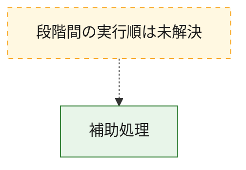
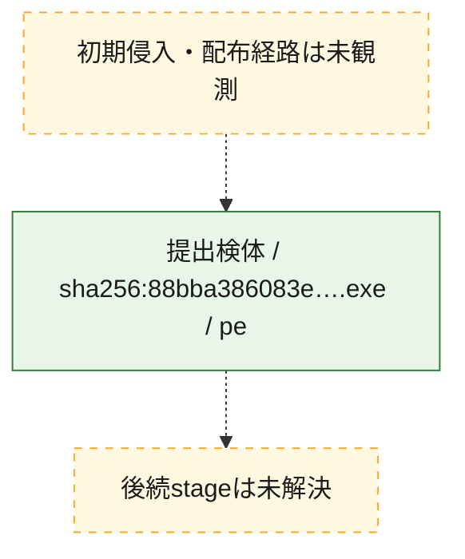
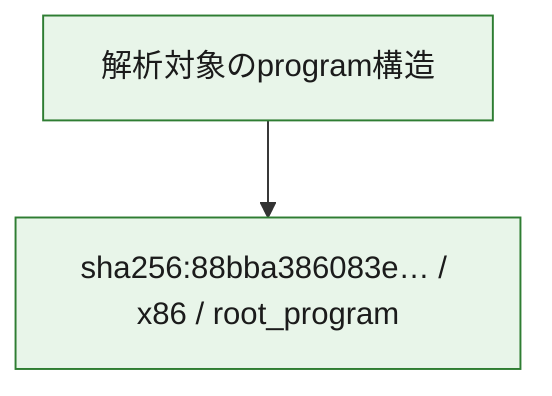

# 全体ロジック：88bba386083e93441241f99a728f93d11200d7c6709d69619d2a7cc551b17b79

代表関数から主要なmalware処理段階を自動分類できませんでした。

## 読み方

- phaseの掲載順は解析上の整理順です。observed_call_edgesがない段階間の実行順を断定しません。
- 図の実線は静的に観測した関係、点線と黄色のノードは未観測・未解決の関係を示します。
- 図は静的な要約であり、動的実行を再現するものではありません。
- 詳細な関数解説とfingerprintは[STATIC-LOGIC.md](STATIC-LOGIC.md)を参照してください。

## 静的可視化

### 実行フロー

### 感染チェーン

### モジュール関係

## 処理段階

### 1. 補助処理

主要処理を支える一般内部関数またはlibrary処理を確認します。
確度: `confirmed_static_function_evidence_with_limits`

- `88bba386083e93441241f99a728f93d11200d7c6709d69619d2a7cc551b17b79:ghidra:140001b90` — 検体内部の一般処理を実装する関数です。 状態: `limited_bad_instruction_or_flow`、選定理由: `context_representative`, `reviewed_call_centrality:1`
- `88bba386083e93441241f99a728f93d11200d7c6709d69619d2a7cc551b17b79:ghidra:140001cb4` — 検体内部の一般処理を実装する関数です。 状態: `limited_bad_instruction_or_flow`、選定理由: `context_representative`, `reviewed_call_centrality:1`
- `88bba386083e93441241f99a728f93d11200d7c6709d69619d2a7cc551b17b79:ghidra:140001cd8` — 検体内部の一般処理を実装する関数です。 状態: `limited_bad_instruction_or_flow`、選定理由: `context_representative`, `reviewed_call_centrality:1`
- `88bba386083e93441241f99a728f93d11200d7c6709d69619d2a7cc551b17b79:ghidra:140001d5c` — 検体内部の一般処理を実装する関数です。 状態: `limited_bad_instruction_or_flow`、選定理由: `context_representative`, `reviewed_call_centrality:1`
- `88bba386083e93441241f99a728f93d11200d7c6709d69619d2a7cc551b17b79:ghidra:140001db0` — 検体内部の一般処理を実装する関数です。 状態: `limited_bad_instruction_or_flow`、選定理由: `context_representative`, `reviewed_call_centrality:1`
- `88bba386083e93441241f99a728f93d11200d7c6709d69619d2a7cc551b17b79:ghidra:140001ee8` — 検体内部の一般処理を実装する関数です。 状態: `limited_bad_instruction_or_flow`、選定理由: `context_representative`, `reviewed_call_centrality:1`
- `88bba386083e93441241f99a728f93d11200d7c6709d69619d2a7cc551b17b79:ghidra:140001f1c` — 検体内部の一般処理を実装する関数です。 状態: `limited_bad_instruction_or_flow`、選定理由: `context_representative`, `reviewed_call_centrality:1`
- `88bba386083e93441241f99a728f93d11200d7c6709d69619d2a7cc551b17b79:ghidra:140001f98` — 検体内部の一般処理を実装する関数です。 状態: `limited_bad_instruction_or_flow`、選定理由: `context_representative`, `reviewed_call_centrality:1`
- `88bba386083e93441241f99a728f93d11200d7c6709d69619d2a7cc551b17b79:ghidra:140002070` — 検体内部の一般処理を実装する関数です。 状態: `limited_bad_instruction_or_flow`、選定理由: `context_representative`, `reviewed_call_centrality:1`
- `88bba386083e93441241f99a728f93d11200d7c6709d69619d2a7cc551b17b79:ghidra:140002178` — 検体内部の一般処理を実装する関数です。 状態: `limited_bad_instruction_or_flow`、選定理由: `context_representative`, `reviewed_call_centrality:1`
- `88bba386083e93441241f99a728f93d11200d7c6709d69619d2a7cc551b17b79:ghidra:140002288` — 検体内部の一般処理を実装する関数です。 状態: `limited_bad_instruction_or_flow`、選定理由: `context_representative`, `reviewed_call_centrality:1`
- `88bba386083e93441241f99a728f93d11200d7c6709d69619d2a7cc551b17b79:ghidra:1400023bc` — 検体内部の一般処理を実装する関数です。 状態: `limited_bad_instruction_or_flow`、選定理由: `context_representative`, `reviewed_call_centrality:1`
- `88bba386083e93441241f99a728f93d11200d7c6709d69619d2a7cc551b17b79:ghidra:140002468` — 検体内部の一般処理を実装する関数です。 状態: `limited_bad_instruction_or_flow`、選定理由: `context_representative`, `reviewed_call_centrality:1`
- `88bba386083e93441241f99a728f93d11200d7c6709d69619d2a7cc551b17b79:ghidra:140002504` — 検体内部の一般処理を実装する関数です。 状態: `limited_bad_instruction_or_flow`、選定理由: `context_representative`, `reviewed_call_centrality:1`
- `88bba386083e93441241f99a728f93d11200d7c6709d69619d2a7cc551b17b79:ghidra:140002688` — 検体内部の一般処理を実装する関数です。 状態: `limited_bad_instruction_or_flow`、選定理由: `context_representative`, `reviewed_call_centrality:1`
- `88bba386083e93441241f99a728f93d11200d7c6709d69619d2a7cc551b17b79:ghidra:140002854` — 検体内部の一般処理を実装する関数です。 状態: `limited_bad_instruction_or_flow`、選定理由: `context_representative`, `reviewed_call_centrality:1`
- `88bba386083e93441241f99a728f93d11200d7c6709d69619d2a7cc551b17b79:ghidra:140002a6c` — 検体内部の一般処理を実装する関数です。 状態: `limited_bad_instruction_or_flow`、選定理由: `context_representative`, `reviewed_call_centrality:1`
- `88bba386083e93441241f99a728f93d11200d7c6709d69619d2a7cc551b17b79:ghidra:140002ab0` — 検体内部の一般処理を実装する関数です。 状態: `limited_bad_instruction_or_flow`、選定理由: `context_representative`, `reviewed_call_centrality:1`
- `88bba386083e93441241f99a728f93d11200d7c6709d69619d2a7cc551b17b79:ghidra:140002b00` — 検体内部の一般処理を実装する関数です。 状態: `limited_bad_instruction_or_flow`、選定理由: `context_representative`, `reviewed_call_centrality:1`
- `88bba386083e93441241f99a728f93d11200d7c6709d69619d2a7cc551b17b79:ghidra:140002bc4` — 検体内部の一般処理を実装する関数です。 状態: `limited_bad_instruction_or_flow`、選定理由: `context_representative`, `reviewed_call_centrality:1`
- `88bba386083e93441241f99a728f93d11200d7c6709d69619d2a7cc551b17b79:ghidra:140002c9c` — 検体内部の一般処理を実装する関数です。 状態: `limited_bad_instruction_or_flow`、選定理由: `context_representative`, `reviewed_call_centrality:1`
- `88bba386083e93441241f99a728f93d11200d7c6709d69619d2a7cc551b17b79:ghidra:140002d88` — 検体内部の一般処理を実装する関数です。 状態: `limited_bad_instruction_or_flow`、選定理由: `context_representative`, `reviewed_call_centrality:1`
- `88bba386083e93441241f99a728f93d11200d7c6709d69619d2a7cc551b17b79:ghidra:140002e40` — 検体内部の一般処理を実装する関数です。 状態: `limited_bad_instruction_or_flow`、選定理由: `context_representative`, `reviewed_call_centrality:1`
- `88bba386083e93441241f99a728f93d11200d7c6709d69619d2a7cc551b17b79:ghidra:140003274` — 検体内部の一般処理を実装する関数です。 状態: `limited_bad_instruction_or_flow`、選定理由: `context_representative`, `reviewed_call_centrality:1`
- `88bba386083e93441241f99a728f93d11200d7c6709d69619d2a7cc551b17b79:ghidra:14000337c` — 検体内部の一般処理を実装する関数です。 状態: `limited_bad_instruction_or_flow`、選定理由: `context_representative`, `reviewed_call_centrality:1`
- `88bba386083e93441241f99a728f93d11200d7c6709d69619d2a7cc551b17b79:ghidra:14000348c` — 検体内部の一般処理を実装する関数です。 状態: `limited_bad_instruction_or_flow`、選定理由: `context_representative`, `reviewed_call_centrality:1`
- `88bba386083e93441241f99a728f93d11200d7c6709d69619d2a7cc551b17b79:ghidra:1400035a4` — 検体内部の一般処理を実装する関数です。 状態: `limited_bad_instruction_or_flow`、選定理由: `context_representative`, `reviewed_call_centrality:1`
- `88bba386083e93441241f99a728f93d11200d7c6709d69619d2a7cc551b17b79:ghidra:140003620` — 検体内部の一般処理を実装する関数です。 状態: `limited_bad_instruction_or_flow`、選定理由: `context_representative`, `reviewed_call_centrality:1`
- `88bba386083e93441241f99a728f93d11200d7c6709d69619d2a7cc551b17b79:ghidra:1400036ac` — 検体内部の一般処理を実装する関数です。 状態: `limited_bad_instruction_or_flow`、選定理由: `context_representative`, `reviewed_call_centrality:1`
- `88bba386083e93441241f99a728f93d11200d7c6709d69619d2a7cc551b17b79:ghidra:14000378c` — 検体内部の一般処理を実装する関数です。 状態: `limited_bad_instruction_or_flow`、選定理由: `context_representative`, `reviewed_call_centrality:1`
- `88bba386083e93441241f99a728f93d11200d7c6709d69619d2a7cc551b17b79:ghidra:140003848` — 検体内部の一般処理を実装する関数です。 状態: `limited_bad_instruction_or_flow`、選定理由: `context_representative`, `reviewed_call_centrality:1`
- `88bba386083e93441241f99a728f93d11200d7c6709d69619d2a7cc551b17b79:ghidra:1400038fc` — 検体内部の一般処理を実装する関数です。 状態: `limited_bad_instruction_or_flow`、選定理由: `context_representative`, `reviewed_call_centrality:1`

## 観測したcall関係

- `ghidra-function:000c389fb91c39747c6640e6` → `ghidra-external:5819f80486ded22d82d23473` （`unclassified` → `unclassified`）
- `ghidra-function:0c6ddb019d5bb22451083016` → `ghidra-external:5819f80486ded22d82d23473` （`unclassified` → `unclassified`）
- `ghidra-function:0d1b8bcc8e6c021300877f15` → `ghidra-external:5819f80486ded22d82d23473` （`unclassified` → `unclassified`）
- `ghidra-function:1174c6b95dd122c94f69f83e` → `ghidra-external:5819f80486ded22d82d23473` （`unclassified` → `unclassified`）
- `ghidra-function:126b65f63d60acc942f3205f` → `ghidra-external:5819f80486ded22d82d23473` （`unclassified` → `unclassified`）
- `ghidra-function:2109e968b91527688c8ebf7d` → `ghidra-external:5819f80486ded22d82d23473` （`unclassified` → `unclassified`）
- `ghidra-function:2938426e66f4e6d6362c25bc` → `ghidra-external:5819f80486ded22d82d23473` （`unclassified` → `unclassified`）
- `ghidra-function:352ca9e76b1cd24aa0c60797` → `ghidra-external:5819f80486ded22d82d23473` （`unclassified` → `unclassified`）
- `ghidra-function:40d68e58be6eb6ffa7a20fa3` → `ghidra-external:5819f80486ded22d82d23473` （`unclassified` → `unclassified`）
- `ghidra-function:41cd882cb950f30aab877d8b` → `ghidra-external:5819f80486ded22d82d23473` （`unclassified` → `unclassified`）
- `ghidra-function:57cba84750cb5a4ce23c52cb` → `ghidra-external:5819f80486ded22d82d23473` （`unclassified` → `unclassified`）
- `ghidra-function:65de2feaa6ded34c8582d8aa` → `ghidra-external:5819f80486ded22d82d23473` （`unclassified` → `unclassified`）
- `ghidra-function:689729e1310d8fa372d6df84` → `ghidra-external:5819f80486ded22d82d23473` （`unclassified` → `unclassified`）
- `ghidra-function:6ec0a94bbeebafa27bddb841` → `ghidra-external:5819f80486ded22d82d23473` （`unclassified` → `unclassified`）
- `ghidra-function:6f7a8d677abe917aee98e215` → `ghidra-external:5819f80486ded22d82d23473` （`unclassified` → `unclassified`）
- `ghidra-function:824bd7835ed3567c9d9d9225` → `ghidra-external:5819f80486ded22d82d23473` （`unclassified` → `unclassified`）
- `ghidra-function:8d6d6ef359cdb4d1319c8a59` → `ghidra-external:5819f80486ded22d82d23473` （`unclassified` → `unclassified`）
- `ghidra-function:9bdc84481db00bfd3c94d2ea` → `ghidra-external:5819f80486ded22d82d23473` （`unclassified` → `unclassified`）
- `ghidra-function:a822be64241b06a59d0adf37` → `ghidra-external:5819f80486ded22d82d23473` （`unclassified` → `unclassified`）
- `ghidra-function:aa44c3f65efd4d73c08cbce3` → `ghidra-external:5819f80486ded22d82d23473` （`unclassified` → `unclassified`）
- `ghidra-function:bf10c0dddbcdc86b593991b0` → `ghidra-external:5819f80486ded22d82d23473` （`unclassified` → `unclassified`）
- `ghidra-function:bf772119130d7c78252bd0c5` → `ghidra-external:5819f80486ded22d82d23473` （`unclassified` → `unclassified`）
- `ghidra-function:cd0be62fcfe8c22b0fb7e61c` → `ghidra-external:5819f80486ded22d82d23473` （`unclassified` → `unclassified`）
- `ghidra-function:cd2c9bd0e3ea5a2734dc9135` → `ghidra-external:5819f80486ded22d82d23473` （`unclassified` → `unclassified`）
- `ghidra-function:cd3d3cbde0bcfeddf0c278bd` → `ghidra-external:5819f80486ded22d82d23473` （`unclassified` → `unclassified`）
- `ghidra-function:d4c6964b678f6c6f42f7836e` → `ghidra-external:5819f80486ded22d82d23473` （`unclassified` → `unclassified`）
- `ghidra-function:d79cd84ceb43325209638364` → `ghidra-external:5819f80486ded22d82d23473` （`unclassified` → `unclassified`）
- `ghidra-function:da16c9c5c5f79853c1fb9bf3` → `ghidra-external:5819f80486ded22d82d23473` （`unclassified` → `unclassified`）
- `ghidra-function:dbf578e2338624a0b187edae` → `ghidra-external:5819f80486ded22d82d23473` （`unclassified` → `unclassified`）
- `ghidra-function:e24b5651d2e5eeecb18256db` → `ghidra-external:5819f80486ded22d82d23473` （`unclassified` → `unclassified`）
- `ghidra-function:f9b67255a33eb592d1f4f373` → `ghidra-external:5819f80486ded22d82d23473` （`unclassified` → `unclassified`）
- `ghidra-function:fe9dd882c2293e374561f745` → `ghidra-external:5819f80486ded22d82d23473` （`unclassified` → `unclassified`）

## 解析範囲と制約

- 選定外関数は全体inventoryへ残しますが、関数本体の個別解説対象にはしていません。
- indirect call、難読化、packer、VM、壊れたcontrol flowによりcall関係が欠落する場合があります。
- 文書は静的解析に基づき、検体実行や外部通信による動的確認は行っていません。
