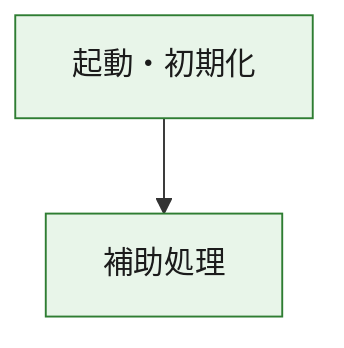
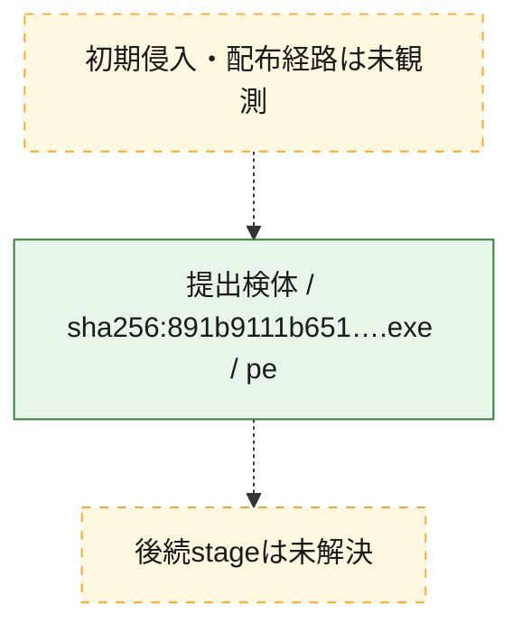
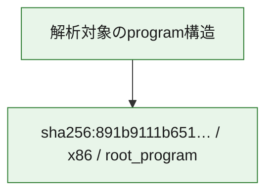

# 全体ロジック：891b9111b651781517b32d7a0e184e45c8424ce4f31bf89478b6e7f151528fc4

代表関数の静的証跡から、起動・初期化の処理群を確認しました。

## 読み方

- phaseの掲載順は解析上の整理順です。observed_call_edgesがない段階間の実行順を断定しません。
- 図の実線は静的に観測した関係、点線と黄色のノードは未観測・未解決の関係を示します。
- 図は静的な要約であり、動的実行を再現するものではありません。
- 詳細な関数解説とfingerprintは[STATIC-LOGIC.md](STATIC-LOGIC.md)を参照してください。

## 静的可視化

### 実行フロー

### 感染チェーン

### モジュール関係

## 処理段階

### 1. 起動・初期化

entry pointから初期化と後続処理への移行を確認します。
確度: `confirmed_static_function_evidence`

- `891b9111b651781517b32d7a0e184e45c8424ce4f31bf89478b6e7f151528fc4:ghidra:180001010` — 初期化と主要処理への分岐を行う入口関数です。 状態: `succeeded`、選定理由: `entry_point`, `meaningful_symbol_name`, `reviewed_call_centrality:22`, `role:entrypoint`, `small_program_complete_context`

### 2. 補助処理

主要処理を支える一般内部関数またはlibrary処理を確認します。
確度: `confirmed_static_function_evidence`

- `891b9111b651781517b32d7a0e184e45c8424ce4f31bf89478b6e7f151528fc4:ghidra:180001240` — 検体内部の一般処理を実装する関数です。 状態: `succeeded`、選定理由: `context_representative`, `reviewed_call_centrality:2`, `small_program_complete_context`
- `891b9111b651781517b32d7a0e184e45c8424ce4f31bf89478b6e7f151528fc4:ghidra:180001350` — 検体内部の一般処理を実装する関数です。 状態: `succeeded`、選定理由: `context_representative`, `reviewed_call_centrality:25`, `small_program_complete_context`
- `891b9111b651781517b32d7a0e184e45c8424ce4f31bf89478b6e7f151528fc4:ghidra:180003780` — 検体内部の一般処理を実装する関数です。 状態: `succeeded`、選定理由: `context_representative`, `reviewed_call_centrality:2`, `small_program_complete_context`
- `891b9111b651781517b32d7a0e184e45c8424ce4f31bf89478b6e7f151528fc4:ghidra:1800038e0` — 検体内部の一般処理を実装する関数です。 状態: `succeeded`、選定理由: `context_representative`, `reviewed_call_centrality:2`, `small_program_complete_context`

## 観測したcall関係

- `891b9111b651781517b32d7a0e184e45c8424ce4f31bf89478b6e7f151528fc4:ghidra:180001010` → `891b9111b651781517b32d7a0e184e45c8424ce4f31bf89478b6e7f151528fc4:ghidra:180001240` （`startup` → `support`）
- `891b9111b651781517b32d7a0e184e45c8424ce4f31bf89478b6e7f151528fc4:ghidra:180001010` → `891b9111b651781517b32d7a0e184e45c8424ce4f31bf89478b6e7f151528fc4:ghidra:180001350` （`startup` → `support`）
- `891b9111b651781517b32d7a0e184e45c8424ce4f31bf89478b6e7f151528fc4:ghidra:180001350` → `891b9111b651781517b32d7a0e184e45c8424ce4f31bf89478b6e7f151528fc4:ghidra:180001240` （`support` → `support`）
- `891b9111b651781517b32d7a0e184e45c8424ce4f31bf89478b6e7f151528fc4:ghidra:180001350` → `891b9111b651781517b32d7a0e184e45c8424ce4f31bf89478b6e7f151528fc4:ghidra:180003780` （`support` → `support`）
- `891b9111b651781517b32d7a0e184e45c8424ce4f31bf89478b6e7f151528fc4:ghidra:180001350` → `891b9111b651781517b32d7a0e184e45c8424ce4f31bf89478b6e7f151528fc4:ghidra:1800038e0` （`support` → `support`）
- `891b9111b651781517b32d7a0e184e45c8424ce4f31bf89478b6e7f151528fc4:ghidra:180003780` → `891b9111b651781517b32d7a0e184e45c8424ce4f31bf89478b6e7f151528fc4:ghidra:1800038e0` （`support` → `support`）
- `ghidra-function:01b48c0ac23a587e7892dadf` → `ghidra-function:e239b927a12d39b10fcf1d28` （`unclassified` → `unclassified`）
- `ghidra-function:835f0ef45f3956c496f281ac` → `ghidra-external:03208336622a76483e1503c6` （`unclassified` → `unclassified`）
- `ghidra-function:835f0ef45f3956c496f281ac` → `ghidra-external:0bb19fcd4aebc9288e92a41c` （`unclassified` → `unclassified`）
- `ghidra-function:835f0ef45f3956c496f281ac` → `ghidra-external:14d3532aed8a3c4b58354cd9` （`unclassified` → `unclassified`）
- `ghidra-function:835f0ef45f3956c496f281ac` → `ghidra-external:170543df9de4a1b13909d5f2` （`unclassified` → `unclassified`）
- `ghidra-function:835f0ef45f3956c496f281ac` → `ghidra-external:2fbeca73b9641287e3756855` （`unclassified` → `unclassified`）
- `ghidra-function:835f0ef45f3956c496f281ac` → `ghidra-external:339284ade8ec7ac76ba4662a` （`unclassified` → `unclassified`）
- `ghidra-function:835f0ef45f3956c496f281ac` → `ghidra-external:3608db6542d753030e7dfa84` （`unclassified` → `unclassified`）
- `ghidra-function:835f0ef45f3956c496f281ac` → `ghidra-external:40a6ecbdf0d5cdf2bffd0895` （`unclassified` → `unclassified`）
- `ghidra-function:835f0ef45f3956c496f281ac` → `ghidra-external:48515338d4b236786d613c48` （`unclassified` → `unclassified`）
- `ghidra-function:835f0ef45f3956c496f281ac` → `ghidra-external:63c6617cac59fe1e933accc4` （`unclassified` → `unclassified`）
- `ghidra-function:835f0ef45f3956c496f281ac` → `ghidra-external:6c422de82d57b98b9a0fa6fa` （`unclassified` → `unclassified`）
- `ghidra-function:835f0ef45f3956c496f281ac` → `ghidra-external:779261d3cfdd1e6c14be9238` （`unclassified` → `unclassified`）
- `ghidra-function:835f0ef45f3956c496f281ac` → `ghidra-external:8223334130fbc35be70ceef4` （`unclassified` → `unclassified`）
- `ghidra-function:835f0ef45f3956c496f281ac` → `ghidra-external:91fe97c84f382da33035caef` （`unclassified` → `unclassified`）
- `ghidra-function:835f0ef45f3956c496f281ac` → `ghidra-external:a9fcd9555f7d9dee424d4536` （`unclassified` → `unclassified`）
- `ghidra-function:835f0ef45f3956c496f281ac` → `ghidra-external:bf7c41c27bc4292e00a0a67a` （`unclassified` → `unclassified`）
- `ghidra-function:835f0ef45f3956c496f281ac` → `ghidra-external:c8096a17d70b820b7144c1d1` （`unclassified` → `unclassified`）
- `ghidra-function:835f0ef45f3956c496f281ac` → `ghidra-external:dc5159178a4a5e05c6b878d1` （`unclassified` → `unclassified`）
- `ghidra-function:835f0ef45f3956c496f281ac` → `ghidra-external:e15879022181736ef10263df` （`unclassified` → `unclassified`）
- `ghidra-function:835f0ef45f3956c496f281ac` → `ghidra-external:e2aa962f803a618210204ca0` （`unclassified` → `unclassified`）
- `ghidra-function:835f0ef45f3956c496f281ac` → `ghidra-external:f8bafd018a19f4d8ca09a908` （`unclassified` → `unclassified`）
- `ghidra-function:835f0ef45f3956c496f281ac` → `ghidra-function:01b48c0ac23a587e7892dadf` （`unclassified` → `unclassified`）
- `ghidra-function:835f0ef45f3956c496f281ac` → `ghidra-function:c9daf3a20addf0efa5b9b834` （`unclassified` → `unclassified`）
- `ghidra-function:835f0ef45f3956c496f281ac` → `ghidra-function:e239b927a12d39b10fcf1d28` （`unclassified` → `unclassified`）
- `ghidra-function:8c9cce3b7ca5dcc3a4b3b622` → `ghidra-function:2b2829beaed82ce86da7d400` （`unclassified` → `unclassified`）
- `ghidra-function:8c9cce3b7ca5dcc3a4b3b622` → `ghidra-function:35e913265ea316b88b12d1d1` （`unclassified` → `unclassified`）
- `ghidra-function:8c9cce3b7ca5dcc3a4b3b622` → `ghidra-function:47767a503ffd14ef7d487d3c` （`unclassified` → `unclassified`）
- `ghidra-function:8c9cce3b7ca5dcc3a4b3b622` → `ghidra-function:56c9b91b48763400f6a2afe6` （`unclassified` → `unclassified`）
- `ghidra-function:8c9cce3b7ca5dcc3a4b3b622` → `ghidra-function:835f0ef45f3956c496f281ac` （`unclassified` → `unclassified`）
- `ghidra-function:8c9cce3b7ca5dcc3a4b3b622` → `ghidra-function:86d95d9a258012aee298a900` （`unclassified` → `unclassified`）
- `ghidra-function:8c9cce3b7ca5dcc3a4b3b622` → `ghidra-function:94cc0ad69717f7b6597d18e2` （`unclassified` → `unclassified`）
- `ghidra-function:8c9cce3b7ca5dcc3a4b3b622` → `ghidra-function:a0c97731e6ee74503206364d` （`unclassified` → `unclassified`）
- `ghidra-function:8c9cce3b7ca5dcc3a4b3b622` → `ghidra-function:a90df85670b8095ed8a28da0` （`unclassified` → `unclassified`）
- `ghidra-function:8c9cce3b7ca5dcc3a4b3b622` → `ghidra-function:bca93f1e26397075000308b7` （`unclassified` → `unclassified`）
- `ghidra-function:8c9cce3b7ca5dcc3a4b3b622` → `ghidra-function:c9daf3a20addf0efa5b9b834` （`unclassified` → `unclassified`）
- `ghidra-function:8c9cce3b7ca5dcc3a4b3b622` → `ghidra-function:d1d2d56aee7e0fa836df09f8` （`unclassified` → `unclassified`）

## 解析範囲と制約

- 選定外関数は全体inventoryへ残しますが、関数本体の個別解説対象にはしていません。
- indirect call、難読化、packer、VM、壊れたcontrol flowによりcall関係が欠落する場合があります。
- 文書は静的解析に基づき、検体実行や外部通信による動的確認は行っていません。
